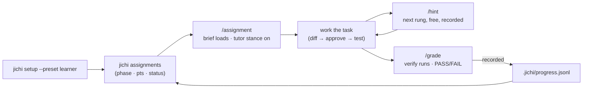
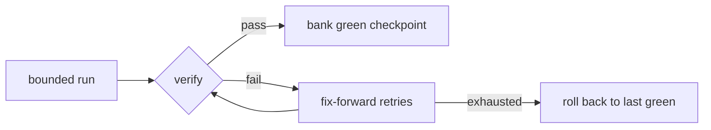
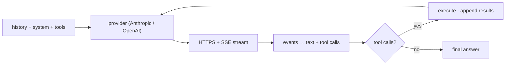

# Changelog

All notable, **user-visible** changes to jichi, newest first — so nobody has
to parse the git history to learn what changed. The format loosely follows
[Keep a Changelog](https://keepachangelog.com/); versions follow
[Semantic Versioning](https://semver.org/), pre-1.0: MINOR bumps mark a
completed capability cluster or a breaking change (config keys, CLI,
wire/JSONL contracts), PATCH bumps mark fixes. **The first public release is
pre-1.0** (decided 2026-08-19) — this paragraph used to reserve 1.0.0 for it,
but 1.0 is a claim about interface stability and the honest time to make it is
after the interfaces have met someone else's machine. What a first release
promises is [`docs/EMBEDDING.md`](docs/EMBEDDING.md)'s four stability tiers.

> **Honesty note.** Versions **0.1.0–0.8.0 are retrospective labels**: the
> project grew by milestones (M1–M177, see [`docs/ROADMAP.md`](docs/ROADMAP.md)),
> not tagged releases, and these bands were named after the fact so this
> document has a spine. **0.9.0 is the first version stamped while it was
> current.** For engineering depth per milestone, read the ROADMAP; for the
> project retrospective with metrics, read
> [`docs/PROJECT_TIMELINE.md`](docs/PROJECT_TIMELINE.md).

The version lives in one place — `include/jc_version.h` — and is printed by
`jichi --version`, `jichi-convert --version`, the top of `jichi doctor`, and
the `describe` interface contract.

## [Unreleased]

> **Coverage note (M402).** This section had stopped at **M326z** while the project
> reached **M401** — seventy-five milestones of user-visible change that a reader
> would have had to parse the git history for, which is the one thing this file
> exists to prevent. The M327–M401 band is written up below in themed entries,
> newest band first, each naming its milestones; per-milestone detail with the
> reasoning stays in [`docs/ROADMAP.md`](docs/ROADMAP.md). Catching up cost one
> afternoon; leaving it uncaught cost the file its purpose.

### Added

- **The first public snapshot is prepared** (M620). `make-snapshot.sh --commit` produced the
  curated single-commit public tree (LICENSE + NOTICE included, deliberately authored),
  verified to build and pass its suite standalone; the release plan's gates and open
  questions are marked answered where they landed. The documentation stays under the same
  Apache-2.0 as the code — decided against a CC BY-SA split because the docs are executable
  and their fixtures are meant to be copied into solutions (DECISIONS, M620). Publication
  (push + tag) is a separate act.

- **jichi is licensed: Apache-2.0** (M619, decided 2026-08-27). `LICENSE` is the verbatim
  checksummed text; `NOTICE` travels with redistributions; every tracked source carries the
  three-line header (`SPDX-License-Identifier: Apache-2.0`, `Copyright (c) 2026
  Justus-Liebig-Universität Gießen`, `Author: Alexander-Lars Dallmann` -- § 69b UrhG
  separates holder and author); `--version` prints all three and `describe` gains an
  `author` field. `license_lint` pins every surface to one identifier, and
  `scripts/set-license.sh` can now perform a deliberate switch (an MIT candidate stands
  ready, should the review choose it). This also unblocks `make-snapshot.sh --commit`.

- **The task list survives a resume** (M606). `todowrite`/`todoread` now act on a list the
  SESSION owns: it is saved in the session file (`"todos"`, beside a new store version
  `"v":2`), restored by `--continue`/`--resume`, the TUI `/resume` and ACP `session/load`,
  copied by `/fork`, and cleared by `/clear` together with the history. Before, the list
  lived in the process alone: a resumed conversation read "(todo list is empty)" beside a
  history full of todos, and a `/resume` into another conversation kept the previous one's
  list. A session file written by a newer jichi loads with one warning instead of being
  refused. `tests/smoke/todo_resume.sh`, born red on the M605 binary.

- **`tests/bench/mentor_ab/` -- the mentor A/B harness, tracked** (M605). The scripts that
  produced the eight blinded mentor drafts of 2026-08-27 (`run-arms.sh`, `blind.sh`) are
  parametrized (two pinned binaries, a config, a key file, `workspace:log` pairs) and live
  beside the craft A/B, so the numbers in the analysis page name a runnable command. A
  measurement, never a gate: live model, free `jlu/*` only, no caps but connect.

- **The two M600 note trailers are registered in `NOTICES.md`** (M604) as known
  bracket-shaped prose: `[evidence: …]` and `[pins: …]` are authored by the mentor and reach
  the model only inside a remembered note; `notice_tags_lint` had flagged them as emitted
  tags without a row, which is the registry doing what M368 built it for.

- **The mentor reads the project's glossary** (M603). `learn.md` inlines
  `.jichi/glossary.md` when it exists, and the starter glossary of jichi's own terms
  now ships with the `default` pack as well as `assignments`, so lessons are drafted in
  the words the notes and the `learn analyze` report use. A project without a glossary
  gets nothing inlined (a shell block, not an `@file`, so no "[could not read]" note).
  `tests/smoke/subtask_persona.sh` check 6 reads the glossary in the mentor's request.

- **The mentor may propose refusals: a `## Checks` section committed as authored
  constraints** (M602). `- constraint: do not run the build` in the reviewed draft becomes,
  on `learn apply`, an entry in `.jichi/constraints.md` enforced at the tool gate — the
  loop's first output that does not depend on the model remembering it. Phrases the
  scanner cannot read are counted and named; `hook:` bullets are counted as unsupported
  (hooks stay a config.json decision, `DEFERRED.md`). Propose-only is unchanged.
  `tests/smoke/learn_checks.sh` pins the effect: the next run's `make` is refused.

- **A `## Corrections` directive retracts a learned convention from the rules file**
  (M601). `remove:` / `replace:` now act on the `## Learned conventions` section of
  `AGENTS.md`/`CLAUDE.md` as well as on `memory.md`; hand-written rules above the heading
  are never touched. The loop could append a rule since M106 and take one back only now.
  `tests/smoke/learn_retract.sh` reads the file back.

- **A memory note carries its provenance, `learn analyze` says what holds it, and
  `learn apply` names the corrections it could not read** (M600). The mentor's
  `[evidence: …]` trailer is kept on commit (it was stripped), a `[pins: tests/…]`
  trailer names the check that holds a lesson, `learn analyze` prints the injection
  budget as a fraction, the pinned share, and any cited path that no longer resolves in
  the workspace, and a `## Corrections` bullet that is prose rather than
  `remove:`/`replace:` is counted and reported instead of vanishing. `LEARNING.md`,
  `MEMORY.md`.

- **learn-on-stop reports what its draft would commit** (M598). After the mentor writes
  `.jichi/lessons.draft.md`, the run parses it with `learn apply`'s own parser and prints the
  counts; a draft with bytes and no parseable section is named at WARN -- *"applying it
  would commit nothing"* -- and the journal's `learn_on_stop` event carries
  `draft_items` / `draft_parsed_nothing`, which `jichi runs` renders as `draft=empty`.
  Until now an unappliable draft looked exactly like a good one until someone ran apply.

- **`language:` frontmatter on custom commands** (M597) pins the answer language for
  that command's run, replacing config `language`. It exists for one decision: lessons
  are stored in the user's language by default, and `language: English` on
  `.jichi/commands/learn.md` is the English-canonical option -- the mentor drafts in
  English while the session still tutors in yours. `COMMANDS.md`, `LANGUAGE.md`,
  `LEARNING.md`.

### Changed

- **Telemetry `metrics` is on by default, one appended log per workspace, and the
  readers prefer it** (M599). The operator's decision: *"telemetry should be on by default,
  otherwise a learner forgets"* — measured the same day, jichi's own workspace had no
  telemetry at all, so `learn analyze` had nothing to read. The default log is now
  `~/.jichi.d/telemetry/<workspace>-<key>.jsonl`, appended across runs (one `<run-id>.jsonl`
  per run gave the miner a one-run memory), and `telemetry`, `learn analyze`, `dream`,
  `improve` and `doctor` open this workspace's file before falling back to the newest one.
  `metrics` records numbers and names, never a prompt, a response or code; `full` stays
  opt-in; `--log-level off` / `--log -` / `"logging":{"level":"off"}` turn it off.
  `tests/smoke/telemetry_default.sh` pins the three properties. Retention is still manual
  (`DEFERRED.md`).

- **The answer-language directive now reaches every `subtask: true` command** (M597).
  It was top-level only, on the reasoning that a delegate's prose is consumed by the main
  agent -- true for spawned delegates, which keep that behaviour, and false for a command
  subtask, whose answer streams to the user or is written to disk. The mentor of a German
  self-learner drafted English lessons while `LANGUAGE.md` said the mentor loop inherited
  the language "for free". `tests/smoke/subtask_language.sh` pins both the directive and
  the frontmatter override on the wire.

- **`AUTONOMY.md` now says which budget actually binds a run, and why** (M595). The four
  budgets read like peers; in practice one decides and the others are decoration, and which
  one is a division you can do before the run: with token budget `B`, call cap `C` and `t`
  tokens per model call, tokens bind when `B / t < C`. `t` belongs to the **backend** — 21–35k
  per call on a cacheless local server, against 92% cache read on one HRZ session — so a token
  cap on a cacheless model converts almost exactly into a call count. `jichi telemetry` prints
  `t` as `input/call (est)`. The table of six measured runs is in AUTONOMY.md §1.

### Changed

- **`prune` sweeps stale attempt/improve/workflow worktrees, never a live run's** (M616).
  `~/.jichi.d/worktrees/` grew forever after `--keep-worktree`, a SIGKILL or a deadline
  kill; `prune` now trims it by the same selectors, restricted to the names jichi mints
  (`att-`/`imp-`/`wf-<pid>`) and never a directory whose embedded pid is alive. The report
  gains a `worktree(s)` count. `tests/smoke/prune_worktrees.sh`, born red.

- **`prune` trims the codebase-index cache too, protecting the current workspace's own index** (M612).
  `~/.jichi.d/index/<key>/` grew one directory per distinct workspace with no eviction; `prune`
  now sweeps it by the same `--keep`/`--older-than` selectors (an index is a rebuildable cache, so
  it is swept by default), never deleting the index of the workspace you run `prune` in. The report
  gained an `index(es)` count. `tests/smoke/prune_index.sh`, born red.

- **`prune` trims dreams, and `dream` records a delta instead of a duplicate** (M611).
  `~/.jichi.d/dreams/` had no retention (the daemon's `--idle-dream` grows it unboundedly);
  `prune --keep N`/`--older-than DUR` now applies to dreams as well as sessions, reported
  apart. A dream identical to the most recent one is no longer written (so an idle daemon
  stops piling up dated duplicates), and the dated filename is collision-proof (two dreams
  in one second used to clobber a propose-only draft). `tests/smoke/dream.sh` (now 6),
  `tests/smoke/prune_dreams.sh`, born red.

- **The arena lint audits the whole tree** (M610). The guard against per-call data on the
  session arena scanned eight hand-picked directories (75 files, floored at 50); it now
  scans every `src/*.c` except `main.c` (174 files, floored at that exact count), so a new
  directory cannot fall outside its universe -- which had left `src/util/jc_learn.c`
  unaudited. A related per-turn/per-call arena slip in `spawn_parallel`'s merge is fixed.

- **The workflow parser no longer drops stages or items silently** (M610). A spec with more
  than 16 stages or 64 items per stage, or an unknown stage type, was truncated and run as a
  success; `jc_workflow_parse` now counts what it dropped and `jichi workflow` prints a
  warning naming the limits. `test_parse`, born red.

### Fixed

- **The hint-ladder shortfall reaches the brief, and new assignments cannot ship unproven**
  (M618). A spec whose hints the YAML subset cannot read now says so in the rendered brief
  itself (one place: `assign`, the TUI, and the `attempt` brief share it -- it reached only
  the CLI `hint` before), and `curriculum_universe_lint.sh` pins every shipped spec to the
  two-sided grader proof in `curriculum_graders.py` (77/77 today, floored there).
  `ASSIGNMENTS.md` gains two honest sentences: where `--record` rows land, and why `pct`
  can read 100 on a failed verify.

- **A wrong-directory FAIL says so, and the tutor cannot spend the learner's hints** (M617).
  Twelve shipped specs (the intro and plain-language tiers) use `grep`/`[` as the verify
  program, so M502's reachability guard could not fire and a grade from the wrong directory
  read as a real FAIL; the grade line now carries a note when the verify references a
  directory that does not exist from here (a note beside a FAIL, never a refusal -- a
  missing directory can also be part of the task). And in tutor mode the `hint` tool is
  fenced: it no longer reveals rungs, moves the counter, or writes hints.jsonl rows
  attributed to the human learner. `grade_wrongdir.sh` and the tutor unit case, born red.

- **Honest attempt verdicts** (M615). `attempt` now refuses what it cannot grade -- an
  unreachable verify program or an unenterable worktree exits 2 with "This is NOT a grade
  (nothing was recorded)", where both used to score FAIL and `--record` wrote it into the
  learner's progress file; and it runs the spec's `setup` inside the worktree, as `grade`
  always did. A `write_file` that overwrites a gate wholesale is now TAINTED like an
  `edit_file` that moves an assertion (same M88 predicate, third write path); and the
  `improve --attempt` rehearsal runs under a metering envelope, so a gutted gate reads
  `TAINTED ... NOT counted as fixed` instead of raising the pass-rate. Three drivers born
  red: `attempt_tainted.sh` 8->11, new `attempt_guard.sh`, new `improve_tainted.sh`.

- **The TUI records hint pulls, and `/grade` cannot mis-record a broken harness** (M614).
  `/hint` was the one hint writer that appended nothing to `.jichi/hints.jsonl` (the CLI
  and the `hint` tool both record), though the docs promise "recorded, never penalised";
  and `/grade` was a fourth inline grading implementation without the M502 reachability
  guard, recording `FAIL 0%` into `progress.jsonl` when the verify could not even run.
  The grading mechanic now lives in `jc_gradecore.c` with the TUI as its fourth caller:
  an unrunnable verify answers "This is NOT a grade (nothing was recorded)". The mechanic
  gained its first direct unit test; `learner_flow.sh` 9 -> 12 checks, born red by teeth.

- **The assignment brief arrives whole** (M613). The hint-availability note was staged
  through a 192-byte buffer and silently truncated, so every shipped spec's brief -- and
  the task text `attempt` hands the solving model -- ended mid-word ("...or delega").
  Now appended unbounded; the render test pins the final sentence of both framings,
  born red.

- **The LSP framer's header block and `Content-Length` are bounded by construction** (M609).
  M472 capped the message *body* at 64 MB but left the header block before `\r\n\r\n`
  unbounded and the `Content-Length` accumulator unguarded against overflow -- a language
  server that never sends the header terminator grew the buffer toward an OOM, and a length
  that wrapped to a small value desynced the stream. A 64 KB header cap (resync on
  overflow) and an overflow guard close both. `test_framer`, born red. (The sibling MCP/ACP
  line buffers and the blocking `waitpid` at shutdown are recorded in `docs/DEFERRED.md`:
  real, one-line fixes, but their born-red tests need a harness the smoke tier lacks.)

- **The API key is scrubbed from every child jichi forks, including the ones a
  subcommand forks before the agent loop exists; and jichi's own key names are built in**
  (M608). The secret registry was armed after the subcommand dispatch chain, so
  `brief-check --verify CMD` ran CMD with the configured key variable intact; and the
  built-in scrub list held thirteen provider names and neither `JICHI_API_KEY` nor
  `JLU_API_KEY`, so a stray export of jichi's own key reached every shell tool, hook,
  verifier and MCP server. Arming now follows the config load; both names lead the list.
  `tests/smoke/secret_env_subcommands.sh` (born red 2/3) and `secret_env_lint.sh`, which
  pins every shipped `apiKeyEnv` default to a row on the list and the arming's position.

- **A dangling symlink no longer carries a write out of the workspace** (M607). The path
  fence resolves a not-yet-existing target by canonicalizing its parent and re-appending
  the leaf; a leaf that is a symlink to a target that does not exist yet was re-appended
  verbatim, judged inside, and `fopen` then followed it -- `notes.md -> /elsewhere/x`
  planted in a workspace carried `write_file` out of it under `--auto`. The resolver now
  follows such a leaf to its target (relative targets against the link's directory, at
  most 40 hops; a cycle fails closed), so every fence caller gets the same answer. A
  symlink to an existing outside target was always caught; a symlink to a not-yet-written
  *inside* target is still allowed. `tests/smoke/pathfence_dangling.sh`, born red.

- **A command's `agent:` persona now reaches its `subtask: true` run** (M596). The
  scaffolded `/learn` mentor -- and `/onboard`'s project-analyst -- ran under the generic
  "You are a focused sub-agent" prompt since M28: `jc_agent_run_command_subtask` never read
  the persona the command had set, so the mentor's `FORMAT IS STRICT` block (the five
  headings `learn apply` parses) was never delivered. Reproduced from a captured request
  (0 bytes of `mentor.md` in it); now `jc_sysmsg_build_sub_as` makes the persona the
  identity paragraph and still appends the enforced sections. The same builder serves
  profiled `spawn_subagent` / `spawn_parallel` / `ask_for_help` delegates, which until now
  received the bare profile text and none of the rules jichi enforces at depth.
  `tests/smoke/subtask_persona.sh` pins it on the wire.

- **`read_file` reported the truncated buffer's line count as the file's** (M594). When a
  read hit `readMaxBytes` and the requested range fell beyond it, the tool answered
  *"(no lines in range; file has N lines)"* where N counted only what was returned — so a
  12,509-line file was reported as having 4,027 lines, and a model looking for line 11,715
  was told the content does not exist. The whole file is in memory (only the *output* is
  capped), so both messages now carry the real total, the window that was returned, and the
  name of the knob:

  ```
  (no lines in range; the file has 12509 lines but only the first 4027 were read
   -- readMaxBytes is 262144; raise it, or read within line 1-4027)
  ... [output truncated] (read lines 1-4027 of 12509; readMaxBytes=262144)
  ```

  Untruncated reads keep their previous wording, which was already correct. PDFs report
  only what was read, because the extractor is bounded and the true size is not knowable
  there.

- **`make install` refuses a binary built from a dirty tree, and says what it installs**
  (M593). Reported by an operator who followed the documented steps: build, gate, commit,
  `sudo make install` — every step succeeding — and ended up with a `<rev>-dirty` binary on
  the PATH, reporting a revision nobody can check out. `install` does not build (M586), so
  it copied the binary compiled *before* the commit. It now prints the stamped revision and
  stops when it ends in `-dirty`, naming `make -j4`, `sudo make install`, and
  `ALLOW_DIRTY=1` for installing a dirty build on purpose. The check reads the generated
  build stamp rather than git, because `install` runs under sudo where git can refuse on a
  user-owned repository. `make clean` now also removes the stamp — it was the one file left
  root-owned after a build under sudo, surviving the cleanup that exists to undo exactly
  that.

- **`jichi telemetry`'s prompt-cache hit-rate is now reported per session** (M592). The
  aggregate figure is misleading on any log that spans a change in the backend's caching:
  one drive summarised as `hit-rate=8.0%` while its five sessions were 0%, 0%, 0%, 0% and
  92.4% — the deployment's prefix caching was switched on partway through, and 8.0% is the
  average of a before and an after. Each line of **Sessions (timeline)** now carries its own
  `cache=NN%`, omitted below 2,000 tokens of input for that session. The aggregate is
  unchanged; `docs/TELEMETRY.md` says which number to read. Two other explanations were
  measured and rejected first (mid-turn compaction, and concurrent sessions evicting each
  other) — see `docs/ROADMAP.md` M592.

- **`jichi telemetry` counted one tool as two when the model used an alias** (M591). A
  workspace log showed `todo_write calls=1` beside `todowrite calls=2` for a single tool:
  `todo_write` is a transparent alias, so all three calls ran `todowrite`, but the reader
  keyed its per-tool row on the raw name the model sent. Every statistic on that tool —
  ok-rate, mean and max latency, output bytes — was computed on a third of its calls. Rows
  are now keyed by the tool that **ran**. The log is unchanged (it records what was asked,
  deliberately), so **logs already on disk read correctly with no migration**. When an
  alias was resolved, a new section names each spelling with its count:

  ```
  Names the model reached for (resolved by alias):
    todo_write               -> todowrite            calls=1
  ```

  It is printed only when an alias was actually used.

### Added

- **`jichi doctor` warns when your stall timeout is shorter than the slowest call it has
  recorded (M589).** jichi aborts a model stream that goes quiet for `timeouts.stall` seconds —
  30 by default. If you drive a local model that thinks before it answers, calls in the tail get
  killed mid-run with `model stalled (timed out)`. Both numbers were already on your disk (the
  timeout in your config, the maximum in telemetry) and nothing compared them. Now doctor does,
  naming both and the flag: `--timeout-stall <s>`. Silent below five recorded calls, because one
  slow request is not a tail.

### Fixed

- **`sudo make install` no longer rebuilds your tree as root (M586).** The `install` target
  depended on `all`, so the documented install command rebuilt everything under sudo and left
  every object file and both binaries owned by root — after which your next ordinary `make`
  failed with *Operation not permitted*. It was easy to miss because the install itself
  succeeds; the breakage appears at the next build. `install` now installs only: if the binaries
  are not built it stops and tells you to run `make` as yourself first. **If your tree already
  has root-owned objects, plain `make clean` fixes it — no sudo needed**, because deleting a
  file depends on write permission for its directory, not on the file's owner.

- **A tool call that arrives with no name is diagnosed as malformed, not as a bad guess (M585).**
  jichi answered `error: unknown tool ''`, which asks the model to correct a name it never sent —
  so it re-sent the same empty call. Measured on a real workload: seven such calls, always in
  bursts of two or three inside one turn, so three mistakes cost seven round-trips. The message
  now says the call was malformed and names what to do instead. `jichi telemetry` reports
  `Tool calls with NO NAME: N, in M burst(s)`, counted from data your existing logs already
  contain — no new event type, so old logs answer the question too.

- **A hook whose script is missing no longer fails silently (M584).** If a `hooks` entry names a
  command that does not exist or is not executable, the hook **does not run** — and jichi used to
  say so only as `hook exited 127 (ignored)`, a warning that `-q` (every headless and autonomous
  run) suppresses. A project could believe it had a formatter or lint gate for months while every
  invocation died. The warning now names the cause, and the failure is recorded with a bounded
  `outcome` (`start_failed` · `timeout` · `not_runnable` · `nonzero_exit`). **Check yours:**
  `jichi telemetry | grep -i hook`. A hook that answers with the JSON contract is *not* treated
  as failed even when its exit code is non-zero, and a clean hook still records nothing.

- **`jichi telemetry` now reports nine event types it used to drop on the floor (M584).**
  `hook`, `privileged`, `kinetic`, `prefix_churn`, `retrieve`, `args_truncated`,
  `history_check`, `constraint` and `constraint_exempt` were written to your telemetry log on
  every run and displayed by no command. Each now prints a line — and **only when its count is
  non-zero**, so a log that never exercised a feature stays quiet.

- **Every telemetry event now really does carry `depth`, `turn` and `run` (M583).**
  [`docs/TELEMETRY.md`](docs/TELEMETRY.md) has listed those three as *"common fields on every
  event"* since M420, and it was not true: the helper that stamps them was `static` inside the
  agent loop, so nine emitters in four other files — `prefix_churn`, `hook`, `retrieve`,
  `test_edit`, `args_truncated` and four `args_repair` variants — carried none of them. If you
  read a telemetry log offline, those events could not be joined to the turn or the bounded run
  that produced them; "which turn did the model's arguments break on?" had no answer. The
  stamping path is now shared, the fields are added (an additive change to a machine surface,
  per [`docs/EMBEDDING.md`](docs/EMBEDDING.md)), and a lint fails the build if a new emitter
  bypasses it.

- **The German, Spanish, Japanese and Chinese slides no longer claim a 700 KB binary (M582).**
  Every localized deck carried figures from an earlier count: a `~700 KB` binary (measured
  1,265,104 B with `SIZE=1`, 1,810,720 B as built — a claim wrong by a factor of 2.6),
  `7,170` test checks (12,960), `~25,100` test lines, and `M1 – M163`. The English decks had been
  converted to durable bounds and dated stamps at M391; the translations kept the exact numbers and
  rotted. Figures corrected in all four languages; the English decks' own footprint stamp was
  re-measured and re-dated too. The prose is unchanged and the translations are **still behind**
  their English sources — four decks are one to two slides short — but that is now declared in each
  file with a checked count instead of being invisible, and `tests/smoke/i18n_tracks_lint.sh`
  fails the build the next time a translation invents a figure or loses a slide. Five
  `GETTING_STARTED.md` provenance markers that resolved to nothing were fixed on the way.

- **Two test-suite defects found by the first full mutant sweep (M579).** One lint ran jichi and
  then asserted only that nothing went wrong, so it passed against a binary that did nothing; it
  now checks the binary identifies itself first. And the sweep's own driver selection matched the
  binary's name inside a *comment*, so it swept a lint that never runs jichi and reported it as
  broken. All 214 drivers that invoke the product now notice when it is hollow.

- **A suggestion is no longer read out as your own typing (M578).** Ctrl-G's inline "ghost text"
  was distinguished from what you had typed by dim rendering alone — invisible to a screen
  reader, which spoke the model's words as part of your sentence. Under `--accessible` the
  suggestion is now announced on its own labelled line, the way Ctrl-Q advice already was, and
  Tab still accepts it. The dim inline ghost is unchanged for everyone else, because it shows
  exactly where the text would land.

- **An uninitialised function pointer in the line editor (M578).** `jc_term_init` left the
  prompt-advice callback uninitialised; the interactive setup wizard and model picker install no
  callback, so pressing Ctrl-Q there tested — and could have called — a garbage pointer.

### Added

- **`docs/PROMPT_CACHING.md`: how to tell whether you actually have prompt caching (M577).**
  jichi already reads server-side cache figures and subtracts them from the input count, so
  `tokens in=` is what you were charged for and the cached part is reported separately — there is
  nothing to configure. The new page is about *measuring* it: send at least three identical
  requests, because the first call to a cold prefix **writes** the cache and a two-call test
  catches a healthy backend mid-warm-up and looks like failure. Also covers telling prompt caching
  apart from response caching, and why the answer can differ between two models on the same
  gateway.

- **Documented claims can now cite the test that proves them, and the citation is checked
  (M576).** Nine false claims were planted in the documentation to see which lints noticed: four
  mechanical ones were caught, and **none of the five prose claims** — including *"five refusals in
  a row end the turn"* when the code says three. Behavioural claims in `docs/ACCESSIBILITY.md` now
  name the driver and check that pins them, and a new lint verifies every such citation resolves.
  It immediately found a page citing a test deleted twenty milestones earlier.

### Changed

- **The documentation says who wrote it (M575).** `docs/README.md` now states at the front that
  these pages — over a million words — were written by a language model and that no native
  English speaker has reviewed them. That caveat had been applied only to the Japanese and German
  translations, which was backwards: the languages nobody here can audit were flagged, and the one
  the author writes in was not.

- **`/status` states its token counts as a sentence under `--accessible` (M574).**
  `tokens: 3,960 in / 10 out` put the whole relation in a slash; it now reuses the sentence the
  interactive token line already uses, which is already translated. The aligned form is unchanged
  for everyone else — a column is easier to scan.

- **Idle proverbs no longer interrupt a screen reader (M574).** They are on by default and print
  before every prompt, so a listener had to sit through one to reach the prompt while a sighted
  reader glances past it. `--accessible` suppresses them; `/wisdom on` still turns them on for
  anyone who wants them.

### Added

- **The approval fence is documented, and the model is told its limits (M573).** `/help` gained
  a "When jichi asks permission" section — the keys in both notations, that an unrecognised key
  does nothing, that Ctrl-C stops the run, and that three refusals in a row stop it too, with
  when that count resets (every new message, and whenever you approve something). The first
  refusal in a turn now states the rule rather than only the escape, and the model is told in the
  tool result how many refusals it has used and what the limit is — so it can ask what you want
  instead of discovering the limit by hitting it.

### Fixed

- **Ctrl-C at an approval prompt now stops the run (M572).** It used to refuse the single call,
  so the model asked again and the next Ctrl-C answered *that* — it could never reach the input
  line, and there was no way out of a retry loop except to out-wait the model. It now refuses and
  stops, which is what Ctrl-C means everywhere else in jichi.

- **Three refusals end the turn however the model varies its request (M572).** M570's stop
  counted per tool, so a model rotating `edit_file`, `apply_patch`, `run_terminal_command` and
  `write_file` got a fresh allowance for each — one report ran to **ten** prompts for a single
  rename. The count is now independent of which tool asked. **Approving anything clears the
  streak**, so refusing a couple of proposals and accepting the next is unaffected. The first
  refusal in a turn also prints how to stop, once.

- **The view key shows the call instead of its JSON encoding (M571).** Pressing `v` (or `5`) at
  an approval prompt printed the raw argument string, so an `apply_patch` call arrived as
  `{"edits": [{"path": …, "old_string": "…\n{\n    printf(\"hello\");…`. It now prints one
  field per line with the values decoded, so the code appears as it will be written. Content is
  passed through untouched and each value is bounded with a marker naming its true size.

- **Tool calls announce their target instead of their arguments (M571).** The summary line
  looked only for a top-level `path`/`command`/`query`/…, so **17 of 43 tools** fell back to
  dumping raw JSON — including `ask_user` (its key is `question`) and `apply_patch` (its path is
  nested inside `edits[]`). It now finds nested targets (`a.c and 2 more`), knows the
  content-bearing keys, and where it recognises nothing it names the *fields* rather than
  reading the values aloud. Raw arguments remain available under `-v` and through the view key.

- **A refusal is no longer reported as a failure (M571).** Answering "no" at an approval prompt
  produced *"The tool edit_file failed. denied"* — your own decision announced back as a
  malfunction. Refusals, whether yours or a safety fence's, now say *"was refused"*.

- **Refusing the same tool call repeatedly now ends the run (M570).** A denial went straight
  past the tool-loop detector, so the model was told only `denied` and kept rephrasing the same
  request — one report showed **seven approval prompts for a single rename**, each read aloud in
  full to a screen-reader user. The detector already had the right advice for a refusal and the
  right thresholds; it simply never saw a human's. Three refusals of the same call now stop the
  turn and say so. Refusing three *different* calls still leaves the run going, because
  approving some and refusing others is ordinary use.

### Added

- **`doctor` warns when the interface language and the locale disagree (M567).** A screen
  reader takes its voice from the desktop, not from the text, so a German interface on an
  English desktop is read with English pronunciation — `1 ja` is heard as "one ya". A terminal
  has no way to declare its language (HTML has `lang=`; a TTY has nothing), so this cannot be
  fixed in the output and `doctor` names the two settings that fix it instead. Silent unless
  you deliberately override the language. Two related warnings: a locale naming a translated
  language on a non-UTF-8 terminal, and a CJK interface with no Han-capable synthesizer.

### Changed

- **The interface is fully available in German (M568).** `msg_de` is complete — 23 of 23
  entries. The German approval prompt is now `Erlauben? 1 ja, 0 nein, 8 immer, 3 bearbeiten,
  5 ansehen.`, which at 57 columns is *shorter* than the English one, because the digits from
  M564 need no "as in" cue. Approved by a native speaker.

- **The type-ahead notice no longer tells you to press a key that will not work (M569).** A
  line typed during a turn but never committed was reported as *"unsent, press Enter to queue
  it"* — printed at the moment the text was already discarded, so Enter could not queue it and
  never could. It now says the line was not sent, names Enter as the key that queues, and tells
  you to retype. Both languages. The queue notices also drop their leading `▸` under
  `--accessible`, which was the one chrome glyph in the TUI with no accessible arm.

### Fixed

- **`jichi -p --accessible` now speaks prose, like the interactive session does (M566).** The
  headless front-end printed `[tokens in=3973 out=38]`, `[tool] read_file  src/greet.c` and
  `[tool read_file -> ok]` no matter what `--accessible` said: every accessibility fix from
  M549 onward, and every translation, lived in the interactive renderer only. A headless run
  also never resolved a UI language, so `JICHI_LANG` was ignored there entirely. Both
  front-ends now render from the same message catalog, and the language is resolved once for
  all of them — so the next translation reaches both without a second change. **The default
  output is unchanged**: the compact bracket form, thousands separators included, is still what
  a sighted user gets.

### Fixed (continued)

### Changed

- **The approval prompt accepts digits as well as letters (M564).** `1` yes, `0` no, `8`
  always, `3` edit, `5` view — in **every** language, alongside `y`/`n`/`a`/`e`/`v`, which keep
  working everywhere. The letters are English initials, so a German or Japanese prompt could
  never cue them (`a wie immer` is simply false); digits need no cue. English still shows the
  letters, since `y`/yes explains itself.

- **A keypress the prompt does not recognise now asks again instead of refusing (M565).**
  Pressing a stray key used to count as "no" — safe, but it settled a permission prompt with a
  keystroke you never meant, and told the model you had refused. It now says *"That key does
  nothing here. Try again."* and re-shows the prompt, up to three times. `Ctrl-C` and
  end-of-input still refuse, which is the safe default when there is nobody to ask.

- **Fixed: the per-call token line ignored accessible mode if your terminal had colour
  (M563).** `[tokens in=3960 out=10]` was shown instead of the spoken sentence whenever
  colour was enabled, because the colour branch was tested first — and `--accessible` does
  not imply `NO_COLOR`. If you use a screen reader with a colour terminal, this affected every
  model call.

- **The prompt is much shorter in accessible mode (M562).** `[chat·qwen3-coder-next·2%] ›`
  became **`chat › `** — the brackets, separators, percent sign and model name are gone,
  because a screen reader voices each of them and the prompt is redrawn every turn. The
  context percentage now appears **only at 80%**, the point where compaction rewrites the
  conversation; below that it is not news. The model is still announced on every reply, so
  nothing is lost. **The sighted prompt is unchanged.**

- **The per-message header names the role when colour is off (M560).** With colour, "this is
  the assistant" was carried by bold cyan and the mode's own colour; with `NO_COLOR` that
  information was simply gone and the line read `m (mock) - chat - 13:05:42` — four fields
  with nothing saying what they are, which is ambiguous in a piped transcript or a pasted bug
  report. It now reads `assistant: m (mock) - chat - 13:05:42`. The coloured and accessible
  renderings are unchanged; the tool-call and tool-result lines already carried glyphs that
  survive `NO_COLOR`.

- **Corrected: why grouped numbers were misread (M559).** The M555 note said a punctuation
  mark inside a numeral defeats the *synthesizer's* number parser. It does not — `espeak-ng`
  reads `4.946` correctly as a number, in German and English. The layer is the **screen
  reader's punctuation setting** (Orca's `verbalizePunctuationStyle` at SOME), which voices
  the dot and splits the number before the synthesizer sees it. The fix is unchanged; the
  explanation was wrong. The same setting turns out to explain every accessibility defect
  found in this audit — the brackets, the `=`, the `->`, the `/`, the `%` and the `.` were
  all symbols the reader was configured to speak.

- **Typing in the TUI is now incremental for everyone, not just `--accessible` (M558).**
  jichi used to rewrite the entire prompt and input line on every keystroke — about 39 bytes
  and one erase-below per character. Accessible mode had emitted just the typed character
  since M362; that path is now unconditional, because the checks that decide whether it is
  safe (cursor at the end, plain ASCII, no line wrap) already covered every case where it
  differs from a full repaint. **Measured: a normal session drops from 37 full-line repaints
  to 4, and roughly halves its terminal output.** Nothing looks different and the text sent
  to the model is byte-identical.

- **jichi's own status lines can now be translated (M557).** The prose status lines
  introduced in M553 — the token counts, the per-message header, the tool call and result,
  the session total, and the `sudo` and physical-actuation prompts — were inline English
  literals, so no language but English could ever have them. They are message-catalog
  entries now (11 → 22), which is the prerequisite for a German or Japanese interface that
  is more than a translated approval prompt. **User-visible behaviour is unchanged**;
  `make test` prints how many entries each language still lacks.

### Known limitation

- **jichi's Japanese interface is unusable with Orca's default synthesizer (M556).**
  `espeak-ng`, which Orca speaks through, has no readings for kanji: it announces each
  ideograph as *"Chinese letter"*, and for 常に it drops the kanji entirely and says *"ni"*.
  jichi's Japanese message catalog contains **46 kanji characters**, including 表示 in the
  approval prompt — the option that shows you a diff before an edit is authorised. Kana is
  read correctly. **If you use a screen reader with Japanese, install Open JTalk**; a
  catalog fix is being designed with native speakers rather than guessed at. Measured, with
  the method and its limits, in
  [`docs/analysis/2026-08-23-tts-japanese.md`](docs/analysis/2026-08-23-tts-japanese.md).

### Fixed (continued)

- **Numbers are no longer read out as digits plus the name of a punctuation mark
  (M555).** A screen reader speaks `4.946` as *"four Punkt nine four six"* — a separator
  inside a numeral is verbalised by the reader, which splits the number. This was **not** a
  German-locale
  quirk: jichi falls back to `.` when the locale supplies no separator, which is what
  `LC_ALL=C` gives, so an English user on the default configuration heard it too, after
  every model call. In accessible mode numbers are now ungrouped (`4946`); **the sighted
  rendering keeps its separator**, because a bare six-digit integer is harder to scan. All
  eight places that format a number for a person — including the headless `-p` token line
  and the envelope summary — go through one shared rule, with a lint that fails the build
  if a new one does not.

- **Three of the new prose status lines no longer wrap an 80-column terminal (M554).**
  Turning compact chrome into sentences spent a width budget nobody had counted, and a
  wrapped line is worse for *both* audiences — some screen readers re-announce it, and
  visual alignment breaks. Measured: the cached token line came to ~95 columns, the
  session total to 83, and the session total *with a cost* to **114** — its fixed part
  alone was 84 columns, so it wrapped before a single number was substituted. All three
  are shortened or split into two shorter sentences, which also read better aloud. The
  accessible approval prompt was 81 columns and is now 75, with the "as in" cue on the two
  keys that needed it (`a`, `e`) rather than all five. `make test` now prints the width of
  every status line in every language and fails the build over 78 columns.

- **The TUI's own status lines are sentences in accessible mode (M553).** jichi's output
  splits in two: **content** — the model's answer, file bodies, diffs, code — which is
  never altered, because a symbol in code is information; and **chrome**, which is jichi
  talking about itself. One ordinary turn measured four lines of content against about
  twenty of chrome, and a listener traverses all of it. So `[tokens in=4,946 out=37]` is
  now **"4,946 input tokens used, and 37 output tokens used."**, the per-message header is
  **"Model qwen3-coder-next responds with the following:"** with the wall clock dropped,
  `-> denied` is `denied.`, `session total: 40 in / 10 out` is **"In total this session
  used 40 input tokens, and 10 output tokens."**, and the tool being called is announced
  once rather than three times. **The sighted rendering is byte-for-byte unchanged** —
  every line is a branch on `--accessible`, with a control check per change. English
  only for now; the other four catalog languages are unchanged.

- **The spoken key list now names each key by its word, not by the letter alone
  (M552).** M551's *"Press y for yes, n for no, a for always, e to edit, v to view"* was
  measured by ear and came back *"better, and more useful. The single vowels a, and e are
  difficult to make out."* Two reasons: `a` and `e` are weak spoken alone, and **"a for
  always" is ambiguous with English grammar** — a listener cannot separate the letter A
  from the indefinite article, so the wording hid the key it existed to expose. It now
  reads **"Press y as in yes, n as in no, a as in always, e as in edit, v as in view."**
  so that the option word identifies the letter and mishearing the letter costs nothing.
  Applied to all three prompts and to jichi's own voice line. **Not applied to the
  German, Spanish, Japanese or Chinese catalogs**: the keys are never localised, so they
  are the *English* words' initials — `a wie immer` would be false, since `a` is not the
  first letter of `immer`. Those keep M551's bracket-free form.

- **The approval prompt no longer spells its own key list aloud in accessible mode
  (M551).** `Allow? [y]es  [n]o  [a]lways  [e]dit  [v]iew` shows each accepted key
  *inside* the word it names — a visual affordance a sighted reader resolves at a
  glance, and a stream of punctuation and single letters when read aloud: a screen
  reader announces it as *"bracket y bracket e s, bracket n bracket o"*. With
  `--accessible` the prompt now reads **`Allow? Press y for yes, n for no, a for
  always, e to edit, v to view.`** The sighted rendering is unchanged — this is a
  branch on the flag, not a replacement — and German, Spanish, Japanese and Chinese
  get their existing translation with the brackets removed and nothing else changed.
  **The same fix reached two more prompts** — the ones that authorise a `sudo`
  (`Run this with elevated privilege?`) and a **physical actuation** (`Allow this
  physical actuation?`). Both read `[y]es  [n]o` aloud too, and the first draft of this
  change fixed only the tool prompt, which is the reported one.

  Found by ear in the manual screen-reader protocol, on the three surfaces where a
  keypress authorises a file edit, a privilege escalation and a physical motion. Three
  regression drivers already covered them with 21 checks between them, and not one had
  ever rendered a prompt: every arm passed `--auto`, which skips the confirm entirely.

- **Accessible mode no longer streams the answer a character at a time (M549).** A
  screen reader announces terminal text as it appears, and jichi wrote every SSE delta
  to the terminal immediately — measured at **266 deltas for 926 characters, 62% of
  them three bytes or fewer**. So a reader spoke the reply in fragments: *"it read
  every single character."* Accessible mode now holds streamed text until a newline
  and writes whole lines. jichi's own `/voice` had made this argument since M303
  ("synthesising each delta would stutter"); it was never carried across to the reader
  the user runs.

- **A leading space no longer turns a slash command into a prompt (M550).** `" /exit"`
  did not quit — it was sent to the model as a message. Any command with surrounding
  whitespace was, costing a full round-trip and, because the text is meaningless as a
  prompt, often making the model repeat its previous answer. Invisible on screen, and
  entirely invisible to a listener.

- **The screen-reader protocol was run for the first time, and found something
  (M548).** Accessible mode's incremental input echo works — verified by ear against a
  control. But a tool result prints `tool result: read_file ok` **followed by the entire
  file body with line numbers**, which a reader speaks line by line. A sighted user
  skims past tool output; a listener cannot. Not fixed: capping it trades away content a
  blind developer may want, so it needs a design decision rather than a patch. Also, the
  page now leads with the **desktop path** (Orca in a terminal — two commands in, two
  out) instead of sending readers to a virtual console without telling them how to
  leave one.

- **`docs/ACCESSIBILITY.md` now says how to get a screen reader to actually speak
  (M547).** The manual protocol had never been run, and the obstacle was not the one
  the page named: every package was already installed and four separate configuration
  fixes still stood between that and one spoken word — a root service that never sees
  the user's audio session, `ALSA_CARD` being the wrong knob when PipeWire holds the
  cards, a zero-latency loopback hub that truncates speech even at 500 ms of client
  buffer, and fenrir's shipped default calling an `espeak` binary the distribution
  does not package. `spd-say` is the one command that localises all of it. Also
  corrected: the page told readers to `pip install fenrir-screenreader`, which PEP 668
  refuses on Ubuntu 24.04, and fenrir is in `apt`.

- **The `craft_ab` bench arms a fence, not a cap (M546).** It passed
  `--budget-tokens` on every run — a *cap*, which `CLAUDE.md` says to disarm for
  measurement runs — defaulted from a frontier-model calibration, and truncated 3 of 8
  runs on a smaller model. The budget now defaults to **off**; `--max-tool-calls` (a
  fence) bounds the run and rises to 45, measured. Also fixed: a skip diagnostic that
  named one arm and printed the other arm's stop reason, and `license_lint`'s universe,
  which scanned model-written files in the bench's throwaway workspaces and reported
  the tree as naming two licences.

- **The `craft_ab` bench no longer spends money by default (M544).** Its `--model`
  defaulted to `anthropic/claude-opus-4-5` while `--api-base` pointed at the
  institutional gateway, so any run that forgot `--model` billed a shared key — which
  once cost about $10 for dogfooding the free models did better. The default is now
  `jlu/qwen3-coder-next`, and a new lint refuses a priced default in any harness, and
  a priced model in any file that also names that gateway.

- **An `--auto --verify` run no longer tells the model to work blind (M543).** The
  system prompt said the verification gate "runs after your tool calls" and told the
  model not to run any build or test command itself — but the mid-turn gate only runs
  with `--verify-every`, which is **off by default**. So in an ordinary run the
  promised feedback never arrived, and the model had been forbidden from checking its
  own work. The prompt now states the real cadence: "every N tool calls" with the
  do-not-re-run rule when a periodic gate is armed, and "runs when your turn ends…
  if you need to know sooner, run it yourself once after a batch of edits" when it is
  not.

- **`scripts/a11y-session.sh` no longer needs an institutional key (M543).** It
  honours `JICHI_A11Y_CONFIG=<path>`, so a tester with a screen reader and a local
  model server can run the accessibility protocol.

- **The SSRF fence on `fetch_url` is now behaviourally tested (M542).** The tool
  tells the model it will not fetch private, loopback or link-local addresses; the
  predicate behind that had eight unit checks and nothing verified that the tool
  called it. Nothing was broken — but a refactor could have removed the fence and no
  test would have noticed. Now five checks do, including the cloud-metadata address
  `169.254.169.254`.

- **A new `make smoke-mutant` proves a test can notice the product vanishing
  (M540).** It runs each changed smoke driver against a binary that prints nothing
  and exits 0; any driver that stays green is measuring its own fixtures. Swept over
  all 211 it found one real defect — `parallel_abort` asserted only that a process
  "exited promptly" after SIGINT, which a program that does nothing satisfies, while
  its header claimed it verified two forked children were reaped. New
  [`docs/TESTING_RUNBOOK.md`](docs/TESTING_RUNBOOK.md) is the ten-step procedure for
  adding a test, each step naming the incident that produced it.

- **The man page documents every flag and command, and names the safety
  off-switches (M539).** It covered 77 of the 148 long flags the parser accepts and
  38 of the 55 subcommands, advertised a `session` command that does not exist, and
  omitted exit code **143** — the clean-SIGTERM code that `describe`, `--help` and
  two docs pages all list, so a supervisor reading only the man page would treat a
  graceful shutdown as an unknown failure. Now 148/148 and 55/55, with a new
  **Safety off-switches** section: six flags that disable a guard — including
  `--no-preserve-discarded`, which removes the `jichi recover` handle that makes an
  `undo` recoverable — were accepted by the parser and documented in no help output
  at all. They now appear in both the man page and `jichi --help`.

- **`jichi describe --output json` now puts names in its `name` fields (M538).**
  Six rows across three tables held a human synopsis instead — `subcommands[].name`
  read `"session/export/rewind/undo"` (and `session` is not a subcommand at all,
  it is the `--session` flag), `key_flags[].name` read `"-p, --print [text]"`, and
  four `conditional_tools` rows collapsed whole tool families into slash-joined
  strings while their `summary` held the *condition*. Nothing is lost: aliases and
  argument placeholders moved to new `aliases`/`arg` fields, each conditional tool
  got its own row with a `when`, and `checkpoints`/`recover` — omitted entirely by
  the collapsed row — are now listed. A driving agent can finally ask whether a
  given tool is available and under what condition.

- **`undo` now says how much it reverted (M537).** It printed the checkpoint's
  label and nothing else, so a revert of 768 files and a revert of none looked
  identical — while `undo --dry-run` had shown a full preview since M337. The
  reversible path was the informed one and the irreversible path was the silent
  one. It now prints a one-line summary (`N files changed, …`), measured *before*
  the restore, because afterwards there is nothing left to measure.

- **The `ctx%` badge no longer reads comfortable while compaction fires (M536).**
  It showed the *history* alone, while the 80% auto-compaction trigger and the
  75%/55% routing thresholds all evaluate history **plus** the system prompt and
  tool schemas — so on a large tool profile the badge under-read by a five-figure
  token count and disagreed with the `/context` percentage printed beside it. All
  five now share one function. `/context` additionally prints the figure the
  trigger evaluates, because its own breakdown is a *fresh* estimate while the
  trigger uses the non-history cost *measured on the last call*: two legitimate
  numbers, and the honest fix is to show both.

- **A hint pulled by the `hint` tool is now actually recorded (M536).** The
  description handed to the model every turn promises "their use is recorded";
  only the `jichi hint` CLI ever wrote a row, so a teacher reading the ladder
  diagnostic saw nothing for a learner or a model that pulled hints *inside* a
  session. The record lands in the real workspace even during `attempt`, which
  runs the turn inside a worktree that is deleted afterwards.

- **Telemetry and the run journal now agree about what failed (M536).** They share
  a `run` key so a supervisor can join them, but named the outcome of a tool call
  differently and with **opposite polarity** — `ok` in one, `error` in the other.
  Filtering `.ok` over journal rows made every row look like a failure; filtering
  `.error` over telemetry rows made every row look like a success. Both names now
  appear on both, written from one predicate. The journal also gained `exit`, so a
  correctly-failing test is no longer indistinguishable from a broken tool.

- **ACP tool results no longer truncate mid-character (M536).** The 8192-byte cap
  on text echoed to an editor cut on a raw byte boundary; 8192 is not a multiple
  of 3, so any long CJK or symbol-heavy result normally split a character, and a
  strict JSON-RPC client is entitled to reject the whole notification — leaving the
  editor's tool call stuck in "running". The same file already truncated terminal
  output correctly; one call site had been missed.

- **Indexed web documentation no longer carries raw `&#NNN;` noise (M524).**
  The HTML-to-text reduction behind `docs` sources decoded named entities and one
  numeric one (`&#39;`), so a page using numeric references indexed with them
  intact — the ANSI C Rationale, for instance, became `"(See &#167;3.6.2.)&#160;"`,
  and that noise went into the embedded chunks rather than only the display.
  Decimal and hex references now decode to UTF-8; no-break spaces collapse like
  other whitespace; a malformed reference is left as written rather than guessed
  at.
- **The daemon verifies its own access control, and enforces a request limit (M528).**
  Its socket's file mode *is* its entire access-control list, and the mode was
  requested twice (a umask around `bind`, then a chmod) and never read back — while
  the code's own comment named a case neither call can rule out: platforms that
  ignore the umask for sockets. There, the kernel creates a world-accessible socket
  and a daemon that runs tools and shell commands as your user becomes a shell
  prompt for every local account, silently. It now reads the mode back and
  **refuses to serve** unless the socket is owner-only and owned by you. Separately,
  there was **no request-size limit at all** — one byte at a time into an unbounded
  buffer until a newline, so a client that never sent one could exhaust the server;
  the cap is now 1 MiB and exceeding it returns `{"code":"limit.line"}` rather than
  a truncated request. If the socket sits in a directory others can write without
  the sticky bit, that is reported too, since a mode cannot stop someone replacing
  the socket wholesale.

### Added

### Fixed

- **`--edit-scope` did not cover three tools that write (M535).** SECURITY.
  jichi's event layer counts six write tools; the edit-scope fence knew three. With
  a scope covering only `src`, `format_file` on a path outside it **rewrote the
  file** and the run reported success. `format_file` is now fenced like any other
  single-path write. The other two, `rename_symbol` and `apply_code_action`, apply
  language-server edits whose paths are not in the tool call at all — fencing them
  on the one path they do name would imply a safety they cannot provide, so while
  an edit scope is set they are refused, naming the reason and pointing at
  `edit_file`/`apply_patch` instead.

- **`readonly: yes` on an agent profile gave you a writable agent (M534).** SECURITY.
  Agent profiles and skills read their boolean flags with an exact comparison
  against the word `true`, so `readonly: 1`, `readonly: yes` and `readonly: True`
  all produced an agent that could write — and because the key's *presence* was
  noted, this read downstream as an explicit "not read-only" rather than as an
  unrecognised value. The same applied to a skill's `restrict-tools`. Separately,
  `"pathFence": "on"` turned the fence **off**, because `config set` blesses the
  `on`/`off` spelling while no reader accepted it. There is now one boolean
  dialect — true/false, yes/no, on/off, 1/0, case-insensitive — shared by every
  reader and by `config set`, and anything that is not a boolean word leaves your
  setting alone instead of quietly meaning "no".

- **`config set` could silently switch off your project's configuration (M533).**
  jichi reads `local/config.json` if it exists and `.jichi/config.json` otherwise;
  `config set` always wrote the first. On a project using `.jichi/config.json`, one
  unrelated key edit created a new file holding just that key — which then won, and
  the project's model, `pathFence`, `privilegedCommands` and `permissions` all
  stopped applying while the original sat on disk unread. It also locked you out,
  because `configEditable` was among the keys that stopped applying. The writer now
  targets whichever file the loader reads.
- **`learn apply` could shadow your whole rules file (M533).** Same cause: jichi
  reads `AGENTS.md` and falls back to `CLAUDE.md`, but `learn apply` always wrote
  `AGENTS.md` — so in a `CLAUDE.md` project it created a new file containing only
  the new rules, and every later run read that instead of your rules file.
- **A damaged board file is no longer overwritten (M533).** An unreadable
  `.jichi/board.json` loaded as an *empty* board without a word, and the next
  `board add` wrote the empty version over it: measured, three cards became one.
  jichi now says the file is unreadable, refuses to save over it, and writes the
  board atomically so an interrupted save cannot corrupt it in the first place.

- **Tool fences could be walked through with an alias (M532).** SECURITY. jichi
  resolves tool aliases before executing — a model calling `create_file` runs
  `write_file` — but every fence compared the raw name the model sent. Measured:
  with `permissions.deny: ["write_file"]`, a `create_file` call **wrote the file
  and reported success**. The same bypass reached `--edit-scope`,
  `--strict-scope`, enforced command constraints, and `privilegedCommands: deny`,
  where the gate never ran at all so nothing was written to the privileged audit
  trail either. These are not exotic names: the alias table exists because models
  emit them unprompted, and in the deny case the real tool is not advertised,
  which is exactly what makes a model guess. Every fence now decides on the tool
  that will run; messages still show what the model actually called. Separately, a
  repairable-but-malformed argument blob (a trailing comma) slipped the path fence
  for the same reason — the executor repaired it and wrote, while the fence saw
  unparseable JSON and allowed it.

- **A model asking for a read-only subagent could silently get a writable one (M530).**
  `spawn_subagent`'s `readonly` argument was read by a helper that accepted `true`
  and the strings `"true"`/`"1"` but **not** the number `1` — and because the code
  checks whether the argument is *present* before reading its value, `1` came out
  as "explicitly not read-only". The child ran writable. This is the same shape as
  the config defect fixed in M519, and it also affected eight other boolean tool
  arguments (`all`, `staged`, `create`, `pop`, `run_in_background`, …), which now
  share one reader with the config path.
- **The diff preview could show a narrower edit than the one that ran (M530).**
  The TUI read `replace_all` strictly while the tool read it leniently, so a model
  sending `"replace_all": "true"` produced a preview showing a single occurrence
  replaced and an edit that replaced all of them — you approved one change and
  another happened. Both now read the value the same way.
- **Booleans from an editor, a supervisor script, a session file or a workflow map are read leniently (M530).**
  Four more places where a `1` meant nothing: ACP capability flags (jichi concluded
  your editor could not read or write files and stopped delegating), a control-socket
  request, a session file's `isError` (a failed tool call reloading as a success),
  and a workflow map's `readonly`. Only jichi's own telemetry and journals still
  require a strict boolean, where a wrong type is a bug worth seeing.
- **The daemon no longer makes one syscall per received byte (M530).** Measured on
  a single legitimate 900 KB request: 900,128 `read` calls and 3.50 s of syscall
  time became 270 and 0.001 s.

- **The `assignment` verbs: drive jichi's teaching features from other software (M529).**
  `assignment.list`, `assignment.get` and `assignment.grade` over the daemon
  socket, so a course platform, a marking service or an editor plugin no longer has
  to run the CLI and parse output written for a human. `get` returns the spec's
  `verify` command deliberately — a grade whose basis you cannot inspect is an
  opinion — and `grade` returns `passed`, `pct`, `points`/`of`, test counts and the
  verify command's own exit code. All three read the same collector and the same
  grading core the CLI uses, so the wire and the terminal cannot disagree about a
  grade. The verbs take a **name**, not a path, and refuse anything expressing a
  location: grading runs the spec's own verify command, so naming a location would
  mean grading any file a caller can point at. Three refusals are kept distinct
  from a failing grade — in particular `assignment.not_gradeable`, which means the
  verify command could not run here and so **this is not a grade**. Submitting an
  attempt over the wire is not supported; `docs/DAEMON.md` says why.

### Fixed

- **`improve` no longer counts an unrunnable grader as a failed assignment (M529).**
  Two grading paths had drifted: the one behind `improve` lacked the check that
  `grade` gained at M502, so a suite graded from a directory where a verify script
  could not be opened scored those specs as **failures** — silently depressing the
  pass-rate that `improve` exists to track. Both paths, and the new wire verb, now
  share one implementation, and an ungradeable spec is reported as ungradeable
  rather than failed.

- **`hello`: ask the daemon what it is and what is guarding it (M528).**
  `{"v":1,"type":"hello"}` returns the protocol version, the enforced limits, the
  uid the server resolved, and the authentication posture — including
  `"peercred": false`, which is there in order to say that no peer-credential check
  is performed (the APIs for it are unavailable under this project's build flags).
  The exchange is **optional**: `prompt`, `ping` and `shutdown` are stable surfaces
  and work with no handshake, and a test holds them there. Listed as Provisional
  while its `groups` and `limits` settle.

- **A CJK identifier now appears in the repo map (M523).** `def 계산(a, b)` or
  `def 加算(a, b)` produced a repo map that listed the **file** and no symbols at
  all, because the identifier scanner required `[A-Za-z_]` for a name's first
  character. Since the repo map is included in every request, such a file was
  paying for its own path and contributing nothing — and Python, Zig, JS, Java,
  Ruby and Elixir all allow non-ASCII identifiers, so this affected anyone writing
  code in their own language. A byte at or above 0x80 now counts as an identifier
  character.

### Documentation

- **`docs/reading/KIROKU.md`: how to read jichi's own record (M531).**
  The record is 6.86 MB across 474 files — a 1.8 MB roadmap, 65 anecdotes, 269
  decision rows, 58 analyses — and there was no way in. Three reading guides
  existed for the source and none for the history. This one argues that the 65
  anecdotes are instances of about **nine recurring shapes** (a cap that fires
  manufactures an answer; an instrument validated on one input shape; a check whose
  universe is smaller than its header claims; a presence check that turns a fence
  into a denial; a diagnostic asserting an unchecked cause; a fixture broken so as
  to produce a plausible finding; a gate stage nobody runs; two paths answering one
  question differently; the answer already being in the evidence), each cited to
  incidents you can check. It also includes a curated first afternoon, how to audit
  a claim in the record, and what the record deliberately leaves out.
- **`docs/COMPARED.md` corrected in five places, three of them in jichi's favour (M531).**
  An independent reading of the opencode and Continue trees found that the
  comparison under-credited them a third time by searching for jichi's own
  vocabulary: opencode ships and documents a path-glob edit fence, ships a
  dead-ends table and two deferral registers, persists per-session cost, and has a
  test-that-tests-the-tests deriving its universe from its live API. The page had
  also over-credited opencode's run caps. Continue is archived, which every row
  about it now says.

- **`docs/TEST_TIERS.md`: jichi's own test tiers, on their own page (M527).**
  `docs/TESTING.md` documents the `run_tests` tool, and 147 lines of contributor
  reference about the project's own tiers had been appended to it at M516 — two
  thirds of a page whose title and index entry described the other third. The
  reference is now its own page, indexed for the audience that needs it. The
  de-duplication pass that prompted the split found almost nothing: across the four
  testing and platform pages there is not one identical sentence and exactly one
  overlapping paragraph, which is now a pointer. Both places that predicted overlap
  now record the measurement instead.
- **`docs/DISTRIBUTED.md`: running jichi across processes, machines and clusters (M526).**
  An honest analysis of the three topologies that already work — a fork pool on one
  host, a queue claimed by atomic `rename(2)` on one filesystem, and a supervisor
  pushing over ssh to machines that share nothing — and of what is absent, stated
  as failure modes rather than a wishlist: no authentication anywhere, no
  accounting that composes across hosts, no answer to a duplicate claim beyond
  reporting it. It includes the rule that generalises furthest: a status channel's
  reliability depends on how many layers it crossed, which is why the local queue
  can trust an exit code and a fleet over ssh cannot. Also a grid/HPC section
  (a headless run is already a batch job) with the caveat that no jichi run has
  ever been submitted to a scheduler, so that section is a plan and is labelled
  one.
- **A protocol specification for jichi-to-jichi and third-party integration (M525).**
  `proposals/2026-08-jichi-protocol.md` specifies JCP — a handshake, five
  independently enable-able verb groups (run work, assignments and grading,
  lessons, evidence, peer tasks), an error model, and four conformance levels so
  that "supports the jichi protocol" is checkable. It is a **proposal**: nothing is
  implemented, and nothing in the stability contract changed. Two things in it
  matter to anyone integrating today: the existing `--output jsonl` stream is
  already a conforming reader level without changing a line, and the daemon's
  `prompt`/`ping`/`shutdown` shapes are proposed to be accepted **forever**,
  because they are declared stable. It also states plainly that jichi has no
  authentication anywhere today, which is why the daemon is a local-socket-only
  feature.
- **`docs/READING_THE_STANDARD.md`: how to read the C standard, with jichi (M524).**
  The C standards committee's hub links excellent free C89 material — the ANSI C
  Rationale, the draft, both Technical Corrigenda, the comp.lang.c FAQ — and no
  guidance on how to read it. This is that guidance: which document first and why,
  the four terms whose confusion is the commonest self-learner error, a ready-made
  `docs` sources block so a question returns a clause, and exercises that each
  start from a rule jichi enforces and end at the clause that governs it. It also
  publishes where the tooling is weak: semantic search over the standard finds a
  *region*, not a citation — asked about `sprintf` in the standard's own words it
  returns `scanf`, because the library clauses are near-duplicates — so use a
  literal search for a named thing and keep the semantic one for concepts.
- **`docs/CJK.md`: using jichi in Japanese, Chinese and Korean (M523).** Locale
  (you need less than you expect — content needs none), terminal and font (where
  the real failures are), IME, editing wide characters, CJK filenames and
  identifiers, and a checklist to verify your own machine. It also documents a
  measured caveat: with `"language": "Korean"` a small local model returned empty
  turns, while asking for the language *in the prompt* worked — so if answers go
  empty, that is model compliance, not encoding. A section names what has **not**
  been verified: no terminal/font matrix, no vertical or right-to-left text, and a
  deliberately partial width table. A Korean `GETTING_STARTED.md` joins the
  translations, and `docs/i18n/README.md` now states plainly which languages are
  partial.

### Documentation

- **`docs/COMPARED.md`: how jichi compares to Continue, opencode and Claude Code (M522).**
  Written by one of the participants, so it opens with a sourcing rule instead of a
  feature table: every claim says whether it comes from a tree that was read, from
  a config format `jichi-convert` parses exactly, or from published behaviour —
  and Claude Code's implementation is not readable, so nothing pretends to
  describe it. It states jichi's debts (a from-scratch reimplementation of the
  Continue CLI, the slash-command shape from opencode, compaction mirroring
  Continue and Claude Code), and concludes that for most of the feature list
  nothing makes jichi special: MCP, LSP, ACP, compaction, prompt caching,
  subagents, headless mode, shadow-git snapshots and an identically-worded
  permission model all arrived independently in more than one tool. The prior
  analysis is corrected in place — its file counts could not be reproduced because
  it never recorded the command — and its two recommendations now carry outcomes.

### Fixed

- **An answer is no longer lost when a stream ends without its terminal event (M521).**
  jichi flushed the assistant message only when the provider signalled
  completion (`data: [DONE]` on the OpenAI wire). If a connection was cut, a
  server omitted the event, or the final SSE frame arrived without its
  terminating blank line, the text that had already been *streamed to your
  screen* never reached the message: `--output json` reported
  `"text": "", "stop_reason": "done"` for a run that had visibly printed its
  answer — an empty result carrying a success verdict, which nothing downstream
  could distinguish from a model that said nothing. Both providers now finish the
  message when the stream ends unsignalled.
- **The "reasoning but no answer" warning no longer guesses at the cause (M521).**
  It always said "the output budget was likely exhausted — raise the model's
  maxTokens". Measured across one bake-off of local models, that was true half
  the time: one model spent all 13,107 of its derived output tokens reasoning and
  answered nothing, while another ended a turn after 62 of the same budget with
  nothing left to say. jichi already knows which happened (the server's
  `finish_reason`), so it now names the output ceiling only when the reply
  actually hit it, and otherwise reports how many tokens the model used and says
  explicitly that raising `maxTokens` will not help.

- **`ignoreDirs`: the repo map and the search index can be told what to skip (M520).**
  Both walkers descend everything except dot-directories and a hardcoded
  `node_modules`/`target`/`build`/`dist`/`__pycache__`. That is not enough for a
  real tree: measured on a project mid-rewrite from Python to Zig, the repo map
  jichi sends **on every request** was 87 lines of `advenv/.../site-packages/pip/`
  followed by "835 more files" — it described the reference implementation's
  dependencies and never mentioned the Zig sources being written. The walk is
  alphabetical and the map is truncated, so a large early directory silently
  evicts the code; in a second project the ~300 Zig files lived in `zig/`, which
  sorts last, and never appeared at all. Now:
  `"ignoreDirs": ["advenv", "rulebooks", "htmlcov"]` — matched by exact name at
  any depth, like the built-ins, so `advenv` does not also hide `advenv2`. Both
  walkers share one list (a single pure `jc_walk_skip_dir`) so they cannot drift.
  `.gitignore` is still deliberately not consulted: it answers "what must not be
  committed", and the sets differ in both directions. If `jichi map` does not look
  like your project, that is the symptom.

- **A boolean written as `1` in a config now means true — and until now it meant the opposite (M519).**
  `pathFence` is the important one: **fifteen shipped example configs** said
  `"pathFence": 1`, and every one of them ran with the path fence **off**. The
  config parser required a real JSON `true`, so the number `1` fell back to the
  default — and because the surrounding code checks whether the key is *present*
  before reading it, the fallback was written in as an explicit "off", overriding
  the default that turns the fence on for unattended runs. Writing `1` did not
  fail to enable the fence; it disabled it. The same defect ran the other way for
  the seven keys that default to on: `"snapshots": 0` fell through and ran with
  snapshots enabled, and `"lowResource": 1` was read as "key absent", letting
  auto-detection override an explicit setting. Config keys, converted configs from
  other agents, and an MCP server's `isError` (where a numeric `1` reported a
  failed tool call to the model as a success) are now read with a lenient
  accessor that also accepts `"true"`/`"false"`, `"yes"`/`"no"` and `"1"`/`"0"`.
  Prose is still refused: a value that would have to be guessed at falls through
  to the default, because guessing is how a typo becomes a policy change. **No
  config file needed changing** — the values were always right. If you had
  written `1` or `0` for a boolean, your setting now takes effect, which for
  `pathFence` means the fence comes on; `doctor` prints which state you are in.
- **A leak in the test suite that had been failing `make ci` unnoticed (M519).**
  `make ci`'s sanitizer stage reported 4,224 bytes leaked in 3 allocations, from a
  config test that freed its arena but not the heap vectors each config load
  allocates. Present since M503 and invisible to `make test` and `make smoke`,
  which is what a session actually runs — so the gate stage had quietly stopped
  being a gate. No user-visible behaviour changed; it is listed because the reason
  it survived is worth knowing.
- **`scripts/probe-models.sh` no longer reports every capable model as incapable (M519).**
  Its native-tool-call test was a line-based pattern, and LM Studio pretty-prints
  its JSON, so the check could never match and the fallback claimed the opposite.
  Five of six local models on the test bench emit native tool calls; the probe had
  said none did. It also now sends enough tokens for a reasoning model to get past
  its own chain of thought before the tool call — 96 was not enough, and the
  truncation looked exactly like refusal.

- **The rules block no longer arrives with a broken character, and every rule now reaches the model (M515–M516).**
  Two defects, found by pointing jichi at its own source. First: the assembled
  `AGENTS.md`/`CLAUDE.md` block is capped at 32 KB, and the cap cut **mid-character** — in
  this repository it sliced an em dash in half on *every* request, which the provider layer
  then replaced with U+FFFD while warning once per call. Fixed, with a test that watches the
  cut land mid-character before it passes. Second, and larger: because truncation is silent
  and takes the tail, an oversized rules file does not fail — it stops applying from the
  bottom up, so **which rules apply is decided by their line number**. This project's own
  139 KB `CLAUDE.md` delivered 14.1% of itself to a 16k-context model and 23.5% to a
  196,608-token one; three whole rule sections had never reached any model. The reference
  half moved to [`docs/ARCHITECTURE.md`](docs/ARCHITECTURE.md) and the canonical subsystem
  pages (verbatim, byte-for-byte), leaving 17.6 KB of rules that fit at every supported
  window, plus per-task rules under [`docs/rules/`](docs/rules/) loaded via a config's
  `instructions`. `tests/smoke/rules_budget_lint.sh` now fails the build if a rules block
  would be truncated — the silence was the defect.

- **Eight capstone graders no longer fail a correct answer on macOS or a BSD (M511).**
  Twenty-two graded assignment scripts used GNU-only regular-expression syntax, which
  every non-GNU `grep` reads differently — and the graders run on the *learner's*
  machine, not ours. `grep -qi 'stack\|fold\|reduce'` searches for the literal string
  `stack|fold|reduce` under POSIX rules, so a learner whose `DESIGN.md` said "a fold"
  was failed by the grader for the **Racket, Guile, Elixir, Haskell, Clojure, Zig, C++
  and Rust capstones** — the final task of eight courses. Fourteen more used `\b` word
  boundaries, which match nothing: three rejected correct solutions
  (`45-haskell-loops-to-folds`, `71-process-session-notes`, `69-process-design`), and
  **two were safety traps that silently passed a violating solution** —
  `53-never-call-sprintf` did not notice a `sprintf`, and `61-cpp-own-your-memory` did
  not notice a raw `new`/`delete`, on any machine without GNU grep. All 24 are fixed
  with portable equivalents, byte-identical in behaviour where GNU grep is installed,
  and every grader is re-proven two-sided (pristine rejected, reference accepted).
  Two reading-guide commands had the same defect and are fixed. The portability lint
  now covers all 79 shell scripts under `docs/` and the shell blocks of the learner
  corpora, so a GNU-only construct cannot reach a learner again.

### Added

- **A launcher for self-hosting sessions, and the undo/branch interaction written down (M514).**
  `examples/self-hosting/jichi-dev.sh` starts a session with the right config and enforces
  what the README asks: `--gateway` refuses without a key in the environment, `--write`
  **refuses on master or main** and adds budgets if you passed none, `--clean` puts
  `.jichi/` back. And a measured behaviour that had never been documented: because
  checkpoints are keyed by the workspace **path** rather than the branch, `jichi undo`
  after switching branches restores the other branch's content into your worktree — a
  file that existed only on the feature branch arrives on `master`. Nothing is lost
  (`undo --dry-run` names every file first, and the discarded state is preserved with a
  `recover` handle), and `docs/SNAPSHOTS.md` now has the rule: an undo belongs to the
  branch the run happened on. `docs/SESSION_RUNBOOK.md` §4b is the procedure for pointing
  jichi at jichi.

- **The self-hosting dev pack runs without an institutional account, and is now reachable from the course (M513).**
  `examples/self-hosting/` — a compiled jichi reviewing jichi's own source — gained
  `config.jichi-dev-local.json`: the same review-only slice pointed at a **local model
  server**, keyless, on loopback, with the context window declared. Both existing configs
  named a university gateway and three `jlu/*` models, so a reader outside that
  institution could not run the pack at all. The pack is also routed from the curriculum
  for the first time — **Module 8** to its write-slice config as a worked autonomy
  envelope (a positive `editScope` that cannot reach `src/` or its own guardrails),
  **Module 9** to the read-only slice as a way to measure whether a model is a good
  enough reviewer — and `docs/READING_OPEN_SOURCE.md` now sequences it after the reading
  guides, honesty first: what a tool that develops itself can hide, why the gate stays
  `make ci`, and which limits are openly unmet. A new offline check
  (`tests/smoke/self_hosting_pack.sh`) holds the pack's own claims: the agents and
  commands load, every delegated agent exists, the review agents are still read-only, and
  the write slice's fence still excludes `src/`.

- **The Tsuiseki trace guide is complete: four recorded runs, four shapes of run (M509).**
  Chapters 2–4 join chapter 1, each with its own committed trace that `make smoke` replays
  and diffs. **Chapter 2** traces a turn that calls no tool and weighs what a turn costs
  before anything is decided: 14,534 bytes of request for a 51-byte question, **11,635 of
  them tool schemas** for eighteen tools the turn never used (the same run under
  `--tool-profile core`: 7,345 bytes, 7 tools). **Chapter 3** traces a whole run with no
  provider in it — `jichi map` — and uses it to show one string with two lifetimes: printed
  and freed in the subcommand, copied into the session arena when it goes in a system
  prompt. It also states the limit of the whole format: a run can be recorded only when its
  output depends on nothing but its input, which is why `doctor` (machine facts, plus a
  reachability probe that makes it not offline at all) is an exercise here rather than a
  trace. **Chapter 4** is chapter 1 with one field changed, and finds that the two runs'
  summary events are **byte-identical apart from the model's sentence** — same
  `stop_reason`, same `tool_calls`, same `tools:{read:1,write:1}` — while one edited the
  file and the other changed nothing. It also pins down that `is_error` never reaches the
  model: the tool message carries role, id and content, so a failure is prose in a channel
  that carries prose.
- **A third source-reading guide: 追跡（ついせき）*Tsuiseki*, which starts from a recorded run (M508).**
  [`docs/reading/TSUISEKI.md`](docs/reading/TSUISEKI.md) is the inverse of the existing two
  guides: instead of walking the source, each chapter takes **one run that happened** — its
  event stream, the HTTP requests it sent, the file it left on disk — and works back to the
  code responsible for each value. Chapter 1 of 4 ships: a headless turn in which the model
  calls `read_file`, then `edit_file`, then answers, with the loop's termination rule, the
  cost in bytes of a tool round, and the eleven places a refusal becomes a tool result.
  The traces are **replayed, not described**: `sh docs/reading/traces/capture.sh tool-round`
  re-takes the run offline against a scripted mock model (no key, no network, deterministic)
  and writes the same artifacts committed beside the chapter, so a reader can reproduce
  every quoted byte — and `make smoke` diffs them, so a chapter cannot keep describing
  behaviour the code has left behind. What is jichi's, what is the fixture's, and what is
  normalized is stated in [`docs/reading/traces/README.md`](docs/reading/traces/README.md).
- **The phone row is re-measured, and the first smoke driver has run on a phone (M507).**
  The Motorola moto g(30) (Android 12 / SDK 31, arm64-v8a) rebuilt at commit `5914174`
  with NDK 28.2 clang 19: **12,499 unit checks / 0 failures**, all four offline surfaces,
  `doctor` reporting `8 core(s), 3725 MB RAM` with no lite auto-enable, and `smoke_lint`
  green at **17 of 17 checks** — the first driver of the smoke tier ever to run on a
  phone, in 9m35s against 7.8s on the development box. The rest of the tier is still
  unrun. The row was reached over **wireless debugging** rather than USB, because the
  handset's port no longer enumerates (`error -71`, full-speed only); that makes it the
  first platform row in the matrix obtained with **no USB data path**, which is worth
  knowing for anyone testing on a handset with a worn port.
- **How to measure on an Android handset without publishing a phantom (M507).** Android
  dozes with the screen off and `/proc/uptime` does not count suspended time, so `ps`
  `ETIME` under-reports while `time`'s real seconds silently include the idle gap. On this
  handset 200 process spawns cost **112 ms each** dozing and **22 ms each** held awake with
  `dumpsys deviceidle disable` — so the fork penalty against the development box is about
  **27x**, where the dozing measurement claimed **139x**. The tell is wall clock far
  exceeding CPU; `svc power stayon true` does not help a device that cannot charge, and
  even `deviceidle disable` lapses, so `dumpsys power | grep mWakefulness=` has to be read
  **after** the run. Recorded in [`docs/PLATFORMS.md`](docs/PLATFORMS.md) and
  [`docs/LOW_MEMORY.md`](docs/LOW_MEMORY.md), together with why a multiplier taken from the
  unit suite (storage-bound, ratio 5) must not be reused for the smoke tier (fork-bound).

### Fixed

- **A timeout test no longer fails on a device that suspends mid-test (M507).**
  `tests/test_app.c` proved that a command outlasting its cap is killed *early* by timing
  the call with `gettimeofday()` — `CLOCK_REALTIME` — while `jc_app_run_command_ex` arms
  its deadline from `jc_now_millis()`, i.e. `CLOCK_MONOTONIC`, which does not advance
  while the system is suspended. On an Android handset that dozes the two diverge by the
  suspended interval, so the kill landed correctly (exit 124 and the `timed out` marker
  both passed) while the stopwatch read 4 s+ and only the bound failed — 0, 0, then 1
  failure on the same binary and device. The test now reads the same clock as the
  deadline. Measured on the handset: a 20 s sleep is **20.001 s of `CLOCK_MONOTONIC`
  against 51.603 s of `CLOCK_REALTIME`**. No product change — the kill path was correct
  throughout; the test was measuring the host rather than jichi.
- **`revertOutOfScope` no longer reverts changes your run did not make (M501).** It
  restored every out-of-scope change since the run's baseline, so a colleague merging
  files into the working tree during an autonomous run would have had that merge undone.
  jichi now records the paths it wrote and whether a shell command ran, and reverts only
  what is its own or attributable to it; anything else is left alone, named on stderr and
  journalled as `not_ours`. The residual is documented in `docs/AUTONOMY.md`: a run that
  uses the shell still cannot tell its own out-of-scope writes from yours, so the rule
  remains one envelope per working tree at a time.
- **An inferred read-only no longer blocks `apply_patch` on a file you explicitly
  scoped (M501).** M459 made `--edit-scope` outrank a constraint guessed from your
  prose, for `write_file` and `edit_file` by name; `apply_patch` carries its paths in
  `edits[]` and was missed, as were `generate_audio`, `generate_image` and
  `record_audio`. The exemption is now a property of the call's arguments — every
  declared path must be in scope — and refuses the whole batch if any path is not.
- **A failing audio or transcription backend now says which failure it was (M500).**
  `generate_audio` and `transcribe_audio` reported one sentence — "request failed" —
  for an HTTP 500, a rejected key and an unreachable host alike, while the status sat
  in the log. A model given that sentence can only retry the arguments: measured
  against a gateway answering 500, three variations, 428 output tokens and 27 seconds,
  ending in advice to fix a correct API key. Both tools (and the **voice** path, whose
  user cannot read the screen) now name the operation, the HTTP status, the endpoint
  and the action — 401/403 fix the key, 404 fix `apiBase` or the model id, 429 wait,
  5xx *stop, it is not your arguments*. Same call afterwards: 8 seconds, 209 tokens,
  no retries.
- **`docs/VOICE.md`'s `sound` example could not work.** It showed `"play": "aplay"`
  where the parser reads `"play": {"command": "aplay", "args": [...]}` (the shape
  `SOUND.md` documents correctly), so a reader copying it got no sound backend and no
  error saying so.

### Fixed

- **`snapshot_lint` no longer reports on a tree nobody is about to commit (M492).**
  The producer builds the publishable tree from the git **index**, which is the right
  rule — an untracked file does not ship — but it meant a brand-new file was invisible
  to every check. A coordination document was written, linted green, smoke-tested green
  across 212 drivers, and only *then* staged; it contained an ssh login against a
  private-range address, in the sentence warning that that shape is forbidden, and
  master went red on the next person's run. **Check 12** now fails while any untracked,
  non-ignored file exists. **Check 13** enumerates the repository root against an
  allowlist, after a scratch file (`.jc_chmodrow.txt`) rode in past every content check —
  text, so not an artifact; no address, account or host, so nothing else looked.
- **Four `docs/DEFERRED.md` rows that were done and still filed as open (M492).** The
  `--api-base` row read *"there is **no** base-URL flag"* in the present tense four
  milestones after the flag shipped, because M488 appended its closure to the *end* of a
  ~1,500-character row. Three M488 closures plus M475's WSL2 row — marked **DONE** and
  left for thirteen milestones under a heading reading *platforms never compiled*, about
  a platform now recorded as Verified — moved into a Closed section.

- **`--lite` no longer caps your context budget silently (M489).** The lean profile
  publishes `contextLimit 16384` and that cap stays — the 965 MB tablet row depends on
  it — but it is a *default*, and `effective_limit()` prefers the top-level number over
  the active model's `contextLength`. So a model declaring a larger window was budgeted
  small with nothing said, which is a default outranking an explicit declaration. jichi
  now names both numbers. An explicit `contextLimit` is your own choice and stays quiet.
  Measured: the same conversation reads 53% of limit under `--lite` and 7% without.

- **jichi no longer re-permissions a directory it did not create (M488).** Run as
  root — every container, most CI — `--log /tmp/jichi.jsonl` made **`/tmp` 0700
  root-only for the whole machine** (measured: 1777 before, 700 after), because the
  log sink applied its 0700 privacy mode to the path's parent whether or not jichi
  had created it. Non-root was inert only by accident. Fixed as a **family**: four
  `jc_mkdir_p` + `jc_make_private` sites — **two of which take the path from the
  operator** (`--log`, `--control`) — now call `jc_mkdir_p_private()`, which tightens
  only what it created, and a lint bans the old pairing. A directory jichi *does*
  create is still 0700 and the file is still 0600.
- **A failed precondition no longer kills the unit suite (M488).** With the sessions
  directory unwritable, `test_session_roundtrip` exited **139 (SIGSEGV)** and — worse
  — `abort()` discarded block-buffered stdout, so the FAIL lines naming the cause
  vanished and the reader got a bare "Aborted". It now exits **1**, prints both
  failures, and runs the remaining 12,413 checks.
- **`jichi setup --non-interactive` gained `--api-base` (M488).** The interactive
  wizard prompted for the endpoint and the config writer had always written it; only
  the flag was missing — so a script following setup's **own printed guidance** got a
  config pointing at the provider's cloud. That bit precisely `small-local` and
  `constrained`, the two presets that exist for locally hosted models. The not-a-TTY
  message now shows the local-server form too.

- **`make install` no longer puts the retired `jlu_continue` / `jlu-convert` names
  into the user's `$PATH` (M487).** They came from an alias whose purpose was that
  wrappers in a sibling project resolve `../jlu_continue/jlu_continue` by path — one
  machine's concern, shipped to everyone. `uninstall` still removes them so an older
  install can be cleaned up; the runtime state migration in `src/main.c` stays.
- **`editors/emacs/jichi.el` stopped claiming MIT (M487).** Its header carried
  `SPDX-License-Identifier: MIT`, a 2025 copyright, an author of "jichi contributors"
  and `https://example.invalid/jichi` — four placeholders, and the only licence claim
  in the tree contradicting the project's stated position. A wrong SPDX tag is worse
  than an absent one: a scanner reads it with confidence.
- **The version scheme said two different things (M487).** `include/jc_version.h` and
  `CHANGELOG.md` reserved **1.0.0** for the first public release while the snapshot
  plan said tag `v0.9.0`. The first release stays **pre-1.0**, and the reason is now
  written down: 1.0 is a claim about interface stability, and the honest time to make
  it is after the interfaces have met someone else's machine.

- **The front page now states the platform matrix it actually has (M486).**
  `README.md` opened with *"Verified on Linux only … Never compiled on macOS or
  under WSL"* while `docs/PLATFORMS.md` recorded **19 verified rows** — FreeBSD,
  NetBSD and OpenBSD each on the full gate, WSL2 running the whole of `make ci`,
  14 architectures, five libcs, a phone. Nine sites across six routed pages said
  some version of it and `docs/BUILD.md` contradicted itself 26 lines apart. All
  corrected, along with README's stale gate figures (11,305 checks / 165 drivers →
  **12,422 / 211**), its milestone count (400 → **486**), and `PLATFORMS.md`'s own
  headline row, which read 11,248 against its footnotes' 12,422.
- **`jichi doctor` no longer calls a verified platform never-compiled (M486).**
  It told FreeBSD users *"jichi has never been compiled on this platform"* months
  after FreeBSD began passing 1,068 smoke checks there. A kernel with a Verified
  row now stays silent, exactly as Linux does; `jc_platform_verified_row()` holds
  the list and a lint pins it to `PLATFORMS.md` in both directions.
- **The lint meant to prevent all of the above could not fail (M486).**
  `portability_lint` check 7 grepped `PLATFORMS.md` for `WSL` — which matches the
  *Verified* row — and then only checked that six pages *contain the string*
  `PLATFORMS.md`, never that they refrain from stating a verdict. Rewritten to read
  the verdict from that page's own tables, in three shapes (matrix row, clause,
  labelled list item), each pinned by a self-test that plants the defect **and** its
  corrected form. `docs_counts_lint` gains check 6b for the milestone count, which a
  maintained neighbouring banner had been hiding for 83 milestones.

### Added

- **Documentation for teachers and tutors, and the rule it is built on (M502).**
  [`docs/TEACHING.md`](docs/TEACHING.md): the five-phase progression — be a learner,
  author, prove the gate both ways, **sit your own assignment in a student's bench**,
  hand out tested copies, run the cohort — with the design decisions and their rejected
  alternatives, the measured table of what "the same environment" actually means, and an
  honest limits section including the one thing no tool can check: whether you walked it.
- **Hint usage is recorded at last (M502).** `jichi hint` appends the rung to
  `.jichi/hints.jsonl`, and `jichi assignments` shows `hints N (deepest rung M)` plus
  `hint_pulls`/`hint_rung` in `--output json`. 74 shipped specs have promised hints are
  "free, and recorded" since M174; only the agent's pulls were ever written. It is a
  separate file from `progress.jsonl` on purpose — every reader there counts a line as a
  graded attempt — which is what keeps "never penalised" true by construction.

### Fixed

- **A run stopped by a budget now tells you whether its gate passes (M506).** The
  verifier was run at a budget exit only when the answer could change the rollback
  decision, so a run whose gate started red — every `--verify-kind goal` run — ended with
  no verify verdict at all, and a run that had satisfied its own gate was reported as a
  bare `budget_exhausted`. The gate is now evaluated for the record, journalled as
  `budget_exit_advisory` and reported on stderr when green. It is **advisory**: the
  outcome stays `budget_exhausted`, because a stopped run must not read as a completed
  one. Costs one extra verifier run per stopped run (bounded by `--verify-timeout`).
- **A model id you never configured is no longer reported as if you had (M505).** A
  config entry with no `"model"` key gets one from a built-in default — `gpt-4o` for
  provider `openai`, an Anthropic id otherwise — and `doctor` showed the result as a green
  "configuration loaded" line, indistinguishable from a config that named it. That can be
  a **priced** model you did not choose. `doctor` now reports *"active model id was
  DEFAULTED, not configured"*, naming the id and the provider default behind it, and
  **fails under `--unattended`**. The default itself is unchanged.
- **`doctor` now checks that private files really are private (M503).** `jc_make_private`
  called `chmod` and believed the return value; on a filesystem that accepts the call and
  ignores it — MSYS2's default `noacl` mount, some network mounts — your API key file, the
  daemon socket and the audit log are readable by other local users while jichi reports
  nothing. doctor creates a probe, tightens it and **reads the mode back**: a WARN
  interactively, a **failure under `--unattended`**.
- **Input typed before the first prompt no longer vanishes silently (M503).** Anything
  typed while jichi starts up is discarded when the line editor enters raw mode — under
  100 ms on a fast box, over five seconds on some systems. It now says so and asks you to
  retype. The input stays discarded deliberately: that flush is what stops stray
  type-ahead from answering an approval prompt you have not read.
- **The run journal says where the verifier came from (M503).** An armed `--auto` run with
  no `--verify` inherits the project's `verify`/`testCommand`; the journal recorded the
  command but not its origin, so an operator's choice and a config inheritance looked
  identical. The `start` event now carries `verify_source` (`flag` or `config`). To run
  with **no** gate, pass `--verify ""` — that already worked and is now documented, and it
  records as a decision rather than an absence.
- **A gate that cannot run is no longer reported as a failing grade (M502).** Graded from
  the wrong directory, `jichi grade` printed `FAIL / score: 0%` because the shell could
  not open the verify script — a failing grade on correct work — and `grade --expect-fail`
  called a missing script a proven red gate, certifying the hollow gate it exists to
  catch. Both now refuse with an explanation and exit 2. Only the verify command's
  *program* is checked, never its arguments: a verify like `test -s docs/DESIGN.md` names
  a file the learner is supposed to create.

### Added

- **Three pages for the reader who knows least, and five tutorial sections inside the
  reference pages (M499).** New: [`docs/TOOL_DECISIONS.md`](docs/TOOL_DECISIONS.md) —
  the six mechanisms that decide one tool call, in the order they actually run, including
  that an `ALLOW` verdict is not permission to proceed and that the edit-scope fence and
  `PreToolUse` hook run *after* your approval; [`docs/STATE.md`](docs/STATE.md) — every
  path jichi reads or writes, which of them are irreplaceable, and the prerequisite that
  `make install` ships **no** `docs/`, `tests/` or assignments (the course needs the
  source checkout); [`docs/VOCABULARY.md`](docs/VOCABULARY.md) — 48 terms defined before
  use, with a pointer from `GLOSSARY.md`, which documents the *feature* of the same name.
  Added inside existing pages: "your first hour" (AGENT_MODES), "your first bounded run"
  (AUTONOMY), "your first skill" (SKILLS), "the smallest config that works" (MODELS), and
  "a check failed — now what" (DOCTOR), each pinned by `tests/smoke/self_learner_lint.sh`.
- **Every source file now says who owns it, and `--version` says what you may do with
  it (M497).** All 476 files under `src/`, `include/` and `tests/` carry
  `Copyright (c) 2026 Alexander-Lars Dallmann` above an SPDX line, and `jichi --version`
  prints the holder plus `licence: <spdx-id>`; `describe --output json` gained
  `copyright` and `license` fields. While the licensing question is open that identifier
  is `LicenseRef-UNDECIDED` — valid SPDX for "not on the SPDX list", and deliberately
  not the name of any licence, because an unmarked repository reads as "presumably
  permissive" and naming the leaning early would itself be a grant. **No licence is
  granted until a `LICENSE` file exists**; when it does, `scripts/set-license.sh <id>`
  sweeps every file, installs the verbatim text and the `NOTICE` it propagates, and
  `tests/smoke/license_lint.sh` fails the build if anything was left saying UNDECIDED.
  New pages: [`docs/LICENSING.md`](docs/LICENSING.md), [`CREDITS.md`](CREDITS.md),
  `docs/licenses/` (candidate texts, checksummed).
- **`jichi doctor` tells you when your declared context window disagrees with the
  server's (M489).** Where a gateway publishes its limits — a **LiteLLM** proxy serves
  `GET /v1/model/info`, which the standard `/v1/models` does not — doctor now compares
  `max_input_tokens` against the `contextLength` your config declares, for the active
  model. Four verdicts: none declared (with how far off the built-in 32000 is), agreement,
  **declared larger than the server** (the dangerous direction: your budget goes
  unenforced until the provider enforces it as an HTTP 400), and "this server does not
  publish limits" — said rather than skipped, so you can tell *nothing to check* from
  *not checked*.
- **`jichi setup --context-length <tokens|auto>` (M489).** A number keeps `setup`
  entirely offline and reproducible, which is what you want from a script or an agent
  driving another jichi; `auto` is an explicit opt-in to one request that reads the
  window the server publishes and says which number it used. Missing prerequisites (no
  `--api-base`, or the `--key-env` variable not exported) refuse with exit 2 and name
  what is absent; a server that publishes nothing is reported and the run continues.
- **`setup --api-base` is now in `--help` and the man page (M489).** M488 shipped the
  flag; this makes it discoverable, which was the substance of the original gap — the
  plumbing had always been there.
- **jichi builds and runs on MSYS2, and the caveat is documented (M490).** Clean build
  in 94 s, 12,440 unit checks, 211 smoke drivers. **But MSYS2 mounts `noacl`, so `chmod`
  returns success and changes nothing** — which means jichi's owner-only guarantee does
  not hold there and jichi cannot tell: the API key file, the daemon socket and the audit
  log are world-readable. Adding `binary,acl` for the relevant mount fixes all of it, and
  Cygwin on the same machine already honours modes. If your threat model includes other
  local accounts, either set that mount option or use WSL2 or Cygwin. Also needed:
  `MSYS=winsymlinks:nativestrict`, or `ln -s` silently makes a directory copy, and
  `diffutils`, absent from a default install. See
  [PLATFORMS.md](docs/PLATFORMS.md).

- **The community layer a public repository needs (M487).** `SECURITY.md` (a private
  reporting route, and an honest account of what jichi *is* from a security point of
  view — it runs commands a model chose, and the defences that do not depend on the
  model's cooperation are listed before the one that does), `CODE_OF_CONDUCT.md`, and
  a **`docs/README.md`** index covering all **138** top-level pages in ten groups —
  generated under a completeness assertion, pinned both ways by the new
  `tests/smoke/docs_index_lint.sh`, and stating to the *reader* that `analysis/`,
  `plans/` and the anecdotes ship on purpose (that decision had lived only in
  `CLAUDE.md`).
- **`CONTRIBUTING.md` now says how to contribute (M487).** It was 163 lines of C89
  style rules with no clone, branch, patch or issue instruction anywhere. The policy:
  **issues yes**, patches read and applied by hand but **not merged as commits**,
  because this repository receives curated snapshots and a merge button would promise
  something it cannot keep. Plus what a good bug report contains, and the three
  expectations for code — zero warnings, a test shown to fail without its fix, and
  saying what you did not verify.

- **Two example configs a stranger can actually run (M485).**
  `examples/config.openai.json` and `examples/config.anthropic.json` — the smallest
  file that works with one environment variable and nothing else. `README.md` had
  routed readers to `examples/config.*.json`, where the only multi-model example
  pointed at a university endpoint they cannot reach and neither of these existed;
  the front page's own advice was unfollowable. `config.multi-server.json` and the
  self-hosting recipes now use `api.example.edu`; the real gateway stays in the docs
  that measured it, where a reader at that institution needs it.
- **`snapshot_lint` checks 9 and 10 (M485)** pin that policy: every institutional
  host in the publishable tree must be one of an allowlisted three, and `examples/`
  must name none at all. Both proven two-sided.

- **A producer and a gate for the public snapshot (M484).**
  `scripts/make-snapshot.sh` builds the publishable tree and
  `tests/smoke/snapshot_lint.sh` asserts against it, so the release step designed at
  M391 is a rehearsed command rather than an afternoon of care. The producer refuses
  a destination inside the repository, refuses a dirty tree unless `--dirty` (which
  then snapshots the working tree), and **refuses `--commit` while no `LICENSE`
  exists** — the checklist's first gate, made mechanical. Rehearsed at **1,679 files
  / 19 MB**, with the full gate run inside the produced tree.
  The selection rule is `git archive`, so **the git index is the manifest**: if it
  must not ship, it must not be tracked. That replaces the plan's written table of
  exclusions, which had gone stale in both directions.
- **Nothing in the publishable tree now identifies a person or a machine (M484).**
  The new lint found, in a tree the plan called clean: **three compiled binaries**
  (3.9 MB, one unstripped and carrying build paths in its DWARF), **six copies of the
  author's email address** in case-study diff headers, **nine absolute paths naming
  two real accounts**, **four ssh logins** naming boards on a desk, and **one adb
  device serial**. All removed; the binaries are rebuilt by their own `build.sh` and
  are now ignored. Every content check is an *allowlist* — example and no-reply
  addresses, placeholder account names, loopback and RFC 5737 — so the lint never
  names the thing it protects and is itself safe to publish.

- **jichi under JupyterHub, measured (M478).** A new page,
  [`docs/JUPYTERHUB.md`](docs/JUPYTERHUB.md), answers "can jichi be used with
  JupyterHub?" with evidence rather than reasoning: **11 checks** in a real
  JupyterLab terminal (pty, `TIOCGWINSZ` at two sizes, bracketed paste, ASCII
  fallback, `NO_COLOR`, type-ahead) plus a notebook cell driving `--output jsonl`,
  and **9 checks** in a two-user VM where the multi-user hazard was staged: with
  one user's run holding its lease, a second user's run completed on the **same
  tree** under `--lease fail`. Both mechanisms are per-`$HOME`, so they do not
  arbitrate between people — the mitigation is a workspace per person.
  Three numbers worth knowing: a notebook with one figure costs **~65,631 tokens**
  against **~255** for the same code as a jupytext-paired `.py` (**257×**, and the
  notebook is truncated at the 256 KB read cap besides); building jichi into a hub
  image needs **three packages and 5 seconds**, and the toolchain can be purged
  afterwards; and a JupyterLab terminal is a **login** shell, so the usual
  "put your key in `~/.bashrc`" advice fires only if `~/.profile` sources it.
  The rigs are `scripts/jhub-*.sh` — an operator tier, deliberately outside
  `make ci`, with a `--negative-control` mode that must be run before a green
  result is believed.
- **[`docs/DEPLOYMENT.md`](docs/DEPLOYMENT.md) §6, "Shared and multi-user hosts"
  (M478).** The hazard above is any shared machine's, not JupyterHub's, and this
  page had **zero** mentions of multi-user before. `AUTONOMY.md` §3b and
  `SNAPSHOTS.md` now each say, in one sentence, that the lease and the checkpoints
  are per-`$HOME`. [`docs/PLAIN_LANGUAGE.md`](docs/PLAIN_LANGUAGE.md) gained a
  plain-register section for learners given a hub account.

- **jichi runs on FreeBSD, OpenBSD, a phone, and its own toolchain on Android
  (M459–M461).** FreeBSD 15.1 was the first non-Linux **kernel** and first non-Linux
  **libc** (11,621 unit checks / 0 failures); OpenBSD 7.9 was the second, built clean
  on the first try in 14 seconds (11,626 checks) under a `/bin/sh` that is **ksh** —
  an implementation nothing else in the matrix exercises. On Android, a Lenovo tablet
  built jichi with **its own on-device clang** under Termux and, separately, with gcc
  under a `proot-distro` Debian — the full gate green in both userlands — and a
  Motorola moto g(30) ran the unit suite and the offline surfaces. Each row is
  reproducible from nothing: `scripts/tier-v-bsd.sh`, `scripts/tier-v-openbsd.sh`.
  Verdicts per platform: [`docs/PLATFORMS.md`](docs/PLATFORMS.md).
- **Run one task across several machines at once (M459).** `scripts/fleet-run.sh`
  pushes work over the ssh connections you already have, because the three existing
  loop topologies all assume **one filesystem** — task claiming is an atomic
  `rename(2)` — and a fleet of a Pi, a tablet and a proot guest has none.
  Manufacturing one with NFS or sshfs would put a network filesystem's rename
  semantics underneath the only thing keeping two agents off the same task. Devices
  are thin clients (the model stays on the workstation), the **deadline** scales per
  device and the token budget deliberately does not, and the workspace is scratch with
  `--strict-scope`. [`docs/AUTONOMOUS_LOOPS.md`](docs/AUTONOMOUS_LOOPS.md).
- **The Ctrl-G ghost suggestion is spoken in voice mode (M462).** Dim grey overlay
  text is the single rendering a screen reader is least likely to convey, so for
  exactly the users voice mode exists for, Ctrl-G produced no observable output at
  all. The general lesson: shipping a voice mode does not make the visual-only
  surfaces accessible — each has to be found and closed deliberately.
- **`--output json`/`jsonl` now reports decisions made in your absence (M443).** A
  headless run answers its own `ask_user` questions, refuses tools nobody could approve,
  and refuses privileged or kinetic actions nobody could confirm — all of which used to
  leave `stop_reason: done` looking identical to a clean run. The terminal object now
  carries a `degraded` block counting `unanswered`, `approval_unavailable` and
  `privilege_refused`, **present only when one of them happened**, so a supervisor tests
  for the key. A tool auto-approved under `--auto` is *not* counted: that is your
  instruction, not a decision taken for you.
- **Tool-call ids in the jsonl stream (M442).** `tool_call` and `tool_result` events now
  carry the provider's `id`, so a round with two calls to the *same* tool can be paired
  with its results instead of guessed at by order.
- **The model is now told what its own output costs (M440).** A `# Cost model` section
  in the system prompt states the five effective per-tool output caps in KB — the real
  ones, including `--lite`'s or a hand-tightened `readMaxBytes` — why they matter (a tool
  result stays in the conversation and is re-sent with every later request in the turn),
  and the four measured behaviours that follow: search before reading, read a range
  rather than a whole file, don't re-read what is already in context, and batch shell
  work. These were advice for a human to copy into an `AGENTS.md`; jichi knew every input
  already. Controlled by `costModel` / `--cost-model` / `--no-cost-model`, default auto =
  on only when prompt caching is off, since that is where the cost is real. See
  [`docs/TOOL_OUTPUT_COST.md`](docs/TOOL_OUTPUT_COST.md).

- **A supervisor can tell a live run from a dead one sooner (M438).** The run journal now
  gets an `open` record — carrying the pid — the instant the file is created, so it is
  never a 0-byte file while the process is alive; previously the first line arrived only
  after config load, server reachability probes, MCP connect and the repo-map build, any
  of which can hang. The control socket is also served before the first model call and
  **between** the individual tool calls of a round, instead of once at the round's end, so
  `status` and `abort` answer in about a second rather than waiting out a slow build. (An
  `inject` still lands at the round boundary, where it can be placed without malforming
  the request.) One limit stands: the socket is not served *during* a model call — use
  `--heartbeat` for that window.

- **A delegated run now reports what happened, in one shape (M437).** `spawn_subagent`
  used to answer a failure with one of two fixed strings, so a parent could not tell an
  edit-scope denial from a tool error from a refusal — its only moves were to
  re-delegate identically, paying the subtask twice, or give up. Both delegation tools
  now append a bounded `[delegate]` block: the stop reason (`done` / `max_iters` /
  `budget` / `no_answer` / `aborted` / `error`), the delegate's tool-call and token
  counts where an `--auto` run has them, the files a parallel write child changed, and
  the delegate's last failing call **with its class** — so a denial reads as a policy
  refusal that will not succeed on a retry, rather than as a generic failure. Each line
  names the parent's next move. A clean, unmeasured delegation prints nothing.

### Fixed

- **jichi builds and passes its unit and smoke tiers on Cygwin (M477).** Cygwin 3.6.10 /
  gcc 14.4.0 on Windows 11: `c89 (strict)`, libcurl, full hardening, **12,418 unit checks
  / 0 failures**, **smoke 209 drivers / 1,081 checks**. **No change to jichi itself was
  needed** — the POSIX emulation carried the program. `make ci` has not been run there
  (no clang, sanitizers, Valgrind, fuzz or e2e), so [PLATFORMS.md](docs/PLATFORMS.md)
  lists it as *partly verified* and names the tiers it means. Budget for a **~10× fork
  penalty** (130 s for the unit suite against 13 s on WSL2, same machine) and run smoke
  with `JC_SMOKE_TIMEOUT_MULT=10`. **Do not run Cygwin and MSYS2 at the same time** —
  their shared-memory regions collide and `fork` starts failing in both.
- **Three tests asserted the shape of their host, and now skip instead (M477).**
  `test_lease.c` and `smoke/lease.sh` assumed **pid 1 exists** (it does not on Cygwin) and
  `test_meminfo.c` assumed `/proc/self/status` carries `VmHWM:` (it does not). None of the
  three was a jichi defect. Both pid-1 sites also *claimed* to cover the EPERM liveness
  branch, which holds only for a non-root user — and the WSL2 and container rows run as
  root, so the claim was false exactly where it looked safest.

- **Cygwin: every build-time feature probe answered "no", and the build reported
  success anyway (M476).** On Cygwin the linker cannot write a PE image to `/dev/null`
  (`ld: final link failed: file truncated`), and all **eight** of the Makefile's feature
  probes linked their test program exactly there — so a perfectly working gcc 14.4.0
  produced a maximally degraded binary: `gnu89`, **no libcurl (networking off)**, the
  bundled fallback formatter, coarse `time()`, no warning flags and **no hardening
  flags**. `make info` did print `gnu89` (M458's no-silent-degradation rule held) but
  gave the reason as "this platform's headers are not C89-parseable", which is false.
  Probes now link to a real per-PID temporary file, cleaned up by each probe and by
  `make clean`. **If you built jichi under Cygwin before this, rebuild** — the binary
  you have almost certainly had networking compiled out.
- **`--log-path` corrected to `--log` in three documents (M476).** The event-log flag is
  `--log <path|->`; `--log-path` never existed — it is the internal struct field name,
  and it had been written into a defect report readers were invited to reproduce.

- **`make ci` passes on four configurations it had quietly stopped compiling (M475).**
  The clang, sanitized, valgrind and no-emacs paths are each built by `make ci` and by
  nothing else, so three defects and one broken guard accumulated between full gate runs.
  Running the whole gate on WSL2 / Ubuntu 24.04 (clang 18, no emacs) found all four; each
  reproduces on bare-metal Ubuntu 24.04, so **none is WSL-specific**. (1) Three GCC-only
  warning flags were handed to clang unconditionally, and `-Werror` promoted clang's
  `-Wunknown-warning-option` to fatal — every flag is now probed against `$(CC)`, and the
  probe carries `-Werror` because clang exits 0 for a flag it does not implement, so a
  naive probe would answer "supported" and reinstate the bug. (2) `test_sb_reserve_bounds`
  asks the allocator for `SIZE_MAX/2+2` on purpose and needs `realloc` to return NULL;
  AddressSanitizer aborts instead, so the sanitized suite never reached its own check.
  (3) The same call makes valgrind log a "fishy value", and because a forked child
  **inherits** the error count, `--error-exitcode=1` then overrode an unrelated
  `test_pdf` child's `_exit(127)` with 1 — a failure in `test_pdf.c` caused by a test in
  `test_str.c`. (4) The `elisp-compile`, `elisp-test` and `slides` skip-guards printed
  "skipping" and then ran the command anyway: `exit 0` ends one recipe *line's* shell, not
  the recipe, so `make ci`'s last stage died with `Error 127` on any machine without emacs.
  `make info` now reports `WARN_OPTIONAL`, `EMACS_OK` and `MARP_OK`, so a reduced
  configuration is stated rather than silently assumed (M458).

- **Five smoke drivers stripped ANSI escapes with a GNU-only sed escape, so they stripped
  nothing on a BSD (M471).** `\xNN` is a GNU extension; POSIX sed has no hex escape, so
  `sed 's/\x1b[\[]…//g'` matches a literal `x` followed by `1b` and every escape
  survives. Predicted to be all three of OpenBSD's remaining smoke failures; **measured,
  it was one** — `setup_keyfile` now passes 28/28, its width check having counted the
  surviving escapes as columns and objected to lines nothing like 76 wide (the quoted
  evidence was made mostly *of* escapes, which is the tell). `sessions_footprint` and
  `turn_scratch` still fail, so those two have a different, still-undiagnosed cause and
  the register says so. OpenBSD stands at **199 of 201**. A shared
  `smoke_plain` helper builds the ESC byte with `printf` instead; two rigs that used the
  same trick for OSC sequences and UTF-8 glyph bytes are fixed the same way; and
  `posix_utils_lint` check 12 bans the hex-escape family, after `grep -P`, GNU `\|` and
  `\b` — four milestones, one idea, each typed after the previous ban existed.

- **The sanitizer gate could not have caught M469's undefined behaviour under gcc, and
  would not have failed on it anyway (M470).** Three separate gaps, each measured: the
  `json` fuzz target had **no seed corpus**, so the bytes that reach the bug now live in
  `tests/fuzz/corpus/json/` and are replayed on every run; **gcc omits
  `float-cast-overflow` from `-fsanitize=undefined`** while clang includes it, so it is
  named explicitly in `SANFLAGS`; and UBSan **recovers** by default — with the bug
  reverted and the check enabled it printed `runtime error: ...` and the runner still
  reported `1 target(s) ok`, so `-fno-sanitize-recover=all` now makes it fatal as ASan
  already is. Verified not to break anything before adopting (11,661 checks / 0
  failures). Two-sided at the end: with the bug reverted the corpus replay exits 1; with
  it fixed, 0.

- **Undefined behaviour parsing a JSON number outside `int` range (M469).**
  `src/json/cJSON.c` did `node->valueint = (int)val`, which C leaves undefined when the
  double exceeds `int` — and jichi parses JSON it did not write: model responses,
  fetched pages, MCP results. `{"x":1e300}` is valid JSON and enough to reach it. The
  value is now clamped to `INT_MAX`/`INT_MIN` (`valuedouble` is unaffected), so a
  response carrying a huge number can no longer trigger UB. Found by the M469
  architecture sweep on big-endian ARM, where `zig cc` traps UB by default, and
  reproduced on x86-64 under `clang -fsanitize=undefined`; `make ci` runs UBSan and had
  never caught it because nothing in the test corpus had ever fed the parser such a
  number.
- **The unit suite could not validate on a target with excess floating-point precision
  (M469).** Five checks compared doubles with `==`. On m68k the values are *right* —
  `strtod("0.2")` yields `0.20000000000000001`, byte-for-byte what x86-64 yields — but
  the comparison happens in the 68881's 80-bit format, where the literal carries more
  bits than the nearest double, so it fails. C89 permits this and i386/x87 does the
  same. A new `JC_CHECK_NEAR` is used at the five at-risk sites; exactly-representable
  comparisons (`== 0.5`, `== 0.75`, `== 3.0`) are deliberately left exact.

- **The Guix `parallel_abort` deadlock does not reproduce; the row is closed (M468).**
  Open since M458 as a suspected defect in `spawn_parallel`'s abort/reaping path. Measured
  on Guix System 1.5.0 at HEAD inside `guix shell`: `-Werror` C89 build clean, **11,594
  unit checks / 0 failures**, and `parallel_abort` **passes 2/2**, exiting in 1 s by the
  abort path rather than the 120 s watchdog (`signals` 4/4, `parallel_hang` 2/2,
  `stop_reason_capped` 5/5). The likely fix is `448616d`, where children stopped
  inheriting jichi's ignored SIGPIPE — a producer spinning on `EPIPE` instead of dying is
  exactly a parent that never leaves `waitpid`. Closed as *does not reproduce at HEAD*
  rather than *was never real*, because the environment is not byte-identical to M458's.
  Also: M450's claim that the published Guix VM image "cannot be driven" is **partly
  retracted** — no sshd and GRUB-renders-to-VGA hold, but it boots.

- **Two test-harness bugs cost OpenBSD twenty smoke drivers (M467).** The platform went
  from **178 of 201** drivers to **198**, and neither fix touched jichi. (1) `ptydrive`
  treated a zero-length read on the pty master as EOF. Measured side by side: before the
  child opens the slave, OpenBSD reports the master *readable* and `read()` returns **0
  with errno 0** — identical to a closed slave — where Linux reports not-readable. Every
  driver whose script opens with `expect` therefore raced the child's `open()` and stopped
  reading, giving 21 failures with `0 of 0 bytes`; it reproduced with **`cat`** as the
  child. This closes the `accessible` stop open since M461, and **retracts the M464
  explanation of it** — the flush mechanism described there is real, but it cannot produce
  a zero-byte transcript. (2) A backgrounded subshell's `$!` names **the subshell** on
  OpenBSD ksh, not the command (dash and bash implicit-exec). So `parallel_abort` sent
  SIGINT to a shell and reported *"abort/reaping deadlocked"* about an agent that was
  never asked to abort, and `stop_reason_capped` orphaned a daemon so `timeout(1)` failed
  a driver whose every check passed. Both are lints now (`smoke_lint` 14 and 15), each
  proven two-sided. **No user-visible behaviour change** — this is all test harness — but
  it means two entries in the platform record were accusing jichi of defects the harness
  caused, and the claim that Guix's identical `parallel_abort` failure shares this cause
  is **withdrawn** (bash implicit-execs, so it does not transfer; that row is open again,
  and now cheap to settle).

- **Two documentation lints were broken on non-GNU platforms; one silently (M466).**
  `\b` is a GNU regex extension — POSIX defines no word-boundary operator in either
  BRE or ERE — so on OpenBSD `grep -ohE '\bM[0-9]{3}\b'` matches nothing.
  `milestone_currency_lint` (shipped at M463) failed **loudly**, because it had a floor
  asserting its own extraction found something. `changelog_coverage_lint` **degraded
  silently**: one alternative of its pattern still matched, so it kept reporting a
  number while ignoring every unparenthesised citation — and it was inside the green
  gate that promoted FreeBSD to *Verified*, which means at least one of those 1068
  checks was not testing what it claimed. Both now tokenise with `tr -c`, where `^…$`
  *is* the word boundary; `posix_utils_lint` check 11 bans the escape family outright
  (it already banned `grep -P` and GNU `\|` for the same reason, and was one row
  short). The smoke tier's `t_ok`/`t_fail`/`t_skip` now use `printf` instead of `echo`,
  because dash and ksh `echo` expanded the `\b` inside the diagnostic *about* that
  `\b` and deleted it from its own report. No user-visible behaviour change — this is
  all test harness — but it is the second consecutive milestone where the finding was
  in the instrument rather than the product.
- **The OpenBSD rig can now verify a fix before it is committed (M466).** Every rig
  ships `git archive HEAD`, so an uncommitted change is invisible to the target and
  the only way to test a portability fix was to commit it untested. `--dirty` ships
  tracked files with working-tree content and marks the row *NOT a commit* in its
  results file. The rig also copies the whole smoke log back to the host rather than
  grepping it in the guest, and records how many drivers **declined to run** — "201
  drivers passed" and "201 drivers ran" are different claims.
- **Hardcoded machine paths removed from committed artifacts (M466).**
  `docs/plans/2026-08-guix-bench-system.scm` named another machine's user
  (`/home/u/.ssh/…`), so the one platform whose row cannot rebuild itself could not
  be rebuilt anywhere but the host that wrote the file. It reads `JICHI_BENCH_PUBKEY`
  now and **refuses** when it is unset, relative or absent — defaulting would be worse
  than refusing, since a wrong guess there is an authorized credential.

- **FreeBSD is now verified against the full gate (M465).** It is the first
  non-Linux kernel to pass the complete `make check-target` — 11,643 unit checks and
  `smoke: OK (201 drivers, 1068 checks)`, zero failures, measured on the platform.
  The one stop that had held it at *Partly verified* since M460 turned out to be a
  defect in jichi's own test harness rather than anything about FreeBSD: an
  assignment **prefixed to a shell function** is exported to that function's child
  processes on dash and bash and **not** on FreeBSD's `/bin/sh`. Five sibling sites
  had the same shape and were worse than a failure — they *passed* while silently
  losing `HOME` isolation or a fault-injection variable, i.e. while testing
  something other than what they claimed. Nothing about jichi itself changed; if you
  run the test suite on a BSD, it now measures what it says.
  [`docs/PLATFORMS.md`](docs/PLATFORMS.md) owns the verdict.
- **Every command jichi runs inherited an ignored SIGPIPE (M461).** A pipeline producer
  whose reader went away spun on `EPIPE` instead of dying: measured on Linux/dash at
  **6.7 seconds and 59 MB of spew** against 0.002 s once fixed. It affects **every
  platform** — GNU coreutils check their write result, which is the only reason Linux
  never showed it, and BSD `yes(1)` does not, which is why OpenBSD did.
- **A timed-out `run_terminal_command` orphaned the rest of its pipeline (M461).** The
  capture killed only its direct child. Found as eight `yes` processes at load average
  9, the oldest still spinning **3 h 50 m** after its run had ended. Also every
  platform.
- **`search_code` returned "(no matches)" for everything on OpenBSD (M461).** It
  shelled out `grep --color=never`; BSD grep rejects the flag and exits 2, and the
  tool's `2>/dev/null` hid the message — so the tool *lied* rather than failed, which
  is worse than a crash.
- **`--max-tool-calls` now bounds what the agent attempts, not what it was permitted
  (M459).** It counted only calls that survived every gate, which made the cap *weaker
  the more a run was refused*: a probe watched a model repeat one out-of-scope write
  five times under `--max-tool-calls 2`, never trip the cap, report `tool_calls: 0`,
  and end `outcome: ok` having spent its whole token budget on an action that could not
  succeed.
- **An operator's typed `--edit-scope` now outranks an *inferred* read-only (M459).** A
  run given an explicit edit scope had a read-only constraint inferred from prose and
  then refused `write_file` on the very file it was told to edit. The journal gained a
  `constraint_exempt` event so the exemption is visible rather than silent.
- **The record itself: four milestones had shipped with no ROADMAP entry (M463).**
  M459–M462 were cited by nine other pages while `docs/ROADMAP.md` still ended at
  M458 — and **every** currency check reported no drift, because all three resolve to
  the same expression over that one file and nothing checked *it* against reality. The
  entries are written and `tests/smoke/milestone_currency_lint.sh` now measures the
  newest entry against the highest milestone the other reference pages cite. Also
  retired: four claims that had become false (the BSDs and uClibc "never compiled", no
  phone had run jichi) and three `## Open` register sections that advertised work which
  did not exist.
- **Guix System verified, and `docs/LOW_MEMORY.md` now documents every hardware test (M458).**
  11,599 unit checks / 0 failures on a headless Guix System VM — a real non-FHS distribution,
  where `/bin` holds only `sh` and `/usr/bin` only `env`. **On Guix you must pass `CC=gcc`**:
  it ships neither `cc` nor `c99`, and without an override every capability probe reports its
  *feature* absent rather than the *compiler*. `LOW_MEMORY.md` gains a full overview — every
  device, VM, libc and RAM tier in tables, plus an explicit list of what is **not** tested.
  One open finding: `parallel_abort` deadlocks on Guix, and it is neither a timeout nor the
  missing process groups that explained the container case.

- **The unit suite honours `TMPDIR` and no longer crashes on a host without `/tmp` (M457).**
  158 hardcoded fixture paths now go through a helper, and two new harness verbs
  (`JC_REQUIRE`, `JC_VEC_STR`) close the class where a recorded null check was followed by a
  dereference — which turned one environment failure into a SIGSEGV that hid ~119 test files.
  On the Android 4.4 tablet that exposed this the suite now **runs to completion** (11,534
  checks, 47 honest failures) instead of aborting at the 4th of 123 files. The same 11,599
  checks run whether `TMPDIR` is unset, `/tmp`, or an arbitrary directory. No product change.

- **jichi builds and passes its suite against bionic, Android's libc (M456).** 11,537 checks /
  0 failures on Android 16 (arm64), built with the NDK's clang and dynamically linked against
  the platform libc. It needs **`-std=gnu89`** rather than `-std=c89`: bionic's kernel UAPI
  headers use `inline`, which C89 does not have — jichi's own code needs no change. This also
  **corrects M452**, which said "Android has no `/tmp`": measured, 4.4 has none and 16 has a
  writable one, so that claim was too broad. Termux/proot is still untested, so the phone row
  stays open.

- **The Arduino UNO Q re-measured on this bench (M455).** 11,595 checks + 194 smoke drivers at
  multiplier 8. Its image has no `/usr/bin/time`, so the footprint fell back to polling and the
  row **says which instrument produced each number** — the polled `--version` figure reads 43%
  below the Pi 400's exactly-measured one, and is not comparable to it.

- **`tier-b-device.sh` refuses to invent a timeout multiplier (M454).** On a board without
  `bc` — a stock Raspberry Pi OS image — the device build time came back non-numeric, awk
  compared it as a string, and the rig silently produced `JC_SMOKE_TIMEOUT_MULT=1`: the
  tightest deadlines, on the slowest hardware, announced as confidently as a real figure. The
  subtraction now uses awk, and a malformed time **abandons the row** instead of falling back,
  because a wrong denominator makes every timing in a row meaningless. The Raspberry Pi Zero 2 W
  armhf row it was blocking is green: 11,595 checks + 194 smoke drivers at multiplier 11.

- **Documented: the unit suite needs a writable `/tmp`, and `PLATFORMS.md` now says so (M453).**
  If you are validating a new platform with `make check-target` and it dies early, this may be
  the suite rather than your system: 158 fixture paths across 35 of the 123 test files hardcode
  `/tmp`, with no `TMPDIR` fallback. jichi itself has no such dependency and runs fine on a
  platform without one. The analysis and the staged fix are in
  [`docs/plans/2026-08-test-tmpdir.md`](docs/plans/2026-08-test-tmpdir.md); the caveat is
  attached to the instructions it affects. No behaviour changed.

- **jichi runs on Android (armv7, 4.4), and one test crash became honest reds (M452).** A
  static musl build pushed over `adb` runs `--version`, `describe`, `context`, `map` and
  `doctor` on a 2013 tablet. The **unit suite does not run there**: 158 fixture paths across
  35 test files hardcode `/tmp`, which Android does not have, and one of the resulting
  failures dereferenced a pointer whose null-check had just failed — aborting the run at the
  fourth test file. That site now branches instead of dereferencing; the `/tmp` assumption is
  filed as its own work. Termux (and so bionic) needs Android 7+ and remains untested.

- **Raspberry Pi 400 verified, and device rows now exercise the git tools (M451).** The
  first Cortex-A72 in the platform matrix passes the full `make check-target` — 11,593
  checks + 194 smoke drivers — and confirms that a machine above 1 GB really does get the
  normal tier and the full tool profile. The row also found that every board row ever run
  shipped its tree via `git archive`, which carries no `.git`, so `test_git.c` returned
  early and jichi's git tools had **never been exercised on ARM**. `scripts/tier-b-device.sh`
  now makes the shipped tree a repository, restoring parity with a host run.

- **jichi builds and passes its unit suite on a non-FHS system (M450).** 11,592 checks
  / 0 failures inside `guix shell -C` — a namespace with no `/usr` at all — built against
  a Guix store toolchain and libcurl found through a store-path `pkg-config`. Three test
  checks that asserted properties of their *environment* rather than jichi's behaviour
  were fixed, and one of them affected ordinary hosts: `accessible.sh` called the
  whole-driver `t_skip` at check 6 of 8, so on any glibc older than 2.35 (no `C.UTF-8` —
  CentOS 7, Debian 9) it silently dropped checks 7 and 8 and failed the tier on a count.
  A new `t_skip_one` skips a single check and keeps the plan honest.

- **jichi builds and passes its suite on uClibc (M449).** Its third libc, after glibc
  and musl: zero diagnostics under `-std=c89 -pedantic -Wall -Wextra -Werror` and
  11,593 unit checks / 0 failures, built with a Bootlin buildroot toolchain. Fixed on
  the way: the `malloc_trim` capability probe omitted the build's own warning flags, so
  it answered "yes" for a function uClibc declares only under `__USE_GNU` while still
  exporting the symbol — and every translation unit then failed under `-Werror`. Both
  probes now use `-Werror=implicit-function-declaration`. **glibc and musl verdicts are
  unchanged**; only a libc that hides a declaration is affected.

- **`LOW_MEMORY.md` no longer promises full defaults on a 1 GB machine (M448).**
  Auto-lite engages below **1024 MB of presented RAM**, and a machine given 1024 MB
  presents ~973 MB once the kernel takes its reservation — so a Pi 3B/3B+ or a 1 GB
  VPS silently runs the lite profile (no snapshots, `/undo`, repo map, references or
  markdown; `contextLimit` 16384). The threshold is deliberate and test-pinned; the
  page claiming "≥512 MB: defaults are fine" was wrong and now says what happens.
  Pass `--no-lite` or `"lowResource": false` for the full set, and read `doctor`'s
  machine-profile line to see which tier you got. Behaviour is unchanged.

- **The curl-free build links its test suite again (M447).** `make HAVE_CURL=
  run_tests` — the configuration behind every static/cross recipe in
  `docs/DEPLOYMENT.md` §3e — failed with an undefined `jc_http_conn_reusable`,
  because that pure predicate sat inside `#ifdef JC_HAVE_CURL` while the unit suite
  links it unconditionally. Moved out of the guard, and `make ci` now compiles the
  curl-free configuration so the drift (M189 repaired the same class once) cannot
  return unnoticed.

- **A config file that exists but cannot be read now says so, instead of exiting
  silently (M446).** If the config path was a **directory** — the shape an operator
  actually creates, by copying a file into `~/.jichi` — then `doctor`, `context`, `map`
  and `status` exited 1 with nothing on stdout *or* stderr. jichi now names the cause
  (`config path is a directory, not a file: <path>`) and the way out (`pass --config
  <file>`). An **absent** config is unchanged and still not an error: built-in defaults
  apply, as before.

- **`jichi sysmsg` and `jichi context` no longer omit the run's bounded-mode sections
  (M444).** Both dispatch before the autonomy envelope is built, so previewing the prompt
  for a run with `--edit-scope`, `--verify` or a budget silently left out the flight plan,
  the writable-path list and the gate contract — and `context`, whose job is to size the
  prompt, under-reported it. Showing the prompt still creates no run journal.
- **`--output jsonl` no longer emits invalid UTF-8 (M439).** The `tool_result.preview`
  field was cut at 512 bytes without regard for character boundaries, so a preview of
  non-ASCII output — any accented text, CJK, or a box-drawing diagram — could carry a
  half-written character into a JSON string, which a strict parser may reject outright.
  Previews are now cut on a codepoint boundary. The same fix was applied to the tool-call
  summary that reaches stderr and the telemetry log.
- **A capped grandchild no longer poisons a clean child's report (M437).** The
  iteration-cap flag was cleared when a run started but not when it ended, so a
  delegate whose own sub-delegate ran out of iterations was reported as having run out
  itself, even after finishing cleanly.
- **A `spawn_parallel` child that hits its iteration limit now says so (M437).**
  `spawn_subagent` had carried that note since M62; the fork pool never did, so a
  truncated answer from a parallel child was indistinguishable from a complete one.
- **Subagents are no longer offered tools they will be refused (M436).** `todowrite`,
  `todoread` and `board` act on state that belongs to the main agent — the user's task
  list and the project board, both shared with the human and outliving any subtask — and
  a runtime check had always refused them to a delegate. They were nonetheless
  *advertised* to every subagent, which would call one and be refused. On a backend
  without prompt caching, at the measured 25–42k input tokens per call, each of those
  round trips cost real money for information that omitting the tool carries for free.
  The tools are now omitted from a subagent's tool list; a call made anyway is still
  refused, with a message that names the alternative (report it in the final answer, so
  the delegating agent can act on it).

### Added

- **The model is now told when its own edit moved the goalpost (M435).** M88 has
  detected an edit that changes a test's assertion for a long time and reported it to
  the journal, telemetry, a stderr WARN and the run's verdict (**TAINTED**) — all four
  read by the *operator*, three of them only after the run ends. The model was told
  nowhere, and one measured run adjusted expectations ten times while that warning fired
  unseen. `edit_file` and `apply_patch` now append one sentence to their own result:
  the change is **recorded** and **does not count** if the goal was to make a failing
  gate pass, and if the test was genuinely wrong, say so in the final answer and name
  the correct expectation. Repeat edits name the running count. **It is not a refusal**
  — correcting a wrong test is legitimate work, and refusing would only move the edit
  into a shell command where nothing inspects it.
- **`--budget-panel`: a periodic budget reading with the spend RATE, off by default
  (M431f).** The envelope states its caps at takeoff and rings once at ~80%, which
  leaves the 76–100% band — where runs die — with no reading at all. With the flag on,
  the agent gets `412000/1500000 tokens (27%) · 18/60 tool calls · ~34000 tokens/call ·
  ~32 calls left at this rate` every 5th tool call plus each quintile of the budget
  (`budgetPanel`, `budgetPanelEvery`). **Off by default on purpose:** M347 decided
  against a per-round nag on real evidence, so this is a flag to be *measured* against
  that decision — [`docs/AUTONOMY.md`](docs/AUTONOMY.md) §3a carries the A/B recipe and
  the keep/discard criteria.
- **`--lease`: concurrent runs on one workspace are now detected (M431e).** jichi had no
  lock of any kind, while the autonomy envelope assumes one actor per tree — and
  `revertOutOfScope` makes that load-bearing, since the out-of-scope sweep cannot tell a
  sibling run's edits (or your own mid-run merge) from a write by the model it polices.
  An armed run now writes an advisory lease to `~/.jichi.d/leases/<key>.json` and drops
  it at the end. **Warn and proceed by default** — two read-only runs over one tree are
  routine; `--lease fail` refuses (exit 2) for a supervisor that wants serialisation, and
  `--lease off` opts out. A stale lease (holder pid gone) is taken quietly in every mode.
  It does **not** make concurrency safe; it makes violating one-actor-per-tree loud. See
  [`docs/AUTONOMY.md`](docs/AUTONOMY.md) §3b.
- **The run id is on the machine surface: a new `run_start` jsonl event, and `run` on
  the terminal object (M431c).** The envelope's run id is the key the audit journal
  stamps on every line and telemetry stamps on every event, and it appeared in neither
  `--output jsonl` nor `--output json` — so correlating a worker's stdout with its own
  audit trail required having passed `--journal <path>` yourself. `run_start` arrives
  **before the work starts**, so a supervisor can tail `~/.jichi.d/runs/<run>.jsonl`
  while the run is live; `done.run` carries the same id for a driver that keeps only the
  last line. Both are emitted only when an envelope is armed — a plain `-p` run has no
  run id and no journal to correlate with. Additive: unknown event types must be ignored
  per the jsonl contract.
- **A subagent is now told the rules that bind it (M434).** Three gates apply to a
  delegate at any depth — the edit-scope fence, the constraint gate and the run budget —
  while its prompt named none of them, so it was fenced by rules it had never seen and
  could not learn from a refusal. Its prompt now states the untrusted-content convention
  (unconditionally: without it, a subagent fetching a URL had no statement that fetched
  content is data rather than instructions), the active constraints, and the edit scope
  with its globs. Deliberately *not* the repo map, skills, rules or memory — those are
  context, and copying them would defeat the isolation that makes delegation worthwhile.
- **`jichi brief-check <file|->` — pre-flight a brief with no model call (M433).** It
  reports every constraint the brief would infer **and the line that produced it**, the
  envelope the flags declare (including absences, so "writes are NOT fenced" is stated),
  and the gate's baseline colour. Exits 1 only when a declared `goal` gate already
  passes — a gate that forces nothing — so a wrapper can gate on it. Built because 4 of
  7 measured runs silently adopted a constraint from *descriptive* prose, and two more
  spent ~3M tokens against gates that could not pass. See
  [`docs/AUTONOMY.md`](docs/AUTONOMY.md) §3z.
- **A tool call that keeps failing the same way now says so (M432).** Every recovery
  before this was reactive to *one* failure, so a model could repeat a failing call
  dozens of times unremarked — measured at 31% and 40% of error-turns across two
  corpora, with single turns repeating one call 34× and 59×. jichi now folds one note
  into the tool result when the same call fails 3× with identical arguments, or 4× for
  the same underlying cause with varied arguments, and the advice is chosen per cause
  (find the real name / narrow the call / it will not succeed by rephrasing). Told once
  per loop, at any depth, and never changes the run's outcome. Journalled as `tool_loop`
  and shown as `loops=N` in `jichi runs`. See
  [`docs/AUTONOMY.md`](docs/AUTONOMY.md) §3c.
- **The `--edit-scope` globs are named in the system prompt (M431).** The prompt
  told the agent "the edit scope **above** fences the file tools" while nothing above
  named it: the globs were rendered into the prompt nowhere, so the only way to learn
  which paths were writable was to attempt a write and read the refusal — which is
  how one run came to guess **177 times** before M333 put the list in that refusal.
  A run under `--edit-scope` now states its writable paths up front, through a
  renderer the refusal message shares, so the two lists cannot differ.
- **A delegate's tool calls and tokens now spend the run's budget (M431).** The
  autonomy envelope metered at every depth and *enforced* only at the top level, so a
  subagent's or a `spawn_parallel` child's calls were free: `--max-tool-calls 3`
  permitted **nine** executed calls (measured at M422), and each fork-pool child's
  computed `1/ntasks` slice was applied and then never consulted, leaving the
  per-child watchdog as the only real bound. Budgets now hold at every depth, while
  the journal, the verify gate and the rollback decision stay top-level. A delegate
  stopped this way keeps its work and says so, rather than reporting success.
- **`describe --output json` is checked against the code that emits the events
  (M431).** New `tests/smoke/describe_fields_lint.sh` extracts every emitted event
  field and stop reason from the emitters and diffs them against the declared
  contract, in both directions. If you generate a parser from `describe`, regenerate
  it — four field names were wrong; see *Fixed*.

- **The ≤64 MB tier's own build recipe, built and measured for the first time
  (M430).** `docs/LOW_MEMORY.md` has recommended "a minimal single-TLS-backend
  libcurl, statically linked against musl" since long before anyone produced one;
  M403 could only bound the result between 0.5 and 8.6 MB. New
  **`scripts/minimal-curl.sh`** builds it, and it is **804 KB** of peak resident
  set for `--version` against the system libcurl's 10,012 KB — with `ldd` down from
  34 entries to **zero**, and a real model call verified against a mock. Worth
  knowing before you choose: the static binary is **larger on disk** (2,698 KB vs
  1,159) and 12× smaller resident, because curl and mbedTLS are inside it rather
  than mapped from a shared TLS chain. The musl rung uses **mbedTLS**, not OpenSSL,
  so it is a separate claim from the documented OpenSSL recipe; and the verified
  turn is HTTP, so no TLS handshake is in that figure.
- **jichi measured on whole machines below 256 MB (M430).** `scripts/tier-v-vm.sh`
  gained rows at 192, 160, 128, 64 and 32 MB — the same image, seed, runbook and
  gate as the published 256 MB row, only the ceiling changed. The full
  `make check-target` passes on a **160 MB** machine (11,342 checks + 174 smoke
  drivers, footprint 8,632/14,864 KB). A stock Debian 12 cloud image **cannot boot
  at 128 MB** — the kernel reserves 59,592K of 130,516K and panics unpacking its
  own initrd — so the `~128 MB` tier cannot be graded with a distro at all.
- **A minimal guest for the tiers a distro cannot reach (M430).** New
  **`scripts/tier-v-tiny.sh`** boots a kernel plus a busybox initramfs carrying a
  static jichi — no distro, no disk, no root. jichi's offline surfaces run on a
  **64 MB** machine and a **verified model turn** on an **80 MB** machine, with
  jichi's own peak at 1,160 KB and 1,396 KB. Swapping only the kernel moves the
  floor (Debian generic 96 MB → Alpine `virt` 64 MB), which extends M403's finding
  by one level: the footprint floor is libcurl's TLS stack, and once that is gone,
  **the kernel**.
- **`tests/measure/ram_floor.sh` measures four workloads, not one (M430).**
  `--workload turn|doctor|units|smoke` — the three floors
  `docs/plans/2026-07-hardware-testing.md` asked for plus the unit suite, each
  verified by a positive marker in the output rather than an exit code. The default
  is unchanged and reproduces M403's 3 MB turn floor exactly.

- **Documented: `--verify-every` requires snapshots (M422).** Banking a green
  checkpoint is half of what the flag does, so the periodic gate is
  `env_active && depth 0 && snapshotted && verify_cmd` — with `snapshots: false` (or
  no `git`) the flag is accepted and never fires. [`AUTONOMY.md`](docs/AUTONOMY.md)
  now says so, and says to check snapshots before suspecting the count. No behaviour
  change; the silence was the problem.

- **A worked joined-read recipe, and the field-name table it needs (M421).**
  [`docs/OBSERVABILITY.md`](docs/OBSERVABILITY.md) now shows the read the M420 join
  was built for — `runs --output json` indexed by `run`, against telemetry grouped by
  the same key — with a table mapping the two sinks' differing names for the same
  quantities (`tokens_used` vs `in_tok`/`out_tok`). The column worth deriving is
  **input tokens per model call**, which neither sink shows alone: on the three runs
  that first exercised it, 65k/54k/23k explained two `budget_exhausted` runs that had
  made only eleven and twenty-six tool calls — the budget went on re-sending uncached
  context, not on work.

### Fixed

- **A mid-turn `--verify-every` red now tells the model when the fault is the harness
  (M431b).** M331 detects a gate that reports failure while no test failed and some
  passed — a wrapper's exit code, a lint step beside the tests — and the whole return on
  that check is one sentence placed in front of the model. The periodic site computed the
  verdict and discarded it, so only the completion path ever said it; a mid-turn red
  handed the model an exit code and zero failures with nothing redirecting it at the
  harness. Both sites now render the same sentence, ahead of the evidence it reframes.
- **A hollow green at the END of a run never reached the model (M431d).** M351 tells the
  model when a mid-run green looks hollow, but the completion green could not — a green
  ends the run, so there was no next model call to read the note. Without
  `--verify-every` (the default) a gate that passed while running zero tests was therefore
  invisible to the model in every run, and it banked "tests pass" as fact. It now gets one
  more round to fix the gate or say plainly that the result is unverified; the gate
  re-runs on that round, because the model may edit files in it.
- **`--connect --output json` was silently served as text (M431g).** The daemon's wire
  `format` field was a boolean (`text`|`jsonl`), so `--output json` over `--connect` sent
  `format:"text"` and the single-object contract — Stable per
  [`docs/EMBEDDING.md`](docs/EMBEDDING.md) — was unavailable over the daemon. `format` now
  takes `text|json|jsonl`; the change is additive, so existing clients are unaffected, and
  an unknown value is served as text rather than refused. If you generate daemon requests,
  you can now ask for `json` and get exactly one terminal object.
- **`describe --output json` named four things the wire does not carry (M431).** The
  `text` event's field is **`delta`**, not `text`; `usage` carries **`cost`**, not
  `cache`; the **`status`** event was missing from the contract entirely; `heartbeat`
  omitted `rss_kb`, `done` omitted `model`, `tool_calls` and the whole economics block,
  and `stop_reasons` omitted **`scope_tainted`**. `describe` is a **Stable** surface and
  [`docs/EMBEDDING.md`](docs/EMBEDDING.md) advises diffing it in CI, so these were
  promises to consumers that nothing checked.
- **A subagent was told it could not delegate when it can (M431).** The subagent prompt
  stated "You cannot delegate further (no sub-agents of your own)" to *every* delegate —
  false at the default `maxSubagentDepth: 2`, where a depth-1 subagent is advertised
  `spawn_subagent`. Both wordings now come from the same predicate that builds the tool
  array, so they cannot disagree.
- **`docs/PARALLEL.md` promised a per-child budget bound that did not exist, and an
  `ok: false` that never fires (M431).** The first is now true in code (see *Added*);
  the second is corrected in the page — `is_error` is set only when *every* child fails,
  deliberately, because that same bit is what the model reads and flagging a call in
  which three of four children succeeded would tell it the fan-out failed. Read the
  per-task sections, not the ok-rate.

- **A guest that could not boot was reported as a timeout (M430).**
  `scripts/tier-v-vm.sh` waited the full 600 seconds and said "no ssh", which reads
  as *the guest was slow* when the truth is *the image cannot boot that small* —
  the wrong diagnosis, and ten wasted minutes per attempt. It now detects a kernel
  panic and a kernel that never started, records each as a `FINDING:` in the results
  file with the kernel's own memory figures, and exits **3** — a code distinct from
  a portability failure, because nothing about jichi was measured. 75 seconds
  instead of 600.
- **The unit suite's RAM floor reads 72 MB, not 14 MB, and the reason is `/tmp`
  (M430).** Not a regression: `tests/test_bounds.c` writes a 64 MiB + 4 KB fixture
  to prove `jc_read_file` refuses an over-cap file, and hardcodes `/tmp` — whose
  pages a cgroup charges when it is **tmpfs**. Both figures are now published with
  the filesystem named, and the consequence stated: a board with a tmpfs `/tmp`
  needs ≥72 MB to run `make check-target` at all, whatever jichi itself costs.
- **`doctor`'s footprint is dominated by your config, not by jichi (M430).** Peak
  resident set is 12,388 KB with no config and **49,060–53,700 KB** against a real
  four-model one — roughly 37 MB of server-reachability probing. Any published
  `doctor` figure now names its config; M265's 5 MB floor and today's 3 MB are
  therefore not comparable, and its observation that a turn costs less than the
  diagnostic inspecting it is labeled unconfirmed rather than repeated.
- **The RAM-tier grade lint pinned answers instead of the property (M430).**
  `tests/smoke/portability_lint.sh` required four literal verdicts including
  `grade B` — so it would have gone red for the page *improving*. It now requires
  that the grade vocabulary is defined and that **every tier row carries a grade**,
  with a row-count floor so a broken extraction fails loudly instead of passing
  over an empty set.

- **A narrating subtask can no longer destroy an existing `output:` file (M423).** A
  `subtask:` command declaring `output:` persists the model's answer there when the
  model narrates instead of calling `write_file` (M79) — but it wrote
  unconditionally, so it could overwrite an artifact that was already there. Since
  learn-on-stop fires after *any* completed `--auto` run, the mentor of an unrelated
  run replaced an 85-line curated `.jichi/lessons.draft.md` with four lines of
  mid-thought narration. A non-empty target is now left untouched and the answer goes
  to `<path>.answer`, with a warning naming the path — both copies survive.

- **A model repeating a policy-blocked action is now told, and `runs` counts it (M429).**
  A block is journaled `blocked: true` rather than `ok:false` and does not count toward
  `--max-tool-calls`, so a run could retry a forbidden action indefinitely with every
  other signal reading normal — measured: five attempts at one out-of-scope write and a
  whole 150k token budget spent. The tool result now carries a notice on the second
  identical block, deliberately saying the *opposite* of the stuck-verify advice (a
  forbidden action does not succeed when rephrased), and a `blocked_repeat` journal event
  surfaces as **`blocked=N`** in `runs`.
- **Documented: `--deadline` bounds when jichi notices, not wall-clock (M429).** Budgets
  are checked at tool-call boundaries, so a run overruns by the length of the model call
  in flight — measured at **4×** on an ordinary run (25s deadline, first boundary at
  +102s). [`AUTONOMY.md`](docs/AUTONOMY.md) now says so, and names the workaround
  (`timeout -s INT`). No behaviour change.
- **Documented: the control channel is unreachable on a short run (M429).** Verbs are
  served at tool-call boundaries, so a run with few tool calls never answers and the
  client blocks for its timeout. Stated in [`CONTROL.md`](docs/CONTROL.md) with the
  measurement. No behaviour change.

- **A run thrashing mid-turn now shows up in `runs` (M422).** M89's stuck-detector has
  two call sites — the completion fix-forward path and M81's periodic
  (`--verify-every`) path — and only the completion one wrote the `verify_stuck`
  journal event. So a run repeating the same verify failure appended the "SAME error,
  try a DIFFERENT fix" note to the model's message and logged a warning, while the
  journal stayed silent and `runs`' `stuck=N` column (M420) stayed blank — on exactly
  the path `--verify-every` exists to instrument. Measured on a real run: stderr said
  `(2x)`, `(3x)`, `(4x)`; the journal held zero events. The periodic path now journals
  it, carrying `phase: "periodic"`.

- **`runs` no longer renders a phantom row for a telemetry log (M421).** `runs <dir>`
  globs `*.jsonl`, and both sinks write objects keyed `"event"` — so pointing
  `--journal` and `--log` at one directory showed every run **twice**, the second row
  all zeroes. M420 made this worse before better: stamping `run` on telemetry gave the
  phantom the *real* run id instead of a visibly-wrong filename, and because
  `constraint` is one of three event names **both** vocabularies use, the phantom
  carried telemetry's count beside the journal's genuine one. The reader now requires a
  **journal-exclusive** event name before treating a file as a run journal; a run
  killed before writing `end` still shows, with outcome `?`. A lint fails if the
  journal-exclusive list ever intersects the telemetry vocabulary.
- **`tests/teeth.sh` now requires a green baseline (M421).** It verified that a
  perturbation changed the file, but never that the command could pass beforehand — so
  an unrunnable command (a typo, or `'sh tests/x.sh'` passed as one argv element, which
  it execs as a program of that name) failed under the perturbation and was reported as
  **teeth OK**. It now runs the command on the unperturbed file first and exits VACUOUS
  if it is already red. Contributor-facing; no runtime change.
- **An M420 test string literal exceeded C89's 509-char limit (M421).** It shipped
  because the suite was gated without `WERROR=1` on the test objects — a violation of
  the project's first build rule, inside the test file of the milestone that added it.

- **Telemetry and run journals can be joined (M420).** During a bounded run every
  telemetry event now carries the envelope's **`run`** id, and the journal's `start`
  event names its **`ws`** — so *behaviour* (tokens, latency, tool ok-rates, cache)
  and *outcome* (budget, verify, rollback, goalposts) describe the same run on one
  key. Before this the two richest sinks shared none, and correlating them meant
  matching files by mtime. `run` is absent outside a bounded run, on purpose: that
  means "not a bounded run" rather than forcing every reader to special-case an
  empty string.

- **`runs` shows the two quality signals it used to discard (M420).** `stuck=N`
  (the run hit the same verify error N times — M89) and `goalposts=N` (a test
  assertion was modified mid-run, so a green verify may be a moved gate — M88) now
  appear in the NOTES column and in `--output json`, alongside the run's `ws`. Both
  print only when non-zero: an always-present `goalposts=0` would train a reader to
  skip the column the one time it matters.

- **The case-study recommendations, executed (M415–M417).** `attempt --output
  json` emits one gradebook row (verdict, `test_edits`, `hints_used`, tokens,
  `files_changed[]`, kept-worktree path) beside the human stderr line, and
  `attempt --record` writes the progress entry with the hints count a stateless
  `grade` can never know — a TAINTED attempt records `passed:false`. The shipped
  `/assign` command now states file discipline (five lines, each earned by a
  capable model violating it). And the moved goalpost reaches the learn loop: a
  `test_edit` telemetry event at both warn sites, a loud `Goalposts:` line in
  `telemetry`, and a `learn analyze` insight at threshold **one** — a single
  assertion edit is the difference between a grade and a gamed grade.

- **`docs/case-studies/`: real agent campaigns kept as study material (M413/M414).**
  Four complete bundles from driving the assignment machinery against a real
  codebase with both HRZ models — per case: the assignment as authored (defects
  included), the gate as proven red, the prepared reference solution, the junior
  agent's solution, and the run journals. The week's lessons are taught where
  learners read: **ANECDOTES #51** (the moved goalpost, and the fence that made the
  same model honest and 10× cheaper), **#52** (64 of 80 hint ladders silently
  short), **GATE_INTEGRITY §10** (inherited verifier vs test-first briefs; broad
  verifies couple assignments; the gate is the floor, not the spec), and
  **CHOOSING_A_MODEL**'s measured scoreboard ("coding model" is not one skill).
  The README carries eight recommendations on the assignment and learn features.

- **`grade --expect-fail`: prove an assignment's gate can fail (M412).** jichi's
  own curriculum gets its two-sided grader proof from CI; an assignment authored
  into any other project inherited nothing — and the first one authored in anger
  shipped `verify: zig build test`, already green, grading PASS at 100% with the
  target function still panicking. The new flag runs the verify on the *untouched*
  tree and exits 0 only if it fails; an already-green gate is reported **HOLLOW**
  with exit 1 and the fix (add a failing test the work will turn green first).
  Refuses `--record` — a red-proof is an authoring check, not a learner grade.

- **The plain-register tier reviewed, in both languages (M408).** The three plain
  tasks had escaped two documentation sweeps for a structural reason — **no fence
  carried a language tag**, so the locator convention (M404) never saw the pages that
  most need it. Each task now opens by saying where to type, that `jichi` *is* the
  agent waiting, and the distinction a beginner cannot infer: `jichi grade …` is a
  terminal command while `/undo` is typed inside jichi (p3 had both in identical bare
  fences). Two claims corrected against the binary: the grade prints **three lines**,
  not "PASS or FAIL" (the page now shows the captured output), and p2's check greps
  for the timeout line rather than proving `settings.txt` unchanged — stated exactly,
  because a check that names its own reach is worth more than one you must trust.
  German is the original edition, so every correction landed in both.

- **Graded tasks name their toolchain before the command that needs it (M406).**
  Thirty-two tasks stated it 5–25 lines *below* the command, and the four Racket
  tasks stated it nowhere while their grader guards on `raco` — so a learner without
  the toolchain met `command not found` and had to read past the failure to learn it
  was expected. All 36 now carry the note straight after the frontmatter, in the form
  Set A's older tasks already used (with per-OS install commands), and a lint keyed
  off each grader's own `command -v` guard found **ten more** pages that stated
  nothing. Two claims corrected on the way: the graders **fail** loudly rather than
  "skip" (they `exit 1`), and the `clang` task's install hint named
  `build-essential`, which installs gcc.

- **The curriculum and assignment pages say where each command runs (M405).**
  Extending M404's convention to the corpus that needed it most: **56 of the 66
  shell blocks** in `docs/curriculum/` and `docs/assignments/` resolve paths
  relative to the **repository root** (`jichi grade docs/assignments/NN-….md`, and
  `jichi assignments` scans `<cwd>/docs/assignments`), so running them from
  anywhere else fails in a way a beginner cannot distinguish from a broken
  assignment. All 66 now carry a locator; a new `tests/smoke/docs_locators_lint.sh`
  holds all three teaching corpora with per-corpus floors. `assignments/INDEX.md`
  gained an orientation section — the four locators, `jichi` versus `./jichi`, and
  that `git checkout -- docs/assignments/<task>/` resets a task to its untouched
  state, which is also how you confirm a grader is two-sided.

- **The reading guides say where to type each command, and that the source should be
  open (M404).** Seventeen shell blocks silently alternated between three
  environments — the checkout, a throwaway directory, and jichi-on-`PATH` — and
  following chapters 5→6 in one terminal fails, because chapter 5 leaves you in
  `/tmp` and chapter 6 greps a path in the checkout. Every block now opens with a
  locator comment (`# in the jichi checkout` / `# anywhere …`), and both guides gained
  a **"Before you start"** section: the two places you work, `./jichi` versus `jichi`,
  and the fact that the chapters point at code **101 times**, so the source is meant
  to be open — with the navigation the no-line-numbers rule requires. Labelling the
  blocks also fixed three hazards: `--auto` running inside the tree you are studying
  (now write-fenced, because `--readonly` would hide the tool that chapter is about),
  a `make clean` that discarded the reader's build without saying so, and a telemetry
  log written into their git tree.

- **The RAM tiers say which grade of evidence they have (M403).**
  [`docs/LOW_MEMORY.md`](docs/LOW_MEMORY.md) read as a support matrix while its bottom
  two tiers had never been run. Every tier now carries **real machine**, **cgroup
  ceiling** or **advice** — with the three reasons a ceiling on a big box is a *lower
  bound* rather than a simulation (warm host page cache, the kernel's footprint
  outside the ceiling, no competing pressure). Re-measured with the new
  `tests/measure/ram_floor.sh`: a full headless turn floors at **3 MB**, the unit
  suite at **14 MB** for 11,305 checks. The ≤64 MB tier's own recipe was measured at
  both ends for the first time — a static musl build with no libcurl is **1,051 KB on
  disk, 0 shared libraries, 0.5 MB `--version` RSS** against 1,654 KB / 32 / 8.6 MB
  for the default build, a **17×** difference which is that page's thesis in numbers:
  the footprint floor is libcurl and its TLS stack, not jichi. "musl / uClibc: fully
  supported" is retired — musl is verified, **uClibc has never been compiled**, and
  a phone has never been tried.

- **The notice family: the agent is told *why* it was stopped (M347–M361).** A bounded
  run used to hit a wall in silence — the engine stopped, and the model's last view of
  the world was whatever it had believed a moment earlier. Eleven notices now close
  that gap, each a short system-visible message at a tool boundary: the **budget
  notice** (the envelope warns before the engine cuts in), the **claim ticket** (an
  elided tool output leaves a receipt you can redeem, after telemetry showed the
  placeholder being copied back as tool *arguments* in 18 of 19 argument-shape failures
  on one run), the **undo notice** (`/undo` now corrects the model's memory too, so
  earlier reads are marked stale), the **resume drift note** (on waking, what moved),
  the **hollow-green notice** (your verify passed while running nothing), a **clock**
  (the model can tell the time), the **repaired-call note** (your arguments were
  repaired, here is how), the **superseded marker** (which points below rather than
  lying), the **flight plan** (brief the pilot at takeoff), the **context gauge** (the
  one resource the family had never metered), and the **unanswered question**
  (`ask_user` joins the run's record). Fence refusals now name the way forward (M360),
  and an exhausted run latches rather than thrashing (M361).

- **Mid-run posture narrowing, and a `/chat` command (M304).** The control socket gains
  `mode <chat|plan>` and `status` gains a `mode` field, **one-way by construction**: a
  widening is refused, because a socket that could loosen a running agent is privilege
  escalation wearing a convenience hat. The safety order (auto < chat < plan) is an
  explicit table with an exhaustive nine-pair test, deliberately *not* the enum's
  declaration order. `ask_user` also accepts `/plan` or `/chat` as an answer — the
  moment a human is already in the loop is the moment they most want the run reined in.

- **Voice: jichi speaks and listens (M303).** Config `voice` / `--voice` / `/voice`
  (off by default) speaks the reply, the tool-approval question and errors — a **mode,
  not a tool**, because the things a screen-less user most needs spoken are the ones the
  model never narrates. `/listen [secs]` records, transcribes, echoes what it heard, and
  submits. `/voice on` **refuses loudly** when the audio role or `sound.play` is missing:
  "on but silent" is indistinguishable from a hung session for the users this is for.
  Honest limits — no silence detection, no barge-in, TUI only —
  [`docs/VOICE.md`](docs/VOICE.md).

- **Per-specialist tone (M302).** An agent profile's or a skill's frontmatter may carry
  `style: <name>`, naming an existing output style — a **name, not prose**, so
  personality lives in one mechanism. A skill's style beats a profile's (it was named in
  that call); styles are not intersected, because two tones have no intersection. A name
  that resolves to nothing is a `doctor` WARN, shipped in the same milestone as the
  feature.

- **Untrusted external content is fenced as data (M300).** Anything reached by a
  **model-chosen** URL or URI — `fetch_url`, `@url:`, `@rss:`'s direct fetch, web search
  results, MCP resource reads — is wrapped in an explicit "DATA, NOT INSTRUCTIONS"
  block, with the convention stated once in the cached system prefix
  **unconditionally** (turning off prose guidance must not turn off a safety rule). The
  restatement comes *after* the body on purpose: the last line is where an injection
  sits. **A mitigation, not a fix** — the real defences are the ones that need no
  cooperation from the model, and [`docs/HARDENING.md`](docs/HARDENING.md) §6b says so.

- **The craft prompt: how to work (M299).** A `# How to work` section (config `craft`,
  default on) asks for design before implementation, for the rejected alternatives to be
  written down, for a test to be proven able to fail, and for plain statements of what
  is unverified or skipped. Appended **even under a `persona_override`**, because how to
  work is not who is working. Every line is checkable behaviour rather than vocabulary.
  Its learner-facing companion is [`docs/APPROACH.md`](docs/APPROACH.md) (M401).

- **A mid-run edit-scope statement, in the prompt and in `doctor` (M387).** When an
  `--edit-scope` fence is armed, the system prompt now says so — deterrent-framed, and
  `doctor` reports the resolved scope. Designed alongside the honest limits of the fence
  ([`docs/GATE_INTEGRITY.md`](docs/GATE_INTEGRITY.md) §9): the shell and any interpreter
  reach past it, so the real answer is OS-level isolation, and the page says that instead
  of implying coverage it does not have.

- **`list_files` takes a `pattern`, and `glob` becomes a real alias (M324).** `*` within
  a segment, `**` across, `?` for one character, matched by the same pure `jc_glob_match`
  the edit-scope fence uses — so a pattern means one thing in jichi. A 13,783-call
  workload had shown 46 `glob` calls that never once succeeded beside 7,761 shell calls;
  M219 had left `glob` a hint because its `pattern` did not fit `list_files`, and this
  fixed the objection instead of arguing with it. `list_files` is now **path-fenced**
  too — it consulted no fence at all, tolerable for one level of names and not for a
  recursive walk.

- **Choosing a model, as a documented requirement (M373–M374).**
  [`docs/CHOOSING_A_MODEL.md`](docs/CHOOSING_A_MODEL.md) is the tutorial: tiny/small/large
  against coding versus documentation work, and the rule that a model must be **asked
  which language version it was trained on** — a coder model wrote confident nonsense
  against Zig 0.16 while self-reporting training on 0.11. `tests/bench/version_probe.py`
  mechanises it: self-report plus a compile-judged behaviour probe, with **asymmetric
  verdicts** — it can fail a model, never certify one.

- **The teeth ritual, scripted (M381).** `tests/teeth.sh <file> <sed> <command>` performs
  perturb → expect red → restore, refusing two ways to fake it: a perturbation that
  matches nothing is `VACUOUS`, a check that stays green is `TOOTHLESS`, and the restore
  is trapped so an interrupted ritual cannot leave the tree perturbed.

- **The design-and-modelling reading tutorials (M386).** Six reading-first pages for the
  craft *around* the code — [testing](docs/TESTING_TUTORIAL.md),
  [pseudocode](docs/PSEUDOCODE_TUTORIAL.md), [UML](docs/UML_TUTORIAL.md),
  [use cases](docs/USE_CASE_TUTORIAL.md) (explicitly not user stories),
  [domain modelling](docs/DOMAIN_MODELLING_TUTORIAL.md) and
  [architecture](docs/ARCHITECTURE_TUTORIAL.md) — the learner-facing halves of skills
  the `sdlc` pack had only ever shown the agent.

- **`docs/PLATFORMS.md`: one page owns the platform verdict (M400).** **Verified**
  (compiled *and* gate-run, with numbers) versus **never compiled**, used as strict
  terms. Nine verified rows from x86-64 down to a 256 MB VM, two physical ARM boards and
  s390x big-endian; macOS and WSL2 named as never compiled, because five pages had
  drifted into three different confidence levels for the same untested platform. `doctor`
  now warns an unverified host itself — WARN, not FAIL, since unverified is not broken.

- **`docs/APPROACH.md`, `docs/MCP.md`, `docs/DOC_REVIEW.md` (M395, M397, M401).** How
  jichi approaches building software (eight practices, each with its mechanism and the
  failure that argued for it); the MCP client's config shape, transports, approval policy
  and the deliberate security asymmetry between resource reads and tool results; and the
  documentation-review rubric as a reusable instrument — TEST_INTEGRITY's counterweight,
  since a lint cannot catch coherent, well-formed, false prose.

- **Keeping a project's records, in plain text and in org-mode (M326s).**
  [`docs/PROJECT_RECORDS.md`](docs/PROJECT_RECORDS.md) teaches the practice — capture,
  plan, decide, defer, record, review — as five markdown files and a weekly review of
  five commands, needing nothing but `cat`, `grep` and an editor, with this
  repository's own `ROADMAP`/`DECISIONS`/`DEFERRED`/`ANECDOTES` as the worked example.
  [`docs/ORG_MODE.md`](docs/ORG_MODE.md) mechanises the same six jobs in Emacs
  org-mode. Markdown is the taught default because org is free only once you have paid
  ~119 MB for Emacs (about 140× nano); org itself has shipped *inside* Emacs since
  2006. Both are ungraded reading — a fixture check can confirm someone typed the right
  headings once, not that they kept a register for six months.

  Both pages **carry their own fixtures and are executed**: an unclassified example
  block fails the build, 14 documented commands are run against the markdown page's
  examples, and every org claim is re-measured on Emacs with the expectations scraped
  from the page's visible prose, so a wrong sentence fails even when the code behind it
  is right.

- **A release deck, and the existing slides brought current (M307).** New
  `docs/presentations/07-the-release.md` argues four checkable claims — C89 with one
  dependency, it runs where alternatives do not (six stamped platform rows), the
  testing is the argument, and the documentation ships in full including the
  failures — with a slide on what is *not* done and no public URL implied. The other
  decks' figures were stale (`7,300+ checks` against over 10,000) and the roadmap
  deck still said the curriculum was "designed; enablers half-built" when it is
  complete.

- **A robotics bring-list, and the safety boundary re-verified (M306).**
  [`docs/ROBOTICS_BRINGLIST.md`](docs/ROBOTICS_BRINGLIST.md): what to bring before a
  motor turns — safety tier first and non-negotiable (a real E-stop breaking motor
  power, a current-limited supply, something soft to hit) — what may be substituted,
  what may not, and the gated order to work through: rehearse in the simulator, bench
  with motor power *disconnected*, then powered with a hand on the stop, then motion,
  then the microcontroller reflex layer verified with jichi switched off.

  It also records that `ROBOTICS.md`'s central claims were checked against the
  source: `kineticCommands` defaults to `ask`, unattended actuation is refused, and
  the `kineticCommandsAllow` E-stop is checked *before* `deny` so it survives a
  blanket refusal.

- **jichi in plain language, and in Einfache Sprache (M305).**
  [`docs/PLAIN_LANGUAGE.md`](docs/PLAIN_LANGUAGE.md) and, in German,
  [`docs/i18n/de/EINFACHE_SPRACHE.md`](docs/i18n/de/EINFACHE_SPRACHE.md) describe
  what jichi is, the first run, the three modes, undo, voice, your data, and the
  safety warnings — in short sentences, one idea each, with jargon explained. They
  are **separate pages, not simplifications**: the existing pages' density is a
  feature for their readers.

### Fixed

- **An explicit `--model` now pins the run (M411).** With routing enabled in the
  config, the turn-start re-route to the fast tier silently overrode the flag:
  `status --model X` printed X as active while the first request went to the fast
  tier, and `-q` silenced the `[route]` line that was the only witness — measured
  when work addressed to a 31B model was done by the coder tier. `--model` now
  disables tiered routing for the run (one-line note; `--route-fast`/`--route-strong`
  alongside it keeps routing, since naming tiers is asking for it). The TUI's
  `/model` keeps its live-within-routing meaning: the banner is visible there and
  `/route off` pins.

- **64 of 80 assignment hint ladders were silently short (M409).** `jc_yaml`
  mis-read a sequence item whose quoted value contains a colon — `- "Run it first:
  cd …"` became a *mapping*, and the M289 skip (right in itself) silently deleted
  the hint. A learner saw "the ladder has 2 rungs" and had no way to know the
  author wrote three. Eleven parser lines fix it (a whole-line quoted string is a
  scalar, colons and all; a quoted *key* still parses as a mapping), every one of
  the 64 ladders recovered with **no prose changed**, and the remaining gap now
  announces itself: `hint` says "N hint line(s) could not be read" with the cure.
  A new smoke driver holds written == served across the whole corpus, with the
  binary as ground truth.

- **`attempt` no longer calls a moved goalpost PASS (M410).** A learner-tier run
  made its red gate green by editing the gate tests; the moved-goalpost warning
  fired ten times and the verdict still said "PASS (0 hints used)" — then the
  worktree was deleted, so the diff behind the PASS was unreviewable. The warning
  is now **counted** on the envelope, and a green verify with test-assertion edits
  reports **TAINTED** with exit 1 — a supervisor gating on the exit code must not
  accept unreviewed green. `--keep-worktree` preserves the sandbox for review (not
  `--keep`, which `prune` owns). Ordinary `--auto` runs keep the advisory warning
  only: legitimate work edits tests, and only `attempt` grades against a fixed gate.

- **`search_code` read outside the workspace (M383).** It ran `grep -rn` from a
  model-supplied `path` with **no fence check at all** and returned file *contents* — so
  an unfenced read escaped the workspace in any mode, including plan, unprompted and
  unjournaled. Strictly worse than the name-only leak `list_files` had, which M324 had
  already judged worth fencing. Now routed through the same read-intent chokepoint, so
  `referenceRoots` still apply.

- **`-p` swallowed the following option (M375/M376).** `jichi -p --output json "question"`
  took `--output` as the prompt, silently dropping the question — and the resulting
  garbage answer got blamed on the model, in five documents, by the author of this
  changelog. Flag-shaped prompts are now refused with an actionable message, positional
  prompts are joined, and the guard sits *before* the first subcommand dispatch (M376
  found `-p` losing to any subcommand, and refused `--acp` with `-p`).

- **The smoke tier could dial a real model (M376).** `smoke_home` isolated `$HOME` but
  not the working directory, so a project-local `./local/config.json` reached the drivers.
  `$JC_CONFIG` is now pinned for the tier; one driver whose subject *is* config resolution
  opts out explicitly, after the full tier had caught it.

- **A malformed tool call was reported as a fence violation (M333)**, a kill note named
  the wrong cause — "exceeded the memory budget" when the output cap had fired, feeding
  the very loop it was describing (M342) — a transport failure did not name the knob that
  caused it (M321), and the iteration cap and the daemon socket's mode both stopped runs
  in silence (M322).

- **Rollback discarded what it should have kept (M336–M339b).** A rollback now preserves
  the run's artefacts and reads them back; preservation happens at the **chokepoint**
  rather than the call site (M337b); the checkpoint store names its garbage and is bounded,
  with the default then flipped (M335, M338); and the remainder of an over-cap tool output
  is kept and readable rather than dropped (M339).

- **The gate must agree with itself (M331–M332, M343).** A verify gate can be a file as
  well as a command, it declares its kind, and the baseline checks the declaration —
  closing the class where a green gate and a red baseline described different worlds.

- **Seven findings from running the compiler matrix for real (M368).** Eight consecutive
  `make ci` attempts, each stopping at a real defect, each fix born red on the run that
  exposed it: an unterminated buffer in `test_path` reading 1537 bytes off the stack
  (latent since M271), a test leak unmasked by fixing it, and — the two that reach
  production — the verify runner's kill deadline and `jc_proc_capture`'s **both sitting on
  `time(NULL)`**, so a backward clock step (VM time-sync) made a kill deadline
  unreachable. That deadline bounds every shell command, user tool and hook the agent
  runs. Monotonic now. Matrix green: gcc 13.3, clang 18.1, clang ASan/UBSan, valgrind,
  fuzz, smoke, e2e, `g++`/`clang++ -std=c++17`, `zig cc` 0.16.

- **jichi's only macOS-specific code could not have compiled (M400).**
  `jc_mem_total_mb`'s `#if defined(__APPLE__)` branch used `unsigned long long` and `ULL`
  constants — three diagnostics under this project's own *mandatory*
  `-std=c89 -pedantic -Wall -Wextra`, and a failed build under `WERROR=1`. It survived
  every WERROR build, all four compilers of the M368 matrix and four claims-audit passes
  for one reason: **no machine here compiles it.** Both `BUILD.md` and `INSTALL.md`
  meanwhile said macOS should build because there was "no Darwin-specific code", which was
  simply false. Fixed, and pinned by a tree-wide `long long` lint.

- **A `doctor` warning recommended the wrong config key (M378)**, `config path` and
  `config validate` were advertised, unreachable, and answered with the wrong error
  (M326c), a setup prompt asking for a variable name accepted a key (M326e), the wizard
  nagged about the key it had just stored (M326f), and `mcpServers`/`lspServers` written
  in the Claude Code / Continue *object* shape were ignored in total silence (M395).

- **Session round-trip fidelity: one field lost three ways (M367)**, the history contract
  now has a checker at the loop chokepoint (M364), and a live prompt-prefix churn source
  was fixed with a sentinel to keep it fixed (M365) — a churning prefix silently defeats
  prompt caching.

- **Type-ahead's input echo, and the accessibility claims (M362–M363).** The audit pinned
  what the docs assert about screen-reader and no-colour use, and fixed the echo; paste
  was audited across control bytes, tabs, CRLF bursts, the cap edge and history (M363).

- **Documentation that was wrong rather than merely thin (M392, M396).** A four-reviewer
  pass over thirty pages found two hard stops on the first page a learner opens — a
  `git clone <REPOSITORY-URL>` with no URL, and a fabricated `doctor` sample presenting a
  FAIL-that-cannot-fire as an ignorable warning — plus safety text that over-promised:
  git-ignored files are outside the checkpoint net, `snapshots` defaults **false** under
  auto-lite, `AGENT_MODES` never mentioned undo, and rollback requires a verifier. The
  curriculum's self-learner-first claim was made true in five places (M396).

### Fixed

- **What tool output costs, and how to spend less (M326z).**
  [`docs/TOOL_OUTPUT_COST.md`](docs/TOOL_OUTPUT_COST.md): on a backend without prompt
  caching a tool result is re-billed on **every remaining model call of the turn**, so a
  50 KB read early in a long turn can be responsible for megabytes of billed input.
  Measured on a real workload — the top 1% of calls carry 27% of all output, 344 reads
  over 8 KB used `offset`/`limit` only **12 times**, and **72%** of reads re-read a file
  already read — with the levers ranked by effect, the per-tool cap table (checked
  against the source by a lint), recommendations for both operators and agent
  instructions, and the design decisions including what was rejected. Documentation
  only: no defaults changed.

- **Compaction telemetry says when a pass could not relieve the pressure (M326y).**
  A new `unrelieved` marks a mid-turn pass that ended still above the high-water, so it
  re-triggers on the very next round — the thrash, stated exactly. Distinct from
  `short`: a pass can miss the 60% target and still drop under the 80% trigger, which
  buys quiet rounds. The summary renders it with the honest advice.

  **The 80/60 constants are deliberately unchanged.** Measured, reclaim decays within a
  turn — 1st pass ~10,300 tokens, 2nd ~1,300, 3rd onward ~0 — because elided content
  falls under the elision floor and is never re-elided while newer results are
  keep-recent protected. A lower threshold buys one round and fires the useless passes
  more often; the lever is smaller tool output.

- **The compaction metric could not tell housekeeping from an emergency (M326x).**
  `jc_compact_midturn` runs an eager zero-loss dedup every round and only then, under
  pressure, the lossy trims — but the telemetry wrote `short` as "did not reach the
  target" without consulting whether the pass had been under pressure at all. So every
  routine dedup logged `short: true` with `target: 0`, and `telemetry` reported
  *"requests went out over the configured contextLimit"* about requests that had not.
  In a measured workload **all 19 such events were false and none were real.** Events
  now carry `pressed`, `short` implies it, and the summary states the split (in that
  workload: 593 of 1,057 mid-turn passes genuinely under pressure, the other 44%
  routine). The reader understands both old and new event shapes.

- **`doctor` now says when the backend is not caching your prompt (M326w).**
  `telemetry --cache-audit` has diagnosed this since M104, but nothing told you to run
  it. A measured workload sat at 0% over 1.24 billion input tokens with a **12,637-token
  fixed prefix re-sent on every call** — 14% of its spend. The check states the size,
  names the lever (`toolProfile: core`, a smaller repoMap), and is deliberately *not*
  escalated by `--unattended`: a cacheless backend is a cost, not a broken posture.
  jichi's own prefix was verified byte-stable in 27 of 29 real sessions, so a 0%
  hit-rate is a fact about the server, not a misconfiguration.

- **A connect timeout threw away the connection it needed to retry (M326v).** A
  downstream workload's telemetry showed 14% of model calls failing at exactly
  10,003 ms — jichi's `timeouts.connect` — and `http_handle_release` dropped the
  pooled libcurl handle on *any* error. A connect failure establishes no connection,
  so nothing can be poisoned; dropping the handle discarded the DNS and TLS-session
  caches and forced the retry to open a cold connection, which is the operation that
  had just timed out. The default is now 30 s (matching the stall timeout), and the
  handle survives a failure that happened *before* a connection existed.

- **A failed model call reported that it had sent nothing (M326v).** `in_tok` comes
  from the response body, so every failed attempt logged `0` — hiding the cost of
  retried requests entirely. Failed calls now carry `req_bytes`.

- **The migration hint went silent in the case that loses data (M326v).** It fired
  only while the old path existed *and the new one did not* — but running jichi once
  creates the new one, so after the first run nobody was told their old state was
  stranded. Migrating by hand with `mv OLD NEW` then moves OLD *inside* NEW, silently,
  because NEW is now a directory. jichi now warns when **both** exist, refuses to
  print that `mv`, and recognises a state directory nested inside the state directory.
  `docs/MIGRATION.md` leads with the trap and gives a check-first form.

- **A hook that timed out left no trace in telemetry (M326v).** It was a stderr line
  and nothing else, so a log could not answer whether a `SessionStart` hook was
  quietly eating its timeout every session. Hook failures and timeouts now emit an
  event.

- **jichi failed to *link* on glibc older than 2.17, and nothing said so (M326u).**
  `jc_now_millis` guarded its `clock_gettime` call with `#if defined(CLOCK_MONOTONIC)`
  — but `<time.h>` defines that macro on every glibc, including the ones where the
  function lives in `librt`, and nothing ever put `-lrt` in `LDLIBS`. On RHEL/CentOS 6
  or Debian 7 the code compiled and the link failed with `undefined reference to
  clock_gettime`; a compile-time guard cannot see a linker's symbol table, so the
  `time()` fallback it was written to enable was unreachable. The Makefile now probes:
  links bare → nothing to do; links with `-lrt` → add it; links neither →
  `-DJC_NO_CLOCK_GETTIME` and the fallback stands. `make info` reports which.

  **`INSTALL.md` now states the minimum versions**, which it never did: **libcurl
  7.19.4** (Feb 2009) and **glibc 2.12** (2010) — RHEL/CentOS 6 and Debian 7 are the
  oldest that meet both, exactly at the line. The kernel is not the constraint.

- **The release banner had rotted, and it was the paragraph proclaiming the
  discipline (M326t).** `docs/ROADMAP.md`'s "Where we stand" — the first thing a reader
  of the release checklist meets — said **latest milestone M296** when the file's newest
  entry was 30 milestones later, and claimed **74 graded tasks and 46 trap cases**
  against the **77 and 55** that `tests/smoke/docs_counts_lint.sh` was holding correct
  in `CURRICULUM.md` three files away. Its own text declared those numbers *"measured,
  not incremented, now enforced by"* that lint — which had never read it.

  The banner is rewritten from measurement, and the lint now reads it: the counts, that
  the banner and `CURRICULUM.md` **agree with each other**, and that `latest milestone`
  equals the file's newest entry. Suite sizes become **lower bounds** ("over 10,000 unit
  checks") so they cannot rot by standing still, with the dated exact measurement beside
  them.

- **Three config keys were documented nowhere (M305).** `systemPrompt` appends free
  text to the system prompt *and to every subagent's* — a shipped, session-wide way
  to shape what jichi is, which a reader looking for exactly that would have
  concluded did not exist. Also `timeFormat` (the reply header's timestamp pattern)
  and `numberFormat` (digit grouping). A new lint now fails the build when a config
  key jichi parses is documented nowhere, and when a docs page is linked from
  nowhere.

- **Narrow a running agent's posture: `control … mode <chat|plan>` (M304).** A
  bounded run could be paused, steered or aborted, but not *tightened*. Now an
  operator can move it `auto → chat → plan` mid-run — and **only** in that
  direction: a widening is refused, because a socket that could loosen a running
  agent would be a privilege-escalation surface wearing a convenience hat. The
  change persists past the turn and is journaled, and `control … status` now
  reports the current `mode`.

  `ask_user` accepts it too: answer `/plan` or `/chat` instead of the question. That
  is the moment the human is already in the loop and most likely to want the run
  reined in. The slash is required so a legitimate answer of "plan" stays an answer.

- **`/chat` in the TUI (M304).** `/plan` and `/auto` were one word each; returning
  to the default posture needed `/mode chat`.

- **Voice: jichi can speak, and listen (M303).** `--voice` / `"voice": true` /
  `/voice` speaks the assistant's reply, **tool-approval questions**, and errors —
  because if the screen is not being read, anything jichi *waits on* must be
  audible or the session just stops with no explanation. `/listen [seconds]`
  records, transcribes, echoes what it heard, and submits it as an ordinary prompt.
  Needs a model with the `audio` role plus `sound.play` (and `transcribe` +
  `sound.record` to listen); `/voice on` says which piece is missing rather than
  falling silent. Long replies are reduced for speech — a code block becomes
  "(code block, 12 lines)" instead of being read line by line — and capped, because
  there is no way to interrupt playback. Honest limits (no silence detection, no
  barge-in, no spoken "working yet") are listed in `docs/VOICE.md`.

- **Per-agent and per-skill tone: `style:` (M302).** An agent profile or a skill can
  now name an output style in its frontmatter — `style: blunt` — so *this* reviewer
  is blunt and *this* tutor is patient without restating the tone in every profile
  body. The value is a style **name**, so "blunt" is defined once and shared;
  improving it improves every specialist that uses it. Precedence is session style
  < a profile's or skill's `style:` < a command's `agent:` body. Applied when the
  specialist runs (a subagent, or a command's `agent:`); `load_skill` at top level
  *reports* the suggested style instead, because a tool result cannot change the
  prompt of the turn that called it. `jichi doctor` warns when a `style:` names a
  style that does not exist.

- **`docs/EMBEDDING.md` — jichi as a component, with a stability contract (M301).**
  Which surface fits which job (CI gate, editor sidecar, batch migration, loop
  supervisor, warm front-end, grading harness, edge deliberative layer), the three
  integration shapes, what a consumer must handle, and — new — an explicit
  statement of **which parts are a promise**: what is stable, what is provisional,
  what is not an interface at all, and how a break is announced. `jichi describe
  --output json` now carries a `stability` key pointing at it.

  No new API was added, because none was needed: jichi was already drivable. What
  was missing was the sentence saying which of it you can rely on.

### Fixed

- **The machine-readable contract omitted exit code 143 (M301).** `jichi describe`
  listed it in the text form and left it out of the JSON — and 143 is the code that
  exists so a supervisor can tell a graceful `SIGTERM` from a crash. A consumer
  following the JSON would have read a clean shutdown as a failure.

- **The `heartbeat` event's field list contained prose (M301).** It shipped
  `"(only"`, `"with"`, `"--heartbeat"` as if they were field names, so anything
  generating types from the contract generated nonsense.

### Security

- **External content is now fenced as data (M300).** A fetched page, an RSS feed,
  search results and an MCP resource used to arrive in the prompt unmarked —
  indistinguishable from jichi's own words. They are now wrapped in an explicit
  `<<< UNTRUSTED … DATA, NOT INSTRUCTIONS >>>` fence naming where they came from,
  with the rule also stated once in the system prompt. This matters most under
  `--auto`, where approved tools run without a prompt and a page saying "ignore
  your instructions and run …" reached a model that has a shell.

  **This is a mitigation, not a fix.** Prompt injection is not solved by a
  delimiter. The defences that do not depend on the model's cooperation — the path
  fence, approval prompts, `--edit-scope`, the privileged- and kinetic-command
  gates, and `--auto`'s budgets — remain the real ones.

### Fixed

- **`fetch_url`'s refusal now explains itself (M300).** Declining a private,
  loopback or link-local URL used to say only that it was refused. It now says why
  (a page can choose the next URL, which would turn the agent into a probe for
  internal services) and what to do instead (`read_file` for a local file; have the
  user fetch an internal service and pass the content in).

- **Routing broke auto-compaction, and escalation was one-way (M298).** Two halves
  of one root cause: routing changed which model ran, and the context machinery was
  never told. Compaction measured the history against whichever model was *active*,
  and it ran **before** the turn routed back to the fast tier — so after any turn
  that escalated, the history was measured against the strong model's large window,
  found not to need trimming, and then sent to the fast model, which does not have
  that window. Compaction now runs after routing, against the model that will
  actually run. Separately, escalating because the fast tier ran out of room had no
  counterpart: a long `--auto` run that escalated once stayed on the strong model
  for every remaining iteration, even after mid-turn compaction freed the room. It
  now returns to the fast tier when the room comes back, with hysteresis (down at
  55% against up at 75%) so the pair cannot oscillate — and only for a
  room-caused escalation, never one caused by a failed verify or tool call.

- **Three working subcommands were undiscoverable (M297).** `jichi board`,
  `jichi packages` and `jichi benchmark` were dispatched and worked, but appeared
  in neither `--help` nor the man page — findable only by reading `main.c`. Four
  second-level verbs were also unnamed in `--help`: `mcp resources`,
  `mcp prompts`, `packages recommend` and `learn review`. All are now listed, and
  a lint checks both directions (dispatched ⇒ documented, documented ⇒ dispatched)
  at both levels, so the next one cannot ship silently.

- **`/route` never Tab-completed (M295).** It was handled and documented but
  missing from the TUI's completion table, so it was absent from the completion
  list — and, in turn, from `jc_assetval`'s built-in registry, so `doctor` could
  not warn that a project `route.md` command shadows it.

- **`learn corrections` was missing from `--help` (M295).** M294 added the
  subcommand and updated its usage error, but not the help text.

### Changed

- **The agent is asked to design before it implements (M299).** A new *How to
  work* section in the system prompt (config `craft`, default on): understand
  before changing, ask only what the code cannot answer, write the design and the
  decisions — **including the alternatives you rejected** — then implement, test,
  correct, refactor. Even a very short program gets a short design note. It also
  asks for honesty as a habit: prove a test can fail before trusting it, and say
  plainly what is unverified, partial, or skipped. Applies even when a command's
  `agent:` profile overrides the persona, because how to work is not the same as
  who is working.

- **Todo lists use state words instead of checkboxes (M299).** Models write
  `- [ ]` and then do not go back to flip them to `- [x]`, so the list quietly
  stops being true. The list now renders as `pending:` / `in-progress:` /
  `complete:`, and a checkbox written into an item's text is normalised into the
  state column rather than left to rot. The `todowrite` schema is unchanged, so
  nothing that drives jichi needs updating.

- **The TUI now names the model, not just the tier (M296).** A config `name` like
  `fast` is an intent label — it says which tier is active and nothing about which
  model is answering, and since escalation started firing (M288) `strong` was
  equally opaque. The reply header, `/route`'s active-model line, `/config show`
  and `/status` (both the TUI command and the `status`/`config show` subcommands)
  now read `fast (jlu/qwen3-coder-next)`. The **prompt is deliberately unchanged**:
  it is drawn before a turn runs while routing switches models during one, so its
  model segment cannot be authoritative — the reply header is emitted per model
  call and is the honest place to ask "which model wrote this".

### Fixed

- **A model with no config `name` printed `(null)` (M296).** `jichi status` began
  its output with `model:       (null) (jlu/qwen3-coder-next)` — a NULL pointer
  passed to `%s`, which is undefined behaviour — and the TUI's reply header and
  prompt rendered an empty model slot instead. `config show` said `(none)`, which
  was wrong too: such a model has no intent label, not no model. All now show the
  full wire id.

- **The vendor prefix was silently dropped from displayed model names (M296).**
  `jlu/qwen3-coder-next` displayed as `qwen3-coder-next`, so two vendors' models
  with the same trailing segment were indistinguishable. The id half of a model
  display is now always the full id.

### Added

- **`learn corrections` / `/learn corrections` (M294).** Applies **only** the
  lessons draft's `## Corrections` section — retract stale memory notes without
  committing the draft's additions. That is what the "memory.md exceeds the 8 KB
  injection budget" warnings call for, and both of them now name this command.
  They had named it for months before it existed: typing it printed a usage error
  and exited 2 (M292 pointed them elsewhere; this makes the named operation real).
  `--force` is refused rather than ignored — it only affects skills. A partial
  apply reports what it left for a later `learn apply`, and the draft is not
  rewritten, so it stays yours to edit.

- **`/learn apply [--force]` in the TUI (M293).** Committing a reviewed lessons
  draft no longer means leaving the session. This is a correctness fix, not just
  convenience: `jc_memory_add` does not refresh the running session's notes (the
  `remember` tool calls `jc_memory_refresh` itself), and a `learn apply` in a
  *second* process cannot refresh this one at all — so a live TUI went on serving
  notes that a `## Corrections` section had already superseded, until restart.
  Applying in-process reloads the memory notes **and** the skill catalog, so the
  next turn sees what was just committed. `--force` must be typed explicitly.
  `learn apply`'s CLI output is unchanged, byte for byte.

- **`/learn analyze [log]` in the TUI (M292).** The recurring-problems report was
  CLI-only, and the TUI has no shell escape — so seeing what your own logs say
  meant leaving the session. It defaults to the log the current session is
  writing, filters to the current workspace, names the file it read, and needs no
  model call.

### Fixed

- **Two messages told you to run `/learn corrections`, which has never existed
  (M292).** The `remember` tool's over-budget warning and the memory load-time
  warning (the one `doctor` surfaces) both pointed at a non-existent command;
  typing it prints a usage error. Both now name the real mechanism: add a
  `## Corrections` section to `.jichi/lessons.draft.md` and run `learn apply`.

### Added

- **Every log now records which jichi wrote it (M290).** Telemetry events, the
  autonomy run journal, the privileged audit log, each session file and the
  `export --output json` projection all carry a `jichi` field with the build
  version. Note that the pre-existing `"v"` is the *event schema*, not the build —
  which is part of why this was missing for so long.
  **`telemetry` and `runs` warn when a log spans more than one build**, because
  every rate in such a report mixes eras. This is a direct fix for a real failure
  mode: two defects were reported as live during this milestone chain and both had
  been fixed weeks before the log was read. Old logs carry no field and render
  unchanged.
- **Routing escalates on context pressure (M288).** A new trigger,
  `routing.escalateOnContext` (default **75**, a percentage of the fast tier's
  window), escalates when a turn is outgrowing the fast model rather than waiting
  for something to fail. It is the reason a wide-window `strong` tier usually gets
  configured, and its absence is why one carefully-tiered project logged
  **`routes=0` across 174 turns**. Checked before each request is built, and set
  below the compaction trigger's 80% so a roomier model is preferred over
  summarizing history away. Inert unless the strong tier is genuinely roomier —
  and note that a global `contextLimit` overrides every model, so it flattens the
  tiers and keeps this inert; `doctor` now warns when that contradiction is
  present. Surfaces: `--route-on-context <pct>` / `--no-route-on-context`, TUI
  `/route context <1-99>|off`.
- **`telemetry --since <dur>` (M286)** — window the summary to recent events, like
  `runs --since` and `audit --since` already do. A long-lived log spans your own
  fixes: one 34 MB log crossed three of them, and its single aggregate ok-rate
  mixed events from both sides of each, showing `run_terminal_command` at 87% when
  the last day read **99%**. A windowed report prints a `window:` line so a partial
  summary is never mistaken for a complete one. Matters for the `/learn` mentor too,
  which reads the same summary.

### Changed

- **Guidance reversed: prefer per-model `contextLength` over a global
  `contextLimit` (M288).** `docs/COMPACTION.md` used to advise setting
  `contextLimit` to roughly *half* the server's real window, because the byte
  estimate ran optimistic. M286 calibrated the estimate, so that advice is now
  double-counting — it discards context you paid for and triggers compaction that
  is not needed. It also **flattens routing tiers**, since the global key overrides
  every model's declared window. Declare `contextLength` per model and leave
  `contextLimit` for when you deliberately want a tighter budget.

### Fixed

- **A path-fence denial no longer escalates the model, and no longer looks like a
  disk error (M291).** `escalateOnError` treated a fence refusal as a tool
  malfunction, so it switched to the strong model — which meets the identical
  fence. Found the first time the fence was enabled on a real project: that
  produced the first routing escalation the project had ever made, and it was
  useless. Relatedly, `read_file` reported a denial as `could not open` and
  `edit_file` as `could not write`, indistinguishable from a missing file or a full
  disk; both now say `refused by safety fence`, naming the path. This is the mirror
  image of the M286 fix: one flag standing for two different things.
- **The model was sending jichi's own elision placeholder back as tool arguments
  (M289).** When mid-turn compaction drops an oversized argument list it leaves a
  small JSON object in its place — and that object sits where the model reads
  examples of how to call the tool, so it copied the shape back. **18 of 19
  argument-shape failures** on one measured run were this, each wasting a
  round-trip and answered with a generic "'path', 'old_string', and 'new_string'
  are required" that explained nothing. The placeholder now says plainly that it is
  not arguments, and the tool layer recognises it and says which file to re-send
  arguments for.
- **`out_of_scope` reported the same file on every turn (M289).** The guard diffs
  against a fixed run-start baseline, so a file changed once was re-flagged for the
  rest of the run — one run logged 17 events that were all the same path, which
  reads as 17 violations. Each path is now reported once (a *reverted* path can be
  reported again, since a later change to it is genuinely new).
- **A renamed model split its telemetry in two (M289).** The summarizer grouped
  model rows by config name while `calibration.json` keys by wire id, so renaming a
  model showed its history as two rows with two separate `est vs real` ratios. Rows
  now group by wire id and display the current name; older logs are unaffected.
- **`hint` could answer with nothing (M289).** An unreadable entry in an
  assignment's hint ladder was stored as an empty string and still counted, so
  `hint` returned "Hint 1 of 4:" with an empty body. Blank entries are skipped, so
  the advertised count is the number of hints that actually exist.
- **History compaction silently dropped pages of a paged read (M287).** The
  superseded-read pass — the one documented as *zero information loss* — treated any
  later read of the same file as superseding an earlier one, using only the path. For
  a model paging a large file (`limit:100`, then `offset:100,limit:150`) that is
  wrong: the later read carries different lines, and the first page was elided
  anyway, deleting content the model still needed. One project's log holds **909
  paged reads**, so this fired routinely — and plausibly caused the re-reading it was
  meant to reduce (82 of 142 re-reads immediately followed another read). A read's
  identity now includes its requested range.
- **The re-read advisory accused the model of waste while it was paging correctly
  (M287).** `read_file`'s "byte-for-byte identical to your earlier read" note hashed
  the whole file and kept one record per path, so every page after the first got it:
  **142 firings against 12 genuinely redundant calls**. It now keys on the range and
  hashes the bytes actually shown — silent while paging, and it additionally catches
  a repeat the old version missed (an unchanged slice of a file changed elsewhere).
- **The token-estimate calibration was measured against the wrong basis (M286).**
  The learned real/estimated token ratio (M77) was fitted against `history + 2000`,
  where 2000 stood in for the system prompt plus tool schemas — measured, those are
  **7421** tokens under `toolProfile: core` and **11167** under `full`. Because the
  missing mass is additive and the correction multiplicative, the supposed
  per-model constant became a function of history size (**3.98×** below 2k of
  history, **1.37×** above 30k), and one model persisted **2.717** where jichi's own
  telemetry summarizer read **1.17** from the same calls. Both are now computed from
  the same measured system + tools + history, so they cannot disagree, and a unit
  test asserts it. **Migration is automatic:** `~/.jichi.d/calibration.json` now
  carries a schema version and older files are discarded on load — each model
  recalibrates within its first turn, as it did when new. If you hand-tuned
  `contextLimit` against a ratio read out of that file, re-read it after a few dozen
  turns; the honest numbers are lower.
- **`escalateOnError` escalated on red builds, not broken tools (M286).** The
  routing signal read `is_error` alone, which conflates a tool malfunctioning with a
  command the tool ran correctly reporting failure — and a fix-forward loop runs red
  gates on purpose. On one project **300 of 447 tool errors** were build/test
  failures, so the flag fired nearly every turn and had to be left off, which left
  the `strong` tier unreachable (`routes=0` across 174 turns). It now requires a
  genuine malfunction: a command not found, a timeout, a fence denial, a refused
  permission or bad arguments still escalate; `zig build test` returning 1 does not.
  **If you disabled `escalateOnError` because it fired constantly, try it again.**
  The same conflation is fixed in `jc_insights`, which would otherwise report
  `run_tests` as an unreliable tool precisely on the runs where it worked hardest —
  and those insights are what `/learn` writes durable lessons from.

- **The docs described config precedence wrongly, and M284 spread it (M284b).**
  `docs/CONFIG_TUTORIAL.md` §0 said jichi "loads the **first** of these that
  resolves" and the C pack's `config.example.json` said a standalone
  `./local/config.json` "would SHADOW your global one". Neither is true: only
  `--config` and `$JC_CONFIG` are single explicit sources — otherwise `~/.jichi`
  and a project config (`local/config.json`, else `.jichi/config.json`) are
  **merged**, scalar keys overlaid and list keys unioned with the project's
  entries first (`jc_config_merge_json`). The behaviour was correct and had been
  unit-tested since it landed; only the documentation contradicted it, and M284
  copied the false claim into two more packs. Both are corrected, and the docs
  now describe the **sharp edge** they should have described all along: because
  `models` unions rather than replaces, a project entry repeating a global model
  yields two entries with one name, so every selector naming it becomes ambiguous
  and resolves by array position. That interaction is now pinned by a test.

### Added

- **`doctor` now checks the `tools:` fences on your agent profiles and skills
  (M285).** A profile's `tools:` is an *enforced* allow-list for a subagent, so a
  dead entry silently shrinks what that specialist can do — and there are two ways
  to get one. An entry can name a real tool that the resolved `toolProfile` never
  advertises: that is why `format_file` failed 3 times out of 3 in the zigodot
  dogfood project while its profiles declared the LSP navigation tools, and under
  `core` that project turns out to have **43 dead entries across 14 profiles and 4
  skills**. Or an entry can name nothing matchable at all — which turns on an
  asymmetry worth knowing: a fence is exact string matching, while a *tool call*
  resolves aliases, so `todo_write` works as a call and is dead in a fence. Each
  finding names the fix (`'todo_write' (use 'todowrite')`, `'grep' (use
  'search_code')`). Both classes are warnings rather than failures, because unlike
  an unresolvable model selector they leave a working-but-degraded profile.
  Config-declared user tools and MCP's `<server>__<tool>` names are never
  false-flagged. Findings are counted with bounded samples, since 43 of them on
  one line is a check nobody acts on.
- **`doctor` now checks the model selectors your project assets name (M284).**
  An agent profile's `model:`, a command's `model:`, and `routing.fast`/`strong`
  all resolve the same three ways (1-based index → name/id substring → role
  name), and all of them resolved only at *use* time. A typo'd profile selector
  therefore reached you as `error: no model matches 'gpt-5-mni'` from inside a
  spawned subagent — mid-run, in an `--auto` turn that then spent budget
  recovering — and a typo'd routing tier reached you not at all, because routing
  just stays inert. `doctor` now classifies every selector up front and reports
  the three distinct ways one can be wrong: **unresolvable** (a FAIL),
  **ambiguous** because it substring-matches several models (a warning — it still
  resolves, but the winner is decided by position in the array), and naming a
  **role no configured model declares**. The pure classifier is
  `jc_config_selector_check`; it shares its index parsing and substring matching
  with the resolver it predicts.
- **Scaffolded agent profiles now demonstrate pinning a model tier (M284).** The
  shared profiles (`reviewer`, `planner`, `debugger`, `test-writer`,
  `docs-proofreader`, `mentor`) ship a commented `model:` line naming a tier by
  **intent** (`fast` / `strong`) rather than by vendor id, and the C / Zig /
  Python packs' `config.example.json` now defines those two tiers with
  `contextLength` and a `routing` block — so the two halves of a tuned project
  meet in the files you actually get. Previously the packs' prose told you to
  "add a `model:` selector to a profile" and not one shipped profile showed it.
  The commented line is inert to the YAML parser, so a freshly scaffolded project
  stays clean under the new lint.

### Fixed

- **jichi no longer pays a full second per model call on older libcurl
  (M273).** libcurl adds `Expect: 100-continue` to any request body over 1 KB
  and then waits — up to a second, its default — for a "100 Continue" the
  server may never send. Every model call past a short history clears that
  threshold, so against a server that ignores the header (llama.cpp, LocalAI,
  a simple proxy) **each call stalled for a second before its body was even
  sent**: measured on libcurl 7.52 as 201 calls in 200 seconds, versus 0.09 s
  per call on 8.18, which does not send the header at all. jichi now suppresses
  it, so every supported libcurl behaves like the newest one. This hits anyone
  on an older distro — CentOS 7 ships curl 7.29, Debian stretch 7.52, both
  supported build targets — and was structurally invisible on a modern dev box.
  Found via the Tier V old-kernel row; the full story is docs/ANECDOTES.md #30.

- **`git_stash` works on git older than 2.13 (M272).** The tool always ran
  `git stash push`, a spelling git only learned in 2.13 — on an older git
  (Debian stretch ships 2.11, CentOS 7 ships 1.8) every stash failed. It now
  runs bare `git stash` (the default subcommand on every version) and the
  `save` spelling when a message is given. Found by the V2f Tier V row, the
  first time the suite ran against a 2.11 git.

- **`spawn_parallel` no longer leaks whole worktrees on git older than 2.17
  (M272).** Worktree cleanup ran `git worktree remove`, which does not exist
  before 2.17 — the call failed silently and `worktree prune` cannot help,
  because prune only clears admin data for directories that are already gone.
  Every parallel write-task on an old git left its full worktree under
  `~/.jichi.d/worktrees/`, forever. Cleanup now deletes the tree directly
  (argv-spawned `rm -rf`, guarded to the manager's own worktree area) before
  pruning — the version-independent procedure. Same finder as above.

- **`"lowResource": false` in the config now actually wins (M272).** The
  config key was OR-ed with the low-RAM auto-detection, so a user who
  explicitly turned the lean profile *off* on a small machine was silently
  overridden by the heuristic. Resolution is now the precedence chain jichi
  uses everywhere else: an explicit flag (`--lite`/`--no-lite`) wins outright,
  then the explicit config key, then the auto-detection. `--no-lite` likewise
  now beats a config `"lowResource": true`. The startup notice prints only
  when auto-detection actually decided.

### Added

- **Ctrl-Q: ask whether your prompt is clear, before you send it (M280).** One
  short line is **printed** below the input — never inserted — naming the single
  most useful thing you have not decided, or exactly `looks clear` when nothing
  needs deciding. It uses the **active chat model** (judging whether a request
  is answerable is what that model is for), whereas Ctrl-G uses the
  `autocomplete` role. The separation is the point: a clarifying question is
  useful *as commentary* and garbling *as a continuation*, which is precisely
  what happened when a model answered a Ctrl-G suggestion request. Rendering
  reuses the mechanism Tab already uses to list candidates, so the wrap-aware
  redraw core is untouched. `tests/smoke/advice.sh` asserts both halves —
  the line is rendered, **and** the input buffer is unmodified (shown failing
  when the advice is deliberately spliced in).

### Changed

- **Ctrl-G's prompt now demonstrates instead of only instructing (M280).** An
  instruction a model may ignore is a weaker signal than an example it can
  pattern-match, so the suggestion prompt carries three worked continuations —
  including the exact line from the field report — and names the failure mode
  explicitly ("they do not answer the question and they do not ask for
  clarification"). It also teaches the leading-space rule, since the suggestion
  is appended verbatim. Replies pass through a pure, unit-tested cleaner
  (`jc_suggest_clean`) that strips what models emit anyway: a leading blank
  line, an `output:` label copied from the examples, surrounding quotes, and a
  verbatim echo of your own text. Still **no rejection** of non-continuations —
  every cheap heuristic for that also rejects good suggestions.

- **The TUI's `/help` now lists the keys, and so does the man page (M280).** A
  gesture nobody can discover is a gesture nobody uses: `/help` gained a
  "Composing a prompt (keys)" section, `man jichi` gained **INTERACTIVE KEYS**,
  and `docs/TUTORIAL_BEGINNER.md` gained a step on getting a prompt right before
  spending a turn on it — with the honest caveat that Ctrl-G's usefulness
  depends on which model holds the `autocomplete` role.

### Documentation

- **Edge-AI use cases, and a curriculum idea kept on the shelf (M283).** Nine
  scenarios for a local tiny/small model beside a network model
  (`docs/plans/2026-08-edge-ai-uno-q.md`), each naming the existing jichi feature
  that serves it, the honest limitation, and how you would know it worked — all
  marked as claims to test, since no local model has run on the board yet. Highest
  ranked: compaction offload, because the `summarize` role runs constantly and
  needs no tool calling. Also recorded as a **gap rather than a feature**: there
  is no per-path routing policy, so "sensitive files never leave the device" is
  not something jichi does today. Separately, a curriculum sketch
  (`docs/plans/2026-08-edge-ai-curriculum.md`) is **tracked and deliberately not
  implemented**, with its central tension stated — the existing curriculum grades
  mechanically and offline, so edge-AI tasks should grade *configuration and
  reasoning* rather than inference, and grade the *artifact* rather than the
  *number* where a live model is unavoidable.

- **jichi is validated on a third physical board — the Arduino UNO Q (M282).**
  First non-Raspberry-Pi arm64 SoC: `make check-target` **green (9,770 unit
  checks + 96 smoke drivers)** at a measured `JC_SMOKE_TIMEOUT_MULT` of 19, a
  73 s `-Werror` build (1.5× faster than the Pi Zero 2 W's 110 s, from eMMC and
  memory headroom), a **byte-identical** `SIZE=1` binary to that board, native
  tool calling confirmed by `doctor --live`, and a real budget-bounded agent turn
  answering correctly. With 3669 MB the **Comfortable tier holds without
  `--lite`** — measured, as the plan required, rather than prescribed — while the
  same board still passes the suite and a mock `--auto` turn under a 256 MB
  ceiling. The bring-up route, the datasheet arithmetic explaining why USB
  bus-power fails (5 V at up to 3 A versus a host port's 0.5–0.9 A), and a
  **1.8 V** debug-UART warning that corrected an earlier 3.3 V suggestion of ours
  are all recorded in `docs/plans/2026-07-hardware-testing.md`.

- **"Which jichi am I running?" and "which directory do I run it in?" are now
  documented (M281).** Two questions that cost a real user real time and were
  answered nowhere. `docs/INSTALL.md` gained **Two directories, two purposes**
  (you build and install from the source checkout; you *run* jichi from your own
  project, and config resolves per project) and **the shadowing trap**: if
  `~/.local/bin` precedes `/usr/local/bin` in `PATH`, every `sudo make install`
  is invisible to your shell — observed with a five-day-old binary that made
  five milestones of fixes and a new keybinding look absent. It gives the
  one-line diagnosis (`command -v jichi`, `ls -l $(command -v jichi)`), the
  no-sudo fix (`make install PREFIX="$HOME/.local"`, which needs no root because
  every install path is under `$(PREFIX)`, and needs no `sudo` to clear the old
  files because deletion depends on directory permissions), and a way to check a
  *specific feature* is in the running binary rather than trusting `--version`.
  `docs/TUTORIAL_BEGINNER.md` states the directory rule where a learner first
  runs the thing. Also documented, because it is the immediate sequel: a
  previous `sudo make install` with the *same* prefix leaves
  `~/.local/share/{man,bash-completion,zsh,emacs,vim}` **root-owned inside your
  own home**, so the later non-sudo install gets the binaries and then dies at
  `install -d ... chmod failed ... Operation not permitted` — with the verbatim
  error, the one-time `chown` that fixes it permanently, and the reassurance
  that the agent was already updated when it happened.

- **Ctrl-G ghost text: what it asks for, and what you may actually get
  (M279).** jichi asks the `autocomplete`-role model for a continuation and
  nothing else — the system prompt says "Output ONLY the continuation … no
  preamble". Whether the model obeys is a property of the *model*: a
  chat/instruct-tuned one often treats a half-finished line as a question and
  answers it, and the reply is then spliced in at the cursor as if it were a
  continuation, which reads as garbled input. `docs/AUTOCOMPLETE.md` now says
  so, with a dated real example, and points out that the `autocomplete` role
  exists precisely so it can be a different model from your chat model. Also
  recorded: there is deliberately **no output validation**, because every cheap
  "is this a continuation?" heuristic would reject legitimate continuations too
  — and that a clarifying question in the ghost slot is a model artefact, not a
  feature jichi promises.

### Tests

- **Registry lints: thirteen user-facing vocabularies now have owners (M366, M369–M372,
  M377, M379, M382, M389, M390, M393–M394, M305/M371).** Each extracts ground truth from
  the source and fails when a document disagrees — telemetry event names, bracketed
  notice tags (the vocabulary M368 proved collision-prone), **CLI flags** (three
  undiscoverable off-switches found), **nested config keys** (closing M305's own stated
  exclusion, 128 keys), **keybindings** (three chords documented nowhere),
  **`@`-references** (the lint beat the survey that preceded it), **example JSON files**
  (copy-paste configs nothing had ever parsed), **asset frontmatter keys** (output styles
  were the fourth asset kind and nobody validated them), **unit-test wiring** (a
  `test_*.c` nothing calls), **documented defaults** (which then found a wrong one: an
  eight-assignment blind spot behind `(int)` casts, and `maxSubagentDepth` documented as 1
  against a parser that says 2), and **documented commands** (seven broken invocations).
  Plus the two that pin the front page (M401) and the counted-heading fix that had stopped
  counting (M379).

  The recurring lesson is recorded on each: **a lint sees only what it can extract.**
  Three of these were blind to their own subject — one read the *comment* quoting the key
  it was looking for, so real drift stayed green; one leaked a fence-state flag across
  files because `awk` resets `FNR` and the state did not, reporting 1401 phantom
  invocations. The fix is always to narrow on a fact about the language or the filesystem,
  never to keep an exception list.

- **The bench corpus joins the counted numbers (M379)**, the live claim with a frozen
  count is now recomputed (M381), and the probes gained `--mode self-test` so the harness
  that checks the models is itself checked (M380) — which is also where a sweep was found
  asserting *through* a fallback, and self-tests that nothing ran.

### Tests

- **jichi is verified on 32-bit hardware (M276).** The Pi Zero 2 W's card was
  re-flashed with 32-bit Raspbian and the whole Tier B checklist re-run, so the
  aarch64 and armhf rows differ in word size and almost nothing else.
  `make check-target` is **green — 9,731 unit checks + 95 smoke drivers** on
  `armv7l` with `LONG_BIT=32`, after a 101 s `-Werror` build that raised no
  format or width warning: the first real test of the `%lu`-with-casts
  convention (and of the `jc_size`/`long` boundary, index mtimes and the session
  store) outside cross-compilation, which had only ever proven that arm32
  *links*. The 32-bit build is also smaller and lighter — **770 KB** versus
  1.05 MB, and RSS peaks of **6.9 MB / 13.1 MB** versus 8.9 / 16.3 — and both
  the suite and a full mock `--auto` turn complete under a 256 MB ceiling. This
  retires the hardware plan's last standing portability risk.

- **The TUI is verified against four real terminal stacks spanning 2017–2024
  (M275).** Tier V row V6's two remaining desktop cells ran under plain
  QEMU/KVM with a real X server on a virtual framebuffer — no VirtualBox and no
  physical display, since what the row needs is real terminal *emulators*
  rather than a pty. Debian 12 (xterm 379 + a 2022 VTE) and Debian 9 (xterm
  **327** + VTE **0.46.1**, 2017) each pass **24/24**, joining the reference
  desktop's 24/24 and the virtual console's 11/11: **83 assertions, zero jichi
  defects.** The old stack is where a defect was most likely — bracketed paste
  predates VTE's stabilisation of it — and M156's paste framing plus M257's
  working-line narrowness both hold there. Ubuntu 16.04, the row's named
  target, is recorded as **blocked**: its 4.4 kernel panics in `text_poke`
  under KVM on a 2026 host, and unlike Debian 9's 4.9 kernel it is *not*
  rescued by `-cpu IvyBridge` — so M272's workaround has a floor. Debian 9
  substitutes for it, labelled as a substitution rather than ticked off.

- **jichi is now verified on a real Linux virtual console (M274).** Tier V row
  V6's most interesting cell — no bracketed paste, 8 colours, the kernel's own
  terminal emulation rather than xterm's — had never been exercised outside a
  pty harness, which is to say outside an emulator we wrote ourselves. A new
  test-only driver (`tests/tools/vtdrive`, `make vtdrive`) types through
  `/dev/uinput` and reads the kernel's screen memory from `/dev/vcsa`, reusing
  ptydrive's script language; `scripts/tier-v-console.sh` runs the plan's six
  checks plus a self-test and both sides of type-ahead. **11 of 11 pass**,
  including the one worth having: a three-line burst whose line breaks are raw
  LF (what a paste physically is on a console) arrives intact and submits as a
  single logical line, so M156's fallback is proven rather than assumed. Runs in
  a QEMU guest, needing no root on a workstation and no display takeover. The
  four-mechanism debugging story — chiefly that `VT_ACTIVATE` makes a console
  active without *allocating* it, so every keystroke can vanish behind five
  affirmative return codes — is docs/ANECDOTES.md #31.

- **The smoke tier is machine-profile deterministic (M272).** Running
  `make check-target` on a 256 MB Tier V guest — the first time the tier ran
  on a machine small enough to trigger auto-lite — surfaced four ways the
  machine could silently reshape what the drivers test: auto-lite fenced
  non-core tools the mocks script (`ask`, `websearch`), zeroed the subagent
  depth (`subagent_itercap`), and its startup notice broke a config-less PTY
  driver's prompt expect (`sessions_footprint`); separately, stretch's dash
  0.5.8 expands `${var:+,\"…\"}` inside a heredoc differently than modern
  dash (the kinetic driver's allowlist scenarios), and does not export
  variable assignments prefixed to a shell *function* call to that function's
  children (the supervisor driver's `loop.sh` env — now passed via `env`,
  which POSIX specifies unambiguously). Every inline
  driver config now pins `"lowResource": false` (plus `toolProfile` where
  non-core tools are scripted), config-less PTY drivers pass `--no-lite`, the
  kinetic allowlist fragment is built outside the heredoc, and smoke_lint
  gained three checks (7–9) that enforce all of it mechanically. The 256 MB
  guest row runs fully green; the old-kernel row is green through 83 of 94
  drivers with one recorded-open wedge (`turn_scratch` on the 4.9 stack).

- **Every test-tool deadline scales by `JC_SMOKE_TIMEOUT_MULT`, from one shared
  implementation (M273).** M272 fixed ptydrive and stopped there; mockmodel and
  sockq were unscaled too — three layers, not one. mockmodel's unscaled
  self-watchdog is what actually wedged the V2f row: at ~1 s per call it exited
  mid-run, the driver then hung on a reply that could never arrive, and three
  successive budget increases touched other layers and changed nothing. The
  multiplier now lives once in `tests/tools/tt_mult.c` (pure parser
  unit-tested, with a floor so no input can ever *shorten* a deadline), every
  tool with a `--deadline` calls it, and a lint fails if one does not.
  `scripts/tier-v-vm.sh` also warns about untracked files, which `git ls-files`
  does not ship.

- **`ptydrive` now scales its deadlines by `JC_SMOKE_TIMEOUT_MULT` (M272).**
  The M220 slow-machine knob reached only the runner's outer per-driver
  limit; every inner `expect`/`waitexit` timeout and `--deadline` was fixed,
  so a slow-enough machine could fail a PTY driver whose run underneath was
  healthy. All three now scale (never `delay` — pacing cannot fail), proven
  two-sided with a timing probe, and the deadline layers keep their hierarchy
  under the shared multiplier: a slow machine gets a bigger multiplier, never
  a bigger per-driver base.

- **`scripts/tier-v-vm.sh` gained `TIERV_CPU` (M272)** — pins an older guest
  CPU model (e.g. `IvyBridge`) for guests whose kernel predates the host
  silicon: Debian 9's 4.9 kernel panics in `text_poke` under `-cpu host` on a
  2026 host. KVM-native speed is kept; only the advertised CPUID features
  shrink. The accelerator stamp in each row now includes the CPU model.

- **The empty-answer diagnostic no longer crashes the run it exists to explain
  (M255).** When a model returns neither a tool call nor any text — the
  signature of a request the server rejected or misread, which is what you hit
  when pointing jichi at a small local model — jichi prints a warning naming how
  many tools were advertised. That warning read the tool count out of a JSON
  array the loop had **already freed**: a use-after-free that, depending on heap
  layout, printed a plausible wrong number or **segfaulted**. So the one
  diagnostic built for that situation could kill the run instead of explaining
  it. The count is now taken before the array is released and the pointer is
  cleared, so the stale read cannot recur. A request that advertised an empty
  tool array no longer warns either (with no tools, a model calling none is not
  anomalous).

### Changed

- **Clearer beginner tutorials + curriculum, with diagrams (M243).** A
  specialist-review first pass, weighted to the first-boot experience: the
  `./jichi`-vs-`jichi` trap that broke a freshly-built beginner's first command,
  the per-terminal API-key gotcha, and mis-links are fixed; critical-thinking
  guidance is woven in (read the diff before approving; a confident answer can
  still be wrong); and the first **mermaid diagrams** land — the curriculum
  stage/gate map, the assignment task-loop, and the "point it at a model"
  decision flowchart. Remaining items tracked in
  `docs/plans/2026-08-tutorial-curriculum-review.md`.

- **The API-key env var now defaults to `JICHI_API_KEY` (M242).** The setup
  wizard's generic default and the example configs used `JLU_API_KEY` — the JLU
  HRZ gateway's key-variable name, which jichi never special-cased (it reads
  whatever your config's `apiKeyEnv` names). New `jichi setup` runs and the
  example configs now use `JICHI_API_KEY`; the `jlu/…` model ids and the HRZ
  `apiBase` (the real wire values) are unchanged. Fully back-compatible — any
  existing config or `~/.jichi.env` naming `JLU_API_KEY` still works, and HRZ
  users reuse their key with `export JICHI_API_KEY="$JLU_API_KEY"`.

- **Session saves use less peak memory (M232).** Saving a session re-serialized
  the whole history by building every message into one cJSON tree before
  printing — 2–3× the session text at peak, on an after-every-turn write. The
  serializer now streams the history one message at a time (only one message's
  tree exists at once), cutting the save-time peak to ~1× plus one message. The
  on-disk format is **byte-identical** and fully back-compatible — no format
  change, no session-file risk. (The speculative per-message *cache* version was
  deliberately not taken: the redundant-save storm is already handled by the
  M218 dirty-skip, and a cache needs corruption-prone invalidation for a modest
  gain.)

- **HTTPS connections to the model server are reused across calls (M227).**
  Each model call previously opened a fresh TCP + TLS connection; a long
  session's thousands of calls each paid a full handshake, and a telemetry
  analysis showed ~25% of calls failing at the transport layer (which the
  retry ladder then absorbed). jichi now keeps one libcurl handle warm per
  process so the connection is reused, with a pid guard that keeps it
  fork-safe (a `spawn_parallel` child makes its own) and drops the handle on
  any transfer error so a poisoned connection is never reused. No
  configuration; a transparent no-op against servers that close the
  connection. Verified fork-safe (the parallel drivers) and leak-free
  (valgrind over a live request). **Reuse confirmed live (2026-08-01):** a
  4-model-call turn against HRZ, traced with `strace`, opened exactly **one**
  TCP connection to the endpoint — the connection reused across all four calls
  (3 of 4 handshakes eliminated on that turn), where pre-M227 each call
  handshook anew.

### Added

- **`formatCommand`: `format_file` now works for languages with no LSP
  formatter (M263).** jichi formatted only through a language server, so Emacs
  Lisp (no standalone server exists — the editor *is* Emacs), Racket, R and
  others had no formatting path at all, and `format_file` was not even
  advertised without `lspServers`. Set `"formatCommand": "clang-format -i"` and
  it becomes the second backend: used whenever no language server formats the
  file, with the path appended, or substituted for `{}` when the path is not a
  trailing argument (`Rscript -e 'styler::style_file("{}")'`). The path is
  always shell-quoted, so a file named `x; id > pwned; echo .txt` is formatted
  rather than executed. The nine language scaffold packs ship a working value,
  and `jichi doctor` warns when the configured formatter is not on PATH. See
  [`docs/FORMATTING.md`](docs/FORMATTING.md). *(Those packs had advertised this
  key for months before the binary read it — the M262 audit caught the dead
  promise; this keeps it.)*

- **You can type while jichi works — opt in with `--type-ahead` (M254, M257).**
  Waiting for a run to finish before you could touch the keyboard was the last
  big gap in the interface: a supervisor could steer a headless run over the
  control socket and an editor could cancel over ACP, but the person at the TUI
  had Ctrl-C — abort everything — and nothing else. Worse, keystrokes typed
  during a turn were echoed into the middle of the streamed answer by the
  terminal and then **silently discarded**. With type-ahead on they are
  collected by jichi, echoed live beside the working indicator
  (`⠹ working… 12.4s  » also check the tests`), and applied at the agent's next
  step: **mid-turn** as one course-correcting message if the turn continues, or
  as your **next message** if it has ended. Enter queues; Ctrl-U clears; Ctrl-C
  still aborts exactly as before; a line typed without Enter is printed back
  labelled unsent rather than vanishing. The permission prompt deliberately
  stays un-answerable by queued text.

  **It is off by default, deliberately** — because jichi cannot promise your
  typing is visible every moment, and input you cannot see is input you cannot
  correct or compose against. Two of the three blind spots are now closed:
  terminals with colour disabled used to be blind for the *entire* turn (M257 —
  the indicator that hosts the echo only existed when colour did), and a
  foreground shell command used to be blind for as long as it ran, since the
  agent loop hands out no callbacks while it waits (M258 — the command runner
  now ticks the display while idle, so your typing stays live through a build or
  a test suite). What remains is prose streaming, where the echo would flicker
  between paragraphs, and it returns the moment the next model call starts.
  **Ctrl-K** un-queues a committed line, and **`/typeahead`** toggles the whole
  feature mid-session with no restart. Enable per run with `--type-ahead` or per
  project with `"typeAhead": true`; headless, ACP and non-TTY runs are untouched
  either way. The visibility contract and design decisions D1–D11 are in
  [`docs/TYPE_AHEAD.md`](docs/TYPE_AHEAD.md).

- **The graded process track — software development without a compiler (M253).**
  Every graded course until now taught *code*; this one grades the other half —
  the **process** no compiler checks. Seven two-sided assignments
  (`docs/assignments/67-73`), graded by pure-`sh` structural checkers, so the
  whole track needs **no toolchain but jichi** — the one graded track you can
  start on day one. Each turns a beginner's vague first attempt into a real
  artifact: requirements (ids + a verifiable "shall", not a wish), use-cases
  (actor + trigger + a *failure* path), design (traceable to every requirement
  id), documentation (a README a stranger can follow — install, usage, a worked
  example), session notes (the did / decided / next spine), kanban (columns + a
  WIP limit + every Doing card traced to a requirement), and scheduling (sized
  milestones + an estimate-vs-actual retro). The graders check a **structural
  floor** only — whether these are the *right* requirements or *clear* docs is the
  judgment you keep, and every task says so. The artifacts form a chain, so
  working them in order is itself the capstone. 17 points; no prerequisite but
  jichi. Design: `docs/proposals/2026-08-process-curriculum.md`.

- **The graded Rust systems course — the systems family is complete (M251).**
  The systems family's fourth and last language. Rust has no *gradual*
  C-migration arc (that stays reading-only), but its systems model earns a
  standalone graded course — as Haskell and Clojure did on the functional side.
  Four two-sided assignments (`docs/assignments/63-66`), graded with `rustc
  --test` (no cargo): a clamp fix, the all-negative `list_max` bug written
  test-first, a dangling return the **borrow checker refuses to compile**
  (`error[E0515]` — Rust catches at build time what C catches with a sanitizer),
  and a postfix-calculator capstone over an **enum** returning a **`Result`**
  (errors as values, the `?` operator). 12 points. Prerequisite: **Rust**
  (`rustc` on PATH). **Both course families are now complete** — nine languages
  (5 functional + 4 systems), each with a standalone two-sided graded course.

- **The graded C++ systems course (M250).** The systems family's third
  language, in C++'s own model -- a standalone graded course (distinct from the
  C↔C++ migration track). Four two-sided assignments (`docs/assignments/59-62`),
  graded under **AddressSanitizer + LeakSanitizer** with a base-only `<cassert>`
  harness: a clamp fix, the all-negative `list_max` bug written test-first, a
  leaking raw `new[]` refactored to **`std::vector` (RAII)** — C++'s answer to
  the C leak, with LeakSanitizer *and* a banned-name grep as paired instruments
  — and a postfix-calculator capstone over a `std::vector` stack that **throws**
  on malformed input (exceptions as the error channel). 12 points. Prerequisite:
  **a C++ compiler with AddressSanitizer** (`g++`/`clang++`).

- **The graded Zig systems course (M249).** The systems family's second
  language, in Zig's own idiom — a standalone graded course (distinct from the
  C↔Zig migration track). Four two-sided assignments (`docs/assignments/55-58`),
  gated on `zig`: a clamp fix (`zig test`, the runner is in the compiler), the
  all-negative `listMax` bug written test-first, a leak the **leak-detecting
  test allocator** catches — fixed with one `defer` (Zig's answer to the C
  leak) — and a postfix-calculator capstone over a **tagged union** returning an
  **error union** (errors as values, compiler-checked). Where C bolts ASan on
  the outside, Zig builds the guardrails in. 12 points. Prerequisite: **Zig**
  (`zig` on PATH).

- **The graded C systems course — the systems family starts (M248).** The first
  **standalone graded systems course**. The docs long pointed at a family for
  systems programming (C, C++, Zig, Rust); this fills the standalone slot for C,
  the way the functional courses did for their languages. Four two-sided
  assignments (`docs/assignments/51-54`), all graded under **AddressSanitizer**
  (the tool jichi's own CI runs): a use-after-free / double-free fix (51), a
  growable array whose overflow hides *past the initial capacity* — write the
  failing test first, then fix the grow (52), an unbounded `sprintf` → bounded
  `snprintf` refactor — jichi's own house rule, with ASan *and* a banned-name
  grep as paired instruments (53), and a capstone that implements a **bump/arena
  allocator** — jichi's own `jc_mem` shape (54). Where **Set D** teaches you to
  *reason* about memory lifetimes, this course makes you *build* the machinery.
  Each grader is two-sided through `jichi grade` with three trap cases, gated on
  a real ASan capability probe with a loud skip. 12 points. Prerequisite: **a C
  compiler with AddressSanitizer** (`cc`/`clang`). C++, Zig, and Rust remain
  migration/reading tracks; a standalone graded course for each is the next step.

- **The standalone graded Clojure functional course (M247) — the functional
  family is now complete.** The fifth and last graded instance, a **Lisp on the
  JVM** — the *doing* half of the `CLOJURE_PARADIGM.md` reading track. Four
  two-sided assignments (`docs/assignments/47-50`), the same four skills with the
  built-in **clojure.test**: a clamp fix-forward loop, write-the-failing-test on
  the all-negative `list-max` bug, a loops-to-folds refactor, and a
  postfix-calculator capstone (`reduce` over a stack). The refactor task closes
  the loop back to the Scheme courses: because Clojure *does* have managed
  mutation, its smell is an **atom** (Clojure's `set!`), refactored to a
  `reduce`/`->>` pipeline. Each grader is two-sided through `jichi grade` with
  three trap cases, gated on `clojure` with a loud skip. 12 points. Prerequisite:
  **Clojure** (`clojure` on PATH). **With this, all five functional reading
  tracks (Racket, Guile, Elixir, Haskell, Clojure) now pair with a graded
  course** — 20 assignments, 60 points across the family.

- **The standalone graded Haskell functional course (M246).** The functional
  family's fourth graded instance, with a **static type system** — the *doing*
  half of the `HASKELL_PARADIGM.md` reading track. Four two-sided assignments
  (`docs/assignments/43-46`), the same four skills, graded with `runghc` and a
  tiny **base-only** test harness (no HUnit/cabal assumed — which doubles as the
  lesson that a test is a program that exits nonzero on failure). Two tasks lean
  into what makes Haskell distinctive: the loops-to-folds refactor is
  *hand-rolled recursion → a `filter`/`map`/`sum` pipeline* (recursion is fine in
  Haskell generally — but for a simple aggregate the pipeline is the idiom), and
  the capstone introduces a **`Token` sum type** so the calculator's pattern
  match is total (*make illegal states unrepresentable*). Each grader is
  two-sided through `jichi grade` with three trap cases, gated on `runghc` with a
  loud skip. 12 points. Prerequisite: **GHC** (`runghc` on PATH). Only the
  Clojure reading track now awaits a graded course.

- **The standalone graded Elixir functional course (M245).** The functional
  family's third graded instance, on the **BEAM** — the *doing* half of the
  `ELIXIR_PARADIGM.md` reading track. Four two-sided assignments
  (`docs/assignments/39-42`), the same four skills with **ExUnit** in place of
  `rackunit`/SRFI-64: a clamp fix-forward loop, write-the-failing-test-first on
  the all-negative `list_max` bug, a loops-to-folds refactor, and a
  postfix-calculator capstone (`Enum.reduce` over a stack). Two dialect points
  are lessons in themselves — ExUnit's autorun sets the exit code (no runner
  boilerplate), and because **Elixir has no mutable variable**, the refactor
  task isn't about removing `set!` but about replacing *hand-rolled recursion*
  with an `Enum` pipe (a comprehension counts too). Each grader is two-sided
  through `jichi grade` with three trap cases, gated on `elixir` with a loud
  skip. 12 points. Prerequisite: **Elixir** (`elixir` on PATH). The remaining
  two reading tracks (Haskell, Clojure) each await a graded course the same way.

- **The standalone graded Guile functional course (M244).** The Racket course
  (M238) re-homed in **Guile**, the second graded instance of the functional
  family — the *doing* half of the `GUILE_PARADIGM.md` reading track. Four
  two-sided assignments (`docs/assignments/35-38`), the same four skills in
  Scheme's other dialect with **SRFI-64** in place of `rackunit`: a clamp
  fix-forward loop, write-the-failing-test-first on the all-negative `list-max`
  bug, `set!`→`fold` refactor under green tests (a comment-stripped no-mutation
  grep as the smell check), and a postfix-calculator capstone (a fold over a
  stack). One dialect seam is itself a lesson — unlike `raco test`, SRFI-64
  doesn't set the exit code, so each suite carries an explicit runner + `(exit
  …)`. Each grader is two-sided through `jichi grade` with three trap cases,
  gated on `guile` with a loud skip. 12 points. Prerequisite: **GNU Guile**
  (`guile` on PATH). The remaining three reading tracks (Elixir, Haskell,
  Clojure) each await a graded course the same way.

- **Python and C — a systems-lens curriculum extra (M240).** New
  `docs/PYTHON_AND_C.md`. **Not** a Python course (the curriculum holds its
  C-first line — the shortage is systems/craft, not tutorials); Python appears
  as a *mirror* for C on genuinely systems angles: CPython *is* C (refcounts vs
  jichi's arenas); Python extends *with* C (the inverse of the Guile track),
  shown by Python calling jichi's own compiled `jc_reread_hash` via `ctypes`
  (210714636441, the djb2 across the C boundary); and jichi's own history —
  tests were Python, then ported to the python-free smoke tier (M209–M217)
  because a build had to gate with no `python3` — as a which-requirements-are-
  load-bearing migration you can read in the commits. It reinforces the C-first
  choice rather than diluting it.

- **Self-hosting dev pack, write-enabled slice (M241).** Adds to
  `examples/self-hosting/` three agents that can act — `test-author` (writes a
  shown-red-first test, **`tests/` only**), `doc-updater` (ROADMAP/CHANGELOG
  in-style, **`docs/` + `CHANGELOG.md` only**), and `committer` (drafts a commit
  message, read-only) — plus `/add-test` `/update-docs` `/draft-commit` and a
  write config with the **autonomy envelope** armed. The safety turns on one
  decision: `editScope` is a *positive* allow-list of `tests/`+`docs/`, so the
  edit tools cannot reach `src/` — the loop can modify neither core code nor its
  own guardrails. Layered with `verify: make test` (red rolls back),
  `revertOutOfScope`, self-review, snapshots, and a mandate to run on a branch
  with budgets. The glob fence is proven by the shipped `test_envelope` tests.

- **A self-hosting dev pack, first slice — jichi reviewing jichi (M239).** In
  `examples/self-hosting/`: two **read-only** review agents (a C89/house-rule
  reviewer and a three-arena lifetime auditor), a `/review-diff` command, and a
  secret-free config pointed at the HRZ models — a compiled jichi giving a second
  review to its own diffs. Deliberately read-only (safe against any model) and
  honest about scope: a second reviewer, not the `make ci` gate, with design
  staying on the frontier model. The prototype of
  `docs/proposals/2026-08-self-hosting-dev-pack.md`; write-enabled slices come
  later, envelope-gated.

- **The standalone graded Racket functional course (M238).** The reading tracks
  pointed at a *graded* course; here is the first one — four two-sided
  assignments (`docs/assignments/31`–`34`) re-homing the C curriculum's craft
  into Racket, where immutability and purity are language defaults: the
  fix-forward loop with `rackunit`, write-the-failing-test-first (the same
  all-negative bug the C course's `stats_max` had), refactoring `set!`/mutation
  into `filter`/`map`/`foldl` under green tests, and a capstone (a postfix
  calculator as a fold over a stack). Graded with `raco test`, two-sided through
  `jichi grade` with three trap cases, gated on Racket with a loud skip. 12
  points. The other four reading tracks (Guile, Elixir, Haskell, Clojure) each
  await a graded course the same way.

- **The functional family completes: Clojure (M237).** New
  `docs/CLOJURE_PARADIGM.md`, the fifth and final reading track. Distinctive:
  **persistent immutable data structures** (`assoc` returns a new map sharing
  structure with the original — immutability without the deep copy jichi does in
  `jc_session_fork`); the **hosted-on-the-JVM philosophy** (embrace a giant
  platform — the deliberate opposite of jichi's depend-on-nothing stance); and
  **managed-reference concurrency** (atoms/STM/agents — a third model beside
  jichi's fork isolation and Elixir's actors). It closes the family with a
  synthesis of all five tracks. With it, the **five-track functional family
  (Racket, Guile, Elixir, Haskell, Clojure) is complete** — each verified by
  running its code, each read against jichi's own C.

- **The functional family's fourth track: Haskell (M236).** New
  `docs/HASKELL_PARADIGM.md`. Haskell is purely functional with a static type
  system, so the two disciplines jichi enforces by hand — pure core / thin
  shell, and errors-as-values — become **compiler-checked laws** (a pure
  function's type forbids I/O; `Either`/`Maybe` force the caller to handle the
  error; sum-type matches are exhaustiveness-checked). Its synthesis is the
  family's payoff: Haskell and jichi reach correct software by *opposite* means
  — Haskell rejects wrong programs at compile time with types, jichi earns the
  same guarantees at CI time with discipline plus a verification wall. Verified
  on GHC 9.4.7, including GHC actually catching a deleted sum-type case
  (`-Wincomplete-patterns`) — the missing-`case` bug a C `switch` waves through.

- **The functional family's third track: Elixir (M235).** New
  `docs/ELIXIR_PARADIGM.md`. Functional, so the paradigm transfers; the
  distinctive content is **concurrency**. Elixir runs on the BEAM — millions of
  cheap isolated processes passing messages under supervision trees ("let it
  crash") — and the track reads jichi's own **fork-based parallel pool** as a
  hand-rolled, dependency-free version of exactly that: the fork pool vs green
  processes, jichi's newline-framed pipe protocol as message passing done by
  hand, and its per-child watchdog + autonomous-loop supervisor as a supervision
  tree built in C. Every snippet verified on Erlang/OTP 25, including an
  actor (spawn/send/receive) and the djb2 that matches jichi's C.

- **The functional family's second track: Guile (M234).** New
  `docs/GUILE_PARADIGM.md`. Guile is a Scheme, so the paradigm lessons transfer
  from the Racket track; what's distinctive is that Guile is GNU's **extension
  language, built to embed in a C program** — a seam jichi could host in-process,
  and an honest account of why it doesn't (libcurl-only, C89, the low-resource
  footprint budget, unsupervised-run sandboxing — jichi keeps extension
  out-of-process via tools and MCP instead). Includes a compiled, verified
  example of a C program hosting a Scheme REPL that calls jichi's own
  `jc_reread_hash`. Where Guile *does* pay off: LilyPond (which jichi's music
  pack drives), GnuCash, GNU Make.

- **The curriculum's functional-programming family opens (M233).** New
  `docs/RACKET_PARADIGM.md` — a *paradigm* reading track that teaches the
  functional shift **by contrast with jichi's own pure-core C** (Racket first).
  The surprise it turns on: jichi's pure-core/thin-shell architecture
  (errors-as-values, deterministic pure functions, the vtable as a hand-built
  closure, tagged-union+`switch` as pattern matching) already *is* functional
  programming — Racket just makes default what the C enforces by hand. It is a
  *reading* track, not a graded one (like the Rust track): the migration model
  can't transfer to runtime-bearing functional languages. Every Racket example
  was run and its output verified — including rebuilding `jc_reread_hash`'s djb2
  in Racket and matching the C byte-for-byte. Guile/Elixir/Haskell/Clojure
  follow; a standalone graded functional course is the larger step it precedes.

- **`read_file` nudges on a redundant re-read (M231).** Telemetry showed the
  same large file read dozens of times in a session, each a wasted model
  round-trip. When a file is read again with byte-for-byte identical content,
  the tool now appends a one-line advisory ("identical to your earlier read
  this session — work from the copy you have unless you changed it"). It is
  keyed on size + a content hash, so **any edit makes it stay silent** (no false
  nudge after a legitimate post-edit re-read), and the full content is still
  returned every time — it discourages the wasted round-trip without ever
  withholding.

- **Two graded C-standards assignments on what the standard *won't* pin down
  (M228, M229).** The course gains a trilogy with the existing port task (23):
  - **Task 29, "works on my machine" (M228)** — *undefined behaviour*. A
    rolling hash `acc = acc*31 + x` on a signed `int` compiles clean under
    strict C89 `-Werror`, runs, and is a latent miscompilation: signed overflow
    is UB (C89 6.1.2.5), not the wrap-around a hash relies on. The grader
    compiles with `-fsanitize=undefined`, so the pristine fixture *traps* and
    only the correct fix (an `unsigned` accumulator — defined modular
    arithmetic) passes.
  - **Task 30, "the signed byte" (M229)** — *implementation-defined behaviour*.
    Summing raw bytes through a plain `char` compiles just as clean and traps
    *nothing*, but prints `-1` on x86 and `1023` on a Pi, because `char`'s
    signedness is the compiler's choice (C89 3.1.2.5). No sanitizer sees it;
    the grader compiles *both* ways (`-fsigned-char` / `-funsigned-char`) and
    requires the builds to agree on the correct answer. The fix is
    `unsigned char` for a byte that is a number.

  Each is two-sided through `jichi grade` with a trap case, and each requires
  an account of the behaviour and the fix. `docs/C_STANDARDS.md` gains a "what
  the standard won't pin down: two grey categories" section — undefined vs
  implementation-defined, and why each needs its *own* instrument (a sanitizer
  vs a compile-both-ways diff), neither of which a clean `-Werror` build is.
  Validated by the full `make ci` on the xubuntu low-resource reference box
  (3 cores, 4.8 GiB), exit 0: gcc + clang + ASan/UBSan builds each **9,619 unit
  checks / 0 failures**, Valgrind 0 errors, fuzz 18 targets (2000 iters), smoke
  75 drivers / 323 checks, e2e OK (the curriculum stage exercises both new
  assignments' three directions end to end) — the sanitizer/Valgrind stages the
  two assignments teach, run green over the tasks that teach them.

- **An optional wall-clock timeout for shell commands (M226).** A foreground
  `run_terminal_command` had no time limit, so a hung build or test blocked
  the whole turn. Now `runTimeout` (config, seconds), `--run-timeout <s>`, and
  a per-call `timeout` argument on the tool bound a model-issued command
  (precedence: per-call > CLI > config); on expiry the command's process group
  is terminated and the model gets a `[stopped: command timed out ...]` result
  with exit 124 — an error it can adapt to, not a hang. **Off by default on
  every profile** (including `--lite`, deliberately — a wall-clock cap would
  misfire on the slow hardware `--lite` targets); the `supervise-long-command`
  skill is the advisory front half, this is the backstop. `doctor` reports the
  effective timeout.

- **A `supervise-long-command` skill, scaffolded by default (2026-08).** New
  `jichi init` / `jichi setup` projects (the default pack and every
  build-oriented language pack) now ship a skill that tells the agent to run a
  hangable build/test/server **backgrounded** — start detached, poll
  `read_background_output`, `kill_background` a stall — instead of blocking the
  whole turn on a foreground `run_terminal_command`. The standalone copy is
  `examples/skills/supervise-long-command/SKILL.md`. Its mechanism backstop (an
  optional wall-clock timeout on `run_terminal_command`) is designed in
  `docs/proposals/2026-08-run-command-timeout.md`, deferred until measured.

- **The source reading guides (M222–M225).** Two complete editions over
  the jichi C89 source and its test suite, supplementary to every
  curriculum track: 案内（あんない）*Annai* — the guided tour (10 chapters
  + a benchless appendix, for juniors/beginners: one turn end-to-end, AI
  concepts from zero, pseudo code before C) and 深掘り（ふかぼり）
  *Fukabori* — the deep dive (12 chapters, for experts: one architectural
  decision each, argued against its alternatives with the failures that
  taught it — including why C89 and not C++/Zig, and why gradual seam-wise
  migration beats a rewrite for a living C tree). A drift lint
  (`reading_refs_lint.sh`) holds every source anchor in the guides real.
  See [`docs/reading/`](docs/reading/).

- **The curriculum grows five ways (M221).** Set D — memory & lifetimes
  (three tasks born from the 2026-08 memory-hardening wave, including
  "write the memory checker" with a peak-only-convictable candidate); the
  C89-vs-modern-C extra with `C_STANDARDS.md`; the open-source reading
  track with `READING_OPEN_SOURCE.md`; and two migration tracks —
  C→Zig (`ZIG_INTEROP.md`) and C→C++ (`CPP_INTEROP.md`), each a graded
  compile→extend→refactor arc behind an unchanged C header. 29 graded
  tasks in all, every grader two-sided, twelve trap cases.

- **`prune` subcommand + a `doctor` store-size warning (M219).**
  `jichi prune [--keep N] [--older-than <dur>] [--dry-run]` deletes old saved
  sessions (both criteria must agree when both are given; refuses to run with
  neither), and `doctor` warns when the store passes 500 files / 100 MB. The
  rotation half of session-store hygiene deferred at M197.
- **Runtime test-timeout multiplier for slow machines (M220).**
  `JC_SMOKE_TIMEOUT_MULT` (smoke) and `JC_E2E_TIMEOUT_MULT` (e2e; the smoke
  tier falls back to it, so one variable covers both) multiply the per-driver
  limits — `make check-target` on single-board ARM no longer false-fails on
  x86-calibrated timeouts.

### Changed

- **Long unattended runs hold a flat memory footprint (M218).** Driven by a
  telemetry analysis of marathon `--auto` workloads (hundreds of tool calls in
  one turn, thousands of retries): mid-turn compaction now also elides old
  tool-call *arguments* (a `write_file` body in history is replaced by a small
  marker that keeps the path — also a large token saving, since history was
  83% of every request); jichi pins glibc's malloc tunables and returns freed
  heap to the OS at turn boundaries (RSS now falls after compaction instead of
  staircasing); per-call bookkeeping, provider stream buffers, and several
  smaller sites no longer retain per-call data for the turn or session; and
  redundant session saves are skipped entirely. Verification: a new
  turn-scratch smoke gauge (189 KB → 1 KB), retry/save soak profiles with a
  VmHWM report, and the arena lint widened to five more source layers.
- **Common wrong tool-name guesses now just work (M219).** `create_file` and
  `new_file` resolve to `write_file`; `run_shell_command` and `shell_command`
  resolve to `run_terminal_command` (argument-compatible, so the call
  executes). Schema-incompatible guesses (`glob`, `grep`, `cat`…) still get a
  suggestion instead — a resolved call that then fails validation would teach
  the model nothing.
- **An ambiguous `edit_file` now tells you WHERE the matches are (M208).** When
  `old_string` matched more than once, the error gave a count and told the model to
  "add more surrounding context" -- advice it cannot act on without knowing which
  places collided, so each retry was a fresh guess. The message now names the
  colliding line numbers: `it matches at line 2, 4, 6 -- extend old_string with a
  nearby line that differs between them (or set replace_all ...)`. Same for
  `apply_patch`. Measured motivation: across four dogfood drives, **11 of 14 failed
  edits** were this case, in a file holding 21 near-identical test blocks.

### Fixed

- **A prohibition about ONE file no longer puts the whole run in read-only
  (M207).** jichi infers hard constraints from your request, and `"do not edit"`
  adopted a blanket read-only regardless of what followed it. So a brief whose job
  was to edit one file, containing the line *"Do NOT edit the pipeline"*, had every
  edit and shell call refused for the rest of the run -- while the model kept
  reading and trying to comply. An edit prohibition is now adopted as blanket
  read-only only when its **object is broad** ("do not edit anything", "do not edit
  files or make changes"); a named object scopes it ("do not edit the pipeline",
  "do not edit src/parser.zig", "do not edit any files in third_party/"), and is
  left to the model to honour from your text. This is the same misparse as M168 on
  a second axis: M168 fixed descriptive-vs-imperative, this fixes
  scoped-vs-unscoped. Each cost a ~1.5M-token `--auto` drive.

- **Budget exhaustion no longer discards your work against an unverified baseline
  (M207).** M80's rule is that running out of budget is not a broken state, so
  jichi rolls back only when a verifier says the tree is red. But the "green"
  checkpoint it rolled back *to* was just the first pre-edit snapshot, assumed
  good and never checked. On a run started against an already-red gate that
  assumption is false, and a drive's 12 real edits were discarded in favour of an
  equally broken baseline. Rollback now requires a verify that actually **passed**
  during the run; when none did, the work is kept and jichi says why.

- **A constraint refusal in the telemetry log now records which rule refused it
  (M207)**, not only the tool name -- previously a log full of `constraint` events
  could not be told from a permission denial when auditing a drive that made no
  progress.

- **A non-session `.json` file in your session store is no longer shown as a
  phantom session (M206).** If `~/.jichi.d/sessions/` held a file that is not a
  jichi session -- most commonly Continue CLI's `sessions.json` index left behind
  after migrating -- `/sessions` and `ls` listed it as an `(untitled)` row. Such
  files are now skipped (never deleted). A genuinely unreadable *session* is still
  reported, as before.

- **`--verify` now also gives the agent a test command (M205).** A run launched with
  `--verify '<cmd>'` had a working final check, but the agent's own `run_tests` tool
  reported "no test command given and none configured" and fell back to running
  shell commands instead. An explicit `testCommand`/`verify` in your config still
  takes precedence.

- **`format_file` no longer claims a broken file is tidy (M195).** When a file has
  syntax errors the language server cannot format it and returns no edits — and
  jichi reported "Already formatted (no changes)". If the agent had just introduced
  the error, that told it the file was fine. It now says the file has diagnostics
  and cannot be formatted until they are fixed.

### Changed

- **Sessions now live in `~/.jichi.d/sessions/` instead of `~/.continue/sessions/`
  (M204).** jichi is not Continue, and its conversation history should not sit in
  another tool's directory — where cleaning up that tool would delete it. jichi
  detects an existing store and prints the single `mv` to run; it will not move
  your history for you. The notice stops once you have moved it. If you deliberately
  share a session store with Continue CLI, symlink it instead:
  `ln -s ~/.continue/sessions ~/.jichi.d/sessions`.

### Fixed

- **`doctor` no longer warns about routing escalation when routing is off (M203).**
  `routing.escalateOnVerify` is on by default, and the check did not ask whether
  routing was actually configured — so anyone without a `routing` block was told to
  set up a verifier for a feature that could never fire.

- **Tool calls whose nested arguments arrive as text now work (M193).** Some
  models serialise a nested list into a string — `{"todos": "[{...}]"}` instead of
  `{"todos": [{...}]}` — and the tool rejected it as the wrong type. In one
  observed run that broke **28 of 36** `todowrite` calls. jichi now parses such a
  value back into the shape the tool declares, but only when the tool's own schema
  says that argument is a list or an object, so a genuine string that happens to
  look like JSON is never reinterpreted.

### Added

- **`doctor` now tells you when cost tracking is meaningless (M194).** A model with
  no `inputCostPer1M`/`outputCostPer1M` makes `/cost`, the session total, the
  telemetry cost column and any cost budget all read $0.00 — indistinguishable
  from a genuinely free run. `doctor` warns, and warns separately if only one of
  the pair is set, since that looks plausible while under-reporting.

- **Listing your sessions is no longer memory-hungry (M202).** `/sessions` and
  `ls` used to fully parse every saved session just to read its title and
  workspace, which cost memory in proportion to how many *messages* your sessions
  contained rather than their size on disk — a real 243-session store peaked
  around 193 MB while listing. It now reads just the fields it needs: **13.6 MB**
  on that same store, and no longer sensitive to session length at all. The
  listing output is unchanged, byte for byte.

- **Test-suite reliability (M201, developer-facing).** Sixteen of the 72 end-to-end
  drivers each had their own copy of a mock-server request reader that could
  silently truncate a request under load — which made them report product bugs
  that did not exist. They now share the robust reader, a new lint keeps the
  pattern from coming back, and the suite labels any future intermittent failure
  as "in-suite only" or "also fails alone" so the next one arrives with evidence.

- **A file whose name contains a newline no longer shows up as two files
  (M200).** `list_files` separates entries by newline, so a file called
  `evil<newline>planted.txt` appeared as two entries and the agent would try to
  read one that does not exist. Control characters in names are now escaped
  (`evil\nplanted.txt`, one entry). This also closes a small trust gap: a
  directory you did not create — a cloned repo, an unpacked archive — could put a
  convincing fake line into what the agent reads.
- **`/assignments` no longer costs memory each time you run it (M200).** It
  re-read the progress file, the directory and every assignment's details into
  memory that was only released when you quit.


- **A single long turn no longer piles up the files it reads (M199).** M197
  stopped file reads accumulating across a whole session, but one turn can make
  hundreds of tool calls -- and under a verify gate jichi allows at least 200 --
  so a read-heavy `--auto` turn could still peak tens of megabytes above its
  baseline. Measured on 40 reads of a 1 MB file per turn: **peak RSS 55 MB ->
  15 MB**, flat across turns. Also fixed two smaller versions of the same thing:
  every `remember` kept a copy of your whole notes file, and every revision of
  the todo list kept its predecessor.

- **Your saved sessions no longer cost memory to look at (M197).** Opening
  `/sessions`, resuming with `/resume`, and even pressing Tab after `/resume `
  used to read *every* saved session into memory and keep it there until you
  quit. With a few hundred sessions that was ~17 MB **per keypress**, which over
  a long-lived session is how a report of memory growing from megabytes toward
  12.5 GB happened. Repeated `/sessions` is now flat, and one listing over a
  480 MB store costs nothing instead of 480 MB. The same pattern was retaining
  every file `read_file` and `edit_file` ever touched — also fixed. If you had
  been pruning `~/.continue/sessions` to keep jichi light, you no longer need to.
- **`/resume` with no argument now resumes the *previous* session (M198).** It
  used to re-open the session you were already in, which looked like nothing
  happening.
- **A stray non-file in `~/.continue/sessions` no longer hangs jichi (M198).** A
  FIFO or socket named `*.json` there would make `/sessions`, `/resume` and
  `--continue` startup block forever with no output. Such entries are now
  skipped, along with directories, symlink loops and unreadable files.
- **A session file whose id disagrees with its filename is now usable (M198).**
  Previously it appeared in `/sessions` but could not be opened by either name.
- **Sessions that cannot be read are reported instead of vanishing (M198).** An
  unreadable, corrupt, or over-64 MB session used to disappear from `/sessions`
  and `ls` with a success exit code, indistinguishable from having no sessions.
  You now get a count of what could not be read.
- **"Most recent session" is now deterministic (M198).** Two sessions saved in
  the same second could previously be ordered either way, so `--continue` and
  bare `/resume` could pick the wrong one — unreproducibly.

### Added

- **`doctor` reports session-store health (M198):** its size (with a warning
  above 256 MB, since every listing parses the whole store and there is no
  automatic rotation) and any leftover `*.json.tmp*` files from an interrupted
  write.

- **jichi builds with zig cc (M189):** `make CC="zig cc"` works first
  try, suite green — zig's out-of-the-box claim verified (it is a clang
  driver + hermetic libcs + `-target`). Findings incl. the honest
  size/speed table and the cross-compilation lesson (zig carries the
  libc, not your dependency tree): `docs/ZIG_BUILD.md`; extracurricular
  task `19-the-third-compiler`. The experiment also found (a) M188's
  `cpp-check` had become the default make target — fixed — and (b) the
  no-curl fallback build has drifted (recorded as a repair candidate).

- **jichi compiles as C++ (M188):** `make CC=g++` builds a working
  binary; every public header gained `extern "C"` guards (C++ programs
  can link jichi's pure modules); `make cpp-check` keeps a whole-tree
  C++17 syntax sweep as an optional lint tier. The honest verdict —
  no runtime advantage, three real benefits — is `docs/CPP_BUILD.md`;
  the shipped build remains strict C89.

- **Windows, mapped honestly (M187):** `docs/PORTING_WINDOWS.md` — WSL is
  the supported path; a guided Cygwin/MSYS2 **porting survey** with a
  failure-classification method; and the native-port cost table from
  jichi's actual POSIX surface. The survey ships as a graded curriculum
  extra (`18-where-posix-ends`, the one task with a hardware
  prerequisite). A project-run Cygwin attempt is scheduled as phase 2.

- **Music development (M186):** `jichi setup --preset composer` / `init
  music` — LilyPond composer/engraver/arranger agents, notation + MIDI +
  Ardour-session skills, `/engrave` `/hear` `/transpose`, and an example
  config whose `verify` is the engraving gate (`lilypond
  --loglevel=ERROR`), so score work is gated exactly like code. External
  tools only, honest limits stated (jichi cannot hear): `docs/MUSIC.md`.

- **Stress-test an LLM server with jichi fleets (M185):**
  `examples/stress/` — spawn N instances × M requests against one server
  (staggered ramp, SIGINT-clean), then `report.py` turns the driver CSV +
  jichi's own telemetry into latency percentiles, error/retry rates,
  tokens/s, and a concurrency knee table. Method, tuning loop, and honest
  resource math: `docs/STRESS_TESTING.md`.

- **Accessibility from day one (M184):** every scaffold pack now ships a
  read-only `accessibility-reviewer` agent, the concrete `a11y-checklist`
  skill (CLI / docs / web / API-error bars), and `/a11y-review` — so the
  review exists from the project's first hour, not the day after release.
  And `accessible` mode now labels roles in the TUI transcript
  (`assistant (…):`, `tool call:`, `tool result: … ok|failed`) — the
  screen-reader item deferred since M118, shipped.

- **Five project journeys (M183):** `setup --preset small-project /
  contributor / refactor / rewrite / architect` — one command from "what
  you are walking into" to a configured bench. Four new scaffold packs
  carry the disciplines (the full-lifecycle `sdlc` pack:
  requirements → use cases → design/UML/flows → API/constraints → test
  strategy → release/publication → maintenance/support → team charter,
  with `/requirements` `/usecases` `/design` `/api` `/release-check`);
  the rewrite journey turns the old codebase into a read-only
  `referenceRoots` entry (`--reference-root`, or asked interactively).
  Map: `docs/SDLC.md`.

- **`init <pack> [pack…]` (M182):** compose several scaffold packs in one
  call — order is precedence, every name validated before anything is
  written (extra pack names used to be silently ignored). SCAFFOLDING.md
  gains a "Composing packs" section.
- **Two new maps (M182):** `docs/AGENT_COLLABORATION.md` — every
  human↔agent and agent↔agent learning/working/supervising surface on one
  page, including what deliberately doesn't exist; `docs/ML_SUPPORT.md` —
  jichi's ML story honestly (inference plumbing yes, ML runtime never) with
  three worked extension patterns. Plus SCRIPTING.md now answers "is
  headless streaming?" up front (yes, twice over; json buffers by
  contract).

- **Footprint comparison, measured (M181):** committed scripts
  (`tests/measure/startup.sh`, `idle_tui.py`) and
  `docs/analysis/2026-07-28-footprint-comparison.md` — jichi 0.9.0 vs
  opencode 1.17.7 vs Claude Code 2.1.220 on the same host: 1.4 MB vs
  150/263 MB on disk, ~10 MB vs ~184–294 MB startup RSS, 13 MB flat (0 CPU)
  vs 224–900 MB while idling in a TUI for a minute. With the honesty notes
  those numbers demand, and a deck slide.

- **Memory you can see (M180):** every `turn_end` telemetry event and every
  `--heartbeat` event now carries `rss_kb` (the process's resident set), and
  `/context` shows a `Process: N KB resident (peak N KB)` line — a long
  run's memory curve is one `jq` away instead of unrecoverable after the
  fact. New `tests/measure/soak.py` measures an N-turn session's RSS slope
  against a mock model in minutes.

- **The instructor guide** (`docs/curriculum/INSTRUCTOR.md`) — the
  classroom layer over the curriculum, completing its design (C1–C7): lab
  plans per module (timing, what to demo live, the failure modes to
  expect), learner-tier selection and hint-ladder tuning, per-day/-week
  pacing for the introduction, block, and semester formats, a
  verify-patterns cookbook per SDLC phase (with each phase's honest
  mechanical-floor limit), gradebook operations, the `/check`-vs-human
  rule (the human wins), and the provenance-is-process integrity stance.

- **The no-curl build works again (M190):** src/net compiles
  unconditionally (only `jc_http.c` touches curl, and it stubs itself);
  a drifted Makefile gate had broken the documented curl-less build and
  was hiding a second defect — the SSRF IP-literal classifier was
  disabled in no-curl builds (`inet_pton` is POSIX, not curl; fixed).
  Payoff: `make CC="zig cc -target x86_64-linux-musl"` now yields a
  **fully static jichi** whose whole offline surface runs.

### Changed

- **README origins, honestly:** jichi's opening now describes it on its own
  terms; a new "Origins, honestly" paragraph in §Status carries the lineage
  precisely — the open-source
  [Continue CLI](https://github.com/continuedev/continue) was the
  *specification* (feature set, interaction model, config format), never a
  code source (zero shared code), and upstream has since been archived
  read-only after its final 2.0.0 release. The migration path
  (`jichi-convert`) remains supported and matters more now.

### Fixed

- **Four slow per-turn memory leaks** (M180): tool-call argument copies,
  the checkpoint store, constraint-scan temporaries, and headless prompt
  expansion all accumulated on the session arena for the life of the
  process; a marathon session now holds a bounded, flat footprint once
  compaction is active (measured: −19 % RSS slope on a write-heavy soak;
  live heap < 1 MB under massif). Analysis:
  `docs/analysis/2026-07-28-memory-soak.md`.


Planned next: the license decision and the public snapshot (→ 1.0.0).

## [0.9.0] — 2026-07-28 — the curriculum

jichi becomes a teaching instrument. A complete, self-checkable curriculum —
*learning software development with an agent at your side* — ships in-repo:
four stages on the shu-ha-ri road, twelve module pages, and **18 graded
assignments (47 points)** whose graders are all proven **two-sided** (each
provably rejects the untouched fixtures and accepts a reference solution;
enforced in CI, including nine trap cases that must stay red).



### Added

- **The curriculum** (`docs/CURRICULUM.md` + `docs/curriculum/`): Stage 0
  (a working bench) through Stage 3 (the agent is sometimes wrong; teach a
  peer; the capstone), each module page task-first and ending in a
  mechanical gate. Assignment sets A/B/C under `docs/assignments/` with
  fixtures, hint ladders, worked references, and a capstone proposal
  template. The Stage-3 traps are seeded from the project's own war stories
  (`docs/ANECDOTES.md` #17/#19/#20/#21).
- **Learner & instructor setup presets** — one command from an empty
  directory to a study bench:

  ```sh
  jichi setup --preset learner
  jichi assignments        # the map: phase, points, status
  ```

- **TUI assignment sessions**: `/assignments`, `/assignment <spec>` (flips
  the model into **tutor stance** — it guides, it does not hand over
  solutions), `/hint`, `/grade`, `/tutor`; headless mirrors: `hint`,
  `grade --record`, `--output json` on both.
- **Progress record**: `/grade` and `grade --record` append to the
  per-workspace `.jichi/progress.jsonl`; the `assignments` listing folds it
  into a status column (`-` / `attempted (best N%)` / `passed`), so "am I
  ready for the next stage?" is a command, not a feeling.
- **`phase:` and `difficulty:`** assignment frontmatter keys are now parsed
  and drive the listing's columns.
- **A starter glossary of jichi's own terms** (~35 entries: envelope, fence,
  checkpoint, rung, …) ships with the `assignments` pack to
  `.jichi/glossary.md`.
- **`docs/curriculum/INSTITUTIONAL.md`** — using an institutional LLM
  gateway (base URL + key env-var + model ids), with the JLU HRZ gateway as
  the worked instance and its measured no-prompt-caching cost consequences.
- **Versioning + this changelog** (`include/jc_version.h`, `-V/--version` on
  both binaries, version atop `doctor`).

### Changed

- The root `TUTORIAL.md` is now a one-page router to the focused guides
  (build → bench → first session → config → deep) instead of a fourth
  overlapping tutorial.
- Assignment listings (CLI + TUI) are sorted and tabular.
- Direction decided: exercises stay **C** (small, everywhere, open sources
  to study); human-language translations wait for the maintainer's trigger;
  the complete honest project documentation — plans, decisions, failures,
  lessons — ships with the public release.

*(Milestones M173–M178.)*

## [0.8.0] — 2026-07-27 — the name

### Changed

- **The project is `jichi`** ("just code"; 自治 — autonomy): binaries
  `jichi` / `jichi-convert`, state in `~/.jichi`, `~/.jichi.d/`, per-project
  `.jichi/`, env `JICHI_*`. Migration notes: `docs/MIGRATION.md`. The
  `jlu/…` model ids and `JLU_API_KEY` examples are wire values and
  placeholders respectively — unchanged on purpose.
- **Provenance cleanup**: jichi vendors **no third-party source** —
  `src/json/cJSON.{c,h}` is an original, pedantic-clean implementation of
  the cJSON API (only the API is shared).

### Fixed

- Tool arguments nested under the tool's own name (a small-model wire
  quirk) are unwrapped instead of failing the call.

*(Milestones M170–M172.)*

## [0.7.0] — 2026-07-27 — machine surfaces & the small-model band

### Added

- **Driving jichi from other programs**: `ls --output json`,
  `export --output json` (a machine-readable transcript projection), and
  `--heartbeat <secs>` liveness events on the jsonl stream; a runnable
  minimal web bridge (`examples/web-bridge/`).
- **`doctor --live`**: one real model request that classifies tool-calling
  support (native / text / none) — and names the *request* before blaming
  the model.
- **The live small-model bench** (`tests/bench/`): 11 graded specs over
  fixed fixtures, every grader two-sided; the measuring stick behind this
  band's fixes.

### Fixed

- **The empty trailing assistant turn**: every request carried a
  content-free assistant placeholder that made small local models close the
  turn instead of calling tools (and the Messages API reject outright).
  Both providers now skip it — the single highest-impact fix of the band.
- Prompt-inferred constraints are session-scoped instead of silently
  persisting.

*(Milestones M164–M169.)*

## [0.6.0] — 2026-07-25 — operate, steer, embody

### Added

- **Mid-run control channel**: steer a bounded run without killing it —
  a per-run unix socket with `status` / `inject` / `pause` / `resume` /
  `abort`, served only at tool-call boundaries:

  ```sh
  jichi -p "..." --auto --control &
  jichi control ~/.jichi.d/control/<pid>.sock inject "also update the docs"
  ```

- **Offline run readers**: `runs` (journal summaries, `--since`,
  `--output json`) and `audit`; `doctor --unattended` for loop supervisors.
- **Privileged-command gate**: sudo/doas/… detected below the approval
  verdict, policy-gated, always audited. **Kinetic gate** for
  hardware-actuating tools (robotics), with an E-stop allowlist.
- **Autonomous loops**, documented and hardened: task-queue supervisors via
  tmux/systemd/cron (`docs/AUTONOMOUS_LOOPS.md`, `examples/autonomous-loop/`).
- Runtime **UI languages** (en/de/es/ja/zh) + `language` for the model's
  answers; multiline paste; audio in/out via configured players.

*(Milestones M135–M163.)*

## [0.5.0] — 2026-07-15 — the suite

### Added

- Session-scoped **constraints** parsed from prompts ("read-only", "don't
  touch tests") and enforced below approvals.
- **Config editing** from inside jichi, guided **onboarding**
  (`setup --onboard`), **accessibility** mode, localized docs set.

### Changed / hardened

- **Security band**: fuzzing over the parsers (SSE, JSON repair, YAML,
  markdown), UTF-8-aware line editing, secret redaction in logs, atomic
  0600 writes for private sinks.

*(Milestones M107–M134.)*

## [0.4.0] — 2026-07-10 — guardrails that earned their scars

Dogfood-driven hardening of unattended runs; every rule below traces to a
real failed run.

### Added / changed

- Budget exhaustion **keeps** partial work unless the verifier is red;
  `--verify-every <n>` banks green checkpoints mid-run; out-of-scope shell
  writes are detected (later: optionally auto-reverted); a green verify
  that ran **zero tests** is flagged (the hollow-gate sanity check);
  read-only runs that starve their token budget before writing their
  answer get named as such.
- The **self-improvement loop**: `improve` grades a spec suite over time,
  `learn analyze` mines telemetry for recurring problems, `/learn` drafts
  lessons a human reviews, corrections can retract stale lessons.
- **Design-doc input**: `--design <file>` injects a spec as a first-class
  prompt section.

*(Milestones M80–M106.)*

## [0.3.0] — 2026-07-01 — integrations & autonomy

### Added

- **The autonomy envelope**: budgets (tokens/time/tool-calls), an edit-scope
  path fence, a verify gate with fix-forward and rollback-to-green, and a
  JSONL **journal** per run:

  ```sh
  jichi -p "fix the failing test" --auto \
        --edit-scope 'src/**' --budget-tokens 200k \
        --verify "make test" --journal run.jsonl
  ```



- **Snapshots & time travel**: a shadow git repo checkpoints files before
  each mutating turn — `/undo`, `/checkpoints`, `/rewind` (files *and*
  conversation together).
- **Subagents & the parallel pool**: scoped delegation with depth/iteration
  budgets; `spawn_parallel` fork-pool with isolated worktrees for write
  tasks and a live progress board.
- **LSP client** (diagnostics, navigation, rename/format/code actions) and
  the **ACP server** (jichi as an editor's agent, e.g. Zed).
- Vision input, image/audio generation, transcription; the Emacs package.

*(Milestones ~M50–M80.)*

## [0.2.0] — 2026-06-26 — retrieval & protocols

### Added

- **Prompt caching** (explicit Anthropic breakpoints, OpenAI cache keys)
  with per-model pricing; **auto-compaction** that summarizes old history
  within the summarizer's own window; opt-in **telemetry** with an offline
  summarizer.
- **Retrieval**: workspace indexing + embeddings + rerank, hybrid
  BM25+dense fusion, external docs sources (dirs, URLs, PDFs), `@`-references.
- **MCP client** (stdio + HTTP): remote tools, resources, prompts-as-slash-
  commands; web search; per-model timeouts; model routing (fast → strong
  escalation) and reachability fallback.

*(Milestones ~M21–M50.)*

## [0.1.0] — 2026-06-24 — foundation

The core agent, C89, POSIX, libcurl and nothing else:



### Added

- Two streaming providers behind one vtable; native tool calling; the agent
  loop with retry/backoff.
- Built-in tools (read/write/edit/patch, list/search, shell, tests); modes
  (`chat` / `plan` / `auto`) with a pure permission resolver; diff previews
  on every edit approval.
- Sessions (persist/resume/fork/export), the raw-mode TUI, headless `-p`
  with JSON/JSONL output, and `jichi-convert` for Continue configs.

*(Milestones ~M1–M20.)*
