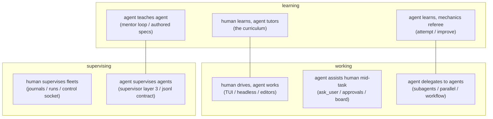

# Humans and agents, agents and agents: the collaboration map

Two questions prompted this page (2026-07-28): *does jichi support
agent-vs-agent learning?* and *humans support agents and agents support
humans — can agents support agents?* The answer to both is **yes, and it
already ships** — but the mechanisms were documented in eight different
places. This is the one map. Every cell names a shipped mechanism, its
document, and a runnable entry point; nothing here is planned or
speculative.

## Learning

**Human learns, agent tutors.** The curriculum
([CURRICULUM.md](CURRICULUM.md)): four stages, 18 graded assignments, the
hint ladder, and the tutor stance (while a brief is active the model
guides and declines to solve). Entry: `jichi setup --preset learner`.

**Agent learns, mechanics referee.** The same assignments are
agent-consumable by construction (`audience: agent` renders a
machine-checkable spec):

- `jichi attempt <spec.md>` — the agent works one assignment in an
  **isolated git worktree** (your tree untouched, the path fence forced on),
  with the hint ladder available as a tool, graded by the spec's own
  `verify`; reports pass/fail + hints used.
- `jichi improve` — grades a whole spec suite over time (pass-rate trend);
  `improve --attempt` is the live rehearsal loop: each failing spec is
  attempted in a fresh worktree, re-graded, and the fix **discarded** —
  propose-only measurement, never silent self-modification.
- `jichi dream` — offline reflection over the agent's own telemetry into a
  dated, propose-only draft (also available as the daemon's `--idle-dream`).

The referee in every case is mechanical: the two-sided `verify`
([ASSIGNMENTS.md](ASSIGNMENTS.md), [TESTING.md](TESTING.md)) — which is
what makes agent-vs-agent learning honest rather than two models
complimenting each other.

**Agent teaches agent.** Two shipped loops:

- **The mentor loop** ([LEARNING.md](LEARNING.md)): `learn analyze` mines
  telemetry for recurring failures → the `/learn` mentor agent drafts
  lessons → a human reviews → `learn apply` commits memory notes, skills,
  and **corrections** (retracting stale lessons). The learner and the
  mentor are both agents; the human is the gate.
- **Authored assignments**: an instructor agent writes a spec (`/assign`,
  with the two-sided bar from
  [curriculum/INSTRUCTOR.md](curriculum/INSTRUCTOR.md)); a learner agent
  `attempt`s it. Curriculum task 16 teaches humans this seat; nothing stops
  the seat being occupied by a model — the meta-grader doesn't care who
  typed the spec.

## Working

**Human drives, agent works** — the default: TUI, headless `-p`, editors
via ACP ([ACP.md](ACP.md)). **Agent assists human mid-task**: `ask_user`
(the agent pauses for a clarifying question, [ASK.md](ASK.md)), the
approval prompts, and the shared kanban `board` ([BOARD.md](BOARD.md)) that
both parties read and mutate.

**Agent delegates to agents** — all bounded, all budget-metered:

- `spawn_subagent` — synchronous scoped delegation; named profiles enforce
  tool fences; depth-capped, iteration budgets tapered per level
  ([SUBAGENTS.md](SUBAGENTS.md)).
- `spawn_parallel` — a fork pool with isolated git worktrees for write
  tasks, file-level first-wins merge, per-child watchdogs and budget
  slices ([PARALLEL.md](PARALLEL.md)).
- `jichi workflow <spec.json>` — a *deterministic* multi-agent pipeline
  (map → verify → synthesize) when the fan-out should be scripted rather
  than model-chosen.

## Supervising

**Human supervises fleets**: journals + `jichi runs`/`audit`
([OBSERVABILITY.md](OBSERVABILITY.md)), the mid-run control socket
(`jichi control <sock> inject|pause|abort`, [CONTROL.md](CONTROL.md)),
`doctor --unattended` for loop gates, and
[AUTONOMOUS_LOOPS.md](AUTONOMOUS_LOOPS.md) for the standing-loop patterns.

**Agent supervises agents** ([SUPERVISOR_OF_MANY.md](SUPERVISOR_OF_MANY.md),
layer 3): a jichi agent dispatches workers by running
`jichi -p "<subtask>" --output json` through `run_terminal_command` — or,
cleaner, through a `delegate_to_worker` user tool
([USER_TOOLS.md](USER_TOOLS.md)) — reads each worker's machine-readable
report, and merges. The **`--output jsonl` driving contract**
([SCRIPTING.md](SCRIPTING.md)) is designed for exactly this: the terminal
`done` event carries run economics (`stop_reason`, budget used/limit,
`starved`, cache and tool mix) *so that a driving agent can decide* to
re-scope, split, raise the budget, or switch backends. The warm `daemon`
([DAEMON.md](DAEMON.md)) amortizes startup for worker fleets.

## What deliberately does NOT exist

Stated so nobody searches for it: there is **no agent-to-agent negotiation
protocol, no shared mutable agent memory, no swarm consensus**. The
interfaces between agents are the same ones humans get — files, the board,
budgets, journals, and verifiers — because an interface a human can read is
an interface a human can audit. Where two agents must agree, a mechanical
check decides (first-wins merges + conflicts *reported*; two-sided
verifies), not a conversation between models.

*Cross-references: WORKFLOWS.md (per-role entry points), LEARNING.md (the
mentor loop in depth), SELF_IMPROVEMENT.md (the improve/dream band).*
