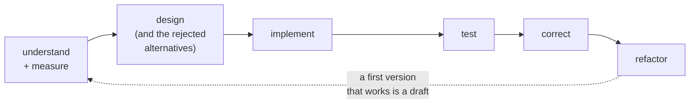

# How jichi approaches building software

> **Where this sits.** [`PHILOSOPHY.md`](PHILOSOPHY.md) is the **why** — the values,
> named in the Japanese terms this project borrowed them under.
> This page is the **how**: the eight working practices those values cash out as,
> each with the page that teaches it and the failure that argued for it.
> [`CURRICULUM.md`](CURRICULUM.md) is how you *learn* them by doing, and the
> [source-reading guides](reading/ANNAI.md) are how you watch them at work in real
> code. Read this one first if you want to know what kind of project you are
> looking at before you decide to invest in it.

Two things make this page unusual, and both are the point.

**It is not aspirational.** Every practice below is something jichi does to
itself — there is a mechanism, a page, or a failure behind each one, and where a
practice has a *limit* the limit is stated. A list of virtues nobody checks is
decoration.

**jichi asks the model for the same things.** The practices are not only house
rules for the humans: most of them are in the system prompt the agent runs
under (`# How to work (the craft)`, config `craft`, default on — the source of
truth is `src/chat/jc_sysmsg.c`). So an agent working in your repository is being
asked to design before implementing, to prove a test can fail, and to say plainly
what it did not do. That is deliberate: **an agent that works the way you want
your team to work is easier to review than one that is merely fast.**

---

## 1. Understand before changing; measure rather than assume

> *"A number you have not checked is a guess wearing a number's clothes."*
> — the craft prompt

The habit is: read the code and the constraints first, and when a decision turns
on a number, go and get the number. This project's own register carries a rule
about it — [`DEFERRED.md`](DEFERRED.md) opens with **"check the checkable part of
a reason before parking the item"**, written after three deferrals in a row were
justified by claims a minute's reading would have refuted (what a fixture
contained, what a tool did, how many call sites something touched).

**Ask only what the code cannot answer.** The `ask_user` tool exists for the
questions where two readings of a task lead to materially different work — not
for questions a `grep` would settle. See [`ASK.md`](ASK.md).

## 2. Design before implementing — and write down what you rejected

Even a very short program gets a short design note. The note's valuable half is
not the plan; it is **the alternatives you rejected and why**, because the code
will only ever hold the *what*.

This is why the project keeps a [`DECISIONS.md`](DECISIONS.md) whose entry rule is
literally *"if there was no rejected alternative, it was not a decision"*, and why
larger pieces get a document in [`plans/`](plans/) or [`proposals/`](proposals/)
before code. The teaching versions are
[`PSEUDOCODE_TUTORIAL.md`](PSEUDOCODE_TUTORIAL.md) (design you can execute in your
head), [`UML_TUTORIAL.md`](UML_TUTORIAL.md) (one diagram, one question),
[`USE_CASE_TUTORIAL.md`](USE_CASE_TUTORIAL.md),
[`DOMAIN_MODELLING_TUTORIAL.md`](DOMAIN_MODELLING_TUTORIAL.md) and
[`ARCHITECTURE_TUTORIAL.md`](ARCHITECTURE_TUTORIAL.md).

The arrow back is not decoration. **Expect to go round again**; the order matters
because each step is cheap to redo and expensive to skip.

## 3. Prove a test can fail before trusting that it passes

> *"A test never seen failing has never been seen working."*

Every check added to this repository is **born red**: perturb the thing it guards,
watch it fail, restore, watch it pass. `tests/teeth.sh <file> <sed> <command>`
mechanises the ritual and refuses two ways to fake it — a perturbation that
matches nothing is reported `VACUOUS`, and a check that stays green is
`TOOTHLESS`. The restore is trapped, so an interrupted ritual cannot leave the
perturbation in the tree.

The reason this is a rule and not a preference is
[`TEST_INTEGRITY.md`](TEST_INTEGRITY.md), which records the times **this project's
own suites were green while broken**: sixteen truncating request readers reporting
regressions that never happened; a verify gate that passed while running no tests
at all; a grader that scored five correct edits as failures; two PTY fixtures that
matched a string printed by a *different* surface in the same transcript.

Graded practice: [`assignments/07-write-the-test-first.md`](assignments/07-write-the-test-first.md)
and [`14-the-hollow-gate.md`](assignments/14-the-hollow-gate.md).

## 4. Prefer a lint to an audit — and know which lint

An audit finds what it knew to look for, once. A lint finds it every build. So
when a claim drifts, the fix is usually a check rather than a correction: after
the curriculum's task counts drifted because each milestone *incremented the
previous claim instead of recounting*, the repair was a lint that recounts.

Roughly thirty lint drivers now own the project's user-facing vocabularies —
flags, subcommands, tool names, slash commands, config keys, telemetry events,
keybindings, `@`-references, asset frontmatter keys, documented defaults — each
extracting ground truth from the source and failing when a document disagrees.

**Two honest limits, both learned the hard way:**

- **A lint sees what it can extract.** Several of these have been blind to their
  own subject — an extraction that read the *comment* quoting the key it was
  looking for, so the real drift stayed green. When that happens the fix is to
  narrow on a fact about the language (a line whose first non-blank character is
  `*` is a comment), never an exception list.
- **Some defects only a reader can find.** Coherent, well-formed, *false* prose
  passes every lint. That is why [`DOC_REVIEW.md`](DOC_REVIEW.md) exists as a
  reusable review instrument — the counterweight, not a competitor.

The sharpest version of "which lint": [`PLATFORMS.md`](PLATFORMS.md#the-finding-that-made-this-page-m400)
describes code that violated this project's own mandatory compiler flags for
months, invisibly, because it sat behind a platform guard **no machine here
compiles**. Lint the code you *cannot* build, not only the code you do.

## 5. Say plainly what is unverified

Reporting a failure with its output beats summarising it. Saying "never compiled"
beats "unverified in CI" when no compiler has ever read the file. An admitted
mistake becomes a lesson; a hidden one is a trap for whoever comes next.

Concretely, in this repository: [`PLATFORMS.md`](PLATFORMS.md) uses **verified**
and **never compiled** as strict terms and refuses the comfortable middle;
[`CHANGELOG.md`](../CHANGELOG.md) opens by admitting which of its own version numbers
are retrospective labels; [`ANECDOTES.md`](ANECDOTES.md) is a running log of
debugging war stories in the shape *symptom → dead ends → root cause → lesson*,
including the ones where the author's first diagnosis was wrong and had already
been published.

## 6. Keep registers, in plain text

Four files, one job each, and none of them requires a tool to read:

| Register | Answers | Rule for adding a row |
|---|---|---|
| [`ROADMAP.md`](ROADMAP.md) | what was built, and the reasoning | one entry per milestone |
| [`DECISIONS.md`](DECISIONS.md) | what was chosen **and what was rejected** | only if someone could sensibly have chosen otherwise |
| [`DEFERRED.md`](DEFERRED.md) | what was consciously *not* done, and why | if new information could change the answer (otherwise it was a decision) |
| [`ANECDOTES.md`](ANECDOTES.md) | what went wrong, and what it taught | when the lesson outlives the bug |

The practice generalised for any project — capture, plan, decide, defer, record,
review, in five markdown files and a weekly review of five commands, needing
nothing but `cat`, `grep` and an editor — is
[`PROJECT_RECORDS.md`](PROJECT_RECORDS.md) (and
[`ORG_MODE.md`](ORG_MODE.md) for the Emacs version). The honest caveat is on that
page too: a fixture can confirm somebody typed the right headings once, not that
they kept a register for six months.

## 7. Bound the agent instead of trusting it

An AI agent's cooperation is not a safety mechanism. Prose in a prompt can be
ignored, misread, or *injected* by the untrusted content the agent reads. So the
real defences are the ones that do not need the model's agreement:

- a **path fence** (reads and writes resolved against the workspace, with
  read-only reference roots for cross-repo work),
- an **edit scope** and budgets (tokens, wall-clock, tool calls) around an
  unattended run,
- a **verification gate** with rollback, plus out-of-scope detection,
- **approval prompts** for every mutating tool, with `sudo`-class and
  hardware-actuating commands gated *below* the verdict so a blanket "always"
  cannot satisfy them.

See [`AUTONOMY.md`](AUTONOMY.md), [`AGENT_MODES.md`](AGENT_MODES.md),
[`HARDENING.md`](HARDENING.md) and [`GATE_INTEGRITY.md`](GATE_INTEGRITY.md) — the
last of which states where each fence *ends*, because a boundary you have not
written down is one you will assume is somewhere else. Prompt-level mitigations
(fencing untrusted fetched content as data, not instructions) exist and are
labelled mitigations.

## 8. Small steps, each of which ships

改善（かいぜん）: the project grew by 400 milestones, not by rewrites, and the
same shape is recommended outward. A migration strategy that requires a
feature-freeze is fiction for the codebases that most need improving — so the
useful strategies are the ones where **every intermediate state ships**. That is
the argument of [`reading/fukabori-12-the-migration-road.md`](reading/fukabori-12-the-migration-road.md)
and the design of the [Zig](ZIG_INTEROP.md) and [C++](CPP_INTEROP.md) interop
tracks: *compile → extend → refactor*, each step a shippable state, and you may
stop anywhere with the project improved.

---

## Trying it in your own project

You do not need jichi to adopt any of this, and none of it needs adopting all at
once. Cheapest first:

| Practice | Cost to start | Start with |
|---|---|---|
| A decision register with rejected alternatives | one file, five minutes | [`PROJECT_RECORDS.md`](PROJECT_RECORDS.md) |
| Born-red tests | one script, already written | `tests/teeth.sh`, [`TEST_INTEGRITY.md`](TEST_INTEGRITY.md) |
| A design note before each change | one paragraph per change | [`PSEUDOCODE_TUTORIAL.md`](PSEUDOCODE_TUTORIAL.md) |
| One lint over a vocabulary that keeps drifting | an afternoon | the drivers in `tests/smoke/*_lint.sh` |
| Stating what is unverified | free, and the hardest | [`PLATFORMS.md`](PLATFORMS.md) as the worked example |

If you would rather learn by doing, the graded course starts at
[`CURRICULUM.md`](CURRICULUM.md) (`jichi init learner`), and the two source-reading
guides — [案内（あんない） *Annai*](reading/ANNAI.md) for the guided tour,
[深掘り（ふかぼり） *Fukabori*](reading/FUKABORI.md) for the deep dive — show these
practices inside a working 90k-line C program, including where they failed.

## The honest limits of this page

- **It describes a small project.** Practices that survive one maintainer and a
  handful of collaborators are not automatically right for fifty engineers; the
  register discipline in particular gets its value from being *readable in one
  sitting*.
- **Reading it changes nothing.** Every practice above has a page that teaches it
  and, mostly, an assignment that grades it. Six of the eight are habits, and a
  habit is not acquired by agreement.
- **jichi's own compliance is uneven, and the gaps are recorded rather than
  hidden** — [`DEFERRED.md`](DEFERRED.md) is that list, and it is longer than this
  page.
