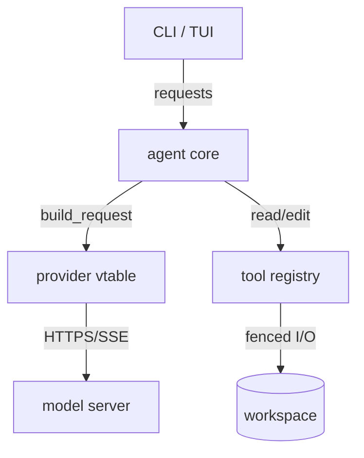

# System architecture, and how to show it — a tutorial

A learner's guide to thinking about, and communicating, the shape of a system:
its parts, their responsibilities, how they depend on each other, and the
decisions that made it that way. The emphasis is on **making the structure
visible** — with a diagram, another visual form, or plain prose — because an
architecture that lives only in one person's head is not an architecture, it is a
risk. The thesis: **architecture is the set of decisions that are expensive to
change later; write those down, show the structure that follows from them, and
record what you rejected.**

## 1. What "architecture" means here

Not a job title and not a framework — the **load-bearing decisions**: the ones a
later change cannot easily undo. What are the major parts? What is each one
responsible for, and (just as important) *not* responsible for? Which part may
depend on which — and which dependency direction is forbidden? Where are the
boundaries that untrusted input, or another team, or a slow network cross?

jichi itself is a worked example: its `CLAUDE.md` "Architecture" section lists the
layers (platform/util → json → config → provider → tools → chat), and the rule
that *the agent never branches on provider* is an architectural decision — a
boundary (the provider vtable) chosen so that adding a model backend touches one
file, not the loop. Read that section as a model of the genre.

## 2. Levels of zoom — show the right altitude

The commonest architecture-diagram mistake is drawing every box at once. Pick an
altitude and stay there. A useful ladder (the *C4* idea, worth reading up on):

- **Context** — the system as one box, and what it talks to (users, other
  systems, external services). Answers "what is this, and what is around it."
- **Container** — the major runnable/deployable parts (the CLI, the daemon, the
  database, the model server) and the calls between them.
- **Component** — inside one container, the modules and their responsibilities.
- **Code** — a single module's types; this is where the [UML](UML_TUTORIAL.md)
  `classDiagram` lives, and usually you should let the code itself be this level.

Most projects need the middle two, occasionally the top. Draw the level that
answers the question you actually have.

## 3. Showing it — diagram, or prose, or both

A diagram is not always the right tool. Part of visual literacy is knowing when to
use words instead.

- **A `flowchart` (mermaid)** shows parts and dependency direction. Label the
  edges with what flows along them; an arrow with no label asserts a dependency
  whose nature you have not decided.



- **A `sequenceDiagram`** shows a flow *through* the parts (see
  [UML_TUTORIAL.md](UML_TUTORIAL.md) §3) — reach for it when the question is
  "what happens during one request" rather than "what depends on what".
- **Prose** wins when the structure is simple or the interesting thing is a
  *decision*, not a shape. "The provider is a vtable so the loop never branches on
  which model answered" is one sentence and clearer than any box could be. Do not
  draw what a sentence says better.

The three rules from the [UML tutorial](UML_TUTORIAL.md) §6 apply at this scale
too, and harder: **one diagram one question; every box appears in the prose; date
it, because a system diagram that no longer matches the deployment is actively
misleading.**

## 4. Architecture Decision Records — the part that outlives the diagram

Diagrams show the *what*; the durable artifact is the *why*. An **Architecture
Decision Record (ADR)** captures one decision: the context, the decision, and —
the load-bearing part — **the alternatives rejected and why.** A decision with no
rejected alternative was not a decision; it was the only option, and needs no
record.

jichi's own [DECISIONS.md](DECISIONS.md) is this practice, project-wide: every row
is a decision plus what it rejected. The `design-doc` skill requires the same
("Decisions: each with ≥1 rejected alternative and why"). This is the single most
valuable architecture habit for a solo learner, because six months later the
question is never "what is the structure" (you can read that) but "why did I do it
*this* way, and what did I already reject" — which nothing but the record can
answer.

So that you can start one today, here is the whole template — six lines, one file
per decision under `docs/adr/`, numbered:

```markdown
# ADR-0001: <the decision, stated as a sentence>

Date: 2026-08-12 · Status: accepted

**Context** — what forced a choice (the constraint, not the solution).
**Decision** — what we do.
**Rejected** — <the alternative> — because <the reason>.
**Consequences** — what this now costs us, including what it makes harder.
```

If one file per decision feels heavy for a solo project, the other shape is one
*row* per decision in a single register — which is what this repository does in
[DECISIONS.md](DECISIONS.md), and [PROJECT_RECORDS.md](PROJECT_RECORDS.md) shows
how such a register is kept over months without rotting.

## 5. Boundaries are the decisions that matter most

The highest-value architectural lines are the ones a change, a failure, or an
attacker cannot cross. jichi's fences are worked examples: the path fence and edit
scope are boundaries chosen so an autonomous run's blast radius is bounded (see
[AUTONOMY.md](AUTONOMY.md) and [GATE_INTEGRITY.md](GATE_INTEGRITY.md) §9 for the
honest limits of where the boundary holds and where it does not). When you design
a boundary, state what it keeps in, what it keeps out, and — the honest part —
what it does *not* protect against. A boundary sold as more than it is becomes the
dangerous kind of documentation.

## 6. Doing it with jichi

This topic is reading-first, because a fixture check can grade the *shape* of an
architecture doc but never whether the structure is sound — that is judgment. To
practice with the agent:

```sh
jichi init sdlc      # writes the architect agent, uml-mermaid + design-doc skills,
                     # /design — into .jichi/ here; never overwrites an existing file
                     # (`jichi init sdlc --dry-run` lists what it would create)
jichi -p "/requirements <your goal>"   # /design reads docs/REQUIREMENTS.md, so start here
jichi -p "/design"                     # then the architect drafts the design
jichi --auto -p "Draw a container-level flowchart of THIS project. Label every edge
with what flows along it. Then write one ADR for the biggest decision, with what
you rejected."
```

Two things that surprise people about the `sdlc` commands: the `architect` and
`requirements-analyst` profiles are **read-only**, so they *print* their document
rather than writing it — redirect or copy it yourself — and `/design` expects
`docs/REQUIREMENTS.md` (and ideally `docs/USE_CASES.md`) to exist already, which
is why the chain above runs in order. The third command needs `--auto` because a
headless run is read-only until you say otherwise.

## 7. Extra curriculum — the reading track

In reading order:

1. jichi's own `CLAUDE.md` "Architecture" section — a real system's layers,
   boundaries, and the invariants that hold them, written terse.
2. [DECISIONS.md](DECISIONS.md) — the ADR practice at project scale; read a dozen
   rows to see what "the rejected alternative" buys a future reader.
3. [reading/FUKABORI.md](reading/FUKABORI.md) — the expert source-reading guide,
   one architectural decision per chapter, applied to jichi's own code.
4. [DEFERRED.md](DEFERRED.md) — the other half of architecture: what was
   consciously *not* built, and why. Structure includes its own boundaries.
5. [UML_TUTORIAL.md](UML_TUTORIAL.md) and
   [DOMAIN_MODELLING_TUTORIAL.md](DOMAIN_MODELLING_TUTORIAL.md) — the diagram and
   modelling techniques an architecture doc draws on at the lower levels.
6. [PROJECT_RECORDS.md](PROJECT_RECORDS.md) — how the decision/deferral records
   are kept over months in plain markdown.

External concepts worth reading up on (search these; prefer primary sources): the
*C4 model* (Simon Brown — the zoom levels of §2); *Architecture Decision Records*
(Michael Nygard's original template); *"Fundamentals of Software Architecture"*
(the trade-off framing — architecture as the decisions with no right answer, only
trade-offs); *coupling and cohesion* (the oldest and most useful pair of words for
judging a boundary); *Conway's Law* (why your architecture tends to mirror your
team, or your solo habits).
