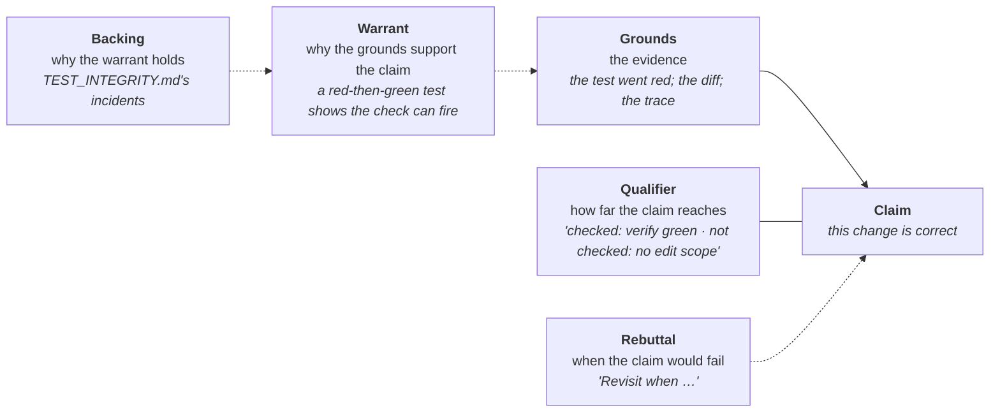

# The argument you were already making — the names, lightly, last

*A short page for the learner who has worked the curriculum and wants to know
what the discipline is called elsewhere. It comes **last** on purpose: the
practice came first and works; the names are for leaving the form — so that you
recognise the same discipline in a codebase that calls it ADRs, and can argue
for it in a room that has read Toulmin and not jichi. M635; the analysis behind it
is [`analysis/2026-09-15-reasoning-and-argumentation.md`](analysis/2026-09-15-reasoning-and-argumentation.md).*

## 1. One diagram, six words

Stephen Toulmin's layout (1958) is the one most engineers meet. Every argued
claim has these parts, and every jichi artifact you have written fills some of
them:



| The house word | The name elsewhere | Where you met it |
|---|---|---|
| **Rejected alternative, with why it lost** | *design rationale*; an **ADR** (architecture decision record) is one decision with its rejected options; IBIS is the older graph of issues, positions and arguments | task 10's `## Alternatives considered`, task 75's `Rejected:` line, `DECISIONS.md` |
| **`Because:` — the criterion traced to a requirement** | the **warrant**: the rule that carries you from the grounds to the claim | task 75 |
| **`Revisit when …`** on a deferral | a **defeater** named in advance — the observation that would make you take the decision back; Pollock's term | `DEFERRED.md`, task 73's retrospective |
| **"What is and is not checked"** — the floor-versus-judgement header, the reach footer | the **qualifier**: the claim's reach, stated with the claim | every smoke driver's header (M305); the two lines under a headless answer (M630) |
| **TAINTED** — the verifier was edited during the run | an **undercutting** defeater: it does not say the claim is false, it says the evidence no longer supports it | `GATE_INTEGRITY.md`, task 14 |
| **A red test, a differing byte** | a **rebutting** defeater: evidence the claim is false | tasks 03, 05, 09 — and the `refute` stage's first heading (M634) |
| **`[warrant: measured\|judgement\|unchecked]`** | the *kind* of backing a claim has; M326b's trichotomy applied to lessons | `learn apply` (M632) |
| **The five readings** of `CODE_REVIEW.md` | asking the **program**, not yourself: grounds that cannot be wrong about the code | task 74 |
| **State the objection before you answer it** | the **steelman**; its opposite, the straw man, is the one fallacy the curriculum names | task 10's `## Objections` (M633) |
| **How likely, how costly and to whom, what the alternative costs, what the evidence is for the likelihood** | Walton's **critical questions** for an argument from consequences | curriculum 07 §2b |

## 2. Why the order was practice first

You could have been handed this table in module 01. It would have taught you the
words and not the moves. The moves were taught by graders that asked for the parts
of an argument by their **shape** — a `Rejected:` line, a `Because:` naming an
`R<n>`, an `Objection:` before a `Reply:` — and by a record that made the
qualifier visible where you would otherwise skim past it. The floor is structure;
the argument is yours. That ordering is itself a decision with a rejected
alternative: teaching the theory first was rejected because a learner who can name
a warrant and cannot write one has learned a vocabulary, and the curriculum is
graded on artifacts.

## 3. Record what you predicted, not only what you estimated

Task 73 asks you to estimate and then compare. The `code-reading` skill asks you to
**predict** before it reveals — and until M635 the prediction was gone the moment
you looked. `/predict <what you expect>` in the TUI appends it to
`.jichi/predictions.jsonl`; `/predict right` or `/predict wrong` resolves the last
open one; `/predict` alone prints the tally (made, resolved, right, hit rate,
open).

```
/predict the request body is freed before the response streams
  recorded. Now look -- then /predict right or /predict wrong.
/predict right
  resolved: right. /predict shows the tally.
/predict
  Predictions: 4 made, 3 resolved, 2 right (hit rate 66%), 1 open.
```

Three things are true of this record by construction, and they are the reasons it
is a separate file rather than a column in `progress.jsonl`:

1. **It is never scored.** Every reader of `progress.jsonl` treats a line as an
   attempt with a verdict; a prediction there would read as a failed attempt.
   `hints.jsonl` is separate for the same reason. A self-learner is never punished
   for learning.
2. **It records what you *said* you predicted.** If you look first and predict
   after, the file cannot tell. Honesty is yours, as it is with the record.
3. **A resolution with nothing open is refused**, and a resolve line with nothing to
   close is ignored by the tally, so the numbers cannot be made to lie by ordering.

What it is for: the *fluent and wrong* failure `CODE_REVIEW.md`'s Review row names.
A reading that predicts and is right is calibrated; one that is fluent and never
predicted has no way to know. Twenty predictions in, the hit rate is a number about
you that no grader could have produced.

## 4. What the names do not buy

Naming a warrant does not make it sound; naming a defeater does not make you look
for it. A `Because:` line can be written to satisfy a grep, and the instructor
notes for module 06 predict exactly that. The names help in one place: when you
leave this curriculum and meet the discipline under other words, you will know it
is the same one, and you will know which part of it the new house has left out.
