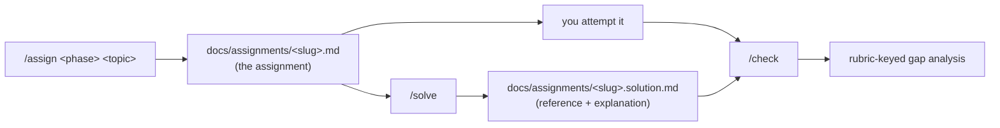

# Assignments — practising the whole software lifecycle

> **Teaching, tutoring, or learning alone?**
> [TEACHING_ASSIGNMENTS.md](TEACHING_ASSIGNMENTS.md) is the workflow companion:
> **the two grading paths** and how to choose (the offline mechanical floor
> `jichi grade` versus the rubric-keyed `/check`), then step-by-step loops with
> diagrams for the **self-learner**, the **tutor** and the **teacher**, the
> **escalation ladder** for being stuck alone, and an honest list of what the
> feature does not support well. This page is the mechanics.

jichi can act as a *coach*: on request it writes a structured software-development
**assignment** for a chosen lifecycle phase — with mermaid diagrams, pseudo-code,
research hints, algorithms to explore, and a recommended toolchain — and a
separate **reference solution** with a full explanation. You attempt the work,
then compare yours against the recommended one (a `solution-checker` agent can do
that comparison for you).

The whole feature is **optional and off by default**. Nothing changes until you
opt in.

## Turning it on

Two independent opt-ins:

1. **Scaffold the assets** (the agents, commands, and skills):

   ```sh
   jichi init assignments
   ```

2. **Enable the behavioural nudge** in your config so the agent reaches for this
   workflow on lifecycle tasks:

   ```json
   { "assignments": true }
   ```

   When `assignments` is true, a short *Assignments mode* block is added to the
   system prompt directing the agent to produce an assignment file **and** a
   separate reference-solution file for design/coding/review tasks. When it is
   false (the default), the block is omitted entirely and behaviour is unchanged.
   You can scaffold the pack without the flag (and just invoke the commands), or
   set the flag without the pack (and let the agent write files directly) — they
   are independent.

## The workflow



- **`/assign <phase> <topic>`** — the first word is the lifecycle phase
  (`requirements` · `use-case` · `design` · `implementation` · `testing` ·
  `documentation`); the rest is the topic. Writes `docs/assignments/<slug>.md`.
- **`/solve <assignment-file>`** — writes `docs/assignments/<slug>.solution.md`
  (a sibling) with the reference design/implementation, a step-by-step
  explanation, trade-offs, complexity, and a test plan.
- **`/check <assignment-file> <your-solution>`** — reports (read-only) how your
  solution scores against the assignment's rubric (and the reference if present),
  with a located gap analysis.

Each command declares `agent:` frontmatter (`assignment-writer` /
`solution-writer` / read-only `solution-checker`), so it runs **as that agent
profile** — the profile's system prompt (which carries the full section template)
is injected for the turn deterministically, **without relying on the model to
spawn a subagent**. That's what makes the structure survive weaker models. (See
[`COMMANDS.md`](COMMANDS.md) for `agent:` routing.)

You can also just ask in plain language ("write me a design assignment about a
bounded LRU cache") — with `assignments: true` the agent follows the same format.

## Where files live

| Path | What |
| --- | --- |
| `docs/assignments/<slug>.md` | the assignment |
| `docs/assignments/<slug>.solution.md` | the reference solution (a sibling, so it can be withheld from a learner) |
| `docs/assignments/INDEX.md` | optional curated list |

They live at the **project root** (version-controlled and shareable), **not**
under `.jichi/`, and are deliberately *not* injected into every prompt — so the
context budget stays lean. List them any time:

```sh
jichi assignments      # one row per assignment: phase, points, status, solution
```

The listing is the learner's map (M174): each row shows the spec's `phase` and
`points` from its own frontmatter plus a **status** column folded from the
progress record — `-` (never graded), `attempted (best N%)`, or `passed` — and
a `(+solution)` marker when a reference solution sibling exists. `INDEX.md` is
listed nowhere: it is the set's map, not an assignment.

## The assignment structure

`assignment-writer` follows the `assignment-template` skill. It emits a
**unified artifact** — one `docs/assignments/<slug>.md` that is *both* the prose
learning doc *and* a machine-checkable, solvable spec (see the next section).
Frontmatter: `title`, `phase`, `difficulty`, `audience`
(`junior|student|senior|agent`), `domain`, `prerequisites`, `estimated_time`,
and — the machine-checkable half — `verify` (a real command that exits 0 only
when the deliverable is correct), `points` (rubric weight), and `hints` (a graded
ladder revealed on demand by the `hint` tool). `title`, `audience`, `verify`,
`setup`, `points`, `phase`, `difficulty`, and `hints` are parsed by the tooling
(`phase`/`difficulty` since M174 — they drive the listing's columns); the rest
are structure for the human reader. Body, in order: context &
background · learning objectives · problem statement &
requirements · constraints & non-goals · use cases/scenarios · suggested design
(mermaid: architecture/sequence/data-flow) · pseudo-code skeletons · algorithms &
techniques to explore (with **research hints**, not full answers) · recommended
toolchain · deliverables · acceptance criteria/rubric · stretch goals.

The solution mirrors it: reference design + implementation, the reasoning behind
each choice, alternatives considered and rejected, complexity, a test plan, and a
"compare your solution" checklist keyed to the rubric.

## The agents (from the `assignments` pack)

| Agent | Role | Posture |
| --- | --- | --- |
| `assignment-writer` | writes the assignment for a phase + topic | read + write |
| `solution-writer` | writes the reference solution + explanation | read + write |
| `solution-checker` | compares a learner's solution to the rubric/reference | **read-only** |

Each profile declares a `tools:` allow-list that is **enforced** when it runs as
a subagent (see [`SUBAGENTS.md`](SUBAGENTS.md)), so `solution-checker` genuinely
cannot modify files. Customise any of them — they are plain markdown under
`.jichi/agents/`.

## Learning by solving — the unified artifact, hints, help, and tiers

The reference-solution flow above teaches by *comparison*. The **learner-support
layer** teaches by *doing*: a learner (human **or** agent) solves the assignment
directly, graded by its own `verify` command, with graded help on hand.

> **The hint ladder is a human-driven mechanism** (measured, M319). Across 12 `jichi
> attempt` runs on two tasks whose ladders are load-bearing — including one whose third
> hint contains the answer, and a 4-point task — the model **never called `hint` once**,
> although it was advertised and the prompt named it. It passed everything anyway.
>
> **Confirmed on a second model** (M320), and harder: `jlu/qwen3-coder-next` burned a
> quarter of a million tokens over 23–25 model calls on the 4-point task, **failed**, and
> still never called `hint`. Two models, 24 runs, zero calls — including six runs that
> failed with the tool in hand.
>
> So the ladder's real path is `/hint` in the TUI, driven by the person working the task
> (which [`learner_flow.sh`](../tests/smoke/learner_flow.sh) exercises). That is a
> legitimate design — it is how a tutor uses it — but do not assume `attempt` rehearses
> it. [M319's measurement](analysis/2026-08-06-hint-under-core.md) and
> [M320's](analysis/2026-08-06-hint-second-model.md), including what they do *not* license.

### One file, two readers

The assignment's frontmatter carries a `verify` command, a `points` weight, an
`audience`, and a `hints:` ladder, so the same file that a human reads as a
tutorial is *also* a spec the tooling can grade and solve:

```yaml
---
title: Bounded LRU cache
audience: junior
verify: "make test"
points: 100
hints:
  - Think about what has to happen on every access, not just on insert.
  - You need two structures: one for O(1) lookup, one for recency order.
  - A hash map to nodes of a doubly linked list; move-to-front on touch.
---
```

- **`assign <file>`** renders the assignment framed for its `audience`.
- **`grade <file>`** runs `verify` and scores the result (offline, no model).

> **Worked, real examples:** [`case-studies/`](case-studies/README.md) holds four
> complete bundles from driving this machinery against a real codebase with real
> models — assignments *as authored* (defects included), gates proven red,
> reference solutions beside the agent's solutions, and the run journals. Read
> case 1 first if you are deciding how much to trust a graded agent result: it is
> the one where the learner passed by editing the gate.

> **Make `verify` strict.** It must *fail* on an empty/unimplemented solution,
> or every un-started attempt grades as a pass. A bare build-or-test-all command
> (`make test`, `zig build test`, `pytest`) usually passes on a repo where the
> task isn't done yet — useless as a grade. Instead **ship a fixed acceptance
> test** alongside the assignment (a file encoding the exact contract + edge
> cases that the learner must make pass) and point `verify` at *that test*
> specifically — e.g. `zig test tests/feature_accept.zig`. It should fail (or not
> even compile) until the feature exists. See the `node-absolute-path` assignment
> in the zigodot project for a worked example.
>
> **And prove it, with one command (M412):** `jichi grade <spec.md> --expect-fail`
> runs the verify on the *untouched* tree and succeeds only if it **fails** — the
> red half of the two-sided proof jichi's own curriculum gets from CI, handed to
> any project. An already-green gate is reported **HOLLOW** with exit 1. Run it
> right after authoring, before a learner spends a token: the first assignment
> jichi authored into another repository shipped exactly this defect — `verify:
> zig build test`, already green, `grade` reporting PASS at 100% with the target
> function still panicking. (`--expect-fail` refuses `--record`: a red-proof is an
> authoring check, not a learner grade.) One honest limit, measured the day it
> shipped: `--expect-fail` proves the *command* can fail, not that **your** test
> is what fails it — a broad `zig build test` verify read "RED as expected" for a
> spec with no gate test at all, because a *sibling* assignment's tests were red
> in the same suite. Which is one more reason to point `verify` at the specific
> acceptance test, per the paragraph above.
- A solver requests the graded hints **one at a time** with the `hint` tool
  (only when genuinely stuck — they escalate nudge → approach → worked step and
  use is recorded, never silently penalised), asks a clarification with
  `ask_for_help`, and delegates a
  self-contained sub-part with `spawn_subagent`. The learner tools are
  registered when `assignments: true`; without an active assignment they answer
  with a graceful no-op rather than an error, and in TUTOR mode (a human
  working the brief) the `hint` tool is fenced -- the ladder belongs to the
  human, and the model is told to nudge in its own words instead (M617).

### Help routing (humans and agents)

`ask_for_help` serves both consumers with one tool:

- **Interactive (TUI, top level):** it reaches *you* via the same prompt
  `ask_user` uses.
- **Headless / `--auto`:** it delegates to the read-only `assignment-helper`
  profile, which returns a hint-level nudge (never the full solution) seeded with
  the question + the assignment's task and `verify`.

So the identical assignment works for a person at the keyboard and for an
unattended agent — the help just routes to whoever can answer.

### Tiered learners + `attempt`

The pack ships four learner profiles that differ by tool allow-list + persona
(add a `model:` selector to make a tier use a weaker/stronger model):

| Profile | Help posture |
| --- | --- |
| `learner-junior` | leans on `hint` / `ask_for_help` / `spawn_subagent` readily |
| `learner-student` | attempts first; uses `hint`/help sparingly |
| `learner-senior` | solves independently — no help tools |
| `learner-agent` | autonomous; uses help strategically to pass efficiently |

Run one against an assignment with the **`attempt`** subcommand:

```sh
jichi attempt docs/assignments/lru-cache.md --agent learner-junior
```

It loads the assignment (so the hint tools go live), runs the chosen tier in an
**isolated git worktree** materialised from a checkpoint, grades it there by
`verify`, reports the verdict + hints used, and discards the worktree — **your
working tree is never touched** (the same isolation as `improve --attempt`, see
[`SELF_IMPROVEMENT.md`](SELF_IMPROVEMENT.md)).

**The verdict is PASS, FAIL, or TAINTED** (M410). TAINTED means the verify came
back green **but the run modified test assertions** (the envelope's M88
moved-goalpost heuristic fired) — so green is not evidence the task was solved,
and the exit code is 1, not 0. This is measured behaviour, not caution: a
learner-tier model asked to make a red gate pass will reliably find that editing
the test is cheaper than fixing the code (a real run gutted the gate tests,
triggered the warning ten times, and was still reported "PASS" before this
verdict existed). Since a TAINTED verdict is worthless without the diff behind
it, **`--keep-worktree`** keeps the sandbox (under `~/.jichi.d/worktrees/`,
yours to delete -- or trimmed later by `jichi prune --keep N`/`--older-than D`,
which sweeps stale attempt trees but never a live run's, M616) instead of
discarding it:

```sh
jichi attempt docs/assignments/lru-cache.md --agent learner-junior --keep-worktree
```

The detection is a heuristic and stays advisory in ordinary `--auto` runs (a
warning, never a block — legitimate work edits tests); only `attempt`, whose one
job is to grade against a fixed gate, hardens it into the verdict. With telemetry on (`--log`), each
`hint` / `ask_for_help` / `spawn_subagent` call is recorded, so you can compare
help-seeking and pass-rate across tiers and difficulties.

## Working an assignment in the TUI (M173b)

Everything above is authoring and batch grading. To *study* — a learner solving a
brief, alone, in an interactive session — five commands run the loop without ever
needing to prompt the model for help:

```
/assignments             list the briefs under docs/assignments/
/assignment <spec.md>    load one; the model switches to TUTOR stance for it
/hint                    reveal the next graded rung (nudge -> approach -> step)
/grade                   run the brief's own verify; PASS/FAIL + first failures
/tutor <question>        a read-only helper answers with a nudge, never the code
/assignment off          end the session; normal jichi resumes
```

`setup --preset learner` turns this on in one step (it sets `assignments: true`
and scaffolds the pack). `/hint` and `/grade` work even without the config
switch — they read the loaded spec directly — but the model-side `hint`/
`ask_for_help` tools register only when `assignments: true`.

**The tutor stance is the point.** Loading an assignment flips the model's
system prompt: while a learner is working a brief, the model is told to **guide,
never solve** — instructed to decline to write the code even if asked directly,
and to point at `/hint` instead. That instruction is a prompt-level stance, not
a fence (the write tools stay live; a stance binds only the model that reads
it); what **is** fenced since M617 is the hint ladder — in tutor mode the
`hint` tool refuses to spend the human's rungs. Without that flip, a plain chat model asked "how do I
do this?" simply does it, and an assignments-mode model would hand over the
reference solution — the exact failure the assignments feature exists to prevent.
The three stances (author when nothing is active, solve when the model *is* the
learner under `attempt`, tutor when a human is) are mutually exclusive and
unit-tested.

**Hints are recorded, not billed.** Using a hint is counted (visible in
`/assignment` and in `attempt`'s report); nothing silently deducts points. A
penalised hint teaches hint-avoidance, which is learning-avoidance. A classroom
that wants a hint policy applies it to the recorded counts; a self-learner is
never punished for learning.

### Headless: the same loop for editors and scripts

Editor integrations (emacs/vim/nano), the web bridge, and grading scripts ride
the headless surface:

```sh
jichi hint <spec.md> [N]                 # print rung N (default 1); stateless
jichi grade <spec.md> --record           # append a row to .jichi/progress.jsonl
jichi grade <spec.md> --output json      # one machine-readable gradebook object
jichi assignments --output json          # the brief list as JSON
```

`--record` builds a per-workspace progress log (spec, pass, pct, tests,
timestamp) — the self-learner's answer to "am I ready for the next module?" and
the raw material an instructor batches into a gradebook. The row lands in
`./.jichi/` of **the directory you grade from**, and `jichi assignments` reads
the directory it runs from — so grade from the repository root, or the record
and its reader will not meet (M618). Two fields, two meanings: `passed` is the
verdict (the verify command's exit); `pct` is the parsed test percentage and
can read 100 on a failed verify when every test passed but a later step in the
command failed. The TUI's `/grade`
records **automatically** (it also knows the session's hint count, so the row
carries `hints`); headless `grade` records only when asked, since a grading
script may be re-running someone else's work. The read side is the listing:
`assignments` (and `/assignments`) folds `.jichi/progress.jsonl` into the
status column, and `assignments --output json` carries `attempts`, `passed`,
and `best_pct` per spec. The file is plain JSONL and the learner owns it —
malformed lines are skipped, deleting it resets the record.

## Driving assignments from other software (M529)

Everything above is the CLI and the TUI. If you are building *around* jichi — a
course platform, a marking service, an editor plugin — the warm daemon exposes the
same data over a socket: `assignment.list`, `assignment.get` and
`assignment.grade`, reading from the same collector and the same grading core, so
the wire cannot disagree with the terminal about a grade. See
[DAEMON.md](DAEMON.md) §"The `assignment` verb group". Submitting an attempt over
the wire is deliberately not supported yet, and that page says why.

## Design notes

- **Optional by construction.** Default config `assignments: false`; the pack
  only exists once scaffolded. Inert otherwise.
- **Robust on weaker models.** The commands declare `agent:`, so jichi injects the
  matching profile's system prompt (the full section template) for the turn
  **deterministically** — the model doesn't have to choose to `spawn_subagent`
  with the right `agent`, which weaker models often get wrong (they spawn a
  *generic* subagent or paraphrase the task, bypassing the profile). With routing
  the structure (frontmatter, mermaid diagram, pseudo-code, toolchain, rubric
  table, …) is in front of the model regardless. Verified live: a mid-size coding
  model produces the complete template; the limiting factor on very small (≈4B)
  models is their tool-calling reliability, not template adherence.
- **Files, not prompt bloat.** Assignments/solutions are written to disk, not
  kept in the system prompt; they are discoverable via the repo map /
  `search_code` and the `assignments` subcommand.
- **Reuses existing machinery.** The pack is built on the same scaffolding as the
  other `init` packs ([`SCAFFOLDING.md`](SCAFFOLDING.md)); the agents are ordinary
  profiles ([`SUBAGENTS.md`](SUBAGENTS.md)); the config flag follows the same
  pattern as `repoMap`/`references` ([`CONFIG_TUTORIAL.md`](CONFIG_TUTORIAL.md)).
