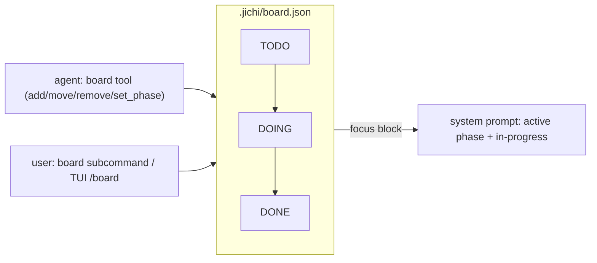

# Kanban phase board (`board`)

A durable, shared task board that helps **users and agents focus** on which
tasks and lifecycle phases are `todo` / `doing` / `done`. Unlike the
session-scoped todo list (`todowrite` -- one conversation's plan, saved with
that session and restored on resume since M606), the board persists to
`<cwd>/.jichi/board.json`, is shared by every session in the workspace, and
survives across runs. **No clock/scheduler** — it is
a focus artifact, not a timer.

## Turning it on

```json
{ "board": true }
```

When on, jichi loads `.jichi/board.json` at startup, registers the `board` tool for
the agent, and injects a compact **focus block** (the active phase + in-progress
cards) into the system prompt so the agent stays on the current task.

## Model

Each card has an `id`, a `title`, an optional `phase` (the assignments
lifecycle vocabulary — `design` · `implementation` · `testing` · …), an optional
`note`, and a `state` (`todo` → `doing` → `done`). The board also tracks an
active phase.



## Using it

**Agent** (the `board` tool, permission-gated like any mutating tool):
`{action:"add", title, phase?, note?}`, `{action:"move", id, state}`,
`{action:"remove", id}`, `{action:"set_phase", phase}`, `{action:"list"}`. Every
change is saved to disk immediately.

**User — CLI:**
```sh
jichi board                       # show the board
jichi board add "implement X" implementation
jichi board move 1 doing
jichi board done 1
jichi board phase testing
```

**User — TUI:** `/board` prints the current board (reloaded from disk, so it
reflects the agent's updates).

## Notes

- Cards + the active phase are persisted as JSON (the `jc_calib` load/save
  pattern); a missing or malformed file is tolerated (empty board).
- The board is a project artifact under `.jichi/` — commit it to share the plan
  with teammates, or git-ignore it for a personal scratch board.
- Distinct from `docs/assignments/` (teaching specs) and the ephemeral
  `todowrite` list (one conversation's plan; saved with that session since M606).
- **Main agent only.** A subagent is not offered `board` (nor `todowrite`/`todoread`)
  and is refused if it calls one: the board is shared with the human and outlives any
  subtask, so a delegate that cannot see the whole plan must not rewrite it. A
  delegate reports what it would have recorded in its final answer instead. See
  [`SUBAGENTS.md`](SUBAGENTS.md) (M436).
