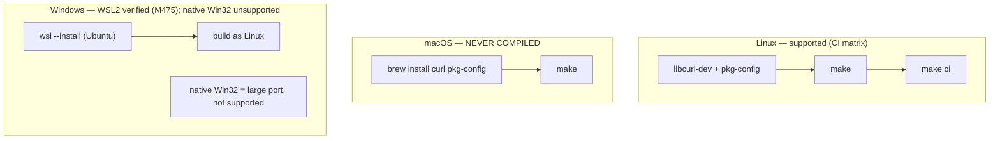

# Building jichi from source

jichi is **C89 + POSIX** with a tiny dependency surface: **libcurl**
(HTTPS/TLS/SSE), linked not vendored, and an in-tree JSON implementation
(`src/json/cJSON.{c,h}` — original code implementing the cJSON *API*, not a copy
of that library; no external package). The build is a plain `Makefile` — no
CMake, no autoconf.

jichi is distributed as **source only**: you compile it yourself. That is
deliberate — it keeps the dependency surface auditable and means no third-party
binary redistribution obligations travel with it. This document is the build
reference that choice implies.

> **New to compiling from source?** Read
> [`PREPARE_AND_BUILD.md`](PREPARE_AND_BUILD.md) instead — a from-nothing
> walkthrough (open a terminal → install tools → clone → `make` → verify) for
> Linux, macOS, and Windows/WSL. This page is the terse per-platform reference.

## Platform support at a glance



The verdict for every platform, with the evidence behind each one, lives on one
page: [`PLATFORMS.md`](PLATFORMS.md). The table below is that page's summary — if
the two ever disagree, PLATFORMS.md is right.

| Platform | Status | How |
| --- | --- | --- |
| **Linux** | **Verified** — compiled and gates run: gcc + clang, ASan/UBSan, valgrind, fuzz, smoke, e2e; x86-64, aarch64, armhf, s390x big-endian, musl static ([the matrix](PLATFORMS.md#the-matrix)) | native |
| **macOS** | **Never compiled.** Expected to build (BSD/POSIX), with **one** Darwin-specific code path — `jc_mem_total_mb`'s `sysctl(HW_MEMSIZE)`, which was un-compilable under this project's own C89 flags until M400 found it. "No Darwin-specific code" was this page's own claim, and it was wrong. | native |
| **Windows** | Not supported natively (POSIX process/terminal/signal/socket layers have no Win32 equivalent without a port) | **WSL2 — measured (M475, 2026-08-18):** full `make ci` green on Ubuntu 24.04 / WSL2 (12,418 unit checks under gcc *and* clang, smoke 209 drivers at multiplier **1**). Keep the checkout on the Linux filesystem, **not `/mnt/c`**. [PLATFORMS.md](PLATFORMS.md) |

## Linux (supported)

### Dependencies

| Distro | Install |
| --- | --- |
| Debian/Ubuntu | `sudo apt install build-essential libcurl4-openssl-dev pkg-config` |
| Fedora/RHEL | `sudo dnf install gcc make libcurl-devel pkgconf-pkg-config` |
| Arch | `sudo pacman -S base-devel curl pkgconf` |
| Alpine (musl) | `sudo apk add build-base curl-dev pkgconf` |

A C89 compiler (gcc or clang) is required; libcurl is needed for networking
(M2+). The core + unit tests build **without** libcurl (networking disabled).

### Build

```sh
make                # both binaries: jichi + jichi-convert
make jichi   # just the agent
make test           # build + run the unit suite (./run_tests)
make info           # show detected toolchain features
make clean
```

### Build knobs (opt-in)

| Knob | Effect |
| --- | --- |
| `make WERROR=1` | warnings as errors (first-party code must be warning-clean under `-std=c89 -pedantic -Wall -Wextra`) |
| `make SAN=1` | AddressSanitizer + UBSan (debugging) |
| `make SIZE=1` | size-optimized: `-Os` + section GC + stripped (low-resource targets) |
| `make SIZE=1 LTO=1` | + link-time optimization (smallest binary) |
| `make ci` | the full gate: gcc + clang builds, ASan/UBSan, valgrind, smoke, e2e. **Nine clean rebuilds**, so pass `-j`: the target itself carries none, and `$(MAKE)` propagates `MAKEFLAGS`, so `make -j$(nproc) ci` parallelises each sub-build while leaving `smoke` and `e2e` serial (single recipe lines) — which is what you want, since their PTY deadlines assume a quiet box. Measured **10m34s at `-j12`** on WSL2 / 12 cores (M475); the older "~2–3 min on real hardware" cannot have been a serial figure. On a small or loaded VM, run it as `JC_SMOKE_TIMEOUT_MULT=3 make ci` — the smoke tier's PTY deadlines assume a quiet box, and the multiplier is the designed lever (the Pi-class boards run 19–28; see LOW_MEMORY.md). Verify by **exit code**, never by grepping the output: the runner prefixes its failure replays, and a `grep -c '^not ok'` pipe read green over a driver that had been red for thirteen milestones (M368) |

#### Two knobs for a slow or remote target (M466)

The smoke tier is **fail-fast** — `run_driver … || exit 1` — which is right where the
fix loop is seconds long and close to useless on a remote platform row, because a
ten-minute unattended install then reports exactly *one* failing driver. An N-defect
platform costs N boots that way, and it also **masks**: OpenBSD's real stop was never
reached in three runs because an unrelated lint failing earlier in the list ended the
tier first.

| Knob | What it does |
|---|---|
| `JC_SMOKE_KEEP_GOING=1 make smoke` | run every driver and report the **whole** failure set, like `make -k`. Exit code is still 1 if anything failed, and the summary names each failing driver. Both BSD rigs pass it; the default stays fail-fast, so `make ci` is unchanged |
| `sh tests/smoke/run.sh <driver> [<driver>…]` | run only the named drivers. Re-checking one failure used to mean re-running all 201. A name that does not resolve is **exit 2**, never a silent skip that would report OK over zero drivers |

Both compose with `JC_SMOKE_TIMEOUT_MULT`. The rigs additionally take **`--dirty`**
(`scripts/tier-v-bsd.sh`, `scripts/tier-v-openbsd.sh`), which ships the *working tree*
instead of `git archive HEAD` — without it, verifying a portability fix on the platform
that found it requires committing the fix untested. A `--dirty` row stamps *NOT a
commit* in its results file.

The default build passes **no `-O` flag**. The Makefile probes the toolchain at
configure time: `JC_HAVE_VSNPRINTF` (C99 `vsnprintf` if present, else a bundled
fallback) and `HAVE_CURL` (via `pkg-config`, then a bare `-lcurl`).

### Static / cross builds

For a static musl binary or an embedded cross-compile (e.g.
`CC=arm-linux-gnueabihf-gcc` with a static libcurl), see
[`DEPLOYMENT.md`](DEPLOYMENT.md) §3e and [`LOW_MEMORY.md`](LOW_MEMORY.md).

### Install

```sh
make -j4              # build AS YOURSELF first -- install does not build (M586)
sudo make install     # installs both binaries (+ man page, Emacs lisp)
make install-check
sudo make uninstall
```

`install` deliberately has no build prerequisite. With one, `sudo make install`
rebuilds the tree as root and leaves every object file root-owned, so your next
plain `make` fails with *Operation not permitted*. If that has already happened,
`make clean` repairs it without sudo. See [`INSTALL.md`](INSTALL.md).

`install` also **refuses a binary built from a dirty tree** (M593). It prints the
revision it is about to install, and stops when that revision ends in `-dirty`:

```
make: *** refusing to install a binary built from a dirty tree.
  jichi is stamped 'a65c16e-dirty'. ...
```

The sequence that produces one is ordinary and succeeds at every step — build
while work is uncommitted, run the gate, commit, install — and the result is a
`jichi --version` reporting a revision nobody can check out. Rebuild as yourself
(`make -j4`) and install again. To install a dirty build on purpose, which is a
legitimate thing to want while testing a change on the real PATH binary:
`sudo make install ALLOW_DIRTY=1`.

## macOS (should build; unverified)

```sh
brew install curl pkg-config
export PKG_CONFIG_PATH="$(brew --prefix curl)/lib/pkgconfig"
make
```

The code is pure BSD/POSIX (`fork`/`exec`/`pipe`/`select`/`termios`/`sigaction`)
with **no glibc- or Darwin-specific calls**, so it should compile and run. It is
not yet in the CI matrix, so treat it as best-effort. Total RAM detection uses
`sysconf(_SC_PHYS_PAGES)`, which Darwin provides; the canonical macOS path is
`sysctl(HW_MEMSIZE)` (jichi prefers the sysctl value on Darwin when available and
falls back to `_SC_PHYS_PAGES`). Everything else (the TUI raw mode, the
fork-based tool/MCP/LSP spawners, the AF_UNIX daemon) is standard POSIX.

## Windows (WSL only)

Native Windows is **not supported**. jichi's process model (`fork`/`exec`/`pipe`/
`waitpid`), raw-mode terminal (`termios`), signal handling (`sigaction`), and the
daemon's `AF_UNIX` socket loop have no drop-in Win32 equivalents — a native port
would mean reimplementing the platform TU (`src/platform/jc_platform_posix.c`)
and the process chokepoint (`src/util/jc_proc.c`) plus the ~10 subsystems that
spawn processes (git/parallel/MCP/LSP/snapshot/bg/…) behind a Win32 backend.

**Use WSL2**, which runs the Linux build verbatim:

```powershell
wsl --install            # in an elevated PowerShell (installs Ubuntu)
```
then inside the WSL shell follow the **Linux** instructions above. Your Windows
files are under `/mnt/c/...`; for best performance keep the repo inside the WSL
filesystem (`~/…`).

### Future native port (not planned)

If native Windows ever becomes a priority, the clean seam is a `jc_platform`
vtable with a `jc_platform_win32.c` backend + a `CreateProcess`-based rewrite of
`jc_proc.c` and a Console-API terminal. This is a substantial effort and is
deliberately out of scope; the analysis in
[`ZIG_REWRITE_ANALYSIS.md`](ZIG_REWRITE_ANALYSIS.md) weighs it against a rewrite.

## Verifying a build

```sh
./jichi --version
./jichi doctor      # setup health check (libcurl, config, models, tools)
make test                  # unit suite
make ci                    # full gate (Linux)
```


---

## Toolchain probes, dependencies and the operator manuals (moved from CLAUDE.md at M516)

*Reference, moved out of the rules file when it was cut to what must reach a
model on every request (`docs/analysis/2026-08-21-self-hosting-first-review.md`
§5). The rule that stayed: libcurl is the only dependency and jichi vendors no
third-party source.*

The Makefile probes the toolchain at configure time:
- `JC_HAVE_VSNPRINTF` — use C99 `vsnprintf` if present, else a fallback formatter.
- `HAVE_CURL` — libcurl is required for networking (M2+) and links via
  `pkg-config`. The core + tests still build without it.

Dependencies: **libcurl** (HTTPS/TLS/SSE) — linked, not vendored — and nothing
else. jichi vendors **no third-party source**: `src/json/cJSON.{c,h}` is original
code that implements the cJSON *API*, not a copy of that library (M171).

Operator-facing manuals (long-form companions to the terse `man jichi.1`):
`docs/INSTALL.md` (system requirements + install, min/recommended),
`docs/DEPLOYMENT.md` (SSH, embedded/low-resource, TUI vs headless, driving jichi as
an automated agent), `docs/LOW_MEMORY.md` (minimal RAM footprint, RAM-budget
tiers, and build-time reduction for small/embedded/phone targets), and
`docs/AUTONOMOUS_LOOPS.md` (running one or more instances as an unattended/
scheduled loop over a task queue — tmux/systemd/cron supervisor, file/DB/HTTP
reporting via user-defined tools, threat model + hardening; reference artifacts in
`examples/autonomous-loop/`, gated by `make examples` + `tests/e2e/supervisor.py`),
and `docs/OBSERVABILITY.md` (the three JSONL sinks — telemetry, run journals,
privileged audit — and their offline readers `telemetry`/`runs`/`audit`
(M158: `jc_runsview`/`jc_auditview`, pure + unit-tested; M160 adds
`runs --since <dur>` and `--output json` on both readers via the pure
`jc_runsview_json`/`jc_auditview_json`), plus
`doctor --unattended` (M158b, escalates posture WARNs to FAILs so a loop
supervisor can gate on the exit code) and the `tests/smoke/docs_flags.sh`
docs↔flags lint).
