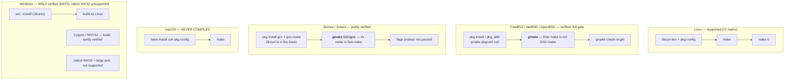

# Building jichi from source

jichi is **C89 + POSIX** with a tiny dependency surface: **libcurl**
(HTTPS/TLS/SSE), linked not vendored, and an in-tree JSON implementation
(`src/json/cJSON.{c,h}` — original code implementing the cJSON *API*, not a copy
of that library; no external package). The build is a plain `Makefile` — no
CMake, no autoconf.

jichi is distributed as **source only**: you compile it yourself. That is
deliberate — it keeps the dependency surface auditable and means no third-party
binary redistribution obligations travel with it. This document is the build
reference that choice implies.

> **New to compiling from source?** Read
> [`PREPARE_AND_BUILD.md`](PREPARE_AND_BUILD.md) instead — a from-nothing
> walkthrough (open a terminal → install tools → clone → `make` → verify) for
> Linux, macOS, and Windows/WSL. This page is the terse per-platform reference.

## Platform support at a glance



**The single most important line on this page, if you are not on Linux:** the
BSDs' and illumos's `make` is **not** GNU make, and this tree's `Makefile` is a
GNU makefile. Type **`gmake`**. Everything else is ordinary.

The verdict for every platform, with the evidence behind each one, lives on one
page: [`PLATFORMS.md`](PLATFORMS.md). The table below is that page's summary — if
the two ever disagree, PLATFORMS.md is right.

| Platform | Status | How |
| --- | --- | --- |
| **Linux** | **Verified** — compiled and gates run: gcc + clang, ASan/UBSan, valgrind, fuzz, smoke, e2e; x86-64, aarch64, armhf, s390x big-endian, musl static ([the matrix](PLATFORMS.md#the-matrix)) | native |
| **FreeBSD** | **Verified — the full gate**, and **Driven**: a live model call and a real tool call ran there. `gmake WERROR=1` clean in **7 s**; smoke **OK (305 drivers, 1,742 checks)** at the 0.9.2 release tree. | `pkg install gmake pkgconf curl` · `gmake` |
| **NetBSD** | **Verified — the full gate**, and **Driven**. Build clean in **8 s**. Ships GNU grep, which is why some text-tool defects hide here and surface on OpenBSD. | `pkg_add gmake pkg-config curl` · `gmake` |
| **OpenBSD** | **Verified — the full gate**, and **Driven**. Build clean in **9 s** with clang 19.1.7. Its `/bin/sh` is **ksh**, so the smoke tier runs under a shell nothing else in the matrix exercises. | `pkg_add gmake curl` · `gmake` |
| **illumos / Solaris** | **Partly verified, FULLY DRIVEN and GREEN since M703** (OmniOS CE) — both turns through the rig, re-driven 2026-09-22; `19 ok, 0 failed`, 317 of 317 smoke drivers, coverage debt 0. Clean `WERROR=1` build with gcc; **no source conditional was needed** — two build facts are probed. | [packages below](#illumos--solaris-partly-verified) · `gmake CC=gcc` |
| **macOS** | **Never compiled.** Expected to build (BSD/POSIX), with **one** Darwin-specific code path — `jc_mem_total_mb`'s `sysctl(HW_MEMSIZE)`, which was un-compilable under this project's own C89 flags until M400 found it. "No Darwin-specific code" was this page's own claim, and it was wrong. | native |
| **FreeMiNT (Atari) / MiNTLib** | **Never compiled** on FreeMiNT itself, but the tree **cross-compiles clean** since M723 (gcc 4.6.4, MiNTLib 0.60.1, `WERROR=1`). The cross-compile of 2026-09-24 had measured five gaps: M722 fixed jichi's own, `-Walloca`, which every gcc older than 7 rejects, and M723 the four places the source leaned on glibc's headers ([`DEFERRED.md`](DEFERRED.md)). Under ARAnyM the cross-built unit suite completes (13,707 checks, 19 failures) and `jichi --version` runs: M726 gave MiNT builds a 512 KB stack, and M727 made the path resolver a loop, since its recursion needed ~700 KB for a symlink cycle. The rig is `scripts/tier-v-freemint.sh`. | cross only: `m68k-atari-mint-gcc` from `ppa:vriviere/ppa` — [the plan](plans/2026-09-freemint-aranym.md) |
| **Windows** | Not supported natively (POSIX process/terminal/signal/socket layers have no Win32 equivalent without a port). **WSL2 is the measured path**; **Cygwin** and **MSYS2** are *partly verified* — they build and pass the tier, but not `make ci`, and MSYS2 needs a mount option before jichi's file-privacy guarantees hold at all. | **WSL2 — measured (M475, 2026-08-18):** full `make ci` green on Ubuntu 24.04 / WSL2 (12,418 unit checks under gcc *and* clang, smoke 209 drivers at multiplier **1**). Keep the checkout on the Linux filesystem, **not `/mnt/c`**. [PLATFORMS.md](PLATFORMS.md) |

## Linux (supported — the reference platform)

*"Supported" and "verified" are two different claims on this page, and the
difference matters when something breaks.* **Supported** means the hosted CI
matrix builds and gates every commit there, so a regression is caught before you
see it — that is Linux, and only Linux. **Verified** means a human ran the whole
gate on that platform at a recorded milestone and it passed — the three BSDs, and
most of it on illumos. A verified platform is not watched between those runs, so
if you hit a break on one, you may be the first person to see it; the fix loop is
the same, and [`PLATFORMS.md`](PLATFORMS.md) records what the last run measured.

### Dependencies

| Distro | Install |
| --- | --- |
| Debian/Ubuntu | `sudo apt install build-essential libcurl4-openssl-dev pkg-config` |
| Fedora/RHEL | `sudo dnf install gcc make libcurl-devel pkgconf-pkg-config` |
| Arch | `sudo pacman -S base-devel curl pkgconf` |
| Alpine (musl) | `sudo apk add build-base curl-dev pkgconf` |

A C89 compiler (gcc or clang) is required; libcurl is needed for networking
(M2+). The core + unit tests build **without** libcurl (networking disabled).

### Build

```sh
make                # both binaries: jichi + jichi-convert
make jichi   # just the agent
make test           # build + run the unit suite (./run_tests)
make info           # show detected toolchain features
make clean
```

### Build knobs (opt-in)

| Knob | Effect |
| --- | --- |
| `make WERROR=1` | warnings as errors (first-party code must be warning-clean under `-std=c89 -pedantic -Wall -Wextra`) |
| `make SAN=1` | AddressSanitizer + UBSan (debugging) |
| `make SIZE=1` | size-optimized: `-Os` + section GC + stripped (low-resource targets) |
| `make SIZE=1 LTO=1` | + link-time optimization (smallest binary) |
| `make ci` | the full gate: gcc + clang builds, ASan/UBSan, valgrind, smoke, e2e. **Nine clean rebuilds**, so pass `-j`: the target itself carries none, and `$(MAKE)` propagates `MAKEFLAGS`, so `make -j$(nproc) ci` parallelises each sub-build while leaving `smoke` and `e2e` serial (single recipe lines) — which is what you want, since their PTY deadlines assume a quiet box. Measured **10m34s at `-j12`** on WSL2 / 12 cores (M475); the older "~2–3 min on real hardware" cannot have been a serial figure. On a small or loaded VM, run it as `JC_SMOKE_TIMEOUT_MULT=3 make ci` — the smoke tier's PTY deadlines assume a quiet box, and the multiplier is the designed lever (the Pi-class boards run 19–28; see LOW_MEMORY.md). Verify by **exit code**, never by grepping the output: the runner prefixes its failure replays, and a `grep -c '^not ok'` pipe read green over a driver that had been red for thirteen milestones (M368) |

#### Two knobs for a slow or remote target (M466)

The smoke tier is **fail-fast** — `run_driver … || exit 1` — which is right where the
fix loop is seconds long and close to useless on a remote platform row, because a
ten-minute unattended install then reports exactly *one* failing driver. An N-defect
platform costs N boots that way, and it also **masks**: OpenBSD's real stop was never
reached in three runs because an unrelated lint failing earlier in the list ended the
tier first.

| Knob | What it does |
|---|---|
| `JC_SMOKE_KEEP_GOING=1 make smoke` | run every driver and report the **whole** failure set, like `make -k`. Exit code is still 1 if anything failed, and the summary names each failing driver. Both BSD rigs pass it; the default stays fail-fast, so `make ci` is unchanged |
| `sh tests/smoke/run.sh <driver> [<driver>…]` | run only the named drivers. Re-checking one failure used to mean re-running all 201. A name that does not resolve is **exit 2**, never a silent skip that would report OK over zero drivers |

Both compose with `JC_SMOKE_TIMEOUT_MULT`. The rigs additionally take **`--dirty`**
(`scripts/tier-v-bsd.sh`, `scripts/tier-v-openbsd.sh`), which ships the *working tree*
instead of `git archive HEAD` — without it, verifying a portability fix on the platform
that found it requires committing the fix untested. A `--dirty` row stamps *NOT a
commit* in its results file.

The default build passes **no `-O` flag**. The Makefile probes the toolchain at
configure time: `JC_HAVE_VSNPRINTF` (C99 `vsnprintf` if present, else a bundled
fallback) and `HAVE_CURL` (via `pkg-config`, then a bare `-lcurl`).

### Static / cross builds

For a static musl binary or an embedded cross-compile (e.g.
`CC=arm-linux-gnueabihf-gcc` with a static libcurl), see
[`DEPLOYMENT.md`](DEPLOYMENT.md) §3e and [`LOW_MEMORY.md`](LOW_MEMORY.md).

### Install

```sh
make -j4              # build AS YOURSELF first -- install does not build (M586)
sudo make install     # installs both binaries (+ man page, Emacs lisp)
make install-check
sudo make uninstall
```

`install` deliberately has no build prerequisite. With one, `sudo make install`
rebuilds the tree as root and leaves every object file root-owned, so your next
plain `make` fails with *Operation not permitted*. If that has already happened,
`make clean` repairs it without sudo. See [`INSTALL.md`](INSTALL.md).

`install` also **refuses a binary built from a dirty tree** (M593). It prints the
revision it is about to install, and stops when that revision ends in `-dirty`:

```
make: *** refusing to install a binary built from a dirty tree.
  jichi is stamped 'a65c16e-dirty'. ...
```

The sequence that produces one is ordinary and succeeds at every step — build
while work is uncommitted, run the gate, commit, install — and the result is a
`jichi --version` reporting a revision nobody can check out. Rebuild as yourself
(`make -j4`) and install again. To install a dirty build on purpose, which is a
legitimate thing to want while testing a change on the real PATH binary:
`sudo make install ALLOW_DIRTY=1`.

## FreeBSD, NetBSD, OpenBSD (verified — the full gate)

All three **compile clean at `WERROR=1` and run the whole test tier**, and all
three have had a real model driven on them — a live turn in which the model
chose a tool, the tool ran, and a second turn consumed its result.

**There is not one `#ifdef __FreeBSD__`, `__NetBSD__` or `__OpenBSD__` in this
source tree.** What FreeBSD forced at M460 was three *capability* guards — a
`#ifdef _SC_NPROCESSORS_ONLN` in the platform TU, and `INADDR_LOOPBACK` and
`SIGWINCH` in two test tools — because this tree compiles with
`-D_POSIX_C_SOURCE=200112L` and FreeBSD hides those behind `__BSD_VISIBLE` where
four Linux libcs expose them anyway. Those three guards then carried OpenBSD and
NetBSD with **no further change**, and illumos after them. That is the strongest
evidence this page can offer that the source is portable rather than accidentally
Linux: not that it has many platform branches, but that it has none.

### Dependencies

These are the package sets the rigs actually install, which is why they are
exactly these names:

```sh
# FreeBSD
pkg install gmake pkgconf curl git

# NetBSD
pkg_add gmake pkg-config curl git-base

# OpenBSD
pkg_add gmake curl git
```

**On NetBSD, `pkg-config` is required and not a nicety.** pkgsrc installs into
`/usr/pkg`, which the base compiler does not search, so without it the libcurl
probe answers *no*, `make info` prints a bare `HAVE_CURL =`, and you get a
**networkless jichi that built without a single error**. Same reasoning on
FreeBSD, where the package is spelled `pkgconf`.

`poppler-utils` is **not** a dependency — jichi shells out to `pdftotext` for
PDF documents and errors actionably when it is absent. Install it if you want
that path, and the tier's two PDF drivers, to run: `pkg_add poppler-utils` on
NetBSD and OpenBSD.

### Build

```sh
gmake                 # NOT `make`
gmake check-target    # unit suite + smoke tier, the on-target gate
```

**Use `gmake`, not `make`.** FreeBSD's and NetBSD's `make` is **bmake**;
OpenBSD's is BSD make. None of them parses a GNU makefile, and the error you get
is a parse error somewhere in the middle of it rather than a clear "wrong make".
This is the one thing that stops a first build on these systems.

### What to expect, measured

*Build times measured by the rigs on 2026-09-19, four cores under KVM. They
are wall-clock for a full `gmake WERROR=1` from clean.*

| | build (`WERROR=1`) | notes |
|---|---|---|
| FreeBSD 15.1 | **7 s** | clang 19.1.7, libcurl 8.16 from `pkg` |
| NetBSD 10.1 | **8 s** | gcc; ships **GNU** grep, unlike its siblings |
| OpenBSD 7.9 | **9 s** | clang 19.1.7; `/bin/sh` is **ksh** |

**No `/proc`.** `jc_have_proc_rss()` reports the RSS watchdog unavailable and the
memory guard **degrades rather than crashing** — that was a prediction the
FreeBSD row was run to test, and it held. Nothing for you to configure.

**If you are porting or debugging here**, the failures these rows have actually
found were almost all in the *test tier's* own `grep`/`sed`/`awk` usage rather
than in jichi: GNU extensions that a BSD accepts silently and ignores
(`grep -r --include=`), refuses outright (a BRE `\(…\)\?`), or reads as a
literal (`\|` alternation, and `\n` in a `sed` replacement). If a driver fails
here and jichi looks wrong, suspect the driver first — that has been the answer
every time so far.

## illumos / Solaris (partly verified)

The first non-Linux, **non-BSD** kernel this tree was built on. It compiles clean
and runs the unit suite and most of the smoke tier.

### Dependencies and build

```sh
# OmniOS CE -- other illumos distributions spell these differently
pkg install developer/gcc14 developer/build/gnu-make developer/versioning/git
gmake CC=gcc
gmake CC=gcc check-target
```

No curl package appears there because **OmniOS ships libcurl and its headers in
the base image**: `HAVE_CURL = yes` with nothing but the compiler and make
installed.

**Both halves of that command line are load-bearing.**

**`gmake`, because illumos *has* a `make` and it is Sun make.** That is worse
than the BSD case, where the wrong make is at least differently named: here the
command you would reach for exists, runs, and is not the one this tree needs.

**`CC=gcc`, because there is no `cc` and no `c99`.** The Makefile's default is
`CC ?= cc` (line 13), and when that binary is absent the result is not "no
compiler" — it is **every capability probe answering "no"**, so `gmake info`
cheerfully reports no vsnprintf, no curl, no `malloc_trim`, and you build a
degraded binary with no error anywhere. Pass `CC=gcc` and the probes tell the
truth. This is the same failure shape M476 found on Cygwin from a different
cause, which is why the probes are worth distrusting until one of them says
something you can check.

### Two build facts, both probed rather than passed

You do **not** need to set these; they are listed so the output of `gmake info`
makes sense:

- **`-D__EXTENSIONS__`** — Solaris hides every non-POSIX interface when
  `_POSIX_C_SOURCE` is defined, and takes `struct winsize` / `TIOCGWINSZ` with
  it. The Makefile probes for that and adds the macro when it is needed.
- **`-lsocket -lnsl`** — `accept`, `listen` and `bind` are not in its libc. Same
  story: probed, and linked only where the probe says they are required.

**No source conditional was added for illumos**, which is the same outcome the
BSD rows produced and the reason this page can claim portability rather than a
pile of `#ifdef`s.

### What is not verified here

Some smoke drivers still fail, and the cause is known and recorded: illumos ships
the **legacy Solaris text tools**, and `grep -o` there prints only the **first**
match per line where GNU prints every one. Several lints flatten a file and
extract many items that way. `docs/PLATFORMS.md` carries the current count and
the per-driver detail; this page does not duplicate it, because a number in two
places is a number that will disagree with itself.

## macOS (should build; unverified)

```sh
brew install curl pkg-config
export PKG_CONFIG_PATH="$(brew --prefix curl)/lib/pkgconfig"
make
```

The code is BSD/POSIX (`fork`/`exec`/`pipe`/`select`/`termios`/`sigaction`), and
the three BSD rows above are the closest evidence there is that it will build
here — none of them needed a single source conditional. But **nobody has ever
compiled this tree on a Mac**, so this section is a prediction, not a
measurement.

There is exactly **one Darwin-specific code path**: total-RAM detection prefers
`sysctl(HW_MEMSIZE)` on Darwin and falls back to `sysconf(_SC_PHYS_PAGES)`. This
page used to claim there was *no* Darwin-specific code at all; M400 found that
path and found it un-compilable under this project's own C89 flags, which is
worth knowing before you trust any other unmeasured claim on this page. Everything
else (the TUI raw mode, the fork-based tool/MCP/LSP spawners, the AF_UNIX daemon)
is standard POSIX.

If you build it, `make check-target` is the gate to run, and a result — green or
red — is welcome; it is the one row in the matrix that has never been filled in.

## Windows (WSL2, or one of two POSIX emulation layers)

Native Windows is **not supported**. jichi's process model (`fork`/`exec`/`pipe`/
`waitpid`), raw-mode terminal (`termios`), signal handling (`sigaction`), and the
daemon's `AF_UNIX` socket loop have no drop-in Win32 equivalents — a native port
would mean reimplementing the platform TU (`src/platform/jc_platform_posix.c`)
and the process chokepoint (`src/util/jc_proc.c`) plus the ~10 subsystems that
spawn processes (git/parallel/MCP/LSP/snapshot/bg/…) behind a Win32 backend.

**Use WSL2**, which runs the Linux build verbatim:

```powershell
wsl --install            # in an elevated PowerShell (installs Ubuntu)
```
then inside the WSL shell follow the **Linux** instructions above. Your Windows
files are under `/mnt/c/...`; for best performance keep the repo inside the WSL
filesystem (`~/…`). This is the measured path: a full `make ci` is green on
Ubuntu 24.04 / WSL2 (M475), which no other Windows route can say.

### The two POSIX emulation layers, if WSL2 is not available

Both build; neither runs `make ci`. **Read the caveat under MSYS2 before you put
an API key on one of them.**

| | Build | What was measured |
|---|---|---|
| **Cygwin** 3.6.10, gcc 14.4.0 | `make` (GNU make is Cygwin's `make`) | Clean at `WERROR=1`, fully featured. Re-measured at M697 (2026-09-22): **13,438 checks / 0 failures**, the full **317-driver** tier. No product change was needed. |
| **MSYS2** 3.6.10, gcc 15.3.0, the **MSYS** environment | `make`, **94 s** | Clean at `WERROR=1`. **12,440 unit checks**, smoke **211 drivers / 1,157 checks**. MINGW64 is a different environment and has never been measured. |

**The fork penalty is the number to plan around.** Warm (binary already built),
the smoke tier costs **45–59 s** on Cygwin against **6.2–6.5 s** on WSL2 —
roughly **7–9×**. Run the tier as `JC_SMOKE_TIMEOUT_MULT=10 make smoke`; without
it, drivers fail on deadlines rather than on behaviour. MSYS2 was measured at
multiplier 8.

**MSYS2 only: `chmod` is a no-op by default, and jichi's file-privacy
guarantees do not hold.** The MSYS2 root is mounted `noacl`, so `chmod 0600`
returns success and changes nothing — measured, and it leaves the **API key
file**, the **daemon socket** and the **audit log** world-readable. This is
configuration, not Windows: on the same machine and the same NTFS volume,
Cygwin's `chmod 600` yields 600. Fix it before you use jichi there, by adding an
`acl` mount to `/etc/fstab`:

```
C:/msys64/tmp /tmp ntfs binary,acl 0 0
```

With that one line, all four privacy failures clear (unit suite 12,437 / **0**).
Two smoke drivers still fail under `acl` for an unrelated reason — on NTFS the
owner keeps access to a `chmod 000` path, so those drivers cannot construct the
unreadable fixture they test.

**Do not run Cygwin and MSYS2 at the same time.** Their `cygwin1.dll` and
`msys-2.0.dll` shared-memory regions collide, `fork` then begins failing in
both, and you are left with a stranded package-manager lock.

### Future native port (not planned)

If native Windows ever becomes a priority, the clean seam is a `jc_platform`
vtable with a `jc_platform_win32.c` backend + a `CreateProcess`-based rewrite of
`jc_proc.c` and a Console-API terminal. This is a substantial effort and is
deliberately out of scope; the analysis in
[`ZIG_REWRITE_ANALYSIS.md`](ZIG_REWRITE_ANALYSIS.md) weighs it against a rewrite.

## Verifying a build

```sh
./jichi --version
./jichi doctor      # setup health check (libcurl, config, models, tools)
make test           # unit suite
make check-target   # unit suite + smoke tier -- the gate to run ON a platform
make ci             # the full gate: gcc + clang, ASan/UBSan, valgrind, e2e
```

`make ci` is the **Linux** gate: it wants two compilers, valgrind and the
sanitizers. On a BSD, on illumos, or on a small board, `gmake check-target` is
the one to run — it is what every non-Linux row in the table above was measured
with. On a slow or remote target, add the two levers from
[the knobs above](#two-knobs-for-a-slow-or-remote-target-m466):
`JC_SMOKE_KEEP_GOING=1 JC_SMOKE_TIMEOUT_MULT=3 gmake check-target`.

### Two `doctor` warnings that are expected off Linux, and are not your build

Both are jichi reporting a **fact about the platform**, not a fault in the
binary you just made. Neither needs fixing; one is worth acting on.

- **`! host platform not recognised`** — the generic non-Linux note. illumos
  reports it, and the rest of that run is `23 ok, 8 warnings, 0 problems`. It
  means only that PLATFORMS.md, not the binary, is where the verdict lives.
- **`! core count`** — *this platform does not expose a core count to jichi, so
  it reads 1.* FreeBSD and NetBSD hide `_SC_NPROCESSORS_ONLN` behind
  `__BSD_VISIBLE`, and this tree compiles `-D_POSIX_C_SOURCE=200112L`, so
  `jc_cpu_count()` degrades to 1 rather than guessing. **This one has a
  consequence**: `maxParallelAgents` defaults to the core count, so
  `spawn_parallel` would run a single child on a machine with sixteen. Set
  `"maxParallelAgents"` in your config explicitly there.

  The warning fires on the *fact* — the count is unavailable — and not on the
  *suspicion* that a 1 is wrong, because a genuine one-core VM is an ordinary
  thing and must not be nagged. An earlier unit test asserted
  `jc_cpu_count_known() == 1` as though it were universal, and broke the
  FreeBSD row; the portable contract is the weaker one, that when the count is
  not known it reads exactly 1.


---

## Toolchain probes, dependencies and the operator manuals (moved from CLAUDE.md at M516)

*Reference, moved out of the rules file when it was cut to what must reach a
model on every request (`docs/analysis/2026-08-21-self-hosting-first-review.md`
§5). The rule that stayed: libcurl is the only dependency and jichi vendors no
third-party source.*

The Makefile probes the toolchain at configure time:
- `JC_HAVE_VSNPRINTF` — use C99 `vsnprintf` if present, else a fallback formatter.
  Asked twice since M736, at the POSIX level and then at `-D_XOPEN_SOURCE=600`,
  because an older glibc declares `snprintf` under `-std=c89` only at the second
  (Debian 5's 2.7, where the one-question probe took the fallback). The fallback
  has no width, precision or flags, so `make info` says so when it is chosen.
- `HAVE_CURL` — libcurl is required for networking (M2+) and links via
  `pkg-config`. The core + tests still build without it.
- …and more (the clock, `malloc_trim`, the terminal's `winsize`, sockets,
  STREAMS ptys, `lstat` and `mmap` since M723, the optional warning flags --
  `-Wvla` among them since M736, which gcc before 4.3 rejects).
  **`make info` prints every probe's answer, and is the list to trust**; this one
  names only the two every build meets.

Dependencies: **libcurl** (HTTPS/TLS/SSE) — linked, not vendored — and nothing
else. jichi vendors **no third-party source**: `src/json/cJSON.{c,h}` is original
code that implements the cJSON *API*, not a copy of that library (M171).

Operator-facing manuals (long-form companions to the terse `man jichi.1`):
`docs/INSTALL.md` (system requirements + install, min/recommended),
`docs/DEPLOYMENT.md` (SSH, embedded/low-resource, TUI vs headless, driving jichi as
an automated agent), `docs/LOW_MEMORY.md` (minimal RAM footprint, RAM-budget
tiers, and build-time reduction for small/embedded/phone targets), and
`docs/AUTONOMOUS_LOOPS.md` (running one or more instances as an unattended/
scheduled loop over a task queue — tmux/systemd/cron supervisor, file/DB/HTTP
reporting via user-defined tools, threat model + hardening; reference artifacts in
`examples/autonomous-loop/`, gated by `make examples` + `tests/smoke/supervisor.sh`),
and `docs/OBSERVABILITY.md` (the three JSONL sinks — telemetry, run journals,
privileged audit — and their offline readers `telemetry`/`runs`/`audit`
(M158: `jc_runsview`/`jc_auditview`, pure + unit-tested; M160 adds
`runs --since <dur>` and `--output json` on both readers via the pure
`jc_runsview_json`/`jc_auditview_json`), plus
`doctor --unattended` (M158b, escalates posture WARNs to FAILs so a loop
supervisor can gate on the exit code) and the `tests/smoke/docs_flags.sh`
docs↔flags lint).
