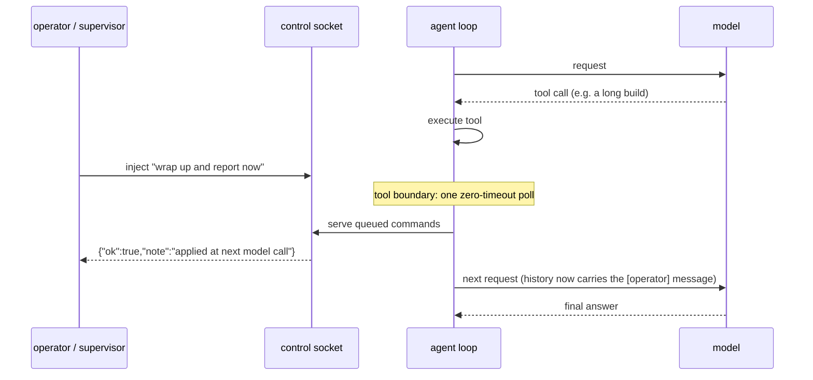

# The mid-run control channel (`--control`, M159)

A bounded `--auto` run could always be *observed* — `--output jsonl`, the
envelope journal, [`runs`](OBSERVABILITY.md) — but not *steered*: once it
started, your only interventions were watching and SIGTERM. The control
channel closes that gap. It is what turns an [autonomous loop](AUTONOMOUS_LOOPS.md)
from "unsupervised" into genuinely **semi-supervised**.

Design history: [proposals/2026-07-control-channel.md](proposals/2026-07-control-channel.md)
(the accepted design, including the alternatives considered). This page is the
operator manual.

## Quick start

```sh
# Start a bounded run with a control socket (off by default):
jichi --auto --control \
    --budget-tokens 400k --deadline 30m \
    -p "refactor the parser" &
# stderr prints: [control] listening on ~/.jichi.d/control/<pid>.sock

# From any other shell (same user), steer it:
jichi control ~/.jichi.d/control/<pid>.sock status
jichi control <sock> inject "skip the tests; write the report now"
jichi control <sock> pause            # deadline keeps running
jichi control <sock> pause --extend   # deadline clock stopped (M162)
jichi control <sock> resume
jichi control <sock> abort
```

`--control` takes an optional explicit path (`--control /run/jichi/task.sock`);
config `control: true` (or a path string) does the same per project. The
socket is unlinked at teardown.

## The six verbs

| Verb | Effect | Answered |
|---|---|---|
| `status` | one JSON snapshot: run id, **`mode`** (M304), elapsed, `tokens_used`/`budget_tokens`, `tool_calls`/`max_tool_calls`, `deadline_secs`, outcome-so-far, `last_tool`, `paused` | at the next tool boundary |
| `inject <text>` | queued; lands as **one user-role message prefixed `[operator]`** before the next model call | ack at the boundary; applied at the next model call |
| `pause` | the loop blocks at the boundary until `resume`/`abort` — **the deadline clock keeps running** | at the boundary |
| `pause --extend` | as `pause`, but the paused time is **credited back to the deadline** on exit (M162) — for a deliberate human inspection that shouldn't burn the run's budgeted time | at the boundary |
| `resume` | wakes a paused loop (an `--extend` pause settles its credit here, journaled as `credited`) | immediately (served by the pause-wait) |
| `abort` | graceful stop — identical to Ctrl-C/SIGTERM (M80 keep-or-rollback semantics, exit 130) | at the boundary |
| `mode <chat\|plan>` | **narrows** the operating posture (M304) and persists past the turn | at the boundary |



## Semantics that matter (the accepted design decisions)

- **Boundary-only.** Commands are served at **tool-call boundaries** — the
  same safe point where budgets are checked and background processes are
  reaped. A command never interleaves with a streaming response or a
  half-applied tool, and there are no threads. The price: behind a slow model
  call, a reply can take as long as that call. The client waits up to 300s
  and says so; the command is still queued on the listen backlog either way.
- **Injection is history, not prompt.** Steering lands as a normal
  **user-role message** with an explicit `[operator] ` prefix — visible to the
  model, preserved in the session transcript, compacted like any turn, and
  never touching the cached system prefix (M31 stays byte-stable). Multiple
  injects between boundaries are folded into one message.
- **Pause is honest about time — extending it is explicit.** `--deadline` is a
  wall-clock promise to the supervisor; a plain pause does **not** stop that
  clock, and if the deadline passes while paused the run resumes just to stop
  properly (budget semantics, M80). When a human inspection *shouldn't* burn
  the run's budgeted time, `pause --extend` (M162) freezes the deadline: the
  paused seconds are credited back (`deadline_credit` — visible live in
  `status`, settled and journaled as `credited` on resume/abort). The credit
  is the **only** thing that may stretch a deadline, it is always operator-
  initiated, and always on the books — a supervisor's outer timeout should
  still be generous enough to tolerate deliberate pauses.
- **Steering is auditable.** Every accepted command (except read-only
  `status`) is journaled — `{"event":"control","cmd":"inject","text":...}`,
  bounded and secret-scrubbed — and the [`runs`](OBSERVABILITY.md) reader
  surfaces it (M161): a steered run carries a `steered=N` note in the triage
  table and a `"steered": N` field in `--output json`, so a post-mortem can
  distinguish steered behavior from model-chosen behavior at a glance.

## Narrowing the posture (`mode`, M304)

```sh
jichi control ~/.jichi.d/control/1234.sock mode plan   # read-only from here
jichi control ~/.jichi.d/control/1234.sock mode chat   # ask before mutating
```

**One-way, by construction.** The permitted moves are exactly those that reduce
what the agent may do unattended:

```
auto  --->  chat  --->  plan
(widest)                (narrowest)
```

Anything else is refused with a reason. `auto` is widest because it approves every
permitted tool; `plan` is narrowest because nothing mutates at all.

Note that this ordering is **not** `enum jc_agent_mode`'s numeric order (it is
declared `CHAT, PLAN, AUTO`), so the decision lives in a pure, exhaustively tested
`jc_perm_mode_narrows` rather than a comparison — a `to > from` would have made
`auto → chat` look like a widening and got the safety property exactly backwards.

**It persists past the turn.** An operator who said "plan mode" meant it; silently
reverting at the next turn boundary would be the same class of surprise as a gate
that forgets. Journaled like every non-status command, so an audit shows when the
posture changed.

**Why a run you can only tighten is safe to expose:** a socket that could loosen a
running agent would be a privilege-escalation surface wearing a convenience hat.
Tightening needs no trust; loosening needs all of it. To widen, restart the run.

## What "at the next tool boundary" costs you in practice (measured M429)

Every verb above is served at a tool-call boundary, which is stated per-row in the
table. The consequence is worth stating separately, because it surprised the person
who wrote that table:

**A run with few tool calls, or one already past its last boundary, will not answer
at all.** Probed on a real run: the socket appeared in 2 seconds with the documented
`0600` permissions, the run made **four** tool calls in its first twenty seconds, and
a `status` sent after that **blocked for the client's full 300-second timeout** and was
never served — the run spent the rest of its life inside model calls and then exited.
The journal recorded no `control` event, correctly: nothing was ever served.

Two things follow.

- **`--control` suits long, tool-heavy runs** — the ones you actually want to steer. On
  a short or read-then-answer run, expect the channel to be unreachable in practice, and
  do not read a client timeout as a hung agent.
- **The client's error message is the thing to trust.** It says *"no reply within 300s
  (the run may be inside a long model call; the command was still queued if the connect
  succeeded)"* — which is precisely the right diagnosis, including the part where a
  queued command may still land later. Nothing in that sentence needed changing; it is
  quoted here so the limit is findable before you hit it rather than after.

This is the same boundary-granularity property that makes `--deadline` a
notice-time rather than a wall-clock bound (see
[AUTONOMY.md](AUTONOMY.md)) — one design decision, two visible consequences.

### Two of those boundaries were added in M438

The measurement above stands, but two of its causes were avoidable and are now fixed:

- **Before the first request.** The socket is served once before each model call is
  built, so a supervisor that connects during startup or during the first round gets an
  answer instead of waiting out the round. This is a clean history point, so a queued
  `inject` reaches the request about to be built rather than the one after it.
- **Between the tool calls of one round.** A round with four calls used to answer
  `status` once, at the end — measured at 8 seconds' delay on a 12-second round, now
  about 1. This service point is **poll-only**: `status`, `pause`, `resume` and `abort`
  are answered immediately, while an `inject` stays queued for the round boundary. That
  is not a limitation to work around but a correctness requirement — folding a user-role
  message between two tool results of the same round makes the request malformed, which
  is exactly what `jc_history_check` (M364) exists to detect.

**What is still true:** the socket is not served *during* a model call, so a run that
spends its life inside model calls remains unreachable. Serving there would mean polling
from libcurl's progress callback, where a `pause` would block the HTTP read and could
time the request out. For liveness across that window, use `--heartbeat` (M165) or tail
the journal — which since M438 carries an `open` record with the run's pid from the
moment the file exists, so it is never an empty file while the process lives.

## What the channel deliberately cannot do

The socket must never *widen* what a run may do:

- **No widening `mode`.** `mode` only narrows (above); `plan → auto` is refused.
- **No `approve` verb.** Privileged commands (M153) and permission prompts
  cannot be answered remotely; that decision stays with an interactive human.
- **No budget, scope, or permission changes.** Steering can only narrow
  (stop, skip, report) — like hooks (M25), never grant.
- **No TCP, ever.** A unix socket, `0600`, in a `0700` directory: filesystem
  permissions are the whole ACL. Remote control = SSH to the host first,
  inheriting exactly the authentication story we want.

## The keyboard's version of the same thing

The TUI's **type-ahead queue** ([TYPE_AHEAD.md](TYPE_AHEAD.md), M254) reuses this
channel's semantics for the human at the keyboard: a line typed while the agent
works is applied at the same tool-call boundary, as the same single
`[operator]`-prefixed user message (both call `jc_history_add_operator`). One
convention for "text that arrived mid-turn", whether it came over a socket or off
a keyboard.

## With the autonomous loop

The reference supervisor ([AUTONOMOUS_LOOPS.md](AUTONOMOUS_LOOPS.md),
`examples/autonomous-loop/`) composes naturally: start each task with
`--control "$QUEUE/running/$base.sock"` and a watcher can nudge a drifting
task (`inject`), hold it for inspection (`pause`), or cut a loss early
(`abort` — the loop's exit-code routing treats 130 as an interruption and
requeues). `status` gives the supervisor a cheap progress probe without
parsing the jsonl stream.

## Verification

Pure codec unit tests (`tests/test_control.c`); the full channel is
E2E-driven (`tests/e2e/control.py`): a mock-model run is steered live —
`status` and `inject` served at the boundary with the `[operator]` message
asserted inside the next model request, `pause`/`status(paused)`/`resume`,
and `abort` → exit 130.

See also: [AUTONOMY.md](AUTONOMY.md), [AUTONOMOUS_LOOPS.md](AUTONOMOUS_LOOPS.md),
[OBSERVABILITY.md](OBSERVABILITY.md), [SCRIPTING.md](SCRIPTING.md),
[DAEMON.md](DAEMON.md).
