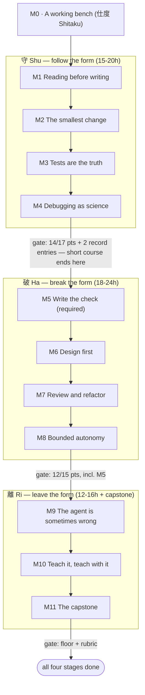
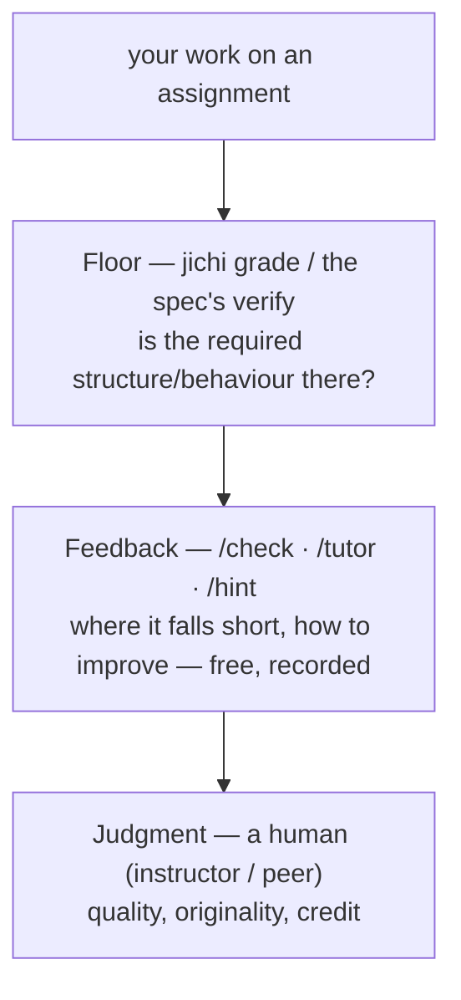

# The curriculum — learning software development with an agent at your side

This is the **map** of the taught road. [JOURNEY.md](JOURNEY.md) sequences the
same road as a practice; this curriculum makes it a course: modules with
mechanically graded assignments, gates you can check with one command, and a
record you keep. The design (and its honest limits) is in
[`proposals/2026-07-curriculum.md`](proposals/2026-07-curriculum.md).

**Who it is for.** A self-learner with a laptop, alone — that is the design
case. A classroom or a university course is the same spine with an instructor
layered on top — [`curriculum/INSTRUCTOR.md`](curriculum/INSTRUCTOR.md) is
that guide — and if you are working alone, **read four of its sections anyway**:
§0.5 has the only per-module reading schedule for the source-reading guides, §2
explains the hint ladder and tells you that re-tiering a task's hints is one word
of frontmatter in *your* bench, §3 lists the failure modes to expect per module
(what a teacher would warn you about), and §5's honest-limits column says exactly
which floors a script cannot check. None of that is instructor-only knowledge; it
is simply where it was written down.

**If the prose here is dense**, start with
[PLAIN_LANGUAGE.md](PLAIN_LANGUAGE.md) and its three plain-register tasks
(`p1`–`p3`), then come back. **If you have no compiler yet** — or do not want one
today — the **process track** (tasks 67–73,
[`assignments/INDEX.md`](assignments/INDEX.md)) is a complete 17-point graded path
that needs nothing but jichi and a text editor: requirements, use cases, design,
documentation, session notes, kanban, scheduling. It is the one graded track you
can start on your first day.

The proposal §6 has the three course formats. You do not need prior programming experience for Stage 0–1; you do
need honesty with your own record.

**What is actually taught.** Two skills, braided: driving an agent safely
(precise requests, reading diffs, verification, bounded autonomy) and the
craft itself (comprehension, minimal changes, tests, debugging as science).
The agent is not a shortcut through the craft — it is the instrument you
practice the craft *on*.

## The stages

Twelve modules in four stages; **each stage is severable** — Stage 0+1 alone
is a complete short course ("safe, productive agentic work").

> **守破離 *shu-ha-ri*** is a traditional model of how any skill is mastered:
> first **obey** the form (*Shu*), then **break** it once you own it (*Ha*),
> then **leave** it and move freely (*Ri*). The stages below walk that arc,
> after a short **仕度 *shitaku*** (preparation) to get a working bench.



*Stage 0+1 (仕度 + 守) is severable — a complete short course on its own. M5 is
**required** and cannot be averaged away.*

**Those gate numbers are a permission, and it is worth reading before you need
it.** *14 of 17* means the margin is exactly one 3-point task: you may leave one
of 06/07/08 unpassed and still pass Stage 1. *12 of 15* at Stage 2 gives the same
one-task margin, except that **09 is required outright** and cannot be the one you
drop. Being permanently stuck on a single exercise is the commonest way a lone
learner abandons a course — so if nobody is coming to unstick you, the gate itself
says: leave it, go forward, come back later. The per-task points and both rules
are in [`assignments/INDEX.md`](assignments/INDEX.md).

| Stage | Modules | Time | Status |
|---|---|---|---|
| 仕度（したく） *Shitaku* — Preparation | [M0 — A working bench](curriculum/00-a-working-bench.md) | 1–3 h | **shipped** |
| 守（しゅ） *Shu* — Follow the form | [M1 — Reading before writing](curriculum/01-reading-before-writing.md) · [M2 — The smallest change](curriculum/02-the-smallest-change.md) · [M3 — Tests are the truth](curriculum/03-tests-are-the-truth.md) · [M4 — Debugging as science](curriculum/04-debugging-as-science.md) | 15–20 h | **shipped** |
| 破（は） *Ha* — Break the form | [M5 — Write the check yourself](curriculum/05-write-the-check-yourself.md) · [M6 — Design first](curriculum/06-design-first.md) · [M7 — Review and refactor](curriculum/07-review-and-refactor.md) · [M8 — Bounded autonomy](curriculum/08-bounded-autonomy.md) | 18–24 h | **shipped** |
| 離（り） *Ri* — Leave the form | [M9 — The agent is sometimes wrong](curriculum/09-the-agent-is-sometimes-wrong.md) · [M10 — Teach it, teach with it](curriculum/10-teach-it-teach-with-it.md) · [M11 — The capstone](curriculum/11-the-capstone.md) | 12–16 h + capstone | **shipped** |

**All four stages ship.** The graded exercises are **sets A, B, and C**
(18 tasks, 47 points) plus **set D — memory & lifetimes** (3 tasks, born
from this project's own 2026-08 hardening wave) and the extras and
migration tracks below: [`docs/assignments/INDEX.md`](assignments/INDEX.md)
— **77 graded tasks** in all, every grader two-sided (it provably rejects the
untouched fixtures and accepts a reference solution;
`tests/e2e/curriculum_graders.py` enforces this on every change, including
**55 trap cases** — lazy checkers, half-fixes, hollow gates, leaky
journals, cost-free port tables, disguised mutation, hand-rolled recursion,
a hidden `sprintf`, answer-only memory checkers, an untraced kanban card, and
a schedule with no estimate-vs-actual retro must all still fail). Those two
numbers are **counted, not maintained by hand**: `tests/smoke/docs_counts_lint.sh`
fails the build if they drift from the assignments and the grader, because they
had drifted — each milestone incremented the previous claim instead of
recounting (M259). The last
seven tasks are the **process track** — requirements, use-cases, design,
docs, session notes, kanban, scheduling — the toolchain-free half of software
development, graded on a structural floor.

**Why C.** The subject is software development as **craft and engineering**;
the exercise language is a parameter, and C is the deliberate choice of
parameter (decided 2026-07-28): C is small, C is everywhere — the compiler
was on your machine the moment you built jichi — and the sources worth
studying are open: jichi's own, Linux's, and countless others. The net does
not need another Python tutorial; it needs better systems courses. The
first **expansion material** on that line ships (2026-08-01):
[C_STANDARDS.md](C_STANDARDS.md) (C89/90 vs. modern C and what portability
really costs, with three graded assignments — the port down to C89, the
undefined-behaviour trap a sanitizer catches, and the implementation-defined
one a compile-both-ways diff catches),
[READING_OPEN_SOURCE.md](READING_OPEN_SOURCE.md) (reading, analyzing,
testing, and refining open-source C with jichi at your side),
[PYTHON_AND_C.md](PYTHON_AND_C.md) (**not** a Python course — a systems lens:
CPython *is* C, Python reaches for C at the performance/system boundary, and
jichi's own tests-were-Python-then-left history as a which-requirements-are-
load-bearing lesson; it reinforces the C-first choice rather than diluting it),
and two **migration tracks** — [ZIG_INTEROP.md](ZIG_INTEROP.md) and
[CPP_INTEROP.md](CPP_INTEROP.md), each the compile → extend → refactor arc
behind an unchanged C header, plus [RUST_INTEROP.md](RUST_INTEROP.md) (the
clean-boundary case, why Rust has no gradual arc). The **functional-programming
family** is *paradigm* reading tracks (not migration ones: like Rust,
functional languages ride a runtime and cannot be spliced into C at a header),
teaching the shift by contrast with jichi's own pure-core C:
[RACKET_PARADIGM.md](RACKET_PARADIGM.md) (the doorway),
[GUILE_PARADIGM.md](GUILE_PARADIGM.md) (a Scheme too — and the one member whose
runtime *embeds in C*, so it doubles as the honest story of why jichi doesn't
host a language), [ELIXIR_PARADIGM.md](ELIXIR_PARADIGM.md) (the BEAM's actor
model — isolated processes, message passing, and supervision, which jichi's
fork-based parallel pool already hand-rolls in C), [HASKELL_PARADIGM.md](HASKELL_PARADIGM.md) (purity and errors-as-values as
compiler-*checked* laws — the guarantee jichi's test-and-sanitizer wall
approximates), and [CLOJURE_PARADIGM.md](CLOJURE_PARADIGM.md) (persistent
immutable data without the copy cost, the hosted-on-the-JVM bet as jichi's
deliberate opposite, and managed-reference concurrency). **The five reading
tracks are complete** — five angles on functional programming, each read against
jichi's own C, closing on the one idea under all of them: immutability, which
jichi reaches by discipline and the OS and these languages reach by default.
Long-range, the same structure points at full course families for systems
programming (C, C++, Zig, Rust) and functional programming — and the larger step
the reading tracks precede, a standalone **graded** course, is now **complete
across the whole functional family**: the **graded Racket** course
([`assignments/INDEX.md`](assignments/INDEX.md) → Functional track, tasks 31–34,
`raco test` + `rackunit`), **Guile** (tasks 35–38, SRFI-64), **Elixir** on the
BEAM (tasks 39–42, ExUnit), **Haskell** with a static type system (tasks 43–46,
`runghc`), and **Clojure** on the JVM (tasks 47–50, clojure.test) — all
two-sided, each teaching the same four skills in a language that shows one facet
of the paradigm most clearly.

The **systems** family has now started too, with all four languages graded: the
**C systems course** (tasks 51–54) — manual memory & data structures under
**AddressSanitizer** (a use-after-free fix, a growable array, `sprintf`→
`snprintf`, and a bump allocator, jichi's own `jc_mem` shape) — the **Zig
systems course** (tasks 55–58: a compiler-built-in test runner, a leak-detecting
allocator, `defer`, tagged/error unions), and the **C++ systems course** (tasks
59–62: RAII/ownership, the standard containers, exceptions). Where Set D teaches
you to *reason* about memory, these courses make you *build* the machinery.
and the **Rust systems course** (tasks 63–66: the borrow checker as compile-time memory safety, `Result`/`Option`, sum types). **With Rust, the systems family is complete** — all four languages now have a standalone graded course, and both the functional and systems families are done.

**Supplementary reading.** The source reading guides accompany every
track: [案内（あんない）*Annai* — the guided tour](reading/ANNAI.md)
(Stage 0–2 readers; complete — 10 chapters + the no-bench appendix) and
[深掘り（ふかぼり）*Fukabori* — the deep dive](reading/FUKABORI.md)
(Stage 3+; complete — 12 chapters). Design: `docs/plans/2026-08-reading-guides.md`.
A third guide runs the other way round —
[追跡（ついせき）*Tsuiseki* — the traced run](reading/TSUISEKI.md) starts from a
**recorded run** (its event stream, its requests, the file it changed) and works
back to the code, which is the direction a bug report arrives in. Complete — 4
chapters, one recorded run each, all replayed and diffed by the test tier;
design: `docs/plans/2026-08-trace-chapters.md`.
**Driving jichi on jichi — the rung after the reading guides.** Once you have
read the source (Annai) and traced a run (Tsuiseki), the third step is to point
the tool at the codebase you have been reading:
[READING_OPEN_SOURCE.md](READING_OPEN_SOURCE.md) §"Then drive it on itself"
sequences it, honesty first, and `examples/self-hosting/` is the working pack —
read-only to begin with, no institutional key needed.

For choosing the instrument itself — tiny, small, or large models for coding
vs documentation work, and the version probe that must precede trusting one
with a language — read [CHOOSING_A_MODEL.md](CHOOSING_A_MODEL.md) and its
extra-curriculum reading track.

**Design and modelling — the reading-first tracks.** Six tutorials teach the
craft *around* the code — the thinking that a fixture check can grade the shape
of but never the soundness of, which is why they are **reading, not graded**
(the same reason as PROJECT_RECORDS below): [writing tests, running them, and
reading the result](TESTING_TUTORIAL.md) (a router into modules 03/05,
TESTING.md, TEST_INTEGRITY.md, and the war stories — and §6, auditing the
universe of a check you wrote, with four cases where a green lint covered less
than it claimed); [pseudocode — writing it
and turning it into real code](PSEUDOCODE_TUTORIAL.md); [UML as
mermaid](UML_TUTORIAL.md) — which of four diagrams answers which question;
[writing use cases](USE_CASE_TUTORIAL.md) (explicitly *not* user stories, which
get their own tutorial); [domain modelling](DOMAIN_MODELLING_TUTORIAL.md) —
entities, values, aggregates, the ubiquitous language; and [system
architecture, and how to show it](ARCHITECTURE_TUTORIAL.md) — boundaries,
decision records, diagram literacy. Each is the learner-facing half of a skill
the `sdlc` scaffold pack ships (`jichi init sdlc`), and each closes with its own
extra-curriculum reading track into jichi's material and out to primary sources.

**Reading the specification, not only the language.** For C work there is one
more reading track, and it is deliberately a *method* rather than more prose about
C89: [READING_THE_STANDARD.md](READING_THE_STANDARD.md) points at the free C89
material the standards committee's own hub links (the ANSI C Rationale first, then
the draft, then the two Technical Corrigenda), teaches the four terms whose
confusion is the commonest self-learner error — *undefined*, *unspecified*,
*implementation-defined*, *locale-specific* — and shows how to index the standard
with jichi's `docs` sources so a question returns a clause. Its exercises each
start from a rule this project enforces and end at the clause that governs it, so
every answer is checkable against the repository. The measured lesson in it is
worth the visit on its own: semantic search finds a *region*, a literal search
finds the *clause*, and using the wrong one returns `scanf` when you asked about
`sprintf`.

**The practice, not the language.** Everything listed above is a *language*
track — C, Zig, Rust, the functional five. One piece of expansion material is
not: [PROJECT_RECORDS.md](PROJECT_RECORDS.md) teaches how a project keeps its
own records — capture, plan, decide, defer, record, review — in plain markdown
that needs `cat` and `grep` and nothing else, using this repository's own
`ROADMAP`/`DECISIONS`/`DEFERRED`/`ANECDOTES` as the worked example. It is
**ungraded reading**, like [READING_OPEN_SOURCE.md](READING_OPEN_SOURCE.md) and
unlike [C_STANDARDS.md](C_STANDARDS.md): keeping a decision register is a habit
sustained over months, and a fixture check can only confirm that someone typed
the right headings once. Its companion [ORG_MODE.md](ORG_MODE.md) mechanises the
same six jobs in Emacs org-mode for readers who already run Emacs — markdown
stays the default, because org is free only once you have paid ~119 MB for the
editor.

**Languages (human ones).** English is canonical. German — then further
languages such as Japanese — follows the maintainer's trigger (likely late
August 2026 or after the first public release); meanwhile, set `language`
and the *agent* tutors you in your language over the English briefs
([LANGUAGE.md](LANGUAGE.md)).

## Getting started

Two equivalent benches; pick one:

**In the jichi checkout** (the introduction course's path — you compiled jichi
from source in [PREPARE_AND_BUILD.md](PREPARE_AND_BUILD.md), so you already
have everything):

```sh
cd jichi                       # your clone, after `make`
./jichi setup --preset learner # config + the assignments pack, guided
./jichi assignments            # the set A table: phase, points, status
```

**In your own directory** (installed jichi):

```sh
mkdir study-bench && cd study-bench
jichi setup --preset learner
mkdir -p docs                                           # setup does not create it
cp -r /path/to/jichi/docs/assignments docs/              # bring set A along
```

Then open [Module 0](curriculum/00-a-working-bench.md) and work forward. Run
everything from the bench root (the directory holding `docs/`).

**The key.** Wherever the examples say `LLM_API_KEY`, that is a *placeholder*
for whichever environment variable holds **your** key (`apiKeyEnv` in the
config names it). Institution members may be handed a gateway key in class —
[curriculum/INSTITUTIONAL.md](curriculum/INSTITUTIONAL.md) is that path, with
the JLU HRZ gateway as the worked instance; if
you have any OpenAI-compatible provider key, use that; with no key at all, a
local model is a full teacher — [LOCAL_MODELS.md](LOCAL_MODELS.md).

## How grading works — honestly

Three layers, and no layer pretends to do another's job (proposal §5):

| Layer | Instrument | Answers |
|---|---|---|
| **Floor** | `jichi grade` — the spec's own `verify` command | is the required structure/behaviour present? |
| **Feedback** | `/check`, `/tutor` — model, rubric-keyed | where does this fall short, and how to improve? |
| **Judgment** | a human (instructor, peer) | quality, originality, credit |



*A self-learner gets **Floor + Feedback** — a complete formative loop on its
own; Judgment is what an instructor or a live defense adds.*

A self-learner gets floor + feedback, and that is a *complete* formative loop.
Hints are **free**: climb the ladder (`/hint`) whenever you are stuck. Their
use is recorded — visible in your progress file, never penalised. A hint asked
for is knowledge; a solution peeked at is a debt
([JOURNEY.md](JOURNEY.md) says the rest).

Your standing lives in `.jichi/progress.jsonl` (yours: plain JSONL, appended
by `/grade` and `grade --record`, editable, deletable). `jichi assignments`
reads it back as the status column — "am I ready for the next stage?" is a
command, not a feeling.

## The record

The one indispensable companion (JOURNEY's opening claim): an honest record of
your own mistakes and what each taught you, in the
[ANECDOTES.md](ANECDOTES.md) format — *symptom → dead ends → root cause →
lesson*. Module 4 starts it as a graded artifact; the stage gates count its
entries; nothing else in this curriculum matters as much.

The `learner` preset also records **metrics** about your sessions (tokens,
cost, tool success — never your prompts or code): `jichi telemetry` shows
where your budget went, session by session, and once a few sessions exist,
`jichi learn analyze` turns the log into draft lessons. Reading your own
telemetry is the quantitative half of the record —
[TUTORIAL_BEGINNER.md](TUTORIAL_BEGINNER.md) section 6b is the five-minute
introduction, [LEARNING.md](LEARNING.md) the loop it feeds.

## For instructors

**Walk it before you assign it:** [TEACHING.md](TEACHING.md) is the teacher's
progression — be a learner first, author, prove the gate both ways, **sit your own
assignment in a student's bench**, then hand out tested copies. The classroom
layer is
**[curriculum/INSTRUCTOR.md](curriculum/INSTRUCTOR.md)**: per-module lab
plans (timing, what to demo live, the failure modes to expect), tier
selection and ladder tuning, pacing for the three course formats, the
verify-patterns cookbook with its honest per-phase limits, grading
operations (`grade --output json` as the gradebook row), the
`/check`-vs-human rule, and the provenance-is-process integrity stance.
[TEACHING_ASSIGNMENTS.md](TEACHING_ASSIGNMENTS.md) covers the authoring
agents underneath it.
