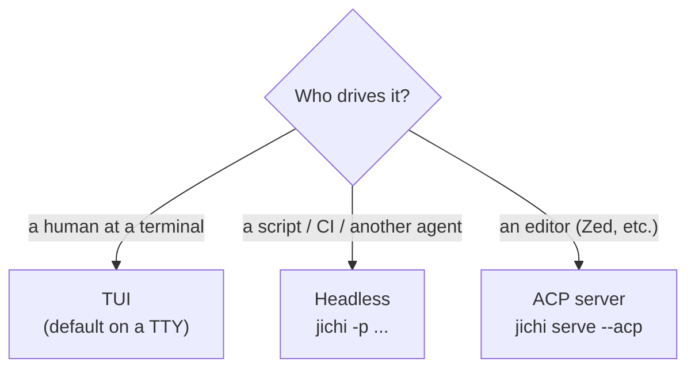
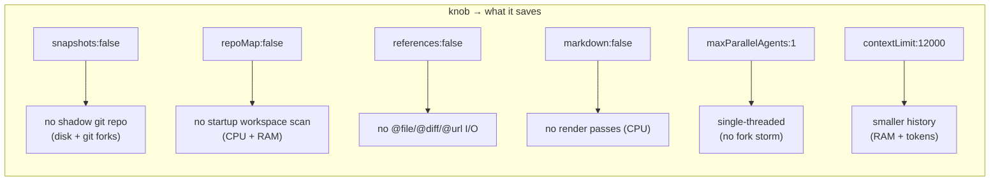
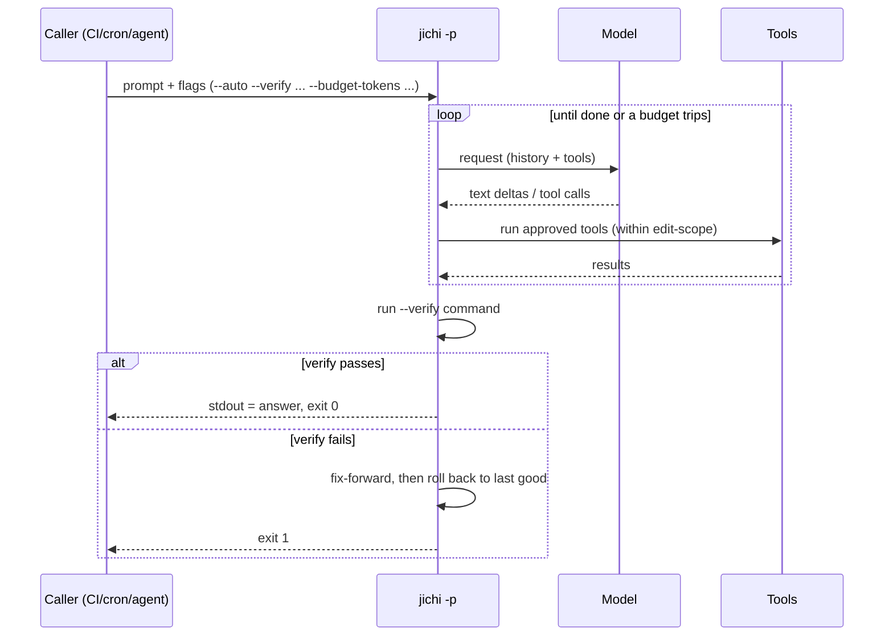

# Deployment: embedded devices, SSH, TUI & headless — for users and agents

This manual is about *running* `jichi` in the field: on a workstation, on a
small ARM box, across an SSH session, and as a component other programs (or other
agents) drive. For building and installing it, see [`INSTALL.md`](INSTALL.md).

It serves two audiences and says so throughout:

- **Users** — humans at a terminal, interactively or over SSH.
- **Agents** — scripts, CI jobs, cron, or another AI agent invoking jichi
  non-interactively and consuming its output.

---

## 1. Choosing a mode

jichi has three front-ends over the same engine. Pick by *who is driving*:



| Mode | Start it with | stdout is | Best for |
| --- | --- | --- | --- |
| **TUI** | `jichi` (on a TTY) | a rendered session | interactive humans |
| **Headless** | `jichi -p "..."` (or piped stdin) | **the assistant answer only** | automation, SSH, agents |
| **ACP** | `jichi serve --acp` | JSON-RPC frames | editor integration |

**The headless contract** (the property everything else relies on): in `-p` mode,
**stdout carries the assistant's answer and nothing else** — no ANSI color, no
tool chatter, no banners. Diagnostics go to **stderr**; the exit code reports
success. This is what makes jichi safe to pipe and to call from other programs.

---

## 2. Over SSH

> **Deep dives:** [REMOTE_SSH.md](REMOTE_SSH.md) covers driving jichi headless over
> SSH for both operators and automating agents (structured output, the daemon
> over a tunnel, security posture); [TMUX.md](TMUX.md) covers keeping long
> `--auto` runs alive across disconnects. This section is the overview.

### 2a. TUI over SSH (interactive)

The TUI works fine over SSH. It enters terminal raw mode only while you are
editing a line and returns to cooked mode during streamed output, and its redraw
is wrap-aware (it reads the width from `TIOCGWINSZ`, falling back to `$COLUMNS`,
then 80). On a slow or limited link, calm it down:

```sh
# Quietest, most compatible TUI over a poor link:
NO_COLOR=1 jichi --no-markdown
```

- **`NO_COLOR=1`** (or `--no-color`) drops all ANSI color. Markdown/syntax
  rendering is color-based, so it switches off too.
- **`--no-markdown`** keeps color but prints assistant text raw (no reflow/syntax
  passes) — cheaper to stream.
- **Locale:** with a UTF-8 locale jichi uses box/arrow glyphs (`▸`, `›`, `·`); under
  `LANG=C` / a non-UTF-8 locale it automatically falls back to ASCII (`>`, `:`,
  `ok`/`x`). Set `LANG`/`LC_ALL` to taste.
- **Width:** if `TIOCGWINSZ` is unavailable, `export COLUMNS=120` before launching.

### 2b. Headless over SSH (recommended for anything scripted)

Because stdout is just the answer, headless mode is the clean way to use jichi
remotely:

```sh
# One-shot remote query
ssh host 'jichi -p "summarize CHANGES since last release" -q'

# Pipe a local file as the prompt (stdin IS the prompt when you pass `-`)
cat patch.diff | ssh host 'jichi -p - -q'

# Machine-readable result, parsed locally
ssh host 'jichi -p "list TODOs in src/" --output json -q' | jq -r .text
```

- **`-q` / `--quiet` / `--silent`** suppresses stderr diagnostics (tool logs,
  token lines, resume notices, MCP/LSP chatter) — genuine errors still print. Use
  it for clean transcripts over SSH.
- **Exit codes**: `0` ok · `1` error · `2` usage · `130` interrupted. A closed
  downstream pipe (`... | head`) is handled gracefully and still exits `0`.
- **Stateless vs persistent**: pass `--no-session` for a one-off that leaves no
  trace; use `-c`/`--continue` (this directory's latest) or `--session <id>` to
  carry a conversation across reconnects (sessions persist in
  `~/.jichi.d/sessions`).

> Avoid pasting secrets on the command line over SSH — they land in shell history
> and the remote process list. Keep API keys in the remote environment
> (`apiKeyEnv`), not in `--config` strings.

---

## 3. Embedded / low-resource devices

jichi is a small C89 binary (~1.4 MB unoptimized, ~1.0 MB with `SIZE=1`)
with one heavy dependency (libcurl). Memory is
an 8 KB-block arena for the session (it grows as the conversation does and is freed
at exit), model responses are streamed rather than buffered whole, and history is
bounded by auto-compaction. The practical limits on a small device are **RAM**
(dominated by libcurl's TLS stack, not jichi itself), **disk** (caches), **CPU**
(startup scans + parallel forks), and the **context budget** (tokens), all of which
are tunable. For a full RAM breakdown, budget tiers, and build-time footprint
reduction, see [`LOW_MEMORY.md`](LOW_MEMORY.md).

### 3a. A lean configuration

The fastest way to get all of this is the **`--lite`** flag (alias
`--low-memory`), or `"lowResource": true` in config: it applies the lean bundle
below in one go (any key you set explicitly still overrides it). The full set of
knobs, for when you want finer control:

Every key below is a real config field. This profile minimizes disk, CPU, and
memory:

```json
{
  "model": {
    "provider": "openai",
    "model": "your-small-model",
    "apiBase": "http://127.0.0.1:8080/v1",
    "apiKeyEnv": "OPENAI_API_KEY",
    "roles": ["chat"]
  },
  "snapshots": false,
  "repoMap": false,
  "references": false,
  "markdown": false,
  "maxParallelAgents": 1,
  "maxSubagentDepth": 0,
  "maxToolIters": 6,
  "maxRetries": 1,
  "contextLimit": 12000
}
```



What each one buys:

| Knob | Default | Effect when lowered/off |
| --- | --- | --- |
| `snapshots` | on | Off ⇒ no shadow git repo under `~/.jichi.d/checkpoints` (saves disk and avoids `git` forks before edits). You lose `/undo`. |
| `snapshotLimit` | 100 | Bounds retained checkpoints; jichi prunes past 2× this. Lower it to cap disk. |
| `repoMap` / `repoMapLimit` | on / 12 KB | Off ⇒ skips the startup repository-map scan (CPU + memory). The map is injected into the prompt, so off also shrinks each request. |
| `references` | on | Off ⇒ no `@file`/`@diff`/`@url` expansion (avoids extra file/network reads). |
| `markdown` | on | Off ⇒ raw text, no syntax passes (TUI only; headless is always raw). |
| `maxParallelAgents` | `min(CPU, 8)` | The `spawn_parallel` fork pool size. Set `1` to stay single-threaded on a small core. |
| `maxSubagentDepth` | 1 | `0` forbids nested subagents. |
| `maxToolIters` | 25 | Lower ⇒ the agent gives up sooner (fewer model calls, faster failure on flaky links). |
| `maxRetries` | 4 | Lower ⇒ fewer retry/backoff cycles on transient network errors. |
| `contextLimit` (top-level) / model `contextLength` | unset ⇒ **32000** | The token budget before auto-compaction summarizes old history. Precedence: top-level `contextLimit`, else the active model's `contextLength`, else 32000. Lower ⇒ less RAM and smaller requests. |
| `readMaxBytes` / `runMaxBytes` / `fetchMaxBytes` / `searchMaxBytes` / `gitMaxBytes` | 0 ⇒ built-in (256K / 64K / 128K / 64K / 32K) | Per-tool output caps for `read_file` / `run_terminal_command`+`run_tests` / `fetch_url` / `search_code` / `git_*`. Lower ⇒ smaller tool results held in memory and fed to the model. `--lite` sets 64K / 16K / 32K / 16K / 8K. |

### 3b. Disk hygiene

Caches live under `~/.jichi.d/` and `~/.jichi.d/sessions/`. They are bounded
and safe to delete when jichi isn't running:

- **Index** (`~/.jichi.d/index/<key>/`): only created if you run `index` /
  use `codebase_search`. Files are chunked (~1500 chars) and skipped above 1 MB.
- **Checkpoints** (`~/.jichi.d/checkpoints/<key>/`): the shadow git repo;
  capped by `snapshotLimit`. jichi refuses to snapshot a workspace over **20000
  files** that isn't git-managed (the `JC_SNAPSHOT_MAX_FILES` guard), so a huge
  un-tracked tree won't blow up disk.
- **Sessions** (`~/.jichi.d/sessions/`): one JSON per conversation; use
  `--no-session` to avoid creating them.

### 3c. Running without git

If `git` isn't installed (or the workspace isn't a repo), snapshots/undo and the
`git_*` tools simply don't register — the agent runs normally; you just can't roll
back a turn. Set `snapshots:false` to make the intent explicit and skip the probe.

### 3d. Offline and air-gapped

libcurl is needed for **any model call**. But several subcommands are useful with
no network and no API key — handy for diagnostics on a disconnected device:

| Works offline | Needs a reachable model |
| --- | --- |
| `map`, `memory`, `skills`, `checkpoints`, `undo`, `ls`, `status`, `test` | `-p`/TUI turns, `embed`, `rerank`, `index`, `complete`, `fim` |

`doctor` runs offline but will report unreachable servers. You can also build
without libcurl entirely (see [`INSTALL.md`](INSTALL.md#build)) for an
offline-only binary; model calls then fail fast.

### 3e. Portability & cross-compiling

The code is strict C89 + POSIX.1-2001 with no glibc-only calls, so it is friendly
to **musl** and **uClibc**. The on-disk index is host-endian and is rebuilt
automatically if it doesn't match the running host, so moving a tree between
architectures is safe.

```sh
# Cross-compile for 32-bit ARM (provide a libcurl for the target, or build offline)
CC=arm-linux-gnueabihf-gcc make

# aarch64 static via zig (no target toolchain needed; core only -- no libcurl):
# an ~11 MB static ELF, zero warnings under WERROR=1 (re-verified at M220;
# execution on real arm64 hardware is the hardware plan's tier B first step)
make HAVE_CURL= CC="zig cc -target aarch64-linux-musl" jichi
```

For a fully self-contained binary, statically link a target-built libcurl
(`make LDLIBS="-lm -lcurl -static"`, with a static libcurl available), or build
offline and skip networking. Validate on the device with no network or key:

```sh
./jichi --version
./jichi map      # exercises the file walk + parser
./jichi doctor   # reports what's available
```

---

## 4. Driving jichi as an automated agent

When *another program* calls jichi, treat it as a CLI with a stable contract.

> For a **looped or scheduled** agent that works a *queue* of tasks unattended —
> with a supervisor, retries, and file/DB/HTTP reporting — see
> [AUTONOMOUS_LOOPS.md](AUTONOMOUS_LOOPS.md), which builds on this contract and §5.

### 4a. The output contract

```sh
jichi -p "refactor foo() in src/x.c" --output json -q --no-session
```

`--output json` prints exactly one object to stdout after the run:

```json
{
  "text": "…the assistant's final answer…",
  "model": "claude-opus-4-8",
  "tokens": { "input": 1234, "output": 567 },
  "tool_calls": 3,
  "aborted": false
}
```

Parse it with `jq` (`jq -r .text`). Useful flags for machine callers:

| Flag | Why a caller wants it |
| --- | --- |
| `--output json` | Structured result instead of a raw stream. |
| `-q` / `--silent` | Keep stderr free of diagnostics. |
| `--no-stdin` | Don't accidentally swallow inherited stdin as context. |
| `--no-session` | Stateless — don't write a session file. |
| `--config <path>` | Pin an explicit config (don't depend on `$HOME`). |
| `--model <sel>` | Choose the model deterministically. |

How stdin is interpreted (so a caller knows what it's sending):

| Invocation | Prompt is |
| --- | --- |
| `jichi -p "P"` | `P` (piped stdin appended as context, unless `--no-stdin`) |
| `jichi -p -` | all of stdin |
| `... \| jichi` (no prompt) | all of stdin |

### 4b. Permissions for unattended runs

By default a headless run is **conservative**: in chat mode, a tool that would
need a human "yes" (a mutating tool like `write_file`) is **refused** rather than
run silently. To let jichi act on its own, opt in with `--auto`, and bound it:



The **autonomy envelope** turns `-p --auto` into a bounded, auditable run:

| Flag | Bound |
| --- | --- |
| `--verify <cmd>` | Run `<cmd>` at the end; it must exit 0 (else fix-forward, then roll back unless `--no-rollback`). |
| `--budget-tokens <n>` | Token cap (e.g. `200k`, `1m`). |
| `--deadline <dur>` | Wall-clock cap (e.g. `30s`, `20m`, `2h`). |
| `--max-tool-calls <n>` | Cap on tool executions. |
| `--edit-scope <glob>` | Restrict edits to a path glob (repeatable); add `--strict-scope` to also forbid shell escape via `run_terminal_command`. |
| `--journal <path\|->` | JSONL audit log (default `~/.jichi.d/runs/<id>.jsonl`; `-` disables). |

You can also pre-authorize or forbid specific tools regardless of mode with the
config `permissions.allow` / `permissions.deny` lists (tool names; deny wins). See
[`AGENT_MODES.md`](AGENT_MODES.md) and [`AUTONOMY.md`](AUTONOMY.md).

### 4c. A worked example (CI / cron)

```sh
#!/bin/sh
# Bounded, verified, non-interactive task. Exit code drives the pipeline.
set -e
export OPENAI_API_KEY="$CI_LLM_KEY"

jichi -p "make the failing test in tests/ pass; change only src/" \
    --auto \
    --config ./local/config.json \
    --edit-scope 'src/**' --strict-scope \
    --verify 'make test' --verify-timeout 5m \
    --budget-tokens 300k --deadline 20m \
    --no-session --output json -q > result.json

# Non-zero exit => verify failed (and the tree was rolled back). Inspect result.json.
jq -r '.text' result.json
```

### 4d. Editor integration (ACP)

For editors, run jichi as an **Agent Client Protocol** server over stdin/stdout:

```sh
jichi serve --acp     # or: jichi --acp
```

The editor sends `initialize` / `session/new` / `session/prompt` and renders the
streamed reply, tool activity, and permission prompts. Sessions persist to the same
store as the CLI (so a conversation can move between the TUI and the editor), and
if the editor offers filesystem access jichi reads/writes through it to honor unsaved
buffers. Full protocol detail is in [`ACP.md`](ACP.md).

---

## 5. Hardening an unattended / autonomous host

An unsupervised jichi runs shell commands the model chooses. On a shared box, a
CI runner, or any host where the agent's user has real power, harden it — in
this order, strongest first.

### The one that matters most: don't give the agent's user privilege

**Run jichi as a dedicated, non-root user without passwordless `sudo`.** This is
the real boundary; everything below is defense in depth *behind* it. An agent
that cannot escalate at the OS level cannot escalate, full stop — no heuristic
in a userspace program is a substitute. For anything genuinely unattended,
put it in a container or VM whose blast radius you accept. `jichi
doctor` warns loudly if it finds itself running as root, because at that point
the privileged-command policy below is moot.

### Privileged commands (sudo / doas / pkexec / su)

jichi detects when a model-issued shell command is launched under a
privilege-escalation tool and gates it by the **`privilegedCommands`** policy —
*independently* of the normal approval, so a blanket `--auto` or a "always
allow the shell" grant can never cover it (that gap was a real incident):

```jsonc
{
  "privilegedCommands": "deny",        // "ask" (default) | "deny" | "allow"
  "privilegedCommandsAllow": [         // exact commands pre-approved under ask/deny
    "sudo systemctl restart myapp"     // prefix-matched, chain-safe
  ]
}
```

- **`ask` (default)** — an interactive TUI prompts afresh every time; an
  **unattended run refuses** with an actionable message. This is the right
  default for a workstation.
- **`deny`** — the recommended posture for a shared host or CI: privileged
  commands are refused outright. Use `privilegedCommandsAllow` to permit only
  the specific commands you trust (a `sudo systemctl restart myapp` entry will
  not admit `sudo systemctl restart myapp ; sudo rm -rf /` — any chaining
  disqualifies the match).
- **`allow`** — the model runs privileged commands unprompted. `doctor` warns
  about this; only choose it when the OS boundary above already contains the
  agent.

Every privileged attempt — allowed *and* refused — is appended to an
**always-on audit log** at `~/.jichi.d/audit/privileged.jsonl` (owner-only,
the full command recorded, secret-scrubbed), independent of the opt-in
telemetry so it never goes dark. It is a *self-audit convenience*: the
authoritative, tamper-evident record is the OS's — `sudo` already logs every
invocation to the system log; use `auditd`/`journald` for a trail the agent's
own user cannot alter. Turn the jichi log off only with `privilegedAudit: false`
(doctor warns). Summarize the log with **`jichi audit [--since 7d]`**
(per-decision/per-launcher counts + the most recent attempts, M158 — see
[OBSERVABILITY.md](OBSERVABILITY.md)). The full design and its honest limits are
in
[`proposals/2026-07-privileged-commands.md`](proposals/2026-07-privileged-commands.md).

### Bound what the run can touch and cost

Compose the autonomy envelope (§4) with the fences:

- **`--edit-scope <glob>`** confines the structured edit tools to matching
  paths; **`--strict-scope`** additionally refuses `run_terminal_command`
  entirely while a scope is active (no shell escape at all) — the categorical
  option when the agent shouldn't run arbitrary commands.
- **`--readonly`** / plan mode hide every mutating tool, the shell included.
- **`--budget-tokens` / `--deadline` / `--max-tool-calls`** cap the run; a
  verifier (`--verify`) plus snapshots give rollback-to-green on failure.
- **`deny-cmd`** constraints (e.g. `deny-cmd sudo`, `deny-cmd deploy`) are a
  mechanical, all-depth "never" for a specific run, enforced at the tool gate
  and surviving context compaction.
- Keep API keys as **`apiKeyEnv`** names, never literal `apiKey` in a config
  that could be read from the process table (doctor lints this); pass configs
  via `--config-stdin` for a run whose config shouldn't hit `ps`.

### A hardened unattended invocation, end to end

```sh
jichi -p "apply the migration in ./migrations and run the tests" \
  --auto --privileged-commands deny \
  --edit-scope 'src/**' --edit-scope 'migrations/**' \
  --verify 'make test' --budget-tokens 500k --deadline 30m \
  --journal ./run.jsonl --output json -q
```

Run it as a non-root user, in a container if the work is untrusted. Afterwards,
review `run.jsonl` (the envelope journal) and
`~/.jichi.d/audit/privileged.jsonl` (any privileged attempts). `doctor`
before the first run confirms the posture:

```sh
jichi --config <cfg> doctor    # flags root, allow-posture, audit-off, literal keys
```

---

## 6. Shared and multi-user hosts

**jichi's threat model is one operator, one machine, and a model that may
misbehave.** It is not "several people on one box". Everything below follows
from that, and none of it is a bug — it is a design assumption that stops
holding the moment two people share a tree. Before M478 this page did not
mention multi-user at all.

The worked case, with measurements, is [`JUPYTERHUB.md`](JUPYTERHUB.md) — a hub
is simply the most common way to end up here. The facts are the same on a shared
login server, a lab machine, or a build host two people ssh into.

### 6a. The workspace lease and the checkpoints are `$HOME`-keyed

Both are keyed by a hash of the **work tree** but stored under the **user's own
home**:

```
<home>/.jichi.d/leases/<hash-of-work-tree>.json     (jc_lease_path)
<home>/.jichi.d/checkpoints/<same-hash>             (jc_snapshot)
```

Two users in the **same** directory therefore compute the **same key** into
**different homes**. Each takes a lease, neither sees the other's, and both
proceed as if alone.

**Staged and confirmed** (M478, a two-user Debian 12 VM): with one user's run
holding its lease, a second user ran to completion on the same tree under
`--lease fail` — the strictest setting there is. Not warned, not delayed, not
refused. Both users' checkpoint directories carried the same key, one per home.

There is a second half worth knowing: **a lease is taken only when the autonomy
envelope is armed.** `--auto` on its own takes none; `--edit-scope`,
`--budget-tokens` or `--journal` arm it and it does.

### 6b. The rule

> **Do not point an `--auto` run with `revertOutOfScope` at a directory another
> person can write.** The end-of-turn sweep diffs the whole tree against a
> run-start baseline and cannot tell a colleague's edits from an out-of-scope
> write by the model it polices.

**Give each person their own workspace.** That removes the whole problem, costs
nothing, and is the only mitigation that does not require jichi to learn about
other users' identities and permissions — which would be a new threat model, not
a bug fix.

### 6c. Capacity: the fork pool sizes itself to the machine, not to your share

`maxParallelAgents` defaults to `0`, meaning auto = `min(cpu, 8)`. On a 32-core
shared host, ten people each running `spawn_parallel` can ask for eighty
concurrent agent forks. jichi is behaving as documented; it has no idea it is
sharing. Set `maxParallelAgents` and `memBudgetMb` in a host-wide config.

### 6d. Secrets and telemetry are per-user, and that part is already right

`apiKeyEnv` plus a per-user `~/.jichi.env` at mode 0600 is the documented
pattern, and separate home directories make it correct with no changes. Two
cautions for a **host-wide** config:

- never a literal `apiKey` — `doctor` warns, and the warning is right;
- never a fixed `logging.path`, which would merge every user's telemetry into
  one file.

### 6e. Where a multi-user host is *better*

jichi's oldest safety deferral is that `run_terminal_command` has no OS-level
sandbox, and the stated answer has always been *"run as a non-root user, in a
container or VM"*. A machine with real per-user accounts **already does that**.
Several people with separate accounts is a stronger posture than one shared
account, not a weaker one. The risk is the shared *directory*, not the shared
*machine*.

## 7. Troubleshooting

| Symptom | Likely cause / fix |
| --- | --- |
| Garbled glyphs or stray `[2m` codes over SSH | Non-UTF-8 locale and/or no color support. Use `NO_COLOR=1 --no-markdown`, set `LANG`. |
| "Could not connect" / model calls fail | Endpoint unreachable or key missing. Run `jichi doctor`; check `apiBase`, the `apiKeyEnv` variable, and network egress. |
| Tools never run in headless mode | Without `--auto`, mutating tools that need approval are refused. Add `--auto` (ideally with an envelope), or pre-allow them in `permissions.allow`. |
| "privileged command refused" in an `--auto` run | Expected under the default `privilegedCommands: ask`: an unattended agent won't run sudo/doas/pkexec/su. Approve it interactively, set `privilegedCommands: allow`, or pre-approve it in `privilegedCommandsAllow` (§5). |
| Snapshots/undo unavailable | git not installed, not a repo, or a huge un-tracked tree (>20000 files). Install git / init a repo, or accept it's off. |
| Broken pipe when piping to `head` | Expected and handled — jichi stops cleanly and exits `0`. |
| TUI redraw looks wrong on a narrow remote terminal | `export COLUMNS=<width>` before launching if `TIOCGWINSZ` isn't honored. |
| High memory / huge requests on a small device | Lower `contextLimit`, and turn off `repoMap`; see the lean config above. |

When in doubt, `jichi doctor` is the fastest way to see what the host
supports. See [`INSTALL.md`](INSTALL.md) for requirements and
[`DOCTOR.md`](DOCTOR.md) for what each check means.
