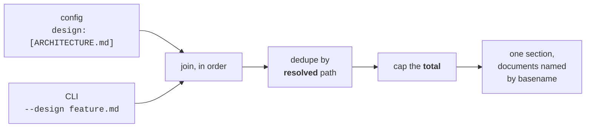
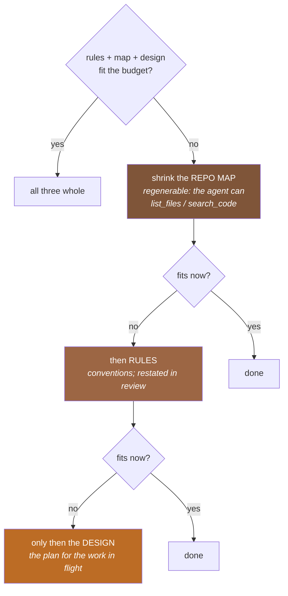

# Design input (`--design` / `--spec`)

`--design <file>` (alias `--spec <file>`) injects a design/spec document into the
system prompt as an **authoritative plan for the task** — a section distinct from
project rules, memory, and glossary.

```sh
jichi --auto --design docs/plans/2026-07-feature.md -p "implement the feature"
```

## Why

Dogfooding jichi on a from-scratch reimplementation showed the single strongest
positive lever: a grounded design doc (exact file:line seams, a reuse table, and
pitfalls) turns work that `--auto` otherwise thrashes on — deep, cross-layer
changes — into work it completes autonomously. Pasting that doc into the `-p`
brief works, but it competes with the task framing, isn't marked authoritative,
and isn't size-managed. `--design` makes it a first-class input.

## What it does

`jc_sysmsg_build` emits, after the project instruction files and before
memory/repo map:

```
# Design specification (authoritative for this task)

Treat the following as the authoritative plan for this task: follow its seam,
reuse the code paths it names, and honor its listed pitfalls. If it conflicts
with the actual code, SURFACE the conflict rather than silently diverging from
either.

<your design doc>
```

The preamble deliberately tells the agent to **surface conflicts** rather than
follow a stale design past the evidence — the design is authoritative for
*planning*, not a licence to ignore the code.

## Details

- **Placement:** after rules (which the design operates within), before
  memory/glossary/repo map, so it is prominent and survives compaction (the
  system prompt is never compacted, unlike a pasted brief that scrolls out of a
  long turn).
- **Size cap:** head-kept to `JC_DESIGN_MAX` (16 KB) with a
  `[design truncated to fit the context budget]` note, so a large spec can't blow
  the always-sent prefix (which re-bills every call on a cacheless backend). A
  design doc is typically 3–6 KB — small next to a ~12 KB repo map.
- **Path:** a user-specified CLI path, so it bypasses the workspace path fence
  (like `--config`); a missing file warns and is skipped (never fatal).
- **Inspect it:** `jichi --design <file> sysmsg` prints the full system
  prompt including the design section.
- **Front-ends:** built in `jc_sysmsg_build`, so TUI / headless / ACP all get it
  identically.

## Several documents (M462)

A project usually has **two** kinds of design text: a standing architecture
document that is true all year, and a spec for the task in front of you. v1
took one document from one place, so you had to choose. Now you don't.

```sh
# in the config -- the standing one, always loaded
{ "design": ["docs/ARCHITECTURE.md"] }

# on the command line -- this task, repeatable
jichi --auto --design docs/plans/2026-08-feature.md -p "implement it"
```



**The CLI adds to the config; it does not replace it.** That is deliberate and
it is the opposite of the usual precedence, so it is worth the sentence:
replacement fails *silently*. A project that pinned its architecture doc would
lose it the moment anyone passed a task spec, and the prompt would still carry
a section headed *authoritative for this task* — now describing half of what
the operator meant. Additive precedence cannot fail that way, and
`tests/smoke/design_multi.sh` check 5 is written to tell the two designs apart
(it requires **both** markers, because a check for only the CLI doc would pass
under either).

Order is config-then-CLI, matching how you would brief a person: standing
context first, the specific task last — and last is the position a model
weights most. Documents are deduped by **resolved** path, so naming one in both
places costs the always-sent prefix once. Each is headed `## <basename>`, but
only when there is more than one: with a single doc a heading is noise.

## Fitting: the design competes for the budget (M462)

Three sections of the system prompt can grow without bound — rules, the repo
map, and now the design. `jc_sysmsg_fit_caps` arbitrates. What matters is the
**order in which they give ground**, and that order is an argument about *what
the model can recover on its own*:



The design is sacrificed **last** because its failure is the quiet one. A
truncated repo map costs tool calls. A truncated design makes the agent follow
half a plan *while believing it has the whole one*, and the output looks just
as confident.

**The static `JC_DESIGN_MAX` ceiling still applies**, and the dynamic fit can
only tighten it further — never loosen it. If you read the original deferral as
"replace the static cap with the dynamic one", that is the one reading that
would have been a **regression**: `jc_sysmsg_fit_caps` returns *never shrink*
when the context limit is undeclared (no `contextLength`, no
`--context-limit`), which is exactly the configuration where an unbounded
document does the most damage. A cap that can only tighten is safe to land; one
that can loosen is not.

## `/design` in the TUI (M462)

| Command | Effect |
|---|---|
| `/design` | show whether a design is loaded, and how large |
| `/design <file>` | load it (replacing the current one; config docs still apply) |
| `/design off` | clear it |

You reach for a design document when the work turns out to be deeper than you
thought — which is *mid-session* by definition, so being able to set it only at
launch was the odd half of the feature.

It prints one warning: **the system prompt changed, so the next call re-bills
the cached prefix.** Not a defect — changing the prompt necessarily changes the
[cached prefix](PROMPT_CACHING.md) — but a cost you should see once rather than
discover on an invoice.

A mistyped path leaves the previous design in place rather than dropping it,
which is what you want when you fat-finger a filename mid-task.

## A note for the reader on memory (M199, applied here)

`app->design` is **malloc-owned, exactly one live copy**, and the documents are
read through a scratch arena that is freed before the loader returns. On the
session arena — which lives for the whole process — every `/design` reload would
abandon both the old document *and* the file bytes it was built from, until
exit. That is the bug class that cost M197/M198 (17.5 MB per keypress), in
miniature, and it only became reachable when reload became possible. The same
shape is used by `jc_memory_refresh`; `tests/smoke/arena_lint.sh` is what keeps
it honest.

## Still not done

- **Per-document caps.** The cap is on the total, deliberately: per-document
  caps multiply, and what is scarce is the always-sent prefix.
- **Globs** (`design: ["docs/plans/*.md"]`). Easy to add and easy to regret —
  a glob that quietly grows to nine documents is a bill nobody chose.
- **A `sysmsg`-style listing of which documents were merged.** Today
  `jichi --design <file> sysmsg` shows the resulting section; it does not name
  the sources when several were joined and one was skipped as unreadable
  (that warns on stderr).

See `docs/proposals/2026-07-C-design-doc-input.md` for the original proposal and
`docs/AGENTS_GUIDE.md` for how a design pairs with `--auto` + a verify gate.
