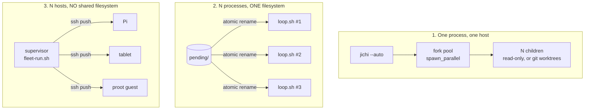
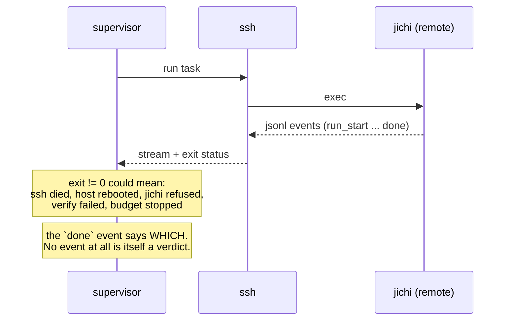
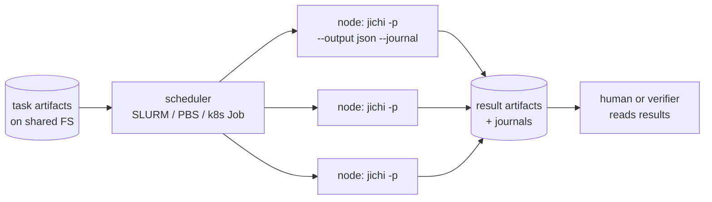

# jichi distributed: what works today, what does not, and what it would cost

*An analysis, not a feature announcement. Written 2026-08-21 (M526). Every
capability below is either in the tree today (and cited) or explicitly marked as
absent. If you are looking for a fleet feature and cannot find it here, it does
not exist.*

## The finding, up front

jichi already runs distributed work in **three topologies**, and the interesting
part is that none of them contains a coordination protocol. Two of them avoid
coordination by relying on a filesystem primitive; the third avoids it by pushing
work instead of letting workers pull. That is not a gap that was overlooked — it
is a repeated design choice, and it holds up better than the obvious alternative
would.

What is genuinely missing is smaller and sharper than "distributed support":
**there is no authentication anywhere**, no accounting that composes across hosts,
and no answer to a duplicate claim other than reporting it. Everything else on the
usual distributed-systems checklist is either present or deliberately refused.

## 1. The three topologies that exist

### 1a. Fork pool — one host, one process

`spawn_parallel` forks children that share the pre-warmed workspace index
([`PARALLEL.md`](PARALLEL.md)). Its limits are documented rather than discovered,
and they are the ones that matter for distribution thinking:

- **No automatic conflict resolution** — overlapping file edits keep the **first
  writer only**, and the conflict is *reported*.
- **Top-level only.** A child is never given `spawn_parallel`, so there are no
  nested pools.
- **Write children run in git worktrees**; without git, write tasks run read-only.
- `codebase_search` is cold in a write child (its worktree has no warm index), so
  a write child should prefer `read_file`/`search`.

### 1b. Queue plus atomic rename — N processes, one filesystem

[`AUTONOMOUS_LOOPS.md`](AUTONOMOUS_LOOPS.md)'s loop claims a task by
`rename(2)`-ing it from `pending/` into `running/`. **No lock file, no
coordinator** — the kernel's rename is the mutual exclusion, and it is atomic
within a filesystem.

That last clause is the whole assumption. It is correct, cheap, and it stops being
true the moment the queue lives on NFS.

### 1c. Push over ssh — N hosts, nothing shared

`scripts/fleet-run.sh` exists **because** a fleet spread over a Pi, a tablet and a
proot guest has no shared filesystem, and it refuses to manufacture one: reaching
for NFS or sshfs would put a network filesystem's rename semantics underneath the
only thing keeping two agents off one task.

Its answer, quoted from its own header, is the best sentence in this repository on
the subject:

> Push is what removes the coordination problem instead of solving it. The
> supervisor already holds an ssh connection per device — that is how every
> hardware row in this repo is driven — and an assignment carried over that
> connection is exactly-once by construction. No queue, no claim, no lock.

Four inheritable design decisions come with it:

1. **Devices are thin clients.** The model stays on the workstation; a device gets
   an `apiBase`. "A 4 GB device that is also hosting a model is measuring the
   model, not jichi."
2. **The deadline scales per device; the token budget does not.** A token is the
   same work everywhere, so scaling it would make devices incomparable. Wall clock
   is not — so each target carries the multiplier its own build-time row measured.
   *"A fleet whose deadline is uniform is a fleet that kills its slowest member and
   calls it a timeout."*
3. **Every agent is fenced to a scratch workspace it owns**, with `--strict-scope`
   so the shell is *closed* rather than audited — and the cost is named rather than
   hidden: a fleet task that genuinely needs to run a build cannot use the script
   as written, and must not silently get the weaker fence instead.
4. **Verdicts come from positive markers in the jsonl, never exit codes.** See §2 —
   this one deserves its own section.

## 2. The status channel degrades with distance, and the repo says so twice

Here are two rules from this repository, both correct, that disagree:

| Where | How a task's outcome is decided |
|---|---|
| `AUTONOMOUS_LOOPS.md`'s local queue | the **exit code**: 0 done, 1 verify/budget, 2 misconfig, 130/143 signal |
| `fleet-run.sh` over ssh | **positive markers in the jsonl stream**, *never* exit codes |

They disagree because the question changed. Locally, jichi is your child process
and its exit code is a fact you observed. Over ssh, *"an ssh that dies mid-run and
a jichi that refused the task both produce a non-zero status; only the stream says
which."*

**The general rule, worth carrying to any distributed design:** a status channel's
reliability is a function of how many layers it crossed, and the number of distinct
failures that collapse into one signal grows with every hop. The remedy is not a
better exit code — it is a channel that carries *positive* evidence of what
happened, which is exactly what a versioned event stream is for.

### And a positive marker is not enough — it must be the *right* one

The first real fleet run produced two findings ([`AUTONOMOUS_LOOPS.md`](AUTONOMOUS_LOOPS.md)),
and both are distributed-observability traps rather than fleet bugs:

**`done` is not a success verdict.** A run against a model that *describes* tool
calls instead of invoking them terminates perfectly cleanly: `stop_reason: done`,
no error, tokens spent, and an empty workspace. The supervisor reported *"1
completed, 0 did not"* for a run that created nothing. jichi already published what
was needed — `no_changes`, `tool_calls`, `tool_calls_executed` on the journal's
`end` — and the supervisor was not reading it. *"On a fleet this matters more than
anywhere else, because nobody is watching the device and the summary is the
result."*

That failure has a twin measured this month from the other direction: a local model
whose tool calls arrive as `<tools>{…}</tools>` text produces exactly this clean,
empty, successful-looking run
([`analysis/2026-08-21-local-model-tool-calling.md`](analysis/2026-08-21-local-model-tool-calling.md)).
**Verify the model can invoke a tool before you dispatch it to twelve devices** —
`doctor --live` is the check, and it takes seconds.

**Scope every journal read to the run that produced it.** jichi *appends* each run
to the journal path it is given, so a bare `grep` answers with whatever an earlier
run said. This cost an afternoon of accusing jichi of mis-reporting `no_changes`:
run 1, against a describe-only model, legitimately recorded `no_changes: true`, and
every later read inherited it — including two runs that had demonstrably written
their files. jichi was right all three times. An append-only log shared across runs
with no run-scoped read is a contamination channel, and it looks exactly like a bug
in the thing being observed.

## 3. What does not exist, as failure modes

Stated as "what goes wrong" rather than "what is missing", because a feature list
invites building and a failure mode invites deciding.

| Absent | The failure it produces |
|---|---|
| **Authentication, anywhere** | anything that can reach the daemon socket can run a turn. `DAEMON.md`: *"The socket's file mode is the entire access-control list."* This is why the daemon is a local-only feature, and why there is no network transport at all |
| **A distributed lease** | `--lease` (M431e) enforces one envelope per **working tree**, against another jichi — and cannot enforce against a person with an editor. jichi has *"no lock of any kind"*. Across hosts there is nothing to enforce with |
| **Cross-host claiming** | topology 1c avoids it by pushing. If a puller model is ever wanted, two workers can claim one task and the only honest answer today is to *report* the conflict, as `spawn_parallel` does for overlapping edits |
| **A result-merge protocol** | file-level, first-writer-wins, conflicts reported. Two hosts that edited the same file produce a human's problem, not a merged file |
| **Composable accounting** | budgets and the envelope are **per run**. Ten hosts with a 1M-token budget each is a 10M-token fleet nobody authorized, and no artifact anywhere says so |
| **Cross-host index sharing** | each host indexes its own workspace. A fleet of ten pays for ten indexes of the same tree |
| **Any clock or ordering assumption** | nothing orders events across hosts. Journals are per run, and comparing two hosts' timelines is a manual act |
| **Work stealing / rebalancing** | a slow device holds its assignment until the deadline its own multiplier gave it |

## 4. Grid and HPC: jichi is already a batch job

The good news is structural. A headless `jichi -p … --output json` run is
**artifact-in, artifact-out, no interactive session** — which is exactly the shape
a batch scheduler wants. Nothing needs inventing to submit jichi to SLURM, PBS or
a container-based grid; the questions are all about which topology's assumptions
survive.

Which topology maps where:

- **A shared parallel filesystem (Lustre, GPFS, NFS)** → topology 1b *if and only
  if* `rename(2)` is atomic on it. On a parallel FS this is worth verifying rather
  than assuming; the design's entire mutual exclusion rests on it. If in doubt,
  let the scheduler assign work and do not use the queue at all — a scheduler is a
  coordinator you already have.
- **Independent scheduled jobs** → topology 1c's logic without ssh: the scheduler
  is the pusher, and exactly-once comes from the scheduler's own dispatch.
- **One fat node** → topology 1a, bounded by `jc_cpu_count` and RAM.

Three cautions specific to grid environments, none of them jichi's fault and all
of them jichi's problem:

1. **Model access from compute nodes.** Nodes are often network-isolated. A jichi
   that cannot reach its provider is a jichi that fails at the first turn — so the
   thin-client decision (1c-1) becomes a hard requirement, and the gateway must be
   reachable from inside the job.
2. **State outside the workspace.** jichi writes to `~/.jichi.d/` (journals,
   telemetry, index caches). On a cluster where `$HOME` is shared and jobs are
   many, that is a write-contention point and a quota surprise. `docs/STATE.md`
   names the paths; a per-job `HOME` is the cheap answer, and it is what
   `fleet-run.sh` already does for a different reason.
3. **Wall-clock caps are the scheduler's, not jichi's.** A `--deadline` inside a
   job whose scheduler will kill it anyway produces two competing timeouts and a
   confusing verdict. Pick one, and prefer the scheduler's.

## 5. Recommendations, staged, each naming what it rejects

**Stage 0 — do nothing, and be able to say why.** For fewer than about ten hosts
doing independent tasks, `fleet-run.sh` plus a scheduler is genuinely sufficient,
and its exactly-once property is stronger than anything a claim protocol would
give. *Rejects:* building topology-4 because it sounds like the next step.
**The honest position until a real workload proves otherwise.**

**Stage 1 — authentication on the existing socket. PARTLY DONE (M528).** The one
item in §3 that is a missing *concept* rather than a missing verb. What shipped is
the portable half: the socket's mode is now **verified** after `bind()` rather than
merely requested, and the daemon refuses to serve if it is wrong; the request line
has a declared, enforced 1 MiB limit where it previously had none at all; and an
optional `hello` reports the protocol version, the limits, the resolved uid, and
the posture — including `peercred: false`. What did **not** ship is the peer
credential check: `SO_PEERCRED`/`struct ucred` and `getpeereid` are both hidden
under this project's build flags (measured, [`DAEMON.md`](DAEMON.md)), and the two
ways round are a `_GNU_SOURCE` this project forbids or an architecture-dependent
constant it refuses. *Rejects:* a bearer token invented here (on a unix socket the
kernel already decides who may connect); claiming the check anyway (a `peercred`
field that lied would be worse than none); and leaving the whole stage undone,
which is what confined a useful warm-process feature to one machine.

**Stage 2 — fleet-level accounting.** Make the per-run envelope composable enough
that a supervisor can state a fleet budget and see it honoured, or at least
observed. Needs the JCP `record` group to read peers' journals as data.
*Rejects:* a distributed budget *enforcer*, which would need consensus to
subtract from a shared counter — and P1 of the protocol proposal refuses consensus
for good reasons. Observation first; enforcement is a separate decision with a
separate cost.

**Stage 3 — a pull topology, only if measured.** The JCP `peer` group
(`offer`/`claim`/`result`/`decline`) exists in the specification precisely so this
can be built without redesigning anything. It should stay unbuilt until a workload
exists that push cannot serve — heterogeneous devices whose availability the
supervisor cannot predict is the plausible case. *Rejects:* distributed locking
(there is no `rename(2)` across a network; a duplicate claim is reported, not
prevented) and work stealing (which needs a shared view of who holds what).

**Explicitly not recommended, with reasons:** a shared mutable index (cache
invalidation across hosts, for a cost that is one local index per host); agent-to-
agent negotiation (`AGENT_COLLABORATION.md`'s standing decision, inherited by the
protocol proposal as P1); and NFS/sshfs beneath the rename-claiming queue, which
`fleet-run.sh` already rejected once for the best possible reason.

## 6. What would have to be measured first

Nothing in §5 beyond Stage 1 should be built on the strength of this document.
What would make the case:

- **A real multi-host workload run to completion on topology 1c**, with the
  wall-clock, token and failure numbers written down. The existing record is one
  fleet run whose two findings are in `AUTONOMOUS_LOOPS.md`; one run is an
  anecdote.
- **Whether `rename(2)` is atomic on the target parallel filesystem**, tested
  rather than assumed, before topology 1b is used on a cluster.
- **What a fleet actually spends.** The claim in §3 that ten hosts with a 1M budget
  each is an unauthorized 10M fleet is arithmetic, not a measurement; whether it
  matters depends on numbers nobody has.
- **Whether a slow device's held assignment costs anything real.** Work stealing
  solves a problem that has not been shown to occur.

## 7. Honest limits of this analysis

- **No distributed run was performed for this document.** It is a reading of the
  code, the scripts and the existing measurements — the fork pool, the queue, the
  fleet script and the daemon — not a new experiment. Sections 1–3 cite what is in
  the tree; §4–6 are argument.
- **The grid section has never been executed.** No jichi run has been submitted to
  SLURM, PBS or a Kubernetes Job by this project. The mapping in §4 is derived
  from what a headless run is, and per `docs/PLATFORMS.md`'s verdict rules it must
  be read as **never compiled**: a plan, not a result.
- **One fleet run is the entire multi-host record.** Its two findings are worth
  inheriting and are not a basis for a design.
- **Failure modes in §3 are reasoned from absence**, which is sound for "there is
  no authentication" and weaker for "a slow device holds its assignment" — the
  first is a fact about the code, the second a prediction about behaviour.
