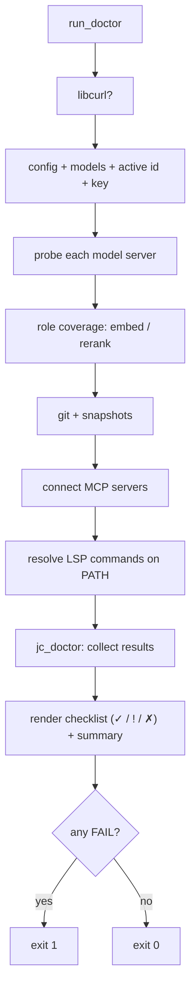

# `doctor` — setup health check

`jichi doctor` runs a one-shot series of checks on your setup and prints a
pass/warn/fail checklist with fix hints, so you can tell at a glance whether the
environment is ready — instead of discovering a missing key or an unreachable
server mid-conversation.

```sh
jichi doctor
```

```
✓ libcurl available (networking enabled)
✓ configuration loaded
    7 model(s); active: jlu/gemma-4-31b-it (hosted_vllm/gemma-4-31b-it)
✓ API key present for the active model
✓ model server reachable
    jlu/gemma-4-31b-it: https://api.example.edu/v1
! no embed-role model
    semantic codebase_search / index disabled; add a model with role "embed"
✗ active model's server is unreachable
    x: http://127.0.0.1:59999/v1

5 ok, 1 warning, 1 problem
```

**Exit code:** `0` if there are no failures (warnings are fine), `1` if any check
failed — so `doctor` works in CI or a pre-flight script.

## A check failed — now what

`doctor` prints three kinds of line: `✓` fine, `!` a warning (the run will work;
something is unmeasured or unbounded), `✗` a failure (fix this first). Here are the
ones people actually hit, with the fix rather than the restatement.

| You see | What it means | Do this |
| --- | --- | --- |
| `✗ no models configured` | jichi found a config but no `models` array it could use. | Add one entry — see [MODELS.md](MODELS.md) §"the smallest config that works" — or run `jichi setup`. |
| `✗ config source` / a parse complaint | The JSON did not parse, so **none** of your settings are in effect. | `jichi config validate` reports it. Note what it does **not** catch: jichi's config reader is JSONC-tolerant, so a trailing comma parses fine — and a model entry with no `model` key validates as `OK` while an id is substituted for it (see the row below). |
| `! active model id was DEFAULTED, not configured` | Your config named no `model` for the active entry, so one came from the built-in default — `gpt-4o` for provider `openai`, an Anthropic id otherwise. **That can be a priced model you did not choose.** | Name the model id you intend. Fatal under `--unattended` on purpose: a loop should not start against a model nobody picked. |
| `✗ active model's server is unreachable` | The endpoint did not answer. Everything else is untested. | Check `apiBase` (a missing `/v1` is the classic), then whether the server is up: `curl -sS <apiBase>/models`. A *local* server that is simply not running gives this too. |
| `! no API key for the active model` | No `apiKey`/`apiKeyEnv`, or the named variable is empty **in this shell**. | Fine for a keyless local server. Otherwise export the variable — and remember `~/.jichi.env` is only loaded if something sources it ([STATE.md](STATE.md)). |
| `! could not read the server's model limits` … `HTTP 401` | Your key did not reach the server, so the context window was **not** checked. | Same fix as above. A 401 here and a working chat call cannot both be true — the key is missing in the environment doctor ran in. |
| `! no pricing for the active model: every cost reads $0.00` | Cost accounting is inert: `/cost`, the exit total, the telemetry column and any cost budget will all read zero. | Set `inputCostPer1M` / `outputCostPer1M`. If the server really is free, this warning is the expected state — but do not read `$0.00` as a measurement until you have decided which. |
| `! model(s) with no API key` (not the active one) | A fallback or specialist entry is keyless; orchestration will fail when it reaches for one. | Set the key, or delete the entry you are not using. |
| `! session store is large` | Every session listing parses the whole store, so this gets slower as it grows. | `jichi prune --keep 20 --older-than 90d --dry-run`, read the list, then run it without `--dry-run`. |
| `! the stall timeout is Ns, but MODEL has answered as slowly as Ms here` | jichi aborts a model stream that sends nothing for `timeouts.stall` seconds (30 by default) — and **this machine has already recorded a call slower than that**, so a request in the latency tail is killed mid-run. Local models are where this bites: one measured 14.3 s mean and **228 s max** while its project set no `timeouts` block at all. Both numbers were on disk the whole time; nothing compared them (M589). Silent below 5 recorded calls — one slow request is not a tail. | `--timeout-stall <s>`, or a `"timeouts": {"stall": N}` block (a per-model block overrides the global one). |
| `! shell-command timeout: none` | A build or test the model runs can hang forever and take the run with it. | Set `runTimeout` (or `--run-timeout`) — especially before any `--auto` run. |
| `! no embed-role model` | `codebase_search` and `index` are unavailable; the agent falls back to `search_code`. | Add a second entry with `"roles": ["embed"]`, or accept it — literal search works without one. |
| `! path fence auto` … "active only in autonomous postures" | Not a problem: interactively you approve each call, so the fence engages when nobody is watching. | Nothing. `--path-fence` forces it on if you want it in chat mode too. |

**Two rules for reading this output.** First, a `!` is not a `✗` — jichi
distinguishes *"this will not work"* from *"this is unmeasured"* on purpose, and
the second kind is often the correct state for a local model. Second, when
something is genuinely unverifiable, doctor says **that**, rather than skipping the
line — *"the window was NOT checked"* is a different fact from *"the window is
fine"*, and conflating them is how a configuration problem becomes a mid-run
surprise.

If tool calling itself is what you are unsure about, this checklist cannot tell
you — it makes no model call. `jichi doctor --live` does, and that is the next
section.

## What it checks

| Check | OK | Warn | Fail |
| --- | --- | --- | --- |
| **libcurl** | built with it | — | built without it (no networking) |
| **Config / models** | ≥1 model; shows the active one | — | no models configured |
| **Active model id** | `model` set | — | `model` missing |
| **API key** | present | absent (fine for keyless local servers); **literal `apiKey` in config** (prefer `apiKeyEnv`, M55) | — |
| **Server reachability** | answers | a *non-active* model's server is down | the *active* model's server is down |
| **Roles** | an `embed` model exists | no `embed` (semantic search off); no `rerank` | — |
| **git** | inside a repo | not a repo (git tools off) | — |
| **Snapshots** | enabled + git found | disabled | enabled but git not on PATH |
| **MCP servers** | all connect (or none configured) | some fail to connect | — |
| **LSP servers** | commands on PATH (or none) | a command isn't on PATH | — |
| **Project assets** | counts agents/commands/skills under `.jichi/` | — | — |
| **Asset frontmatter** | all valid — agents, commands, skills **and output styles** (M389) | unterminated `---`, unknown/misspelled keys, missing `description`, or a command shadowed by a built-in | — |
| **Model selectors** (M284) | every asset/routing `model:` resolves to exactly one model | a selector substring-matches several models (first wins by position), or names a role no model declares | a selector matches no configured model or role |
| **Asset tool fences** (M285) | every `tools:` entry on a profile/skill can match a call and is advertised | an entry names no matchable tool (an alias or foreign name — a fence is exact-match, unlike a call, which resolves aliases), or names a real tool the resolved `toolProfile` never advertises | — |
| **Path fence** | on / auto | off (warns; names `editScope`/`referenceRoots` when no edit scope is set, M55c) | — |
| **Reference roots** (M54) | configured roots exist | a `referenceRoots` entry isn't a directory | — |
| **Verify gate** (M55a) | — | `routing.escalateOnVerify` on but no `verify`/`testCommand` configured | — |
| **Tool calling** (`--live`, M167) | observed `native` | observed `text`, or a mismatch that is not fatal | configured `native` but observed `none` |
| **Tool use** (M316) | every advertised tool was called at least once; *or* the check is quiet — no telemetry, or below the evidence threshold (it prints how far short) | tools you advertise were never called across ≥3 sessions, with their combined per-call cost and `toolProfile: core` named as the lever | — (never; nothing is broken) |

## `--live`: does tool calling actually work?

Everything above is offline or a bare reachability probe: it tells you a server
answers, not that an *agentic turn* can happen. `doctor --live` closes that gap
with one real request — a single trivial tool advertised, and an instruction to
call it — then classifies the answer as `native`, `text` (described but not
invoked), or `none`.

It replaces a hand-set per-model `toolCalling` flag with an observation. But its
more useful job is as a **self-test of jichi's own request construction**. The probe
deliberately builds its history the way `run_agent_loop` does, placeholder
included, so it exercises the real prefix shape rather than a hand-made
approximation. Run against the pre-M166 build, it says:

```
✗ --live: tool calling observed "none" (configured "native")
    the model answered a one-tool request with NOTHING. Suspect jichi's request
    before the model: capture and replay it (see docs/LOCAL_MODELS.md, "When the
    model calls no tool at all"). This is what a malformed request looks like --
    setting `toolCalling: "none"` here would hide a bug, not fix one
    -- probe prefix was 99 real prompt tokens
```

**Design decision — blame the request before the model.** For
configured-`native`/observed-`none` the advice names request construction first
and the model second, and says outright that setting `toolCalling: "none"` would
hide a bug. That ordering is not cosmetic: the pre-existing M147 warning said only
"the model may lack native tool-call support", and following it would have
degraded a fully capable model to work around a defect in jichi (ANECDOTES #19). The
advice strings are pure and unit-tested (`tests/test_toolprobe.c`) because their
wording *is* the feature.

The reported **real `prompt_tokens`** is a free by-product worth reading: it is the
server's own tokenizer count, and it is what the byte/4 estimate is calibrated
against (docs/COMPACTION.md — the ratio is model-specific, not a constant).

Opt-in, because it costs one real request: `jichi doctor --live`. It is the
only check here that spends tokens.

Reachability uses the same probe as model fallback (`jc_net_reachable`: a
short-timeout `GET {apiBase}/models`). MCP servers are actually connected (and
shut down) so "configured" vs "working" is distinguished; LSP servers are checked
by resolving their `command` on `$PATH`.



## Tools you pay for and never call (M316)

A tool definition is billed **per request**: it sits in the cached prefix and is paid on
every model call, whether the model uses it or not. So a project that advertises tools its
sessions never choose is spending on nothing —
[`context tools`](COMPACTION.md#paid-for-vs-called-m314) reports that, and this check is the
part that *advises*, which is doctor's job and deliberately not the report's.

Advice needs a bar the report does not try to clear:

- **The evidence axis is distinct sessions, not turns.** One long session is still one task.
  "Never called in any of your last three sessions" is a plural claim about *different*
  tasks; "never called in this turn" is not. Thresholds are `JC_TOOLUSE_MIN_SESSIONS` (3)
  and `JC_TOOLUSE_MIN_CALLS` (20) — defensible round numbers, not derived ones, chosen
  conservatively: a check that stays quiet too long is a nuisance, one that advises too
  early is a liar.
- **Below the bar it says so, with the numbers** (`1 session(s), 3 tool call(s) — needs at
  least 3 and 20`). Silence would be indistinguishable from a pass.
- **The advice is the lever, never the surgery.** It points at `toolProfile: core` — a fixed,
  considered set whose cost doctor already warns about separately — and not at individual
  tools. Naming them would invite removing one that is rare and right, and the report
  already names them for anyone who wants to look.
- **WARN at most, never FAIL**, and **not escalated by `--unattended`**: that flag exists so
  a loop supervisor can gate on *posture* problems, and token efficiency is not one.

Inherited caveat from the report: a never-called tool may be one the model was never *able*
to call — denied by permissions, or carrying a schema it could not use (cf. the M285 fence
lint) — and this check cannot tell that apart from an unwanted one. The counted set is the
**built-in** registry, so configured MCP/user/LSP tools are not included.

## Design

- **Two layers.** The probing (network, fork/exec, PATH lookups) lives in
  `main.c`'s `run_doctor`; the *reporting* — collecting `{status, label, detail}`
  results, rendering the checklist, and computing the exit code — is a pure,
  unit-tested module, `src/util/jc_doctor.c` (`include/jc_doctor.h`,
  `tests/test_doctor.c`). This keeps the orchestration honest (the exit-code and
  rendering rules are tested without touching the network).
- **Warnings don't fail.** Only a genuinely broken setup (no models, unreachable
  *active* server, snapshots-on-but-no-git, no libcurl) returns a non-zero exit.
  Missing optional pieces (a local keyless server, no embed model, an
  uninstalled LSP) are warnings with a hint — informative, not blocking.
- **Probe, don't guess.** Reachability and MCP connectivity are actually
  exercised, because "configured" and "working" are different questions and
  `doctor` exists to answer the second.
- **Never prints secrets.** API keys are reported as present/absent only.

## Internals

- **Pure core** — `src/util/jc_doctor.c`: `jc_doctor_add` / `jc_doctor_count` /
  `jc_doctor_exit_code` / `jc_doctor_render` (glyphs `✓`/`!`/`✗`, ASCII
  `ok`/`!`/`x` fallback, optional ANSI color).
- **Orchestration** — `run_doctor` in `src/main.c`, dispatched in the early-exit
  block (config + network, no tool loop), plus the `cmd_on_path` PATH resolver.

## `--unattended` — the loop-posture profile (M158b)

`doctor --unattended` re-judges the same facts as an **unattended-loop
posture** and makes the exit code enforceable: running as root,
`privilegedCommands: allow`, `privilegedAudit: false`, and an explicitly
disabled path fence escalate from WARN to **FAIL** (exit 1), while a missing
`verify`/`testCommand`, missing `editScope`, or disabled snapshots stay
advisory WARNs (legitimate for report-only loops — per-run bounds belong on
the loop's command line). A supervisor gates its startup on it:

```sh
jichi --config "$JICHI_CONFIG" doctor --unattended || exit 2
```

Design decision: a profile flag rather than a new subcommand — one
health-check surface, one renderer, one exit-code contract. See
[OBSERVABILITY.md](OBSERVABILITY.md) and
[AUTONOMOUS_LOOPS.md](AUTONOMOUS_LOOPS.md) §8.

## Is the backend caching your prompt? (M326w)

When telemetry exists for this workspace, `doctor` reports the prompt-cache
hit-rate alongside the tool-use check, from the same summary:

- **`backend is not caching the prompt`** (WARN) — 0% of a real volume was served
  from cache, so the whole prompt is re-read on every call. The line states your
  **fixed prefix** (system prompt + tool definitions) in tokens, because that is
  what is re-sent every time and a fact without a size cannot be acted on. The
  levers are `toolProfile: core` and a smaller repoMap/instruction set;
  `telemetry --cache-audit` has the per-model and per-session breakdown.
- **`prompt cache`** (OK) — some or most of the prefix is being served from cache.
- **`prompt cache: not enough traffic to judge`** (OK) — stated rather than silent,
  so a quiet check is never mistaken for a pass.

**Not escalated by `--unattended`.** A cacheless backend is a *cost*, not a broken
posture, and a loop supervisor gating on the exit code must not refuse to run
against an endpoint that works perfectly well.

A 0% hit-rate is a fact about the **server**, not a misconfiguration: jichi's
request prefix is byte-stable by construction (guarded since M31d, and confirmed in
27 of 29 sessions of a real workload), so there is nothing to fix on this side
beyond sending less.

## The cacheable prefix (M340)

When a model uses `provider: "anthropic"` and has `promptCache` on, `doctor` estimates the
**cacheable prefix** — the tool array plus the system prompt, which is the one block jichi's
breakpoint covers — and warns when it is below what the model will cache:

```
! promptCache on but the prefix is too small to cache
    the cacheable prefix (tools + system) is ~1754 tokens and this model will not
    cache a block under 2048, so every call is billed in full and NOTHING reports it.
```

**Why this check exists.** A block under the minimum caches nothing *and reports nothing*: the
`cache_control` marker is silently ignored, `cache_creation_input_tokens` stays 0, and no error
is raised anywhere. A measurement round was spent on a config with caching on, a
caching-capable model, and a 397-token prefix
([analysis/2026-08-09-hrz-prompt-caching.md](analysis/2026-08-09-hrz-prompt-caching.md)).

The minimums are **measured against the wire, not read off a documentation page** — 4096 for
Haiku 4.5 and Opus 4.5, 1024 for Sonnet 4.5 — matched on the model id, which is all jichi has.
The published figures (2048 / 1024) describe an older generation and are wrong for the 4.5
models; M340 took them on authority and consequently reported a confident `OK` through the exact
failure the check exists to catch. Where a family's minimum is uncertain the **higher** figure is
reported: a warning you can dismiss costs less than a reassurance that is wrong. **An unrecognised id warns about nothing**: a false
"this will not cache" would have an operator delete a prefix that was working, which is worse
than the silence it replaces. The check is also silent for OpenAI-compatible providers, where
caching is automatic and server-side and jichi does not know that server's rules — a local
llama.cpp has no minimum at all.

**It says the opposite of the usual advice, deliberately.** `docs/TOOL_OUTPUT_COST.md` argues for
trimming the prefix, and that is right on an uncached backend where every call pays for it. On a
caching backend the same trim can push you under the minimum and cost you everything. The two
regimes invert.

Validated against the wire in both directions, with the thresholds bracketed
(`block 3900 → no cache, 4101 → cached`). The anomaly M340 could not explain **was** this: a
wrong constant. See [analysis §7](analysis/2026-08-09-hrz-prompt-caching.md).

## Dumping what went on the wire (M341)

`--dump-requests <dir>` (or `$JICHI_DUMP_REQUESTS`, for surfaces that never parse argv) writes
every model request body as `req-NNNN.json` with its endpoint and byte count — **the exact string
handed to libcurl**, which is what `--log-level full` is not: that records prompt *content*, and
mistaking one for the other produced a wrong conclusion about whether jichi emitted cache
breakpoints at all.

Its value is that a captured body can be **replayed and bisected**. That is what closed the
caching anomaly: replay ruled out streaming, and bisecting the tool array showed identical
structure at twice the size *did* cache — which identified the threshold as the variable and not
the request.

Secrets are redacted and files are 0600, but a dump still contains your prompts and file
contents, so jichi says so on stderr whenever it is on.

## For gateway administrators

`doctor` is a useful second opinion for whoever runs the model gateway, because it reports what
a *client* infers rather than what the server believes: reachability, key presence, whether the
model declares a context length, missing embed/rerank roles, prompt-cache pricing, the resolved
tool profile, and with `--live` whether a real request produced a native tool call.

[GATEWAY_ADMIN.md](GATEWAY_ADMIN.md) is the companion page written for that audience — the
eight things an agentic tool needs from a gateway that a chat UI does not, each with a `curl`
check.