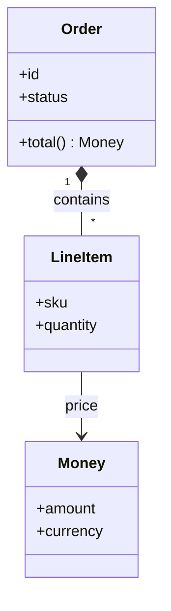

# Domain modelling — a tutorial

A learner's guide to building a model of the problem: the things the software is
*about*, their rules, and the language everyone uses to talk about them — before
and beneath any decision about databases, frameworks, or code. The thesis: **the
domain model is the set of nouns your system is responsible for, plus the rules
that must always hold about them; get the nouns and the rules right and the code
follows, get them wrong and no amount of clean code saves you.**

## 1. What a domain model is, and why it comes first

A domain is the slice of the real world your software serves — ordering, payroll,
scheduling, robotics. The **model** is your deliberate, simplified picture of it:
the entities that matter, how they relate, and the invariants that are always
true. It is *not* the database schema (that is one implementation of the model)
and *not* the class diagram (that is one way to draw it); it is the shared
understanding those artifacts serve.

It comes first because it is the vocabulary everything else is written in. Your
[use cases](USE_CASE_TUTORIAL.md) name these nouns; your [architecture](ARCHITECTURE_TUTORIAL.md)
puts boundaries around clusters of them; your tests assert their invariants. Get
the model muddled and every later phase inherits the muddle.

## 2. Finding the model: nouns, then rules

A practical start: **the nouns in the use cases are the candidate entities.** "A
Customer places an Order of LineItems and pays with a PaymentMethod" hands you
four. Then ask, of each:

- **What identifies it?** An Order has an identity that persists as its contents
  change — that makes it an *entity*. A Money amount of €5 is interchangeable with
  any other €5 — no identity — that makes it a *value*. The distinction is the
  first real modelling decision (§3).
- **What must always be true about it?** An Order's total equals the sum of its
  LineItems. An Account balance never goes below its overdraft limit. These
  **invariants** are the heart of the model — they are what the software exists to
  protect, and what your tests will check.
- **What is it made of, and what owns it?** A LineItem has no life outside its
  Order; delete the Order and the LineItems go too. That ownership is a relation
  worth drawing.

## 3. Entities, values, and aggregates — the three distinctions that pay

- **Entity** — has identity and a lifecycle; two entities with identical fields
  are still different things (two Customers both named "Kim" are two customers).
- **Value** — defined entirely by its attributes, interchangeable, ideally
  immutable (Money, a Date, an Address). Modelling something as a value when it
  has no meaningful identity removes a whole class of bugs.
- **Aggregate** — a cluster of entities and values treated as one unit for the
  purpose of invariants, with one entity as the **root** through which all changes
  go. Order-with-its-LineItems is an aggregate: you never edit a LineItem's
  quantity behind the Order's back, because the Order is what guarantees
  "total = sum of items". The aggregate boundary is where an invariant is
  enforced — which makes it, in miniature, an [architectural boundary](ARCHITECTURE_TUTORIAL.md).

Getting these three right is most of domain modelling. The commonest beginner
error is making everything an entity (identity you never needed, mutation you must
now guard); the second is letting anything mutate any part of an aggregate
(invariants nothing enforces).

## 4. Drawing it — the classDiagram

A domain model draws naturally as a [`classDiagram`](UML_TUTORIAL.md) §2 —
entities and values as classes, relations with multiplicities, the aggregate root
marked in the prose:



The `*--` (composition) says the LineItems *are part of* the Order — the
aggregate. `-->` to Money says a LineItem *references* a value. Those two arrow
kinds encode the §3 distinction visually. State the invariant in prose beneath the
diagram ("Order.total() = sum of LineItem price × quantity; enforced only through
the Order root") — the diagram shows structure, the prose carries the rule the
structure exists to protect.

## 5. The ubiquitous language

The single most practical idea in domain modelling: **one word per concept, used
everywhere — in conversation, in the model, in the code, in the tests.** If the
business says "reservation" and the code says "booking" and the tests say
"hold", every translation is a place a bug hides and a place a newcomer stumbles.
Name the entity once, and make the codebase, the [glossary](GLOSSARY.md), and the
diagrams all use that name. jichi supports this directly: its glossary
(`.jichi/glossary.md`) injects your domain terms into the agent's context so the
model speaks your language, not a generic one.

When the model's language and the code's language have drifted, that is not a
naming nitpick — it is a sign the model and the code have drifted, and the names
are just where you can see it.

## 6. Doing it with jichi

Reading-first, like [architecture](ARCHITECTURE_TUTORIAL.md): a fixture check can
grade whether a model doc has entities and relations, but not whether the model is
*right* — that is judgment against the real domain. To practice with the agent:

```sh
jichi -p "@docs/USE_CASES.md From these use cases, list the candidate entities. For
each, say whether it is an entity or a value and why, and name one invariant it
must preserve."
jichi -c -p "Draw the domain model as a classDiagram: composition for aggregates,
plain references for values. State each invariant in prose and which root enforces it."
```

Two mechanics there: `@docs/USE_CASES.md` inlines that file into the message
([REFERENCES.md](REFERENCES.md)) — without a reference the agent has no use cases
to read — and `-c` resumes the same session, so the second turn can see the list
the first produced.

Keep the agreed terms in `.jichi/glossary.md` so every later turn speaks the
ubiquitous language ([GLOSSARY.md](GLOSSARY.md)). You create that file yourself —
there is no `jichi glossary add`:

```sh
mkdir -p .jichi && $EDITOR .jichi/glossary.md   # one term per line
jichi glossary                                  # print what is in effect
jichi sysmsg                                    # see it inside the prompt
```

## 7. Extra curriculum — the reading track

In reading order:

1. [USE_CASE_TUTORIAL.md](USE_CASE_TUTORIAL.md) — where the candidate entities
   come from (the nouns in the flows).
2. [UML_TUTORIAL.md](UML_TUTORIAL.md) §2 — the `classDiagram` that draws the
   model, and the composition-vs-reference arrows that encode aggregates.
3. [GLOSSARY.md](GLOSSARY.md) — how jichi carries the ubiquitous language into the
   agent's context.
4. [ARCHITECTURE_TUTORIAL.md](ARCHITECTURE_TUTORIAL.md) §5 — the aggregate
   boundary as an architectural boundary; where invariants get enforced.
5. [SDLC.md](SDLC.md) and the `design-doc` skill — its "Data structures (per
   structure: fields, invariants, lifetime/ownership)" section is a domain model
   in a design document's clothing.

External concepts worth reading up on (search these; prefer primary sources):
*Domain-Driven Design* (Eric Evans — the source of entity/value/aggregate and
ubiquitous language; the "blue book"); *"Implementing Domain-Driven Design"* (Vernon,
the more practical companion); *bounded context* (when one word legitimately means
different things in different parts of a large system, and how to keep them from
colliding); *anemic vs. rich domain model* (whether the rules live with the data
or in a separate service layer — a decision worth making on purpose); *event
storming* (a workshop technique for discovering the model with domain experts).
