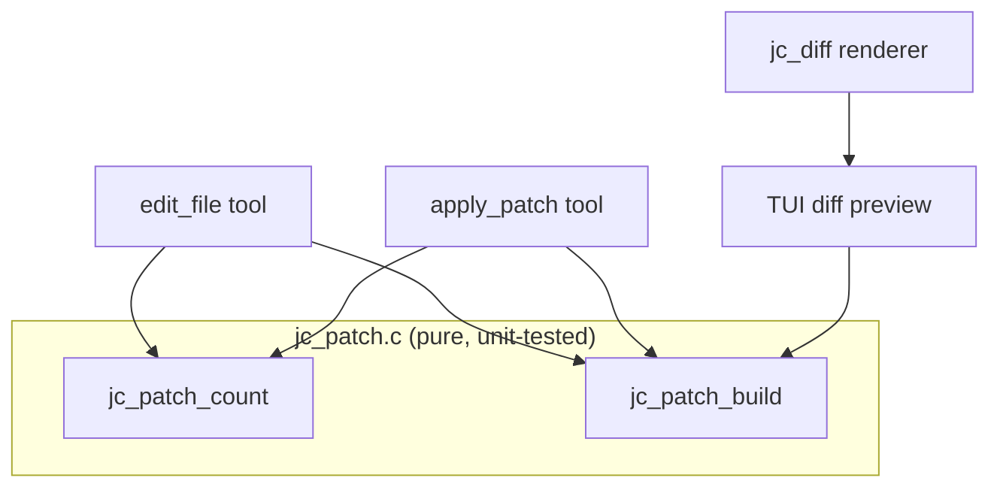
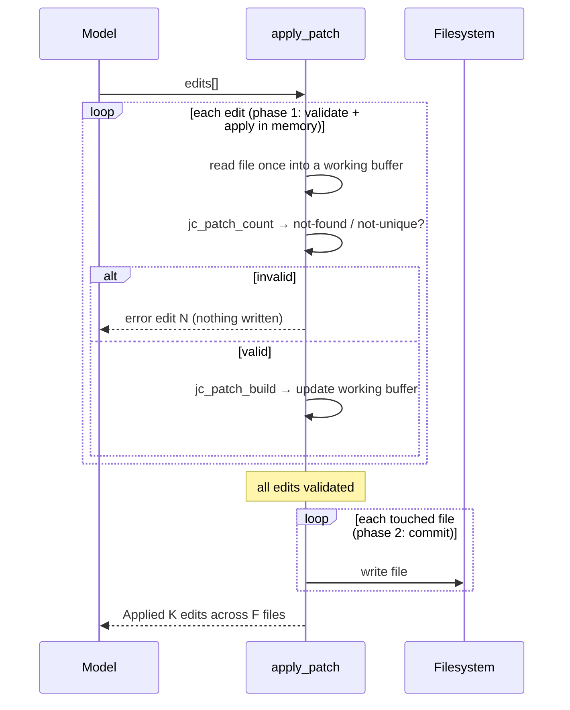
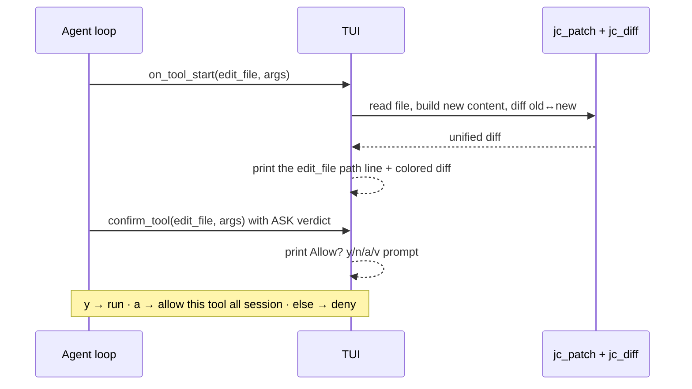

# Editing: `apply_patch` and diff preview

jichi's file editing centers on **exact-string replacement** (find a unique
snippet, replace it) rather than line numbers — robust against the line drift
that trips up unified-diff line offsets. When an exact match isn't found, a
**resilient fallback** (M38) tolerates whitespace/indentation drift before
giving up (see [Resilient matching](#resilient-matching-m38)). Three tools share
one core:

- **`write_file`** — create/overwrite a whole file.
- **`edit_file`** — one exact-string replacement.
- **`apply_patch`** — many replacements, across many files, in one call. Edits
  are validated all-or-nothing (nothing is written unless every edit resolves);
  if a write then fails partway (I/O error, fence denial), the originals are
  written back to any file already committed and the error reports per-file
  state (M138). Only a revert write that itself fails can leave a file
  modified — and that file is named explicitly when it happens.

And the TUI renders a **unified diff preview** of any of these *before* you
approve them (see [Diff preview](#diff-preview-tui)).

## Why a shared core

`edit_file`, `apply_patch`, and the diff preview must agree on exactly what an
edit produces — otherwise the diff you approve wouldn't match what gets written.
So the find/replace logic lives in one pure module, `src/util/jc_patch.c`
(`include/jc_patch.h`):

| Function | Purpose |
| --- | --- |
| `jc_patch_count(hay, needle)` | non-overlapping occurrences |
| `jc_patch_build(text, old, new, replace_all, &out)` | append the exact-replace post-edit text |
| `jc_patch_apply(text, old, new, replace_all, fuzzy, &out, &n)` | resolve+apply one edit: exact, then the fuzzy fallback; returns the strategy used |

All are pure (no I/O), so they are unit-tested directly (`tests/test_patch.c`)
and reused by every edit path. `edit_file`, `apply_patch`, and the diff preview
all call `jc_patch_apply`, so they resolve a match — exact or fuzzy — identically.



## Resilient matching (M38)

Exact-string matching's one weakness is that a near-miss `old_string` — off by
indentation (tabs vs spaces), a trailing space, or a CR/LF line ending — fails
outright, costing the model a retry (or a giveup). `jc_patch_apply` tries exact
first, and **only when exact finds nothing** falls back through two line-oriented
tiers, each requiring a **unique** hit so it never silently edits the wrong place:

1. **whitespace-insensitive** — every line of `old_string` equals the
   corresponding file line after trimming each line's leading/trailing whitespace
   and normalizing CR/LF. Tolerates indentation, trailing-space, and line-ending
   drift.
2. **anchored** — the first and last *non-blank* lines of `old_string` match, and
   the span covers `old_string`'s line count. Tolerates one misquoted interior
   line.

The replaced byte range is computed in the **original** text (so surrounding
bytes are preserved exactly), and the matched lines are replaced by `new_string`
**verbatim** — i.e. the file adopts the indentation/spacing of `new_string`, not
the original. A non-exact match is reported in the tool result (`matched
whitespace-insensitive` / `… anchored`, or `[fuzzy match]` per file in
`apply_patch`) so the behaviour is observable and the model learns its quote
drifted. `replace_all` is **exact-only** (the fuzzy tiers never bulk-replace).

The fallback is on by default; disable it for strict exact-only editing with
config `"fuzzyEdit": false` or `--no-fuzzy-edit`.

## `apply_patch`

One call carrying a list of edits:

```json
{
  "edits": [
    {"path": "src/a.c", "old_string": "foo(", "new_string": "foo2("},
    {"path": "src/a.c", "old_string": "return 0;", "new_string": "return rc;"},
    {"path": "src/b.h", "old_string": "#define N 8", "new_string": "#define N 16"}
  ]
}
```

Each edit has the same rules as `edit_file`:

- the file **must have been read** earlier in the session (the read-before-edit
  guard), checked per file;
- `old_string` must be **found**, and **unique** unless `replace_all` is true;
- `old_string` must be non-empty (use `write_file` to create a file).

Edits to the **same file compound in order** — a later edit sees the result of
the earlier ones.

### Atomicity

The call is all-or-nothing. Every edit is validated and applied to **in-memory**
buffers first; the files are written only if *all* edits succeed. If any edit
fails (not found, not unique, file not read), the tool returns an error naming
the failing edit and **writes nothing**.

The promise extends through the write phase (M138). The originals are still in
memory when the files are committed (they back the result's diffs), so if a
write fails partway — ENOSPC, a permission change, a path-fence denial — the
tool writes the originals back to every file it had already committed, attempts
to restore the failed file itself (unless the failure was a denial, which
provably wrote nothing), and returns an error listing **every file's state**:
`reverted to original`, `untouched (never written)`, `write denied`, or — when
a revert write itself fails — an explicit `REVERT FAILED` warning. The revert
flows through the same `jc_app_write_file` chokepoint as the writes, so it
honors the path fence and the ACP fs delegate. This is complementary to the
turn-level snapshot checkpoint, which exists only at top level and only when
snapshots are on; the in-tool revert also covers subagents and snapshot-less
runs.



### Why this design

- **One round-trip, fewer retries.** A multi-part change is a single tool call
  instead of N `edit_file` calls — fewer model turns and fewer
  "old_string not unique" do-overs mid-sequence.
- **Exact strings, not line numbers.** The model writes code it can see, not
  `@@ -120,7 +120,9 @@` offsets it has to compute (and frequently gets wrong).
- **Atomic.** A partially-applied multi-file change is the worst failure mode for
  an editor. Validating everything before writing prevents the common case, and
  the write-phase rollback (M138) mends the rest: a mid-write failure puts the
  originals back and reports each file's fate honestly.

`apply_patch` is registered as a built-in mutating tool, so it flows through the
same permission gate (`jc_perm`), snapshots, and autonomy envelope as every other
edit.

## Diffs in tool results

Beyond the interactive preview, `edit_file` and `apply_patch` now **return** a
unified diff of what they changed (plain, uncolored) appended to their result, so
the model sees exactly what landed — not just a replacement count:

```
Edited notes.md (1 replacement)
@@ -1,3 +1,3 @@
 # Notes
-TODO: write this
+Done.
```

`apply_patch` appends one `--- <path>` diff section per file it touched. Both
reuse `jc_diff_unified` (uncolored, capped at 200 lines).

Relatedly, `read_file` returns a `cat -n`-style **line-number gutter** and accepts
`offset` (1-based start line) + `limit` (max lines) to read a slice — the gutter
is display-only (the file has no line numbers, so exact-string matching is
unaffected). `list_files` marks directories with a trailing `/`, and
`search_code` takes an optional `context` (grep `-C`) for surrounding lines.

## Diff preview (TUI)

Before you approve an edit, the TUI shows a **colored unified diff** of exactly
what the tool will change — for `write_file`, `edit_file`, and `apply_patch`. The
preview is rendered when the tool *starts* (so it also appears in auto mode, just
without the prompt), and it is computed with the same `jc_patch_build` core the
tool will use, so what you see is what gets written.

```
▸ edit_file  src/util.rkt
@@ -3,7 +3,9 @@
 ;;; Small numeric helpers.

 (provide clamp
-         average)
+         average
+         normalize?
+         angle-between?)

  Allow? [y]es  [n]o  [a]lways  [v]iew
  ›
```



### Rendering core

`jc_diff_unified` (`src/util/jc_diff.c`, `include/jc_diff.h`) renders a unified
diff of two in-memory texts. Design points:

- **Common prefix/suffix trim, then LCS.** Equal leading and trailing lines are
  stripped first; the line-LCS dynamic program runs only over the differing
  middle. For a localized edit in a big file that keeps the cost near-zero, and a
  cell-count guard falls back to delete-all + add-all for a pathologically large
  middle so memory stays bounded.
- **Display, not application.** The diff is for a human to read (and is reused,
  uncolored, nowhere that `patch` consumes it), so hunk headers are approximate
  where one side is empty. Output is capped (`max_out_lines`) with a truncation
  note so a huge edit can't flood the screen.
- **Pure + unit-tested** (`tests/test_diff.c`): identical inputs, single change,
  pure add/delete, the context window, multi-hunk splitting, color, truncation.

### `/diff`

The TUI `/diff` command shows what has changed since the last checkpoint (via the
shadow-repo `jc_snapshot_diff`), colored the same way. Handy after a few
auto-approved edits to review the cumulative result before continuing or `/undo`.
