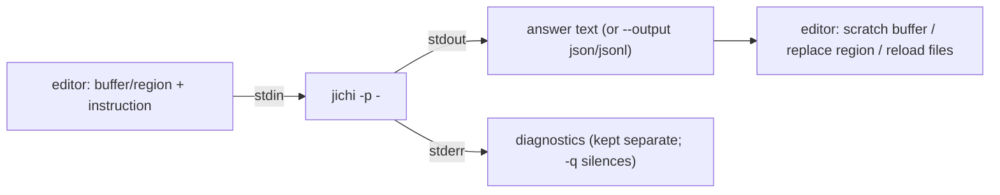

# Editor integrations

jichi is editor-agnostic: every integration is a thin client over the **headless
contract** (`docs/SCRIPTING.md`) — compose a prompt, pipe it to `jichi
-p -` on stdin, read the answer from stdout, keep stderr separate. No editor
needs any jichi C code, and none is privileged over the CLI.

| Editor | Integration | Guide |
|---|---|---|
| **Emacs** | `editors/emacs/jichi.el` (streaming, dispositions, `jichi-task`) | [EMACS.md](EMACS.md) |
| **Vim / Neovim** | `editors/vim/jichi.vim` (`:JichiAsk` / `:JichiRegion` / `:JichiTask`) | [VIM.md](VIM.md) |
| **nano** | `editors/nano/jichi-nano` wrapper + shell/`^T` recipes | [editors/nano/README.md](../editors/nano/README.md) |
| **Zed / any ACP editor** | the built-in ACP server (`jichi serve`) | [ACP.md](ACP.md) |
| **VS Code / JetBrains** | drive the headless contract or ACP from an extension | [SCRIPTING.md](SCRIPTING.md) |

**Not an integration, but an editor-shaped companion:**
[ORG_MODE.md](ORG_MODE.md) is a tutorial for keeping a project's plans,
decisions and journal in Emacs org-mode. It ships no code and jichi ships no
`.org` files — the default practice is plain markdown
([PROJECT_RECORDS.md](PROJECT_RECORDS.md)), which needs no editor at all. Read
the org page only if Emacs is already what you use.

## The contract every integration uses

- **Read-only vs agentic.** Text transforms pass `--readonly` (jichi may read the
  project but not edit). An "act on my project" command passes `--auto` (agentic,
  may edit files) and the editor reloads changed buffers afterward.
- **stdin, not argv.** Prompts and buffer contents go on **stdin** (`-p -`), so
  there is no `ARG_MAX` limit on a whole-file prompt.
- **Project cwd.** Run jichi from the buffer's project root (git root, else the
  file's directory) so the path fence and repo map are project-scoped.
- **Structured output.** For programmatic integrations, `--output json` (one
  object) or `--output jsonl` (one object per event) gives machine-readable
  results; see [SCRIPTING.md](SCRIPTING.md).

## Which integration should I use?

- **Rich, interactive, in-editor streaming** → Emacs (`jichi.el`) or an ACP editor
  (Zed) via `jichi serve` — these stream tokens and support granular tool
  approval.
- **Modal, keyboard-driven** → Vim/Neovim (`jichi.vim`): ask about a buffer,
  transform a visual selection in place, or kick off an `--auto` task.
- **Minimal / on a server** → nano + the `jichi-nano` wrapper, or just call
  `jichi -p` from the shell (great over SSH; see
  [REMOTE_SSH.md](REMOTE_SSH.md) and [TMUX.md](TMUX.md)).

Installation and the full command set for each editor are in the per-editor
guides linked above.
