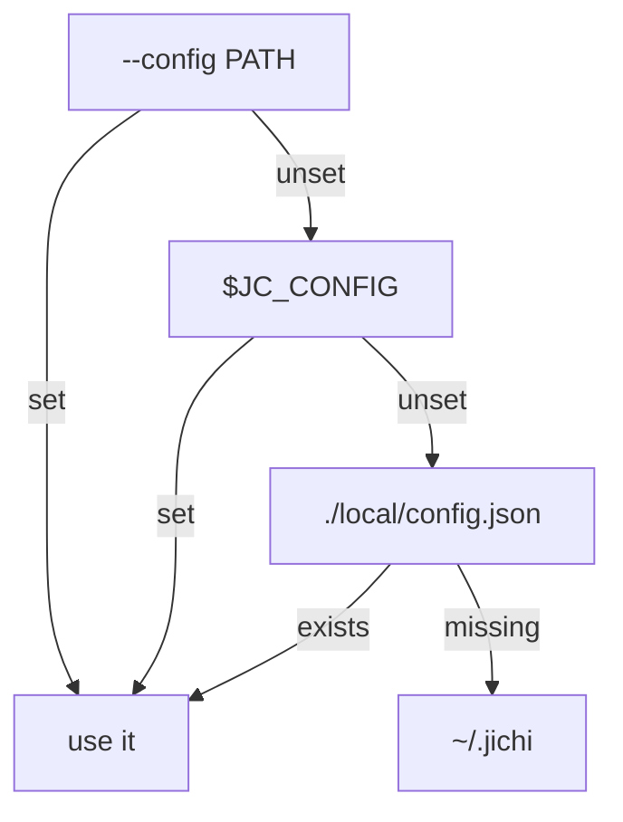

# Installation & System Requirements

This manual covers what you need to run `jichi`, how to build and install
it, and what it expects from the host. It is written for two readers: if you just
want it running, follow **Quick start** and **Install**; if you are packaging it,
putting it on a constrained box, or auditing what it touches, the **Requirements**
and **Files jichi creates** sections have the detail.

For *running* jichi (SSH, embedded, headless, automation) see the companion
[`DEPLOYMENT.md`](DEPLOYMENT.md). For configuring models see
[`CONFIG_TUTORIAL.md`](CONFIG_TUTORIAL.md) and [`MODELS.md`](MODELS.md).

---

## What you get

`make` produces two small, dependency-light binaries (dynamically linked against
libc, libm, and — when present — libcurl):

| Binary | Purpose |
| --- | --- |
| `jichi` | The agent itself — interactive TUI, headless `-p` mode, and an ACP server for editors. |
| `jichi-convert` | A one-shot converter that turns a Continue `config.yaml`/`config.json` into jichi's config format. |

---

## Quick start

> **First time compiling anything?** [`PREPARE_AND_BUILD.md`](PREPARE_AND_BUILD.md)
> is the step-by-step walkthrough (terminal, tools, clone, build, verify) for
> Linux / macOS / Windows-WSL — of which the Linux and **WSL2** paths have both been
> executed end to end, and **macOS** has not ([`PLATFORMS.md`](PLATFORMS.md)). The quick start below assumes
> you know your way around a shell.


```sh
# 1. Build (Debian/Ubuntu: install the one build dependency first)
sudo apt-get install libcurl4-openssl-dev
make

# 2. Point it at a model (minimal config + API key) — see "First-run setup"
printf '{"model":{"provider":"anthropic","model":"claude-opus-4-8",'\
'"apiKeyEnv":"ANTHROPIC_API_KEY","roles":["chat"]}}\n' > ~/.jichi
export ANTHROPIC_API_KEY=sk-...

# 3. Check the setup, then talk to it
./jichi doctor
./jichi -p "say hello in one line"
```

---

## Supported platforms

jichi is **Linux / POSIX-only** by design. It is written in strict **C89 (ANSI C90)**
and compiled against **POSIX.1-2001** (`-D_POSIX_C_SOURCE=200112L`). It relies on
standard POSIX facilities — `fork`/`exec`/`pipe`/`select`/`wait` (for git, MCP and
LSP servers, user tools, the parallel fork pool, and verifiers), `termios` +
`TIOCGWINSZ` (the TUI line editor), and `opendir`/`stat`/`mkdir`.

- **Verified:** **19 rows**, compiled *and* gate-run on each, with the numbers kept
  per row in [`PLATFORMS.md`](PLATFORMS.md#the-matrix). Linux across 14
  architectures and five libcs — glibc, musl, uClibc, bionic — x86-64 / aarch64 /
  armhf / s390x (big-endian) and eleven more, down to a 256 MB one-core VM and a
  kernel 4.9 userland. The code is endian-agnostic, and that is a measurement, not
  an assertion.
- **Verified beyond Linux:** **FreeBSD**, **NetBSD** and **OpenBSD** each run the
  full gate; **WSL2** runs the whole of `make ci`; Android is built both by the NDK
  and on-device by Termux. Between them the BSD rows found ten real defects — an
  inherited `SIGPIPE` that hung pipelines on *every* platform among them — which is
  the argument for the rows: they are a defect detector, not compatibility work.
- **Partly verified:** **Cygwin** (unit and smoke tiers, not `make ci`).
- **Never compiled:** **macOS** (one Darwin-specific path exists —
  `sysctl(HW_MEMSIZE)` — and it was un-compilable under this project's own flags
  until M400; the older claim of "no Darwin-specific code" was simply wrong) and
  **illumos**. Plain POSIX with a C89 compiler and libcurl is a good reason to
  expect success, not evidence of it.
- **Not supported today:** Windows natively (no POSIX layer — WSL is the intended
  path, and [PORTING_WINDOWS.md](PORTING_WINDOWS.md) maps exactly where POSIX
  ends).

**The full matrix, and what "verified" and "never compiled" mean here:
[`PLATFORMS.md`](PLATFORMS.md).**

---

## Requirements

### Minimum (to build and run)

| Need | Detail |
| --- | --- |
| **C compiler** | gcc or clang (any C89-capable POSIX compiler). Only needed to build from source — or use a prebuilt binary. |
| **libc + libm** | Standard C library and math (`-lm`, linked unconditionally). |
| **Disk** | ~1 MB for the binaries; a few MB more for runtime caches (bounded — see below). |
| **RAM** | jichi's own heap is a few MB: an 8 KB-block arena for the session (grows as the conversation does, freed at exit), with responses streamed (not buffered whole) and history bounded by auto-compaction. The practical floor on a dynamically-linked build is **libcurl + its TLS stack** — roughly 10–20 MB RSS. A minimal-libcurl static build reads much lower. See [`LOW_MEMORY.md`](LOW_MEMORY.md). |
| **A terminal** | For the TUI. Headless (`-p`) mode needs no terminal at all. |
| **libcurl** | **Only required to call a model** (HTTPS/TLS/SSE). The core, the test suite, and the offline subcommands build and run without it. |
| **Network** | HTTPS egress to your model endpoint — only when you actually make model calls. |

### How old a system, exactly (M326u)

The table above said "any C89-capable compiler" and named no versions, so the
question *"what is the oldest Linux this builds on?"* had no answer to look up.
It does now. **The kernel is not the constraint** — jichi uses `fork`, `exec`,
`pipe`, `select`, `wait`, `termios` and AF_UNIX sockets and nothing newer: no
`epoll`, `inotify`, `pipe2`, `accept4` or `O_CLOEXEC`. The libraries are:

| Component | Minimum | What sets the floor |
| --- | --- | --- |
| **libcurl** | **7.19.4** (Feb 2009) | `CURLOPT_PROTOCOLS` / `CURLOPT_REDIR_PROTOCOLS`, used in the pre-7.85 branch of the SSRF guard. `CURLOPT_SEEKFUNCTION` needs 7.18.0. The newer options are `#if`-guarded with fallbacks: `CURLOPT_XFERINFOFUNCTION` (7.32.0) falls back to `CURLOPT_PROGRESSFUNCTION`, and the `_STR` protocol options (7.85.0) to the bitmask form. |
| **glibc** | **2.12** (2010) | POSIX.1-2001 throughout. Two glibc extensions are used and both are `#if defined`-guarded: `_SC_PHYS_PAGES` and `_SC_NPROCESSORS_ONLN`. On glibc **< 2.17** `clock_gettime` lives in **librt**, and the build probes for that and adds `-lrt` — see below. |
| **musl / uClibc-ng** | any current | `clock_gettime` is in libc; nothing else applies. |
| **C compiler** | any C89 | Not the binding constraint. GNU make **3.82** is supported (the `\043` escape in the probes exists for it). |

**In distribution terms:** RHEL/CentOS **6** (glibc 2.12, curl 7.19.7) and Debian
**7** (glibc 2.13, curl 7.26) are the oldest that meet both floors — and they are
*exactly* at the line, with no margin. RHEL/CentOS **7** (glibc 2.17, curl 7.29)
and Debian **8** onward have room to spare.

> **The `-lrt` story, because it was a real defect.** `jc_now_millis` guarded its
> `clock_gettime` call with `#if defined(CLOCK_MONOTONIC)` — but `<time.h>`
> defines that macro on *every* glibc, including the ones where the function is
> in `librt`. The code compiled and then failed to **link**
> (`undefined reference to clock_gettime`), because a compile-time guard cannot
> see a linker's symbol table, and nothing ever put `-lrt` in `LDLIBS`. That was
> an undocumented build floor of glibc 2.17 with no diagnostic. The Makefile now
> probes: links bare → nothing to do; links with `-lrt` → add it; links neither
> → `-DJC_NO_CLOCK_GETTIME` and the coarse `time()` fallback stands. `make info`
> reports which. **Honesty about evidence:** the three probe branches are
> verified here with a compiler wrapper that simulates each libc, and the
> fallback path is compiled under `-Werror`; the *library version dates* are from
> upstream documentation, not measured — no glibc 2.16 machine was available.

### Recommended (for the full experience)

| Want | Why |
| --- | --- |
| **libcurl with TLS** | Required for any model call; the OpenSSL build (`libcurl4-openssl-dev`) is the common choice. |
| **git** | Enables workspace **snapshots/undo** and the read-only `git_*` tools. Without git, jichi still runs; those features silently disable. |
| **An embed/rerank-capable model** | Enables semantic codebase search (`index`, `codebase_search`). |
| **A UTF-8 locale + color terminal** | Nicer TUI: box glyphs, markdown, and syntax highlighting. Falls back to ASCII + no color otherwise. |
| **python3** | **Optional**, and not needed at runtime. A build is fully validated Python-free by `make check-target` (= the C unit suite + the POSIX-sh smoke tier `make smoke`; 90 drivers at M259). `make e2e` runs only a small residual of Python-only checks (a VT-wrap emulator, the shipped `stress`/`web-bridge` example *products*, the assignment-grader two-sidedness, and model-gated live checks) and **skips loudly when python3 is absent** rather than failing (M217). |

---

## Installing build dependencies

On Debian/Ubuntu the only build dependency is libcurl's development headers:

```sh
sudo apt-get install libcurl4-openssl-dev   # required to compile networking
sudo apt-get install git                     # recommended (snapshots + git tools)
sudo apt-get install python3                 # optional: a residual `make e2e`
                                             #  (`make check-target` needs no python)
```

The runtime `libcurl.so` is usually already present on a desktop/server system;
the `-dev` package supplies the headers and the linker symlink needed to compile
against it. The JSON parser is **original code in-tree** (`src/json/cJSON.c`,
an implementation of the cJSON API rather than a copy of it) — nothing to
install.

---

## Build

```sh
make              # build both binaries (jichi and jichi-convert)
make jichi # just the agent
make jichi-convert  # just the converter
make test         # build + run the unit suite
make info         # show what the build detected
make clean        # remove build artifacts
```

First-party code compiles with **zero warnings** under
`-std=c89 -pedantic -Wall -Wextra` — **every** translation unit, with no
exemptions. (There is no vendored code to exempt: `src/json/cJSON.{c,h}` is
original code implementing that library's API, and it is pedantic-clean.)

`make info` tells you what the build probed:

```text
CC             = cc
HAVE_VSNPRINTF = yes      # uses C99 vsnprintf; "no" falls back to a C89 formatter
HAVE_CURL      = yes      # networking is compiled in; "no" => offline-only binary
```

If `HAVE_CURL = no`, you built without libcurl: the binary still runs, but any
model call will fail — only the offline subcommands work (see
[`DEPLOYMENT.md`](DEPLOYMENT.md#3d-offline-and-air-gapped)).

### Build knobs

| Variable | Effect |
| --- | --- |
| `CC=clang` | Choose the compiler (default `cc`). |
| `WERROR=1` | Treat warnings as errors, in every translation unit (no exemptions). |
| `SAN=1` | Build with AddressSanitizer + UndefinedBehaviorSanitizer. |
| `make ci` | The full local gate: gcc + clang `-Werror`, ASan/UBSan, valgrind, and `make e2e`. |


---

## Install / uninstall

> **`make install` does not build, and that is deliberate (M586).** Build first,
> as yourself; then install. The target used to depend on `all`, so
> `sudo make install` rebuilt the whole tree **as root** — measured on the
> maintainer's own tree after three installs in one day: **352 root-owned files**,
> after which the next ordinary `make` failed with
> `error: unable to open output file 'src/util/jc_diff.o': Operation not permitted`.
> It survived unnoticed because `sudo make install` *succeeds*; the damage shows
> up at the next build, well after the cause. If a tree already has root-owned
> objects, plain **`make clean` fixes it and needs no sudo** — deleting a file
> depends on write permission for its *directory*, not on the file's owner.

```sh
make clean && make && sudo make install   # system-wide, PREFIX=/usr/local (default)
# install prints the revision it copies, and refuses one stamped '-dirty' (M593):
# commit first, rebuild as yourself, then install. ALLOW_DIRTY=1 overrides.
make install PREFIX=~/.local              # per-user, no sudo
make install DESTDIR=/tmp/stage           # staged install for packaging
make uninstall                            # remove what install put down
```

**`make clean` first when you are UPGRADING an existing install**, which is the
common case and costs almost nothing: a clean parallel build of the whole tree is
**3 s** on a 24-core box (measured 2026-08-19), so there is no reason to risk a
stale object. Two failures on that day argue for it. A generated build stamp did
not recompile when only the commit changed, so `make` produced a binary claiming
the *previous* commit; and a rule added near the top of the Makefile silently
became the default goal, so bare `make` built one header, **exited 0, and left no
binary** — a state an incremental build reports as success. `make clean` removes
the build artifacts that let both hide.

After installing, check what you actually got:

```sh
jichi --version         # `build: <short hash>` must match `git rev-parse --short HEAD`
```

That second line exists because on 2026-08-19 the installed binary was 12 days and
~50 milestones behind the tree and **both printed `jichi 0.9.0`** — see M495.

`install` lays down (honoring `DESTDIR` and `PREFIX`):

| File | Destination (default) |
| --- | --- |
| `jichi`, `jichi-convert` | `$PREFIX/bin/` |
| `man/jichi.1` | `$PREFIX/share/man/man1/` |
| `completions/jichi.bash` | `$PREFIX/share/bash-completion/completions/jichi` |
| `completions/jichi.zsh` | `$PREFIX/share/zsh/site-functions/_jichi` |

After a `PREFIX=~/.local` install, make sure `~/.local/bin` is on your `PATH` and
(for the man page) `~/.local/share/man` is on your `MANPATH`. Shell completion is
picked up automatically by bash/zsh from the standard directories above.

> The installed man page (`man jichi`) is the terse command reference. This
> manual and [`DEPLOYMENT.md`](DEPLOYMENT.md) are the long-form companions.

---

## First-run setup

jichi needs one configured model. The smallest possible `~/.jichi`:

```json
{
  "model": {
    "provider": "anthropic",
    "model": "claude-opus-4-8",
    "apiKeyEnv": "ANTHROPIC_API_KEY",
    "roles": ["chat"]
  }
}
```

- `provider` is `anthropic` or `openai` (OpenAI-compatible servers like vLLM,
  llama.cpp, LM Studio, or Ollama's OpenAI endpoint all use `"openai"` + an
  `apiBase`).
- `apiKeyEnv` names the environment variable holding the key, so the key never
  lives in the file. `ANTHROPIC_API_KEY` / `OPENAI_API_KEY` are also read as
  provider defaults.

**Config file resolution** (first match wins):



`./local/config.json` is a convenient **project-local** override (git-ignore it).
Then validate everything:

```sh
jichi doctor
```

`doctor` checks libcurl, the config and active model, the API key's presence
(never its value), per-server reachability, embed/rerank role coverage, git +
snapshots, and any MCP/LSP servers — and exits non-zero if a hard check fails. See
[`DOCTOR.md`](DOCTOR.md). For richer config (multiple models, roles, fallback,
routing, MCP, LSP, user tools) see [`CONFIG_TUTORIAL.md`](CONFIG_TUTORIAL.md) and
[`MODELS.md`](MODELS.md).

---

## Files jichi creates at runtime

Nothing is created until you use the relevant feature. All paths are under `$HOME`
(or `/tmp` if `HOME` is unset), except the per-project `.jichi/` directory.

| Path | Contents | Bound / disable |
| --- | --- | --- |
| `~/.jichi` | Your JSON config (you create this). | — |
| `~/.jichi.d/sessions/<id>.json` | Saved conversations (history + mode + workspace). | `--no-session` to skip saving a run. |
| `~/.jichi.d/checkpoints/<key>/` | Shadow git repo for **snapshots/undo** (your own `.git` is untouched). | `snapshots:false`; `snapshotLimit` (default 100); auto-disabled on huge non-git trees. |
| `~/.jichi.d/index/<key>/` | Semantic search index: `manifest.json` + `vectors.f32`. | Built only by `index`/`codebase_search`; delete the dir to reclaim. |
| `~/.jichi.d/runs/<id>.jsonl` | Audit journal for `--auto`/envelope runs. | `--journal -` disables; or point elsewhere. |
| `<project>/.jichi/` | `memory.md`, `skills/`, `commands/`, `agents/` — project-scoped agent assets you (or the agent) author. | Plain files; edit or delete directly. |

These are safe to delete when jichi is not running; caches rebuild on demand. For
backups, the only irreplaceable data is `~/.jichi` and `~/.jichi.d/sessions`.

---

## Two directories, two purposes (read this before the commands)

New users lose time here, so it is worth stating plainly. There are **two**
directories involved and they are never the same one:

| Directory | What you do there | Why |
|---|---|---|
| the **jichi source checkout** | `make`, `make test`, `make install` | the `Makefile` lives here; `make` works nowhere else |
| **your own project** (any repo) | run `jichi` to do work | jichi reads its config, `.jichi/` assets and your files **relative to the current directory** |

So: build and install *from the checkout*, then `cd` into whatever project you
want help with and run `jichi` there. Config is resolved per project —
`./local/config.json` in the project you are standing in wins over `~/.jichi`
(full order in [`MODELS.md`](MODELS.md)), which is why the active model can
differ from one project to the next.

## Which `jichi` am I actually running? (the shadowing trap)

**Symptom:** you build a new version, install it, and a feature documented as
present does nothing at all. No error — nothing.

**Cause:** more than one `jichi` on disk, and `PATH` picks a different one than
you installed. `make install` defaults to `PREFIX=/usr/local` (hence `sudo`),
but many systems put `~/.local/bin` *earlier* in `PATH`. If an older binary sits
there, every new release you install is invisible to your shell. Observed
2026-08-04: a user's `~/.local/bin/jichi` was five days old, so five milestones
of fixes and a whole new keybinding appeared to be missing.

**Diagnose it in one line:**

```sh
command -v jichi                  # which file will actually run
jichi --version                   # and what it claims to be
ls -l $(command -v jichi)         # its date -- older than your build?
```

**Fix — install where your `PATH` already looks, and drop `sudo` entirely:**

```sh
rm -f ~/.local/bin/jichi ~/.local/bin/jichi-convert       ~/.local/bin/jlu_continue ~/.local/bin/jlu-convert
make install PREFIX="$HOME/.local"
```

Removing those needs no `sudo` even if a previous `sudo make install` left them
root-owned: deleting a file depends on write permission for its *directory*, and
`~/.local/bin` is yours. Every path `make install` writes is under `$(PREFIX)`,
so a user-prefix install never needs root.

**If a previous `sudo make install` used this same prefix, the non-sudo install
fails halfway.** You get the binaries but not the man page:

```
install -m755 jichi jichi-convert /home/you/.local/bin          <- succeeded
install -d /home/you/.local/share/man/man1
install: /home/you/.local/share/man/man1: chmod failed with error
         Operation not permitted (os error 1)
make: *** [Makefile:311: install] Error 1
```

The cause is not permissions on the *files* but ownership of the
*directories*: `sudo` created `~/.local/share/{man,bash-completion,zsh,emacs,vim}`
as **root**, inside your own home, and `install -d` cannot chmod them. Hand them
back to yourself once and the problem is gone for good:

```sh
sudo chown -R "$USER:$USER" ~/.local/share/man ~/.local/share/bash-completion      ~/.local/share/zsh ~/.local/share/emacs ~/.local/share/vim
make install PREFIX="$HOME/.local"
```

Those directories hold only jichi's own files (`jichi.1`, the shell completions,
`jichi.el`, `jichi.vim`), so nothing else is touched. Note what still worked
while this failed: the **binaries installed first**, so the agent itself was
already up to date — only `man jichi` and shell Tab-completion of jichi's flags
were missing. Worth knowing before you conclude an install did nothing.

**Then keep exactly one install.** Two copies is how the trap springs; if you
also have `/usr/local/bin/jichi`, remove it (`sudo rm -f /usr/local/bin/jichi
/usr/local/bin/jichi-convert`) so there is only ever one answer to "which jichi
am I running".

**Verify a specific feature is really in the binary you run** — more reliable
than `--version`, which does not change for every change:

```sh
strings $(command -v jichi) | grep -c 'advice: is this'   # 1 = the M280 keys are in
```

## Verifying the install

```sh
jichi --version          # e.g. "jichi 0.2.0-dev"
jichi --help             # full flag + subcommand reference
jichi doctor             # setup health check (exit 1 if a check fails)
jichi -p "reply with OK" # a tiny end-to-end smoke test (needs a model)
```

From a source checkout you can also run the test suite and the full gate:

```sh
make test     # unit suite (hermetic, no network)
make ci       # gcc + clang -Werror, ASan/UBSan, valgrind, offline e2e
```

---

## Troubleshooting the build

| Symptom | Cause / fix |
| --- | --- |
| `make info` shows `HAVE_CURL = no` | libcurl headers missing → `apt-get install libcurl4-openssl-dev`. The build still succeeds (offline-only). |
| Link error on `-lcurl` | pkg-config can't find libcurl; install the `-dev` package, or build offline. |
| `read_file` line numbers look wrong / `HAVE_VSNPRINTF = no` | A toolchain without C99 `vsnprintf`; the C89 fallback is used. Functional, slightly less precise width formatting. |
| Warnings under a different compiler | Build with `WERROR=1 CC=<gcc|clang>` and report them — first-party code is meant to be warning-clean on both. |

See [`DEPLOYMENT.md`](DEPLOYMENT.md) for cross-compiling, static linking, and
running on constrained or headless hosts.

## Next: set up a project

With the binary built, the fastest path to a working project is the guided
wizard — it picks a role preset, scaffolds assets, writes a config, emits a
start-script, and validates the result:

```sh
jichi setup
```

See [`SETUP_WIZARD.md`](SETUP_WIZARD.md) and the
[beginner tutorial](TUTORIAL_BEGINNER.md).
