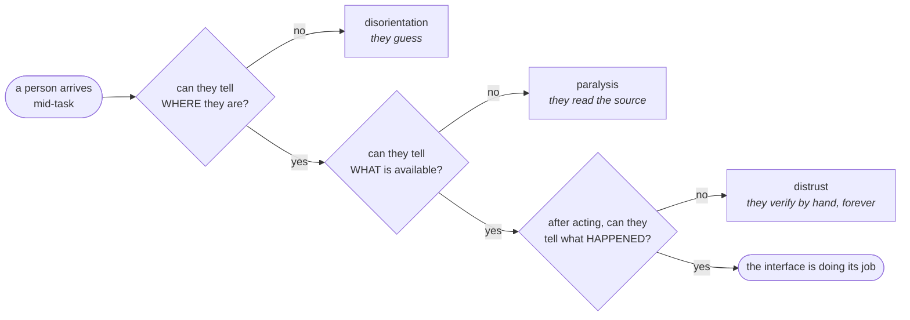
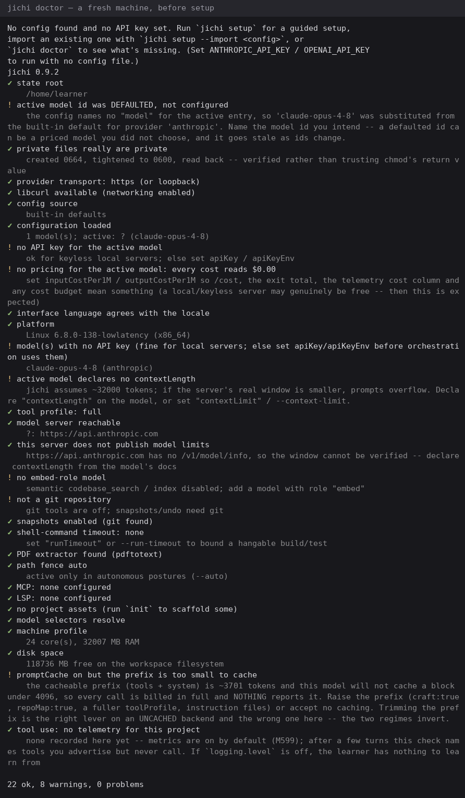

# Interfaces — designing them, including the ones made of text — a tutorial

**For a self-learner or junior developer.** You will learn one test you can apply
to any interface, practise it on the cheapest surface there is (a command-line
program), and then apply it to the surface most people never think of as an
interface at all: **a document**.

Every command here was run in the form shown, on 2026-09-19, and the outputs are
the outputs it produced. The reading behind it is
[`BIBLIOGRAPHY.md`](BIBLIOGRAPHY.md) §6.

> **Unfamiliar word?** [`VOCABULARY.md`](VOCABULARY.md) defines the terms this
> project leans on before it uses them — including the English **idioms**
> (*dogfooding*, *blast radius*, *born red*), which are figures of speech rather
> than technical terms and do not survive a dictionary. *Affordance*,
> *signifier*, *feedback* and *orientation* are the ones this page leans on.

---

## 1. The whole tutorial in one sentence

> **You are here. This is what you can do here.**
>
> — Alexander-Lars Dallmann

Every interface owes its user those two facts, continuously. Almost every
interface defect worth the name is one of them going missing.

That is not a slogan borrowed for the occasion — it is the shape of this
project's own worst bugs, and you can read them in its record:

| What happened | Which half went missing |
|---|---|
| a cap fired and the run just stopped | *what happened* — no feedback |
| a refusal named no way forward | *what you can do* — no affordance |
| a `note:` line vanished into a redraw | *where you are* — no signifier |
| four table rows rendered as plain text | *where you are* — the structure lied |

Norman's vocabulary for those three is **affordance**, **signifier** and
**feedback** ([`BIBLIOGRAPHY.md`](BIBLIOGRAPHY.md) §6), and it is worth learning
because it turns "this feels wrong" into a sentence you can act on.



**The test you can apply today, to anything:** drop a person into the middle of
it and ask those three questions. You do not need a lab. You need one person, one
task, and the discipline not to coach them — which is the whole method Krug's
book teaches, and the hardest part is your own silence.

---

## 2. Practise on a CLI, because the feedback loop is seconds long

A command-line program is the cheapest interface to build, to change, and to be
wrong about in public. It is also the one with actual **standards**, which most
surfaces lack.

### 2.1 The rules that are not opinions

Read POSIX.1-2024 chapter 12 once ([`BIBLIOGRAPHY.md`](BIBLIOGRAPHY.md) §6). The
rule most hand-written parsers get wrong is this one:

- an option with a **mandatory** option-argument may be written `-c value` *or*
  `-cvalue`;
- an option with an **optional** option-argument **must** be written `-fvalue`,
  adjacent — and the utility **must not** consume the next argument to fill it.

Get that backwards and your program disagrees with every standard utility on the
system, in a way that only shows up in somebody else's script.

### 2.2 Orientation, on a surface with no screen

Here is the surface this section argues about, photographed rather than
described — `jichi doctor` on a machine **before** any setup, which is where a
reader actually meets it:



Read it as an interface rather than as output. Every line answers one of the
three questions: **where am I** (`state root`, `platform`, `config source`),
**what is available** (`tool profile`, `model server reachable`, `PDF extractor
found`), and **what is wrong and what do I do about it** — each `!` names the
fix in its own second line, not in a manual. *"no embed-role model"* is followed
by *"add a model with role embed"*, which is the difference between a diagnostic
and a complaint.

Note what it does **not** do: it does not fail. Eight warnings, zero problems,
and a usable program — because a first run on an unconfigured machine is a
normal state, not an error. A tool that refused to start here would be correct
about the configuration and wrong about the person.

*(That image is a capture from a real run, not a mock-up.
[`ILLUSTRATION.md`](ILLUSTRATION.md) carries the rule and the recipe.)*

Here is the idea from §1, applied. Three commands, three answers:

```console
$ jichi describe
jichi 0.9.2 -- interface contract

Output formats: text, json, jsonl (one object/line, versioned).
Exit codes: 0 ok, 1 error, 2 usage/config, 130 interrupted (SIGINT), 143 terminated (SIGTERM)
Modes: chat, plan, auto.

Drive headless:  jichi -p 'task' --output jsonl
```

That is *what you can do here*, written for a program as much as for a person —
which is why the exit codes are in it. A script that must distinguish "the user
interrupted" from "the task failed" cannot guess 130.

```console
$ jichi docs
Configured documentation sources:
  py-tutorial      /home/…/course-corpora/python-3.14/tutorial
```

That is *where you are*: the sources this workspace actually has. Note what it
does **not** do — it does not make you find out by asking a question and getting
a bad answer.

```console
$ jichi doctor
✓ state root
✓ private files really are private
✓ provider transport: https (or loopback)
✓ libcurl available (networking enabled)
```

That is *what happened, and what you can do about it*. The design decision worth
stealing: **a check that passes still prints a line.** Silence is
indistinguishable from "this was never checked", and an interface that is silent
when things are fine cannot be trusted when it is silent about something else.

### 2.3 The one about errors

An error message is an interface, and it has the same three obligations. Compare:

```
error: invalid configuration
```

against the shape this project settled on after getting it wrong:

```
! core count: this platform does not expose a core count to jichi, so it
  reads 1 -- and maxParallelAgents defaults to it, which makes spawn_parallel
  run a single child. If this machine has more cores, set "maxParallelAgents"
  in your config explicitly.
```

*Where you are* (the count is not available), *what happened* (the default is 1),
*what you can do* (set this key). The first version says none of the three, and
its reader's next action is to read your source code.

---

## 3. A document is an interface

This is the part people skip, and it is the part most of your readers will meet.

A reader of a document has the same three questions, and a document has the same
components an application does:

| Interface element | Its form in a document |
|---|---|
| navigation / a map | a table of contents that states the **shape of the argument**, not just its headings |
| "you are here" | section numbers, and a banner naming what this page assumes you already have |
| affordances | "run this", "skip to §5 if you already have a model" — the visible next actions |
| error states | the *when it goes wrong* table, which is a document's error message |
| tooltips | a glossary, and idioms explained rather than assumed |
| index / search | predictable heading words, so the reader's own `Ctrl-F` works |
| illustrations | a diagram that answers a question the prose cannot — **and no others** |
| undo | an escape route at each step: what to do when that step fails |

**The rule for diagrams, because it is the one most often broken.** A diagram
earns its place by answering a question the prose cannot answer as well. The
mermaid block in §1 is a decision tree — prose states three questions poorly and
a branching picture states them well. A diagram that merely re-states a list is a
cost: it must be maintained, it goes stale silently, and it is invisible to a
screen reader unless you also wrote the prose.

**Try this, on your own writing.** Open a page you wrote and read only the
headings. If you cannot reconstruct the argument from them, your table of
contents is a list of labels rather than a map — and a reader arriving from a
search engine lands in the middle of it with no way to orient.

---

## 4. What a script can check, and what it cannot

This distinction is the spine of the whole project, and it applies here exactly.

**A script can check** that a page has a map, that its internal anchors resolve,
that every term it leans on is in the glossary, that its counts match the thing
they count, and that its table rows are actually table rows. This project's own
lints do all five — one of them exists because four rows of the platform page
were rendering as plain text and nobody noticed until something tried to count
them.

**A script cannot check** whether the page is any good. Nothing automates that.
The instrument for it is §1's: one person, one task, no coaching.

Pseudocode for the checkable half, because it is simpler than it sounds:

```
for each page in docs/:
    if page has no "## " heading      -> fail: no map
    for each internal link in page:
        if link target does not exist -> fail: a dead affordance
    for each term in required_glossary:
        if term not defined in glossary -> fail: a tooltip with no text
```

That is a lint. It will never tell you the page is clear. It will tell you,
forever, that the page is not *broken* — and those are different promises, which
is exactly why both are worth having.

---

## 5. The TUI, because this project has one and it has been wrong

A TUI is a **screen you redraw inside a terminal you do not own**. That sentence
contains every difficulty: the screen has a size you did not choose, the terminal
has capabilities you did not pick, and both can change while you are drawing.

This section exists because §6 below says these sections grow when the tree has a
worked example, and this one now does — jichi's own line editor, its colour
rules, and five years' worth of terminal failures found on real hardware.

### 5.1 The advice this project did not take

The usual advice is: **ask `terminfo(5)`** what the terminal can do rather than
hardcoding escapes that work on your laptop. It is good advice. jichi does not
follow it — there are **zero** references to terminfo, ncurses or `tput` in
`src/tui/`, and the program writes a small hardcoded set of ANSI/SGR sequences.

That is a decision, not an oversight, and it is worth spelling out because the
trade is the lesson rather than the answer:

- **What it buys.** jichi's dependency rule is *libcurl and nothing else*.
  Linking ncurses to move a cursor would roughly double the dependency surface
  of a program whose whole argument is that it has almost none — and it would
  have to be present on a 415 MB Raspberry Pi, on four BSDs and on illumos.
- **What it costs.** The escape vocabulary is a bet that every terminal worth
  supporting speaks the same small dialect. That bet is *mostly* right in 2026
  and this project cannot prove it is right, only that it has not yet been
  caught being wrong.

**Take the advice unless you can state that trade for your own program.** "I did
not want a dependency" is a reason; "I did not know terminfo existed" is not.

### 5.2 Four rules, each with the failure that produced it

**Ask the terminal its size, and have two fallbacks.** `term_cols()` in
[`src/tui/jc_term.c`](../src/tui/jc_term.c) tries `ioctl(TIOCGWINSZ)`, then
`$COLUMNS`, then **80**. Three answers, in decreasing order of authority, and the
last one always works. The platform note: on **illumos**, `TIOCGWINSZ` and
`struct winsize` are hidden when `_POSIX_C_SOURCE` is defined and only reappear
with `-D__EXTENSIONS__` — so the first and best of the three answers is the one
most likely to vanish on a system you have not tried yet.

**Both ends have to be a terminal.** jichi sets
`t->is_tty = isatty(t->in_fd) && isatty(t->out_fd)` — an `&&`, deliberately. A
program whose input is a pipe and whose output is a terminal is not in an
interactive session, and drawing a prompt into it produces an interface nobody
is sitting in front of.

The sharpest version of this was measured on **illumos**: a pty slave on a
STREAMS system **is not a terminal** until `ptem` and `ldterm` are pushed onto
it. Measured directly — `isatty` returns 0 before the push and 1 after. Nineteen
smoke drivers failed there, and jichi was right every time: it had been handed a
non-tty and correctly took its non-interactive path. *The harness was wrong, and
it looked exactly like the program being wrong.*

**Colour is meaning, and the rule is one line.**
`jc_color_enabled(mode, is_tty)` is four lines long: an explicit `--color` flag
wins, otherwise colour follows `isatty`. And the colours are not decoration —
`jc_mode_color()` maps green to *safe, asks before changing anything*, blue to
*read-only planning*, yellow to *runs tools unattended*. The meaning is written
in the comment beside the escape, because a colour whose meaning lives only in
someone's head is a colour that will be reused for something else.

Honour **`NO_COLOR`**. Then honour it correctly, which is harder than honouring
it at all — see 5.3.

**Wrap to a width you chose, not to the terminal's.** jichi's setup wizard has a
**76-column** rule, checked by `setup_keyfile.sh`. It exists because text you
wrap at the terminal's width reflows differently for every reader, and a wizard
that looks considered at 120 columns and shreds at 80 is a wizard nobody trusts.

The rule caught a **~150-column** pre-prompt notice that had been shipping on
every platform and was reached only on FreeBSD, because that was the row whose
driver happened to type before the first prompt. *A rule you enforce in one place
finds things in places you were not looking.*

### 5.3 The combination nobody runs

The best TUI bug in this tree's history is not a terminal bug at all.

jichi has an **accessible mode** that replaces chrome with sentences, because
`[tokens in=4,946 out=37]` is spoken by a screen reader as about nine tokens of
which five are punctuation — after *every* model call. The code read:

```c
if (c->color)      { /* the bracketed form */ }
else if (c->accessible) { /* the prose form */ }
```

which makes the prose form **dead code for any accessible user whose terminal has
colour** — and accessible mode does not imply `NO_COLOR`. The operator ran the
shipped build and got the accessible header beside a bracketed token line.

**Why every test missed it:** `tests/smoke/_smoke.sh` exports `NO_COLOR=1` for the
whole tier, so the accessible arm had never once run *with colour on*. Eight
checks in the accessibility driver, every one of them green, and the single
combination that mattered was the one the harness had made impossible.

The fix in the code was to swap two branches. The fix in the *instrument* was a
third arm: accessible **with** colour. Look at what your harness sets globally —
it is defining the universe your tests are allowed to explore.

### 5.4 A pty tests the logic; only a terminal tests the terminal

The smoke tier drives jichi's line editor through a pty, and that is the right
instrument for the editor's *logic*: keystrokes, buffers, cursor arithmetic,
type-ahead. It cannot answer what a real emulator does.

So this project has a second rig,
[`scripts/tier-v-terminals.sh`](../scripts/tier-v-terminals.sh), which drives
jichi inside **real X11 terminal emulators** by injecting keystrokes, and asks
the four questions a pty cannot:

1. Does a **paste** of a three-line block arrive intact, the way bracketed-paste
   handling assumes?
2. Does **dragging a window edge** deliver the `SIGWINCH` the redraw expects?
3. Is **Ctrl-C from a keyboard** the same thing as a `0x03` written to a pty?
4. Does **type-ahead during a turn** stay visible and queued?

It is deliberately outside `make ci` — it needs a live X server and it takes the
keyboard while it runs. That is the honest position for a test that cannot be
automated into a quiet corner: keep it, name it, and say when it last ran.

**The general form, which applies to any interface you build:** your fast
harness tests the part you can simulate. Write down what it *cannot* reach, and
then decide deliberately whether to build a slower instrument for that part or
to accept the gap. A gap you have named is a risk; a gap you have not is a
surprise.

## 6. The other surfaces, and an honest scope


This page teaches **CLI, documents and the TUI**, because they are the surfaces
this project builds and can demonstrate from its own tree. The others are real
and are not covered here:

- **Desktop** — read two platforms' guidelines on the *same* question and notice
  they disagree. That disagreement is the lesson.
- **Web** — the surface with the most literature and the most fashion. Start with
  **WCAG**, because it is the part that is measurable.

A page that pretended to cover six surfaces would be a worse page. When these
grow worked examples in this tree, they grow sections here.

---

## 7. The checklist

1. Can a person arriving mid-task tell **where they are**?
2. Can they tell **what is available**?
3. After acting, can they tell **what happened**?
4. Does every refusal name **a way forward**?
5. Does a check that passes still **say so**?
6. Does every diagram answer a question the prose cannot?
7. Does every step have an **escape route** when it fails?
8. Have you watched **one person** use it without coaching them?

Seven of those you can check yourself. The eighth is the only one that finds
what you cannot imagine.
