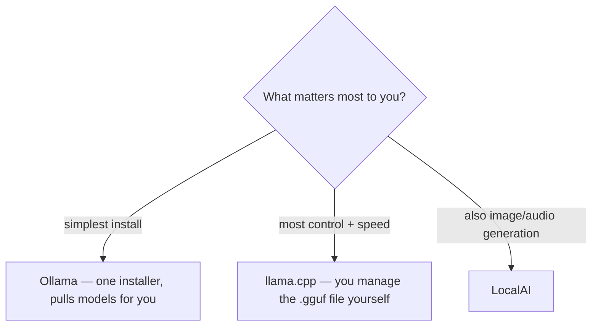

# Local models: the offline study machine

jichi speaks to any **OpenAI-compatible** endpoint, and every local server worth
using exposes one. That means a student with no API key, no account, and no
internet — or a lab with a no-external-services policy — can run the full
agent against a model on their own machine (or one box down the hall). This
page is the quickstart; [MODELS.md](MODELS.md) is the reference,
[LOW_MEMORY.md](LOW_MEMORY.md) covers small machines, and
[DEPLOYMENT.md](DEPLOYMENT.md) covers SSH/embedded setups.

**The pitch, concretely:** jichi itself is a small C89 binary (libcurl + cJSON,
no runtime). The heavy part is the model — and that can live on any machine on
the network. A 15-year-old laptop running jichi against a llama.cpp server on a
desktop is a perfectly good setup; so is one shared model server for a whole
classroom.

## First: pick a backend, install it, get a model

Three servers all speak the OpenAI API jichi needs — pick one:



Whichever you pick, **two things must exist before the server starts**: the
**runtime** (installed) and a **model file** (downloaded — these are multi-GB, so
mind your disk space and bandwidth). Each section below names both. Then you
point jichi at the running server with a `local/config.json` (examples follow).

## llama.cpp (`llama-server`)

**Before you start:** install llama.cpp (build it, or `brew install llama.cpp` /
your package manager — see its [README](https://github.com/ggml-org/llama.cpp)),
and download a **GGUF** model file (e.g. from Hugging Face; a 7B Q5 model is
~5 GB). Put the `.gguf` in your working directory, or pass its full path to `-m`.
Then start the server:

```sh
llama-server -m qwen2.5-coder-7b-instruct-q5_k_m.gguf -c 16384 --port 8080
```

You should see it print `server listening on ... :8080`. (Connection refused
later means the server isn't actually running.)

```jsonc
// local/config.json (git-ignored) or ~/.jichi
{
  "models": [
    { "name": "local", "provider": "openai",
      "model": "qwen2.5-coder-7b-instruct",
      "apiBase": "http://127.0.0.1:8080/v1",
      "contextLength": 16384,
      "roles": ["chat", "edit", "apply", "summarize"] }
  ]
}
```

- **`contextLength` must match `-c`.** This drives compaction, system-prompt
  fitting, and the tool profile; an undeclared context is the #1 cause of
  mid-turn HTTP 400s ([COMPACTION.md](COMPACTION.md)). When in doubt declare
  *less* than the server allows.
- Local servers need no key — omit `apiKey`/`apiKeyEnv` entirely.
- llama.cpp caches the prompt prefix server-side; jichi's byte-stable prefix
  (M31d) is built to exploit exactly that.

## Ollama

**Before you start:** install Ollama from [ollama.com](https://ollama.com); the
`pull` below downloads the model (several GB) for you, so no separate model file
to manage.

```sh
ollama pull qwen2.5-coder:7b && ollama serve   # serves on :11434
```

```jsonc
{
  "models": [
    { "name": "ollama", "provider": "openai", "model": "qwen2.5-coder:7b",
      "apiBase": "http://127.0.0.1:11434/v1",
      "contextLength": 8192,
      "roles": ["chat", "edit", "apply", "summarize"] },
    { "name": "embed", "provider": "openai", "model": "nomic-embed-text",
      "apiBase": "http://127.0.0.1:11434/v1",
      "roles": ["embed"] }
  ]
}
```

- Ollama defaults to a **small context window** regardless of what the model
  supports — set it server-side (`OLLAMA_CONTEXT_LENGTH`, or a Modelfile
  `num_ctx`) and declare the same number as `contextLength`.
- An `embed`-role model unlocks `codebase_search`, the docs index, and
  auto-context ([RAG.md](RAG.md)) — fully offline semantic search.

## LocalAI

The tested local backend for **media generation** (image/audio roles) as well
as chat — see [MEDIA_GEN.md](MEDIA_GEN.md) and
[`examples/config.local-media.json`](../examples/config.local-media.json).

## The one-command setup: `small-local`

`jichi setup --preset small-local` ties the small-model knobs together
in one step (M150): it writes a config with `lowResource` on (the lean **core**
tool set, small per-tool caps, parallel 1), a conservative `contextLimit`
(6000 — set below your server's real window because the byte estimate
under-counts; M77 calibration then tightens it), snapshots on, and — like
`developer`/`tester` — it **auto-detects your language pack** so you also get a
language reviewer. The full recipe, if you'd rather write the config by hand
and add the routing ladder:

```jsonc
{
  "lowResource": true,            // lean core tool set (M74) + small caps
  "contextLimit": 6000,           // ~half the real window; M77 calibrates up
  "fuzzyEdit": true,              // load-bearing for small models (default on)
  "language": "…",                // pin it; small models drift (M135)
  "routing": {
    "enabled": true,
    "fast": "local-7b",           // the small local model
    "strong": "fallback-model",   // a larger local/cloud model
    "escalateOnError": true,      // OFF globally; worth ON for small models
    "escalateOnStall": true, "escalateOnVerify": true
  },
  "models": [
    { "name": "local-7b", "provider": "openai", "model": "qwen2.5-coder-7b",
      "apiBase": "http://127.0.0.1:8080/v1", "contextLength": 16384,
      "temperature": 0.2, "toolCalling": "native",
      "roles": ["chat", "edit", "apply", "summarize"] }
    // + the "strong" model entry
  ]
}
```

Everything except the `routing`/`escalateOnError` refinements is what the
preset writes for you; the routing tiers need two real models, so the wizard
fills them from your answers. `toolCalling: "native"` is the default — set it
`"none"` on a model that can't emit tool calls and jichi runs it as a Q&A/plan
agent instead of a silent no-op (M149).

## LM Studio

The other backend this project uses (`docs/BENCH_LOCAL_GPU.md` measures on it,
and `CLAUDE.md`'s rule names it beside the HRZ gateway). It serves an
OpenAI-compatible API on **`http://127.0.0.1:1234/v1`**, needs no key, and
JIT-loads a model on the first request that names it.

```jsonc
{
  "models": [
    { "name": "local", "provider": "openai", "model": "qwen/qwen2.5-coder-14b",
      "apiBase": "http://127.0.0.1:1234/v1",
      "contextLength": 4096,
      "roles": ["chat", "edit", "apply", "summarize"] }
  ]
}
```

**Five traps, all measured on 2026-08-21** against a 16 GB ROCm card serving
eight installed models. Every one of them looks like something else, and **two of
them are traps in the measuring tools rather than in LM Studio** — which is why
the full record is worth reading:
[`docs/analysis/2026-08-21-local-model-tool-calling.md`](analysis/2026-08-21-local-model-tool-calling.md).

- **`/v1/models` lists what is installed, not what can be served.** Five of eight
  advertised ids failed to load. The API says only `"Failed to load model"`; the
  *server log* (`~/.lmstudio/server-logs/<month>/<date>.log`) said
  `unable to allocate ROCm0 buffer`. The cause was **VRAM**: `lms ps` showed a 14B
  model resident at 8.99 GB with **no TTL**, so 12.9 GB of 16.4 GB was committed
  and nothing else could allocate. Proof, rather than inference: unloading it
  dropped VRAM to 1,209 MB, and **all five "broken" models then loaded in eleven
  seconds or less**. A full GPU reports exactly like a broken model. Set a TTL,
  load one model deliberately, or use smaller quants.
- **Parallel slots divide the context.** `lms ps` reported `CONTEXT 16384,
  PARALLEL 4`, and llama.cpp splits the KV cache across slots — so each client
  gets about **4096** tokens, not 16384. Declare the per-slot number
  (`docs/AUTONOMOUS_LOOPS.md` has the fleet version of this).
- **A model may emit tool calls as prose — but check your instrument before you
  believe it of five models at once.** On this bench exactly **one** of six models
  does: `qwen/qwen2.5-coder-14b` returns `finish_reason: stop`, `tool_calls: []`,
  and the correct call inside `content` wrapped in Qwen2.5's `<tools>` template,
  which this GGUF's prompt template never translates back. jichi **cannot
  execute** that: it notices and nudges (M147) but never runs it. The model is
  right and the server template is not translating — so the repair is a different
  quant or a fixed template, not different weights. The other five
  (`qwen3.5-9b`, `bonsai-27b`, `gemma-4-12b`, `gemma-4-12b-qat`, `gemma-4-e4b`)
  emit **native** `tool_calls` and drive jichi's tools end to end.
- **Reasoning tokens are billed against your `max_tokens`, and arrive first.**
  `gemma-4-*` and `qwen3.5-*` return a `reasoning_content` field before the tool
  call. A 96-token budget ended the reply mid-thought — `finish_reason: length`,
  empty content, no tool calls — which is indistinguishable from a model that
  ignored the tool. At 32 tokens an earlier probe truncated a prose call before
  its `arguments` key. **Both numbers turned a capable model into an incapable
  one.** Give a tool-calling probe several hundred tokens.
- **LM Studio pretty-prints its JSON; the gateway does not.** This broke
  `scripts/probe-models.sh` itself: its `native` test was a `grep` for
  `"tool_calls": [{` and the real bytes put `[` and `{` on **different lines**,
  so the branch could never fire — and the fallback matched `"name"` and
  `"arguments"` *inside the real `tool_calls` array* and reported `prose` for
  every native model. It answered correctly against the HRZ gateway, whose JSON is
  single-line. If you write your own check, flatten newlines first, and make the
  else-branch say *unknown* rather than a positive claim.

**One command answers all three**, before you trust a config:

```sh
# in the jichi checkout
sh scripts/probe-models.sh http://127.0.0.1:1234/v1
```

It walks every advertised id and prints `loads` / `native` / `prose` / seconds per
model — the difference between *cannot call tools* and *cannot be loaded*, which
`doctor --live`'s single `probe failed` verdict cannot express. Then confirm the
model you chose with the tool jichi itself uses:
`jichi --config <yours> doctor --live`, which must report
`tool calling observed "native"`.

### Which of these can actually drive jichi?

Measured on the bench above (`tool_choice: "auto"`, the setting jichi sends,
`max_tokens: 600`, one model resident at a time at `-c 8192 --parallel 1`):

| model | loads | tool calls | VRAM after load | notes |
|---|---|---|---|---|
| `google/gemma-4-12b-qat` | 5 s | **native** | 3,959 MB | smallest footprint of the five; verified end to end through jichi |
| `google/gemma-4-e4b` | 8 s | **native** | 5,511 MB | |
| `qwen/qwen3.5-9b` | 3 s | **native** | 7,689 MB | matches M459's earlier record |
| `google/gemma-4-12b` | 11 s | **native** | 9,293 MB | |
| `prism-ml/bonsai-27b` | 4 s | **native** | 6,577 MB | 18–32 s to answer a one-tool question |
| `qwen/qwen2.5-coder-14b` | 3 s | prose | 11.7 GB at 16k×4 | `<tools>` template, untranslated — **jichi cannot use it** |

One bench, one server version, one card: treat the column that matters
(`tool calls`) as a claim about *this GGUF's template*, not about the weights.
`gemma-4-12b-qat` passed `doctor --live` (`tool calling observed "native"`) and
completed a two-round `list_files` → `read_file` turn in 26 seconds.

### Swapping models on a machine that is not only yours

Probing means loading and unloading other people's weights. The protocol that
makes it reversible — and it is short enough that there is no excuse:

```sh
lms ps                                   # WRITE THIS DOWN: id, CONTEXT, PARALLEL, TTL
lms unload --all                         # a free card is the only honest baseline
lms load <id> -c 8192 --parallel 1 -y    # one at a time; probe; repeat
lms load <original-id> -c <orig> --parallel <orig>   # put it back
lms ps                                   # and prove you put it back
```

You cannot restore a state you did not record, and "it was a 14B, I think" is not
a record. Announce it first if anyone else uses the box.

## Advice that applies to all of them

- **Run `doctor` first.** It probes reachability, checks role coverage, and
  warns about the undeclared-context and missing-embed-model traps.
- **Small context ⇒ jichi adapts automatically**: below ~12k effective context
  the lean core toolset is advertised instead of the full set
  ([COMPACTION.md](COMPACTION.md), tool profile); `--lite` shifts every
  resource default down at once ([LOW_MEMORY.md](LOW_MEMORY.md)).
- **Token-estimate calibration self-tunes** (M77): the first turns against a
  new local model teach jichi its real tokens-per-byte, so compaction fires when
  it should even if you guessed `contextLength` loosely.
- **Routing pairs a small and a big model** ([ROUTING.md](ROUTING.md)): e.g. a
  local 7B as `fast` with a larger (local or remote) model as `strong`,
  escalating on verify-fail or stall. `fallback` chains let a laptop config
  prefer the desktop server and fall back to a local model when it's off
  ([MODELS.md](MODELS.md)).
- **Answers in your language**: add `"language": "Japanese"` (or `Deutsch`,
  ...) — see [LANGUAGE.md](LANGUAGE.md). Small local models vary in how well
  they hold to it; coder-tuned models are usually fine in the major languages.
- Expect honest limits: a 7B model will not orchestrate subagents like a
  frontier model. For studying — explain this code, quiz me on that chapter,
  check my exercise against the rubric ([TEACHING_ASSIGNMENTS.md](TEACHING_ASSIGNMENTS.md)) —
  local 7–14B coder models are genuinely good, and the price of a wrong
  experiment is zero.
- **The prose-call nudge (M147) is on by default**: a model that *describes*
  a tool call (a fenced JSON block, a bare `{"name": …}` object, an XML-ish
  tag) instead of invoking it natively gets one corrective retry per turn —
  and if it still doesn't invoke, a once-per-session warning says the model
  may lack native tool-call support. Telemetry records `nudge` fired/recovered
  events, so `telemetry` shows how often your model needs it.
- The deep dive on making tool calling itself robust at this scale — the
  failure taxonomy, the planned nudge/repair/capability extensions, and the
  domain packs — is
  [proposals/2026-07-small-model-agentics.md](proposals/2026-07-small-model-agentics.md).

## When the model calls no tool at all

> **Advanced — skip this unless a local model is answering with no tool calls
> and an empty reply.** First time through, jump to the next section; come back
> only if you hit this exact symptom.

If a turn ends with **no tool call** and an empty or one-token answer, resist the
obvious conclusion. Work down this list in order — the first live bench
(M166) found the cause at step 1, having wrongly suspected steps 4 and 5 first.

1. **Is the request well-formed?** Capture what jichi actually sends and replay it
   by hand: point `apiBase` at a small sink that records the body, then `curl
   --data-binary @body.json` it at the real endpoint. If the replay fails too, the
   request is at fault, not the model. This exact check found a content-free
   trailing assistant turn that stopped one 7.5B model from ever calling a tool
   ([ANECDOTES.md](ANECDOTES.md) #19) — and it is why you should keep a small
   local model around even when you work against remote ones: it fails loudly
   where a frontier model silently compensates.
2. **Does the bare endpoint do tool calling?** One `curl` with one trivial tool
   and `stream: true`. If that works and jichi does not, the difference is in the
   body — go back to step 1.
3. **Is a persisted constraint blocking the tool?** Check
   `<workspace>/.jichi/constraints.md`. Constraints are extracted from prompts and
   **persist** across runs in that directory; a sentence like "do not change the
   test file" is currently read as "do not run tests"
   ([CONSTRAINTS.md](CONSTRAINTS.md)). Remove the file, or use `/constraints
   clear`.
4. **Did reasoning eat the output budget?** A reasoning model can spend all of
   `max_tokens` on `reasoning_content`; jichi warns explicitly when it sees
   reasoning and no answer. Raise the model's `maxTokens`.
5. **Only then** conclude the model lacks native tool calling and set
   `"toolCalling": "none"`. Setting it to work around one of the causes above
   degrades a fully capable model.

The reproducible procedure for all of this, plus the bench corpus that exercises
it, is [BENCH_LOCAL_GPU.md](BENCH_LOCAL_GPU.md).
