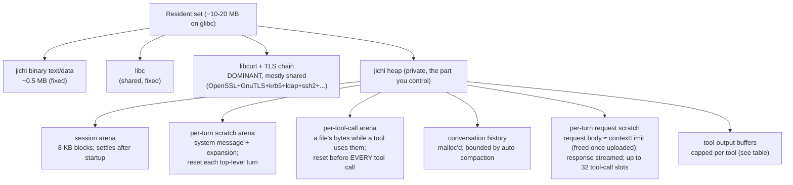
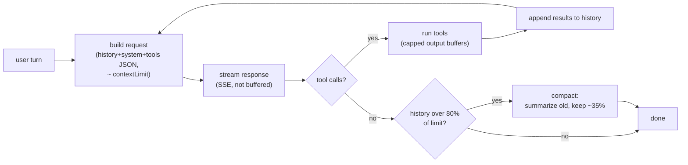
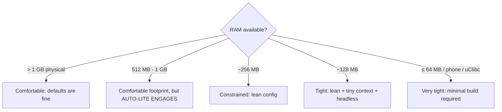

# Running jichi on low-RAM / embedded systems

This guide is for putting `jichi` on small machines — a low-end VPS, a
Raspberry Pi, an embedded board, or a phone (Termux / proot) — where it talks to
a language model **over the network** (no local model server) and still does the
full job: tool calling, code edits, tests, the lot.

It complements [`INSTALL.md`](INSTALL.md) (requirements + install) and
[`DEPLOYMENT.md`](DEPLOYMENT.md) §3 (the lean config and disk hygiene). Here we go
deeper on **RAM specifically**: where the bytes actually go, how small you can
make the footprint, and the build-time choices that matter most.

## TL;DR — the numbers

The agent's own code is tiny. The footprint floor is **libcurl and its TLS
stack**, not jichi.

| What | Size (`make SIZE=1`, glibc x86-64) |
| --- | --- |
| `jichi` binary on disk | **~1,027 KB** (text-dominated) |
| Peak RSS, `--version` | **~9 MB** |
| Peak RSS, `map` (offline file walk) | **~11 MB** |
| Peak RSS, `doctor` (opens TLS to probe servers) | **~16 MB** |
| Shared libraries pulled in (`ldd`) | **34** |

> Measured on the size-optimized build (`make SIZE=1`: `-Os` + section GC +
> strip), first at M220 and **re-measured 2026-08-01** (M230 prep): the
> figures held within a few KB across the M221–M229 code growth. Fresh
> numbers on the 4.9 GB reference box: `SIZE=1` **1,027 KB** on disk
> (`SIZE=1 LTO=1` shaves ~28 KB → **999 KB**; the default no-`-O` build is
> **1,466 KB**), `--version` peak RSS **8.6–8.9 MB** (SIZE=1 / native). The
> RSS figures are dominated by shared library code, so they barely move
> between build flavors.
>
> **Re-measured again at M259 (2026-08-02, dev box, gcc):** `SIZE=1` **1,034 KB**,
> default no-`-O` build **1,478 KB** — **+7 KB and +12 KB** across the whole
> M230–M259 span (the graded course families, twelve domain benches, type-ahead).
> The binary budget has effectively not moved, which is the M252 decision paying
> off in the place it was made for: the domain scaffold packs ship in `examples/`
> as copy-to-use files rather than compiled-in tables, precisely so this line
> would stay flat. (This also closes the "re-measure the SIZE=1 numbers"
> leftover carried since the M220 plan.)
>
> ---
>
> **MEASURED RAM FLOORS (M265, 2026-08-02, the 4.9 GB / 3-core reference box,
> cgroup v2 `MemoryMax` with swap disabled).** These replace design intent with
> numbers. Each is the lowest ceiling at which the work still *completes* —
> verified by its output, not by an exit code:
>
> | Workload | Floor | Note |
> |---|---:|---|
> | one headless turn (model call + tool call + answer) | **2 MB** | 1 MB is OOM-killed |
> | `jichi doctor` (offline subcommand) | **5 MB** | *higher than a real turn* — see below |
> | the unit suite (9,693 checks) | **16 MB** | |
> | the whole smoke tier (93 drivers, forking jichi + mock + PTY) | **≤32 MB** | passes at 32 MB; not bisected lower |
>
> Three things worth reading twice. **A turn needs less RAM than the diagnostic
> that inspects it** (2 MB vs 5 MB) — `doctor` builds its report in anonymous
> memory, which cannot be evicted, while a turn's footprint is dominated by
> file-backed pages the kernel can drop and re-fault. **Constraint costs almost
> nothing here — for a single turn:** the same turn takes 0.13 s at a 3 MB ceiling
> versus 0.11 s unconstrained, with **0 major faults** — it is genuinely usable at
> the floor, not merely alive. *(That is a property of one turn, not of constraint
> in general. Measured 2026-08-13: the whole smoke tier at its own floor takes
> roughly **twice** its unconstrained wall clock.)* And **`SIZE=1` does not lower the floor** (5 MB either way),
> which confirms the paragraph above: the resident set is shared-library code,
> not jichi's text.
>
> Re-measure with `size jichi` and
> `/usr/bin/time -v ./jichi <cmd>` (the "Maximum resident set size" line).
>
> ---
>
> **MEASURED TARGET ROWS (M272, 2026-08-03, run from threadwork; same per-run
> runbook as every row above).** The first physical board, and the two
> whole-VM rows the plan deferred to a `/dev/kvm` host:
>
> | Target | `make WERROR=1` | `make check-target` | peak RSS (`--version` / `doctor`) |
> |---|---:|---|---|
> | **Raspberry Pi Zero 2 W** — quad A53, 512 MB (415 MB visible), aarch64, Debian 13, SD card, USB-gadget networking | 110 s | **green** — 9,722 checks + 94 smoke drivers, `JC_SMOKE_TIMEOUT_MULT=28` | 8.9 MB / 16.3 MB |
> | **the same board, 32-bit** — `armv7l`, `LONG_BIT=32`, armhf Raspbian 13 (M276) | 101 s | **green** — 9,731 checks + 95 smoke drivers, measured `JC_SMOKE_TIMEOUT_MULT=26` | **6.9 MB / 13.1 MB** |
> | **Arduino UNO Q** ("sybila") — quad A53 Qualcomm SoC, **3669 MB (4 GB variant)**, aarch64, Debian 13, eMMC, USB-C dongle Ethernet (M282) | **73 s** | **green** — 9,770 checks + 96 smoke drivers, measured `JC_SMOKE_TIMEOUT_MULT=19` | **8.5 MB** (`/context`) / **15.3 MB** (`doctor`) |
> | **V2e: Debian 12 VM** — 256 MB, 1 core, KVM `-cpu host` | 4 s *at the 256 MB ceiling* | **green** — 9,731 checks + smoke OK (95 drivers), measured mult 2 | 8.8 MB (`/context` resident) |
> | **V2f: Debian 9 VM** — 512 MB, kernel 4.9, gcc 6 / glibc 2.24 / git 2.11 / libcurl 7.52, KVM `-cpu IvyBridge` (`TIERV_CPU`; 4.9 panics under `-cpu host` on 2026 silicon) | 2 s | **green (M273)** — 9,731 checks + smoke OK (95 drivers), at the *measured* multiplier, after three product fixes proven in-row: `git_stash` on git 2.11, the `spawn_parallel` worktree leak on git < 2.17, and `Expect: 100-continue` (M273). Yesterday's `turn_scratch` "wedge" was mockmodel's own unscaled 120 s watchdog, reached because each model call idled a second in libcurl; that driver now runs in **2.1 s, down from 200 s**. | — |
>
> **The UNO Q row is the first non-Raspberry-Pi arm64 board, and it is the one
> where the Comfortable tier was *measured* rather than prescribed.** With
> 3669 MB, **auto-lite does not engage** (no low-RAM notice; `doctor` reports
> `4 core(s), 3669 MB RAM` and tool profile **full**) — the M272 tri-state
> leaves the normal profile in place, which is what the plan asked to verify on
> a 2–4 GB device instead of assuming. The same board still passes the **unit
> suite and a full mock `--auto` turn under `MemoryMax=256M`**, so the
> Constrained-tier claim holds here too. Its `SIZE=1` binary is
> **byte-identical** to the Pi Zero 2 W's aarch64 build (1,052,248 B), while the
> build is **1.5x faster** (73 s vs 110 s) — eMMC and ~2.3 GB of free RAM rather
> than a microSD card and ~280 MB, which is also why its multiplier is 19 rather
> than 28. Live half: `doctor --live` confirmed **native tool calling** (104 real
> prompt tokens) and one `--auto --budget-tokens 50k` turn read two files and
> answered correctly on 9k tokens, against a threadwork-hosted model reached
> through the dongle's Ethernet.
>
> *Method note, since it differs from the Pi rows:* this image ships no
> `/usr/bin/time`, so the resident figure is jichi's own `/context` line and the
> `doctor` peak was measured by polling `/proc/<pid>/VmHWM`. Different
> instrument, same quantity — recorded rather than silently mixed.
>
> **The 32-bit row is the one that closes a standing question, not just adds a
> number.** `SIZE=1` is **770 KB** there against aarch64's 1.05 MB, both RSS
> peaks are ~20% lower, and the whole suite passes where `long` is four bytes --
> so the `%lu`-with-casts convention, the 64 MB read cap's `jc_size`/`long`
> boundary, index mtimes and the session store are *measured* on 32-bit rather
> than inferred from a cross-compile that only proved it links. The `-Werror`
> build raised no format or width warning either. Same board, same card slot,
> one re-flash apart, so the two rows differ in word size and almost nothing
> else.
>
> Two of these are claims-turned-measurements: the Zero 2 W also completes
> the **unit suite and a full mock `--auto` turn under `MemoryMax=256M`
> `MemorySwapMax=0`** — the Constrained tier on real silicon — and V2e
> **builds jichi with gcc inside the 256 MB machine**, no provisioning
> fallback needed. The Zero 2 W's multiplier (28) is the number that board
> exists to produce: SD-card I/O plus A53 cores against x86-calibrated
> timeouts. The board also ran the live half: `doctor --live` observed native
> tool calling against a threadwork-hosted model over USB-gadget networking,
> then a real `--auto --budget-tokens 50k` turn (2 tool calls, correct
> answer, 4.5k tokens). Details + bring-up findings:
> `docs/plans/2026-07-hardware-testing.md` (Tier B first-session record).

So a headless networked turn on a stock dynamically-linked build lives in roughly
**10–17 MB RSS**. Almost all of that is **shared, read-only library code** —
mostly libcurl's TLS/crypto/auth dependencies. jichi's *own* heap (the arena +
conversation history) is a few MB at most for a typical session. A
single-TLS-backend, statically-linked **musl** build with `-Os` and `strip` can
bring the resident set down toward **single-digit MB**.

If you only want the recipe, jump to [RAM-budget tiers](#ram-budget-tiers).

> **One-flag lean mode.** `--lite` (alias `--low-memory`, or `"lowResource": true`
> in config) applies the whole lean bundle at once — `snapshots`, `repoMap`,
> `references`, `markdown`, `craft` off; `maxParallelAgents 1`; `maxSubagentDepth 0`;
> `contextLimit 16384`; fewer tool iters/retries; smaller tool-output caps — while
> any explicit config key still wins. It's the quickest way to get the
> Constrained/Tight tiers below. Together with the **per-turn scratch arena**
> (M20a) and the **`make SIZE=1`** size build (M20d), this is the implemented
> [low-resource design (ROADMAP M20)](ROADMAP.md#m20--optional-low-resource-mode--done).

## Every hardware and platform test, in one place

This section is the **overview**; the prose further down explains the mechanisms. If you
are deciding whether jichi will run on *your* machine, read this and stop.

### How to read these tables — three caveats that change what a number means

Skipping these will make you compare things that are not comparable.

1. **A timeout multiplier is a ratio, and the denominator changed.** `JC_SMOKE_TIMEOUT_MULT`
   is `ceil(device build seconds ÷ reference-host build seconds)`. Rows up to **M430** divide
   by **threadwork's 4.00 s**; rows from **M451** divide by a second bench's **6.19 s**
   (a Ryzen 9 3900X). The same board therefore has *two different correct multipliers*.
   Both terms are given below so you can re-derive either.
2. **Footprint depends on the instrument.** `/usr/bin/time -v` reports an exact peak.
   Where an image lacks it, the rig polls `/proc/<pid>/VmHWM`, which **can miss the peak
   of a fast command**: the UNO Q's polled `--version` reads 5,444 KB against the Pi 400's
   exactly-measured 9,536 KB. Those two numbers **must not be compared**. The instrument
   is named in every row.
3. **Two RAM floors are partly filesystem measurements.** `tests/test_bounds.c` writes a
   64 MiB fixture; where `/tmp` is tmpfs those pages are charged to the cgroup. That is
   why the `units` floor reads **72 MB** on one bench and **14 MB** on another. Since
   M457 the location follows `$TMPDIR`, so it is now a deliberate choice rather than an
   accident of where you happen to run.

### Physical devices — the full `make check-target` gate

Every row is a real board, run by a person, with the numbers written down. "Gate" is
unit checks + smoke drivers; the suite grew over time, so **check counts are not
comparable across milestones** — a green gate is the claim, not the count.

| Device | Arch / SoC | RAM presented | `doctor` tier | OS, compiler | Build | Multiplier | Gate | RSS `--version` / `doctor` | Instrument | Milestone |
|---|---|---:|---|---|---:|---:|---|---:|---|---|
| **Raspberry Pi Zero 2 W** | aarch64, quad A53 | 415 MB | — | Debian 13 | 110 s | **28** (÷4.00 s) | 9,722 + 94 | 8.9 / 16.3 MB | — | M272 |
| **Raspberry Pi Zero 2 W**, re-flashed | armhf `armv7l`, `LONG_BIT=32` | 415 MB | — | Raspbian 13 | 101 s | **26** (÷4.00 s) | 9,731 + 95 | 6.9 / 13.1 MB | — | M276 |
| **Raspberry Pi Zero 2 W**, re-anchored | armhf `armv7l` | 425 MB | `minimal (lite)`, profile **core** | Raspbian 13, gcc 14.2.0, glibc 2.41 | 64.2 s | **11** (÷6.19 s) | 11,595 + 194 | 7,432 / 14,168 KB | `time -v` | M454 |
| **Arduino UNO Q** ("sybila") | aarch64, quad A53 Qualcomm | 3669 MB | normal, profile **full** | Debian 13 | 73 s | **19** (÷4.00 s) | 9,770 + 96 | 8.5 / 15.3 MB | polled | M282 |
| **Arduino UNO Q**, re-anchored | aarch64, kernel 6.16.7 | 3669 MB | normal | Debian | 46.5 s | **8** (÷6.19 s) | 11,595 + 194 | 5,444 / 16,208 KB | **polled** | M455 |
| **Raspberry Pi 400** — first Cortex-A72 | aarch64, quad A72 | 3795 MB | normal, profile **full** | Debian 13 trixie, gcc 14.2.0, glibc 2.41 | 26.6 s | **5** (÷6.19 s) | 11,593 + 194 | 9,536 / 17,248 KB | `time -v` | M451 |

**Two boards were re-measured on a second bench and both got ~1.57× faster** (UNO Q
73 s → 46.5 s; Zero 2 101 s → 64.2 s) on a *larger* tree. Two different SoCs improving by
the same ratio points at the toolchain rather than the hardware — recorded as an
observation, not a conclusion.

### Android — five rows, and they answer five different questions

| Device | Android | Arch | libc under test | RAM presented | `doctor` tier | Result | Milestone |
|---|---|---|---|---:|---|---|---|
| **Archos 101b Copper** (2013) | 4.4.2 (SDK 19) | armv7 | static **musl** (bypasses the platform libc) | 965 MB | `lite auto-enabled` | jichi **runs**: `--version`, `describe`, `context`, `map`, `doctor`. Suite: see below | M452, M457 |
| **Lenovo TB336FU** | 16 (SDK 36) | arm64 | **bionic**, the platform libc | 7807 MB | normal | **11,537 unit checks / 0 failures** | M456 |
| **Lenovo TB336FU / Termux** | 16 (SDK 36) | arm64 | **bionic**, on-device clang 21 + Termux libcurl | 7807 MB | normal | **11,620 checks / 0** and the **full smoke tier, 194 drivers / 1027 checks** | M459 |
| **Lenovo TB336FU / proot-distro** | 16 (SDK 36) | arm64 | **glibc 2.41** (Debian 13, gcc 14.2) on the Android kernel | 7807 MB | normal | **11,625 checks / 0**, smoke **196 drivers / 1038 checks** | M459 |
| **Motorola moto g(30)** — a **phone** | 12 (SDK 31) | arm64 | **bionic**, NDK cross-build, `HAVE_CURL=` | 3725 MB | normal (no lite: the threshold is 1024 MB) | M461: **11,571 checks / 0**. Re-run M507: **12,499 checks / 0**, all four offline surfaces, and the **first smoke driver on a phone** (`smoke_lint` 17/17, 9m35s vs 7.8s on the bench). One check was **flaky** here — a wall-clock bound read on the wrong clock, **fixed at M507**, see below | M461, M507 |

The M456 row and the Termux row look similar and are **not the same claim**. M456
cross-compiled with the NDK on a workstation and pushed the binary over `adb`; the Termux
row compiled jichi **on the device**, with Termux's own clang and libcurl, in Termux's
non-FHS `$PREFIX`. The first says the bionic ABI works. The second says the whole
toolchain, build and test story works in the layout a real phone or tablet user has — and
it is the first time the **complete portable gate** (`make check-target` = unit suite +
smoke tier) has run on Android at all.

Four things a reader needs from these rows:

- **bionic requires `-std=gnu89`, not the usual `-std=c89`.** Not because of jichi's code —
  that builds with **zero diagnostics** — but because Android's kernel UAPI headers use
  `inline`, which C89 does not have (`linux/in.h` → `asm/byteorder.h` → `linux/swab.h`).
- **`/tmp` is not an Android constant.** 4.4 has none; 16 has a writable one. A claim that
  "Android has no `/tmp`" was published at M452 and **corrected at M456**.
- **Under `proot-distro` you are root, and jichi refuses the unattended posture.** proot
  fakes uid 0 in userspace, so `privilegedCommands: deny` cannot mean anything and
  `doctor --unattended` fails the posture on purpose. That is correct, and it decides the
  rollout shape: **for unattended work on Android use native Termux**, which runs as an
  app uid; proot is for interactive use and for the second libc.
- **proot costs about 2.6x.** Same device, same source, same day: the native Termux build
  took 42.8 s (multiplier **7**) and the proot build 109.4 s (multiplier **18**). That is
  the price of userspace syscall interception, measured rather than assumed.
- **On a platform with no `/bin/sh`, tests that shell out cannot pass.** On the 4.4 tablet
  that is 47 checks, because musl's `system()` invokes `/bin/sh` and Android's shell is
  `/system/bin/sh`. Since M457 the suite **runs to completion and reports them as reds**;
  before it aborted at the 4th of 123 files and said nothing about the rest.

- **Every wall-clock number measured on a dozing handset is wrong, and nothing says so.**
  Android suspends with the screen off, and `/proc/uptime` does not count suspended time —
  so `ps` `ETIME` under-reports and `time`'s real-seconds figure silently includes an idle
  gap. Measured on the moto g(30): 200 process spawns cost **112 ms each** while dozing and
  **22 ms each** held awake with `dumpsys deviceidle disable` — a **5x phantom** that would
  otherwise be published as a property of the silicon. The tell is wall clock far exceeding
  CPU. `svc power stayon true` does not help when the device cannot charge, and even
  `deviceidle disable` lapses: check `dumpsys power | grep mWakefulness=` **after** the run.
  Full account: [`PLATFORMS.md`](PLATFORMS.md#measuring-on-a-phone-doze-makes-every-wall-clock-number-wrong-m507).

### Virtual machines and emulated targets

No hardware needed; these are the cheap rows, and historically the ones that found bugs.

| Row | Target | What it proves | Result | Milestone |
|---|---|---|---|---|
| **V0** | aarch64 static musl under `qemu-user-static` | the aarch64 binary runs | 9,693 checks; **re-run 11,593 in 8.6 s** | M266, M447 |
| **V3** | **s390x, big-endian** | byte-order assumptions; the index cache's endian tag | passes — executed a branch that was dead on every LE machine | M266 |
| **V4** | x86 32-bit (ILP32) | word-size assumptions | passes | M266 |
| **V5** | Alpine / musl container | the `malloc_trim` probe decision | passes, 1 finding | M266 |
| **V2a** | CentOS 7 — gcc 4.8.5, glibc 2.17, make 3.82 | the oldest realistic toolchain | passes **after 3 fixes** | M265 |
| **V2e** | Debian 12 VM, **256 MB, 1 core** | a whole small machine | gcc builds the tree *inside* the ceiling | M272 |
| **V2f** | Debian 9 VM, kernel 4.9 | old kernel + old glibc + git 2.11 | passes after **3 product fixes proven in-row** | M273 |
| **V2k** | Debian 12 VM, **160 MB** | the lowest a stock image survives | full gate green; **panics at 128 MB** | M430 |
| **tiny** | kernel + busybox initramfs, no distro | jichi on a machine below a distro's boot floor | offline surfaces at **64 MB**, a verified model turn at **80 MB** | M430 |
| **presented-RAM** | qemu `-m 768` and `-m 1024` | what the kernel actually hands userspace | 768 → **721 MB**; 1024 → **973 MB** | M448 |
| **Guix container** | `guix shell -C` — glibc but **non-FHS** | no `/usr`, store-path `pkg-config` | **11,592 checks / 0 failures** | M450 |
| **Guix System, headless** | a real `guix system image` VM under KVM — sshd + serial console | the non-FHS axis on a **whole system**, not a namespace | **11,599 checks / 0 failures**; all offline surfaces OK; **one smoke driver deadlocks** (see below) | M458 |
| **uClibc** | Bootlin buildroot toolchain, native x86-64 | a third libc, no emulation | **11,593 / 0**, zero diagnostics | M449 |

### Guix System — what a non-FHS distribution actually costs you

Guix keeps **exactly two FHS paths**, and everything else lives in `/gnu/store`:

| Path | Guix System | Consequence for jichi |
|---|---|---|
| `/bin` | contains **only `sh`** | jichi's 16 hardcoded `execl("/bin/sh", ...)` sites are **fine** |
| `/usr/bin` | contains **only `env`** | nothing in `src/` references `/usr/bin`, so nothing breaks |
| `/sbin`, `/lib` | **absent** | — |
| `cc`, `c99` | **absent** — only `gcc` | **`make` fails immediately.** See below |

> **You must pass `CC=gcc` on Guix, and the failure mode is worse than it sounds.**
> jichi's Makefile uses `CC ?= cc`, and POSIX specifies `c99`, not `cc` — Guix ships
> neither. Without an override the compiler is missing, so **every capability probe
> fails and reports "absent"**: `make info` announces no vsnprintf, no libcurl, no
> `malloc_trim` and no `clock_gettime`. A missing *compiler* is reported as missing
> *features*, which is a far more misleading row than an honest "no compiler". The `?=`
> is already the right choice — an environment `CC=gcc` wins — so the fix is
> `CC=gcc make`, and `scripts/tier-b-device.sh --cc gcc` does it for a device row (M458).

**One open finding.** `tests/smoke/parallel_abort.sh` **deadlocks on Guix System**: after
SIGINT the parent does not exit. Two things it is *not*: it is not a timeout artefact
(it fails identically at `JC_SMOKE_TIMEOUT_MULT` 1 and 6), and it is not the missing
process groups that explain the container's failure (`pgrp` is a normal non-zero value on
the real system). The unit suite passes 11,599 / 0, so it is isolated to the parallel
abort/reaping path. Recorded rather than explained — see M458.

### libc coverage

| libc | State | Evidence | Milestone |
|---|---|---|---|
| **glibc** | **Verified** | every board and VM row above | — |
| **musl** | **Verified** | static builds, x86-64 and aarch64 under binfmt | M266 |
| **uClibc** | **Verified** | Bootlin buildroot toolchain, native, `--version` RSS **384 KB**, 0 shared libs | M449 |
| **bionic** | **Verified** | Android 16. Cross-built with the NDK (M456) **and** built on-device by Termux's clang 21 with the full gate green (M459); needs `-std=gnu89` | M456, M459 |
| **glibc on an Android kernel** | **Verified** | Debian 13 under `proot-distro`, gcc 14.2 / glibc 2.41 — a second, entirely different userland on the same silicon | M459 |
| **Guix (glibc, non-FHS)** | **Verified for the unit suite** | 11,599 checks / 0 failures on a **headless Guix System** VM (gcc 10.3.0, glibc 2.33), and 11,592 in a `guix shell -C` container. `make check-target` completes except **`parallel_abort`**, which deadlocks there and is an open finding, not a timing artefact | M450, M458 |

### RAM tiers — what the code actually does, on hardware

The threshold is **presented** RAM, not nominal, and it is `< 1024 MB`. All three bands
now have physical evidence:

| Device | Presented | `doctor` reports | Tool profile | Milestone |
|---|---:|---|---|---|
| Raspberry Pi Zero 2 W | 425 MB | `tier: minimal (lite)` | core | M454 |
| Archos tablet | 965 MB | `tier: lite auto-enabled` | — | M452 |
| Raspberry Pi 400 | 3795 MB | *(no suffix — normal)* | full | M451 |

> **A nominally-1 GB machine never reaches the normal tier.** A guest given 1024 MB
> presents **973 MB**; the kernel keeps the rest. So a Pi 3B, a Pi 3B+ and a 1 GB VPS are
> all auto-lite hosts. Override with `--no-lite` or `"lowResource": false` (M448).

### What is NOT tested — the honest gaps

| Gap | State | Why |
|---|---|---|
| **macOS / Darwin** | Never compiled | No Mac on this project |
| **Windows + WSL2** | **Verified — the full gate** (M475) | 12,418 unit checks under gcc and clang, smoke 209 drivers at multiplier **1**, and `make ci` green in 10m34s. `/mnt/c` is the one subsystem that really differs: the same commit reads 0 modified on ext4 and **1,639 modified** through v9fs, from line-ending translation |
| **FreeBSD** | **Verified — the full gate** (M465) | 11,643 unit checks + smoke OK (201 drivers, 1068 checks), 0 failures. The one stop was a harness defect: an assignment prefixed to a shell function is not exported to its children on FreeBSD's `/bin/sh` |
| **OpenBSD** | **Partly verified** | M461: builds clean first try, 11,626 unit checks green. Smoke reaches the `accessible` driver; that stop is explained (a fixed pre-send delay loses a race with startup) but the row has not been re-run since. See [`PLATFORMS.md`](PLATFORMS.md) |
| **NetBSD 10.1 amd64** | Verified — the full gate (M480) | `scripts/tier-v-netbsd.sh`, from the vendor live image under KVM. Build clean in 7 s, 12,416 unit checks / 0 failures, smoke 209 of 209 drivers / 1,109 checks. **The only non-Linux row that can run `child_fds.sh`** — it has procfs, so M472's descriptor fence is verified rather than assumed |
| **illumos / Solaris** | Never compiled | Now the cheapest remaining row. illumos is free and ISO-installable under KVM; its procfs exists but differs (`/proc/self/status` is a binary `pstatus_t`) |
| **Termux / proot-distro** | **Verified on a tablet** (M459); a phone runs jichi (M461) | Both userland rows are green on a Lenovo TB336FU (Android 16). A **Motorola moto g(30)** (Android 12) then ran the unit suite and the offline surfaces, so "never run on a phone" no longer holds. Still open, and narrower: **Termux on a phone** — no on-device toolchain is installed on that handset, so the build-it-on-the-device claim remains tablet-only. Re-confirmed at **M507** (12,499 checks / 0) and narrowed once more: the **first smoke driver** has now run on a phone, so what is unrun is the rest of the tier |
| **armv6** | Never run | armv7 and aarch64 are covered; armv6 is named nowhere |
| **Kinetic / motor rungs** | Deliberately human-gated | A person must be on the physical E-stop; see [`ROBOTICS_BRINGLIST.md`](ROBOTICS_BRINGLIST.md) |

## Where the RAM goes



**The libcurl chain is the floor.** `ldd jichi` on a typical desktop shows
libcurl dragging in *both* OpenSSL (`libssl`, `libcrypto`) **and** GnuTLS
(`libgnutls`, `nettle`, `hogweed`, `gmp`), plus `libgssapi_krb5`, `libldap`,
`liblber`, `librtmp`, `libssh2`, `libnghttp2`, `libpsl`, `libidn2`, `libzstd`,
`libbrotlidec`, `libsasl2`, `libp11-kit`, and more. These pages are read-only and
shared between processes, so they cost less than the RSS number suggests on a
multi-process host — but on a single-purpose small device the RSS *is* what has to
fit. Shrinking this chain (a minimal libcurl) is the single biggest lever; see
[Build-time footprint reduction](#build-time-footprint-reduction).

**jichi's own heap is small and mostly bounded.** What grows it:

- *Per turn:* the request body (a JSON serialization of the whole history +
  system prompt + tool schemas) is built in RAM and scales with `contextLimit`,
  but is **freed as soon as it is uploaded** (it is not held while the response
  streams back); the **response is streamed** (SSE, callback-driven — never
  buffered whole); the provider holds at most `JC_PROV_MAX_CALLS = 32` in-progress
  tool-call slots.
- *Per tool call:* each tool's output is captured into a bounded buffer, then
  appended to the history. The caps:

| Tool | Output cap |
| --- | --- |
| `read_file` | 256 KB |
| `fetch_url` | 128 KB |
| `run_terminal_command`, `run_tests`, `search_code` | 64 KB each |
| `git_*` | 32 KB |
| user-defined tools | 32 KB |
| `spawn_parallel` per-agent answer | 16 KB |

- *Over the session:* the conversation history (see the next section).

## The memory model (accurate)

Three facts matter for a long-running session:

**1. Three arenas (bump allocators, `JC_ARENA_DEFAULT_BLOCK = 8192` — 8 KB
blocks), one per lifetime.** The **session arena** holds startup-loaded,
long-lived data (config, rules, the repo map, skill/command/agent definitions,
session id); it is created once and freed at exit, so it settles after startup and
is not where a long chat's bulk lives. The **per-turn scratch arena** holds
transient allocations (the system message, command/`@`-reference expansion, and
anything that must survive a nested subagent run) and is **reset at the start of
each top-level turn** (ROADMAP M20a). The **per-tool-call arena** (M199) holds a
file's bytes while a tool formats, matches or uploads them, and is **reset before
every tool call** — necessary because a single turn is up to `maxToolIters` calls,
forced to ≥200 under a verify gate, so per-turn reset alone left a read-heavy
`--auto` turn peaking tens of MB above baseline (measured 55 MB → 15 MB).

> The rule for contributors: **pick the shortest lifetime that outlives the
> data.** `tests/smoke/arena_lint.sh` enforces it across the tool, LSP, TUI,
> chat, provider, net, session and index layers (M218).

> Earlier wording in INSTALL.md/DEPLOYMENT.md described "one arena per turn, freed
> between turns." The accurate model is the session-arena + per-turn-scratch split
> above.

Since M140 the arenas are **observable and kept honest**: `/context` (and the
`context` subcommand) report each arena's used/reserved bytes via
`jc_arena_used`; the repo-map scan reads file texts into a build-local arena
freed when the map is rendered (previously ~the whole source tree stayed on the
session arena for the process lifetime); compaction's intermediates
(summaries, the kept-message copy) go to the per-turn scratch arena instead of
creeping onto the session arena once per compaction; and sessions are saved
**unformatted**, roughly halving both the save-time string spike and the
on-disk file. M197–M199 finished the job: listing sessions and every tool file
read now use a shorter-lived arena, so neither the size of
`~/.jichi.d/sessions` nor the number of files a turn reads costs resident
memory. **Note that no leak checker can see this class of bug** — ASan and
`valgrind --leak-check` both report zero when memory is reachable until exit —
so use `/context`, massif's peak, or a footprint assertion.

**Malloc tunables (M218).** Even with every arena and buffer balanced, the
*pattern* of the request path is hostile to glibc's defaults: each model call —
and each retry, since the body is rebuilt per attempt — allocates and frees
~3× the request text (hundreds of KB at long-context inputs), thousands of
times in a marathon session. Freeing an mmap'd chunk ratchets glibc's
*dynamic* mmap threshold upward, after which those bodies come from `brk`,
whose high-water never returns to the OS on its own — RSS that only grows
while every leak checker reads zero and `/context` shows near-empty arenas.
When the libc provides them (Makefile probe `HAVE_MALLOC_TRIM`, shown by
`make info`; glibc yes, musl no-op), jichi pins `M_MMAP_THRESHOLD` at 128 KB
at startup (disabling the ratchet — large transient bodies always
mmap/munmap) and sweeps free heap back with `malloc_trim` at top-level turn
boundaries and after a between-turn compaction (`src/util/jc_memtrim.c`).
Measured on the retry soak profile (25 turns, 2 injected failures/call,
~0.4 MB history): last-RSS 13,224 → 12,596 KB, per-turn slope 28.3 → 9.7 KB,
and the in-run curve now *decreases* after compaction instead of staircasing.
The cost — one syscall + page faults per ≥128 KB allocation — is noise next
to an HTTPS round-trip.

**2. History is the real growth point — and it is bounded.** Messages are
`malloc`'d (not arena-backed), so they can be freed independently. **Auto-compaction**
(`src/chat/jc_compact.c`) keeps a long session inside the context budget:

- Token estimate is a byte heuristic: `BYTES_PER_TOKEN = 4`.
- When `estimate + ~2000 (system/tools allowance)` exceeds **80%** of the limit
  (`limit * 4/5`), jichi summarizes the old prefix with one model call and keeps
  only the recent **~35%** (`limit * 7/20`) as a tail, dropping the rest from RAM.
- The limit is `contextLimit` (top-level) → the active model's `contextLength` →
  the built-in default **32000** tokens.

So **`contextLimit` is your main RAM dial for the heap**: it bounds both the
request body built each turn and how much history is retained before compaction
folds it away. Lower it and both shrink.

**3. The codebase index (when an `embed` model is configured).** Resident cost
is ~`count × dim × 4` bytes of vectors plus every chunk's text (~9 MB at
2000 × 768). Since M141: when the on-disk cache is fully clean the vectors are
**`mmap`'d read-only** — file-backed pages the OS can evict under pressure and
share COW across `spawn_parallel` forks — and the byte-identical cache rewrite
is skipped; in **`--lite`** the index is additionally **freed after each
search** (rebuilt from cache on the next one, like the docs index), so nothing
stays resident between searches.



## RAM-budget tiers

Pick the row that matches your device, then apply the config + flags below it.
Each tier builds on the previous one.

> **Read the second row before you assume the first one is yours (M448).** The
> tiers below describe jichi's *footprint*, and by that measure ≥512 MB really is
> comfortable. But `jc_resource_tier` (`src/platform/jc_platform_posix.c`) enables
> the **lite profile automatically below 1024 MB**, and that threshold is
> deliberate — `tests/test_setup.c` pins `512 → LITE` and `1023 → LITE`. So a
> machine in the 512 MB–1 GB band silently runs *without* snapshots, `/undo`,
> the repo map, references or markdown, with `contextLimit` 16384 and one
> parallel agent. Nothing is wrong with that default; what was wrong was this
> page telling you defaults applied.
>
> **And "1 GB" does not clear the bar.** Measured 2026-08-15 on the tiny-guest
> rig: a machine given **1024 MB presents 973 MB** to userspace, and one given
> **768 MB presents 721 MB** — the kernel reserves the difference. Since the test
> is `mb < 1024` against *presented* RAM, **no nominally-1 GB machine reaches
> `JC_RES_NORMAL`**. A Pi 3B, a Pi 3B+ and a 1 GB VPS are all auto-lite hosts.
> To get the full defaults you need **more than 1 GB physical**. The 1024 MB row
> was measured under TCG and then re-measured under KVM once the bench had
> hardware virtualisation: **973 MB both times**, so the figure is a property of
> the kernel's reservation and not of the accelerator.
>
> Override either way with `--no-lite` / `"lowResource": false` (an explicit key
> vetoes the auto-detection, M272), and check which you got: `doctor`'s
> **machine profile** line names the tier.



### How much of this has been verified (M403)

**Three grades of evidence, and they are not interchangeable.** Every tier below
is tagged with the grade it has, because "jichi runs in 64 MB" and "jichi's turn
completed under a 64 MB cgroup ceiling on a 4.9 GB workstation" are different
claims, and only one of them has been made.

| Grade | What it means | Why it is weaker than the next one up |
|---|---|---|
| **A — real machine** | A device with that much *physical* RAM ran the work | — |
| **B — cgroup ceiling** | `MemoryMax` on a big box, swap off, output verified | The host page cache still holds libcurl and the TLS chain, so evicted file pages re-fault from RAM, not from slow flash; the kernel's own footprint is *outside* the ceiling; nothing else on the machine competes. **A grade-B floor is a lower bound for a real machine of that size.** |
| **C — advice** | Reasoned from the code and the dependency tree | Nobody has run it |

| Tier | Grade | Evidence |
|---|---|---|
| ≥ 512 MB | **A** | the development box; two ARM boards (M272/M276/M282) |
| ~256 MB | **A** | Debian 12, one core, whole VM (M272/M273); a Pi Zero 2 W turn under `MemoryMax=256M` |
| ~128 MB | **A at 160 MB; the tier as written is unreachable with a distro** | M430: a 160 MB whole VM passes the entire gate. A stock Debian 12 cloud image **cannot boot at 128 MB** — the kernel reserves 59,592K of the 130,516K it sees and panics unpacking its own initrd. Below 160 MB, use the minimal guest |
| ≤ 64 MB | **A for the work on a minimal guest; the recipe is now BUILT** | M430: offline surfaces at **64 MB**, a verified model turn at **80 MB**, on a kernel + busybox + static-jichi guest; jichi's own peak 1,160 / 1,396 KB. The tier's minimal-libcurl recipe exists and is measured — see the tables below |
| uClibc | **A for the compile and the unit suite** | M449: a Bootlin buildroot toolchain, native x86-64, **11,593 checks / 0 failures**, zero diagnostics. Curl-free, so no model call; and **no smoke tier ran**, so this is not a `check-target` row. It closes the *compile* half of the reach claim, not the *machine* half — a ≤64 MB uClibc box is still unmeasured |
| a tablet (Termux/proot) | **A** | both userlands verified on a Lenovo TB336FU: full gate green natively (bionic) and under proot (glibc), M459 |
| a **phone** specifically | **A for the unit suite + offline surfaces** | M461: a Motorola moto g(30), Android 12 (SDK 31), arm64-v8a. The residue is narrower than "never run": no Termux is installed on it, so the **on-device-toolchain** claim is still tablet-only. **M507** re-ran the row over wireless debugging (the handset's USB port is dead), lifted the count to **12,499 / 0**, and got `smoke_lint` — one driver of the tier — green in 9m35s |

**Grade-B floors, re-measured 2026-08-12** on the 4.9 GB / 3-core box (cgroup v2,
`MemorySwapMax=0`, completion verified by the *answer text*, never by an exit
code). Reproduce with `tests/measure/ram_floor.sh`:

| Workload | Floor now | M265 (2026-08-02) |
|---|---:|---:|
| one headless turn — model call, tool call, answer (`--lite`, mock model) | **3 MB** (2 MB OOM-killed) | 2 MB |
| the unit suite | **14 MB** at 11,305 checks (12 MB OOM-killed) | 16 MB at 9,693 checks |

**All four workloads, on threadwork, 2026-08-13 (M430).** `ram_floor.sh` measured
only the turn until M430; the plan that asked for it wanted three floors, and they
are different numbers. `--workload turn|doctor|units|smoke`:

| Workload | Floor | Previously |
|---|---:|---|
| one headless turn | **3 MB** | 3 MB — reproduced exactly |
| `doctor` | **3 MB** | 5 MB (M265) — **not comparable**, see below |
| the unit suite (11,346 checks) | **72 MB** | 14 MB — **a filesystem difference**, see below |
| the whole smoke tier (174 drivers) | **56 MB** | ≤32 MB, "not bisected lower" |

**Two of those are filesystem measurements as much as memory ones, and whoever
quotes them must say which.** `tests/test_bounds.c` writes a session fixture of
`JC_READ_FILE_MAX + 4096` — 64 MiB + 4 KB — to prove `jc_read_file` refuses an
over-cap file, and it hardcodes `/tmp`. Where `/tmp` is **tmpfs** those pages are
charged to the cgroup. Proven with jichi entirely absent: a bare 64 MiB `dd`
survives a 72 MB ceiling on tmpfs, is OOM-killed at 64 MB, and survives 64 MB
written to a disk-backed path — disk page cache is reclaimable, tmpfs is not. So a
disk-backed `/tmp` reports jichi's working set (~14 MB) and tmpfs reports
`max(that, the fixture)`. Run `findmnt -no FSTYPE /tmp` before believing either.
**A board with a tmpfs `/tmp` needs ≥72 MB to run `make check-target` at all**,
whatever jichi itself costs; the smoke tier's isolated `HOME` is also under `/tmp`.

> **And a board with *no* `/tmp` cannot run the suite at all (M452).** The hardcoding is
> not one file: **158 literal `/tmp` paths across 35 of the 123 test files**, with no
> **Re-measured after the M457 conversion, and NEITHER FLOOR MOVED:** `units` **14 MB**,
> `smoke` **48 MB** on this ext4 bench — identical to the figures above. That is the
> expected answer and it was still worth measuring: with `TMPDIR` unset the fixtures
> still land in `/tmp`, so the default is untouched. What changed is that the location
> is now **steerable** — pointing `TMPDIR` at another filesystem moves these floors
> deliberately rather than by accident of where the suite happens to run, which is
> precisely the confound that made one bench read 72 MB and another 14 MB.
>
> `TMPDIR` fallback anywhere in `tests/`. **Android 4.4** has no `/tmp`, so the suite dies
> there while jichi itself runs fine on the same device — though **Android 16 does provide
> one**, and the suite passes 11,537 checks on it (M456), so the demonstrating cases are
> old Android and other `/tmp`-less environments rather than Android as a class. **This is the load-bearing caveat for
> the two floors above:** the fixture's location is *why* `units` reads 72 MB on a tmpfs
> bench and 14 MB on a disk-backed one, so **relocating the fixtures will move these
> numbers**. Any such change must re-measure both floors and add new stamped rows rather
> than edit these — see [`plans/2026-08-test-tmpdir.md`](plans/2026-08-test-tmpdir.md),
> whose Stage 4 exists for exactly this reason.

**And `doctor`'s footprint is dominated by your config, not by jichi.** It probes
every configured server: peak RSS is **12,388 KB** with no config against
**49,060–53,700 KB** with a real four-model one — roughly 37 MB of reachability
probing. The 3 MB floor above used a deterministic one-model config, so it and
M265's 5 MB are measuring different things, and M265's observation two paragraphs
down is neither confirmed nor refuted by it.

Full write-up, with what it does *not* license:
[`analysis/2026-08-13-ram-tiers-whole-machine.md`](analysis/2026-08-13-ram-tiers-whole-machine.md).

**All four workloads again, on a SECOND bench, 2026-08-15 (M446 session).** Measured on
`alex-X570-AORUS-MASTER` (AMD Ryzen 9 3900X, 24 threads, 32 GB, kernel 6.8, glibc 2.39,
`/` and `/tmp` both **ext4** — no separate `/tmp` mount), jichi at 11,593 checks. Same
`ram_floor.sh`, same four workloads, a different machine and a different filesystem:

| Workload | This bench (ext4 `/tmp`) | threadwork, M430 (tmpfs `/tmp`) |
|---|---:|---|
| one headless turn | **3 MB** | 3 MB — reproduced exactly |
| `doctor` | **3 MB** | 3 MB — reproduced exactly |
| the unit suite (11,593 checks) | **14 MB** | 72 MB |
| the whole smoke tier (194 drivers) | **48 MB** | 56 MB |

**This is the filesystem claim above, confirmed on independent hardware rather than
argued.** The paragraph beginning "Two of those are filesystem measurements" predicted
that a disk-backed `/tmp` reports jichi's working set (~14 MB) and tmpfs reports
`max(that, the 64 MiB fixture)`. Two benches, two filesystems, **14 MB vs 72 MB** on the
same workload — and the two floors that do *not* touch that fixture (`turn`, `doctor`)
reproduced to the megabyte across different silicon. Quote the `units` and `smoke` floors
with the filesystem named, or not at all.

*One instrument defect, recorded because it nearly entered this table.* The smoke sweep
first reported 40 MB as FAILED on `smoke_lint` — which was not memory at all but a
newly-added driver that was still failing two lint checks while the bisection ran in
another terminal. Re-run after fixing the driver, 40 MB fails with `rc=137`, a real OOM
kill. The floor was 48 MB either way; the *reason* in the first pass was wrong, and a
reason nobody re-checks is how a false row enters a table.

Both numbers moved, in opposite directions, and both are reported rather than
overwritten: a turn costs ~1 MB more than it did 140 milestones ago, the suite
~2 MB less at 17% more checks. M265's note says its suite figure was not bisected
below 16, so that one may be a finer measurement rather than a change.

**And the ≤64 MB tier's own recommendation, measured for the first time.** The
tier says: minimal single-TLS-backend libcurl, statically linked against musl,
`-Os`, stripped. The two *ends* of that recipe are now measured; the middle is
still grade C, because cross-building a minimal libcurl is the step nobody has
taken:

| | default build, system libcurl + TLS | **static musl, `SIZE=1`, no libcurl** |
|---|---:|---:|
| binary on disk | 1,654 KB | **1,051 KB** |
| shared libraries (`ldd`) | 32 | **0** |
| `--version` peak RSS | 8.6 MB | **0.5 MB** |
| `map` peak RSS | 9.8 MB | **2.0 MB** |
| `doctor` peak RSS | 14.6 MB | **4.4 MB** |
| grade-B floor for `map` | — | **2 MB**, byte-identical output (1 MB OOM-killed) |

This is the page's opening claim, in numbers: **the footprint floor is libcurl and
its TLS stack, not jichi.** Without them jichi's whole resident footprint is half
a megabyte — a 17× difference on `--version`. The honest caveat is that the musl
column *cannot make a model call at all* (`built without libcurl`), so it bounds
the recipe from below while the left column bounds it from above.

**M430 built the middle, so that range has collapsed: it is 804 KB.**
[`scripts/minimal-curl.sh`](../scripts/minimal-curl.sh) produces both rungs. Measured
on threadwork with `SIZE=1`, **curl 8.18.0 on every column** so the configuration is
the only variable, and an isolated `HOME`:

| | system libcurl | minimal libcurl | **minimal + static musl (mbedTLS)** |
|---|---:|---:|---:|
| binary on disk | 1,159 KB | 1,159 KB | **2,698 KB** |
| shared libraries (`ldd`) | 34 | 9 | **0** |
| `--version` peak RSS | 10,012 KB | 5,988 KB | **804 KB** |
| `map` peak RSS | 10,884 KB | 6,800 KB | **2,208 KB** |
| `doctor` peak RSS | 17,240 KB | 12,388 KB | **4,864 KB** |
| can make a model call? | yes | yes | **yes** |

The complete recipe lands within ~300 KB of the curl-free build **while keeping
networking**, verified by a real turn against a mock model. Note that **on-disk size
and resident footprint move in opposite directions** — the static binary is 2.3×
larger on disk because curl and mbedTLS are inside it, and 12× smaller resident
because there is no shared TLS chain to map; if you are optimising for one, know
that you are choosing.

Two limits, because they make these two different claims rather than one number: the
dynamic rung uses **OpenSSL** (what the recipe below names), the static rung uses
**mbedTLS** (cross-builds with a `CC` override, where OpenSSL wants a perl-driven
target per platform — and for this tier mbedTLS is the better-matched library
anyway); and the verified turn is **HTTP**, so no TLS handshake is in these figures.

### Comfortable (≥ 512 MB)

Defaults work. The stock dynamic build's ~10–20 MB RSS is negligible here. If you
want headroom for other processes, set a moderate `contextLimit` (e.g. `32000`)
so a runaway conversation can't grow the request body without bound.

*What you lose:* nothing.

### Constrained (~256 MB)

The quickest path is the **`--lite`** flag (or `"lowResource": true` in config),
which applies the whole lean bundle: `snapshots`, `repoMap`, `references`,
`markdown`, `craft` off; `maxParallelAgents 1`; `maxSubagentDepth 0`; `contextLimit 16384`;
`maxToolIters 12`; `maxRetries 2`. Run headless with `-p`. For finer control, set
the individual keys yourself (see [`DEPLOYMENT.md` §3a](DEPLOYMENT.md#3a-a-lean-configuration));
any key you set explicitly overrides the `--lite` default.

The big wins here are `maxParallelAgents: 1` (no `spawn_parallel` fork pool — see
below) and `repoMap: false` (no startup scan, and a smaller prompt every turn).

*What you lose:* `/undo`, the repo-map overview, `@`-references, TUI markdown
rendering, parallel fan-out, and the *How to work* prompt section.

`craft: false` joined this bundle at **M318**, on evidence rather than by analogy: the
section is 329–386 tokens on **every** model call, and an 18-run A/B on a 31B local model
found the same pass rate either way (18/18) and no behavioural difference on an
under-specified probe. [The measurement](analysis/2026-08-06-craft-ab.md) — including what it
deliberately does *not* claim about larger models.

### Tight (~128 MB) — measured, and the number moved

**A stock distro cannot boot here at all** (M430). Taking the identical V2e recipe
down the ladder, a Debian 12 cloud image passes the entire `make check-target` on a
**160 MB** whole machine — and at **128 MB it never reaches userspace**: the kernel
reserves 59,592K of the 130,516K it sees and panics 0.91s in, unpacking its own
initrd. At 64 and 32 MB it does not leave GRUB. What fails is the *image*, before any
userspace exists, so it says nothing about jichi — but it does mean **160 MB is the
practical floor for a stock distribution**, and below it you want the minimal guest
in the next section rather than a smaller distro.

Reproduce with `scripts/tier-v-vm.sh v2k` (160 MB), `v2g`/`v2h`/`v2i` (128/64/32).
Everything from Constrained, plus:

- `contextLimit: 8000` — smaller request bodies and a shorter retained history.
- `--no-session -q` on the command line (no session JSON written; quiet stderr).
- No `mcpServers` and no `lspServers` (each configured server is a subprocess).
- No model with the `embed` role (keeps the semantic index out of RAM entirely).
- Prefer a **minimal libcurl** build (next section) — at this size the TLS chain
  is most of your RSS.

*What you lose:* semantic `codebase_search` (lexical `search_code` still works),
LSP navigation/diagnostics, MCP tools, and saved sessions.

### Very tight (≤ 64 MB, phones, uClibc) — the work is measured; the recipe now exists

**Measured on whole machines (M430), and the interesting part is what the floor is
made of.** With a kernel plus a busybox initramfs carrying a static jichi — no
distro, no disk — jichi's **offline surfaces run at 64 MB** and a **verified model
turn runs at 80 MB**. jichi's own peak resident set there is **1,160 KB** and
**1,396 KB**: under 2% of its own floor. The rest is the kernel, and that is
demonstrated rather than argued — swapping only the kernel moves the floor while
jichi stays byte-identical:

| kernel | needs to decompress | offline floor |
|---|---:|---:|
| Debian 6.1 generic | 63 MB | 96 MB |
| Alpine 6.12 `virt` | 37.8 MB | **64 MB** |

So at this tier **choose your kernel before you optimise jichi.** Reproduce with
`scripts/tier-v-tiny.sh` (`--turn` for the model call).

Two caveats in opposite directions, both real: an initramfs is resident by
construction, and a board with a rootfs on flash would not pay for it, so this floor
is *pessimistic*; and the host page cache still holds the images while the turn is
HTTP, so a VM is not a board. **Both halves of the sentence that used to sit here
are now false:** a phone has run jichi (M461) and uClibc has been compiled (M449).
What remains unmeasured is narrower and worth stating exactly — a **≤64 MB uClibc
machine**, which is what [`C_STANDARDS.md`](C_STANDARDS.md) cites as C89's reach
anchor (see [Platform notes](#platform-notes)).

A stock distro libcurl may not fit comfortably. Build a **minimal,
single-TLS-backend libcurl** and link jichi **statically against musl**, with `-Os`
and `strip` — that combined build **now exists and costs 804 KB resident**
(`scripts/minimal-curl.sh --musl --tls mbedtls`; the table above). Run headless only,
with `contextLimit: 6000`.

*What you lose:* everything above, plus the interactive TUI is impractical — drive
jichi with `-p` over SSH.

## Build-time footprint reduction

This is where the largest savings live, because the dependency chain — not jichi —
dominates RSS.

**1. A minimal libcurl (biggest win).** Build (or obtain) a libcurl configured
against **one** TLS backend and with the optional protocols/features compiled
out. The `--disable-` flags below remove exactly the libraries that show up in
`ldd` for a stock build:

```sh
# Example: a lean libcurl for an embedded target
./configure --with-openssl \
  --disable-ldap --disable-ldaps --disable-rtsp --disable-dict \
  --disable-telnet --disable-tftp --disable-pop3 --disable-imap \
  --disable-smtp --disable-gopher --disable-mqtt \
  --without-librtmp --without-libssh2 --without-brotli --without-zstd \
  --without-libpsl --without-libidn2 --without-nghttp2 --without-gssapi
```

That collapses the `ldd` list from ~34 entries to roughly libc + libcurl + one
TLS library, which is the bulk of the resident-set reduction.

**2. The `SIZE=1` build profile.** The Makefile has a built-in opt-in size
profile (the stock build passes **no `-O` flag** at all, so this is a real win):

```sh
make clean && make SIZE=1          # -Os + section GC + stripped binary
make clean && make SIZE=1 LTO=1    # also link-time optimization
```

`SIZE=1` adds `-Os -ffunction-sections -fdata-sections` and links with
`-Wl,--gc-sections -s`; `LTO=1` adds `-flto`. Measured at M220 (x86-64,
gcc): the `jichi` binary drops from **1,492 KB to 1,043 KB (−30%)**, or
1,014 KB with LTO. This shrinks
the binary's own code; the resident-set floor is still the shared libcurl/TLS
chain (so combine it with a minimal libcurl above for an RSS win).

**3. Static musl.** The code is strict C89 + POSIX.1-2001 with no glibc-only
calls, so it links cleanly against **musl** (and uClibc) for a self-contained
binary — combine it with the size profile:

```sh
make clean && make SIZE=1 CC=musl-gcc LDLIBS="-lm -lcurl -static"
```

(with a static, minimal libcurl available for the target). See
[`DEPLOYMENT.md` §3e](DEPLOYMENT.md#3e-portability--cross-compiling) for
cross-compiling.

**4. Offline-only build (no networking at all).** If the device only ever runs
the offline subcommands (`map`, `doctor`, `memory`, `ls`, `status`, …), build
**without libcurl** — the entire TLS chain vanishes from RSS. Model calls then
fail fast. See [`INSTALL.md`](INSTALL.md#build); the build auto-detects libcurl
(`HAVE_CURL`).

## Platform notes

**Raspberry Pi.** A Pi 4/5 with **more than 1 GB** runs the defaults comfortably.
A **1 GB Pi 3B/3B+ does not** — measured, not inferred: a machine given 1024 MB
presents ~973 MB to userspace, which is below `jc_resource_tier`'s 1024 MB test,
so auto-lite engages and the defaults you get are the lite ones (M448). That is a
fine profile for the board; it is simply not what this page used to promise. Pass
`--no-lite` (or `"lowResource": false`) if you want the full set, and read
`doctor`'s machine-profile line to see which tier you actually got. A Pi Zero
(512 MB) wants the Constrained tier. The `spawn_parallel` pool auto-sizes to
`min(CPU, 8)` — on a 4-core Pi that means up to 4 copy-on-write forks, each able
to dirty pages independently, so peak RSS can briefly multiply. Set
`maxParallelAgents: 1` on small RAM. For 32-bit ARM, cross-compile with
`CC=arm-linux-gnueabihf-gcc` (DEPLOYMENT.md §3e); a musl toolchain gives the
smallest result.

**Android (Termux / proot). Verified on a TABLET (M459); a phone runs jichi (M461).**
The recipe below was executed end to end on a Lenovo TB336FU (Android 16, arm64): the full
`make check-target` gate is green both natively under Termux (bionic, on-device clang) and
inside a `proot-distro` Debian 13 (glibc). A **Motorola moto g(30)** (Android 12, SDK 31,
arm64-v8a) then ran the unit suite and the offline surfaces, so the phone question is
answered. What is still untested is **Termux on a phone**: that handset has no on-device
toolchain installed, so building-on-the-device remains a tablet-only result. The
difference that could matter there is thermal envelope and screen geometry, not the libc.
Two things the rows settled, both worth knowing before you start: **`$TMPDIR`, not `/tmp`**
(`/tmp` exists on Android 16 but an app uid cannot write it, which broke three separate
test fixtures), and **proot makes you root**, so `doctor --unattended` will refuse that
posture by design — use native Termux for unattended work. Run jichi inside Termux or `proot-distro`. Use
Termux's `libcurl` package, or a minimal static build pushed to the device. The
TUI works in the Termux terminal, but the most reliable pattern is **headless
over SSH**: `sshd` in Termux, then `jichi -p "…" -q --no-session` from your
laptop. Watch CPU/battery — keep `maxParallelAgents: 1` and a low `maxToolIters`.

**musl.** **Verified.** A static `x86_64-linux-musl` build from one `zig cc
-target` command, and an aarch64 musl static binary executed under qemu-binfmt
(M266, 9,693 checks). Static linking against musl produces the smallest, most
portable binary — measured above at 1,051 KB on disk, 0 shared libraries and
0.5 MB `--version` RSS.

**uClibc. Compiled at M449** — a Bootlin buildroot toolchain, native x86-64,
**11,593 checks / 0 failures** and zero diagnostics. Read the scope narrowly: the
build is curl-free so no model call was attempted, and **no smoke tier ran**, so it
is not a `check-target` row. It says nothing about uClibc on ARM and nothing about a
**≤64 MB uClibc box**, which is the anchor [`C_STANDARDS.md`](C_STANDARDS.md) cites
for C89's reach — that half is still unmeasured.

It had been called "fully supported" here until M403, on the same reasoning that had
macOS "should build because there is no Darwin-specific code": plain C89 + POSIX, no
libc-specific calls. That reasoning was **wrong once already** — jichi's one
Darwin-specific branch turned out to be un-compilable under this project's own
mandatory flags precisely because no machine here compiled it
([`PLATFORMS.md`](PLATFORMS.md)). What made the uClibc row *work* rather than merely
arrive is recorded at M449: the capability probes now carry
`-Werror=implicit-function-declaration`, because uClibc-ng declares `malloc_trim`
only under `__USE_GNU` — so the symbol linked while the declaration was hidden, the
probe answered "yes", and every translation unit then failed under the build's own
`-Werror`. The question a probe must ask is *"is it declared under the flags I build
with"*, not *"does the symbol exist somewhere in libc"*.

Two things make uClibc's risk profile genuinely better than that case, and both
are worth knowing rather than assuming:

- the libc-dependent feature is **probe-gated, not `#ifdef`-gated**. The Makefile
  compiles a `mallopt`/`malloc_trim` test program and sets `JC_HAVE_MALLOC_TRIM`
  from the result, so a uClibc that lacks them degrades instead of failing to
  build. `#ifdef __GLIBC__` would have been wrong here — uClibc defines it
  ([`C_STANDARDS.md`](C_STANDARDS.md));
- there is **no uClibc-specific code at all**, so there is no never-compiled
  branch to rot the way the Darwin one did.

What is still unknown is everything a compiler would tell you in ten seconds. If
you build on uClibc, `make check-target` plus `uname -srm` turns this paragraph
into a verified row.

*(Note for the C89 argument: [`C_STANDARDS.md`](C_STANDARDS.md) cites "the lowest
tier in `docs/LOW_MEMORY.md` is a ≤64 MB uClibc box" as evidence for reach. The
reach claim is about which compilers exist for such targets, which stands
independently — but the concrete anchor is a tier nobody has run, and that is worth
saying where the argument is made.)*

**No network / air-gapped.** Several subcommands are useful with no network and no
API key; see [`DEPLOYMENT.md` §3d](DEPLOYMENT.md#3d-offline-and-air-gapped).

## Verifying your footprint

Measure on the actual device — RSS depends heavily on which libcurl/TLS libraries
are installed.

```sh
# Peak RSS of an offline run (no network, no model, no mutation):
/usr/bin/time -v ./jichi --config <cfg> map 2>&1 | grep "Maximum resident"

# What the TLS/crypto chain costs you — count and inspect the shared libs:
ldd ./jichi | wc -l
ldd ./jichi

# Heap growth over a long session (arena + history), offline-safe subcommands:
valgrind --tool=massif ./jichi --config <cfg> map

# The lowest cgroup ceiling each workload still COMPLETES at (needs cgroup-v2
# memory delegation; deliberately provokes OOM kills, so not a gate):
tests/measure/ram_floor.sh --workload turn      # or doctor | units | smoke

# Build the minimal single-TLS libcurl this page recommends, then measure it:
scripts/minimal-curl.sh                         # glibc, OpenSSL
scripts/minimal-curl.sh --musl --tls mbedtls    # the <=64 MB tier's full recipe

# jichi on a whole small machine (kernel + busybox initramfs, no distro, no root):
scripts/tier-v-tiny.sh --bin ./jichi            # offline surfaces
scripts/tier-v-tiny.sh --bin ./jichi --turn     # plus a real model call
```

Reference points on a stock glibc x86-64 build with full system libcurl:
`--version` ~9 MB, `map` ~10 MB, `doctor` ~16 MB peak RSS. "A minimal-libcurl
static-musl build will read substantially lower" stood here as a prediction until
M403 measured the curl-free end of it: **0.5 / 2.0 / 4.4 MB** for the same three
subcommands, a 17× difference on `--version`. See
[the tier evidence table](#how-much-of-this-has-been-verified-m403).

### Long-run measurement (M180)

The commands above are one-shot. For a **session's memory over time**, three
built-in surfaces and one harness:

- **Telemetry**: with the sink on (`--log <file> --log-level metrics`), every
  `turn_end` event carries `rss_kb` — a session's whole memory curve is
  `jq 'select(.event=="turn_end") | .rss_kb' telemetry.jsonl`.
- **Heartbeat**: `--heartbeat <secs>` (jsonl mode) events carry `rss_kb`, so
  a supervisor watching liveness sees a leak's slope for free.
- **`/context`** shows the live figure: the two arenas (M140) plus a
  `Process: N KB resident (peak N KB)` line (M180).
- **The soak harness** (`tests/measure/soak.py`) drives one process through
  N turns against a mock model and reports the RSS slope — the procedure
  behind `docs/analysis/2026-07-28-memory-soak.md`, re-runnable in minutes.
  Pass `--fixture-bytes <n>` (default 13) to size the file the read profile
  reads each turn: per-tool-call retention is proportional to it, and at the
  historical 13 bytes the effect is invisible (M197).
- **The session-store harness** (`tests/measure/session_scan.py`, with
  `tests/measure/mkstore.py`) PTY-drives the *TUI* through `/sessions`,
  `/resume`, and Tab completion against a synthesized store of known size,
  reporting the per-command arena cost — the procedure behind
  `docs/analysis/2026-07-29-session-arena.md`.
- **Peak vs slope** (M199): `soak.py --profile reads` makes many `read_file` calls
  in ONE turn (`SOAK_READS_PER_TURN`), because the other profiles do one call per
  turn and report a per-turn *slope* — which stayed ~0 while a 50 MB intra-turn
  peak was present. If you are hunting a peak, use a harness that samples inside
  the unit of work: `docs/analysis/2026-07-29-tool-arena.md`. The report also
  prints `VmHWM` (the lifetime peak) for the same reason.
- **Retry storms** (M218): `soak.py --profile retry --fails-per-call N
  --history-bytes B` fails every model call N times before success, so each
  call pays N extra full request rebuilds of a ~B-byte history — the malloc
  churn a flaky endpoint produces (an analyzed unattended workload showed
  ~2,400 transient retries in one log). What it measures scales with
  B × N; wall-clock grows with the backoff ladder (500 ms, 1 s, …), so keep
  `--turns` modest.
- **Session-save cost** (M218): `soak.py --profile save --history-bytes B`
  grows the history by B bytes per turn with sessions on — the per-turn
  re-serialize spike.

> **On-target validation (M209–M217).** Everything above is
> *development-machine* tooling — a ≤64 MB uClibc target cannot host python3,
> and does not need to. `make check-target` (= the C unit suite + the POSIX-sh
> smoke tier under `tests/smoke/`, backed by the four test-only C89 helpers in
> `tests/tools/` — `mockmodel`/`ptydrive`/`jsonq`/`sockq`) validates a build
> **on the target itself** with no Python anywhere. The Python-free port
> (M209–M217) moved the whole portable e2e suite into the smoke tier, so this
> is now a *full* build gate, not a subset: the headless + tool round trips,
> `--output json/jsonl`, stall-timeout and signal exit codes, sessions, the
> media/embeddings/routing/posture surfaces, the AF_UNIX daemon + control
> channel, the MCP + ACP stdio protocols, the TUI line editor on a real PTY,
> and the `spawn_parallel` fork pool.
>
> **Measured on the reference box** (`xubuntu`, 4.8 GiB RAM, 3 cores — the
> low-resource machine this tier was built for, and where the old Python e2e
> suite's in-suite flakes reproduced): `make check-target` passes clean, exit
> 0 — **9452 unit checks, 0 failures** and **`smoke: OK (71 drivers, 317
> checks)`**, in a single pass (no flake). Nothing in that run needed python3.
> `soak.py` and the session harnesses remain dev-machine enforcement and
> measurement — that split is deliberate.

Expected shape on the current build: **live heap stays sub-MB** (massif);
RSS grows with *history* until compaction caps it, plus modest allocator
retention of the per-turn session-save spike. A slope that survives
compaction is a bug — file it with the telemetry curve attached.

> **Fixed in M202.** The cost below is historical: `jc_session_list` no longer
> builds a parse tree, so the peak is now **13.6 MB** on that same real store
> (was 193 MB) and **9.2 MB** on a 2000-messages-per-session synthetic store (was
> 238 MB) — and it no longer scales with message count at all.
>
> **What it used to be (M200):** `jc_session_list` builds a full cJSON tree per file to read four
> scalars, and the cost tracks the number of JSON *values*, not bytes: measured
> **193 MB peak** for `ls --all` over a real 243-file / 17 MB store, and 237 MB on
> a synthetic store of the same size with 2000 messages per session (versus 9 MB
> at 2 messages per session). It is transient, not retained — but it exceeds the
> 32 MB tier below many times over, so on a very small machine prefer
> `--continue`/`--session <id>` over `/sessions`, and keep the store pruned. See
> `docs/analysis/2026-07-29-tool-arena.md` for the measurement and the proposed
> targeted-scan fix.

> **Fixed in M197: session-store size no longer costs RETAINED memory.** `/sessions`,
> `/resume`, and every Tab press on `/resume ` used to read the full text of
> **every** saved session onto the session arena, which is freed only at exit —
> ~17.5 MB retained *per `/sessions`* against a 250-file / 17.9 MB store, and 3×
> that for `/resume <alias>`. The same pattern retained every file `read_file`
> and `edit_file` ever touched. Both now use per-call or per-turn arenas:
> repeated `/sessions` is **flat (0 KB/call)**, and a single `/sessions` over a
> 480 MB store costs **0 KB** instead of 480 MB. Watch it yourself with
> `/context` — the `Arenas: session … KB used` line should not move.

Two instruments will *not* find this class of bug: ASan/LeakSanitizer and
`valgrind --leak-check` both report zero, because the arena is freed at exit and
is reachable from a live root until then. `make ci` green is not evidence of
absence for an arena-*lifetime* bug; use massif's peak, `/proc` RSS, or
`jc_arena_used` via `/context`. The regression gates that *do* catch it are
`test_session_footprint` (a footprint assertion, not a leak check) and
`tests/smoke/sessions_footprint.sh` (on-target since the M217 port).

## See also

- [`INSTALL.md`](INSTALL.md) — requirements, dependencies, building (incl. without libcurl).
- [`DEPLOYMENT.md`](DEPLOYMENT.md) — the lean config, disk hygiene, cross-compiling, SSH.
- [`MODELS.md`](MODELS.md) — choosing and routing models (a smaller context model helps RAM).
- [`COMPACTION.md`](COMPACTION.md) — how history is summarized and bounded.
- [`PARALLEL.md`](PARALLEL.md) — the fork pool and its memory behavior.
- [`SNAPSHOTS.md`](SNAPSHOTS.md) — the shadow-git checkpoint store (disk, not RAM).

## The same caps, for a different reason

`--lite`'s per-tool output caps (`readMaxBytes` and friends) exist here to bound
**memory**. On a backend without prompt caching they answer an unrelated
question equally well — every byte of tool output is re-billed on every
subsequent model call of the turn — and an operator may want the numbers without
the rest of `--lite`'s trade-offs. Measured in
[TOOL_OUTPUT_COST.md](TOOL_OUTPUT_COST.md).
