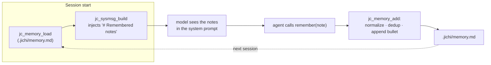

# Persistent agent memory

The agent can keep durable notes that survive across sessions — project
conventions, architectural decisions, gotchas, user preferences — so it doesn't
re-learn the same things every conversation. Notes live in a plain markdown file
the agent appends to with the **`remember`** tool and that jichi loads into the
system prompt at the start of every session.

```
▸ remember  the build command is 'raco make main.rkt'
  ✓ remember Noted; saved to .jichi/memory.md.
```

A later session (even a fresh one) starts with that note already in context.

## Where it lives

`<cwd>/.jichi/memory.md` — alongside the other project-local jichi data
(`.jichi/commands`, `.jichi/skills`, `.jichi/agents`). It is a normal markdown bullet
list, so you can read it, edit it, or delete entries by hand (or have the agent
edit it with `edit_file`). Add it to `.gitignore` if you don't want to commit it,
or check it in to share team conventions.

## Lifecycle



1. **Load.** `jc_memory_load` reads `.jichi/memory.md` (bounded to 8 KB — the most
   recent notes win if it is larger).
2. **Inject.** `jc_sysmsg_build` adds a `# Remembered notes` section right after
   the project rules (AGENTS.md/CLAUDE.md), so the model treats it as standing
   context.
3. **Append.** The `remember` tool calls `jc_memory_add`, which normalizes the
   note, skips it if already present, and appends `- <note>` (creating `.jichi/`
   and the file as needed). It also refreshes the in-session copy so the note is
   visible to the rest of the current turn.

## Design decisions

- **A plain file, not a database.** Markdown bullets keep memory inspectable,
  hand-editable, diffable, and trivially shareable. Deletion/editing reuses the
  ordinary `edit_file` tool — no bespoke "forget" command needed.
- **Project-scoped.** Memory is per-workspace (`<cwd>/.jichi`), because what's
  worth remembering ("this repo uses tabs", "tests run with raco") is
  project-specific. A global memory could be layered on later the way rules are.
- **A note may carry two trailers (M600).** `[evidence: …]` says where the lesson
  came from (a run, a file, an anecdote); `[pins: tests/smoke/x.sh]` names the
  test, lint or constraint that holds it mechanically. Both are kept in the file
  and reach the prompt; `learn analyze` counts the pinned share and checks that a
  cited path still resolves. Cost: a few dozen bytes per note against the 8 KB
  injection budget, which `learn analyze` now states as a fraction. The trade was
  made for the self-learner, who cannot retract a lesson whose origin it has lost.
- **Normalize + de-duplicate.** Notes are flattened to a single line (whitespace
  runs collapse to one space) and a note already present is not appended again,
  so repeated `remember` calls don't bloat the file. The pure helpers
  `jc_memory_clean_note` and `jc_memory_has_line` are unit-tested.
- **Bounded injection — never silently (M143).** Only the last 8 KB is
  injected, so a long-lived memory file can't crowd out the conversation; the
  file itself is never trimmed on disk. When it outgrows the budget, jichi says
  so everywhere it matters: a load-time warning names how much is being
  skipped, the `remember` tool's result warns that the oldest notes no longer
  reach the prompt, and `doctor` flags the file with its size. Prune by hand
  (it's plain markdown) or consolidate stale notes with `/learn` corrections
  ([LEARNING.md](LEARNING.md)).
- **Gated like an edit.** `remember` is a *mutating* tool: it writes a file, so
  it flows through the normal permission gate (`jc_perm`) — prompted in chat
  mode, auto-approved under `--auto`. Add `"remember"` to `permissions.allow` to
  make it silent. (The autonomy envelope's edit-scope fence only constrains
  `edit_file`/`write_file`, so memory keeps working under a scoped `--auto` run.)

## Surfaces

| Where | What |
| --- | --- |
| `remember` tool | the agent saves a note |
| `/memory` (TUI) | print the current notes |
| `memory` (CLI) | `jichi memory` prints `.jichi/memory.md` |
| system prompt | the notes are injected under `# Remembered notes` |

## Internals

- **Core** — `src/chat/jc_memory.c` (`include/jc_memory.h`): `jc_memory_load`,
  `jc_memory_add`, and the pure `jc_memory_clean_note` / `jc_memory_has_line`
  (unit-tested in `tests/test_memory.c`).
- **Tool** — `src/tools/jc_tool_remember.c` (`remember`), a registered built-in.
- **Injection** — `jc_sysmsg_build` (`src/chat/jc_sysmsg.c`), after the rules.
- **Loading** — `main.c` sets `app.memory = jc_memory_load(&app)` at startup.
