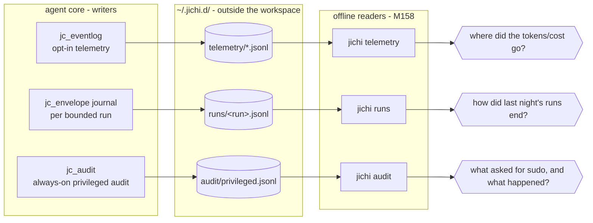

# Observability: what an autonomous jichi leaves behind, and how to read it

An agent you watch needs no observability; an agent that runs **unattended**
(see [AUTONOMOUS_LOOPS.md](AUTONOMOUS_LOOPS.md)) is *only* knowable through what
it records. jichi writes three durable sinks, and — as of M158 — ships an offline
reader for each, plus a preflight that judges a config *before* an unattended
run starts. This doc is the map: what each sink holds, which reader answers
which question, and the design decisions behind them.




### `hook` and `req_bytes` (M326v)

Two additions from a downstream workload's analysis:

- A **failed** `model_call` now carries **`req_bytes`** — the request body size,
  known at the moment of sending. `in_tok` is read out of the *response*, so a call
  that never got one logs `0`; before this, every failed attempt claimed to have sent
  nothing and the cost of retries was unmeasurable.
- A hook that **fails to start or times out** emits a `hook` event
  (`hook`, `outcome`, `timeout_s`, and `tool` where applicable). Successful hooks
  emit nothing — `PreToolUse` fires on every tool call. Before this a hook timeout
  was a stderr line and nothing more, so a log could not say whether a `SessionStart`
  hook was quietly spending its whole timeout every session.

> **The join (M420).** During a bounded run, every telemetry event carries the
> envelope's `run` id, and the journal's `start` event names its `ws`. So
> `runs --output json` and a telemetry read describe the same run and can be
> joined on one key — and `runs` rows now carry **`stuck=N`** (the run hit the same
> verify error N times) and **`goalposts=N`** (a test assertion was modified
> mid-run, so a green verify may not be work). Both appear only when non-zero: an
> always-present `goalposts=0` would train a reader to skip the column the one time
> it matters.

> **Known seams (M419).** What these sinks *cannot* answer is measured and designed
> in [`proposals/2026-08-observability-seams.md`](proposals/2026-08-observability-seams.md):
> a telemetry event and a journal event share **no key** (so behaviour and outcome
> cannot be correlated), **8 of 18** telemetry and **13 of 23** journal events have
> no reader, and `telemetry` reads one log by default rather than the corpus. Read
> it before trusting a summary to tell you whether anything is *improving* — these
> readers are good at "what happened", not yet at "is it getting better".

## The three sinks

| Sink | Written by | On/off | One line answers |
|---|---|---|---|
| `~/.jichi.d/telemetry/<workspace>-<key>.jsonl` | `jc_eventlog` (M21), agent core | **`metrics` on by default since M599** (one appended file per workspace); `full` opt-in; `--log-level off` / `--log -` disable | model calls, tokens, cost, tool ok-rates, routes, compactions, per-turn `rss_kb` (M180) |
| `~/.jichi.d/runs/<run>.jsonl` | the autonomy envelope's journal (`--journal`, default path) | on whenever a run is **bounded** | one run's lifecycle: start → verify/budget/rollback/out-of-scope → end |
| `~/.jichi.d/audit/privileged.jsonl` | `jc_audit` (M154) | **always on** (`privilegedAudit: false` to disable — don't) | every sudo/doas/pkexec/su attempt + the decision, secret-scrubbed |

**All four sinks record the build that wrote them (M290).** The telemetry log
stamps `jichi` on **every event** (the reader filters and logs get concatenated, so
a one-time header would be lost by the operations that make the version matter);
the run journal stamps its `start` record; the audit log stamps every entry (it is
append-only across every run in `$HOME`, so "which jichi decided this" is
provenance nothing else can recover); and each session file records the build that
last saved it.

The readers use it: `telemetry` prints the build, and **warns** when a log spans
more than one, because every rate in that report then mixes eras. `runs` prints a
footer saying the listed rows are not directly comparable when they came from
different builds, and `runs --output json` carries `jichi` per row.

Why it was added: a log outlives the code it describes, and this project twice read
one era's numbers as current — `run_tests` at 75% and `format_file` at 0/3, both
reported as live defects, both fixed weeks earlier. The only thing that caught
either was having the git history to hand. Note that `"v"` in these files is the
*event schema*, not the build — it looks enough like a version that nobody asks,
which is half of why the gap survived so long. See
[ANECDOTES.md](ANECDOTES.md) #35.

**Design decision — all three live *outside* the workspace.** A verify failure
rolls the work tree back; anything inside it is in the blast radius. jichi once
lost a log exactly this way ([ANECDOTES.md](ANECDOTES.md) #1), and the lesson is
structural now: observability is written under `~/.jichi.d/`, owner-only
(0700 dir / 0600 files), where no rollback, `git clean`, or model-issued write
can reach it (the path fence doesn't even permit writes there).

**Design decision — three sinks, not one.** They differ in *lifecycle and
trust*: telemetry is high-volume and opt-in (you may not want it); the run
journal is per-run and exists exactly when a run is bounded; the privileged
audit must **never go dark**, so it depends on nothing else — not on telemetry
being enabled, not on an envelope being active. Merging them would couple the
always-on record to opt-in machinery.

**Design decision — append-only JSONL, one event per line.** Crash-safe (a
truncated last line loses one event, not the file), `tail -f`-able, `jq`-able,
and each reader is a **pure, unit-tested parser** over the text with a thin
I/O shell — the same writer/reader split as `jc_eventlog`/`jc_telemetry`.

**Known limit — no built-in rotation (noted at M180).** The sinks append
forever; RAM stays bounded (each event's tree is freed after the write) but
*disk* grows with use — a months-long always-on telemetry file is yours to
rotate (`logrotate`, or move the file aside; jichi reopens per run). Deliberate
for now: rotation policy is an operator concern, and a truncate-by-tool could
destroy the always-on audit trail's value.

## The readers

### `jichi runs [dir]` — triage last night's loop

One row per bounded run, newest first (`--all` to show every journal):

```
Runs: ~/.jichi.d/runs

RUN                    WHEN        OUTCOME            TOKENS  TOOLS  VERIFY  NOTES
task-17-a3f2           07-24 03:12 ok                  52.3k     34     2/1
task-16-99c0           07-24 02:41 budget_exhausted   400.0k     80       -  rolled_back budget=tokens starved
task-15-b7d1           07-24 02:03 verify_failed       210k      61     0/4  rollbacks=1
```

Read it as a work queue: `ok` rows are done; `budget=` rows need a bigger
budget or a narrower task; `starved` means an analysis run died before writing
its answer (M96 — raise the budget or reduce reading); `rolled_back` means the
tree was restored and the task should be retried or rethought; a `?` outcome
means the journal has no `end` event — the process was killed or is still
running; `no_changes` means the run wrote **nothing**, so its completion verify
never fired (that is gated on a mutating tool) and it exited 0 regardless — the
flag is what tells "did the work and it passed" from "did nothing";
`constraints=N` means the run silently ADOPTED N inferred constraints from its own
prompt, which narrow what it may do and are announced on stderr exactly once;
`steered=N` (M161) means an operator injected N steering messages
over the [control channel](CONTROL.md) — this run's behavior is not purely
model-chosen, which matters when comparing outcomes; `unanswered=N` (M359) is
its dual — the model asked N blocking questions via `ask_user` and nobody was
there to answer, so it proceeded on its own judgment: a signal the task was
under-specified for unattended running (answered questions are journaled too,
`answered:true`, but not counted — they already shaped the run through the
history). The parser is
`jc_runsview` (`src/util/jc_runsview.c`, pure, unit-tested in
`tests/test_runsview.c`).

**Machine callers (M160):** `--since <dur>` windows the table to runs with
activity after the cutoff (journal timestamps, file mtime as the fallback;
runs outside the window are counted, never silently dropped), and
`--output json` emits one object —
`{"v":1,"dir":…,"runs":[{run,ts,ts_end,outcome,rolled_back,tokens_used,
tool_calls,budget?,starved?,no_changes?,constraints?,steered?,unanswered?,
verify:{pass,fail},
…}],"shown":N,"total":M}` —
with `rolled_back` as JSON `null` when the journal has no `end` event
(unknown is not `false`), and zero/empty optionals omitted. A supervisor
gates on fields instead of scraping the table:

```sh
jichi runs --since 1d --output json | jq '.runs[] | select(.rolled_back)'
```

### `jichi audit [path] [--since 7d]` — the privileged-command record

```
Privileged-command audit: ~/.jichi.d/audit/privileged.jsonl

3 privileged-command attempts: 2 refused, 1 ran
  by decision: unattended_refused 1, allowlist 1, ask_denied 1
  by launcher: sudo 2, doas 1

most recent (up to 10):
  2026-07-23 21:46 sudo     unattended_refused sudo apt-get update && sudo apt-get upgrade -y
  2026-07-23 21:48 sudo     allowlist          sudo systemctl restart myapp
  2026-07-23 21:50 doas     ask_denied         doas rm -rf /tmp/x
```

"Refused" = `deny` / `ask_denied` / `unattended_refused`; "ran" = `allow` /
`allowlist` / `ask_approved`. `--since` takes the envelope's duration syntax
(`90s`/`20m`/`2h`, and — new in M158 — `7d`). The parser is `jc_auditview`
(`src/util/jc_auditview.c`, pure, unit-tested). Commands are stored
secret-scrubbed by the writer; the reader never widens anything — it is
strictly read-only. Remember the design stance from M154: this is jichi's
*self-audit convenience*; the authoritative record on a hardened host is the
OS's (`auditd`, `journald`).

**Machine callers (M160):** `--output json` emits one object —
`{"v":1,"total","refused","ran","skipped","malformed",
"by_decision":{…},"by_launcher":{…},"recent":[{ts,launcher,decision,mode,
command}…],"path"}` — so an alerting rule is one `jq` expression:

```sh
jichi audit --since 1d --output json | jq -e '.refused == 0' \
    || notify-operator "an agent asked for privilege in the last 24h"
```

### `jichi telemetry [path]` — the cost/behavior summary (M21e)

Unchanged, and documented in [TELEMETRY.md](TELEMETRY.md): per-model calls,
tokens, cost, cache hit-rates, tool ok-rates, per-session timelines. Use it
when `runs` tells you *that* a run went wrong and you want to know *why* in
model-call terms.

### The joined read — outcome × behaviour in one table (M420/M421)

Since M420 a telemetry event carries the envelope's `run` id, so the two sinks
can finally be correlated: `runs` says **what happened**, telemetry says **what
the run did to get there**. This is the read that motivated the join, written out
once so nobody has to rediscover the field names.

The two sinks name the same quantities differently — this is the one piece of
archaeology the join does not remove:

| quantity | `runs --output json` | telemetry event |
|---|---|---|
| join key | `run` | `run` (on every event) |
| workspace | `ws` (M420, from `start`) | `ws` (always) |
| outcome | `outcome`, `rolled_back`, `verify` | — |
| totals | `tokens_used`, `tool_calls`, `tool_calls_executed` | — |
| per-call input | — | `model_call.in_tok`, `.cache_read_in`, `.hist_tok` |
| per-call output | — | `model_call.out_tok`, `.latency_ms`, `.cost_usd` |
| per-tool | — | `tool_call.name`, `.ok`, `.duration_ms` |

Group the telemetry file by `run`, index the `runs` rows by `run`, print them
side by side. Roughly thirty lines of any scripting language; the derived column
worth computing is **input tokens per model call**, which neither sink shows on
its own — the journal has totals without calls, telemetry has calls without an
outcome.

On the three runs that first exercised this, that column was the whole story:

| run | outcome | total | calls | tools | cache | in/call |
|---|---|---|---|---|---|---|
| chrtext | `budget_exhausted` | 980.9k | 15 | 11 | 0% | **64.9k** |
| chrtext | `budget_exhausted` | 1.2m | 23 | 26 | 0% | **53.6k** |
| zigodot | `ok` | 182.0k | 28 | 31 | 0% | **22.8k** |

Two runs died of budget having called eleven and twenty-six tools. They did not
thrash and they were not stuck: with no prompt cache on that backend, each call
re-sent 55–65k of context, so the *budget* was spent on re-reading rather than on
work. Read either sink alone and you get "ran out of tokens" (journal) or "made
fifteen calls" (telemetry); the quotient is the diagnosis, and it points at
`promptCache`, `contextLimit` and a narrower brief rather than at a bigger budget.

**Keep the two sinks in separate directories, or accept one caveat.** `runs <dir>`
globs `*.jsonl`. Until M421, a telemetry log in that directory parsed as a
journal and rendered as a second, all-zero row for the same run — wearing the
real run id, and carrying telemetry's `constraint` count beside the journal's.
The reader now requires a journal-exclusive event name before it will call a file
a run journal (`constraint`, `route` and `tool_call` are in *both* vocabularies
and do not qualify), and `telemetry_events_lint.sh` fails if that separation ever
stops holding. A run killed before writing `end` still shows, with outcome `?`.

## `doctor --unattended` — judge the posture before the loop starts (M158b)

`doctor` has always warned about risky settings; warnings don't gate anything.
`--unattended` re-judges the config **as an unattended-loop posture** and makes
the exit code enforceable:

- Escalated **WARN → FAIL**: running as root, `privilegedCommands: allow`,
  `privilegedAudit: false` — plus **FAIL** on an explicitly disabled path
  fence. Any of these on an unsupervised host is a misconfiguration, not a
  preference.
- Advisory **WARN** (legitimate for report-only loops): no `verify`/
  `testCommand`, no `editScope`, snapshots disabled (no rollback-to-green).

A loop supervisor gates on it (the reference `loop.sh` does, opt-in):

```sh
jichi --config "$JICHI_CONFIG" doctor --unattended || exit 2
```

**Design decision — a profile flag, not a new subcommand.** The individual
checks already existed (M55/M155); what an unattended host needs is a stricter
*judgment* of the same facts. Escalating severities inside `doctor` keeps one
health-check surface, one renderer, one exit-code contract (`1` iff any FAIL),
and zero new code paths to drift. Note the profile judges the *config*; per-run
bounds (`--budget-*`, `--verify`, `--edit-scope`) live on the loop's command
line by design ([AUTONOMOUS_LOOPS.md](AUTONOMOUS_LOOPS.md) §4) and are advisory
WARNs here, not FAILs.

## Documentation hygiene: the docs↔flags lint (M158)

Observability extends to the documentation itself. While writing
[AUTONOMOUS_LOOPS.md](AUTONOMOUS_LOOPS.md) we found a `budget-time` flag
documented where the real flag is `--deadline` — stale for months, found by
accident. The new lint (`tests/smoke/docs_flags.sh`, in the CI smoke tier since M210) makes
that bug class impossible:

- The **valid set** is every `--<flag>` string literal in `src/main.c` (parser
  *and* help text) + the converter — so a doc can never reference a flag the
  binary doesn't know.
- Every `--<flag>` token in `docs/`, `examples/`, `completions/`, `README.md`,
  and the man page must be in that set, in the **FOREIGN** allowlist (curl,
  git, valgrind, … flags the docs legitimately show), or in **FUTURE**
  (designed-not-built flags).
- **Excluded by design:** `docs/proposals/`, `docs/plans/`, `docs/ROADMAP.md`,
  `docs/DEFERRED_LOCAL_GPU.md` — their whole subject is flags that don't exist
  (yet).

First run caught **five live doc bugs**: the stale `budget-time` in two more
places (REMOTE_SSH.md, a presentation), a phantom `budget-tool-calls` (real:
`--max-tool-calls`), a phantom `mode` flag, and a `json` flag on doctor (real:
`doctor --output json`). (This section names those historical flags *without*
their leading dashes precisely so the lint keeps rejecting them — allowlisting
them would let the very bugs it fixed regress silently.) The allowlist costs
one line of friction per new foreign flag — the price of keeping the jichi-flag
check strong.

## Recommendations

- **For any unattended loop:** turn telemetry on at the `metrics` tier
  (`--log-level metrics`) — it is the only sink that explains *cost*; `runs`
  explains *outcomes*; `audit` explains *privilege*. All three are cheap.
- **A morning-after routine:** `runs` → for each bad row, open its journal (the
  RUN column names the file) → `telemetry --workspace <proj>` for the cost
  view → `audit --since 1d` to confirm nothing asked for privilege.
- **Wire `doctor --unattended` into the supervisor's startup** (PREFLIGHT=1 in
  the reference loop) and into CI for the config repo, so a posture regression
  is caught before a run, not after.
- ~~Deferred~~ **shipped (M160):** the `--since` window for `runs` and
  `--output json` for both readers landed exactly as predicted — the parsers
  were pure, so each was a renderer away. Mid-run *steering* shipped as
  M159 — a `status` probe, `[operator]` injection, pause/resume, and abort
  over a per-run control socket; see [CONTROL.md](CONTROL.md).

See also: [TELEMETRY.md](TELEMETRY.md), [AUTONOMY.md](AUTONOMY.md),
[AUTONOMOUS_LOOPS.md](AUTONOMOUS_LOOPS.md), [DEPLOYMENT.md](DEPLOYMENT.md) §5,
[DOCTOR.md](DOCTOR.md), [ANECDOTES.md](ANECDOTES.md).

## Journal event reference (M366)

One row per event a bounded run's journal can carry — the canonical registry
`tests/smoke/telemetry_events_lint.sh` checks against the emitters, both ways
(an event emitted but missing here fails the build, and so does a row for an
event nothing emits). Consumers tolerate unknown events by design
([EMBEDDING.md](EMBEDDING.md)); this table is for the humans and the lint.

| `event` | What it records |
| --- | --- |
| `open` | the journal exists and the run has a pid (M438). Written the instant the file is opened, so it is never 0 bytes while the process lives — `start` follows only after config load, reachability probes, MCP connect and the repo map, any of which can hang, and an empty file is what a dead process looks like |
| `start` | the run began: budgets, scope, verify command as configured, `edit_scope_globs` (M459: WHICH globs, not just how many — a count cannot tell `AGENTS.md` from `**`, and the second fences nothing) |
| `end` | the run's outcome (`outcome`, `rolled_back`, `tokens_used`, `tool_calls`, `tool_calls_executed`) |
| `verify` | one verifier run: pass/fail, parsed `failed`/`passed` counts (M86 adds the sanity fields) |
| `tool_loop` | a **tool call kept failing the same way inside one turn** (`name`, `class`, `key`, `repeat`) — surfaced as `loops=N` in `runs`. `key` is `exact` (byte-identical arguments, threshold 3) or `class` (same failure cause, varied arguments, threshold 4); `class` is one of `not_found`/`denied`/`bad_args`/`killed`/`nonzero_exit`/`other`. Its own event because every prior recovery was reactive to ONE failure — measured at 31% and 40% of error-turns across two corpora, with single turns repeating a failing call 34x and 59x (M432) |
| `blocked_repeat` | the run re-attempted a **policy-forbidden** action after being refused (`name`, `target`, `repeat`) — surfaced as `blocked=N` in `runs`. Its own event because a block is neither a tool error (`ok:false`) nor counted against `--max-tool-calls`, so before M429 a run could spend its whole token budget on one while every other signal read normal |
| `verify_stuck` | the verifier failed with the same signature `repeat` times in a row — fix-forward is looping. Emitted from **both** verify paths since M422; the periodic (`--verify-every`) one carries `phase: "periodic"`, matching the `verify` event's own convention. Before M422 only the completion path journaled it, so mid-turn thrashing warned on stderr and left `runs`' `stuck=N` blank |
| `checkpoint` | a green checkpoint was banked (`commit`, `green`) — the M81 periodic verify passed |
| `baseline` | the declared gate's baseline verdict at run start (M343: a goal gate must start red) |
| `budget` | a budget/deadline/tool-call cap stopped the run (`kind`; `starved` per M96) |
| `budget_notice` | the M347 80% bell: the model was told a budget is nearly used (`kind`) |
| `rollback` | the envelope rolled the workspace back to the green checkpoint |
| `preserved` | a discarded attempt was preserved as a git ref before rollback (`ref`, `commit`; `jichi attempts` lists it) |
| `out_of_scope` | files outside the edit scope changed (M83; `reverted` counts per M142) |
| `route` | the run switched model tiers (fast/strong) and why |
| `tool_call` | a tool call the envelope BLOCKED (`name`, `blocked`) — not every call, only refusals |
| `constraint` | a hard user constraint refused a call (M110; `tool`, `reason`) |
| `constraint_exempt` | an inferred read-only did NOT refuse a write: an explicit edit-scope names that path (M459; `tool`, `why`) |
| `control` | a control-channel command was served (M159; `cmd` — injects make the run `steered=N` in `runs`) |
| `ask` | the model asked the human (M359: `question`, `answered` — `runs` renders unanswered=N) |
| `parallel_verify` | a write child's worktree verify verdict before merge (M144: `task`, `exit` — a red child is quarantined) |
| `self_review` | the one-shot self-review pass ran on the turn's diff (M39) |
| `strict_green` | strict-green downgraded a green outcome over out-of-scope changes (M332) |
| `test_assertion_edit` | an edit under the envelope touched a test assertion (`path`, `tool`) — the moved-gate detector |
| `history_check` | the M364 wire-shape validator found violations in a bounded run |
| `post_outcome` | a model call was metered after the outcome was decided (M329: the totals above it are short) |
| `learn_on_stop` | the mentor ran after the run ended (M330: its `tokens`/`tool_calls` are outside the run totals). Since M598 it also says what the draft would commit: `draft_memory`, `draft_skills`, `draft_corrections`, `draft_rules`, their sum `draft_items`, and `draft_parsed_nothing` (1 = bytes but no section `learn apply` knows). The fields are present only when there was a draft to parse; `jichi runs` renders the last as `draft=empty` on an otherwise `ok` row, and `--output json` carries `learn_draft_items` / `learn_draft_empty` |
