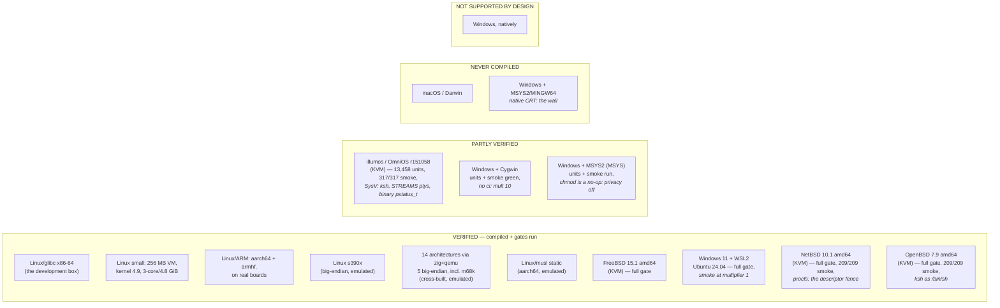

# Platforms — what has actually been compiled and run

> **This page owns the verdict.** Every other page — [`README.md`](../README.md),
> [`TUTORIAL.md`](../TUTORIAL.md), [`INSTALL.md`](INSTALL.md),
> [`BUILD.md`](BUILD.md), [`PREPARE_AND_BUILD.md`](PREPARE_AND_BUILD.md) — links
> here for platform support instead of stating its own. That rule exists because
> those five pages had drifted into **three different confidence levels** for the
> same untested platform: "works", "well-supported", and "untested". A newcomer
> read whichever one they opened first.

Three words are used strictly on this page:

- **Verified** — jichi was compiled on that platform *and* its test gates were
  run there, by a person, with the numbers written down. Nothing is called
  verified because it "should work".
- **Partly verified** — compiled there, and *some* gate ran green, with the
  incomplete part named. FreeBSD earned this word on 2026-08-16 rather than
  being rounded up to Verified on a green unit suite: 185 of 198 smoke drivers
  passed and the stop was undiagnosed, so the honest label sat between the other
  two. **It graduated at M465**, when that stop turned out to be a harness defect
  and the full gate went green — which is the point of the word: it names a gap
  precisely enough that closing it is a piece of work someone can finish. OpenBSD
  holds the label now. A platform stays here until the named gap closes.
- **Never compiled** — exactly that. No compiler on that platform has ever seen
  this source tree. Not "probably fine", not "unsupported" — unmeasured.

And a fourth word, added 2026-09-18 (M665) because the three above do not cover
the thing jichi is for:

- **Driven** — a **live agentic task with a real model** ran on that platform:
  a request over the wire, an SSE stream, a tool the model chose, the tool
  executed, and a second turn that used the result. Named with the task and the
  model, like every other datum here.

  **Every gate the other three words describe is OFFLINE.** The build, the unit
  suite, the smoke tier and the four surfaces (`--version`, `doctor`, `describe`,
  `context`) can all be green on a platform where jichi has never once called a
  model. A row that is *Verified* and not *Driven* says "it compiles and its
  tests pass here"; it does **not** say "it works here", because the agent loop
  is the product and an offline tier never runs it end to end.

  **This page is where driven-ness goes missing, and that is the actual gap.**
  The word was added on 2026-09-18 after the FreeBSD row was re-run to 302 of 303
  drivers having never made a model call — and the first count published with it,
  *"three of nineteen"*, was **wrong**. It counted what THIS PAGE records, and
  was written as though it counted what has been done. What has been done is more
  than that:

  The full register is **[### Driven](#driven--which-rows-have-run-the-agent-loop)**
  below: every platform row on this page, driven or not, so the answer to
  *"has the agent loop ever run here?"* is a lookup rather than a search.

  So the honest statement is not "it has never been done". It is that **the
  matrix does not carry it**, so a reader of this page cannot tell which rows
  have run the agent loop and which have only compiled it — and neither could I,
  which is how the wrong number got published. Recording it per row is the work;
  `DEFERRED.md` holds what is left.

---

## The matrix



### Verified

| Platform | Arch / libc | Evidence |
|---|---|---|
| **Linux, glibc** — the development box (Ubuntu 24.04, kernel 6.8, glibc 2.39, 3 cores / 4.8 GiB) | x86-64 | `uname -s = Linux`. every milestone; full `make ci` green — **gcc 13.3 and clang 18.1** (12,422 unit checks each under `WERROR=1`), clang ASan/UBSan, Valgrind 0 errors, 22 fuzz targets, smoke, e2e (M368) |
| Linux, glibc — **the low-resource reference box** (3 cores, 4.8 GiB) | x86-64 | M229: 9,619 checks / 0 failures, Valgrind 0 errors, smoke 75 drivers / 323 checks, e2e OK |
| **Debian 12 in 256 MB with one core** (KVM) | x86-64 | M272/M273: gcc builds the whole tree *inside* the ceiling |
| **Debian 9, kernel 4.9** (KVM) | x86-64 | M272/M273: twelve guest passes; proved **three product fixes in-row** (pre-2.13 `git stash push`, a pre-2.17 worktree leak, an `Expect: 100-continue` second per model call) |
| **Raspberry Pi Zero 2 W** — physical hardware, **re-flashed to 64-bit and re-measured** | aarch64 | **RE-RUN AND DRIVEN AT M677, 2026-09-20 — `18 ok, 0 failed`, and the coverage debt is now 0.** `WERROR=1` clean in **79.47 s** (multiplier **12**), unit suite **13,362 checks / 0 failures**, **`smoke: OK (308 drivers, 1,780 checks)`** — the whole tier, where the last run left one driver red (`lite_context_cap`, fixed at M672 by pinning `--no-lite`: the board reports `tier: minimal (lite)` and the check was measuring its RAM). Thirteen checks fewer than the host's 1,793, all environment-gated. Both live turns green over the board's existing forward, agentic phrase `TIER-B-526D6F`. **It remains the smallest thing in this matrix that has run the agent loop.** *(Historic, 2026-09-18: **DRIVEN** A **512 MB** board, headless, against a loopback LM Studio reached over an ssh reverse tunnel with a real config (`provider: openai` + `apiBase`): a text turn returned `PI-ZERO LIVE OK` in **17 s**, and an agentic turn — *read `note.txt` with the `read_file` tool and report the pass phrase* — returned `PIZERO-7C3A` in **17 s**, the tool having actually executed and its result consumed by a second turn. **Re-confirmed through the rig** the same day once its live steps were fixed: `16 ok, 1 failed`, with `ok - agentic turn: the model called a tool and reported TIER-B-313403` — so this is a reproducible row and not a transcript. The one failure is the tier itself: `smoke: (302 of 303 drivers passed, 1,743 checks)`, debt **1**, the driver being `lite_context_cap`, undiagnosed.  **M664, 2026-09-18:** Raspberry Pi OS Lite (64-bit) trixie, kernel 6.18.50+rpt-rpi-v8, gcc 14.2.0, glibc 2.41 — the same toolchain generation as the Pi 400, so the two aarch64 rows compare. `WERROR=1` build clean in **80.41 s** (multiplier **13**), unit suite **13,332 checks / 0 failures**, smoke **301 of 303 drivers, 1,711 checks**, all four offline surfaces green. The two failures are `cppcheck_lint` and `lite_context_cap` — the same pair the armhf row reports, so they are not word-size specific and neither is diagnosed. Reached over **USB gadget ethernet** (`dtoverlay=dwc2` + `modules-load=dwc2,g_ether`, static 10.42.0.130 via cloud-init); the gadget MAC is random per boot, so the host profile matches `enx*` rather than a fixed name. **This row found the M664 quadratic reader**, which every platform had and only a 512 MB board exposed. Original 32-bit-era row — M272: 9,722 checks + 94 smoke drivers green at timeout multiplier **28**; footprint 8.9/16.3 MB; unit suite *and* a mock `--auto` turn under `MemoryMax=256M`) |
| **Windows 11 + WSL2** (Ubuntu 24.04, kernel 5.15.167.4-microsoft-standard-WSL2, 12 cores / 7.6 GiB) | x86-64 | M475 (2026-08-18): full `make ci` green in 10m34s — gcc 13.3 **and** clang 18.1 (12,418 unit checks each under `WERROR=1`), clang ASan/UBSan, Valgrind 0 errors, fuzz 2000 iters/target, curl-free link, smoke **209 drivers / 1,104 checks at timeout multiplier 1**, e2e OK; plus a live round trip against an OpenAI-compatible local server. `make ci` needed four fixes first — all pre-existing, **none WSL-specific** (see [the WSL2 row](#the-wsl2-row-and-the-four-defects-it-found-2026-08-18))  **DRIVEN** (M475): chat, reasoning, **tool use** (agent loop -> `read_file`), embeddings via a `roles:["embed"]` model, and the model-gated e2e drivers `headless_model` and `acp_terminal` both green -- see the WSL2 section below. |
| **Raspberry Pi Zero 2 W, re-flashed 32-bit** — physical | armhf (`LONG_BIT=32`) | M276: 9,731 + 95 green at multiplier **26** — the first real test of the `%lu`-with-casts convention where `long` is four bytes |
| **Raspberry Pi Zero 2 W, 32-bit** — physical, re-measured on a second bench | armhf (`armv7l`) | M454, 2026-08-15: Raspbian 13 trixie, gcc 14.2.0, glibc 2.41, 4 cores / 425 MB. Full `make check-target` green — **11,595 checks + 194 smoke drivers** at multiplier **11** (64.2 s build ÷ this bench's 6.19 s). **Re-run M658, 2026-09-18: 13,329 unit checks / 0 failures and 297 of 299 smoke drivers, 1,703 checks**, at multiplier **13** (77.13 s ÷ 6.19 s) — slower to build than at M454 on the same board. The two failing drivers are `cppcheck_lint` (cppcheck is absent there and the driver does not skip) and `lite_context_cap`; neither is diagnosed. **The run needed `TMPDIR` on disk:** `/tmp` is a 213 MB tmpfs on this 425 MB board and the tier's own fixtures fill it to 100%, which surfaces as `printf: I/O error` and six checks reporting their own matcher "meaningless" — an environment limit that reads exactly like a defect. Builds in 64 s where M276 measured 101 s on the same board — newer OS and compiler. `doctor` reports `tier: minimal (lite)` with tool profile **core**, the bottom of the three tiers. 13 smoke checks fewer than a host run, all accounted: `org_mode_lint`'s variable plan (no emacs) and two `pdftotext` drivers |
| **Raspberry Pi 400** — physical, the first Cortex-A72 | aarch64 | **RE-RUN AND DRIVEN AT M677, 2026-09-20 — `18 ok, 0 failed`, every step including both live ones, and the eighteenth check is new: the row now NAMES the transport that carried the turn.** Build clean in **29.99 s**, multiplier **5**; unit suite **13,362 checks / 0 failures**; **`smoke: OK (308 drivers, 1,793 checks)`** — identical to the host's, on a board. The agentic turn reported `TIER-B-2B7078`. **Why the transport line exists.** The first M677 run passed with its own reverse forward *failing*: `ssh -R` warns that it cannot bind and runs the command anyway, exit 0. The cause was not a stale socket — this bench carries a **deliberate persistent tunnel** per board (`ssh -N -R 1234:127.0.0.1:1234`, `ServerAliveInterval` and `ExitOnForwardFailure` already set), so the port was already correctly forwarded and the rig was binding it a second time. The model calls were real and the row was true; the evidence for *which path carried them* was absent, which is the part that is not acceptable. The rig now asks the board whether it can already reach the endpoint, uses that path and says so, and only makes its own forward when there is none — where a bind failure is then a real failure. Adding `ExitOnForwardFailure=yes` alone, which was the first fix, would have **broken this bench**: the rig would abort exactly where the operator had already done the work. *(Historic, 2026-09-18: `17 ok, 0 failed`, `smoke: OK (303 drivers, 1,761 checks)`, agentic phrase `TIER-B-446EB3`.)* The agentic step is the one worth naming: the model chose `read_file`, the tool executed, and the second turn reported the run's random phrase `TIER-B-446EB3` — so the row covers the product loop and not only the build. Driven headless against a loopback LM Studio over an ssh reverse tunnel with a real config. **2026-09-18: `smoke: OK (303 drivers, 1,761 checks)`, 0 failures — the whole tier, reproduced three times. Coverage debt 0.** Build clean in **30.0 s**, multiplier **5**. This row had stood for months as *green without a driver count*, and the cause was in the rig, not the board: `tier-b-device.sh` ran `make check-target` **without `JC_SMOKE_KEEP_GOING=1`**, so the tier stopped at the first failing driver and never printed its summary — there was nothing to extract, which is why the debt table read *n/a* rather than a number. The BSD rig has set that variable since M466. *(Earlier: **Re-run M658, 2026-09-18:** `WERROR=1` build clean in 29.56 s (multiplier **5**), unit suite **13,329 checks / 0 failures**, all four offline surfaces green; the smoke tier stopped at **`install_no_build`** — **diagnosed at M661 and it was not an ARM defect or an order dependence:** `make install` copies both binaries, `make smoke` builds only `jichi`, and `check-target` did not build `all`, so the driver failed for a missing `jichi-convert` on every device row. `check-target` builds `all` since M661 and the driver names the precondition. This row previously carried no driver count at all, so its coverage debt was not a large number but *not a number*; it is computable from here on. Original row — M451, 2026-08-15: Debian 13 trixie, gcc 14.2.0, glibc 2.41, 4 cores / 3795 MB. Full `make check-target` green — **11,593 checks + 194 smoke drivers** at multiplier **5** (26.6 s build ÷ this bench's 6.19 s); footprint 9,536 / 17,248 KB via `/usr/bin/time -v`. `doctor` reports `JC_RES_NORMAL` with tool profile **full**, confirming M448's threshold from above the 1 GB line. Its `/tmp` is tmpfs, so it needs ≥72 MB for the gate. Closes M230's last named item )* |
| **Arduino UNO Q** (Qualcomm SoC) — physical | arm64 | M282: 9,770 + 96 green at multiplier **19**; the `SIZE=1` binary is **byte-identical** to the Pi's aarch64 build |
| **s390x — big-endian** | s390x, emulated (`qemu-user-static` + binfmt) | M266: passes, and retired a standing assumption about the index cache's endianness tag |
| **The M469 architecture sweep — 14 architectures** | x86-64, x86 (32), aarch64, **aarch64_be**, arm, **powerpc** (BE 32), **powerpc64** (BE), powerpc64le, riscv32, riscv64, **s390x**, loongarch64, hexagon — all `zig cc` + musl under `qemu-user`; plus **m68k** (gcc 15.2, glibc) | M469, 2026-08-17, `scripts/tier-v-arch.sh`: each row `WERROR=1` C89 clean and **11,646 unit checks / 0 failures**. **Five are big-endian**, against one before. **These are cross-builds run under emulation, not machines**, and they link `HAVE_CURL=` — so they exercise the core, arenas, JSON and pure helpers but **no model call**; a green row here is weaker than a green FreeBSD row, and the count 11,646 vs the host's 11,661 is the curl-gated checks. **m68k is the sharpest instrument in the set** (big-endian, 32-bit, 2-byte aligned) and is the only row needing a non-zig toolchain, since `zig targets` advertises `m68k-linux-musl` while its LLVM has no m68k backend. **The sweep found two real defects, both invisible to a green `make ci`** — see below |
| **The M542 architecture re-sweep — 20 targets** | every `zig cc` + musl triple with a registered `qemu-user` handler | M542, 2026-08-22, `scripts/tier-v-arch.sh --all`: **all 20 cross-build `WERROR=1` C89 clean**, and **13 run the unit suite at 12,724 checks / 0 failures** — including three big-endian rows (**s390x**, **powerpc64**, **powerpc** 32-bit). **Six mips rows are `no-run`**, correctly classified by the rig rather than counted as failures: its env probe reports `pipe=FAIL select=FAIL`, so the *emulator* cannot run the subprocess tests. **One real failure: `armeb-linux-musleabihf`, 5 checks** — and the evidence says it is the toolchain, not jichi. (1) Three other big-endian targets pass clean, and 32-bit big-endian powerpc would fail identically to a byte-order defect in double handling; it does not. (2) A **minimal C program with no jichi in it** reproduces the symptom: on armeb, `strtod("0.2")` holds the correct value (`0.2 + 0.5 == 0.7`, and a `%g` round trip through text is exact) while `printf` renders the first of several variadic doubles as `-0.000000000`. Both jichi failures — a converted `temperature` and a golden request body — are downstream of formatting a double for output. **Verdict: Partly verified — builds and links clean, unit suite unreliable under this toolchain.** No jichi change; recorded so the row is not mistaken for a product defect, and so a future toolchain can be re-measured against a stated symptom |
| **aarch64 musl, fully static** | aarch64, emulated | M266: 9,693 checks / 0 failures; the binary runs (`--version`, `doctor`) |
| **aarch64 musl, fully static, curl-free** — row V0 re-executed on a second bench | aarch64, emulated (`qemu-user-static` + binfmt) | M447, 2026-08-15, `alex-X570-AORUS-MASTER` (Ryzen 9 3900X, kernel 6.8), zig 0.16.0 standalone: **11,593 checks / 0 failures**, 8.6 s emulated; `./jichi --version` runs. The run **found a regression**: `run_tests` would not link under `HAVE_CURL=` because a pure predicate sat inside `#ifdef JC_HAVE_CURL` — the same drift M189 repaired once. `make ci` now compiles this configuration |
| **Debian 12 in 160 MB with one core** (KVM) | x86-64 | **DRIVEN, M679, 2026-09-20 — and it is the smallest WHOLE MACHINE in this matrix that has run the agent loop.** `ok - live turn answered over the reverse tunnel (google/gemma-4-12b)` and **`ok - agentic turn: the model called a tool and reported TIER-V-EA7E77`**: on a machine with **160 MB of RAM**, jichi built a request, framed SSE, the model chose a tool, the tool ran, and a second turn consumed its result. The Raspberry Pi Zero row — 415 MB — held that title before. Build 8 s, `accel: kvm,cpu=host`. **The gate still fails on one driver**, `bibliography_lint`, which also fails on illumos and passes on the host; it is recorded **undiagnosed** in [`DEFERRED.md`](DEFERRED.md) with what has been ruled out. **Two of this project's own bugs stood between the question and the answer**, and both looked like results: a port collision that produced *"the kernel never STARTED … a property of the IMAGE"*, and a live step pointed at the wrong guest path that produced two FAIL lines on the row asking this very question. *(Historic — M430: the full `make check-target` green inside the ceiling, 11,342 checks + smoke OK (174 drivers), footprint 8,632/14,864 KB. The same image **panics at 128 MB** before userspace.)* |
| **x86-64 musl, fully static, WITH a minimal libcurl** | x86-64 | M430: 0 shared libraries, 804 KB `--version` RSS, and a **verified model call** — the ≤64 MB tier's own recipe, built for the first time |
| **FreeBSD** | **Verified — the full gate** (M465) | `uname -s = FreeBSD`. FreeBSD **15.1-RELEASE** amd64 under KVM (`scripts/tier-v-bsd.sh`). The first **non-Linux kernel** this project ran on. `gmake WERROR=1` clean with `STD_DIALECT = c89 (strict)`; **11,643 unit checks / 0 failures**; all four offline surfaces. **RE-CONFIRMED AT THE 0.9.2 RELEASE TREE (M668, commit `fb032ede`): `16 ok, 0 failed` — `smoke: OK (305 drivers, 1,742 checks)`, zero failures, the WHOLE tier, with both live turns green through the rig** (`ok - live turn answered over the reverse tunnel`, `ok - agentic turn: the model called a tool and reported TIER-V-1D0BDC`). This is the non-Linux confirmation the release rests on, and it is reproducible: `scripts/tier-v-bsd.sh --ref-secs <this bench> --live-port 1234 --live-model <id>`. **DRIVEN, 2026-09-18 (M665): the first live model call on this kernel, and a real tool call with it.** LM Studio stayed loopback-bound on the host and the guest reached it over an ssh reverse tunnel (`ssh -R 1234:127.0.0.1:1234`), the same arrangement the illumos row used. `google/gemma-4-12b`: a text turn returned `FREEBSD LIVE OK` in **4 s**, and an agentic turn — *read `note.txt` with the `read_file` tool and report the pass phrase* — returned `The pass phrase is BSD-PTY-42.` in **7 s**, rc=0. That exercises request build, SSE framing, a **native** tool call, tool execution and the second turn that consumes the result. Until this the row was green on a tier that never calls a model. **Smoke: 302 of 303 drivers, 1,727 checks, re-measured 2026-09-18 (M665)** — the one remaining failure is `parallel_abort`, measured and not diagnosed — the row had stood at 201 drivers since 2026-08-17, a coverage debt of **102**, which is why it was re-run. Six drivers failed and **five were harness defects with nothing to do with FreeBSD**: a `grep -rc` on a named file (BSD grep's `-r` implies `-H`), a universe enumerated with `git ls-files` on a shipped tree that carries no `.git`, two bare `make` invocations where `make` is **bmake**, and `man --warnings` passed to a mandoc-based `man`. `peer_reap_grace` timed `with_deadline` rather than jichi and **accused the fix it exists to defend** — FreeBSD's `timeout(1)` acquires reaper status, so the mock's orphaned `sleep 120` reparented to it; jichi's own exit took **0 s**. The same behaviour bit one level up, where the smoke runner's per-driver `timeout` waited on that orphan and reported a driver FAILED whose own output showed three `ok` lines. **Two real defects came out of it**: mandoc found a roff escape GNU man accepted silently (`\\` where roff needs `\e`) plus an unparseable `.TH` date, and `setup_keyfile` check 22 caught a **~150-column** pre-prompt notice against the project's own 76-column wizard rule — unwrapped on every platform, and reached only here. Full account: [`analysis/2026-09-18-freebsd-and-the-probes-i-built.md`](analysis/2026-09-18-freebsd-and-the-probes-i-built.md). *(Historic: **Smoke: OK (201 drivers, 1068 checks), 0 failures**, measured 2026-08-17 after the one stop was diagnosed — it was a harness defect, not a platform one (see below). 1068 against Linux's 1081: twelve checks are environment-gated and skip here.)* Needs `gmake` (FreeBSD's `make` is bmake). **Seven defects found at M460, all real** — see below. **Footnote (M466):** at least one of those 1068 checks was hollow — `changelog_coverage_lint` used a GNU `\b`, whose failure on a BSD grep was *silent* (one alternative of its pattern still matched), so it reported a number while ignoring most of its input. Fixed, and banned tier-wide; the promotion stands, but the count was never a guarantee that every check tested what it claimed. **RE-CONFIRMED AT M683, 2026-09-20**, as the regression check for five test-tooling fixes made for illumos: `14 ok, 0 failed` -- `gmake WERROR=1` clean in **7 s** (multiplier 1 against a 7.32 s bench), `13,383 checks, 0 failures`, `smoke: OK (311 drivers, 1,782 checks)`, and all four offline surfaces. **Offline only**, and the rig says so itself in the results file: `live turns NOT attempted (no --live-port) -- every step above is offline`. The Driven verdict on this row rests on M665 and M668, not on this run. |
| **NetBSD** | **Verified — the full gate** (M480). **DRIVEN 2026-09-19, first try:** `ok - live turn answered over the reverse tunnel` and `ok - agentic turn: the model called a tool and reported TIER-V-B34D04`. Build 8 s, unit suite 0 failures, **smoke: 302 of 303 drivers, 1,735 checks — the cleanest non-Linux row in the matrix**. Its single failure is `parallel_abort` check 1, *the same check and the same symptom FreeBSD has*: the mock records the parent's turn plus **one** `TASK_` request where Linux records **two**, so one child of the fork pool does not reach it. Reproducing on two independent BSD kernels makes that a behaviour to diagnose rather than a quirk of one row. | `uname -s = NetBSD`. NetBSD **10.1** amd64 under KVM (`scripts/tier-v-netbsd.sh`, new). Booted from the vendor **live image**, so there is no installer to drive — but the ssh key has to be typed at the serial console, and every trap in that mechanism is in [`analysis/2026-08-18-netbsd-first-row.md`](analysis/2026-08-18-netbsd-first-row.md) (six rig attempts; **zero product changes**). `gmake WERROR=1` clean in **7 s**, first try, with `STD_DIALECT = c89 (strict)` and `HAVE_CURL = yes`; **12,416 unit checks / 0 failures** (Linux 12,422 — a six-check environment gap); **smoke: OK, 209 of 209 drivers, 1,118 checks, 0 failures**; all four offline surfaces. Multiplier `ceil(7 s / 6.66 s) = 2`. **Its axis is procfs.** It is the only non-Linux kernel that can run `tests/smoke/child_fds.sh`, the driver proving M472's descriptor fence (a model-issued shell inherits neither the run journal, nor the telemetry sink, nor the provider socket) — so that guarantee is now verified on **two** kernels instead of one. procfs is `noauto` in `/etc/fstab`, so the rig mounts it and asserts *that the driver ran*, proven both ways: unmounted it declines, mounted it reports three checks. **Second axis: GCC in base.** The other two BSDs are clang, so `WARN_OPTIONAL = -Wlogical-op -Wduplicated-cond -Wjump-misses-init` is non-empty here for the first time off glibc, and unlike OpenBSD's clang it *honours* `-fstack-clash-protection` — making this the first non-Linux row where `harden_flags_lint` finds all three detectors discriminating and **verifies** rather than reporting "cannot verify". **Three** drivers decline, and all three are the `FAULT=1` tier (`faults`, `faults_net`, `faults_net_midstream`), which `make smoke-faults` covers on Linux since M482. `pdf`/`docs_pdf` used to decline too and now run: the rig installs `poppler-utils`, since `pdftotext` is not a jichi dependency — the PDF path shells out and errors actionably without it — so those two declines were a package nobody had installed rather than anything about the platform, and the shell-out path is now exercised on a non-Linux userland (M482a). **`pkg-config` is a required package, not a nicety:** pkgsrc installs to `/usr/pkg`, which the base compiler does not search, so without it the libcurl compile probe answers no and jichi builds a networkless binary while `make info` prints only `HAVE_CURL =`. Not run, so not claimed: `make ci` (Linux-only stages), e2e, the live bench. **RE-RUN AT M685, 2026-09-20, FULLY GREEN AND THE CLEANEST ROW IN THE MATRIX:** build 8 s (multiplier 2 against a 7.32 s bench), `13,384 checks, 0 failures`, and **`smoke: OK (312 drivers, 1,795 checks)` — the WHOLE tier, no exceptions**, including `journal_trackedness` added the same day. `ok - child_fds RAN` again: this is still the only non-Linux kernel where M472's descriptor fence can be verified, because it is the only one with procfs. `pdftotext` present, so the PDF shell-out path is covered on a non-Linux userland. **This run also verified M685's bounded `pkg_add` by effect** — both bounded sites executed here, and the toolchain and poppler install still completed. Offline only: no `--live-port` was passed, so the Driven verdict rests on the 2026-09-19 run. |
| **OpenBSD** | **Verified — the full gate** (M481). **DRIVEN 2026-09-19:** both live turns passed, twice — `ok - live turn answered over the reverse tunnel` and `ok - agentic turn: the model called a tool and reported TIER-V-2C6E97` (then `TIER-V-D34EF1` on the re-run), so the model chose a tool, the tool ran, and a second turn consumed its result. LM Studio stayed loopback-bound; the guest reached it over a reverse forward carried on the connection that ran the turn. Build 9 s, unit suite 0 failures, **smoke: 301 of 303 drivers, 1,723 checks** (290 → 294 → 301 as its own findings were fixed; one failure, one skip). **The row's value was what it found:** the dominant failure cluster was `grep -r --include=`, a GNU extension BSD grep does not reject — it reads the argument as a FILENAME and searches on **without the filter**, so `ctx_estimate_lint` reported `src/chat/jc_compact.o`, an object file, as a source using a symbol. `posix_utils_lint` check 8 bans that flag and had missed **eight** sites, because it matched the literal word `grep` while the call sites spell it `$G` — including `priced_model_lint`, the lint that enforces the no-priced-model rule. All eight converted to `smoke_srcfiles`. It also caught `portability_lint`'s own check 14 using `sed 's/…/\n/'`, which BSD sed renders as a literal `n`; `doc_claims_lint`'s BRE `\(…\)\?`, which OpenBSD grep **refuses** with *invalid backreference number*; `group_sep_lint` reading stdin as `-`, which its grep rejects outright; and **thirteen GNU BRE alternations** `\|` that `posix_utils_lint` check 9 could not see, for the same `$G` reason as check 8 — five of them the direct cause of four red drivers, `describe_names_lint` among them, which reported *"the binary does not report unknown options"* while printing the very error that proves it does. **The one stop left is `preprompt_discard`**, and it is not a text tool: the type-ahead *is* discarded (the safety property holds) but the notice is not printed, because `input_pending()`'s zero-timeout `select()` saw nothing at that instant. The canonical-mode explanation was **tested and refuted** — sending `\n` instead of `\r` fails identically. | `uname -s = OpenBSD`. M461, 2026-08-17: OpenBSD **7.9** amd64 under KVM, installed unattended via `autoinstall(8)` driven over the serial console. clang 19.1.7, libcurl 8.16 from `pkg_add`. `gmake WERROR=1` clean in **8 s** with `STD_DIALECT = c89 (strict)` and, notably, **first try** — the three `#ifdef` guards FreeBSD forced generalised to a second, independent non-Linux libc with no further change. **12,415 unit checks / 0 failures** (Linux 12,422; the seven-check gap is environment-gated). Its unique axis is the **shell**: OpenBSD's `/bin/sh` is **ksh**, so ~200 POSIX-sh smoke drivers run under an implementation nothing else in the matrix exercises. **Smoke: OK — 209 of 209 drivers, 1,110 checks, 0 failures (re-measured 2026-08-19 at M482a)**, promoted from *Partly verified* when the last two red checks were diagnosed: `sessions_footprint` and `turn_scratch` had failed for months on `grep -o '[0-9]*'`, a `-o` pattern that can match the **empty string** — GNU grep skips empty matches and prints the digits, OpenBSD's `grep version 0.9` prints **nothing and exits 0**, so the driver reported a missing gauge that jichi had printed. It was solved by **difference**: NetBSD (M480) passes both, because it is a BSD that ships *GNU* grep. Both sites now extract in one `sed` pass, and `posix_utils_lint` checks 15–16 ban the shape tier-wide. The payoff is not the repair but the assertions themselves, which had never been able to report here: the session arena grew **0 KB** (limit 128) and turn scratch measured **5 KB** (limit 64), so M197's and M218's memory-lifetime guarantees are verified on a third kernel. Full account: [`analysis/2026-08-18-openbsd-nullable-grep.md`](analysis/2026-08-18-openbsd-nullable-grep.md). The `accessible` stop this row was originally named for was closed at M467 — a defect in jichi's own PTY test driver, not in jichi. **Six drivers decline**: `faults`×3 (the `FAULT=1` tier, covered by `make smoke-faults` since M482), `child_fds` (no procfs here, so M472's descriptor fence stays verified on Linux and NetBSD only), and `pdf`/`docs_pdf` — the last two because `poppler-utils` **cannot currently be installed on this row**: its closure pulls cairo → glib2 → python3 and the 7.9 package set is skewed (it wants `python-3.13.14`; the mirror publishes `python-3.13.13`), so `pkg_add` gives up with nine dependencies "not found anywhere". The rig attempts it anyway and **reports the outcome** rather than assuming; NetBSD installs it cleanly, so the PDF shell-out path is covered on a non-Linux userland there. **Re-confirmed clean at commit `a06f613`** — `git archive HEAD`, no `--dirty`: build 8 s, 12,415 unit checks / 0 failures, smoke OK 209/209 with 1,108 checks, multiplier `ceil(8 s / 6.66 s) = 2`. (The pre-commit verification ran `--dirty`, which is the only way to test a portability fix before committing it; the clean run is what makes the row reproducible.) **M685, 2026-09-20 — RED, THEN GREEN, AND THE RED IS THE POINT.** The first run reported `311 of 312 drivers passed` with one failing STANDALONE too: `smoke_lint.sh[538]: syntax error: `;;' unexpected`, after nineteen of its own checks had passed. A `case` pattern written `bibliography_lint.sh)` inside a `$( )` leaves the paren unbalanced, and ksh closes the substitution there — introduced 2026-09-19 by a commit that was itself an OpenBSD fix, and undetected for a day because nothing had run here since. **This row is why the project keeps a kernel it does not ship on.** Re-run on the fixed tree (`525a8f90`): build 10 s (multiplier 2), `13,383 checks, 0 failures`, `smoke: OK (312 drivers, 1,783 checks)` with 8 drivers declining, **13 ok, 0 failed**. The same session also lost 25 minutes here to an unbounded `pkg_add` stalling on one package — see M685 and ANECDOTES #86. Offline only: no `--live-port`, so the Driven verdict rests on the 2026-09-19 runs. |

Alternate build front-ends on the development box, **re-measured from a clean
tree 2026-09-16** (M636) — the previous sentence here claimed `make cpp-check`
passed for g++ *and* clang++ with 0 failures, and on the day it was re-run it
passed for neither:

| Front-end | `make CC=<it>` (whole tree) | `make cpp-check` (C++17 sieve, 302 files) |
|---|---|---|
| gcc 15.2.0 | green, 0 warnings, suite green | — (it is the C build) |
| clang 21.1.8 | green, 0 warnings, suite green | — |
| `zig cc` 0.16.0 | green; static musl cross green | — (`zig c++` compiles `.c` as **C**) |
| g++ 15.2.0 | green, **13** warnings | **OK**, 6 s |
| clang++ 21.1.8 | green, **13** warnings | **OK**, 8 s |
| `zig c++` 0.16.0 | builds C, not C++ | **OK**, 41 s |

The right-hand column had rotted: `cpp-check` had no prerequisite on a generated
header, so it was green only after some other build had produced it. All rows
above are post-repair. See [`CPP_BUILD.md`](CPP_BUILD.md) §M636 and
[`ZIG_BUILD.md`](ZIG_BUILD.md). No `tcc` on the host, so `tcc` is unmeasured.

Each row is **kept as its own stamped datum** rather than overwritten, because
"it passes on a small machine" and "it passes on that architecture" are different
claims from "it passes here". Where a board has a passing `JC_E2E_TIMEOUT_MULT`,
that multiplier is part of the result.

### Partly verified

| Platform | State | What that means for you |
|---|---|---|
| **illumos / Solaris** (OmniOS CE r151058) | **Partly verified, FULLY DRIVEN, and GREEN since M703, 2026-09-22 — `19 ok, 0 failed`; `smoke: OK (317 drivers, 1,839 checks)`, unit 13,458 / 0, coverage debt 0.** *Partly* names the gate, not the tier: `make ci` has never run on this kernel. It first went fully driven at M678 (`18 ok, 1 failed`); The row had been *Driven (text turn only)* since M663, driven **by hand**, so the half the verdict is named for had never happened on this kernel. Through the rig now, in one command: `ok - live turn answered over the reverse tunnel (google/gemma-4-12b)` and **`ok - agentic turn: the model called a tool and reported TIER-V-52FE94`** — the model chose a tool, the tool ran, and a second turn consumed its result, on a non-Linux non-BSD kernel. Build clean in **11 s**, unit suite **0 failures**, `doctor` **23 ok, 8 warnings, 0 problems**. **Smoke: 300 of 310 drivers, 1,719 checks** — up from 279 of 301 at M661. **The ten that fail are named and NOT diagnosed:** `snapshot_lint preprompt_discard bibliography_lint reading_trace tutorial_refs_lint doctor_language i18n_tracks_lint context_tools_live config_defaults_lint superseded_marker`. One of them, `tutorial_refs_lint`, was written the same day and *did* have a real portability defect — an unescaped `/` inside a bracket expression in an awk regex literal, which gawk and mawk accept and a stricter awk rejects outright (measured with busybox awk: *"bad regex … Unmatched ["*). It is fixed. **Whether that was the cause on THIS row is not established** — the VM was torn down before the per-driver output could be read, and a proxy awk is not the platform's awk. Saying which is which is the difference between a measurement and a guess. *(Historic: M658, 2026-09-18.* Builds clean, unit suite green, smoke tier **249 of 301 drivers**. The first non-Linux, non-BSD kernel this tree has ever been compiled on. | `uname -s = SunOS`. Reproducible in one command: **`scripts/tier-v-illumos.sh --ref-secs <this bench's seconds>`** — written *after* the row ran by hand, not before, which is the rule `DEFERRED.md` set for the Guix rig and then never got to apply. OmniOS r151058 cloud image under KVM (4 vCPU / 4 GB), gcc 14.3.0, GNU Make 4.4.1, `/bin/sh` = **ksh93**. `gmake WERROR=1` with `CC=gcc`: **zero diagnostics**, 10 s. Unit suite **13,273 checks / 0 failures**. Smoke **279 of 301 drivers, 1,588 checks** at multiplier 2 (M661, after the pty cluster was fixed; 249 of 301 at M660, through the rig; the M658 hand-driven row read 238 of 300, and the ten-driver difference is the rig learning to `git init` the shipped tree, so the git-tool checks run at all — the device rig's own lesson about unexplained deltas). `doctor` reports **23 ok, 8 warnings, 0 problems**, the most interesting warning being `! host platform not recognised`, which is the generic non-Linux note doing exactly what M503 declined a per-platform doctor line in favour of.<br>**It needed two build facts and nothing else, both now probed** (`make info` reports them): `-D__EXTENSIONS__`, because Solaris hides every non-POSIX interface when `_POSIX_C_SOURCE` is defined and takes `struct winsize`/`TIOCGWINSZ` with it; and `-lsocket -lnsl`, because `accept`/`listen`/`bind` are not in its libc. **No source conditional was added** — the M460/M461 pattern held for a fifth platform.<br>**The M469 procfs prediction is now measured rather than reasoned:** `/proc/self/stat` and `/proc/self/exe` are **absent** (`/proc/self/path/a.out` is the equivalent), and `/proc/self/status` **exists as a 1,136-byte binary `pstatus_t`** in which `VmRSS:` occurs **zero** times — so `jc_meminfo_parse` reports *no data* rather than *wrong data*, exactly as M647 predicted from the source and pinned with `test_binary_status`.<br>**The pty cluster is closed (M661): all 19.** A pty slave on a STREAMS system is *not a terminal* until `ptem`/`ldterm` are pushed onto it — measured here, `isatty` 0 before and 1 after — so `ptydrive` handed jichi a non-tty and jichi correctly took its non-interactive path. Sixteen drivers recovered from that; the last three used GNU-only `grep -a`, which illumos rejects outright. **The dominant remaining cause is measured (M661b) and it is one line of grep -- see [The illumos row: one line of grep](#the-illumos-row-one-line-of-grep-and-the-ten-drivers-it-hid-m661bm683) below. |
| **Windows + Cygwin** | **Partly verified — the unit suite and the full smoke tier, but not `make ci`.** | `uname -s = CYGWIN_NT-10.0-26200`. M477, 2026-08-18: Cygwin **3.6.10** on Windows 11 (build 26200), gcc **14.4.0**, `/home` on NTFS (Cygwin has no filesystem of its own). `make WERROR=1` is clean with `STD_DIALECT = c89 (strict)`, libcurl, `clock_gettime` and the full hardening set — **but only after M476.** Before it, every feature probe linked its test program to `-o /dev/null`, which Cygwin's linker refuses (`ld: final link failed: file truncated`), so all **eight** answered "no" and a working compiler produced a silently degraded binary: gnu89, **networking compiled out**, coarse `time()`, no hardening. **12,418 unit checks / 0 failures** and **smoke 209 drivers / 1,081 checks** — both only after fixing two tests that assumed a pid 1 (below); the platform itself needed no product change. One check fewer than WSL2 runs (12,419), and the difference IS the fix working: the pid-1 liveness assertion is conditional now, so it runs where a pid 1 exists and skips where none does. **Not run here, so not claimed:** clang, ASan/UBSan, Valgrind, the fuzz targets, e2e. The **fork penalty** is the number to plan around: `JC_SMOKE_TIMEOUT_MULT=10` was derived from 130 s here against 13 s on WSL2 — but **both figures included compiling the test binary**, so neither was a runtime. Re-measured warm (binary already built) 2026-08-19: **Cygwin 45–59 s, WSL2 6.2–6.5 s, ~7–9×**, so 10 was reasonable and slightly generous. The ratio held; the numbers were not what the row claimed they were. **Do not run Cygwin and MSYS2 at the same time:** measured this session, their `cygwin1.dll` / `msys-2.0.dll` shared-memory regions collide (60344 vs 59320) and `fork` begins failing in both, leaving a stranded `pacman` lock.) **RE-MEASURED AND DRIVEN, M697, 2026-09-22 (`1f5621ba`).** Build **117 s** median of three, `WERROR=1`, zero warnings, full feature set. Unit suite **13,438 checks / 0 failures**. Tier at the SHIPPED deadlines with `JC_SMOKE_KEEP_GOING=1`: **317 drivers**, **17 killed at 60 s and zero genuine check failures**, 98m35s. Seven distinct check failures were surfaced and closed: four real -- `TCSAFLUSH` does not discard input here so jichi announced a type-ahead discard that had not happened (`preprompt_discard`, a safety property); a fixture whose filenames collided on a case-insensitive filesystem (`bool_dialect`); a driver depending on a close-with-unread-data reset (`daemon_auth`); and one regression of this band's own -- and **three that the deadline fabricated**, a killed shell continuing past a command substitution the kill emptied. **No multiplier is stated, deliberately:** the per-driver ratio here spans **1.5x to ~300x** (wall-clock-bound versus one that spawns a process per file), so a single figure would misrepresent it -- the completed data is the reason rather than a gap in it, and the old **10** came from 130 s / 13 s with both operands compile-inclusive. **DRIVEN**: wire turn **2 s** (`WIRE OK`), agentic turn **3 s** -- the model chose `read_file`, the tool ran, and a second turn reported the nonce **`M697-cygwin-3FF107`**, minted that second and reachable only through the tool. **Transport: the HRZ gateway over TLS, not the loopback tunnel every other Driven row used** -- LM Studio is not installed on this machine and the JLU instance is unreachable from it. Full account: [`analysis/2026-09-21-the-cygwin-row-remeasured.md`](analysis/2026-09-21-the-cygwin-row-remeasured.md). **RIGGED AND RE-DRIVEN, M698, 2026-09-22 (`83775025`).** Reproducible in one command: **`scripts/tier-v-cygwin.sh --ref-secs <this bench's seconds>`** -- written *after* the row ran by hand, which is the rule `DEFERRED.md` set for the Guix rig. It is a LOCAL rig, not a guest one: this layer is installed on the machine running it, so it shares the driven **task** with every other row and supplies a local `sh` as the **transport** (`_rig_live.sh`'s own header prescribes exactly this for a rig of a different shape). **13 ok, 1 failed.** Build **125 s** median of three (128/123/125), zero warnings; multiplier **13** = ceil(125/9.65), *denominator stated*; unit suite **13,438 / 0**; tier **317 drivers, 3 killed, 4 failed, 10,970 s**; `doctor` **25 ok, 4 warnings, 0 problems**; both live turns through the HRZ gateway, agentic nonce **`TIER-V-cygwin-3C2C3F`**. **WHAT THE SHIPPED DEADLINE WAS HIDING WAS THE RIG, NOT THE PRODUCT.** At multiplier 1 this row reported *17 killed and zero genuine check failures*; at 13, fourteen of those bounds became durations and `setup_keyfile` failed -- `not ok 1 - PTY drive failed (rc=3)` plus five cascading checks, ~400 s per run, reproducible standalone, and identically on MSYS2. **It was the rig's own doing:** it exports the gateway key so the live turns can use `apiKeyEnv`, the tier inherits that export, and `setup_keyfile` asks the wizard to store a key in `JICHI_API_KEY` -- which jichi found already set, correctly answering *"already set in this shell -- nothing to store"*, so it never prompted and the pty script timed out. **Control: with the variable unset the same driver passes 28 of 28 on the same tree**, check 27 (*doctor reports the platform*) included. There is no setup defect on this row; the rig now unsets the key for the offline half. The correlation that made it look like one -- fails on the Partly-verified rows, never on the bench -- is exactly the shape of a real platform defect, which is why it is recorded here rather than quietly fixed. **`pdf`/`docs_pdf` failed here and skipped on MSYS2, and the reason is a hazard worth carrying:** Cygwin's PATH inherits the Windows one, so `pdftotext` resolved to `/cygdrive/c/Program Files/Git/mingw64/bin/pdftotext` -- a **native Win32 binary from Git for Windows**, which cannot open a Cygwin path and answers *"I/O Error: Couldn't open file"* for every fixture. The tier was therefore HARSHER on the host that had more installed: MSYS2, with no `pdftotext` at all, skipped. Both drivers now use a **functional** probe (`smoke_pdftotext_works`) that builds a PDF and extracts it, rather than `command -v`, and this row skips them with the reason. `predict_record` fails in-suite-only and passes alone in 10 s. **Still censored even at 780 s:** `smoke_lint`, `snapshot_lint`, `posix_utils_lint` -- the same three MSYS2 kills, all spawning a process per file. `accessible`, wall-clock bound, ran in 82 s. All 317 per-driver seconds: [`analysis/2026-09-22-tier-durations-cygwin.txt`](analysis/2026-09-22-tier-durations-cygwin.txt). |
| **Windows + MSYS2 (MSYS)** | **Partly verified — it builds and runs, and jichi's file-privacy guarantees do NOT hold there.** | `uname -s = MSYS_NT-10.0-26200`. 2026-08-19: MSYS2 **3.6.10**, gcc **15.3.0**, the **MSYS** environment (`msys-2.0.dll`); MINGW64 is a separate, unmeasured row. `make WERROR=1` clean in **94 s with zero warnings** and fully featured — `c89 (strict)`, `HAVE_CURL = yes`, `malloc_trim`, `clock_gettime`, all three GCC-only warning flags, full hardening — so M476's `/dev/null` probe defect does not recur on a second emulation layer. **12,440 unit checks / 1 failure** and **smoke 211 drivers / 1,157 checks / 6 failing drivers** (31m49s at multiplier 8). **No product change was needed.** All **seven** failing assertion sites share ONE cause: the root is mounted `noacl`, so **`chmod` returns success and changes nothing** (measured: `mkstemp` 0644, `chmod 0600` → still 0644). Four are therefore real breaches of guarantees jichi keeps elsewhere — the **API key file** (`setup_keyfile`), the **daemon socket** (`stop_reason_capped`: *"any local user can drive a process that runs shell commands"*), and the **audit log** (`privileged`, `kinetic`) are all world-readable — and two (`sessions`, `index_coverage`) are tests whose negative precondition, an unreadable store or directory, **cannot be created here at all**. The contrast is configuration, not Windows: on the *same machine, same NTFS, same user*, **Cygwin's `chmod 600` yields 600 and MSYS2's yields 644**. **Then measured with the mount changed:** adding `C:/msys64/tmp /tmp ntfs binary,acl 0 0` to `/etc/fstab` clears **all four** privacy failures (unit suite 12,437 / **0**; `setup_keyfile`, `stop_reason_capped`, `privileged`, `kinetic` all pass), so MSYS2 **can** honour POSIX modes and merely ships with them off — the seven failures were one mount option. `sessions` and `index_coverage` still fail under `acl`, and for a different reason: on NTFS the **owner keeps access to a `chmod 000` path**, so those drivers cannot build the negative fixture they test. That is a portability defect in the *drivers* (they gate on `id -u` = 0, which is one instance of the real question — whether this host can make a path unreadable to its owner at all), and it is the M477 shape again. The four privacy reds are NOT skipped under `noacl`: there the assertions are correct and the platform is declining, which is a finding rather than a fixture problem. `test_path.c:157` also fails until `MSYS=winsymlinks:nativestrict` is exported, because `ln -s` otherwise makes a **directory copy** while reporting success; with it set the unit suite goes 12,437/2 → 12,440/1. **Prerequisite no page listed:** `diffutils` is absent from a default install, so there is no `diff` or `cmp`. **Not run, so not claimed:** `make ci`, clang, sanitizers, Valgrind, fuzz, e2e. **Measured on the pre-rebase branch** (clone at `b8561f9`, fence-owner fix hand-applied for the final re-run); the merged tree reports 12,450 unit checks rather than 12,440, since M484-M488 added tests, so these absolute counts belong to that tree and a re-run here would give a third set. The findings do not depend on a count. Full account, including why the multiplier is not one number: [`analysis/2026-08-19-msys2-first-row.md`](analysis/2026-08-19-msys2-first-row.md) **RE-MEASURED TWICE AND DRIVEN, M697, 2026-09-22 (`1f5621ba`).** Measured in BOTH configurations, because a row measured only in the configured state is true for nobody. **Stock** (`noacl`, `MSYS` unset -- what a new install gives you): build **115 s** median, zero warnings; unit suite **13,428 / 4**; tier **317 drivers, 14 killed, 9 failed**, 98m48s. **All nine failures have one cause and none is a defect**: `chmod` silently does nothing, so the daemon REFUSES TO START rather than expose a socket that runs shell commands (`d.sock is group/other bits set -- must be 0600`), and the API key file and audit log land at `-rw-r--r--`. Fences firing correctly on a filesystem that cannot honour modes. **Configured** (`acl`): **eight of the nine clear**; the ninth, `pathfence_dangling`, was a fixture MSYS2 cannot build at all -- `ln -s` to a non-existent target fails with ENOENT under every symlink setting -- and now skips with that reason instead of reporting a hole in the path fence. **THE DOCUMENTED FIX IS PARTIAL.** Adding `C:/msys64/tmp /tmp ntfs binary,acl` makes the TIER pass, because its isolated HOME lives under `/tmp` -- a real user's `~/.jichi.env` is under `/home`, still `noacl`, still world-readable. Measured: `C:/msys64 / ntfs binary,acl` does **not** work (the installation root is handled specially); **`C:/msys64/home /home ntfs binary,acl 0 0` does**. `doctor` is correct in both cases -- it probes the actual state root, warns *"private files are NOT private on this filesystem"* naming the mount, the affected files and the fix, and says *"private files really are private"* once the mount honours modes. That is M503's probe meeting a real `noacl` mount for the first time, having only ever been provable with a fault-injection site. **DRIVEN**: wire turn **1 s**, agentic turn **2 s** -- `read_file` chosen and executed, nonce **`M697-msys2-63B3BA`** returned. Transport: the HRZ gateway over TLS, as for Cygwin. **RIGGED AND RE-DRIVEN, M698, 2026-09-22 (`83775025`).** Reproducible in one command: **`scripts/tier-v-msys2.sh --ref-secs <this bench's seconds>`**. The rig **refuses the wrong launcher**: MSYS2's default shell on this machine is **MINGW64**, a different row with a native CRT and no POSIX emulation, and a row measured there would look entirely real and be wrong. **14 ok, 2 failed.** Build **98 s** median of three (99/97/98), zero warnings -- **about 0.78x Cygwin's 125 s on the same machine, NTFS and user**, the first clean like-for-like comparison of the two emulation layers; multiplier **11** = ceil(98/9.65); unit suite **13,425 / 1**; tier **317 drivers, 3 killed, 2 failed, 8,826 s**; `doctor` **24 ok, 5 warnings, 0 problems**; both live turns, agentic nonce **`TIER-V-msys2-D1A043`**. **Measured in the CONFIGURED state** and the rig says so: `/etc/fstab` carries `acl` for both `/tmp` and `/home`, so `chmod` is honoured and the rig's divergence check passes -- the `acl` mounts have cleared M697's stock-state privacy failures, leaving the single unit failure `test_path.c:197`, the documented `MSYS=<unset>` case where `ln -s` copies directories. **`setup_keyfile` failed here too**, identically to Cygwin (`PTY drive failed (rc=3)`, ~350 s, reproducible standalone) -- and on both rows it was **the measuring rig, not jichi**: the rig exported the gateway key for its live turns, the tier inherited it, and the wizard correctly declined to store a key that was already set. With the variable unset the driver passes 28 of 28. Recorded rather than quietly fixed, because a fault that appears on exactly the rows one rig instruments is the hardest false positive to see. **`reading_trace` failed here and not on Cygwin, and the cause is a measured difference between the two runtimes:** MSYS2's `sed` performs **CRLF text-mode translation** and Cygwin's does not -- `printf 'A\\r\\nB\\r\\n' | sed -e 's/X/Y/'` returns `A \\n B \\n` here and `A \\r \\n B \\r \\n` on Cygwin and WSL2, same machine. `capture.sh` normalises artifacts through `sed`, an HTTP head is CRLF by the standard, so the RECORDING lost the carriage returns and three traces reported false drift. jichi was never involved: `mockmodel` writes `req.N` with `fopen(..., "wb")` and the bytes reaching it are correct. The driver now probes CR survival before `t_plan` and skips with the measurement, as `pathfence_dangling` does for dangling symlinks. `pdf`/`docs_pdf` **skip** -- `pdftotext not installed`, which `doctor` reports as `! no PDF extractor on PATH`. **The three killed drivers are the same three Cygwin kills**, at a tighter 660 s deadline, on an independently maintained runtime -- which is what makes the cost attributable to *emulating POSIX over Win32* rather than to either implementation. All 317 per-driver seconds: [`analysis/2026-09-22-tier-durations-msys2.txt`](analysis/2026-09-22-tier-durations-msys2.txt). |

### The illumos row: one line of grep, and the ten drivers it hid (M661b–M683)

*This was the tail of the illumos row above until 2026-09-22. M661b appended to
that cell and let the text run past the end of the line, so the cell was cut off
mid-word and everything below rendered as a paragraph; M678, M681 and M683 then
appended more. Nothing here is changed but its placement -- `git log -S` on the
first phrase names the commit that wrote it.*

behaviour.** The mechanism recorded here at M678 was **wrong as stated**, and
the correction is kept rather than overwritten because it changed the size of
the work by a factor of thirty. It said *"`grep -o` prints only the first match
per line"*. Measured on a live guest at M681: `printf "item1 item22 item333\n" |
grep -o "item[0-9]*"` returns **3** on illumos, the same as GNU. The trigger is a
line with **no trailing newline** — the same input without the `\n` returns
**1**, on a pipe and on a file alike. So the hazard is not "many matches on one
line", it is "an unterminated last line", and the predicted fix (rewrite every
lint that flattens a file) was not the fix: eleven one-character edits were.
It is **not** the nullable-pattern hazard `posix_utils_lint` check 17 covers;
that one is about a pattern matching empty. **All ten remaining drivers were
diagnosed and closed at M683** — five fixes, because one of them (`mockmodel`
writing a capture that ends mid-line) accounted for three. Every one was a
defect in this project's own test tooling rather than in jichi, and five of the
seven needed a live guest because they are kernel, libc and utility behaviour
rather than parsing: a pty master that discards a write when no slave is open, an
`env` with no `-u`, an `awk` that reads a multi-character `RS` as its first
character, a `sed` that terminates the last line as POSIX requires, and a `tar`
that materialises `git archive`'s pax global header as a file. The mechanisms are
tabulated in [`DEFERRED.md`](DEFERRED.md) §1b.
**RE-MEASURED 2026-09-22, and the whole row is green for the first time:
`19 ok, 0 failed`** — `smoke: OK (317 drivers, 1,839 checks)` against 317 / 1,852
on the bench (the 13-check gap is platform skips), unit suite **13,458 / 0**,
`WERROR=1` clean in 10 s, and **both driven turns** (`google/gemma-4-12b` over the
reverse tunnel, agentic phrase `TIER-V-2B095E`). **Coverage debt 0.** Getting
there took four boots and cost two defects, one of them in `src/`: `uname()`
returns a POSITIVE value here and four call sites tested it for zero, so
`jc_platform_describe` failed on a call that had worked — which made M695's
platform-verdict table dead on this row and `doctor` say *"host platform not
recognised"* where it now says `SunOS 5.11 (i86pc)`. The other was
`pax_global_header` arriving through `_rig_ship.sh`'s clean ship path, the site
M683's fix at `make-snapshot.sh` could not reach. Both are written up in
[`analysis/2026-09-22-illumos-rerun-uname-and-pax.md`](analysis/2026-09-22-illumos-rerun-uname-and-pax.md),
including one discrepancy with the M683 figure below that is **not** resolved.
The multiplier denominator was re-measured on the bench (median 7.44 s, not the
6.19 s a row recorded earlier) because it is a ratio.

**WHOLE TIER GREEN AT M683, 2026-09-20:** `smoke: OK (311 drivers, 1,801 checks)`
and `13,387 checks, 0 failures` in the unit suite, against 312 / 1,819 and 13,390
on the bench the same day — the gap is platform skips, not failures. Every one of
the ten was a defect in this project's own test tooling rather than in jichi, and
`preprompt_discard` now **runs** here rather than skipping, because the fixture
that could not place type-ahead was measuring the write's return value instead of
whether the bytes arrived. **Still Partly verified**: `make ci` has never run on
this kernel, and the verdict names the gate, not the tier.

### The OpenBSD row before it was Verified: the M472 hardening break (M479)

*Written at M479, when OpenBSD sat in the table above as **Partly verified --
207 of 209 smoke drivers**, and severed from that row the same way. OpenBSD has
since been Verified and Driven, and its current row says so; this is kept
because the break it describes shipped over six milestones and the reason is
worth having. The sentence began in the row's own cell, so it starts here with
the subject restored in brackets.*

**[The 207-of-209 figure was measured]** against the working tree after seven milestones had landed on top of the M471 figure
(199 of 201, 1068 checks), which is how the M472 build regression below was found.
**The row did not build at first**: M472's hardening probe asked whether the compiler
*accepts* a flag, and OpenBSD's clang 19 accepts `-fstack-clash-protection` and then
ignores it, so every TU failed under the build's own `-Werror`
(`argument unused during compilation ... [-Werror,-Wunused-command-line-argument]`).
Six milestones shipped over that break because `make ci`'s clang stage runs on Linux,
where the flag is genuinely supported. Two failing drivers remain and they are the
same two as before (`sessions_footprint`, `turn_scratch`); `ask_unattended` failed in
one of the four runs and **passed standalone**, which the tier's own retry classifies
as cross-driver load rather than a platform defect. The first run to completion reported 178/947 with 23 failures, all failing standalone too (the tier's own M201 re-classification, so this is not cross-driver load). Every earlier row reported **one** failure, because the tier was fail-fast: the platform's failure set had never been enumerated, only its first element, and `accessible` — the stop this row was named for — had never actually run. **Two harness defects accounted for 20 of the 23** — see the three families below. Needs `gmake`


### The Cygwin row: 209 of 209, and two tests that assumed pid 1 (2026-08-18)

M477. The headline is dull in the best way: **Cygwin needed no change to jichi.** The
POSIX emulation carried the whole program. Everything that had to be fixed was either
the *build system's* probes (M476) or the *test suite's* assumptions about its host.

**Two tests asserted that pid 1 exists.** Cygwin has no pid 1 at all -- `kill(1, 0)`
gives `ESRCH`, `/proc/1` is absent, and a Cygwin shell reports `PPID 1` for a parent
that is not a process. Both tests said so in a comment, as fact:

- `tests/test_lease.c:115` -- *"pid 1 always exists on a POSIX system, and belongs to
  root -- so this also covers the EPERM branch"* -- then `JC_CHECK(jc_lease_pid_alive(1)
  == 1)`.
- `tests/smoke/lease.sh` -- *"pid 1 always exists, so this is a live holder on any POSIX
  system"* -- then a lease record naming `"pid":1`.

The smoke failure is the instructive one, because of which checks failed. jichi read the
record, asked whether the holder was alive, was told no, and correctly took the lease as
stale. So checks 4-6 ("a live holder is refused") failed while check 7 (**"a STALE lease
does not block a run"**) passed -- in the same driver, in the same run, on the same host.
A suite disagreeing with itself like that is naming a fixture, not a defect: both
verdicts are correct for a host where pid 1 does not exist.

**The comment hid a second error, and it is the more interesting one.** Both claimed to
cover `jc_lease_pid_alive`'s EPERM branch (*"exists and belongs to someone else"*), which
is true only for a **non-root** user: as root, `kill(1, 0)` **succeeds** and the ordinary
branch is taken. This project's WSL2 and container rows run as root, so on the platform
where the check passed most reliably it was not testing what it said. The fix keeps the
pid-1 case, gated on both conditions and skipping loudly via `t_skip_one` otherwise,
rather than deleting a branch's only coverage to make a portability problem go away.

The `test_meminfo.c` failure is the same species. `jc_meminfo_parse` zeroes its `hwm`
out-param and fills it only `if (hwm_found)`, so **`hwm == 0` is a documented sentinel
for "this host has no `VmHWM:`"** -- which Cygwin's `/proc/self/status` does not. The test
asserted `hwm >= rss` unconditionally, i.e. something the module never promised. Fixed to
honour the sentinel.

**What a learner should take from this row.** Three of the four things that broke were
*tests and probes*, not product code, and every one of them had written its assumption
down in a comment beside the assertion. That is the good case: the assumption was
visible. What none of them did was mark it *conditional*. "pid 1 always exists on a POSIX
system" is not a fact about POSIX, it is a fact about the hosts the author had run on --
and a new platform is exactly the instrument that tells them apart. If you are writing a
check that depends on the shape of the machine, say which shape, and make the check skip
where the shape differs instead of asserting through it.

### The WSL2 row, and the four defects it found (2026-08-18)

M475. Windows 11 Pro 25H2 (build 26200.9168), WSL2 with Ubuntu 24.04, kernel
`5.15.167.4-microsoft-standard-WSL2`, 12 cores / 7.6 GiB. gcc 13.3.0, clang 18.1.3,
Valgrind 3.22, libcurl 8.5. Dependencies exactly as `BUILD.md` lists, plus `clang`
and `valgrind` for the gate.

**The build was the easy half, which is the point.** `make` clean on the first try;
`make test` **12,418 checks / 0 failures in 13 s**; `make smoke` **209 drivers /
1,104 checks**. All five configure probes resolve identically to a native Linux box
(`c89 (strict)`, curl, vsnprintf, malloc_trim, `clock_gettime` in libc) — there is no
WSL-specific configure degradation.

**The pty layer is real, and needs no timeout multiplier.** `BUILD.md` warns the
smoke tier's deadlines assume a quiet box (the Pi-class rows run 19–28). WSL2 holds
them at **`JC_SMOKE_TIMEOUT_MULT=1`**: `/dev/ptmx` present, `devpts` mounted,
`openpty()` allocating real slaves. Of the three risk areas M400 predicted — `/mnt/c`
semantics, the terminal, `$HOME` interop — **the terminal is not one.** Do not add a
multiplier here pre-emptively; that would mask a regression rather than compensate
for slow hardware.

**Keep the checkout on ext4, not `/mnt/c`.** `PREPARE_AND_BUILD.md` already says so,
and the measurement is blunt: the same commit reads **0 modified** on ext4 and
**1,639 modified** through `/mnt/c` (v9fs), because line-ending and permission
translation presents as edits. `stat -f -c %T .` answers which you are on —
`ext2/ext3` (ext4 reports this) versus `v9fs`.

**`make ci` failed four times before passing, and every cause was pre-existing.**
None is WSL-specific; all four reproduce on bare-metal Ubuntu 24.04. WSL2's
contribution was being the first environment where someone ran the *whole* gate with
clang 18 and **without emacs**.

| Stage | Defect |
|---|---|
| 2 (`WERROR=1 CC=clang`) | Three GCC-only warning flags handed to clang unconditionally; `-Werror` promoted `-Wunknown-warning-option` to fatal. Now probed per compiler — and the probe **must** carry `-Werror`, because clang exits 0 for a flag it does not implement |
| 3 (`SAN=1 CC=clang`) | `test_sb_reserve_bounds` asks `realloc` for `SIZE_MAX/2+2` on purpose and needs NULL back; ASan aborts instead, so the check was unreachable |
| 5 (valgrind) | The same call logs a "fishy value" = one valgrind error; a forked child **inherits** the count, so `--error-exitcode=1` overrode a later `test_pdf` child's `_exit(127)` with 1 — **a failure in `test_pdf.c` caused by a test in `test_str.c`** |
| e2e | `elisp-compile`/`elisp-test`/`slides` printed `skipping` and then ran the tool anyway: `exit 0` ends one recipe *line's* shell, not the recipe |

This is the **third** instance of the shape M447 and M189 already document: four `ci`
configurations are compiled by `make ci` and by nothing else, so anything added
between full gate runs breaks them invisibly. All four defects trace to M472, whose
additions were measured against gcc, unsanitized, on a machine with emacs. *The cure
is not more care; it is running the other configuration.*

**Two defects found only by running as a non-root user, and reported not fixed** (see
[`DEFERRED.md`](DEFERRED.md)):

- **`jc_eventlog_open` chmods a parent directory it does not own.**
  `make_parent_dir()` sets the log path's parent to 0700 even when it already
  existed; the guard catches `/` and nothing else. `--log /tmp/jichi.jsonl` **as
  root** — every container, most CI — turns `/tmp` into root-only machine-wide
  (measured: 1777 before `run_tests`, 700 after). Non-root is inert only because the
  `chmod` fails with EPERM and the return is discarded. `jc_platform_posix.c` reasons
  about exactly this hazard for the state root, with an `lstat` owner/mode guard;
  `make_parent_dir` is two files away and has none.
- **A failed session precondition crashes the suite.** With `/tmp` at 0700 a non-root
  `make test` gives `FAIL test_session.c:759`, then four more FAILs reading a struct
  that was never populated, then `free(): invalid pointer` / SIGSEGV. `JC_CHECK` is
  non-fatal by design, so a failed precondition is followed by code dereferencing its
  output — and the crash then discards the block-buffered FAIL lines that name it.

**Live model.** Verified against an OpenAI-compatible local server (LM Studio on the
LAN) from inside WSL2 — NAT needs no port forwarding. `doctor` 0 problems, chat,
reasoning, **tool use** (agent loop → `read_file`), embeddings via a `roles:["embed"]`
model, and the model-gated e2e drivers `headless_model` and `acp_terminal` both green.
Two numbers worth keeping: jichi's built-in system prompt is **~754 tokens** (~3.9k
with the 18 built-in tool definitions) — the ~14.2k figure you get running `jichi
context` *inside jichi's own repo* is mostly its 130 KB `CLAUDE.md` as project rules —
and the OpenAI-compatible `/v1/models` does **not** report context size, while LM
Studio's native `/api/v0/models` reports `loaded_context_length`, which is the number
that actually binds. Declare `contextLength` to match it and jichi trims to fit;
omit it and jichi budgets against its 32000 default and the server rejects the result.

One thing to expect from a small local model, so a blank screen is not mistaken for a
broken setup: asked *"Reply with exactly: SETUP_OK"* this one spent **49 output tokens
and emitted no answer text** — empty stdout, exit 0 — while a plainer *"Say OK"*
answered immediately. The budget went to reasoning. **`--output json` is the honest
diagnostic here**: it shows `text`, `tokens` and `stop_reason`, so "the model answered
nothing" is distinguishable from "the call failed". Bare stdout cannot tell you which.

**The newcomer path was verified too, not just the gate.**
[`PREPARE_AND_BUILD.md`](PREPARE_AND_BUILD.md)'s WSL walkthrough was executed
literally by a **non-root user with sudo** (what `wsl --install` actually produces)
against **pristine HEAD**: the documented `apt` line, the tool check, the archive
route, `make` (exit 0), `make test` (**12,417 checks / 0 failures**), `./jichi
--version`, and `./jichi doctor` — 20 ok, 8 warnings, **0 problems**, printing the
stderr hint the page promises. `make install` and `make install-check` also pass, the
installed binary runs live inference from outside the build tree, the M170 aliases
resolve, and `man jichi` renders.

The **interactive setup wizard** needs no separate test: `tests/smoke/setup_keyfile.sh`
already drives it through `ptydrive` and contributes **28 checks**, all green here —
including *"no menu prompts without showing its default"* and *"small-local is offered
under the machine question"*. Worth knowing before building a rig for it: the wizard
reads the terminal rather than stdin, so a `script`/`yes` pipeline delivers nothing and
the prompt appears to loop forever. That is the harness, not the wizard. **The project's
own pty driver is the tool; look for it first.**

The full session write-up — including six false verdicts from my own instruments, and a
seventh where I nearly filed two defects against this wizard from a rig that was never
sending input — is anecdote 62 in [`ANECDOTES.md`](ANECDOTES.md).

### The FreeBSD row, and the seven defects it found (2026-08-16)

The row's own prediction was that Linux-shaped code "simply degrades". Three of
the seven say otherwise: they are **non-POSIX symbols that four Linux libcs made
look portable**. glibc, musl, bionic and Darwin all expose them; FreeBSD hides
them behind `__BSD_VISIBLE`, and this tree compiles `-D_POSIX_C_SOURCE=200112L`.

| Symbol | Where | What it cost |
|---|---|---|
| `_SC_NPROCESSORS_ONLN` | `src/platform/jc_platform_posix.c` — **product code** | blocked the build outright; now `#ifdef`-guarded, `jc_cpu_count` degrades to 1 |
| `INADDR_LOOPBACK` | `tests/tools/mockmodel.c` | blocked the **entire** smoke tier (no mock server, no drivers) |
| `SIGWINCH` | `tests/tools/ptydrive.c` | blocked the smoke tier; costless to guard — the TUI polls `TIOCGWINSZ` and never relied on the signal |

Three more are **tests that assumed Linux**, not defects in jichi:

- `tests/test_proc.c` asserted the procfs-backed RSS watchdog returns > 0.
  FreeBSD mounts no `/proc`, so it returns 0 — which *is* the graceful
  degradation this row predicted. The fix already existed and was unused:
  `jc_have_proc_rss()`, a capability probe whose comment (M326q) says asking
  "is this Linux?" is the wrong question. The assertion now runs behind it.
- `tests/smoke/doctor.sh` check 6 read doctor's **correct** unverified-platform
  warning as a failure — in a message asserting the platform "IS the verified
  one". It now branches on `uname -s`.
- BSD `wc -l` pads its output with leading blanks, so a **string** comparison of
  two equal counts failed while printing both as `26`. Fixed with `tr -d` and a
  numeric `-eq`, which is what the comparison meant in the first place.

And one is a **genuine resource leak that Linux structurally cannot observe**:
five drivers call `mm_start` without a matching `mm_stop`, and `smoke_cleanup`
reaped only the most recent mock. GNU `timeout` returns when its direct child
exits; FreeBSD's waits for the whole process group, so a driver that finished
its work in **2.19 seconds** returned `124`. The leak had existed on Linux the
entire time and no Linux run could ever have shown it. `_smoke.sh` now tracks
every mock in `MM_PIDS` and reaps all of them.

Separately, a **performance** finding with no Linux symptom:
`tests/smoke/config_defaults_lint.sh` applied a regex with two unanchored `.*`
and nested optional groups to a 64 KB single line. GNU sed: 3 ms. BSD sed:
**27 minutes**, inside a `timeout 60` that could not kill it (same process-group
mechanism). Narrowing the input with `grep -o` first: 0.35 s. A portable script
is not just POSIX syntax — it is also not betting the run on one
implementation's backtracking.

**CLOSED at M465, and it was the harness.** `setup_keyfile` check 6 ("the key did
not reach jichi") failed inside the driver while every element passed when tested
separately — and that asymmetry was the clue, because a variable assignment
*prefixed to an external command* is exported correctly while the same prefix on a
**shell function** is not, on this platform:

| shell | does `FOO=bar f` put FOO in a child's environment? |
|---|---|
| dash (Linux `/bin/sh`) | **yes** |
| bash | **yes** |
| **FreeBSD `/bin/sh`** | **no** |

The check read `JICHI="$BIN" with_deadline 60 ./run.sh doctor`, and `with_deadline`
is a function. So `JICHI` never reached `run.sh`, whose `${JICHI:-jichi}` fell back
to a bare `jichi` that is not on `PATH`: `$out` was the 22 bytes
`exec: jichi: not found`, which contains no "api key" line — hence the failure
message with an **empty tail**, naming a cause ("the key did not reach jichi") that
the check cannot actually distinguish from "jichi never ran". Fixed by writing it
`with_deadline 60 env JICHI="$BIN" ./run.sh doctor`, verified on this platform, and
pinned by `smoke_lint` check 12 so the shape cannot return.

**Five more sites had it**, and they were worse than a failure: two lost `HOME`
isolation (so they would have run against the real `$HOME`), one lost a
fault-injection variable (so the fault never fired and the driver asserted
nothing), and two lost `TERM`/`LC_ALL`. All of them **passed** on FreeBSD while
testing something other than what they claimed. Full write-up:
[`analysis/2026-08-17-the-assignment-that-did-not-travel.md`](analysis/2026-08-17-the-assignment-that-did-not-travel.md).

### What OpenBSD found that FreeBSD did not (M461)

The row was run to answer one question — *do the seven FreeBSD fixes generalise,
or were they fitted to one libc?* The build answered it in 14 seconds: **clean
first try**, so the `#ifdef` guards and capability probes were genuinely portable
rather than FreeBSD-shaped. Then it found five more things, and **two of them are
bugs on every platform jichi has ever run on**:

| Finding | Reach |
|---|---|
| `search_code` shelled out `grep --color=never`; BSD grep rejects it, exits 2, and the tool's `2>/dev/null` hid the message — so **every search returned "(no matches)"** | OpenBSD only, but the tool *lied* rather than failed, which is worse than a crash |
| Children inherited jichi's **ignored SIGPIPE**, so a pipeline producer spins on `EPIPE` instead of dying. Measured on Linux/dash: **6.7 s and 59 MB of spew** vs 0.002 s | **every platform.** GNU coreutils check their write result, which is the only reason Linux never showed it |
| A timed-out capture killed only its direct child, **orphaning the rest of the pipeline**. Found as 8 `yes` processes at load average 9, the oldest spinning 3h50m after its run ended | **every platform** |
| GNU grep's `include`/`exclude` file-filter flags in four coverage lints. BSD grep reads them as *filenames* and keeps searching without the filter — inverting one lint's every answer (146 of 153 flags "documented nowhere") | the lints, on any BSD |
| GNU BRE alternation (`\|`) in four drivers. POSIX BRE has no alternation, so BSD tools read a literal pipe and the pattern silently never matches | the lints, on any BSD |

The two "every platform" rows are the argument for this row existing. Neither
was a BSD bug; both were **jichi** bugs that only a different userland could
make visible — the first because BSD `yes(1)` does not check its write result,
the second because nothing on Linux made the survivors observable.

**EXPLAINED (M464, 2026-08-17), and it is the harness rather than jichi.** Full
measurement:
[`analysis/2026-08-17-the-lost-first-send.md`](analysis/2026-08-17-the-lost-first-send.md).

`enter_raw` is called from two places and they are not the same call.
`jc_term_read_key` — the `[y]/[n]/[a]/[e]/[v]` approval — flushes as a **safety
property** (M254: stray type-ahead must not answer a y/n). `jc_term_readline` flushes
**once per prompt**, which discards whatever was typed before that prompt existed.
Reproduced on Linux by shrinking the driver's pre-send delay: at **1 ms the mock
receives 0 requests**; at 100 ms and above, 1. The window on this bench is under
100 ms, which is why no Linux run had ever shown it, and the 1 ms transcript has the
same shape as OpenBSD's — the tty's own echo of the line, then the banner, then the
prompt drawn after it.

That also dissolves the "so it is not a race" argument that made this look deep: it
**is** a race, and neither delay won it. If jichi needs longer than 5 s to reach its
first prompt on that guest, 1,200 ms and 5,000 ms fall on the same side of the window
and produce byte-identical output. The discard itself is deliberate, and the reasoning
is already recorded in `tests/smoke/typeahead.sh` as M257's: *input you cannot see is
input you cannot correct*, which is why mid-turn type-ahead is opt-in. A fixed `delay`
is therefore a bet on startup time — and the failing arm runs with colour **on**, which
is precisely why an `expect` on the prompt is hard to write for it (the earlier attempt
produced a different failure: 0 bytes, jichi not reaching its banner).

**The one part that still looks like a defect is the silence.** Mid-turn type-ahead has
four notices; the startup discard has none, so a user watches their line appear and
vanish with no explanation. Recorded in [`DEFERRED.md`](DEFERRED.md) rather than guessed
at.

**Re-run on the platform (M466, 2026-08-17), and what it does and does not settle.**
The row was re-run three times. Two facts came out of it. First, the reason this stop
had resisted for three sittings was not depth: the tier is **fail-fast**, so
`accessible` had *never been reached* — a lint failing earlier in the list ended the
run, and the row could only report "did not print its OK marker". Second, with
`JC_SMOKE_KEEP_GOING=1` there is finally check-level evidence:

| check | result |
|---|---|
| 1 — both sessions exit 0 | **pass** |
| 2 — working-indicator counts | **fail**: `default=0 accessible=0` (wanted `accessible==2 < default`) |
| 3 — role labels in the transcript | **fail**: missing |
| 4–8 — erase-below counts, mode-gated fast path, `NO_COLOR`+C locale, the UTF-8 pair, clean headless stdout | **pass** |

`default=0` is the load-bearing number: **neither** session showed a working indicator,
so neither ran a model turn, so neither prompt was submitted — which is what the
lost-first-send predicts and what a rendering bug would not. Checks 4–8 passing say the
terminal work itself is sound on ksh.

That is **consistent with** the Linux measurement and is not the same thing as verifying
it: nothing here observes the `TCSAFLUSH` on that platform, only its consequence. The
stop stays open, now with a measurement rather than a marker. FreeBSD's `setup_keyfile`
check 6 — the other half of this sentence for two weeks — was closed at M465.

### OpenBSD's failure set: 23 drivers, three families, 20 of them one harness away (M466 measured, M467 fixed)

The fourth run used `JC_SMOKE_KEEP_GOING=1`, and the honest number is **178 of 201
drivers / 947 checks**. This is not a regression — it is the first row that was allowed
to finish. Every previous OpenBSD row stopped at its first failure, so *"smoke reaches
`accessible`"* described how far the tier got before exiting, not how much passed.
**All 23 also fail standalone**, so none of it is cross-driver load or PTY exhaustion.

| Family | Drivers | Symptom |
|---|---|---|
| **A — FIXED (M467). The PTY/TUI path produces nothing** | 21: `tui_basic` `tui_context_views` `tui_learn` `tui_learn_apply` `tui_model_name` `tab` `editor` `ghost` `advice` `paste` `paste_special` `typed` `typeahead` `typeahead_live` `accessible` `prefix_churn` `undo_note` `setup_keyfile` `sessions_footprint` `turn_scratch` `learner_flow` | **62 expect timeouts, every one with `transcript tail (0 of 0 bytes)`** — the child emitted zero bytes and exited. `accessible`, `paste_special` and `prefix_churn` are partial exceptions: they *do* produce output and fail on content instead |
| **B — FIXED (M467), and it was never jichi's** | `parallel_abort` | *"parent did not exit within 15s of SIGINT — abort/reaping deadlocked"* — **word-for-word the Guix System failure** filed at M458 as isolated to that platform |
| **C — FIXED (M467)** | `stop_reason_capped` | `ok 1`–`ok 5`, all five, then the driver is reported failed. The signature `ac166d5` fixed for FreeBSD (an unreaped mock making `timeout` return non-zero long before any deadline), so that fix is either incomplete or a second instance exists |

**The two that remain (M471), recorded as undiagnosed rather than explained.**
`sessions_footprint` and `turn_scratch` still report *"could not read the /context
arena gauge (before='' after='')"*. The `\xNN` fix that closed `setup_keyfile` did
**not** close these — predicted to be one cause for all three, measured as one cause
for one. Their pipelines look POSIX-clean (`grep -o 'Arenas: session [0-9]* KB'`
against text `jc_context.c` really does emit), so the likeliest explanation left is
that the line is absent from, or hard-wrapped inside, the PTY transcript — **a
hypothesis, labelled one.** The next step is to dump `$tmp/fp.log` from the guest and
look, rather than reason further.


**Family B is the valuable one.** The Guix `parallel_abort` deadlock was filed as
needing a Guix rig before it could be reproduced — and Guix is the one platform whose
row cannot rebuild itself. It reproduces on **OpenBSD**, which has an unattended rig
(`scripts/tier-v-openbsd.sh`) that installs from an 11 MB ISO and re-runs in one
command. The blocker is gone, and the failure can now be iterated against with
`sh tests/smoke/run.sh parallel_abort` on a platform this project can rebuild at will.

**Family A is undiagnosed and deliberately not guessed at.** What is known: jichi runs
on the platform (11,643 unit checks green; `--version`, `doctor`, `describe` and
`context` all answer), so this is specific to the PTY path — and *some* PTY sessions do
produce output, which rules out a blanket "no PTY works". Two cheap discriminators for
the next sitting, in order: run `ptydrive` against a trivial non-jichi child (`cat`,
`sh -i`) to separate the harness from the agent, and if the harness is sound, check
whether jichi exits before its first write rather than failing to write.

### What the architecture sweep found, and what it refused to blame on jichi (M469)

**Two real defects, neither visible from a green gate on this workstation.**

1. **Undefined behaviour in the JSON number parser.** `src/json/cJSON.c` did
   `node->valueint = (int)val`, undefined when the double exceeds `int` — and jichi
   parses JSON it did not write. armeb *aborted* mid-suite on it (`zig cc` traps UB by
   default) and it then reproduced on x86-64 under `clang -fsanitize=undefined`.
   `make ci` runs UBSan and had never seen it: **nothing in the corpus had ever fed the
   parser a number outside `int` range.** The sanitizer was there; the input was not.
2. **The suite could not validate under excess floating-point precision.** Five checks
   compared doubles with `==`. On m68k the values are correct — `strtod("0.2")` gives
   `0.20000000000000001`, byte-for-byte what x86-64 gives — but the comparison runs in
   the 68881's 80-bit format (`sizeof(long double)` **12** vs 16), where the literal
   carries more bits than the double. C89 permits it; i386/x87 does the same.

**Three impostors, each separated from a finding by one probe.** Recorded because a row
that blames the program for its emulator's gap is worse than no row:

| target | symptom | probe | verdict |
|---|---|---|---|
| all six **MIPS** variants | 11,627 / **73**, identical BE and LE, 32 and 64 | `pipe()` fails on mips, works on powerpc | **`qemu-mips` cannot `pipe()`.** All 73 downstream; the seven failing files are exactly those that spawn a subprocess or read `/proc`. MIPS is the one Linux arch whose `pipe` returns both fds in registers |
| **armeb** (BE8) | doubles are garbage | the **literal** `0.2` prints `-2.35344e-185`, and its stored bytes `3f c9 99 99 99 99 99 9a` are correct big-endian IEEE-754 | **toolchain.** jichi cannot make a compile-time constant misprint. `aarch64_be` and `powerpc64` are big-endian and green |
| **mips64**/`mips64el` abi64 | "builds but NOT warning-free" | read it | **zig's own driver**: `ignoring '-fno-PIC' … [-Werror,-Woption-ignored]`. The `abin32` siblings build clean |
| `x86_64-linux-muslx32` | built, `Exec format error` | — | this kernel has no `CONFIG_X86_X32`; a rig result, not a jichi one |

Full table, the four failed approaches, and the four findings about the instrument:
[`analysis/2026-08-17-the-architecture-sweep.md`](analysis/2026-08-17-the-architecture-sweep.md).

### Never compiled

| Platform | State | What that means for you |
|---|---|---|
| **macOS / Darwin** | **Never compiled.** No Mac has ever built this tree. | The source is plain POSIX with no Darwin-specific calls *except one*: `jc_mem_total_mb`'s `#if defined(__APPLE__)` `sysctl(HW_MEMSIZE)` branch. See the finding below — that branch shipped un-compilable for months. Expect to hit small things nobody has hit yet. `libcurl` needs its **development headers** (Homebrew `curl`, or the SDK) — see [`PREPARE_AND_BUILD.md`](PREPARE_AND_BUILD.md). |

### Driven — which rows have run the agent loop

*Added 2026-09-19. The three verdicts above are earned by gates that are **all
offline** — build, unit suite, smoke tier, `--version`/`doctor`/`describe`/
`context`. A row can hold any of them on a machine where jichi has never called a
model. This table exists so that question is a **lookup rather than a search**,
which is the whole complaint that produced the word: evidence living in an
analysis page the matrix does not carry is evidence nobody finds.*

**Every platform row on this page appears here.** A row that has not been driven
says so; it is not omitted, because omission is what made the first published
count wrong.

**What "driven" means is one file, and the rows run it rather than describe it**
(M676): [`scripts/_rig_live.sh`](../scripts/_rig_live.sh). Two turns, and the
second is the one the verdict is named for:

1. **The wire** — `reply with OK`. This exercises the provider, the request and
   the SSE framing, and nothing else: it chooses no tool, executes none, and
   consumes no result.
2. **The loop** — *read `note.txt` with the `read_file` tool and report the pass
   phrase*. The phrase is a **token generated that second** and written into a
   file the model can only reach by calling the tool, so a pass is evidence
   rather than an impression. A quoted sentence would not be: measured, a model
   quoted three passages and dropped an article from one.

**A pass means the loop closed once, here** — request build, SSE framing, a
native tool call, tool execution, and a second turn that consumed the result. It
does **not** mean the platform runs long sessions, survives compaction, or
handles concurrency. A row read as more than that is a row read wrong.

Until M676 that task was copied into three rigs. It had not drifted yet — the
three copies still agreed on both prompts and both assertions — which is the only
moment at which extracting it is cheap, and `_rig_ship.sh` had already written
down the rule: *a second rig is where drift starts, not the fourth.* Two lints
keep it single ([`rig_live_lint.sh`](../tests/smoke/rig_live_lint.sh)) and keep
the commands unchanged ([`rig_live_commands_lint.sh`](../tests/smoke/rig_live_commands_lint.sh)),
the second by sourcing the helper with recording stand-ins for `ssh` and reading
what it tried to do — no VM, no model, no network.

| Row | Driven? | What ran |
|---|---|---|
| Linux, glibc — development box | **yes**, continuously | every live e2e driver and every day's work; this is the bench |
| Linux, glibc — low-resource reference box | no | offline gates only |
| Debian 12, 256 MB, one core | no | offline gates only |
| Debian 9, kernel 4.9 | no | offline gates only |
| **Raspberry Pi Zero 2 W** (aarch64) | **yes** | both turns through the rig, **2026-09-20**: agentic phrase `TIER-B-526D6F` on a **512 MB** board, and the row names the transport that carried it |
| **Windows 11 + WSL2** | **yes** | chat, reasoning, tool use, embeddings, and the model-gated e2e drivers `headless_model` + `acp_terminal` (M475) |
| Raspberry Pi Zero 2 W, 32-bit | **partly** | the **M459 fleet push** (2026-08-15/16) drove a Pi with a model over ssh; which physical row it was is not recorded to this page's precision |
| Raspberry Pi Zero 2 W, 32-bit (second bench) | no | offline gates only |
| **Raspberry Pi 400** | **yes** | both turns through the rig, **2026-09-20**: agentic phrase `TIER-B-2B7078`, and the row names the transport that carried it |
| Arduino UNO Q | no | offline gates only |
| **s390x — big-endian** | **yes** | both turns, 2026-09-21, through `tier-v-arch.sh --drive`: agentic phrase `TIER-A-E2891D` on a big-endian binary under `qemu-s390x` |
| **The M469 architecture sweep — 14 architectures** | **yes** | all of them, 2026-09-21; see the re-sweep row |
| **The M542 architecture re-sweep — 20 targets** | **yes, 19 of 19 runnable** | both turns on every triple that executes here, 2026-09-21 — five big-endian rows and all six MIPS among them, each reporting its own nonce. The twentieth, `x86_64-linux-muslx32`, does not execute on this host at all |
| aarch64 musl, fully static | no | offline gates only |
| aarch64 musl, fully static, curl-free | **cannot be, as built** | curl-free by construction |
| Debian 12, 160 MB, one core | **yes** | both turns through the rig, **2026-09-20** (M679): agentic phrase `TIER-V-EA7E77` — the smallest whole machine here to close the loop |
| x86-64 musl, static, with minimal libcurl | no | it *has* curl, so it is drivable and has not been driven |
| **FreeBSD** | **yes** | text turn **4 s**, agentic `read_file` turn **7 s** (M665); re-confirmed **through the rig** at the 0.9.2 release tree — `16 ok, 0 failed`, tier `OK (305 drivers, 1,742 checks)` |
| **NetBSD** | **yes** | text turn and agentic turn through the rig, **first try** (2026-09-19) |
| **OpenBSD** | **yes** | text turn and agentic turn through the rig, **twice** (2026-09-19) |
| **illumos / Solaris** | **yes** | both turns through the rig, re-driven **2026-09-22**: agentic phrase `TIER-V-2B095E` (`google/gemma-4-12b`); first driven 2026-09-20 (M678), `TIER-V-52FE94`. Was *partly* — a hand-run text turn only — until the rig could drive it |
| **Windows + Cygwin** | **yes** | both turns, **2026-09-22**: driven BY THE RIG at M698 (`scripts/tier-v-cygwin.sh`), agentic nonce `TIER-V-cygwin-3C2C3F`; first driven by hand at M697 (`M697-cygwin-3FF107`). Over the **HRZ gateway** rather than a loopback tunnel -- the row says which |
| **Windows + MSYS2 (MSYS)** | **yes** | both turns, **2026-09-22**: driven BY THE RIG at M698 (`scripts/tier-v-msys2.sh`), agentic nonce `TIER-V-msys2-D1A043`; first driven by hand at M697 (`M697-msys2-63B3BA`). Same transport |
| macOS / Darwin | n/a | never compiled |

**Two things this table deliberately does not hide.**

The **M459 fleet push** (2026-08-15/16) drove a Raspberry Pi, an **Android
tablet** and a **proot guest** with a model over ssh — fenced `--auto` tasks that
executed tools and wrote files. The tablet and proot rows live in the *libc and
RAM tiers* section rather than in the three tables above, so they are named here
and not given rows of their own. Their findings are still doctrine:
*"done" is not a success verdict*, and *scope every journal read to its run id*.

~~The **fourteen `qemu-user` architecture rows cannot be driven as they are built**,
and saying "not driven" about them without that reason would read as neglect. They
link `HAVE_CURL=` deliberately, so the binary has no HTTP at all; a driven
architecture row needs a curl-enabled cross-build and a network path under
emulation, which is its own milestone.~~

**All nineteen runnable architecture rows were driven on 2026-09-21**, and the
struck-through paragraph above is kept because it stood in two documents and a
register for two milestones. What it got right was the route; what it got wrong
was the cost. `HAVE_CURL=` is what the **rig passes**, not something the platform
imposes: `zig cc` does not *ship* libcurl and cross-**builds** one in about half
a minute per triple. The sweep runs through
[`scripts/tier-v-arch.sh --drive`](../scripts/tier-v-arch.sh), and three things
make it cheap:

* **No transport.** `qemu-user` has no guest — it translates syscalls and hands
  them to this kernel, so the emulated process shares the host's loopback and
  reaches the model server directly. Every VM row needs an `ssh -R`; these need
  nothing. Measured first: 19 of 20 triples opened a socket to the server and
  read a response, the six MIPS rows included, although `pipe()` fails there.
* **A TLS-free libcurl.** The task talks plaintext to `127.0.0.1`, so
  `--without-ssl` removes the hardest part of the cross-compile.
* **A second binary, not a changed one.** The curl-free build and its unit-suite
  count are untouched, so every number these rows have ever recorded stays
  comparable and the driven claim is separable from the old one.

**What a driven `qemu-user` row does NOT say.** It is still not a machine: no
cache coherency, no timing, and **RSS measures the emulator** — 7,088 KB for
`--version` is qemu's, not jichi's. **TLS is unexercised by construction.** And
`armeb` passing does not retire the M542 finding about `printf` and variadic
doubles below: the shared task configures no `temperature`, the only clearly
non-integral double in the request body, so that path was probably never
reached. A row that says more than it measured is worse than no row.

### libc, and RAM tiers

The platform rows above are all glibc unless noted. Two adjacent axes have their
own state:

| | State | Evidence |
|---|---|---|
| **glibc** | **Verified** | every row in the matrix |
| **musl** | **Verified** | a static `x86_64-linux-musl` build (one `zig cc -target` command) and an aarch64 musl static binary executed under qemu-binfmt — M266, 9,693 checks |
| **Guix (non-FHS, glibc)** | **Verified (unit suite + the parallel/signal drivers)** | M450, 2026-08-15: **11,592 unit checks / 0 failures** inside `guix shell -C` (no `/usr`, packages in `/gnu/store`), store gcc 12.2.0 + glibc 2.33 + libcurl 7.84.0 via store-path `pkg-config`, 24 store libraries linked. `/bin/sh` exists on Guix (a store symlink), so the hardcoded shell-out sites are fine. **`make check-target` was NOT completed there** and the reason is the environment, not jichi: that container has no process groups (`pgrp 0` everywhere, so `jc_bg.c`'s `setpgid` + `kill(-pid,...)` reaping cannot work) and its glibc predates `C.UTF-8`. **M458 closes the headless-System row**: a `guix system image` VM with sshd and a serial console gives **11,599 checks / 0 failures** (gcc 10.3.0, glibc 2.33). `/bin` holds only `sh` and `/usr/bin` only `env` — two FHS paths, not zero, correcting M450. Guix ships neither `cc` nor `c99`, so **`CC=gcc` is required**. `make check-target` completes except `parallel_abort`, which deadlocks there — an open finding, not a timeout. **M468, 2026-08-17: the published `guix-system-vm-image-1.5.0` was booted and driven.** `guix describe` d58da8a, kernel **6.17.12-gnu**, `/bin/sh` = **bash 5.2.37**, and **neither `cc` nor `c99` exists** — M458's lesson measured rather than recalled, and why every `make` here needs `CC=gcc`. Built at HEAD `f025185` inside `guix shell` (gcc-toolchain, curl 8.6.0 from the store): `-Werror` C89 build clean, **11,594 unit checks / 0 failures**, and the driver this row was blocked on — **`parallel_abort` passes 2/2**, exiting in 1 s via the abort path rather than the 120 s watchdog. `parallel_hang` 2/2, `signals` 4/4, `stop_reason_capped` 5/5 (that one fails on OpenBSD, confirming it as ksh-specific); `parallel_merge` skipped for want of `git`. **M450's "cannot be driven" is partly retracted:** no sshd and GRUB-needs-serial are true, but it boots — the earlier failure was a 41 MB overlay truncation of mine, not the image. Full write-up + the honest caveat that this is not a byte-identical re-run of M458's row: [`analysis/2026-08-17-driving-the-published-guix-image.md`](analysis/2026-08-17-driving-the-published-guix-image.md). |
| **FreeBSD libc** | **Verified** (M465) | M460, 2026-08-16: FreeBSD 15.1 amd64, clang 19.1.7, libcurl 8.16 via `pkg`. The **first non-Linux libc** — glibc, musl, bionic, uClibc and Guix's glibc are all Linux libcs, so every prior `HAVE_*` probe result came from one kernel's ecosystem. `HAVE_MALLOC_TRIM` correctly probes **absent**; `HAVE_CLOCK` and `JC_HAVE_VSNPRINTF` present. No `/proc`, so `jc_have_proc_rss()` correctly reports the RSS watchdog unavailable and the memory guard degrades rather than crashing — the prediction this row was run to test, and it held. Three symbols four Linux libcs made look portable are **not** in FreeBSD's POSIX namespace; see the FreeBSD section above |
| **OpenBSD libc** | **Partly verified** | M461, 2026-08-17. The **second** non-Linux libc, and the one that answered whether FreeBSD's fixes were portable or fitted: clean build first try. `HAVE_MALLOC_TRIM` correctly absent, `HAVE_CURL`/`CLOCK_GETTIME`/`JC_HAVE_VSNPRINTF` present. Also the only row where `/bin/sh` is **ksh** rather than an ash derivative |
| **bionic (Android)** | **Verified** | M456, 2026-08-15: Lenovo TB336FU, **Android 16 (SDK 36)**, arm64-v8a, 8 cores / 7807 MB. Built with the NDK's clang 19, dynamically linked, interpreter `/system/bin/linker64`: **11,537 unit checks / 0 failures**, all offline surfaces OK. Requires **`-std=gnu89`** rather than the project's usual `-std=c89`, because bionic's kernel UAPI headers use `inline` and are not C89-parseable — jichi's own code needs no change and builds with zero diagnostics. `HAVE_MALLOC_TRIM` correctly probes absent. This is `adb` + `/data/local/tmp`, **not Termux/proot**, so this is a DIFFERENT claim from the Termux row below, which builds on-device (M459) |
| **uClibc** | **Verified** | M449, 2026-08-15: built with the Bootlin buildroot toolchain `x86-64--uclibc--stable-2025.08-1` (gcc 14.3.0, uClibc-ng), `HAVE_CURL=` + `-static`, **zero diagnostics** under `-std=c89 -pedantic -Wall -Wextra -Werror`, and **11,593 unit checks / 0 failures** run natively. Offline surfaces `--version`/`map`/`context`/`describe` all OK; `--version` peak RSS **384 KB**, 0 shared libraries. The row also **found a defect**: the `malloc_trim` probe answered "yes" on a libc that hides the declaration, because the probe omitted the build's own warning flags — see M449. `JC_HAVE_MALLOC_TRIM` is now correctly **off** here, and `jc_memtrim` is the documented no-op. |
| **RAM below ~256 MB** | **Verified on whole VMs down to 64 MB, and DRIVEN at 96 MB** | **M680: the agent loop closes on a 96 MB machine with no distro** — kernel + busybox + a static musl jichi linked against the minimal mbedTLS libcurl. Both turns of the shared driven task ran and the agentic one reported `TINY-3232A6`, a phrase minted that run and reachable only by a tool call; jichi's own peak there is **1,668 KB**, and 64 MB panics before userspace. That is below the 160 MB Debian row, which needed a whole distro. **RE-CONFIRMED AT M686, 2026-09-20**, from a payload rebuilt from source rather than reused — static musl, 3,187,984 bytes stripped, against the cached minimal mbedTLS libcurl, `doctor` reporting `✓ libcurl available` before the sweep. 256/192/128/**96** MB all COMPLETE + REAL TURN against `google/gemma-4-12b`, peak RSS 1,664–1,672 KB, and 64 MB `PANIC — System is deadlocked on memory`. The agentic turn reported `TINY-8E8082`, a **different nonce** from M680's, so this is a second observation rather than a re-reading of the first. Plain HTTP throughout: the TLS handshake path is still unexercised on this row. *(M430: a stock Debian 12 image passes the full gate on a **160 MB** whole VM and **cannot boot at 128 MB**; on a kernel + busybox initramfs guest, jichi's offline surfaces run at **64 MB** and a **mock** model turn at **80 MB** — a mock proves the wire, not the loop.)* Still a VM, not a board: the host page cache holds the images and nothing else competes. Grades and figures: [`LOW_MEMORY.md`](LOW_MEMORY.md#how-much-of-this-has-been-verified-m403). |
| **Termux (bionic, on-device toolchain)** | **Verified** | M459, 2026-08-15: Lenovo TB336FU tablet, Android 16 (SDK 36), arm64. Built **on the device** by Termux's clang 21.1.8 against Termux's libcurl 8.21, in the non-FHS `$PREFIX` — a different claim from M456's NDK cross-build. **11,620 unit checks / 0** and the **full smoke tier, 194 drivers / 1027 checks**: the first time `make check-target` has completed on Android. Build 42.8 s → `JC_SMOKE_TIMEOUT_MULT=7`. Needs `$TMPDIR`, never `/tmp` (present on Android 16 but not writable by an app uid). No `/etc/os-release`, no `ldd`, `HAVE_MALLOC_TRIM` correctly absent |
| **proot-distro (glibc on an Android kernel)** | **Verified** | M459, 2026-08-15: Debian 13 (trixie) under `proot-distro` on the same tablet, gcc 14.2 / glibc 2.41 / libcurl 8.14 — a second, entirely different userland on the same silicon. **11,625 checks / 0**, smoke **196 drivers / 1038 checks**. Build 109.4 s → mult **18**, i.e. proot costs ~**2.6x** over native, measured same-day. **Every proot guest is uid 0**, so `doctor --unattended` refuses the hardened posture by design — use native Termux for unattended work. Driven by the unchanged `tier-b-device.sh` via a Debian sshd inside the rootfs, so the row is comparable to every other |
| **a phone specifically** | **Verified (unit suite + offline surfaces)** | M461, 2026-08-17: **Motorola moto g(30)**, Android **12 (SDK 31)**, arm64-v8a, Snapdragon 662, 8 cores / **3725 MB**, kernel **4.19.157** — five API levels and two kernel majors below the tablet rows, and the first **phone** this project has run on. NDK 28.2 clang 19 targeting `aarch64-linux-android31`, `HAVE_CURL=`, pushed to `/data/local/tmp` over adb: **11,571 unit checks / 0 failures**, all four offline surfaces OK. The dialect probe independently chose **gnu89** (M456's finding, reproduced on an older bionic) and `HAVE_MALLOC_TRIM` correctly probes absent. `doctor` reports `8 core(s), 3725 MB RAM` and does **not** auto-enable lite — the threshold is 1024 MB, so this confirms the boundary from the other side of the Archos row's 965 MB. **`/tmp` does not exist at all** here (on Android 16 it exists and uid 2000 can write it), and `$TMPDIR` is `/data/local/tmp`. **Two defects found**, both tests that assumed the repo tree was the cwd — see below. No Termux installed, so the on-device-toolchain claim is still tablet-only **Re-run at M507, 2026-08-20** (commit `5914174`, NDK 28.2 clang 19.0.1, same handset): **12,499 unit checks / 0 failures**, all four offline surfaces, and `doctor` again reporting `8 core(s), 3725 MB RAM` with **no lite auto-enable** — the check count moved with the tree, not the platform. Two things are new. **The handset's USB port no longer enumerates at all** (`device descriptor read/64, error -71`, negotiating only full-speed), so the row was driven end-to-end over **wireless debugging** — `adb pair` plus mDNS auto-connect — which makes this the first row in this matrix reached with **no USB data path**, the transport M456 and M461 both assumed. And **the first smoke-tier driver has now run on a phone**: `smoke_lint`, **17 of 17 checks, exit 0**, in **9m35s against 7.8s on this bench**. The rest of the tier is still unrun, so the verdict is unchanged. **One unit check was flaky here, the platform's power management was the reason, and it is now fixed** — see [Measuring on a phone](#measuring-on-a-phone-doze-makes-every-wall-clock-number-wrong-m507) below. |
| **Android, static musl armv7** (a different claim from the row above) | armv7, physical | M452, 2026-08-15, Archos 101b Copper (Android 4.4.2, 2013): a static `arm-linux-musleabihf` build pushed over `adb` **runs** — `--version`, `describe`, `context`, `map`, `doctor`. It bypasses the platform libc, so it says **nothing about bionic**, which is still untested. `doctor` there reports `1 core(s), 965 MB RAM -- tier: lite auto-enabled`, confirming M448's threshold on physical silicon. **The unit suite does not run on THIS device**: 158 fixture paths across 35 test files hardcode `/tmp`, which Android 4.4 lacks. Not true of Android generally — see the bionic row below (M456) |

### Measuring on a phone: doze makes every wall-clock number wrong (M507)

The phone row was re-run on 2026-08-20 to add the smoke tier, and the tier is not
what the session produced. **The instrument was wrong**, and on a handset it is
wrong by default.

Android **dozes**. With the screen off the kernel suspends, and `/proc/uptime` —
unlike `CLOCK_BOOTTIME` — **does not count suspended time**. Every derived figure
inherits that: `ps` `ETIME` under-reports, so a process that has been alive for ten
minutes of wall clock reports `01:43`, and `time` reports a real-seconds figure with
an idle gap baked in. The signature is a run whose **wall clock vastly exceeds its
CPU**: 200 process spawns measured `21–24 s real` against `2.1 s user + 2.8 s system`.

Held awake with `dumpsys deviceidle disable`, the same 200 spawns cost **4.4–6.2 s**,
and wall clock ≈ CPU. So the honest fork penalty against this bench is about **27x**
(22 ms per spawn against 0.81 ms), **not the 139x the dozing measurement showed** — a
**5x phantom** that a row would have published as a property of the silicon.

Three consequences, all of them load-bearing for anyone adding a handset row:

- **Hold the device awake, and verify it stayed awake.** `svc power stayon true` is
  not enough: it holds only while charging, and this handset could not charge from
  the host because the same dead USB port is the charge path. `dumpsys deviceidle
  disable` works, and **still lapses back** — every run here ended `mWakefulness=Dozing`.
  Read `dumpsys power | grep mWakefulness=` *after* the measurement, not before.
- **A multiplier taken from one tier does not transfer to another.** The unit suite is
  storage-bound here (43 s wall for 3.5 s CPU) and the smoke tier is fork-bound, so the
  unit suite's ratio of **5** under-predicts the smoke tier's by more than an order of
  magnitude. `smoke_lint` alone wanted 9m35s where the default per-driver deadline,
  even at `JC_SMOKE_TIMEOUT_MULT=5`, is 300 s. This is why the published formula is a
  **build**-time ratio: a build forks per translation unit, so it is the tier whose
  profile the smoke tier actually shares. A cross-compiled row has no on-device build
  and therefore **no honest multiplier** — which is a reason to install Termux, not a
  reason to substitute a different tier's number.
- **A wall-clock upper bound in a test is not sound here.** `tests/test_app.c:209`
  asserts `elapsed < 4.0` around a command killed at a 1 s cap. The kill is correct on
  this device — `code == 124` and the `timed out` marker both pass — and only the bound
  fails, when the kernel suspends between the two `gettimeofday` calls. Same binary,
  same handset, three runs: **0 failures, 0 failures, 1 failure**. It is the M461 shape
  again (a test asserting something about its host rather than about jichi). **Fixed the
  same session:** the test now reads `jc_now_millis()` — the *same clock the deadline is
  armed from* — so it freezes in lockstep with what it is measuring. The mechanism was
  then proven directly on the handset rather than inferred: a probe sleeping 20 s while
  dozing measured **`CLOCK_MONOTONIC` 20.001 s against `CLOCK_REALTIME` 51.603 s**, a
  **31.6 s divergence** in one window — an order of magnitude more than the 3 s of margin
  needed to break the old bound. Three further suite runs, all confirmed `Dozing`
  throughout: **12,499 / 0, 12,499 / 0, 12,499 / 0**.

### Not supported by design

**Windows, natively.** The POSIX process, terminal, signal and socket layers jichi
is built on have no Win32 equivalent without a port. This is a decision, not a
gap: the survey of *exactly* where POSIX ends — and what a port would have to
replace — is [`PORTING_WINDOWS.md`](PORTING_WINDOWS.md), which doubles as a
graded assignment. Use WSL2.

---

## The finding that made this page (M400)

Asked to document the macOS and WSL gap honestly, the honest form of the task
turned out not to be prose. It was this:

```c
/* src/platform/jc_platform_posix.c, as it stood before M400 */
#if defined(__APPLE__)
    unsigned long long bytes = 0;                       /* <- illegal C89 */
    ...
    return (unsigned long)(bytes / (1024ULL * 1024ULL)); /* <- twice more   */
#endif
```

[`CLAUDE.md`](../CLAUDE.md) requires that first-party code compile with **zero
warnings** under `-std=c89 -pedantic -Wall -Wextra`, *every* translation unit, no
exemptions. `long long` is not a C89 type; gcc's `-Wlong-long` fires on the type
**and** on each `ULL` constant, and `WERROR=1` turns all three into a failed
build. So jichi's only macOS-specific code could not have built under jichi's own
mandatory flags — and it had been that way since it was written.

It survived every `WERROR` build, all four compilers of the M368 matrix, and four
separate claims-audit passes, for one reason: **no machine here compiles it.** A
platform guard for a platform you cannot build is a hole in the compiler's
coverage, and the only instrument that reaches inside is `grep`.

Fixed (`unsigned long` — 64-bit on both Darwin ABIs, which are LP64, and a safe
degrade to the `_SC_PHYS_PAGES` path if it ever is not), and pinned:
`tests/smoke/portability_lint.sh` now fails the build on `long long` anywhere in
`src/` or `include/`. **Scope is the whole tree, not the Darwin branch**, because
the rule is tree-wide and the next never-compiled guard — a BSD, an illumos —
would otherwise repeat the same trick.

The transferable lesson, which is the one this project keeps re-learning: a
compile-time guard for an absent platform is **untested code that looks tested**,
because it sits in a file that compiles cleanly. Prefer a lint to an audit — but
notice which lint. Not one that checks the code you build; one that checks the
code you *cannot*.

**The FreeBSD row (2026-08-16) found the mirror image of this**, and it is worth
stating because no lint in the tree would have caught it. M400's defect was a
guard nobody could compile. FreeBSD's was the opposite: code with **no guard at
all**, in the one branch every build takes, portable-looking because
`_SC_NPROCESSORS_ONLN`, `INADDR_LOOPBACK` and `SIGWINCH` are present in glibc,
musl, bionic and Darwin alike. Four libcs agreeing is not a standard; all four
were Linux's. The instrument that finds this class is not `grep` and not a
reviewer — it is **a fifth libc from a different kernel**, which is the whole
argument for the row.

---

## Helping verify a platform

If you build jichi on macOS, WSL2, or a BSD other than FreeBSD, that is a
measurement this project does not have. What makes it a datum rather than an anecdote:

```sh
make                      # build
make check-target         # unit suite + the python-free smoke tier
jichi doctor              # reads the environment and names what it cannot verify
```

> **If your platform has no writable `/tmp`, set `TMPDIR` (M457).** The unit suite used to
> write its fixtures to 158 literal `/tmp/…` paths and consult `TMPDIR` nowhere, so on such
> a target it failed — or worse, **aborted early**, reporting nothing — for a reason that
> had nothing to do with jichi, which may run there perfectly. It now honours `TMPDIR`
> throughout, and the same 11,599 checks run wherever fixtures live.
>
> Some checks will still fail on a platform lacking `/bin/sh`, because tests that fork or
> shell out cannot work there — on Android 4.4 that is 47 of them, and they are a property
> of the platform, not of jichi. The suite **runs to completion** and reports them as reds,
> which is the behaviour to expect: a short output means a crash, and crashes are now the
> exception worth reporting.

Report: `uname -srm`, compiler and version, libc, the two check counts, and — if
smoke needed one — the `JC_E2E_TIMEOUT_MULT` that made it pass. A row above is
exactly that much information. `make ci` additionally wants clang, Valgrind and a
fuzzer; `make check-target` is the portable gate and the one that matters on a new
platform.

`jichi doctor` names an unverified host itself, in the tool, pointing back here —
because the person on a Mac finds out from the program, not from a page they did
not open.

## Where the rest lives

- Per-platform build steps and prerequisites: [`BUILD.md`](BUILD.md) (terse) and
  [`PREPARE_AND_BUILD.md`](PREPARE_AND_BUILD.md) (from an empty terminal).
- System requirements, minimum and recommended, and the documented floors
  (libcurl 7.19.4, glibc 2.17 for `clock_gettime` linkage):
  [`INSTALL.md`](INSTALL.md).
- Running on small and embedded machines: [`LOW_MEMORY.md`](LOW_MEMORY.md),
  [`DEPLOYMENT.md`](DEPLOYMENT.md).
- The hardware-testing programme that produced the verified rows:
  [`ROADMAP.md`](ROADMAP.md) M264–M282.


---

## The rigs and their lessons, as CLAUDE.md carried them (moved at M516)

*This text lived in `CLAUDE.md`'s `## Platforms` section until M516. It is
reference — which libcs and kernels are green, which rig rebuilds which row, what
the OpenBSD and NetBSD rows taught. The **rules** distilled from it stayed in
`CLAUDE.md`. The M516 note said overlap with the verdict tables above was
possible and a stated follow-up. **Measured at M527: there is none** — not one
identical sentence and no paragraph pair above a 0.28 Jaccard on content words,
comparing this section against everything preceding it. The worry was reasonable
and it was wrong, and it is recorded so nobody searches again.*

**Start every session with `docs/SESSION_RUNBOOK.md`.** Every rule in it was written
after breaking it, and the bracketed numbers are how many times that mistake was made
in one day. Step 0 is `scripts/preflight.sh`, which refuses a tree whose gate is
already running (a build or edit in a busy tree is worthless in both directions); the
step order does not vary; and §5 covers moving to another machine.

**jichi now runs on five libcs and three non-Linux kernels**, and the honest verdicts
live in `docs/PLATFORMS.md` (Verified / Partly verified / Never compiled, used
strictly). glibc, **musl**, **uClibc** (M449, unit suite only), **bionic** (M456 via
the NDK; M459 built on-device by Termux's own clang), and glibc-on-an-Android-kernel
under `proot-distro`. **FreeBSD** (M460),
**OpenBSD** (M461) and **NetBSD** (M480) all run the **full gate green** — OpenBSD's last
two red checks were diagnosed at M481, so **every measured platform in the matrix is
green**.
Guix System is verified for the unit suite. **illumos is partly verified since M658** (OmniOS r151058 under KVM: clean `WERROR=1` build, 13,273 unit checks, 284 of 303 smoke drivers). Never compiled: macOS. The full hardware/VM overview, in tables, is in `docs/LOW_MEMORY.md`.

**The NetBSD row cost the product nothing and the harness everything** (M480): zero source
changes, six rig attempts, five of them failing for reasons unrelated to jichi. Its lesson is
**report the effect, never the attempt** — an `ok - console moved to com0` printed after merely
*writing* the keystrokes was green on a run where the loader had dropped a character, which is
M479's lesson reproduced in new code the same day. Where the target echoes, the echo is the
check. See docs/analysis/2026-08-18-netbsd-first-row.md.

**Two of the OpenBSD row's findings were bugs on EVERY platform** — children
inheriting jichi's ignored SIGPIPE, and a timed-out capture orphaning the rest of its
pipeline — found only because a different userland made them observable. That is the
argument for the non-Linux rows: they are not compatibility work, they are a defect
detector. Three more findings were **non-POSIX symbols that four Linux libcs made look
portable** (`_SC_NPROCESSORS_ONLN`, `INADDR_LOOPBACK`, `SIGWINCH`).

**The rigs, in `scripts/`** — each rebuilds its own row from nothing, unattended, so a
platform result is reproducible rather than remembered:
`tier-v-vm.sh` (whole-VM Debian rows v2e–v2k, 32–512 MB), `tier-v-bsd.sh` (FreeBSD),
`tier-v-illumos.sh` (OmniOS CE, M658),
`tier-v-openbsd.sh` (OpenBSD, installed via `autoinstall(8)` over a serial console),
`tier-v-netbsd.sh` (NetBSD, from the vendor live image — the only row that can run
`child_fds.sh`, because it has procfs; M480),
`tier-v-tiny.sh` (a kernel + busybox initramfs below any distro's boot floor),
`tier-v-terminals.sh` / `tier-v-console.sh` (real terminal emulators; a Linux VT),
`tier-b-device.sh` (a physical device over ssh), `minimal-curl.sh`, and
`fleet-run.sh` (M459 — push work to jichi agents across *machines*; the three loop
topologies in docs/AUTONOMOUS_LOOPS.md all assume one filesystem, and a fleet of a Pi,
a tablet and a proot guest has none). Results go to `$TIER_V_DIR`, **never the repo
tree** — a rig that dirties the tree it tests has been three separate mistakes.

**`JC_SMOKE_TIMEOUT_MULT` is a RATIO, not a constant**: device build seconds ÷ *this
bench's* build seconds. Published rows divide by 6.19 s or by threadwork's 4.00 s, and
both terms are printed at every figure. On a new machine the denominator is wrong and
nothing tells you. **Copy the formula, never a row's number.**

**Capability probes are compile probes, and they must ask the right question.** The
Makefile probes the C dialect (bionic's kernel headers are not C89-parseable → gnu89),
`vsnprintf`, `malloc_trim`, `clock_gettime` (the one *negative* macro), and libcurl.
Two hard-won rules: a probe carries `-Werror=implicit-function-declaration`, because
uClibc-ng declares `malloc_trim` only under `__USE_GNU` — the symbol linked while the
declaration was hidden, so the probe said yes and every TU then failed under the
build's own `-Werror` (M449); and `CC ?= cc` means a system shipping neither `cc` nor
`c99` (Guix) makes **every** probe report its feature absent rather than the compiler
missing, so pass `CC=gcc` there (M458).

