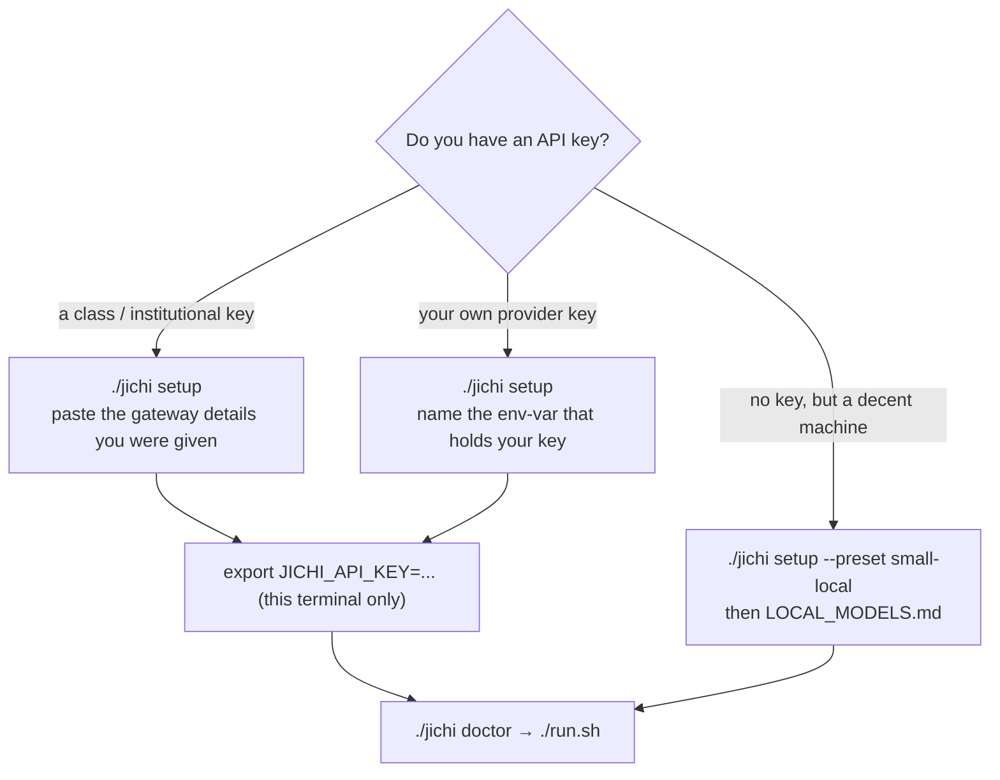

# Preparing your system and building jichi — the complete walkthrough

This is the **from-nothing** guide: it assumes you have a computer and an
internet connection and takes nothing else for granted. If you have compiled C
before, `docs/BUILD.md` is the terse version and will be faster. If the words
"terminal", "package manager", or "clone" are new, you are in the right place —
read straight through.

**Why you compile it yourself.** jichi is distributed as *source code*, not as a
ready-made program. You run a single command (`make`) that turns the source into
the two programs, on your machine, for your machine. This keeps the whole thing
small, auditable, and dependency-light — and, if you are learning, **building it
is the first exercise of the curriculum**: a real program, a real toolchain, a
real green result at the end.

The whole process is five steps:


Fifteen minutes on a normal connection. Pick your system:

- [Linux](#linux) — the primary platform, and **verified**
- [macOS](#macos) — instructions written with care and **never compiled by us**
- [Windows (via WSL)](#windows-via-wsl) — you run Linux *inside* Windows, and this
  walkthrough is **verified**: executed end to end at M475, by a non-root user,
  against pristine HEAD, with the full `make ci` green

> **Read this before you pick the macOS row.** The macOS section below is honest
> instruction that has **never been executed end to end**. No Mac and
> no WSL install has ever built this source tree. What that means concretely —
> including one macOS-only line that was un-compilable for months and nobody
> noticed — is [`PLATFORMS.md`](PLATFORMS.md). You are welcome here; you are just
> also the first, and if you send back what happened it becomes a row on that page.

Then everyone: [Get the source and build](#everyone-get-the-source-and-build) →
[Verify](#everyone-verify-it-works) → [Point it at a model](#everyone-point-it-at-a-model).

---

## The terminal, in one paragraph

Everything below happens in a **terminal** (also "shell", "command line"): a
window where you type a command, press Enter, and read the result. A line that
starts with `$` in this guide means "type what follows the `$` and press Enter"
— do not type the `$` itself. A command either prints something or prints
nothing and returns you to a fresh prompt; **no output is usually success.** If a
command needs administrator rights it starts with `sudo` and will ask for your
login password (the typing is invisible — that is normal; type it and press
Enter).

---

## Linux

### 1. Open a terminal

- **GNOME** (Ubuntu, Fedora Workstation, Debian default): press the Super/Windows
  key, type `Terminal`, press Enter. Or `Ctrl`+`Alt`+`T`.
- **KDE**: the app is **Konsole**.
- Any desktop: look for "Terminal" in the applications menu.

### 2. Find out which distribution you have

Different Linux families install software differently. Run:

```sh
$ cat /etc/os-release
```

Read the `ID=` and `ID_LIKE=` lines. Match yours to the table below.

### 3. Install the build tools

Copy the one line for your family and run it. It installs: a **C compiler**
(turns source into a program), **make** (runs the build), **git** (downloads the
source), **libcurl's headers** (so jichi can talk to a model over the network),
and **pkg-config** (helps the build find libcurl).

| Your system (`ID`/`ID_LIKE`) | One command |
| --- | --- |
| Debian, Ubuntu, Mint, Pop!_OS, elementary | `sudo apt update && sudo apt install -y build-essential libcurl4-openssl-dev pkg-config git` |
| Fedora, RHEL, CentOS Stream, Rocky, Alma | `sudo dnf install -y gcc make libcurl-devel pkgconf-pkg-config git` |
| Arch, Manjaro, EndeavourOS | `sudo pacman -S --needed base-devel curl pkgconf git` |
| openSUSE | `sudo zypper install -y gcc make libcurl-devel pkg-config git` |
| Alpine | `sudo apk add build-base curl-dev pkgconf git` |

If `sudo` says your user is "not in the sudoers file", you are not an
administrator on this machine — ask whoever is, or on a lab machine the tools are
often already installed (skip to *Get the source*).

### 4. Confirm the tools are there

```sh
$ gcc --version        # or: cc --version
$ make --version
$ git --version
```

Each should print a version line. If any says "command not found", step 3 did not
complete — re-read its output for an error.

Now jump to [Get the source and build](#everyone-get-the-source-and-build).

---

## macOS

### 1. Open the Terminal

Press `Cmd`+`Space` (Spotlight), type `Terminal`, press Enter. It lives in
*Applications → Utilities → Terminal*.

### 2. Install the Apple command-line tools

These give you a C compiler, `make`, and `git` in one step:

```sh
$ xcode-select --install
```

A dialog appears — click **Install** and wait for it to finish (a few minutes).
You do **not** need the full Xcode app, just these tools. Verify:

```sh
$ cc --version
$ git --version
```

### 3. Install Homebrew and libcurl's headers

macOS ships libcurl but not its development headers, which the build needs.
**Homebrew** is the standard way to add them. If you do not have Homebrew
(`brew --version` says "command not found"), install it:

```sh
$ /bin/bash -c "$(curl -fsSL https://raw.githubusercontent.com/Homebrew/install/HEAD/install.sh)"
```

Follow its final "Next steps" note — it may tell you to run two `echo … >>`
lines to add `brew` to your `PATH`; do those. Then:

```sh
$ brew install curl pkg-config
```

### 4. Tell the build where Homebrew's curl is

Homebrew keeps its curl separate from the system one. Run this so the build finds
the newer headers (harmless to run even if you are unsure):

```sh
$ export PKG_CONFIG_PATH="$(brew --prefix curl)/lib/pkgconfig"
```

> This `export` lasts only for the current terminal window. If you open a new one
> before building, run it again — or add that line to `~/.zshrc` to make it
> permanent.

Now jump to [Get the source and build](#everyone-get-the-source-and-build).

**Honest status: jichi has never been compiled on macOS.** Not "untested in CI" —
never once, by anyone, as far as this project knows. The code is plain POSIX with
no Linux-only calls, which is a good *reason to expect* it to build, and it is not
evidence. The one exception, jichi's only macOS-specific code, spent months in a
state that could not have compiled under this project's own mandatory flags,
precisely because no compiler here ever read it
([`PLATFORMS.md`](PLATFORMS.md#the-finding-that-made-this-page-m400)).

So: expect it to work, expect to be the first to find whatever does not, and
please report it — `make check-target` plus `uname -srm` is all it takes to turn
this section into a verified row. `docs/BUILD.md` has the terse macOS notes.

---

## Windows (via WSL)

Native Windows is **not** supported — jichi is built on a Unix process model that
has no drop-in Windows equivalent (the precise map of where POSIX ends, and a
porting survey you can run as an exercise: [PORTING_WINDOWS.md](PORTING_WINDOWS.md)). That is not a dead end: **WSL** (Windows
Subsystem for Linux) runs a real Linux *inside* Windows, and jichi runs there
exactly as it does on Linux. This is the normal, supported way to use jichi on a
Windows machine.

### 1. Install WSL

Open **PowerShell as Administrator** (press Start, type `PowerShell`,
right-click *Windows PowerShell* → **Run as administrator**), then:

```powershell
wsl --install
```

This installs WSL2 and Ubuntu. **Restart your computer** when it asks. After the
restart, an Ubuntu window opens by itself and sets up — it asks you to choose a
**username** and **password** for your Linux system (write the password down;
you will type it for `sudo`). If no window appears, open Start and run **Ubuntu**.

If `wsl --install` reports it is already installed but nothing happens, run
`wsl --install -d Ubuntu` to add the Ubuntu distribution specifically.

### 2. You are now in Linux

The Ubuntu window is a Linux terminal. From here, **follow the Linux
instructions above** — you have Ubuntu, so use the Debian/Ubuntu line in step 3:

```sh
$ sudo apt update && sudo apt install -y build-essential libcurl4-openssl-dev pkg-config git
```

### 3. One important tip: where to put your files

WSL can see your Windows files under `/mnt/c/...`, but building there is **slow**.
Keep the jichi source inside the Linux filesystem instead — your Linux home,
`~`. The *Get the source* step below already does this if you run it from the
Ubuntu window (it clones into `~`). Do not clone into `/mnt/c/...`.

> To open your WSL files from Windows Explorer later, type `\\wsl$` in the
> address bar, or run `explorer.exe .` from inside WSL.

Now jump to [Get the source and build](#everyone-get-the-source-and-build).

---

## Everyone: get the source and build

From here the steps are identical on all three systems. Run them in the terminal
you prepared above.

### 1. Download (clone) the source

```sh
$ git clone <REPOSITORY-URL> jichi
$ cd jichi
```

Replace `<REPOSITORY-URL>` with the address you were given (it ends in `.git`).
`git clone` downloads the whole project into a new folder named `jichi`; `cd`
("change directory") moves you inside it. Everything below runs from here.

> **Nobody gave you a URL?** Then you cannot clone yet, and that is not your
> mistake: **jichi has no public repository address yet.** The public release is
> waiting on a licence decision (see the README's *License* section), so today the
> source reaches you one of two ways — a URL from a class, colleague or supervisor,
> or an archive.
>
> **If you have a `.zip` or `.tar.gz`:** unpack it, `cd` into the unpacked folder,
> and skip to step 2. You do not need `git` to *build* — only to clone.
>
> ```sh
> $ tar xzf jichi-0.9.0.tar.gz && cd jichi-0.9.0   # or: unzip jichi.zip && cd jichi
> ```

### 2. Build

```sh
$ make
```

This is the moment the source becomes two runnable programs. You will see a
stream of compiler command lines scroll past for a minute or two. **Success is
the absence of the word `Error`** and getting your prompt back. Two files now
exist in the folder: `jichi` (the agent) and `jichi-convert` (a config
converter).

If it stops with an error, read [When the build fails](#when-the-build-fails).

> **A habit worth forming now, because it is the one this project trusts.** Your
> eyes reading scrollback are a fine first check, but the *machine's* answer is the
> exit code:
>
> ```sh
> $ make; echo $?
> 0
> ```
>
> `0` means success; anything else means failure. Prefer that over searching the
> output, always — `CONTRIBUTING.md` and [`BUILD.md`](BUILD.md) make it a rule
> (**verify by exit code, never by grepping the output**) because this project has
> been bitten by the alternative: a gate once counted `not ok` lines in output that
> was never produced, and read "no failures found" as green over a test driver that
> had been broken for thirteen milestones. A test that never ran and a test that
> passed look identical to `grep`, and completely different to `$?`.
>
> Two traps that follow from it, worth knowing before they cost you an afternoon:
>
> - **`$?` belongs to the *last* command in a pipeline.** `make | tail` reports
>   `tail`'s success, not `make`'s. Redirect to a file, then check: `make > log 2>&1;
>   echo $?`.
> - **Read the tool's own exit-code contract.** `0`/non-zero is not universal:
>   `robocopy` returns `1` for "copied successfully", and some Windows tools return
>   non-zero to mean "restart required". Non-zero is not automatically failure — and
>   `0` from a *wrapper* says nothing about what it wrapped.

### 3. Build and run the self-tests (recommended)

```sh
$ make test
```

This compiles the test suite and runs it. The last line should read something
like `NNNN checks, 0 failures`. Zero failures means your toolchain is sound — a
good thing to confirm before trusting anything else, and the first "green result"
the curriculum asks you to produce.

---

## Everyone: verify it works

```sh
$ ./jichi --version
$ ./jichi doctor
```

`./jichi` means "run the jichi program in *this* folder" — the `./` is required.
`--version` prints the version. `doctor` runs a health check. You'll see
something like:

Before the checklist, `doctor` prints a short hint to *stderr* — read it, it is
telling you the truth about a fresh machine:

```
No config found and no API key set. Run `jichi setup` for a guided setup, ...
```

Then the checklist. On a machine with no config file yet, it looks like this:

```
✓ libcurl available (networking enabled)
✓ config source
    built-in defaults
✓ configuration loaded
    1 model(s); active: ? (claude-opus-4-8)
! no API key for the active model
! no pricing for the active model: every cost reads $0.00
```

Three things to understand here, because they surprise everyone:

- **A line beginning `✗` is a real problem; `!` is a warning.** Both `!` lines
  above are expected on a fresh machine — you configure a model next.
- **You have not configured a model, yet one is listed.** With no config file,
  jichi falls back to a **built-in default** (`claude-opus-4-8`, Anthropic's API).
  That is what `config source: built-in defaults` means. Nothing is wrong; it just
  means the next section is not optional — without a key, your first prompt will
  fail with an authentication error against a service you never chose.
- **The `?` before the model id is not an error.** It is the model's *name*, which
  the built-in default does not have. Once you configure one, your name appears.

To run `jichi` from anywhere without the `./` prefix, you can install it:

```sh
$ make install PREFIX="$HOME/.local"   # no sudo; needs ~/.local/bin on your PATH
```

This is optional — everything works from the build folder with `./jichi`. A
system-wide `sudo make install` (into `/usr/local/bin`) also works, but installing
into your own `~/.local` avoids the single most common confusion later: two copies
of `jichi` on your `PATH`, where your freshly built one is not the one that runs.
[INSTALL.md](INSTALL.md) has the diagnosis if that ever happens to you.

---

## Everyone: point it at a model

jichi is the *driver*; it needs a *model* (an LLM) to drive. You have three
routes — pick the one that fits:



| You have… | Do this |
| --- | --- |
| an **institutional key** (e.g. issued in class) | `./jichi setup` and follow the prompts; paste the gateway details you were given |
| **your own API key** for any provider (OpenAI-compatible) | `./jichi setup`; name the environment variable that holds your key (see below) |
| **no key, but a decent machine** | run a local model — `./jichi setup --preset small-local` — and see [`docs/LOCAL_MODELS.md`](LOCAL_MODELS.md) |

`setup` writes a config file for you and **never stores your key** — it stores the
*name* of an environment variable, and you put the key in that variable:

```sh
$ export JICHI_API_KEY=sk-your-key-here     # the name is up to you; match setup
$ ./jichi doctor                            # now checks the model is reachable
$ ./run.sh                                  # start an interactive session
```

> The `export` above lasts **only for this terminal window** — open a new one and
> you must run it again, or add the line to your `~/.bashrc` (or `~/.zshrc`) to
> make it permanent.

The env-var name (`JICHI_API_KEY` is the default; `JLU_API_KEY` in JLU materials)
is just a label — use whatever you told `setup`. Because the key lives in the
environment and not in the file, the config is safe to share or commit.

**Learning with jichi?** Use `./jichi setup --preset learner` — one command that
sets up the assignment/tutor features, then start with
[`docs/TUTORIAL_BEGINNER.md`](TUTORIAL_BEGINNER.md).

---

## When the build fails

Read the **first** error, not the last — later errors are often knock-on
effects. Common ones:

| Message contains… | Cause | Fix |
| --- | --- | --- |
| `curl/curl.h: No such file or directory` | libcurl's *headers* are missing (the runtime library alone is not enough) | install the `-dev`/`-devel`/`curl-dev` package for your distro (step 3) |
| `make: command not found` | the build tools did not install | re-run the install line for your system; on macOS re-run `xcode-select --install` |
| `cc: command not found` / `gcc: command not found` | no C compiler | Debian/Ubuntu: `build-essential`; macOS: the command-line tools |
| `Permission denied` running `./jichi` | the file is not marked executable (rare after `make`) | `chmod +x jichi` |
| `pkg-config: command not found` | the finder tool is missing | install `pkg-config` / `pkgconf` (step 3) |
| errors mentioning `/mnt/c/` on WSL, or a very slow build | the source is on the Windows filesystem | move it into your Linux home: `cp -r /mnt/c/…/jichi ~/jichi && cd ~/jichi` |
| the build works but `./jichi doctor` says "no networking" | you built without libcurl headers | install the `-dev` package, then `make clean && make` |

Still stuck? `make info` prints what the build detected about your toolchain —
useful to include if you ask for help. The exhaustive platform reference,
including static/musl builds and cross-compilation, is
[`docs/BUILD.md`](BUILD.md); the requirements and RAM tiers are in
[`docs/INSTALL.md`](INSTALL.md).

---

## What you did, and what is next

You installed a toolchain, fetched source, compiled two real programs, and ran a
test suite to green. That is the ground floor of software development, and you did
it before writing a line of your own — which is the point of doing it first.

Next: [`docs/TUTORIAL_BEGINNER.md`](TUTORIAL_BEGINNER.md) for your first session,
or `./jichi setup --preset learner` if you are here to study.

See also: [`docs/INSTALL.md`](INSTALL.md) (system requirements),
[`docs/BUILD.md`](BUILD.md) (terse per-platform reference),
[`docs/LOCAL_MODELS.md`](LOCAL_MODELS.md) (run without any API key),
[`docs/SETUP_WIZARD.md`](SETUP_WIZARD.md) (the `setup` flow in depth).
