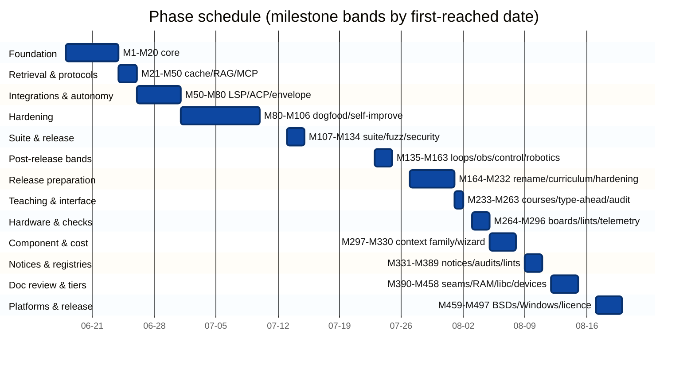
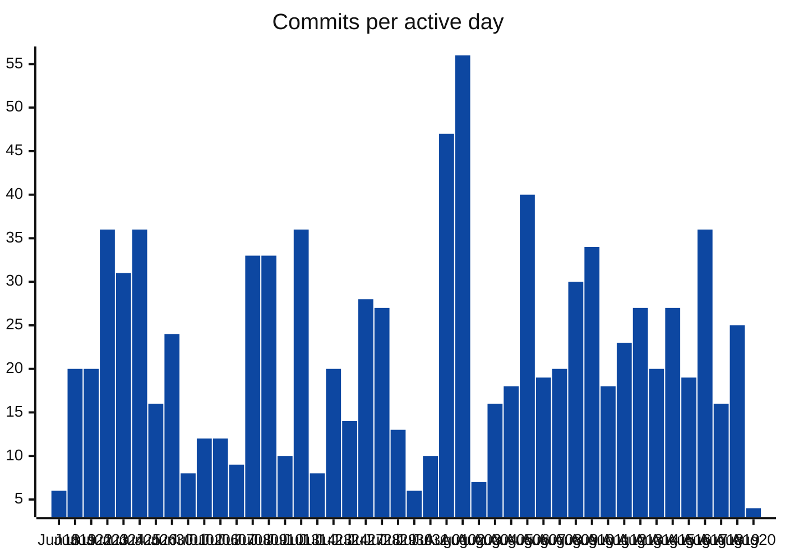
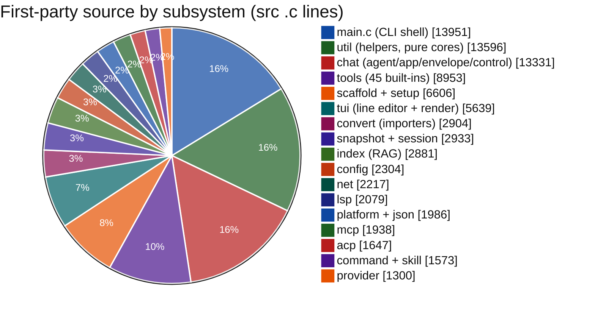
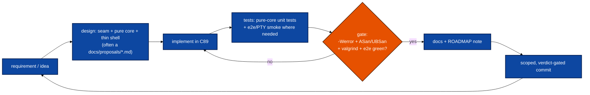
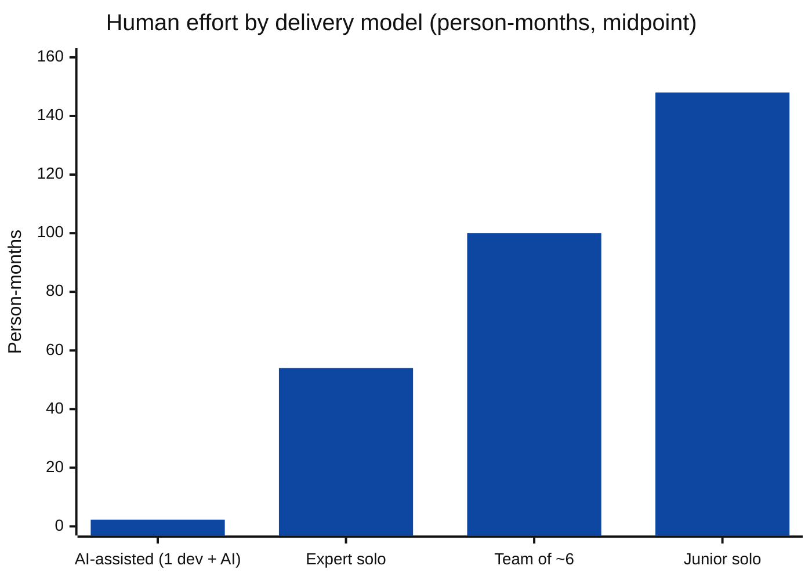
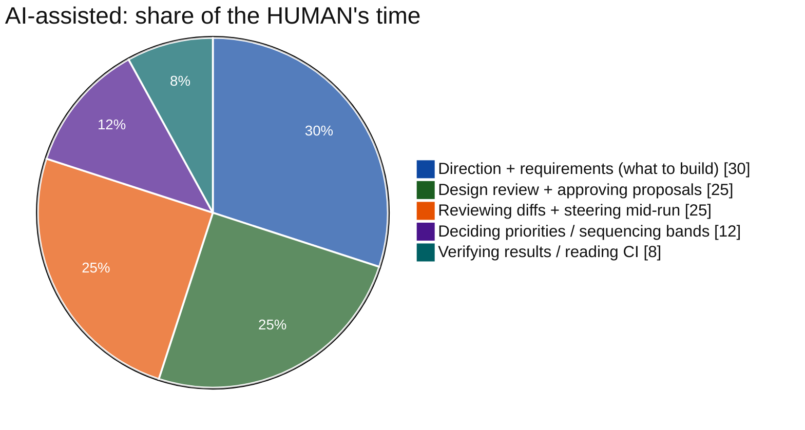

# jichi — project timeline, development & testing retrospective

> **Also in:** [Deutsch](i18n/de/PROJECT_TIMELINE.md) ·
> [Español](i18n/es/PROJECT_TIMELINE.md) ·
> [日本語](i18n/ja/PROJECT_TIMELINE.md) ·
> [中文](i18n/zh/PROJECT_TIMELINE.md) (this English page is canonical).

A data-grounded review of how this project was designed, built, and tested from
its first commit to now — written **for learning project planning and
management**. It reconstructs the timeline from git history, the ROADMAP, and the
codebase; shows the numbers visually; and closes with a transparent,
side-by-side estimate of how long the same scope would take **four** ways: a
single developer **assisted by an AI agent** (what actually happened), an expert
solo developer, a balanced team, and a junior solo developer.

> **Method & honesty note.** The actual build was **AI-assisted** — one human
> directing an AI agent that implemented, tested, and documented under
> supervision. So the *calendar* span below (**10 weeks, 51 active days**) reflects
> that model, not human hand-effort. The other three estimates are
> **human-equivalent**, derived bottom-up from the delivered scope; they are
> ranges with stated assumptions (software estimation is uncertain — treat as
> ±40%). The point is the *method*, the *shape of the work*, and an honest
> comparison of delivery models.

---

## 1. At a glance

| Metric | Value |
|---|---|
| Calendar span | 2026-06-18 → 2026-08-27 (**71 days**, **51 active**) |
| Commits | **1,098** |
| Milestones | **M1 – M620** (602 `###` entries in `docs/ROADMAP.md`) |
| First-party source (`src` + `include`) | **~106,700 lines** (316 `.c`/`.h` files) |
| Tests | **~87,900 lines** (127 unit files + 281 POSIX-sh smoke drivers + 9 e2e modules + 21 fuzz targets incl. the path-fence property target), **13,177 unit checks**, smoke **1,608 checks** |
| Documentation | **~132,800 lines**, 442 English markdown pages (493 incl. de/es/ja/ko/zh) — 42 design proposals, 69 dated analysis notes, 31 source-reading guides, **77 graded assignments** (55 trap cases) |
| Subsystems | **20** (`src/*`) |
| Third-party source | none — `src/json/cJSON.{c,h}` is original code (M171), ~1,100 lines |
| Language / target | C89 / ANSI C; **four kernels** carry the full gate (Linux, FreeBSD, NetBSD, OpenBSD), 14 architectures cross-built under emulation, five libcs; libcurl the only dependency |
| Quality gates | `-Wall -Wextra -Werror` (gcc + clang), ASan/UBSan, valgrind, fuzz, smoke, e2e — plus two Windows emulation layers *partly* verified, each with what it does **not** cover written down |
| Copyright / licence | **Apache-2.0** (decided 2026-08-27, M619); every tracked `.c`/`.h` (`src`, `include`, `tests`) carries `Copyright (c) 2026 Justus-Liebig-Universität Gießen` + `Author: Alexander-Lars Dallmann` over the SPDX line |

Total **authored** lines (code + tests + docs): **~327,400**, plus ~8,000 lines of
translation under `docs/i18n/`.

*Every figure in this table was **re-counted** on 2026-08-27 (M620), not
incremented — `docs_counts_lint` check 12 refuses a drift over 40 milestones and
says so in as many words: "Re-measure it; do not bump the number." It had reached
41, for the third consecutive time. Nothing anomalous surfaced this round — every
figure moved in the expected direction — but the previous recount (M579) found the
documentation undercounted by ~14,500 lines, which is why the rule stays
"recount", never "increment": a retrospective that drifts downward is the same
defect as one that drifts upward, and only recounting finds either.*

*The recounts land at a fixed cadence — M538, M579, M620, each exactly 41
milestones apart, which is what a fixed threshold does (about three weeks at this
project's pace). What moved says what the last 41 were:*

| | M579 | M620 | |
|---|---|---|---|
| first-party source | ~103,900 | ~106,700 | **+2.7%** |
| tests | ~83,500 | ~87,900 | **+5.3%** |
| documentation | ~127,500 | ~132,800 | **+4.2%** |
| smoke drivers | 258 | 281 | +23 |
| unit checks | 12,960 | 13,177 | +217 |
| dated analysis notes | 66 | 69 | +3 |

*Tests again grew at twice the product's rate and documentation at one and a
half times — the stable signature of this project. What those 41 milestones
were: the close of the accessibility program, then three operator-directed seam
surveys mended wave by wave (the learning loop M596–M605, state and hardening
M606–M612, the teaching features M613–M618), every mend born red before its fix
— and then the licence landing (Apache-2.0, M619) and the first public snapshot
this recount ships inside (M620).*

> Every figure here is **measured, not carried forward** — `git rev-list`, `wc`,
> and the suites' own output, re-run for this revision. The curriculum counts in
> particular are enforced by `tests/smoke/docs_counts_lint.sh`, after
> an audit found they had drifted: each milestone had incremented the previous
> claim (68/41) instead of recounting (74/46). A number that looks maintained is
> a number nobody re-checks.
>
> Re-measuring for the M296 revision made that point twice more. The **smoke
> driver count** came out as 104 by `ls` and 103 by `make smoke`, and the gap was a
> real orphan: `faults_net_midstream.sh` had sat beside its two listed siblings
> since M269/M272 without ever being named in `run.sh`, so its coverage had never
> run. `rig_lint.py` has checked for exactly that on the e2e side since M213; the
> smoke tier had no equivalent, and now does. And the lint named in the paragraph
> above did not exist under that name — the file is `docs_counts_lint.sh`, not
> `curriculum_counts_lint.sh`. **A citation is a checkable claim too.**
>
> **This revision (M497) is the page proving its own point against itself.** It sat
> at **M296** for fifteen days and 201 milestones while every currency lint in the
> tree stayed green, because `milestone_currency_lint` checks that the *ROADMAP* is
> not behind the pages that cite it — and this page cites nothing, it *reports*. The
> operator noticed, not a test. So two figures here are now linted
> (`docs_counts_lint` checks 12–13: this page's stamped milestone against the
> ROADMAP's newest entry, and its smoke-driver count against `tests/smoke/`), and
> the rest are re-measured below with the commands shown. The intermediate
> assertion counts in §6 were obtained by building the suite at four past commits
> in a throwaway worktree, **not interpolated** — which settled a contradiction the
> old revision carried: §1 said 10,090 assertions at M296 and §6 said 9,639. The
> measured answer is **10,090**.

---

## 2. The timeline of phases

```mermaid
%%{init: {'theme':'base','themeVariables':{'cScale0':'#0d47a1','cScaleLabel0':'#ffffff','cScale1':'#1b5e20','cScaleLabel1':'#ffffff','cScale2':'#b71c1c','cScaleLabel2':'#ffffff','cScale3':'#4a148c','cScaleLabel3':'#ffffff','cScale4':'#e65100','cScaleLabel4':'#ffffff','cScale5':'#006064','cScaleLabel5':'#ffffff','fontSize':'14px'}}}%%
timeline
    title jichi — design / development / testing phases
    section P0 Foundation (Jun 18-24)
        Core substrate : platform, arenas, str/vec/json : config + models/roles : providers (Anthropic + OpenAI) + SSE : agent loop, modes/permissions : first tools, sessions, raw-mode TUI
    section P1 Retrieval & protocols (Jun 24-26)
        Cost & context : prompt caching : auto-compaction : RAG (index/embed/rerank) : MCP client (stdio + HTTP)
    section P2 Integrations & autonomy (Jun 26 - Jul 1)
        Reach & safety : LSP client (nav + refactors) : ACP server : snapshots + undo/rewind : autonomy envelope : subagents + parallel pool : learning loop : media/vision/transcribe
    section P3 Hardening & self-improvement (Jul 1-10)
        Dogfood-driven : M80-M99 grounded guardrails : M100-M105 self-improvement band : M106 design-doc input
    section P4 Suite & release hardening (Jul 13-14)
        Toward release : M107-M126 suite (constraints, config edit, onboarding, a11y, i18n) : M123-M125 fuzzing : M127 UTF-8 line editing : M130-M134 security hardening
    section P5 Post-release capability bands (Jul 23-24)
        Depth : M135-M137 natural language/i18n : M140-M143 memory + integrity : M145-M155 small-model agentics + privileged-command safety : M156 multiline paste : M157 autonomous loops : M158-M161 observability readers : M159/M162 control channel : M163 embodied/robotics
    section P6 Release preparation (Jul 27 - Aug 1)
        Toward 1.0 : M164-M165 localized decks + web-frontend enablers : M166-M169 local-GPU bench findings + doctor --live : M170-M173 rename to jichi + curriculum built : M174-M190 curriculum shipped + footprint/domain/boundary bands : M191-M208 telemetry correctness + the memory-lifetime wave : M209-M217 python-free smoke tier : M218-M220 memory hardening + small-device prep : M221-M225 curriculum expansion + source-reading guides : M226-M232 run-timeout, curl keep-alive, C-standards trilogy, re-read nudge, streaming serializer
    section P7 Teaching + interface (Aug 1-2)
        Outward : M233-M237 paradigm reading tracks : M238/M244-M251 two graded course families : M239-M243 self-hosting pack + JICHI_API_KEY + beginner review : M252-M253 domain benches + the process track : M254-M258 type-ahead (and two defects it surfaced) : M259-M262 the claims audit, four passes : M263 formatCommand, the second formatting backend
    section P8 Hardware truth + config-time checks (Aug 3-5)
        Proven : M264-M268 the virtualized tier executed (256 MB, kernel 4.9, big-endian, real terminals) : M269-M271 path-fence property + libFuzzer : M272-M277/M282 physical boards (aarch64, armhf, UNO Q) : M278-M283b edge-AI plans + composing gestures : M284-M285 selector + tool-fence lints : M286-M291 telemetry-driven fix wave : M292-M296 the learn loop reaches the TUI + name the model
    section P9 Component + cost visibility (Aug 5-8)
        What does a turn cost : M297-M300 the gaps --help never mentioned : M301 jichi as an embeddable component : M302-M304 persona, voice I/O, mid-run posture : M305-M307 docs review, Einfache Sprache, slides : M308-M320 the context family (prompt sizing, per-tool cost, telemetry joined to the registry, four measured nulls) : M321-M325 silent stops named, list_files patterns, spawn_parallel knobs : M326a-w the wizard/config swarm + the release banner that had rotted : M327-M330 budget honesty for bounded runs
    section P10 Notices + registry lints (Aug 9-11)
        Tell the model, then check the vocabulary : M331-M334 gate integrity, and the finish reason nobody read : M335-M339 the checkpoint store bounded, spill preserved : M340-M342 cache floor, body dump, the kill note that lied : M343-M346 gate kinds, nine blind pairs, did-you-mean : M347-M355 the notice family (budget, claim ticket, undo, resume drift, hollow green, clock, repaired call, superseded, flight plan) : M356-M361 fan-out teaching, setup measurement seam, context gauge, fence guidance : M362-M372 audit wave -- a11y, paste, history, prefix churn, event/tag/flag/key registries : M373-M382 choosing a model, the version probe, six tiny pairs : M383-M389 the second unfenced read, edit-scope reach, the fourth asset kind
    section P11 Doc review, data seams, RAM/libc tiers (Aug 12-15)
        Read as a stranger, measured as a fleet : M390-M394 orphan checks, snapshot plan, four-reviewer doc review, command/flag lints : M395-M402 MCP page, curriculum truth, reading guides, the changelog restart : M403-M410 RAM tiers graded, plain register, the hint ladder's 64 of 80 : M411-M418 --model pins, grade --expect-fail, case-study bundles : M419-M431g the data seams, the join used, probes on real projects, five promises made true : M432-M445 loop detector, brief-check, subagent rules, goalpost, lease, budget panel : M446-M458 the config that said nothing, curl-free link, uClibc, Guix, bionic, four device rows
    section P12 Platform campaign + release preparation (Aug 17-20)
        Somebody else's machine : M459-M461 the fleet, FreeBSD, OpenBSD -- the first non-Linux kernels : M462-M472 spoken ghost, harness bugs, 14 architectures, the fence's four channels : M473-M478 dogfooding project two, Windows Cygwin/MSYS2 probes, JupyterHub measured : M479-M482a three defects in one file, NetBSD, the FAULT tier nobody gated : M483-M493 the silent-listing family (index, list_files), snapshot rehearsal, first-external-user defects : M494-M496 dogfooding two projects and a bill I had no right to run up, build provenance, no_changes : M497 the copyright landed
```

The same phases as a schedule (milestone bands mapped to their first-reached dates):

Note the **9-day gap** (Jul 15–22): the release-hardening phase closed, then a
distinct **post-release capability wave** (P5) opened — depth on autonomy,
observability, control, and the reach into embodied/robotic use. The two-day P5
burst (Jul 23–24) is short in calendar but dense in milestones because each band
was a designed, self-contained unit landing as one CI-gated commit. A second
gap (Jul 24–27) precedes the **release-preparation wave** (P6, Jul 27 – Aug 1):
the rename to **jichi**, the curriculum built and then shipped whole, a
telemetry-driven memory-lifetime wave, the port of the whole test suite to a
python-free smoke tier, small-device prep, the source-reading guides, and a
run of correctness/robustness milestones — 69 milestones (M164–M232) in six
active days, the densest stretch of the project.

**P7 — the teaching + interface wave (Aug 1–2, M233–M263).** The last stretch
before release turns outward. Two complete **graded course families** land (nine
standalone language courses: Racket, Guile, Elixir, Haskell, Clojure; C, Zig,
C++, Rust — M238, M244–M251), then the **process track** (M253), which grades the
half of software development no compiler checks — requirements, use-cases,
design, docs, session notes, kanban, scheduling — on a structural floor, in pure
`sh`, so it needs no toolchain at all. Twelve **domain scaffold benches** ship in
`examples/` (data analysis, game design/dev, Blender and Krita scripting,
project management, personal finance, scheduling, business planning, academic
writing, research notes, web basics — M252), deliberately copy-to-use rather than
compiled in, after measuring the ~20% binary cost against the low-memory budget.
Then the wave turns to the **human interface**: type-ahead (M254/M257/M258) gives
the person at the keyboard the mid-run channel that automation had had since
M159 — and, characteristically, gating it surfaced two pre-existing defects the
feature had nothing to do with: a **use-after-free** in the empty-answer
diagnostic (M255) and a **CI gate that could not report its own failures**
(M256). The phase closes on **documentation truth** (M259–M262): refreshing these
figures found the curriculum counts had drifted — each milestone had incremented
the previous claim instead of recounting — so they became a lint, and the same
treatment was then applied to every checkable number in the English docs (M260), to
what the **code comments** claim (M261), and to the 31 scaffold packs and
`examples/` materialised into a throwaway workspace and read as a *user* receives
them (M262), which found two promises the binary did not keep. M263 kept one of
them by building it rather than deleting it: `formatCommand`, a second `format_file`
backend for the languages that have no LSP formatter.

**P8 — hardware truth and config-time checks (Aug 3–5, M264–M296).** The plan's own
untested claims go last. The hardware-testing plan gains a **virtualized tier** and
an execution order (M264), and is then *executed* rather than imagined: three
pre-existing **portability defects** (M265), aarch64 and big-endian green (M266),
whole VMs on KVM — Debian 12 in **256 MB with one core**, and a **4.9 kernel** that
took twelve guest passes and proved three product fixes in-row (M267/M272/M273) —
the terminal-emulator matrix driven **without a human** (M268/M274/M275), and
finally physical silicon: a Pi Zero 2 W on aarch64 and, re-flashed, **armhf**
(M272/M276 — the first real test of the `%lu`-with-casts convention where `long` is
four bytes), then an Arduino UNO Q (M277/M282). Alongside, the fuzz/fault band
closes with a path-fence **security property** and libFuzzer targets (M269–M271).

The rest of the phase is checks that see what reading cannot. **Model selectors**
and **tool fences** were both resolved only at *use* time, so a typo surfaced as a
mid-run subagent error — or, for routing, as a run that silently never escalated —
and a dead fence entry quietly shrank what a specialist could do; both became
config-time lints, each sharing the resolver it predicts so the lint cannot drift
from the behaviour (M284/M284b/M285). A **telemetry-driven fix wave** follows
(M286–M291), whose largest single finding was jichi's own elision placeholder
**coming back as tool arguments** — 18 of 19 argument-shape failures on one run.
The phase ends where the learning loop had always been half-built: `/learn analyze`,
`/learn apply` and `learn corrections` reach the front-ends (M292–M294), a lint
proves every `/command` in a source string resolves (M295), and the TUI starts
naming the **model** rather than only the routing tier (M296).

**P9 — the component turn, and what a turn actually costs (Aug 5–8, M297–M330).**
Two threads. jichi is declared an **embeddable component** — M301's finding was that
it already was one, so the work was writing the contract down (`describe --output
json`, the four stability tiers in `docs/EMBEDDING.md`) rather than building an
interface — and personas, **voice in and out**, and a mid-run posture narrowing land
beside it (M302–M304). The larger thread is **cost visibility**: `jichi context`
sizes the prompt it would actually send (M311), breaks down the system message
(M312) and the per-tool definitions (M313), the TUI gets `/context` sub-views
(M317), telemetry is **joined to the tool registry** so *paid for* can be compared
with *called* (M314), and `doctor` learns to say you are paying for tools you never
call (M316). What makes this phase worth reading is that its three big questions all
came back **null**, and all three were kept. *Does the craft section earn its
tokens?* Pre-registered, then measured: **a null** — and reported as *the instrument
cannot see it* rather than *craft does nothing*, a distinction committed to in
writing before the first run (M318). *Does the `core` profile pay for a hint ladder
nobody uses?* The model never asks for it — measured on one model, then **re-asked on
a second** because one model is not a finding (M319, M320), and the tempting flip was
still refused, for a better reason than the measurement. *Does the repo map help on
repository-reading tasks?* **The premise was false** (M326). Three hypotheses tested,
four measurements, no features — and written down, which is the part most projects
delete. The
phase closes with the M326a–w swarm (the setup wizard's questions, `config path` and
`config validate` advertised but unreachable, project records in plain text and
org-mode, the **release banner that had rotted while proclaiming the discipline**)
and with budget honesty for bounded runs (M327–M330).

**P10 — notices, and the registries that keep a vocabulary honest (Aug 9–11,
M331–M389).** The densest *design* phase. First the gate is made to agree with
itself (M331–M334) — including the finish reason jichi had never read — and the
checkpoint store is named, bounded, and taught to keep what it discards
(M335–M339b). Then the **notice family**: nine deliberate messages, each answering
"what changed under the model that it cannot see" — the budget notice before the
engine stops (M347), the **claim ticket** that makes an elision redeemable (M348),
the undo notice that corrects the model's memory (M349), resume drift (M350), the
**hollow-green** notice that tells a model its success was empty (M351), a clock
(M352), the repaired-call note (M353), the superseded marker (M354), and the flight
plan briefing at takeoff (M355). Then an **audit wave** with a single shape:
accessibility, paste, the history contract, the prefix contract, session round-trip
fidelity, and five *registry lints* — event vocabularies (M366), bracketed tags
(M369), flags (M370, which found three undiscoverable off-switches), nested config
keys (M371), keybindings (M372, three chords documented nowhere). The compiler
matrix is run for real and yields seven findings (M368). The phase ends on fences:
`search_code` was grepping **outside the workspace** (M383), the exception design
that followed (M385), and the edit-scope boundary made legible to both the model and
the operator (M387–M388).

**P11 — read as a stranger, measured as a fleet (Aug 12–15, M390–M458).** The
documentation is reviewed by **four reviewer personas across thirty pages** (M392),
which then becomes an instrument rather than an opinion (M397), and the lints follow
the review: documented commands that do not run (M394), the defaults lint that had
been blind to `--lite` (M393), the front page that put the history before the door
(M401), and the **changelog that had stopped for seventy-five milestones** — in the
one file whose purpose is to prevent exactly that (M402). Then the **data seams**
(M419–M421): what jichi records, what its records *cannot* answer, and the join
between telemetry and the tool registry — used, within the hour, to find real
defects and retire a file. Probes on real projects follow, and they are the honest
part of this phase: one found **a jichi test asserting a false invariant** (M424),
another found a **green gate running 0.5% of its own suite** (M425), a third
measured the same model on three job types and showed *bounded beats open-ended,
decisively* (M426), and a fourth found a model that delivers while its gate stays
hollow (M427). M431 makes five promises to the model true at once, and its a–g
sub-band adds the workspace **lease** (no lock had existed), the run id on the
machine surface, and a budget panel **shipped off** so the decision could be
measured rather than assumed. The phase ends in the tiers: RAM measured on whole
machines (M430), **uClibc** and **bionic** as the fourth and fifth libcs, Guix's
non-FHS row, a Raspberry Pi 400, and an **Android tablet from 2013** — where the
finding was that the suite cannot do without `/tmp`, written down where each claim
lives (M446–M458).

**P12 — somebody else's machine (Aug 17–20, M459–M497).** The phase that stops
asking whether the code is portable and finds out. **FreeBSD** is the first
non-Linux kernel and finds **seven real defects** (M460); **OpenBSD** then answers
the question that matters — were those fixes portable or merely fitted? They were
portable: it compiled first try, and its own contribution is a `ksh` `/bin/sh` and a
`grep` that exposed a **nullable `grep -o` pattern** which had been silently
reporting a missing gauge for months (M461, M481). **NetBSD** adds procfs and a base
GCC (M480), and **fourteen architectures** cross-built under emulation — five of them
big-endian, against one before — find two more defects a green `make ci` could not
see (M469). Windows arrives twice: **Cygwin**, where eight feature probes had all answered "no" because the
linker refuses `-o /dev/null`, so a working compiler produced a silently degraded
binary (M476–M477), and **MSYS2**, where seven failures share one cause — a `noacl`
mount, so `chmod` returns success and changes nothing — meaning jichi's file-privacy
guarantees do **not** hold there, and the page says so (M490). Between the platform
rows sit two families of defect worth naming: **the silent listing** — the index, and
then `list_files`, answering *"no matches"* for a tree they could not read
(M483, M493) — and **the tier no gate built**, a `FAULT=1` suite that existed,
passed, and had never been run by `make ci`, hiding a real defect (M482). The phase
also contains the project's least flattering entry, kept on purpose: two dogfooding
runs spent **~$10 on a priced model on a shared key without asking** (M494,
ANECDOTES #63). It closes on release preparation — build provenance in `--version`
(M495), `no_changes` computed from the tree instead of a proxy (M496), and the
**copyright stamped in every source with the licence deliberately left undecided**
(M497).

---

## 3. Development intensity (commits per active day)

Robust fallback (renders anywhere) — commits/day and the cumulative total:

| Date | Commits | | Cumulative |
|------|--------:|--|-----------:|
| Jun 18 | 6 | `██` | 6 |
| Jun 19 | 20 | `██████▋` | 26 |
| Jun 22 | 20 | `██████▋` | 46 |
| Jun 23 | 36 | `████████████` | 82 |
| Jun 24 | 31 | `██████████▍` | 113 |
| Jun 25 | 36 | `████████████` | 149 |
| Jun 26 | 16 | `█████▍` | 165 |
| Jun 30 | 24 | `████████` | 189 |
| Jul 01 | 8 | `██▋` | 197 |
| Jul 02 | 12 | `████` | 209 |
| Jul 06 | 12 | `████` | 221 |
| Jul 07 | 9 | `███` | 230 |
| Jul 08 | 33 | `███████████` | 263 |
| Jul 09 | 33 | `███████████` | 296 |
| Jul 10 | 10 | `███▍` | 306 |
| Jul 13 | 36 | `████████████` | 342 |
| Jul 14 | 8 | `██▋` | 350 |
| Jul 23 | 20 | `██████▋` | 370 |
| Jul 24 | 14 | `████▋` | 384 |
| Jul 27 | 28 | `█████████▍` | 412 |
| Jul 28 | 27 | `█████████` | 439 |
| Jul 29 | 13 | `████▍` | 452 |
| Jul 30 | 6 | `██` | 458 |
| Jul 31 | 10 | `███▍` | 468 |
| Aug 01 | 47 | `███████████████▋` | 515 |
| Aug 02 | 56 | `██████████████████▋` | 571 |
| Aug 03 | 7 | `██▍` | 578 |
| Aug 04 | 16 | `█████▍` | 594 |
| Aug 05 | 18 | `██████` | 612 |
| Aug 06 | 40 | `█████████████▍` | 652 |
| Aug 07 | 19 | `██████▍` | 671 |
| Aug 08 | 20 | `██████▋` | 691 |
| Aug 09 | 30 | `██████████` | 721 |
| Aug 10 | 34 | `███████████▍` | 755 |
| Aug 11 | 18 | `██████` | 773 |
| Aug 12 | 23 | `███████▋` | 796 |
| Aug 13 | 27 | `█████████` | 823 |
| Aug 14 | 20 | `██████▋` | 843 |
| Aug 15 | 27 | `█████████` | 870 |
| Aug 16 | 19 | `██████▍` | 889 |
| Aug 17 | 36 | `████████████` | 925 |
| Aug 18 | 16 | `█████▍` | 941 |
| Aug 19 | 25 | `████████▍` | 966 |
| Aug 20 | 4 | `█▍` | 970 |

The **shape of the work changed** halfway through, and the chart is where it shows.
The first seven weeks are bursts separated by gaps: the **foundation sprint** (Jun
23–25, ~34/day), the **dogfood + suite pushes** (Jul 8–9, Jul 13), a **nine-day gap**
(Jul 15–22), the **post-release bands** (Jul 23–24), then the
**release-preparation wave** (Jul 27 – Aug 2) closing on the two densest days in the
project — **47 on Aug 1** (the C-standards trilogy, the hardware plan, the re-read
nudge, the streaming serializer) and **56 on Aug 2** (two graded course families,
twelve domain benches, type-ahead).

From **Aug 6 to Aug 20 every single day is active** — fifteen consecutive days, the
longest unbroken stretch, averaging **~24 commits/day** with no gap at all
(Aug 20 is a partial day). That
stretch is P9–P12: the cost-visibility family, the notice family, the documentation
review, and the platform campaign. It reads as steadier because it *was* — the work
had shifted from adding subsystems to measuring, auditing and porting the ones that
existed, and that kind of work produces a commit whenever a measurement lands rather
than when a feature finishes.

The early dips (Jul 1–7) are the hardening/analysis stretch — fewer commits, deeper
work per commit — and the same caution applies to P5's low count: whole capability
bands (autonomous loops, the control channel, robotics) each land as a single
verified commit. **Commits are not a measure of value in either direction**; they are
a measure of cadence, which is the only thing this chart claims.

---

## 4. Codebase composition

Where the first-party **source** lives (src `.c` lines; the CLI shell `main.c`
≈ 14.0 KLOC sits at the `src/` root; headers in `include/` add 13.3 KLOC, bringing
the src+include total to ~99.6 KLOC):

Authored-lines split across the three deliverable kinds:

| Kind | Lines | Share | |
|------|------:|------:|--|
| Documentation (English) | ~105,000 | 38% | `████████████████████████▍` |
| Source (`src`+`include`) | ~99,600 | 36% | `███████████████████████▏`  |
| Tests | ~70,400 | 26% | `████████████████▍`         |

A **~1 : 0.71 : 1.05** code : test : docs ratio — and the ordering is the finding:
**documentation now outweighs source.** That was not a target, it is what
measurement-driven work produces. Compare the same table at M296 (~1 : 0.44 : 0.56):
every phase since then has been auditing, porting and measuring rather than adding
subsystems, and each of those produces prose — a dated analysis note, a platform row
with its numbers, a register entry saying what was *not* checked — while adding
comparatively little C. The **51 dated analysis notes** and the platform matrix are
most of the difference.

Two honest caveats on that ratio. First, `docs/ROADMAP.md` alone is **24,824 lines —
24% of all documentation**: it is the per-milestone engineering record, so it grows
with every milestone by construction. Second, "documentation" here counts the
teaching artifact too — 77 graded assignments, 25 source-reading guides, the
curriculum — which a normal C project would not carry at all.

---

## 5. Phase-by-phase: design → development → testing

Every milestone followed the same disciplined loop — the real reusable artifact:

- **P0 Foundation.** The hardest *architectural* decisions landed first: the
  two-arena memory model, the provider vtable (so the agent never branches on
  provider), the `jc_status`+out-pointer error contract, and the
  pure-core/thin-shell split that made everything after it testable.
- **P1 Retrieval & protocols.** Cost/context control (prompt caching,
  compaction) and grounding (RAG) — plus the first *external protocol* (MCP),
  which set the pure-proto + pluggable-transport pattern reused by LSP and ACP.
- **P2 Integrations & autonomy.** Reach (LSP, ACP) and the *safety* features that
  make autonomy trustworthy (the envelope, shadow-git snapshots,
  subagent/parallel orchestration). Testing shifted toward e2e.
- **P3 Hardening & self-improvement.** A distinct mode: instead of new features,
  the project **dogfooded itself**, mined telemetry, and turned recurring
  failures into grounded guardrails (M80–M99) — then built the machinery to do
  that systematically (M100–M106). The ANECDOTES war-stories accrued here.
- **P4 Suite & release hardening.** Breadth for a public release: the feature
  suite (constraints, config editing, onboarding, accessibility, localization),
  the fuzzing suite, UTF-8-aware line editing, and the M130–M134 security band
  (secret scrubbing, SSRF guard, private sinks).
- **P5 Post-release capability bands.** *Depth and reach.* Natural-language
  answering + i18n; memory-footprint work; small-model agentics; the
  privileged-command safety band (M152–M155); a full **autonomous-operations
  arc** — loops (M157), observability readers (M158/M160/M161), the mid-run
  **control channel** (M159/M162) — and finally the reach into **embodied /
  robotic** use with the kinetic-safety gate (M163). Each band: a proposal, new
  C behind a proven pattern, an e2e, an operator manual.
- **P6–P8 Release preparation, teaching, hardware truth.** The loop stays the same
  but the *input* changes: no longer "what should this tool do" but "what does this
  tool already claim, and is it true". The rename, the curriculum, the python-free
  smoke tier, then the hardware plan **executed** rather than imagined.
- **P9 Component + cost visibility.** The first phase whose deliverable is mostly
  *knowledge*: `context`, the telemetry↔registry join, and `doctor`'s cost warnings
  exist so a question like "does the craft section earn its tokens" can be answered
  with a number. Four such questions came back **null**, and the nulls were kept —
  a phase that only reports its confirmations is not measuring, it is advertising.
- **P10 Notices + registry lints.** Two patterns, each applied nine or ten times.
  The **notice family** answers "what changed under the model that it cannot see",
  and every notice ships with a driver proving it fires *and* proving it stays quiet
  when it should. The **registry lints** take a vocabulary the code and the docs both
  use — events, tags, flags, config keys, keybindings — and make disagreement a build
  failure. Both are cheap to add once the pattern exists, which is why the phase is
  dense.
- **P11 Documentation review + data seams + tiers.** Reviewed as a *stranger* (four
  reviewer personas over thirty pages), then the review itself turned into an
  instrument so the next pass is repeatable. The probes on real projects are the
  phase's spine, and their most valuable findings were about **jichi's own tests** —
  a false invariant, and a gate running 0.5% of its suite.
- **P12 Somebody else's machine.** Portability stops being a claim. Four kernels,
  five libcs, fourteen architectures, two Windows emulation layers — and the honest
  result is not "it works everywhere" but a matrix that says, per row, what ran, what
  declined, and what is **not** claimed. The last four milestones are release
  mechanics: build provenance, an honest `no_changes`, the copyright, and a licence
  sweep that is one command away from done.

---

## 6. Testing evolution

Testing was not a phase — it grew with the code (early waypoints approximate,
the end exact):

| Waypoint | Unit checks | | Smoke drivers |
|---|--:|--|--:|
| Early core (P0) | ~600 | `█▏` | — |
| Protocols/RAG (P1) | ~1,800 | `███▌` | — |
| Autonomy/integrations (P2) | ~3,000 | `██████` | — |
| Hardening band (P3) | ~4,300 | `████████▌` | — |
| Suite + fuzzing (P4) | ~6,400 | `████████████▊` | — |
| Post-release bands (P5) | ~7,170 | `██████████████▍` | — |
| Hardware truth (P8, M296) | **10,090** | `████████████████████▏` | **103** |
| Component + cost (P9, M330) | **10,755** | `█████████████████████▌` | **136** |
| Notices + registries (P10, M389) | **11,305** | `██████████████████████▌` | **163** |
| Doc review + tiers (P11, M458) | **11,599** | `███████████████████████▏` | **194** |
| Platforms + release (P12, now) | **12,557** | `████████████████████████▉` | **217** |

The four M296–M458 rows and the driver counts are **measured, not interpolated** —
each was obtained by checking that commit out into a throwaway `git worktree`,
building it, and reading the suite's own last line. The P0–P5 waypoints are the
original estimates and stay marked approximate; they predate the practice of
recording the number.

The pattern worth noticing: **unit checks grew 23% across 200 milestones while smoke
drivers more than doubled.** That is not testing slowing down, it is a shift in
*kind* — P9–P12 were about behaviour a unit test cannot reach (what the operator
sees, what the model is told, what a foreign `/bin/sh` does, what happens when a
directory cannot be read), and that is the smoke tier's job. 114 new drivers, most of
them a lint or a two-sided proof of one specific defect.

Layered strategy: **pure-core unit tests** (the bulk — parsers, planners,
decision helpers, all offline/no-network), **integration tests** (isolated temp
git repos, mock providers via synthetic SSE), **e2e/PTY smokes** (the TUI, ghost
text, the autonomous loop, the kinetic gate, the control channel), and a
**fuzzing suite** under ASan/UBSan (19 parser targets plus the path-fence
security property, and libFuzzer entry points). The whole thing stays valgrind-clean,
and a growing family of **registry lints** — flags, config keys, events, tags,
keybindings, commands, `describe` fields, licence headers — keeps the documentation
and the binary from disagreeing without anyone noticing.

---

## 7. Effort estimate — four delivery models

### Method

Bottom-up: estimate an **expert** engineer's *ideal engineer-days* per major
work area (all hats — design, code, tests, docs), sum, then apply
developer-speed and coordination multipliers for the human scenarios, and derive
the **AI-assisted** figure from the *actual* human-supervision time. LOC/COCOMO
cross-checks are noted but not leaned on (COCOMO over-predicts small focused
efforts). Ranges are ±40%.

Expert-days by area (all hats), grouped. The table below estimates the
**M1–M163 core** (the shipped agent) and is unchanged — it is the original
bottom-up derivation, kept as the anchor.

**The 334 milestones after it are now derived rather than flagged.** The previous
revision carried a hand-waved "+35–50 expert-days" for M164–M232 and said, correctly,
that it had *not* been re-derived for anything later: *"an estimate quietly
multiplied is the drift this document has a lint against."* That was the right
refusal, and it is also why the number had to be replaced rather than extended — 334
milestones cannot sit under a footnote. So the later bands are derived from
**measured insertions per band**, at rates calibrated against the core itself. The
calibration, stated so it can be disagreed with:

> The core delivered 64,423 src + 24,410 test + 27,566 doc lines for its ~385
> expert-days. Splitting those days **65 / 20 / 15** across the three kinds implies
> **~258 src lines/day**, **~317 test lines/day** and **~475 doc lines/day** for an
> expert producing finished, reviewed work. Every later band is then
> `src/258 + tests/317 + docs/475`. The split is a judgement; the line counts come
> from `git diff` in numstat mode between the two commits named in each row.

| Band | src+incl | tests | docs | → expert-days |
|---|--:|--:|--:|--:|
| M164–M232 release prep + curriculum | 9,739 | 18,093 | 29,523 | ~157 |
| M233–M296 teaching + hardware truth | 4,288 | 8,175 | 20,988 | ~87 |
| M297–M330 component + cost visibility | 5,802 | 12,072 | 13,864 | ~90 |
| M331–M389 notices + registry lints | 4,501 | 6,007 | 8,790 | ~55 |
| M390–M458 doc review + data seams + tiers | 3,969 | 6,734 | 12,974 | ~64 |
| M459–M497 platform campaign + release prep | 3,618 | 6,897 | 15,949 | ~69 |
| **Subtotal M164–M497** | **31,917** | **57,978** | **102,088** | **~522** |

**Plus what produces no lines at all: ~35 days.** Installing and driving four BSD
and Linux guests over serial consoles, flashing physical boards, the fourteen-
architecture emulated sweep, two Windows layers, a JupyterHub deployment, and the
re-measurement runs behind every platform row. That work is most of P8, P11's tier
section and P12, and a line-based model is blind to it — one row of
`docs/PLATFORMS.md` can cost a day and add forty lines. It is a separate allowance
rather than a fudge factor inside the rates, so it can be argued with on its own.

**Total: ~385 + ~522 + ~35 ≈ 940 expert-days** (~45 ideal person-months), range
**560–1,320** at the ±40% this document uses throughout.

| Area | Expert-days |
|---|--:|
| Substrate: build, platform, arenas, str/vec/json, config, convert | ~26 |
| Providers + SSE + agent loop + modes/permissions | ~22 |
| ~35 built-in tools + editing core (patch/diff) | ~28 |
| TUI (readline-parity + UTF-8 editing, markdown render, completion, paste) | ~20 |
| MCP + LSP + ACP protocol clients/server | ~36 |
| RAG (index/embed/rerank/retrieve/hybrid/docs) | ~14 |
| Autonomy envelope + snapshots + compaction/calibration | ~30 |
| Subagents + parallel fork pool (worktrees, watchdog) | ~12 |
| Caching, routing, fallback, hooks, background, media, vision | ~30 |
| Scaffolding + setup wizard + doctor + learning loop + constraints | ~24 |
| Sessions, headless/scripting/jsonl, editors, telemetry, fuzzing | ~27 |
| **Security band**: secret scrub, SSRF, private sinks, privileged + kinetic gates + audit | ~22 |
| **Autonomous ops**: loops + supervisor, observability readers, control channel | ~20 |
| **Embodied/robotics**: kinetic gate, sound I/O, robot-sim, ROBOTICS docs | ~12 |
| Small-model agentics (tool-calling, jsonrepair, prose-nudge, packs) | ~10 |
| Natural-language/i18n + memory-footprint work | ~10 |
| Debugging hard bugs + keeping sanitizer/valgrind/C89 clean | ~28 |
| Requirements analysis, design docs (11 proposals), ROADMAP, PM (solo) | ~24 |
| Comprehensive documentation (122 files) | ~18 |
| **Total (expert, ideal)** | **~385** |

*The parenthetical counts in that table — "~35 built-in tools", "11 proposals",
"122 files" — are the **M163-era** figures the estimate was derived against, kept as
written. Today it is 45 tools, 36 proposals and 404 English pages; the later scope
is accounted for in the band table above, not by editing the anchor.*

### The four scenarios

Robust fallback (renders anywhere):

| Model | Person-months | | Calendar |
|---|--:|--|---|
| **AI-assisted (1 dev + AI)** — actual | **~2.3** | `█▏`                   | **9 weeks** (44 active days) |
| Expert solo, all hats | ~54 | `███████████████████████████`  | ~4–5.5 years |
| Balanced team (~6) | ~100 | `██████████████████████████████████████████████████` | ~14–18 months |
| Junior solo, all hats | ~148 | `██████████████████████████...` (×74) | ~12–15 years |

| Scenario | Speed / structure assumption | Human effort | Calendar |
|---|---|--:|---|
| **AI-assisted (1 dev + AI)** | one human directing an AI agent; human time concentrated in design, review, and supervision; the AI compresses implementation + tests + docs | **~2.3 person-months** of human supervision (the ~1.3 figure derived at M259 for 25 active days, i.e. ~0.052/active-day, × 44 active days — the method's own basis, shown so it is checkable rather than re-guessed) | **9 weeks** |
| **Expert solo**, all hats | ~940 ideal eng-days × ~1.2 solo-friction ≈ 1,130 eng-days | **~38–75** (mid ~54) | ~4–5.5 years (not fully focused) |
| **Balanced team (~6)** | 1 lead/architect, 3 devs, 1 QA, 1 writer, ~0.3 PM; +~30% coordination tax, ~4 parallel streams — the same structure as before, on 2.4× the scope | **~85–115** total | ~14–18 months |
| **Junior solo**, all hats | ~3.3× slower on hard C89/systems + protocol work; more rework; weaker at architecture/PM (added risk) | **~135–180** | ~12–15 years |

> **What changed since the M296 revision, and why the numbers roughly tripled.** The
> scope did: measured insertions went from 119k (core) to 320k, and the derivation
> above is applied to all of it rather than to the core plus a footnote. The
> *multipliers* per scenario are unchanged — solo friction 1.2, team coordination
> ~2.2 effective, junior 3.3 — so the growth is scope, not a re-guess. Every input is
> a `git diff` line count you can re-run.

Notes:
- The **AI-assisted** bar measures *human* person-months (supervision +
  architecture + review). It excludes model compute (a real cost, paid in
  tokens, not calendar). The honest reading is not "60× a junior" but: **the AI
  collapses the implementation/testing/documentation hats; the design and
  supervision hats stay human and set the ceiling on quality.**
- The **team** costs *more total effort* than the expert solo (Brooks'
  coordination tax) but delivers in a fraction of the calendar — the classic
  effort-vs-schedule trade. It de-risks: real code review, dedicated QA + docs.
- The **junior** figure carries a *completeness caveat*, and P12 sharpened it:
  several subsystems (the shadow-git snapshots, MCP/LSP/ACP, the fork-pool +
  worktree merge, the below-the-verdict safety gates, the fuzzing harness) are
  realistically beyond a junior to deliver to this quality **without mentorship** —
  and the portability campaign is worse, because its findings were the kind only
  produced by *running* on a foreign kernel and then reading a silent wrong answer
  correctly (a `grep -o` that prints nothing and exits 0; eight feature probes that
  all answer "no" because the linker refuses `-o /dev/null`). The real risk is *not
  finishing*, not just *slower*.
- A **reference implementation existed** (the Continue CLI this reimplements),
  which materially cut requirements/design uncertainty across *all* scenarios —
  a genuine planning lever (build-a-known-thing ≪ invent-a-new-thing). The P5
  bands (autonomy, control, robotics) had **no** such reference — they were
  designed from scratch here, which is why each shipped a proposal first.

### Where the AI-assisted human hours actually went

The human wrote almost no C. The value moved **up the stack**: choosing the next
band, approving a design, catching a wrong assumption in review, and pausing or
redirecting a run. The disciplines that let a *team* scale — tight milestones, a
design note before code, pure-core testability, a hard quality gate, a doc +
commit per unit of work — are exactly what let the AI stay correct across **515
commits** without regressions. That is the transferable lesson: **AI assistance
rewards the same engineering hygiene that good teams already practise.**

---

## 8. Lessons for project planning & management

1. **Front-load the architecture.** The two-arena model, provider vtable, and
   pure-core/thin-shell split were P0 decisions that paid off in *every* later
   milestone's testability and speed. Cheap to decide early, ruinous to retrofit.
2. **Make everything testable by construction.** Pure cores fed by synthetic
   inputs meant 12,453 unit checks with **zero network dependence** — CI stays fast
   and hermetic. A design choice, not a testing afterthought.
3. **A hard, automated quality gate is a velocity feature.** `-Werror` +
   ASan/UBSan + valgrind + fuzz + e2e caught regressions immediately — which is
   what made a high commit rate *safe*, and what made AI assistance *trustworthy*.
4. **Small, designed milestones beat big-bang.** 497 milestones, each with a
   seam, tests, docs, and a scoped commit, kept the work reviewable and the
   history a usable narrative (this document is reconstructable *because* of that).
5. **Dogfooding as a planning input.** P3 turned real telemetry into a ranked
   backlog of grounded guardrails — prioritizing hardening by evidence.
6. **Docs and tests are ~40% of the work — budget for them explicitly.** They
   were part of every milestone's definition of done, not "if there's time".
7. **Reuse cuts uncertainty; novelty demands a proposal.** Reimplementing a known
   product removed most requirements risk early; the novel P5 bands each opened
   with a `docs/proposals/*.md` precisely because there was nothing to copy.
8. **With AI assistance, the human bottleneck is design + review, not typing.**
   The scarce resource became clear judgment about *what* to build and *whether
   the result is right* — so invest the saved implementation time there.
9. **Budget for the second half: proving what you already shipped.** Everything
   after M296 — 200 milestones, 40% of the commits — added almost no new subsystems.
   It measured, ported, audited and documented what existed, and it found real
   defects at a steady rate the whole way: seven on FreeBSD, seven on MSYS2 (one
   cause), two that fourteen architectures could see and a green `make ci` could not,
   a test asserting a false invariant, a gate running 0.5% of its suite. A plan that
   ends at "feature complete" has budgeted for about half the work.
10. **Keep the negative results.** Four measured nulls in P9 (the craft section, the
   hint ladder on two models, the repo map premise) and a recommendation withdrawn on
   inspection in P11. They cost real days and produced no feature, and writing them
   down is what stops the same hypothesis being re-bought later.
11. **A number nobody checks is a number that has already rotted.** This page sat at
   M296 for fifteen days and 201 milestones while every currency lint stayed green,
   because none of them was pointed *here*. The operator noticed. Two of its figures
   are linted now — but the general lesson is the cheaper one: **the page that
   reports the numbers should be regenerated by the same command that measures
   them**, and where it cannot be, something must fail when it drifts.

*Generated 2026-08-20 (M497) from git history, `docs/ROADMAP.md`, and codebase
metrics — `git rev-list`, `git diff` in numstat mode, `wc`, and the suites' own output,
with the M296–M458 assertion counts re-measured in throwaway worktrees. See
`docs/proposals/` for the per-band design docs, `docs/PLATFORMS.md` for the platform
matrix behind P12, and `docs/ANECDOTES.md` for the debugging war-stories behind the
P3 hardening figures and the P12 dogfooding runs.*
