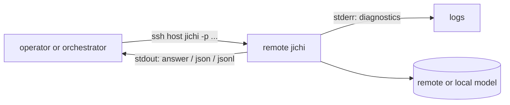

# Driving jichi on a remote server over SSH (headless)

jichi's headless mode ([SCRIPTING.md](SCRIPTING.md)) makes it a natural fit for
SSH: compose a prompt, run `jichi -p …` on the remote box, get the answer
on stdout. This guide covers both audiences — a **human operator** at a keyboard
and an **automating agent/orchestrator** — plus the security posture for running
an autonomous agent on a machine you care about.

Pair it with [TMUX.md](TMUX.md) (keep long runs alive across disconnects) and
[DEPLOYMENT.md](DEPLOYMENT.md) (the lean server config + disk hygiene).

## The shape of it



stdout carries **only** the answer (or structured events); stderr carries
diagnostics; `-q` silences stderr. That clean split is what makes it scriptable.

## Human operator

### One-shot questions and tasks

```sh
# ask about the remote repo (read-only):
ssh user@host 'cd ~/project && jichi --plan -p "where is auth handled?"'

# do a bounded autonomous task:
ssh user@host 'cd ~/project && jichi --auto \
  --verify "make test" --budget-tokens 500k -p "fix the failing parser tests"'
```

### Feed a big prompt over stdin (no ARG_MAX limit)

```sh
# pipe a local file as the prompt/context:
cat design-notes.md | ssh user@host 'cd ~/project && jichi -p -'

# or a heredoc:
ssh user@host 'cd ~/project && jichi -p -' <<'EOF'
Refactor the config loader to support an `extends` key. Keep it C89.
EOF
```

### Self-contained: ship the config inline (`--config-json`)

No config file on the remote box? Send the whole config with the command — the run
is then fully self-contained, no filesystem prep. Three transports, in increasing
order of what they protect:

```sh
# 1) base64 -- one flat, quoting-safe token (no escaped-quote soup over SSH).
#    The key stays in the REMOTE env via apiKeyEnv; the config itself has no secret.
CFG='{"models":[{"name":"m","provider":"openai","model":"gpt-4o-mini",
  "apiBase":"https://api.example.com","apiKeyEnv":"OPENAI_API_KEY"}]}'
B64=$(printf '%s' "$CFG" | base64 -w0)
ssh user@host "cd ~/project && jichi --config-json-b64 $B64 \
  --no-session -p 'where is auth handled?'"

# 2) stdin -- keeps the config OFF the remote argv, so it is NOT in `ps`:
printf '%s' "$CFG" | ssh user@host \
  "cd ~/project && jichi --config-json - --no-session -p 'where is auth?'"

# 3) encrypted at rest -- decrypt into the pipe with tooling you trust:
age -d config.age | ssh user@host \
  "cd ~/project && jichi --config-json - --no-session -p 'audit @diff'"
```

`--config-json*` parses the input as **the** config (no global/project merge, like
`--config <path>`); all config sources are mutually exclusive. Rules that matter on
a remote box:

- **base64 is transport, not secrecy.** It is trivially decodable and *still shows
  in `ps`*. Use it for quoting convenience, not to hide anything. To keep the config
  out of `ps`, use form **2 (stdin)**.
- **Never put a literal `apiKey` in the config.** Use `apiKeyEnv` (a variable
  *name*) and set the value in the remote environment (the "Keys via env" note
  below). `doctor` warns on a literal key; jichi never prints it.
- **Confidentiality is the transport's job, not jichi's.** The SSH pipe is already
  encrypted end to end; for at-rest secrecy pipe `age`/`gpg` plaintext into
  `--config-json -` (form 3). jichi ships no built-in cipher — see
  [the design note](proposals/2026-07-config-transport.md) for why (key-distribution
  paradox + the "libcurl + cJSON only" dependency rule).
- Config-on-stdin **consumes stdin**, so send the prompt with `-p "text"` or
  `--prompt-b64 "$(base64 -w0 < prompt.txt)"`, never a second stdin pipe.
- `ARG_MAX`: a very large config can exceed the argument limit — use stdin (form 2)
  or `scp` a file and `--config <file>`.

In bash/zsh (not POSIX `sh`), process substitution also works with the existing
`--config`, giving config and prompt separate fds:
`jichi --config <(age -d config.age) -p - < prompt.txt`.

### Long runs: don't hold the pipe open

An interactive SSH pipe dies with your connection. For anything long, run it
**inside tmux on the host** (see [TMUX.md](TMUX.md)) and detach:

```sh
ssh user@host
tmux new -d -s task 'cd ~/project && jichi --auto \
  --verify "make test" --deadline 2h \
  --journal ~/logs/task.jsonl -p "implement feature X" > ~/logs/task.out 2>&1'
# disconnect freely; reattach later: tmux attach -t task
```

## Automating agent / orchestrator

An orchestrator (a CI job, a cron, or another AI agent) drives remote jichi and
parses the result.

### Structured output

```sh
# one JSON object with the answer, cost, stop_reason, session_id, error:
ssh host 'cd ~/proj && jichi -q --output json -p "…"' | jq .

# streaming: one JSON object per event (message_start/text/tool_call/…/done):
ssh host 'cd ~/proj && jichi -q --output jsonl -p "…"' \
  | while read -r line; do echo "$line" | jq -r '.type'; done
```

Every event carries a schema version `v` and a `type`; the terminal `done`/json
object always appears (even on failure) with a precise `stop_reason`
(`done`/`interrupted`/`timeout`/`budget`/`verify_failed`/`error`) and a structured
`error{code,type,message}` — so an agent always gets a parseable result. Exit
codes: `0` ok, `1` error, `2` usage, `130` interrupted.

### The daemon over an SSH tunnel

For many quick requests, run the warm [daemon](DAEMON.md) on the host and forward
its socket:

```sh
# on the host (keep it alive in tmux):
jichi --config ~/proj/local/config.json daemon --socket ~/.jichi.sock

# forward the UNIX socket to your machine:
ssh -N -L /tmp/jichi.sock:/home/user/.jichi.sock user@host &
# then connect locally, no per-request startup cost:
jichi --connect /tmp/jichi.sock -p "what changed today?"
```

The daemon's bounded worker pool serves concurrent `--connect` clients, so an
orchestrator can fan out requests.

### Non-interactive by construction

- Pass the prompt explicitly (`-p`) or on stdin; jichi reads stdin as the prompt
  when none is given on a non-TTY. `--no-stdin` opts out.
- `ask_user` no-ops to "proceed" without a front-end, and `--auto` never prompts,
  so an unattended run **never hangs** waiting for input.
- `--no-session` skips session persistence for stateless automation.

## Security posture (running an agent on a real box)

- **Keys via env, never argv/config.** Set the model key from `apiKeyEnv`; jichi
  never writes it to config and redacts registered secrets from logs. Don't put
  keys on the `ssh` command line (they land in the remote shell history).
- **Bound autonomy.** For any `--auto` run: `--budget-tokens/-time/-tool-calls`,
  a `--verify` gate (roll back a red tree), and `--edit-scope "src/**"` to fence
  what it may write.
- **Path fence on.** Reads stay in the workspace (plus any `--reference-root`);
  writes stay in the workspace. It's auto-on in `--auto`.
- **Least privilege.** Run under a dedicated user; a shared model server keeps
  code/data on-prem. Prefer `--plan` (read-only) for exploration on a machine you
  don't fully trust jichi with yet.
- **Audit.** `--journal run.jsonl` records every model/tool call + outcome; the
  opt-in telemetry sink (written **outside** the workspace) aggregates across
  runs.

## Use-cases

- **CI code review.** On each push, a runner does
  `jichi --plan --output json -p "review @diff for correctness"` and posts
  the JSON as a comment.
- **Nightly maintenance.** A cron starts a detached `--auto` run under tmux to
  fix flaky tests within a token budget, mailing the result via `--notify`.
- **Fleet triage.** An orchestrator SSHes into N hosts, runs a read-only
  diagnostic prompt with `--output jsonl`, and aggregates the findings.
- **Interactive-but-remote.** A developer keeps a daemon on the GPU box and
  `--connect`s from their laptop for fast, warm, private turns.

See also: [SCRIPTING.md](SCRIPTING.md), [TMUX.md](TMUX.md),
[AUTONOMY.md](AUTONOMY.md), [DAEMON.md](DAEMON.md), [DEPLOYMENT.md](DEPLOYMENT.md).
