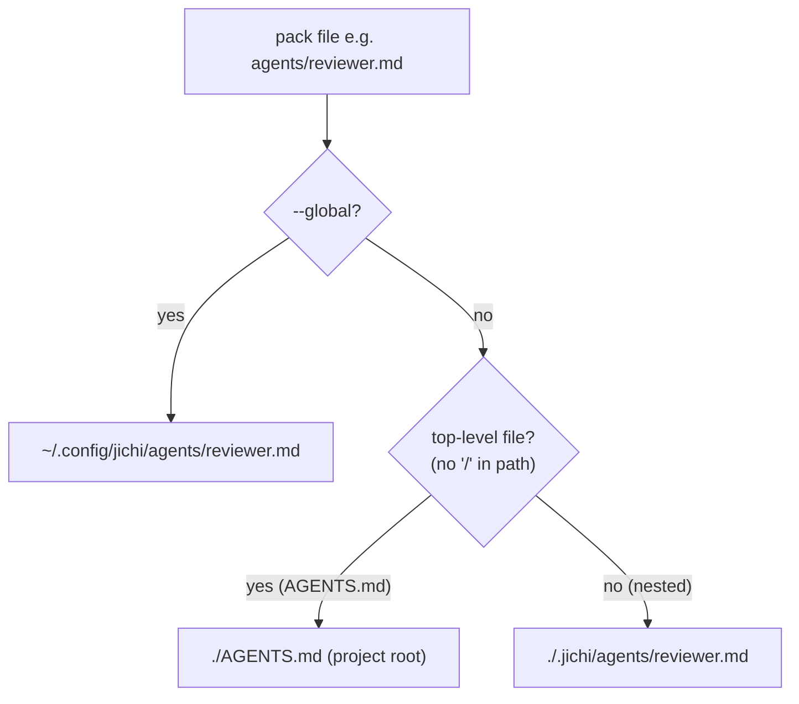

# Project scaffolding (`init`)

jichi discovers project *assets* — named subagent profiles, skills, custom
commands, and project rules — from `.jichi/` (and the global
`~/.config/jichi/`). Discovery is read-only: until those files exist, a
new project has nothing for jichi to pick up. The `init` subcommand writes a
**starter set** so you begin with something useful instead of a blank slate.

> For a guided, end-to-end project setup that *uses* `init` and also writes a
> config + start-script + validates the result, see the
> [`setup` wizard](SETUP_WIZARD.md). `init` (below) is the lower-level,
> non-interactive scaffolder.

```sh
jichi init            # scaffold the "default" pack into ./.jichi
jichi init c-cli      # scaffold a project-archetype pack (see below)
jichi init --list     # list available packs
jichi init --global   # write to ~/.config/jichi (all projects)
jichi init --dry-run  # show what would be written; change nothing
jichi init --force    # overwrite existing files
```

`init` needs neither a config file nor a model — it runs before any config is
loaded, so it works in a brand-new project on a fresh machine.

## Packs

`init <pack>` chooses a bundle; `init --list` enumerates them. Each archetype
pack reuses the language-agnostic `default` assets and adds a domain-tuned
`AGENTS.md`, a domain reviewer/skills, and (for the language packs) a
`config.example.json`.

| Pack | For | Adds on top of the generic set |
| --- | --- | --- |
| `default` | any project | the generic agents/skills/commands + an `AGENTS.md` stub |
| `c-cli` | C command-line apps | C `AGENTS.md`; `c-reviewer` (memory/UB/portability); `valgrind-triage` skill; `config.example.json` (clangd + `make test`) |
| `zig-cli` | Zig command-line apps | Zig `AGENTS.md`; `zig-reviewer` (allocator/error/lifetime); `config.example.json` (zls + `zig build test`) |
| `python-cli` | Python command-line apps | Python `AGENTS.md`; `pytest-triage` skill; `config.example.json` (pyright + `pytest -q`) |
| `godot` | Godot games (GDScript) | Godot `AGENTS.md`; `godot-reviewer` (scene/signal/frame-budget) |
| `docs` | documentation projects | docs `AGENTS.md`; **audience-aware writer/proofreader agents** (see below); `style-guide-check` + `readability-pass` skills |
| `systems-analysis` | read-mostly investigation | analysis `AGENTS.md`; read-only `architecture-mapper` / `dependency-analyst` / `threat-modeler` agents; `c4-diagram` + `data-flow` skills |
| `devops` | ops / CI | `ci-reviewer` (read-only) + `deploy-runner` agents; `runbook` / `disk-space` / `env-check` skills |
| `data` | data / analysis | `data-analyst` (read-only) + `notebook-helper` agents; `dataset-profile` + `data-flow` skills |
| `log-analysis` | log triage / incidents | read-only `log-analyst` agent (read + shell); `log-triage` / `journalctl-syslog` / `regex-recipes` / `incident-timeline` skills; `/triage-log` command |
| `sysadmin` | routine operations | `sysadmin` agent; `service-health` / `backup-verify` / `cron-audit` / `disk-space` / `env-check` skills; `/health-check` command |
| `assignments` | teaching/practice | `assignment-writer` / `solution-writer` / read-only `solution-checker` agents; `assignment-template` + `grading-rubric` skills; `/assign` `/solve` `/check` commands; a starter **glossary of jichi's own terms** (→ `.jichi/glossary.md`, M175 — the one pack file that nests despite being top-level, see [`GLOSSARY.md`](GLOSSARY.md)). See [`ASSIGNMENTS.md`](ASSIGNMENTS.md) |
| `onboarding` | adopting an existing project | read-only `project-analyst` / `data-fetcher` + `tutorial-writer` agents; `onboarding-checklist` skill; `/onboard` command. Drives `setup --onboard` (propose-only). See [`SETUP_WIZARD.md`](SETUP_WIZARD.md) |
| language packs | per language | `rust-cli`, `go-cli`, `web-ts`, `cpp`, `perl`, `r`, `guile`, `racket`, `clojure`, `haskell`, `elixir`, `erlang`, `elisp` — each a domain `AGENTS.md` + reviewer/triage skill + `config.example.json` |

The authoritative list is the compiled-in `PACKS[]` registry
(`src/scaffold/jc_scaffold.c`); `init --list` prints it. This table names the
high-traffic packs — the full set is 30 (run `jichi init --list`; the
four M183 journey packs — `sdlc`, `contributor`, `refactor`, `rewrite` —
are mapped in [SDLC.md](SDLC.md)).

**A pack is a bench; a graded course is the exercises for it.** As of 2026-08
jichi ships two complete **graded course families** — five functional (Racket,
Guile, Elixir, Haskell, Clojure) and four systems (C, Zig, C++, Rust), 36
two-sided assignments — that compose with the matching language packs: scaffold
the bench (`init c-cli`), then work the course
([`assignments/INDEX.md`](assignments/INDEX.md) → Systems track). A language
pack now has somewhere to point a learner once the bench is built.

**Domain benches beyond code (in `examples/`).** Twelve **domain scaffold
benches** — turning an empty `.jichi/` into a guided workspace for a whole domain
a school/university learner or self-learner meets — are built and validated in
[`../examples/`](../examples/README.md): `data-analysis`, `game-design`,
`game-dev`, `blender-python`, `krita-python` (creative/technical);
`project-management`, `personal-finance`, `scheduling`, `business-plan`
(self-management); `academic-writing`, `research-notes`, `web-basics` (student).
Each honours the same beginner-support contract (a numbered `START_HERE.md`, a
guide agent + a read-only domain-mistake reviewer, an `AGENTS.md` that names the
domain's boundaries, four commands, three skills, a secret-free
`config.example.json`), and is kept green by a smoke driver
(`tests/smoke/example_<name>.sh`). They ship as **copy-to-use** assets rather than
compiled-in `init` packs *on purpose*: they are large and per-interest, and the
binary stays lean for low-resource targets (the size tradeoff is recorded in the
proposal). `jichi init --list` points at them. Design + the beginner-support
contract: [`proposals/2026-08-domain-scaffolds.md`](proposals/2026-08-domain-scaffolds.md);
the companion graded *process* track (requirements, use-cases, docs, session
notes, kanban) is designed in
[`proposals/2026-08-process-curriculum.md`](proposals/2026-08-process-curriculum.md).

**Every pack carries the accessibility advisors (M184):** a read-only
`accessibility-reviewer` agent, the `a11y-checklist` skill (CLI / docs /
web / API-error checklists), and `/a11y-review` — accessibility review
exists from day one instead of the day after release. (Only the minimal
propose-only `onboarding` pack omits them.)

Packs are **additive** and non-destructive: running `init default` then
`init c-cli` keeps your edited files (the second run skips what exists; the
C-specific `AGENTS.md` only lands if you didn't already have one, or you pass
`--force`).

### Composing packs (M182)

`init` takes **several pack names in one call** — order is precedence:

```sh
jichi init c-cli assignments        # a C project that teaches
jichi init docs systems-analysis    # a documentation + architecture bench
```

The first pack to claim a shared path (`AGENTS.md`, `config.example.json`)
wins; later packs skip it — exactly the semantics of running `init` twice,
minus the typing. Generic assets (planner, reviewer, mentor, the
commit-message skill …) are byte-identical across packs, so their skips are
cosmetic. Every name is validated **before** anything is written: a typo in
the third pack cannot leave a half-composed project. Per-role recipes worth
knowing: `c-cli assignments` (teaching a C course on a real codebase),
`<language> docs` (a project whose documentation is a first-class
deliverable), `default onboarding` (analyze-then-scaffold an unfamiliar
repo).

### Audience-aware documentation agents (in the `docs` pack)

Good documentation for a newcomer and good documentation for an architect are
different artefacts. The `docs` pack ships writer **and** proofreader agent
profiles tuned to three reader tiers, so each pass is purpose-built:

| Reader | Writer | Proofreader (read-only) | Extra |
| --- | --- | --- | --- |
| **Beginner** — needs coding / bug-fix / support help | `docs-writer-beginner` (plain language, step-by-step, "if it breaks" sections) | `docs-proofreader-beginner` (flags jargon, missing prerequisites, where a newcomer stalls) | `support-responder` (drafts a help reply), `bugfix-explainer` (turns a fix into a teaching write-up) |
| **Expert developer** | `docs-writer-expert` (terse; contracts, invariants, edge cases, perf) | `docs-proofreader-expert` (accuracy, completeness, signatures match code) | — |
| **Master craftsperson** (architect/maintainer) | `docs-writer-master` (rationale, trade-offs, alternatives, the "why") | `docs-proofreader-master` (sound rationale, honest trade-offs, missing context) | — |

Use them two ways:

- **Directly:** ask the agent to `spawn_subagent` the profile by name, e.g.
  `docs-writer-beginner` or `docs-proofreader-expert`.
- **Via the docs-pack commands:** `/write-docs <audience> @file` and
  `/proofread <audience> @file` — the first word (`beginner` / `expert` /
  `master`) routes to the matching agent; omit it for a general-audience pass.

The proofreaders (and `support-responder`) are `readonly: true`, so they cannot
modify files — they report findings. Each profile also declares a `tools:`
allow-list, which is **enforced** when the profile runs as a subagent: only the
listed tools are advertised (and a backstop refuses anything else). So a
proofreader is restricted to exactly `read_file`/`search_code`, not merely
"can't write". See [`SUBAGENTS.md`](SUBAGENTS.md).

### About `config.example.json`

The language packs drop a `config.example.json` at the project root with a
recommended `testCommand` and `lspServers`. It is an **inert example** — jichi
never loads it. **Merge** its keys into your real config (`~/.jichi`);
do **not** simply rename it to `local/config.json`, because jichi loads exactly
one config file (first of `--config`, `$JC_CONFIG`, `./local/config.json`,
`~/.jichi`) — a standalone `local/config.json` without a `model` would
*shadow* your global config and leave you with no model. The file's own
`comment` field says the same.

## What the default pack installs

| Path (project mode) | Kind | Purpose |
| --- | --- | --- |
| `AGENTS.md` | rules | A stub with placeholders (build/test command, conventions) — fill it in. |
| `.jichi/agents/reviewer.md` | agent | Read-only code review. |
| `.jichi/agents/test-writer.md` | agent | Writes/updates tests. |
| `.jichi/agents/debugger.md` | agent | Reproduce → root-cause → fix. |
| `.jichi/agents/planner.md` | agent | Read-only; produces an implementation plan. |
| `.jichi/agents/docs-writer.md` | agent | Writes documentation. |
| `.jichi/agents/docs-proofreader.md` | agent | Read-only; proofreads docs. |
| `.jichi/skills/commit-message/SKILL.md` | skill | Diff → conventional commit message. |
| `.jichi/skills/pr-description/SKILL.md` | skill | Branch → PR description. |
| `.jichi/skills/changelog-entry/SKILL.md` | skill | Change → user-facing changelog entry. |
| `.jichi/skills/bug-triage/SKILL.md` | skill | Report → repro steps + hypothesis. |
| `.jichi/skills/supervise-long-command/SKILL.md` | skill | Hangable build/test/server → run backgrounded, poll, kill a stall. |
| `.jichi/commands/explain.md` | command | `/explain @file` — plain-language walkthrough. |
| `.jichi/commands/triage.md` | command | `/triage …` — triage a bug report. |
| `.jichi/commands/write-docs.md` | command | `/write-docs <audience> …`. |
| `.jichi/commands/proofread.md` | command | `/proofread …`. |

After scaffolding, the assets are live on the **next run** — no config change.
`jichi skills` lists the new skills; the agents are available to
`spawn_subagent` (e.g. `spawn_subagent` with `agent: "reviewer"`); the commands
work as `/explain`, `/triage`, etc. in the TUI. Edit any file to taste.

## Project vs global, and the destination rule



- **Project mode (default):** a top-level rules file (`AGENTS.md`) lands at the
  project root; everything else lands under `.jichi/`. This matches where the
  loaders look (rules walk the tree from the git root; agents/skills/commands
  live under `.jichi/`).
- **Global mode (`--global`):** every file, including `AGENTS.md`, lands under
  `~/.config/jichi/`, where jichi reads global assets shared across all
  projects (project files override global ones on a name clash).

## Safety

`init` is **non-destructive by default**: a file that already exists is reported
and skipped (`=`), never overwritten. Pass `--force` to overwrite, or
`--dry-run` to preview (`+` would create, `~` would overwrite, `=` would skip)
without touching disk. Exit code is `0` on success, `1` if any write failed, and
`2` for an unknown pack name.

## Design notes

*For a beginner:* think of `init` as `git init` for jichi's project assets — it
drops in a sensible starting set of helper agents, skills, and slash commands you
then customize.

*For an advanced reader:*

- **Compiled-in templates.** Packs are static C string tables in
  `src/scaffold/jc_scaffold.c`, not runtime data files. This keeps jichi a
  self-contained binary (`make install` is just "copy two binaries") and makes
  the writer hermetically testable. Each file's contents is stored as a
  NULL-terminated array of per-line chunks so no single string literal exceeds
  the C89 509-char minimum (`jc_scaffold_file_text` joins them).
- **Pure core / thin shell.** `jc_scaffold.c` is pure (pack tables,
  `jc_scaffold_dest` path logic, `jc_scaffold_file_text`) and unit-tested in
  `tests/test_scaffold.c` — including a check that every shipped `.md` parses as
  the agent/skill/command loaders expect. The I/O (existence check, `mkdir -p`,
  write) is the thin `run_init` shell in `src/main.c`.
- **Forward-compatible frontmatter.** The agent profiles already declare a
  `tools:` allow-list. It is parsed today but not yet enforced (only skills
  enforce a tool fence); enforcing it for subagents is roadmap **M14**. The
  read-only agents rely on `readonly: true`, which *is* enforced.

The archetype packs (`c-cli`, `zig-cli`, `python-cli`, `godot`, `docs`,
`systems-analysis`) reuse this same engine and shared content tables — a pack is
just another table that lists the generic files it wants plus its domain extras.
For the asset formats themselves see
[`SUBAGENTS.md`](SUBAGENTS.md), [`SKILLS.md`](SKILLS.md),
[`COMMANDS.md`](COMMANDS.md), and [`RULES.md`](RULES.md).
