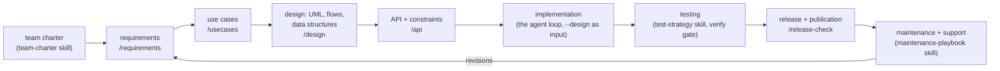

# The software development lifecycle in jichi: five journeys

jichi's setup presets answer two different questions. The **roles**
(developer, tester, reviewer, …) answer *who you are*; the five **journeys**
(M183) answer *what you are walking into*:

```sh
jichi setup --preset small-project   # start something small
jichi setup --preset contributor     # bug-fix an existing (open-source) project
jichi setup --preset refactor        # reshape an existing codebase, tests green
jichi setup --preset rewrite         # port a codebase to another language
jichi setup --preset architect       # build something complex, documents first

# Since M326j these are also a SECOND dimension: a journey layers onto a role,
# so the two questions compose instead of competing.
jichi setup --preset developer --journey refactor   # a developer, refactoring
jichi setup --preset reviewer  --journey contributor
```

Each is one command from an empty (or existing) directory to a configured
bench: a scaffold pack with the journey's discipline written into
`AGENTS.md`, the agents/skills/commands that serve it, and config defaults
that match (interactive setup shows the journeys as their own menu
question).

## The lifecycle, mapped to shipped assets

The `architect` journey carries the full **`sdlc` pack** — every phase of
the lifecycle has an authoring asset, and every document lands in the
project's `docs/` tree (files, not prompt bloat):



| Phase | Agent | Skill | Command |
|---|---|---|---|
| team building | — | `team-charter` (roles, review rules, git conventions, decision records) | — |
| requirements + revisions | `requirements-analyst` (read-only) | `requirements-doc` | `/requirements <goal>` |
| use cases | `requirements-analyst` | `use-case-writing` | `/usecases` |
| design: UML, pseudocode, program/data flow, data structures | `architect` (read-only) | `uml-mermaid`, `design-doc` | `/design` |
| API + system constraints + toolchains/languages | `api-designer` (read-only) | `api-design` | `/api` |
| implementation | the normal agent loop | — | `--design docs/DESIGN.md` feeds the design in |
| testing | `test-writer` (shared) | `test-strategy` | `verify` / `testCommand` config |
| git versioning, release, publication | `release-manager` (read-only) | `release-checklist`, `commit-message`, `changelog-entry` | `/release-check` |
| maintenance + support | `maintainer` (read-only) | `maintenance-playbook` | — |
| documentation | `docs-writer` / `docs-proofreader` (shared) | — | `/write-docs`, `/proofread` |

**Honesty about the floors** (the curriculum's three-layer model applies
here too): implementation and testing are mechanically gateable (`verify`);
requirements, design, and the rest are *documents* — the skills give them
structure and a quality bar, `/check`-style review gives feedback, judgment
stays human. The phase agents are read-only on purpose: they author
documents; they never quietly become the implementer.

## The four focused journeys

**small-project** — the 10-minute start: your language pack (asked, with
auto-detection), verify + snapshots on. The lifecycle-lite: you can still
`jichi init sdlc` later when the project grows into ceremony.

**contributor** — you are a *guest* in someone else's codebase: plan mode
by default, the reproduce → failing test → minimal diff → PR loop
(`first-contribution` skill), bug-triage and PR-description skills, and an
AGENTS.md that says "its conventions win over your preferences". Compose a
language pack with `jichi init <lang>` if you want its reviewer too.

**refactor** — the tests are the contract: verify required, small green
steps, the smell→consequence vocabulary (`refactor-discipline` skill),
behavior changes *recorded, not smuggled*. This is the curriculum's Module
7 discipline productized.

**rewrite** — the old tree is the specification and it is **read-only**:
setup asks for its path and emits it as a `referenceRoots` entry (the M54
fence: readable, never writable — `--reference-root <path>` in
non-interactive mode). Leaf-first port order, parity tests first,
`DIVERGENCES.md` for every deliberate difference (`porting-discipline`
skill), and a read-only `port-auditor` agent that reports
COVERED/DIVERGES/MISSING per module.

## Composing beyond a journey

Packs compose (`init <pack> [pack…]`, first wins shared paths —
[SCAFFOLDING.md](SCAFFOLDING.md)): `init sdlc assignments` teaches the
lifecycle; `init contributor c-cli` adds C-specific review to a
contribution bench; any journey plus `docs` upgrades the documentation
story. The journeys are starting points, not fences.

*See also: [SETUP_WIZARD.md](SETUP_WIZARD.md) (the wizard),
[SCAFFOLDING.md](SCAFFOLDING.md) (all 31 packs),
[DESIGN_INPUT.md](DESIGN_INPUT.md) (`--design`),
[AUTONOMY.md](AUTONOMY.md) (the envelope every journey runs under).*
