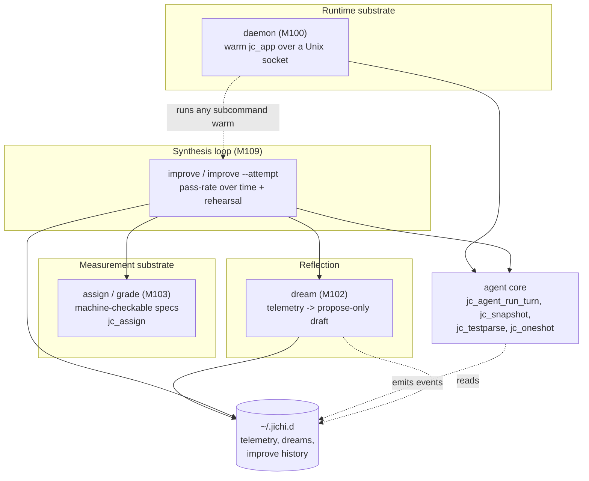
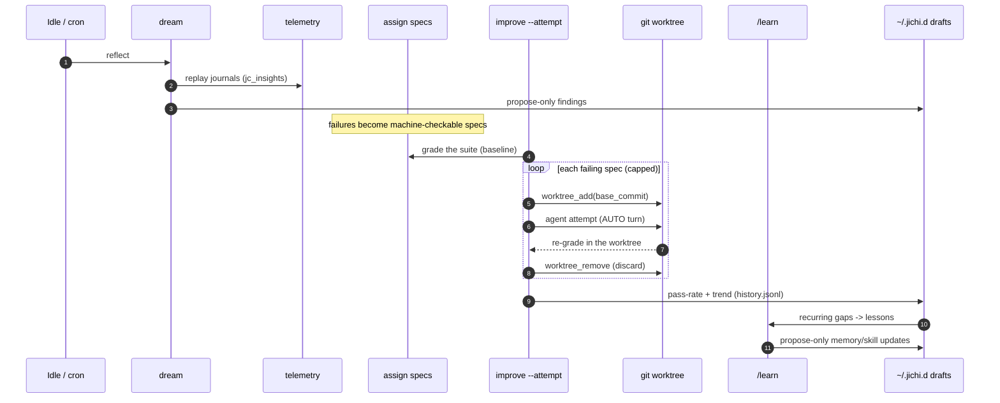
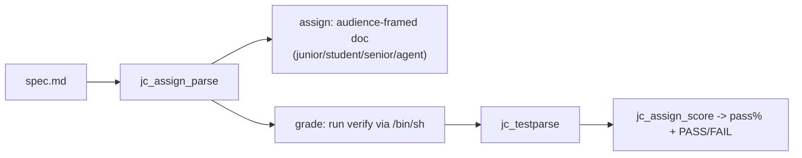
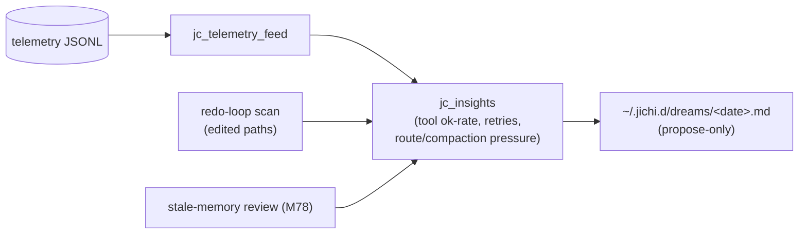
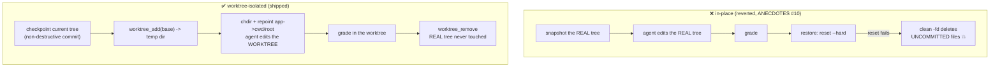
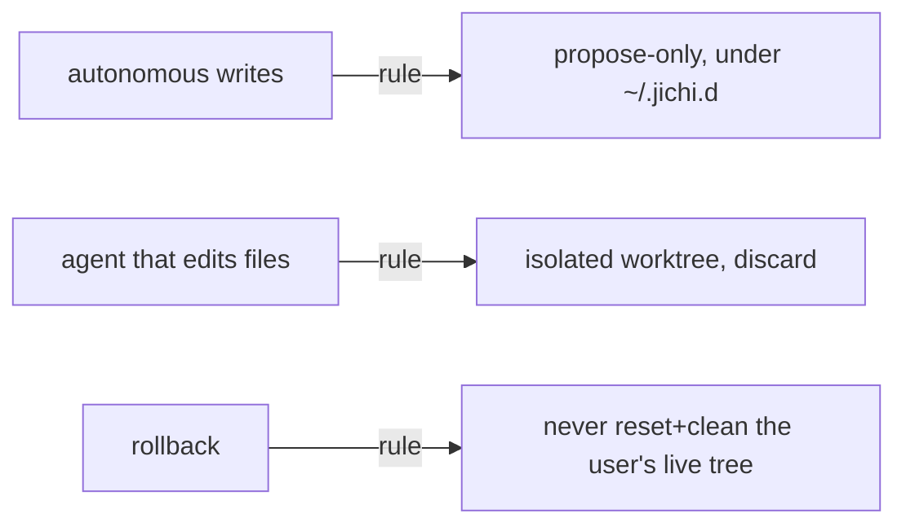

# Self-improvement & runtime band (M100+) — design & reference

This document is both the **design rationale** and the **reference** for the band
of work that makes jichi cheaper/faster to run and gives it a
**propose-only self-improvement loop**: reflect on its own telemetry while idle,
turn real failures into machine-checkable practice tasks, rehearse them in a
sandbox, and track whether it is actually getting better — all without ever
mutating the user's code or config behind their back.

It is a living document (the roadmap explicitly includes reviewing, rewriting,
and extending the docs). The milestone tracker is at the end; the design content
comes first.

---

## 1. Philosophy & invariants

Four rules shape every piece below. They are not aspirational — each is enforced
in code, and violating one is the subject of a war story in `docs/ANECDOTES.md`.

1. **Propose-only.** Autonomous self-improvement never edits the repo, config, or
   memory. It writes *reviewable drafts* under `~/.jichi.d/` that a human
   (or the next session) chooses to act on. The learning loop already worked this
   way (`/learn` writes `.jichi/lessons.draft.md`); the new pieces follow suit.
2. **Observability lives outside the blast radius.** Anything written by a
   reflective/agentic step goes *outside* any workspace, so a rollback or a
   `git clean` can never eat it (ANECDOTES #1). Dreams and improve-reports live
   under `~/.jichi.d/`.
3. **Never sandbox by mutating the user's tree.** Rehearsing an agent attempt
   uses an **isolated git worktree**, never a snapshot-and-restore of the live
   tree — because a *failed* restore plus an unconditional `git clean` is data
   loss (ANECDOTES #10). The worst case must be "couldn't sandbox", never "lost
   your files".
4. **Pure core + thin I/O shell, unit-tested.** Protocols, parsers, planners, and
   scorers are pure and covered by `tests/test_*.c`; sockets, forks, git, and
   model calls are the shell around them. C89, zero warnings under
   `-std=c89 -pedantic -Wall -Wextra`, valgrind-clean.

**Reuse before inventing.** Almost none of this is new machinery — it is wiring
over subsystems jichi already shipped:

| Concern | Reused module |
|---|---|
| Structured events / metrics | `jc_eventlog`, `jc_telemetry` |
| Recurring-problem mining | `jc_insights`, `jc_learn` (the `/learn` mentor) |
| Sandboxed file isolation | `jc_snapshot` worktrees (as `spawn_parallel` uses) |
| Test pass/fail parsing | `jc_testparse` |
| One-shot model calls | `jc_oneshot` |
| Durable notes | `jc_memory` (+ M78 corrections) |
| Agent turn | `jc_agent_run_turn` |

---

## 2. Architecture at a glance

The band is four cooperating capabilities on top of the existing agent core. The
**daemon** is the runtime substrate (keeps everything warm); **assign/grade** is
the measurement substrate (machine-checkable specs); **dream** is offline
reflection; **improve** is the loop that ties them together.



**Design choice — why four small commands, not one "self-improve" button.**
Each command is independently useful and testable, and the loop is *composable*:
`dream` alone is a nightly reflection; `grade` alone is a CI gate; `improve` alone
tracks a suite's pass-rate; `improve --attempt` closes the loop. A single opaque
button would be harder to trust, test, and schedule.

---

## 3. The synthesis loop

The end-to-end cycle — every arrow is an existing module, which is why the loop
was mostly *wiring*:



The **measurable** output is the pass-rate over the spec suite, tracked across
runs (`improve/history.jsonl`) and classified `baseline | improved | regressed |
unchanged`. That number is the honest answer to "did I get better?".

---

## 4. Warm process (daemon, M100)

### Why
Every `-p` run cold-starts: reconnect MCP, respawn LSP, reload the index, rebuild
the request prefix. On a cacheless backend that also re-bills the whole prefix
each turn. The daemon holds one fully-configured `jc_app` hot and serves requests
over a Unix socket.

### Request lifecycle

```mermaid
sequenceDiagram
    participant C as jichi connect thin client
    participant S as daemon warm jc_app
    participant A as jc_agent_run_turn
    C->>S: prompt request (type prompt, format)
    Note over S: dup2 conn to stdout for the turn
    S->>A: run against the warm app
    A-->>S: text / jsonl events to stdout (socket)
    Note over S: restore stdout; close conn (EOF frames the reply)
    S-->>C: streamed reply
    C->>S: shutdown request (optional)
```

### Design choices
- **`dup2` the socket onto stdout for the turn** rather than threading a
  `FILE*`/fd through the whole agent+headless stack. The turn already writes its
  answer (or `jc_agentjson` events) to stdout; redirecting fd 1 for the turn's
  duration captures all of it with zero refactoring, and diagnostics on stderr
  stay on the daemon's console.
- **One request per connection; EOF frames the reply.** No length prefixes, no
  sentinel parsing — the client reads until close. Simple and robust.
- **A bounded fork-per-request worker pool (W3).** The serial first cut was
  replaced by a bounded pool: each accepted `PROMPT` is served by a **forked**
  short-lived child (a copy-on-write snapshot of the warm `jc_app`, so a turn's
  mutations never leak into the parent or a sibling), while the parent keeps
  accepting up to `daemonWorkers` (default `min(cpu, 4)`) concurrent turns. The
  parent hands the connection to the child and closes its own copy, so the client
  sees EOF the instant the child exits. A per-child **watchdog**
  (`daemonWorkerTimeout`, default 300s) SIGTERM→SIGKILL-reaps a wedged turn via
  the shared `jc_workerpool` primitives (`jc_worker_over_deadline` +
  `jc_worker_reap_grace`, also used by `spawn_parallel`), so one bad request can't
  hang the listener. Idle-dream runs only when the pool is empty. *Caveat:*
  concurrent workers share the workspace filesystem — write-heavy concurrent turns
  should set `daemonWorkers: 1` or use worktree isolation (`spawn_parallel`
  `write:true`).
- **A dedicated request arena, not `app->scratch`.** The parent parses the request
  into an arena it will NOT reset before forking, so `req.prompt` stays valid in
  the child:

```c
/* run_daemon: parse in the parent, then fork a worker */
jc_arena_reset(reqarena);                 /* stable across the parse */
daemon_read_line(connfd, &line);
jc_daemon_parse_request(line.data, &req, reqarena);
...
if ((pid = fork()) == 0) {                 /* worker child */
    dup2(connfd, STDOUT_FILENO);           /* fd 2 too in plain mode */
    run_headless(app, req.prompt, req.jsonl ? 2 : 0);
    _exit(...);
}
close(connfd);                             /* parent: child owns the socket */
dp.pid[dp.n] = pid; dp.start_ms[dp.n++] = jc_now_millis();
```

The pure request codec (`jc_daemon_proto`) is unit-tested offline; see
`docs/DAEMON.md` for the command reference.

---

## 5. Assignment & eval harness (M103)

A spec is markdown + frontmatter. The insight: **the same artifact is a tutoring
task, a machine-checkable eval, and a rehearsal target.**

```markdown
---
title: Validate parse_config
audience: agent        # junior | student | senior | agent
verify: make test      # success = this command's exit + test counts
setup: git checkout -- .
points: 10
---
Make parse_config reject malformed input instead of crashing.
```



### Design choices
- **Audience is framing, not content.** One spec renders four ways — a junior
  gets a step scaffold, a student learning goals, a senior a terse brief, an
  *agent* a machine-checkable brief that names the verify command. Reuses the
  docs pack's beginner/expert/master idea.
- **Learner-support layer.** The same spec is also *solvable* with graded help:
  the frontmatter's `hints:` ladder is revealed one rung at a time by the `hint`
  tool, `ask_for_help` routes a clarification to the user (interactive) or a
  read-only `assignment-helper` agent (headless), and `spawn_subagent` delegates
  a sub-part. The **`attempt <spec.md> [--agent <profile>]`** subcommand runs a
  tiered learner profile (`learner-junior`/`student`/`senior`/`agent`) against
  one spec in an isolated worktree (the §7 rehearsal isolation), grades it by
  `verify`, and reports PASS/FAIL + hints used — the tiered-agent eval harness.
  Full walkthrough in [`ASSIGNMENTS.md`](ASSIGNMENTS.md).
- **Success is a command, not a vibe.** Scoring keys off `jc_testparse` (junit/
  tap/generic) so "did it pass" is objective and reusable as an eval:

```c
void jc_assign_score(const struct jc_test_report *rep, int verify_ok,
                     struct jc_assign_result *out)
{
    out->passed = verify_ok ? 1 : 0;                 /* exit 0 == pass */
    /* percentage from test counts when available, else 0/100 */
    if (total > 0 && passed >= 0) out->pct = (int)((passed * 100L) / total);
    else out->pct = verify_ok ? 100 : 0;
}
```

---

## 6. Dream — sleep-consolidation (M102)

`jichi dream` reflects over telemetry offline and writes a **propose-only** dated
draft. It is the `/learn` analysis, made autonomous and scheduled, with a
practice-task angle. **M611:** a dream records a *delta* — a reflection
byte-identical to the most recent one is not written again (so the daemon's
`--idle-dream`, idling over unchanging telemetry, stops piling up dated
duplicates); the dated filename is made collision-proof (whole-second stamps +
a truncating write used to let two dreams in one second clobber a propose-only
draft); and `prune` now trims `~/.jichi.d/dreams/` by the same
`--keep`/`--older-than` selectors it applies to sessions, the retention the
directory never had.



The `analyze_report()` helper is shared verbatim by `learn analyze` and `dream`,
so the two never drift. The draft points at `/learn` (draft lessons),
`assign`/`grade` (turn failures into rehearsal specs), and M78 corrections.

---

## 7. Improve — the loop, and its safety-critical core (M109)

`improve` (offline) grades a spec suite, tracks the pass-rate over time, and
writes a propose-only report. `improve --attempt` adds the **live rehearsal**:
let the agent try each failing spec and see how many it can fix — the number that
tells you whether the agent is improving.

The rehearsal is the most dangerous thing in the band (it runs an agent that
*edits files*), so its design is dominated by invariant #3.

### The anti-pattern that lost data, and the fix



### Rehearsal sequence

```mermaid
sequenceDiagram
    participant R as run_improve_attempt
    participant M as snapshot mgr
    participant WT as worktree temp dir
    participant A as agent AUTO
    R->>M: jc_snapshot_take -> base commit (copy the SHA)
    loop each failing spec (cap 5)
        R->>M: worktree_add(base, wt)
        R->>R: save app cwd/root/snapshots; chdir(wt)
        Note over A: edits only the worktree
        R->>A: jc_agent_run_turn(task)
        A-->>R: verify graded inside wt
        R->>R: restore app state; chdir back
        R->>M: worktree_remove(wt)
    end
    R->>R: attempted pass-rate -> history + report
```

### Design choices
- **Isolated worktree per attempt, off one baseline checkpoint.** Each attempt
  starts from the same clean snapshot, so attempts are independent and the real
  tree is never in the loop. This is the exact isolation `spawn_parallel` uses
  for write tasks — proven, not new.
- **Copy the base SHA.** `jc_snapshot_commit()` returns a pointer into the
  manager's vector; the agent's own checkpoints during the turn realloc it. Copy
  it first (a dangling pointer here caused a spurious "reset failed"):

```c
jc_snapshot_take(&m, "improve base");
c0 = jc_snapshot_commit(&m, jc_snapshot_count(&m) - 1);
jc_snprintf(base, sizeof(base), "%s", c0);          /* stable copy */
...
jc_snprintf(wt, sizeof(wt), "%s/wt-%d", wtbase, wi++);
jc_snapshot_worktree_add(&m, base, wt);
/* enter the sandbox */
jc_snprintf(saved_cwd, sizeof(saved_cwd), "%s", app->cwd);
jc_snprintf(saved_root, sizeof(saved_root), "%s", app->root);
saved_snap = app->snapshots;
if (chdir(wt) == 0) {
    jc_snprintf(app->cwd, sizeof(app->cwd), "%s", wt);
    jc_path_resolve(wt, canon, sizeof(canon));       /* fence root = wt */
    jc_snprintf(app->root, sizeof(app->root), "%s", canon);
    app->snapshots = NULL;            /* the worktree IS the sandbox */
    improve_attempt_turn(app, spec.task);            /* AUTO turn */
    after = improve_run_verify(spec.verify);         /* graded in wt */
}
chdir(orig_cwd);                                     /* always restore */
app->cwd/root/snapshots = saved...;
jc_snapshot_worktree_remove(&m, wt);
```

- **`app->snapshots = NULL` during the attempt** so the agent's own lazy
  checkpoint can't commit the *wrong* (real) tree — the manager's work-tree is
  bound to the real workspace, not the worktree.
- **Attempts are discarded even on success.** A FIXED spec's diff is thrown away;
  the deliverable is the metric + a propose-only note telling you to re-run the
  agent on that spec to *keep* a fix. (Invariant #1.)
- **Bounded** at five attempts per run — each is a real model call.

### The bug this work surfaced
While wiring the AUTO turn, `if (jc_agent_mode_parse("auto", &am) == JC_OK)` never
fired, because that function returns **1** on success, not `JC_OK` (0). The mode
stayed CHAT, tools needed approval a headless turn can't grant, and nothing got
created. The same comparison bug silently disabled the **daemon's** per-request
`mode` override. Both fixed. Lesson: a helper's "success" convention is part of
its contract — a bool `1` and a `jc_status` `0` are opposite truths.

---

## 8. Safety model (generalized)

The band touches three dangerous surfaces; each has a rule:



If a future capability can't satisfy the matching rule, it doesn't ship until it
can — that is exactly why the in-place rehearsal was reverted and rebuilt.

---

## 9. Reuse map (what each command is built from)

| Command | New (pure, tested) | Reused |
|---|---|---|
| `daemon` / `--connect` | `jc_daemon_proto` | `run_headless`, `jc_app`, sockets |
| `assign` / `grade` | `jc_assign` | `jc_md`, `jc_testparse`, `jc_proc` |
| `dream` | `analyze_report` (extracted) | `jc_telemetry`, `jc_insights`, `jc_learn` |
| `improve` | `jc_improve` | `jc_assign`, `analyze_report` |
| `improve --attempt` | `run_improve_attempt` shell | `jc_snapshot` worktrees, `jc_agent_run_turn` |

---

## 10. Milestone tracker

### Recommended execution order (status)

1. **M100 — Daemon / warm process.** ✅ DONE — `jc_daemon_proto` + `daemon` +
   `--connect`; verified live. `docs/DAEMON.md`. **Daemon-scheduled loop:**
   `daemon --idle-dream <sec>` runs `dream` once per idle stretch (propose-only,
   offline — no model call), self-scheduling the loop's reflect step in the warm
   process (verified live).
2. **M103 — Machine-checkable assignment + eval harness.** ✅ DONE — `jc_assign`
   + `assign`/`grade`. Follow-on: LLM spec generation from a repo.
3. **M102 — Sleep-consolidation ("dreams").** ✅ DONE — `dream` writes a
   propose-only reflection. Follow-on: cron/idle scheduling.
4. **M109 — Synthesis loop.** ✅ DONE — `improve` (pass-rate over time) +
   `improve --attempt` (worktree-isolated live rehearsal). Follow-on: idle
   scheduling in the daemon; the mentor consuming the rehearsal deltas directly.

### Designed, not yet built

- **M101 — Deterministic workflow DSL.** ✅ DONE (read-only slice) —
  `workflow <spec.json>` runs a harness-driven (not model-driven) pipeline:
  `jc_workflow` (pure, unit-tested) parses a JSONC spec of `map` (one subagent
  per `$ITEM`, read-only by default) and `synthesize` (fold the collected answers
  via a one-shot) stages; `run_workflow` executes them, carrying each stage's
  output into the next, each subtask a normal sandboxed subagent. Verified live:
  a map-review-then-synthesize flow correctly flagged the one file whose body
  didn't match its name. Example: `examples/workflow.review.json`.
  **Write stages + verify DONE:** a `map` with `readonly:false` edits each item
  in an isolated git worktree off a baseline checkpoint and merges the changes
  back first-wins (conflicts reported), reusing `jc_snapshot` worktrees +
  `jc_parallel_parse_changes`/`_claim` — the live tree is only touched by the
  merge, never reset/cleaned; and a `verify` stage runs a shell command, folding
  pass/fail (via `jc_testparse`) into the pipeline context. Verified live: a
  write-map fixed a file in isolation, merged it back, and the verify passed.
  Follow-on: parallel (not sequential) map execution.
- **M104 — Prompt-cache audit.** ✅ DONE — `telemetry --cache-audit`
  (`jc_cacheaudit`, unit-tested) reports overall + per-model cache hit-rate, the
  per-session input ramp, and an actionable verdict (NOT caching / partial /
  good) with a re-billing recommendation — computed from existing `model_call`
  telemetry (uncached `in_tok` vs `cache_read_in`/`cache_write_in`), no new
  hot-path instrumentation. Verified live against the cacheless HRZ backend (0%
  reads). Follow-on: a per-call prefix fingerprint to catch a jichi-side prefix
  regression (jichi's prefix stability is already guarded by the M31 test).
- **M105 — Self-healing.** ✅ **Runtime redo-loop guard DONE** — `jc_selfheal`
  (heap-free per-run `jc_editwatch`, unit-tested) nudges the model once when it
  edits the same file past a threshold, folded into the tool result in
  `run_agent_loop` (top-level, successful edits; ANECDOTES #8/#9). Still to do:
  `doctor --fix` (repair safe config issues), `--resume-run <journal>`
  (crash-resilient resume), asset quarantine. **S–M each.**
- **M106 — Mentor extensions.** ✅ DONE (project-rules slice) — the mentor draft
  gained a **`## Project rules`** section (`jc_learn` parses it into
  `draft.rules`, unit-tested) that `learn apply` commits to `AGENTS.md` (deduped,
  under a "## Learned conventions" heading), so the loop can propose durable
  project conventions, not only personal memory bullets; the scaffolded mentor
  prompt was updated to distinguish project rules from gotchas. (Cross-session
  trends are already fed — `learn analyze`/`dream` summarize a multi-session
  telemetry log.) Follow-on: a language-keyed mentor persona; skill synthesis
  from a repeated lesson.
- **M107 — Daydreams.** ⏸ **POSTPONED (deliberate; may never ship).** The idea:
  spend a session's idle/latency time (between turns, or during a slow in-flight
  model call) on cheap, read-only, cancellable speculation so the next action is
  faster — pre-warm the retrieval index for the last turn's files, pre-run
  `testCommand`, or pre-draft a next-step hypothesis. When the user acts, the
  daydream is aborted and its result used or discarded.

  **What it would take:** an idle trigger in the TUI event loop; a speculative
  task (reuse `jc_retrieve`/`jc_autocontext`, `jc_bg`, or `jc_oneshot`); hard
  cancellation on keypress (`abort_flag`, never mutating, never blocking the UI);
  and gating (opt-in, cheap model, token cap).

  **Why it's postponed (design decision):**
  1. *Concurrency cost vs payoff.* The TUI is single-threaded (raw-mode editor +
     streamed output). "Background" daydreaming means a forked read-only child
     piped back and reaped on keypress (like `spawn_parallel`/`jc_bg`) or
     interleaving in the key loop — fiddly, with real UI-jank and cancel-race
     risk, for a *speculative* payoff.
  2. *Speculation accuracy.* Pre-warming the wrong thing is pure waste;
     "likely-next file" prediction is guessy.
  3. *It fights the #1 cost.* Speculative **model** calls add spend at a low hit
     rate — the opposite of what M104 exists to reduce on a cacheless backend.
  4. *Overlap.* `jc_bg` (M26) already lets a user pre-run a watcher/build, and
     auto-context (M61) already retrieves on submit; a daydream mostly automates
     those speculatively.

  **Recommendation:** if ever built, ship **only** the non-model slice
  (idle-time `testCommand` pre-run and/or retrieval-index pre-warm in a
  cancellable background child) and never speculative model calls. Given the
  features→hardening→docs sequencing, the honest call is to **skip it** unless a
  concrete need appears — hardening the shipped subsystems is higher-value than a
  speculative-prefetch feature.
- **M108 — Status endpoint.** ✅ DONE (first slice) — `status --output json`
  emits the resolved model/provider/mode/routing/snapshots/cwd/contextLength +
  machine profile as JSON (parity with `doctor --output json`), completing the
  machine-readable introspection surface for editors/agents. Follow-on: a live
  ctx%/cost status request in the daemon.
