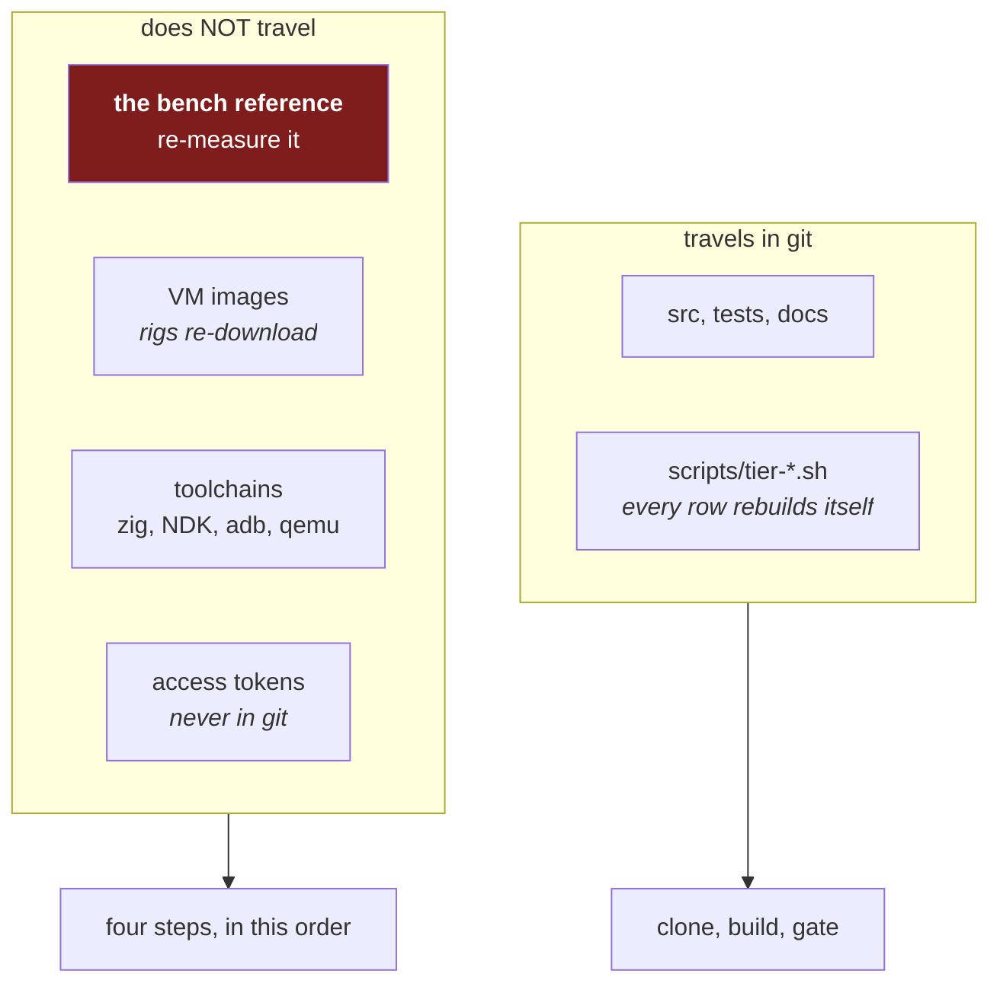

# Session runbook — the order of execution, and why each step is in it

Every rule here was written after breaking it, in one session (2026-08-15/16).
None is hypothetical. The numbers in brackets are how many times that mistake
was made **that day**, which is the argument for a runbook rather than care.

`scripts/preflight.sh` checks mechanically what can be checked. Prose discipline
is what failed; a script that refuses is what replaces it.

---

## 0. Preflight — before touching a tree

```sh
scripts/preflight.sh            # the tree you are about to change
```

It fails if the tree is busy. **A build, a test run, or an edit in a tree whose
CI is running is worthless in both directions**: your result is contaminated by
`make clean`, and CI's result is contaminated by your edits. [3]

If it reports a busy tree: stop that job **and confirm it stopped**, or wait.
Do not proceed on the assumption that a kill worked.

### Driving jichi at another project: pin the binary first

```sh
scripts/pin-driver.sh --config path/to/config.json
~/.local/opt/jichi-driver/jichi --config ~/.local/opt/jichi-driver/config.json ...
```

`../jichi/jichi` is deleted by `make clean`. Driving another repository from
jichi's own checkout therefore races its build, and the failure is silent and
misleading: a bare `RC=127` mid-task, as though the agent run had failed, when
the binary had simply evaporated underneath it. [1]

A pinned copy lives outside the repository, so `make clean`, `make ci`, a
branch switch and a `git checkout` all become irrelevant to a run in flight --
verified by cleaning the tree and re-running the pinned driver. It records the
revision it was built from, and whether the tree was dirty at pin time, so a
run can name what actually produced it.

`pin-driver.sh` refuses a prefix inside the repository, because that would
reintroduce the exact problem it exists to remove.

---

## 1. The order, and it does not vary

| # | Step | Why here |
|---|---|---|
| 1 | **Preflight** | An occupied tree invalidates everything downstream |
| 1b | **Pin the driver**, if this session will drive jichi at another repo | The build deletes the binary you are driving with |
| 2 | **Reproduce** the defect, and record the exact failing output | A fix for an unreproduced defect is a guess. Two hypotheses were wrong before the third was measured |
| 3 | **Write the check that fails** — the gate, driver, or assertion | Written after the fix, it is fitted to the fix. Written before, it can refute it |
| 4 | **Prove the check fails** against the unfixed tree — and **confirm that build succeeded** | A check never seen red has never been seen working. If the un-fixing edit does not compile, the test runs against the STALE binary and passes: the proof silently becomes a no-op [2] |
| 5 | **Fix** | — |
| 6 | **Prove the check passes**, on a quiet tree | Step 4's proof is void if the tree was busy |
| 7 | **Run the local gate** (`make WERROR=1 test`, `make smoke`) | Catches what the narrow check does not |
| 8 | **Read the whole diff** | Three agent runs produced plausible-and-false claims that only the diff exposed |
| 9 | **Commit and push** | Work is not delivered until it is on the remote |
| 10 | **Full `make ci`, alone, last** | It `make clean`s repeatedly; nothing else may touch the tree while it runs |

Step 10 is last **and exclusive**. If a change is needed after it starts, stop
CI, make the change, and start CI again. Do not overlap them.

---

## 2. Process rules — each written after a self-inflicted failure

**After every commit+push, the operator's INSTALLED binary is stale — say so, and
offer the one command that fixes it.** [1 — half an hour of configuration debugging]

The operator runs `jichi` from `PATH`, which is `/usr/local/bin/jichi`, and that is
**not** the tree build. On 2026-08-19 it was 12 days and ~50 milestones behind, and
both printed `jichi 0.9.0`, so nothing distinguished them. What it looked like
instead: `setup --api-base` answered *"unknown option"* for a flag its own `--help`
documents, and `doctor`'s context-window check printed **nothing at all** — absence
being indistinguishable from agreement.

```sh
cd .../jichi && make clean && make -j4 WERROR=1 && sudo make install
jichi --version        # must print `build: <this tree's HEAD>` (M495)
```

**`make clean` is not optional here** — the operator said so and the same hour proved
it twice: an incremental build kept a stale build stamp (the generated header was not
a prerequisite of anything that had changed), and a rule added above `all` made bare
`make` build one header and exit 0 with no binary. A clean parallel build is **3 s**;
an incremental build that reports success while producing the wrong artifact costs
far more, and it is invisible.

`/usr/local/bin` is root-owned, so an agent cannot do this: **ask**, with the command
ready to paste. `make install` also refreshes the man page, the shell completions and
the editor plugins, so it is the whole surface and not just the binary.

Since M495 the stamp makes the mismatch visible — `jichi --version` prints
`build: <short hash>` (plus `-dirty`), and `tests/smoke/build_rev.sh` fails when the
binary under test was built from a different commit than the tree it is tested in.
Compare with `git rev-parse --short HEAD` before believing any behaviour.

**Measure a run before you choose a timeout for it, and detach anything longer
than one command's ceiling.** [1 — a corrupted guest filesystem and a full
reinstall]

A poll loop with a timeout does not merely give up: when it expires, the harness
signals the whole process group, which **kills the work it was watching**. A
tier-V row killed that way is not a failed row — it is a guest with a dirty
filesystem, and one of them came back as

```
WARNING: / was not properly unmounted
/dev/sd0a: UNEXPECTED INCONSISTENCY; RUN fsck_ffs MANUALLY.
```

sitting in single user, needing the row rebuilt from the installer. `nohup` does
not save you: it ignores SIGHUP, not the SIGTERM a timeout sends.

```sh
nohup sh scripts/tier-v-openbsd.sh ... &   # WRONG: dies with your poll loop
setsid sh scripts/tier-v-openbsd.sh ... > log 2>&1 < /dev/null &   # detached
# then poll in SEPARATE short commands that hold nothing hostage
```

Measured on this bench, so the next estimate starts from numbers rather than a
guess: unit suite **~1 min**, `make smoke-faults` **~2 min**, `make smoke`
**~8 min**, an OpenBSD or NetBSD row with `--reuse` **~9–11 min**, a full OpenBSD
autoinstall row **~25 min**. Anything at or above a single command's ceiling must
be detached, not waited on.

And the rigs now shut their guests down with `halt -p` before falling back to
`kill`, so an interrupted teardown costs a boot rather than a filesystem.

**Never `pgrep -f` / `pkill -f` with a pattern that can appear in your own
command line.** [5 — including two shells killed outright, exit 144, and two
monitors that reported a finished job as still running for seven minutes]

```sh
pkill -f "tier-b-device.sh"     # WRONG: matches the shell running this line
pgrep -x make                   # right: exact process name, cannot self-match
kill "$(cat run.pid)"           # right: a pid you recorded
```

**Never edit a script that is currently executing.** `sh` reads a script
incrementally; inserting lines shifts every later byte offset and the running
shell resumes mid-token. [1 — a device row was discarded because it *might*
have been corrupted, which is the only safe reading]

**Write commit messages to a FILE, never `git commit -m` for anything
multi-line.** Backticks run as command substitution and quotes split the
message into pathspecs; both have mangled a commit here, one of them silently
enough to need an amend. `git commit -F msg.txt` with a quoted heredoc
(`<<'EOF'`) is the only form that survives punctuation. [3]

**Killing an ssh client does not kill the remote command.** A timed-out or
interrupted `ssh host 'long thing'` leaves `long thing` running on the far
side, and the next run then contends with it — twice here two `gmake smoke`
runs ran concurrently in one guest. Launch remote work detached and poll it
with short calls, then kill it by the pid you recorded. [2]

**Never launch long work with `nohup … &` inside a harness-backgrounded
shell.** The harness reports the launcher's exit, not the job's, so a job that
is still running looks finished. [3] Launch it directly in the background and
watch its log.

---

## 3. Evidence rules

**An artifact must be scoped to the run that produced it.** A results directory,
a journal, a log — all outlive their run. [2: a monitor read a dead run's
`gate.txt` and reported a failure that had happened 13 minutes earlier; a
supervisor `grep`ped an accumulating journal and accused jichi of mis-reporting
`no_changes`, three separate ways, when jichi had been right every time]

- Clear per-run artifacts at start, by name.
- Filter a shared log by the run id, never by "the last line in the file".

**A check must be able to fail.** [4]

```sh
curl -s "$url" | head -c 80 && echo "reachable"   # WRONG: head exits 0 on empty
curl -sf "$url" -o /dev/null && echo "reachable"  # right: curl's own status
grep -c X f || echo 0    # WRONG: grep -c prints 0 AND exits 1 -> "0\n0"
grep -c X f || true      # right
```

**A gate must be able to fail for the thing you asked for**, not merely for
syntax. A conversion task gated on `python3 -m py_compile` passed with two
defects present, because a script that still points at the wrong path still
parses. The gate that belonged there was `! grep -rq "$old_path" scripts/`. [1]

**Un-fix by disabling the effect, not by excising the code.** Deleting a block
often will not compile, and a failed rebuild leaves the previous binary in
place, so the "without the fix" run silently tests the fix. Neutralise instead
— `(void)x; /* PROOF: effect disabled */` — and check the rebuild's exit status
before believing either colour. [2]

**Report what you measured, not what you expect.** A verb-support table printed
from a hardcoded list said `OK` for a command that had just returned `rc=1` in
the line above it. [1]

---

## 4. Instructing an agent

**Name the invariant, not the index.** "Use `parents[1]`, since they live in
`scripts/`" is correct for `Path(__file__)` and wrong once the agent introduces
`SCRIPT_DIR = ….parent` — which it did, in three files, resolving the repo root
one level too high. Say "the repository root is the parent of `scripts/`". [1]

**Read the diff, never the summary.** Across three agent runs on two projects,
every mechanical fact was right (13/13 line counts, 52/54 symbol names) and each
run still produced at least one *plausible, specific, false* claim:
`jichi_continue` for `jichi`, `$GODOT_SRC` inside a block where no shell expands
it, `runFile` and `AnalyzerError` for functions that do not exist. Every one
would have shipped on the summary. [3/3]

**Check the task before assigning it.** A "fix the stale `jlu` names" task in
zigodot would have corrupted five files: every occurrence there is either the
username `jlu-su` in a path or a `jlu/…` wire model id that must never be
renamed. The fence does not save you from a wrong task. [1 near-miss]

**Budget only when you are measuring the budget.** A capped run said the agent
could not finish; the same task unbudgeted finished green in 756k tokens, three
times the cap. Keep the fences, drop the budgets, and call a shell `timeout`
what it is — operational hygiene, not a bound.

---

## 4b. Pointing jichi at jichi

The self-hosting pack (`examples/self-hosting/`) turns this repository into the
workspace of a jichi run. Nothing about it is special except that every mechanism
below is now operating on the tree you are also editing by hand, so the ordinary
rules bite harder and two of them become non-optional.

**Branch first, and the branch is the unit of review.** [pack README, and step 8
above] `git switch -c dev-loop` before the run, never master. Not because the
loop is dangerous — `editScope` already fences it out of `src/` — but because a
branch is the one container that holds a *whole* run, and reading the loop's work
as one diff is the only review that has ever caught the plausible-and-false
claim. The `--auto` runs the pack documents are exactly the runs whose summaries
you must not read instead of the diff.

**An `undo` belongs to the branch the run happened on.** [measured 2026-08-21;
`tests/smoke/undo_across_branch.sh`] Checkpoints live in a shadow repo keyed by
the **workspace path**, not the branch, and they record *content*. So an `undo`
after you have switched branches writes the other branch's state into your
worktree — measured: a file that existed only on `dev-loop` arrived on `master`
as an untracked file. Nothing is lost (the discarded state is preserved with a
`recover` handle) and git is not corrupted, but the tree is now a mixture.
`undo --dry-run` names every file it would touch, and reading it is the whole
defence: if the list mentions files you did not expect, you have switched
branches since. Full mechanics: [`SNAPSHOTS.md`](SNAPSHOTS.md) §"Checkpoints do
not know about your branches".

**Prove the reviewer can call a tool before you read a word of its review.**
[measured 2026-08-21; `docs/analysis/2026-08-21-local-model-tool-calling.md`]
Every reviewer in the pack works by reading files, so a model that cannot emit a
native tool call does not produce a weak review — it produces a *confident* one
about a diff it never opened. One command settles it, and it must be the product's
own: `jichi --config <pack config> doctor --live` has to say
`tool calling observed "native"`. Do not infer it from the parameter count (the
largest model on the measured bench was the only one that failed), and do not
trust a hand-rolled probe over `doctor` — three of mine were wrong in one session,
all of them producing a plausible negative. If the verdict is `text` or `none`,
the model's server template is not translating: try a different quant, or set
`toolCalling: "none"` so you get an honest Q&A agent instead of a silent no-op.

**One run per workspace, and let the lease say so.** `--lease fail` instead of
the default `warn` for self-development: a second run on the same checkout is not
a coordination problem here, it is two agents editing the tree you are reading.

**The evidence lives outside the repository — read it, do not re-derive it.**
Three sinks under `~/.jichi.d/`: the run journal (`jichi runs`), telemetry
(`jichi telemetry`), the privileged audit (`jichi audit`). None of them touches
the tree, so none can be committed by accident, and all three read offline. For a
self-hosting run they are the only place the *inside* of the run survives, and
this is the one project where you can read the code that produced each event.
Read the journal after an `--auto` run rather than watching the run; on a slow or
shared endpoint, watching is how the latency problem gets mistaken for a hang.

**Lessons drafted here are lessons about jichi, fed back into jichi.** [design:
propose-only] `learnOnStop` writes drafts, never live rules — accept them by hand
after reading them, and remember that a lesson learned while the tool worked on
itself is the most self-confirming kind there is. Retraction exists (M78) and is
part of the loop, not an admission.

**The gate is `make ci`, and the review agents are not it.** The read-only
reviewers run in seconds and catch what a fast human review catches; a change
merges because gcc and clang at `-Werror`, ASan/UBSan, valgrind and the two test
tiers passed. The pack says this in its own first section; repeat it to yourself
when a reviewer says "safe".

**What is measured, and what is still a claim.** The read-only slice has produced
useful findings on real diffs. The write slice has **never completed a real task
end to end** — criterion 2 of the pack's own promotion bar, openly unmet — and
the binding constraint on both is model latency, not the harness. Treat a
self-hosting session as an experiment with a result, and write the result down
(`docs/case-studies/` is where a worked one goes).

---

## 5. Moving to another machine

*This section is the operator's form. The same material, taught from first
principles for someone newer, is
[Curriculum module 0 § 5](curriculum/00-a-working-bench.md) — which is the
better place to send a learner, because it explains WHY the multiplier is a
ratio before telling them what to type.*

`git pull` gets you **all of the code, tests, docs and rigs**, and nothing else.
That is the correct split — the rest is either enormous, secret, or a property
of the bench — but it means four things have to be re-established, and one of
them is easy to get silently wrong.



### The one that bites: the bench reference

Every `JC_SMOKE_TIMEOUT_MULT` in this repository is a **ratio**, not a constant:
`device build seconds ÷ this bench's build seconds`. The published rows divide
by **6.19 s** (and older ones by threadwork's **4.00 s** — both are stated at
every figure, deliberately).

On a new machine that denominator is wrong, and nothing will tell you. A
multiplier that is too small makes healthy runs fail; too large, and a real
regression waits out its own timeout. So, first:

```sh
make clean && time make WERROR=1     # three runs, take the median
```

Write that number down and quote it beside every new multiplier, the way the
existing rows do. **Do not copy a multiplier from an existing row** — copy the
*formula*.

### The other three

| What | How | Cost |
|---|---|---|
| **Toolchains** | `qemu-system-x86_64` + KVM, `curl`, `python3`, `gmake`; then Zig and the Android NDK only if you want those rows | apt + two tarballs |
| **VM images** | nothing to copy: `scripts/tier-v-bsd.sh` and `scripts/tier-v-openbsd.sh` download and install from scratch | ~10 min per BSD row, unattended |
| **Access tokens** | kept outside the repo on purpose, and they must stay that way | you already have them |

### Then, in this order

```sh
git pull
scripts/preflight.sh            # step 0 of this runbook still applies
make ci                         # establish the baseline BEFORE changing anything
make clean && time make WERROR=1   # the new bench reference
```

Run `make ci` **before** your first edit, not after. A green gate on the new
machine is what lets you attribute the next red one to your change rather than
to the move — and this project has twice spent an afternoon debugging an
environment difference it had assumed was a regression.

### On a remote target, ask for the whole failure set (M466)

The three knobs below exist because an emulated or remote row costs a
ten-minute install plus a build, and the tier's defaults spend that on one
answer:

```sh
JC_SMOKE_KEEP_GOING=1 make smoke      # every failing driver, not just the first
sh tests/smoke/run.sh accessible      # re-check one driver without a 201-driver sweep
scripts/tier-v-bsd.sh --ref-secs N --dirty   # ship the WORKING tree, not HEAD
```

Fail-fast is correct locally and misleading remotely. It cost this project
about one boot per defect on FreeBSD, and on OpenBSD it *hid* the stop everyone
was looking for: an unrelated lint failed earlier in the list, so the driver in
question had **never run** in three separate rows, while the row reported only
"did not print its OK marker". If a remote row's failure looks like it moved
after an unrelated fix, check whether the tier simply got further before
concluding you caused it.

`--dirty` closes the other gap: every rig ships `git archive HEAD`, so without
it the loop *find a portability defect on the target → fix → verify there* is
impossible and the only option is committing a fix untested. A `--dirty` row
stamps **NOT a commit** in its results file — never publish one as a
reproducible measurement.

## 5b. When something is already broken

Check whether the failure predates you before fixing or claiming it. `make ci`
was red on arrival: the same defect reproduced at `origin/master`, so "I fixed
CI" would have been false and "I broke CI" equally so. One `git worktree` at the
baseline settles it in minutes.
