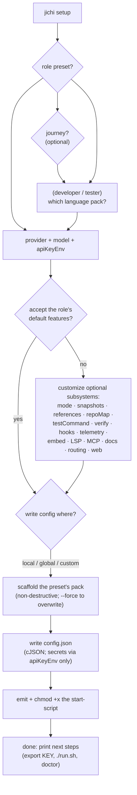

# Setup wizard (`jichi setup`)

`setup` is the guided way to take a brand-new directory to a working,
validated, role-tailored jichi project in one flow. Where `init` only scaffolds
`.jichi/` assets, `setup` also picks a **role preset**, writes a **config**, emits
an executable **start-script**, and ends in a **validation pass** — closing the
old three-step gap (`init` → hand-write config → `doctor`).

```
jichi setup
```

**It is a helper, not the only way, and it says so.** The wizard opens by saying
that it writes a plain text file you can equally write by hand, that nothing it
asks is permanent, and that every answer maps to a config key — and each option
then shows the keys it writes and why you would pick it. It ends by printing the
generated config and the four-line minimum, so a reader sees that the file it
produced is elaborate by choice rather than necessity (M326n). Learning to edit
that file directly is the point; the wizard is scaffolding around it.

On a terminal it runs **interactively**. With enough flags (or
`--non-interactive`) it runs **headless** for scripting and CI. Both paths build
the same answers and call the same pure builders, so the output is identical.

## The flow



## Domain presets (the first question)

A preset is a **recipe**, not a new bundle of assets: it names an existing
[scaffold pack](SCAFFOLDING.md), a default mode/output-style, a set of optional
features, and a start-script profile. List them with `setup --list`:

> **Journeys are a second, independent question** (M326j) — not *who you are*
> but *what you are walking into*: `small-project`, `contributor`, `refactor`,
> `rewrite` (asks for the old tree and emits it as a read-only `referenceRoots`
> entry; `--reference-root <path>` non-interactively), and `architect`.
>
> The wizard asks for both, the journey being **optional** (Enter skips it), and
> the two **compose**: the journey's features fill whatever the role left unset
> and its scaffold pack is written beside the role's. `--preset developer
> --journey refactor` is a developer who is refactoring.
>
> Until M326j they shared one numbered list and you picked exactly one, while
> the source described them as orthogonal — so the screen promised a combination
> that did not exist. A journey on its own is still a valid `--preset`, which is
> what the older `setup --preset refactor` invocations in [SDLC.md](SDLC.md)
> rely on.

| Preset | Scaffold pack | Emphasis | Start-script |
|---|---|---|---|
| `developer` | language pack (asks: c-cli / python-cli / zig-cli / godot / default) | snapshots, LSP, `testCommand`, references | `run.sh` (TUI) |
| `technical-writer` | `docs` | references on, optional embed + `docs` source | `run.sh` (TUI) |
| `generic` | `default` | minimal (chat model only) | `run.sh` (TUI) |
| `devops` | `devops` | `testCommand`, hooks, snapshots | `run.sh` (TUI) |
| `support` | `docs` | references + docs retrieval | `run.sh` (TUI) |
| `data` | `data` | embed/rerank for `codebase_search`, plan-lean | plan-mode TUI |

> **Planned presets beyond code (2026-08).** New role presets are designed for
> the wider audience — `game-designer`, `game-developer`, `3d-artist` (Blender),
> `digital-artist` (Krita), `data-analyst`, `project-manager`, `student`,
> `entrepreneur`, `budgeter` — each pairing a new domain scaffold pack with a
> role recipe, so a non-programmer also ends `setup` with a validated bench. See
> [`proposals/2026-08-domain-scaffolds.md`](proposals/2026-08-domain-scaffolds.md)
> (§4). The mechanism is unchanged — a preset is still a recipe row over an
> existing pack — so these extend this table without touching the wizard.

### Three axes, three questions (M326k)

The wizard asks **who you are** (a role, required), **what you are walking
into** (a journey, optional) and **what you are running on** (a machine profile,
optional). They compose: the journey and machine fill whatever the role left
unset, and their scaffold packs are written beside the role's.

`small-local` used to sit in the role list, where it answered a different
question from everything around it — your hardware, not your work — so "a
learner on a 7B model" could not be expressed at all. It is the machine axis
now; `--preset small-local` still works for the older invocations in
[`LOCAL_MODELS.md`](LOCAL_MODELS.md) and [`PREPARE_AND_BUILD.md`](PREPARE_AND_BUILD.md).

| axis | question | entries |
|---|---|---|
| domain | what are you working on? | `developer`, `technical-writer`, `devops`, `data`, `support`, `composer`, `generic` — required |
| journey | what are you walking into? | `small-project`, `contributor`, `refactor`, `rewrite`, `architect`, **`tester`**, **`reviewer`** |
| machine | what are you running on? | `small-local` (the **model** is small), `constrained` (the **machine** is), `existing-tree` (code you must not change) |
| stance | how are you working? | `learner` (**the default**), `instructor`, or professionally (none) |

**The systems axis distinguishes a small model from a small machine** (M326p).
Both take the lean profile, but only `small-local` shrinks `contextLimit` — a
hosted 200k model on a Raspberry Pi should keep its window, and it is the host
that needs `maxParallelAgents: 1`. `existing-tree` asks for a path and emits it
as a read-only `referenceRoots` entry: readable and searchable through the path
fence, never writable, not even by an unattended run.

**OS detection changes behaviour, not just the report** (M326q): `doctor` warns when
`memBudgetMb` is set somewhere the RSS watchdog cannot run (it needs procfs, and the budget
would never fire), reports the platform, and the optional-features block offers a sound and
notification command whose *default* is chosen for your OS — offered rather than written,
because a `sound` key registers the `play_audio`/`record_audio` tools.

**The machine probe asks before it writes** (M326p). jichi reads your CPU count,
memory and OS to size the defaults. The reading is local and nothing leaves the
computer — but the *result* is written into a config you may commit, where
`maxParallelAgents: 8` discloses the size of your machine. So the wizard prints
what it found and what it would write, then asks. Declining writes nothing. On
the flag-driven path there is nobody to ask, so it applies and reports, as
before.

**M326m moved two more entries to where they belong.** `tester` and `reviewer`
differed from the domains around them only in mode and start script — that is,
in what you are *doing* — exactly like `refactor` and `contributor`, which were
already journeys. And `learner`/`instructor` are a **stance**: not what you
build or what you are doing to it, but how you are working, which is orthogonal
to both. A learner refactoring on a small local model is now sayable.

The stance **defaults to `learner`** interactively, deliberately: most users are
learning, and the self-learner alone is the person least able to configure their
way out of a bad default. The **flag** path defaults to none, because a scripted
`setup --preset developer` silently gaining assignment scaffolding would be a
surprise rather than a kindness.

Changing an entry's axis never changes whether its **name** resolves:
`--preset learner` (README, the curriculum, the presentations) and
`--preset reviewer` (SDLC.md, WORKFLOWS.md) work exactly as before.

Role and language are **separate axes** too: only `developer`/`tester`
ask for a language pack; the others use a fixed pack. This keeps the table
small while covering the combinations. For those roles the wizard
**auto-detects** the
language from the project's files (a bounded scan of source-file extensions):
interactively it pre-selects the detected pack in the menu, and in flag mode
(without `--lang`) it uses it directly — so running `setup` inside an existing
Python or C project picks the right pack with no prompt.

## Flags (headless / scripting)

```
jichi setup --preset developer --provider openai \
  --model gpt-4o --key-env OPENAI_API_KEY --config-target local
```

For a **local or self-hosted** server, add the endpoint — this is the form the
`small-local` and `constrained` presets need, since both exist for models that are
not at a provider's cloud address:

```
jichi setup --preset developer --machine small-local --provider openai \
  --api-base http://localhost:1234/v1 --model my-local-model
```

| Flag | Meaning |
|---|---|
| `--list` | List the presets and exit. |
| `--preset <role>` | One of the presets above (default `developer`). |
| `--stance <name>` | How you are working (M326m): `learner` or `instructor`. Unset means professionally — the flag path does **not** inherit the interactive learner default. |
| `--machine <name>` | The hardware axis (M326k): `small-local`. What you are *running on*, not who you are — it composes with any role, so `--preset learner --machine small-local` is a learner on a 7–14B model. On its own it is still a valid `--preset`. |
| `--journey <name>` | A project journey layered **on top of** the role (M326j): `small-project`, `contributor`, `refactor`, `rewrite`, `architect`. Its features fill whatever the role left unset and its scaffold pack is written beside the role's. A journey on its own is still a valid `--preset`. |
| `--provider <p>` | `anthropic` or `openai`. **Required** in headless mode (unless `--from-global`). |
| `--model <id>` | The chat model id. **Required** in headless mode (unless `--from-global`). |
| `--api-base <URL>` | The endpoint, for anything that is not the provider's default — LM Studio, LocalAI, vLLM, a gateway. **Ends in `/v1`** for OpenAI-compatible servers, so chat *and* embeddings resolve. Added at M488: the interactive wizard had always prompted for it and the config writer had always written it, but the headless form had no flag — so following `setup`'s own printed guidance produced a config pointing at the provider's cloud, which bit precisely the two presets that exist for locally hosted models. |
| `--key-env <VAR>` | Env-var **name** holding the API key (e.g. `OPENAI_API_KEY`) — **not the key**. A value no shell could export (a pasted `sk-…`) is refused before anything is written, and the refusal does not echo it (M326e). |
| `--config-target <t>` | `local` (default), `global`, or a custom path. |
| `--from-global` | Seed the project config **from your global `~/.jichi`** (W5): the global models/roles/`apiKeyEnv`/routing/etc. carry over, and the preset's answers gap-fill only what's missing. No `--provider`/`--model` needed (the global config supplies them). |
| `--inherit <keys>` | Like `--from-global` but copies only the named top-level keys (comma-separated, e.g. `models,routing`); the rest is filled by the preset defaults. Implies `--from-global`. |
| `--lang <pack>` | Language pack for `developer`/`tester` (e.g. `c-cli`). |
| `--non-interactive` | Never prompt, even on a TTY (requires the flags above). |
| `--force` | Overwrite existing config/script/assets (default: skip). |

Headless mode is selected automatically when stdin is not a TTY, or whenever
`--provider` **and** `--model` are both given, or with `--non-interactive` or
`--from-global`.

### Reusing the global config in a project

`--from-global` is the agent- and human-friendly way to stand up a project that
**reuses your global jichi configuration** without retyping models/keys:

```
# whole global config, gap-filled by the developer preset:
jichi setup --from-global --preset developer --config-target local
# only the models + routing from global, project knobs from the preset:
jichi setup --inherit models,routing --preset developer
```

Because the runtime *also* layers `~/.jichi` under `./local/config.json`
automatically, a thinner alternative is to write only project-specific keys and
rely on that overlay — but `--from-global` produces a self-contained, portable
project config (useful when the project is shared or run on another machine).
Secrets are never copied: only `apiKeyEnv` names.

## What it writes

- **`.jichi/` assets** — the preset's scaffold pack (agents, skills, commands, and
  an `AGENTS.md`), exactly as `init <pack>` would. Non-destructive.
- **A config** — at the chosen target. Precedence (highest first):
  `--config` > `$JC_CONFIG` > `./local/config.json` > `~/.jichi`. The
  default target `local` writes `./local/config.json`, the git-ignored,
  project-local layer that is auto-discovered with no `--config` flag and never
  clobbers your global config.
- **A start-script** — a POSIX `sh` wrapper (`chmod +x`) that runs
  `jichi --config <path>` with the role's flags. It reads `JICHI` and
  `JICHI_CONFIG` from the environment so you can point it at a local build.

### Where the key goes

Two halves, and both matter — the second one used to be missing from this page.

**The config never contains a key.** It stores only the **env-var name**
(`apiKeyEnv`), so a generated config is safe to commit or share.

**The interactive wizard does offer to store the key itself** — its last question
before writing the config is whether to save it to **`~/.jichi.env`** (mode 0600,
owner-only), and the default answer is **yes**. The generated start script
(`run.sh`) sources that file, which is why `./run.sh` works in a shell where you
never exported anything. If you would rather keep the key out of any file, answer
**no** and export it yourself (`export JICHI_API_KEY=...`). The flag-driven,
non-interactive path never asks and never writes a key.

Either way `doctor` confirms only that a key is *present*; it never prints the
value.

```json
{
  "_comment": "Generated by `jichi setup`. Secrets are read from the apiKeyEnv ...",
  "models": [
    { "name": "chat", "provider": "openai", "model": "gpt-4o",
      "apiKeyEnv": "OPENAI_API_KEY", "roles": ["chat", "edit", "apply"] }
  ],
  "references": true
}
```

## Validate the result

The wizard ends by printing the doctor command for the generated project:

```
jichi --config local/config.json doctor
```

`doctor` checks libcurl, the config + models + active id, whether the API key
env-var is set, server reachability, embed/rerank coverage, git + snapshots,
MCP/LSP availability, and that the scaffolded assets parse. An unset key is a
**warning**, not a failure — exactly what you expect right after setup, before
you export it.

## Onboard an existing project (`--onboard`)

`setup --onboard` turns an **unfamiliar** project into a jichi-configured one, all
**propose-only** — nothing is committed:

```
jichi --config local/config.json setup --onboard
```

It (1) scaffolds the `onboarding` pack (the read-only `project-analyst`,
`tutorial-writer`, and `data-fetcher` agent profiles, an `/onboard` command, and
an `onboarding-checklist` skill), then, if a model is configured and reachable,
(2) runs the analyst as a one-shot to write `.jichi/onboarding.analysis.md` and
(3) drafts `docs/TUTORIAL.draft.md` from that analysis. Review the drafts, then
rename `TUTORIAL.draft.md` → `TUTORIAL.md` and fold the config suggestions in
(often via `setup --from-global` + the project's `testCommand`/`docs`).

With no key or an unreachable model it scaffolds the pack only, so `/onboard`
(and the agents) remain available for a live session. Usable by **agents**: the
whole flow is a single non-interactive command, and `/onboard` is a subtask
command (`agent: project-analyst`, `subtask: true`, `output:
.jichi/onboarding.analysis.md`) an agent can invoke mid-session.

## Design notes

- **Presets reference existing packs** — one source of truth; no asset
  duplication.
- **Pure builders + thin shell** — the preset table, config builder, and script
  builder live in `src/setup/jc_setup.c` and are offline unit-tested; the
  prompts/IO are the shell in `run_setup` (`src/main.c`). This is the same split
  as `jc_scaffold`/`jc_doctor`.
- **One "accept defaults?" shortcut** — the comprehensive optional-subsystem
  chain is fully skippable for users who just want to start.
- **Merges into an existing config** (M53) — running `setup` again **gap-fills**
  the config: your hand-edited keys and models are preserved untouched, and only
  pieces it lacks are added (the chat/embed model only if no model already holds
  that role). `--force` writes a fresh config instead. The start-script and
  scaffold assets stay non-destructive (skipped unless `--force`).

See also: [SCAFFOLDING.md](SCAFFOLDING.md) (the packs), [DOCTOR.md](DOCTOR.md)
(the validation), [CONFIG_TUTORIAL.md](CONFIG_TUTORIAL.md) (the config format),
[TUTORIAL_BEGINNER.md](TUTORIAL_BEGINNER.md), and
[TUTORIAL_ADVANCED.md](TUTORIAL_ADVANCED.md).
