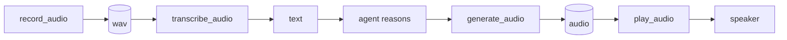

# Sound I/O: play_audio and record_audio (M163b)

jichi's media tools were file-only — `generate_audio` writes a speech file,
`transcribe_audio` reads one — with no way to reach a **speaker** or
**microphone**. M163b adds two tools that do, the same way jichi handles every
other device: by **shelling out to a configured external command**, never
linking an audio library (the M42 `pdftotext` precedent). Both register **only
when configured**.

## Configuration

```json
"sound": {
  "play":   { "command": "aplay",   "args": ["-q"] },
  "record": { "command": "arecord", "args": ["-q", "-f", "cd"] },
  "playTimeoutSeconds": 120,
  "recordMaxSeconds": 60
}
```

Each half also accepts a `shell` form (for a pipeline, e.g. an `ffplay` setup):
`"play": { "shell": "ffplay -nodisp -autoexit \"$JICHI_AUDIO_FILE\"" }`.

- `play_audio` registers only when `sound.play` is set; `record_audio` only
  when `sound.record` is set.
- `playTimeoutSeconds` (default 120) bounds a stuck player.
- `recordMaxSeconds` (default 60, hard cap 600) is the ceiling jichi enforces on
  a recording's length.

## The tools

- **`play_audio(path)`** — hands a workspace file (path-fenced) to the play
  command. The absolute audio path is exported as **`$JICHI_AUDIO_FILE`** and, in
  argv form, appended as the final argv element (jichi-chosen, fence-validated
  data — the "a model argument never lands on the command line" rule holds).
  Returns when playback finishes.
- **`record_audio(seconds, path?)`** — runs the record command with the
  duration **enforced jichi-side**: the child is stopped after
  `clamp(seconds, 1, recordMaxSeconds)` (a small grace lets a well-behaved
  `-d N` exit on its own), so a plain `arecord out.wav` needs no `-d`
  templating. `$JICHI_AUDIO_SECONDS` and `$JICHI_AUDIO_FILE` are exported. The path
  defaults to `recording-<ts>.wav`; the tool verifies a non-empty file was
  produced and warns in-result if it exceeds the `transcribe` cap.

Both are **mutating, not readonly**: playback emits energy into a shared space
(think 3 a.m., or a lab full of people) and recording captures third parties
and writes a file. So they **ASK** in chat mode, are **denied in PLAN**, and
can be denied via `permissions.deny`. They are **not kinetic** by default — a
robot's spoken status is exactly what an unattended loop needs — but a
siren-class output belongs in a `kinetic: true` user tool (see
[ROBOTICS.md](ROBOTICS.md)).

## The speech pipeline

The four tools compose into listen→think→speak, entirely by the model calling
them in turn:



**Honest note:** this turns around in **seconds** (each step is a tool call,
and STT/TTS are HTTP round-trips), not conversational realtime. Wake-word,
barge-in, and streaming STT need a capture daemon jichi talks to — deferred, see
the [robotics proposal](proposals/2026-07-robotics.md) appendix.

## What is verified

Pure helpers unit-tested (`tests/test_sound.c`: duration clamp incl. the 600 s
cap, argv assembly, default-name generation). End-to-end
(`tests/e2e/sound.py`): `play_audio` drives a mock player with the absolute
path via `$JICHI_AUDIO_FILE`; `record_audio` creates the file; the path fence
blocks an out-of-workspace path (the player never runs); and with no `sound`
config neither tool is advertised to the model.

See also: [MEDIA_GEN.md](MEDIA_GEN.md) (generate_audio),
[TRANSCRIBE.md](TRANSCRIBE.md) (transcribe_audio), [ROBOTICS.md](ROBOTICS.md),
[USER_TOOLS.md](USER_TOOLS.md).
