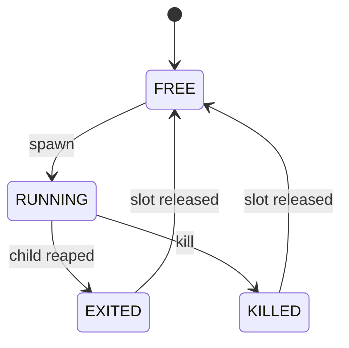

# State machines — designing them, writing them, and knowing when not to — a tutorial

A learner's guide to the finite-state machine: a set of states, a set of events,
and one answer for every pair of them. The thesis: **a state machine is finished
when every (state, event) cell has an answer — including the ones you are certain
cannot happen. The blank cells are where the bugs live**, because "cannot happen"
is a belief about the world and the code will be asked anyway.

> **Unfamiliar word?** [`VOCABULARY.md`](VOCABULARY.md) defines the terms this
> project leans on before it uses them — including the English **idioms**
> (*dogfooding*, *blast radius*, *born red*), which are figures of speech rather
> than technical terms and do not survive a dictionary.

This tutorial is about the **finite**-state machine: finitely many named states you
could list on a napkin. It is deliberately *not* about pushdown automata, parser
generators, or statecharts with history and orthogonal regions — §7 says when you
have outgrown this tool, which is the more useful thing to know.

## 1. The four parts, and the one that people skip

- **States** — the named situations the thing can be in. Finitely many, and you
  can name them all. If you cannot, you do not yet have a state machine.
- **Events** — what arrives from outside: a byte, a click, a signal, a timeout,
  a reply.
- **Transitions** — for each (state, event), which state comes next.
- **Actions** — what happens *on the way*: send a byte, free a buffer, log a line.

The part people skip is the **transition table**: the grid with a row per state
and a column per event. Skipping it is why state bugs are boring to find and
expensive to have — you did not forget a transition, you never wrote the cell down,
so nothing could tell you it was missing.

|  | `spawn` | `reaped` | `kill` | `release` |
|---|---|---|---|---|
| **FREE** | → RUNNING | — | — | — |
| **RUNNING** | *illegal* | → EXITED | → KILLED | *illegal* |
| **EXITED** | *illegal* | — | — | → FREE |
| **KILLED** | *illegal* | — | — | → FREE |

That is not an invented example. It is `enum jc_bg_state` in
[`include/jc_bg.h`](../include/jc_bg.h) — the background-process table — and
**four states implemented by six assignments** in
[`src/chat/jc_bg.c`](../src/chat/jc_bg.c): `JC_BG_RUNNING` once at spawn,
`JC_BG_EXITED` once when the child is reaped, `JC_BG_KILLED` at **two** kill
sites, and `JC_BG_FREE` **twice** — once at slot init and once when a finished
slot is released for reuse. **Open it and read all six before you read further**;
the whole machine fits on one screen, which is the property a good one has.

The count is the lesson. Two of the four states are entered from more than one
place, and that is exactly what a transition table makes visible and a reading of
the code does not: a cell can be reached by several routes, and every route has to
establish the same thing about the state it is entering. When you write the table,
a cell with two arrows into it is a cell to check twice.



Notice what the diagram makes obvious and prose hides: **EXITED and KILLED are not
the end.** They are readable, terminal-for-the-process states that the slot leaves
only when someone releases it. A design that treated them as final would leak a
slot per background job.

## 2. Designing one: name the states from the *questions*, not the steps

The common mistake is to name states after the code's steps — `STEP_1`,
`PARSING`, `DOING_THE_THING` — which produces a machine with as many states as
lines. Name them after **what is true**, and specifically after *what a reader
needs to know to answer the next question*.

A useful test: for each candidate state, ask **"what does the code do differently
here?"** If the answer is "nothing", it is not a state, it is a moment. Merge it.

Then write the table before the code. A table with blank cells is a design
question you have not answered yet; a table with the word *illegal* in a cell is a
question you answered **on purpose**, which is a completely different thing and
should read differently in the code too.

## 3. Writing it in C: two shapes, and when each is right

**Switch on the state.** The default, and right up to roughly a dozen states.
A sketch in the shape of §1's table — not a quotation from `jc_bg.c`, whose real
transitions are spread across the functions that cause them:

```c
switch (p->state) {
case JC_BG_RUNNING:
    if (reaped)      { p->state = JC_BG_EXITED; }
    else if (killed) { p->state = JC_BG_KILLED; }
    break;
case JC_BG_EXITED:
case JC_BG_KILLED:
    if (released)    { p->state = JC_BG_FREE; }
    break;
case JC_BG_FREE:
    break;
}
```

Readable, debuggable, and it puts the transitions next to the actions. Its weakness
is that the *table* is now scattered across the cases — you cannot see the grid.

**A table of rows.** When the grid matters more than the actions — protocol
framing, a parser, anything where you want to print the machine or generate the
diagram from the code — make the table a `static const` array of
`{from, event, to, action}` and write one small loop that consults it. The gain is
that the design is a value you can iterate over, test, and render. The cost is a
layer of indirection between the reader and what happens.

**Choose by which one you will get wrong.** Few states and complex actions: switch.
Many states and simple actions: table.

## 4. Implicit state is still state — and it is the kind that surprises you

Not every state machine has an `enum`. `jc_sse_feed` in
[`src/net/jc_sse.c`](../src/net/jc_sse.c) frames Server-Sent Events out of a byte
stream that arrives in arbitrary chunks. Its state is *the contents of a line
buffer*: "mid-line" and "at a boundary" are real states with different behaviour,
and neither is named.

That is a legitimate design — an explicit two-value enum beside the buffer would be
redundant — but it changes what you must do:

- **The invariant has to be written down**, because the compiler cannot hold it.
  What is true of the buffer between calls? Say so in a comment at the top.
- **The boundary cases are the tests.** A chunk that ends mid-line, a chunk that is
  exactly a line, a chunk containing three lines, an empty chunk. Those are the
  transition table, in test form.

Ask of any long-lived struct: *which of these fields, taken together, is a state?*
Usually one or two are, and naming them in a comment costs nothing.

## 5. Make the compiler hold the table

This is the most valuable trick in this file, and this project already runs on it.
[`include/jc_outcome.h`](../include/jc_outcome.h) defines `enum jc_run_stop` — the
reasons a run ended — and its own header states the rule:

> *"Every renderer switches on `enum jc_run_stop` with **no `default:` label**.
> `-Wall` implies `-Wswitch`, and this project builds with `-Werror` in CI, so
> adding a value to the enum turns into a BUILD ERROR at every site that must
> handle it. The compiler holds the matrix; a reviewer does not have to."*

Read that twice. **A `default:` label in a switch over a state enum is a blank row
in your transition table, silently filled in with "do whatever the last case
did".** Leaving it out converts "somebody must remember to update every site that
renders this" into a build failure with a file:line for each one — here, four
switches across two files, which you can confirm with
`git grep -n 'JC_STOP_' src`. It is the cheapest correctness mechanism in C and it
costs one omitted line.

The exception, and it is a real one: at a **trust boundary** — a value read from a
file, a socket, or a model — the incoming integer may not be a valid enum member at
all. Validate it into the enum at the boundary, then switch exhaustively inside.
Do not use `default:` as the validator; it hides the two different failures
(*unknown input* and *unhandled state*) behind one branch.

## 6. Where state machines pay, and where they are overkill

**Pay:**

- **Protocol framing** — SSE, LSP's `Content-Length` headers, anything where bytes
  arrive in chunks that do not respect message boundaries.
- **Lifecycles** — a process, a lease, a connection, a session. Anything with
  *acquire → in use → released* and error branches off the middle.
- **Retry and backoff** — because the interesting part is which failures return you
  to *trying* and which are terminal, and that is a table.
- **Modal interfaces** — a TUI with insert/command modes, where the same keystroke
  must do different things.
- **Agent loops** — jichi's own turn is one; see the reading track below.

**Overkill:**

- A boolean with a good name. Two states and one transition is an `int`, and
  wrapping it in a machine makes it harder to read, not safer.
- Straight-line code with early returns. If control never comes *back*, you have a
  sequence, not a machine.
- Anything where the "states" are really just *data*. If the only difference
  between two states is a field's value that nothing branches on, they are one
  state.

## 7. When you have outgrown it

Three honest signals, each pointing somewhere specific:

1. **You need to remember how you got here.** A plain FSM cannot; you have added a
   stack. That is a *pushdown* automaton, and for nested structures (JSON, XML,
   expressions) a recursive-descent parser is usually the clearer form.
2. **The state count is multiplying.** Four modes × three connection states × two
   auth states = twenty-four states you must now name. That is a sign the concerns
   are independent and should be *separate* small machines, not one large one —
   which is what statecharts' "orthogonal regions" formalise.
3. **The transitions depend on long histories.** If a transition needs "what
   happened three events ago", that history is data your state does not carry.
   Either make it part of the state, or accept that this is not an FSM problem.

Saying "this is no longer a finite-state machine" early is cheaper than a
forty-state diagram nobody reads.

## 8. Testing one

A state machine has an unusually clear test obligation, which is why it is a good
thing to practise on:

- **One test per cell you filled in.** Drive the machine into the state, deliver
  the event, assert the new state *and* the action.
- **One test per cell you marked illegal.** Assert it is refused the way you chose
  — an error value, a no-op, an assertion — and not silently accepted. These are
  the tests people skip, and they are the ones that catch a later refactor.
- **Boundary events.** Especially for the implicit machines of §4: the chunk that
  ends mid-line, the empty input, the event that arrives twice.
- **And prove the test can fail.** Break one transition, watch *that* test go red,
  restore. [`TESTING_RUNBOOK.md`](TESTING_RUNBOOK.md) is the ten-step version of
  this ritual; a state-machine test suite that has never been observed failing has
  never been observed working.

## 9. Doing it with jichi

```sh
jichi -p "read src/chat/jc_bg.c and list every assignment to .state, with the
          state it sets and the condition that reaches it"
jichi -p "draw enum jc_bg_state as a mermaid stateDiagram-v2 from the source,
          and name any state with no path back out"
```

The second prompt is the useful one, and it is useful because it is *checkable*:
you can read the five assignments yourself in a minute and see whether the diagram
matches. Asking a model to draw a diagram you cannot verify is how a plausible,
wrong diagram ends up in documentation. Ask for the diagram **and** the line
numbers it came from.

## 10. Extra curriculum — the reading track

In reading order:

1. [`reading/fukabori-04-the-agent-loop-as-a-state-machine.md`](reading/fukabori-04-the-agent-loop-as-a-state-machine.md)
   — this tutorial's ideas applied to `jc_agent_run_turn`, the largest state
   machine in this tree. Read it *after* this page; it assumes the vocabulary
   above.
2. [`PSEUDOCODE_TUTORIAL.md`](PSEUDOCODE_TUTORIAL.md) §"better drawn than written"
   — why a transition table belongs in a diagram before it belongs in prose.
3. [`UML_TUTORIAL.md`](UML_TUTORIAL.md) — the state diagram as mermaid, and which
   question each UML diagram actually answers.
4. [`DOMAIN_MODELLING_TUTORIAL.md`](DOMAIN_MODELLING_TUTORIAL.md) — because the
   states of an entity are part of its domain model, and naming them there first
   usually produces better state names than naming them in the code.
5. [`TESTING_TUTORIAL.md`](TESTING_TUTORIAL.md) §6 — enumerating a universe twice,
   which is exactly what "one test per cell" is.

Concepts to look up beyond this page, which are ideas rather than books: *Mealy*
and *Moore* machines (whether the output belongs to the transition or to the
state — the distinction decides where your actions live); *statecharts* (Harel's
hierarchical states, for signal 2 in §7); *table-driven programming* as a general
technique; and *regular languages*, which is the formal statement of exactly what
a finite-state machine can and cannot recognise — the theory behind §7's first
signal.
