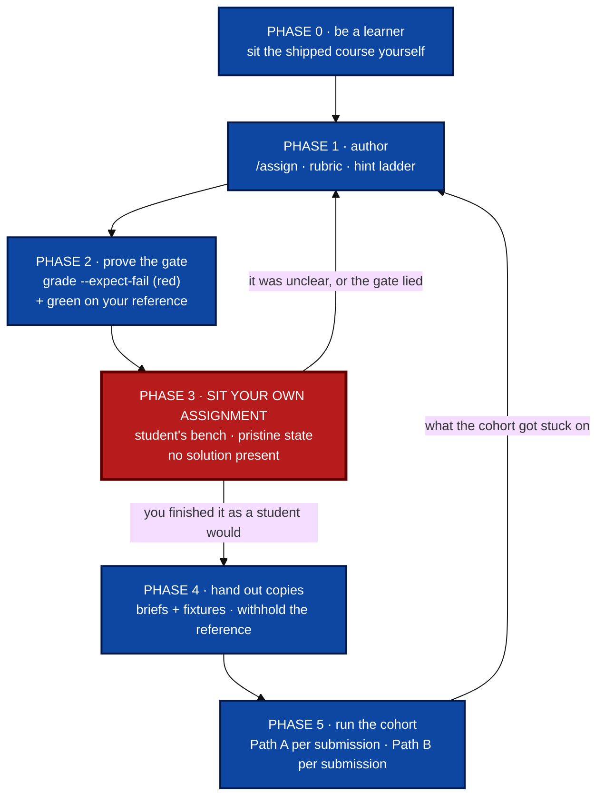
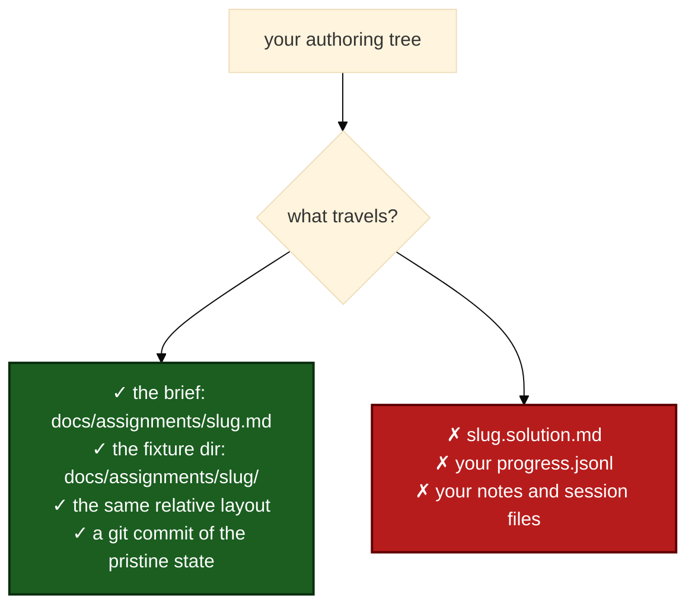

# Teaching with jichi: walk it before you assign it

For teachers and tutors. It assumes you have jichi working
([INSTALL.md](INSTALL.md)) and it is honest about what the tooling cannot do for
you, which turns out to be the most important part.

> **The rule this whole page is built on.**
>
> **Walk every step you ask a student to walk, in the same environment, before
> you ask them.** Sit the course. Write the assignment. Then *do* your own
> assignment — from the untouched starting state, in a student's bench, with only
> the commands a student has — and grade it the way they will. Only then hand out
> copies.
>
> This is not a moral position. It is the cheapest known way to find the four
> defects that make an assignment unteachable, and every one of them is invisible
> from the author's chair.

## Why the rule, concretely

An assignment you have not sat yourself fails in four specific ways, and none of
them shows up while you are writing it:

1. **The gate cannot fail.** You write `verify: zig build test`, the suite is
   already green, and `grade` says **PASS at 100%** with the exercise untouched.
   That happened in this project, on the first assignment authored outside the
   shipped curriculum. A gate that cannot fail grades nothing.
2. **The gate cannot pass.** The reverse: your grader demands something your own
   reference solution does not produce, so correct work is marked wrong and the
   learner has no way to know it is not their fault.
3. **The environment differs.** Your bench has the solution file, a shell history,
   a `PATH` with the compiler on it, and a working directory you never think
   about. A student's bench has none of that, and *the same commands produce
   different results*. See [§ The same environment](#the-same-environment) — the
   directory you stand in is enough to turn a pass into `FAIL, score 0%`.
4. **The brief is unreadable to someone who does not already know the answer.**
   You cannot detect this by re-reading your own prose. You detect it by trying to
   follow it with the answer out of your head, or by watching one person try.

The tooling can catch 1 and 2 mechanically, can be *made* to catch 3, and cannot
touch 4. That division is the design of everything below.

## The progression



Phase 3 is the one that gets skipped, and it is the one the other five exist to
serve. The loop back from Phase 3 to Phase 1 is not failure — it is the
assignment being finished.

---

## Phase 0 — be a learner first

Before authoring anything, sit the shipped curriculum, or at least a coherent
piece of it. Not to learn to code — to learn **what the loop feels like from the
inside**: how a hint lands when you are actually stuck, how a `FAIL` line reads
when you do not already know the answer, how long a "twenty-minute" task takes.

```sh
cd /path/to/the/jichi/checkout
jichi assignments                      # every task: phase, points, status
jichi assign docs/assignments/01-find-the-setting.md
```

Pick one of three routes, in ascending cost:

| Route | What it is | Cost |
| --- | --- | --- |
| **The process track** (tasks 67–73) | 17 graded points, requirements → use-cases → design → docs → session notes → kanban → scheduling. **No compiler needed.** | a few hours, no toolchain |
| **Set A** (tasks 01–08) | Stage 1 of the four-stage course: reading, the smallest change, tests, debugging. Gate: 14 of 17 points. | a day or two |
| **The whole course** | Four stages, 77 graded tasks, a capstone. | the full curriculum |

**Do it in a bench you would give a student**, not in your development tree. The
whole point is to meet what they meet.

> **Prerequisite most teachers hit first.** `make install` ships the binary, the
> man page and the completions — **not** `docs/`, `tests/` or the assignments. The
> course lives in the source checkout. See [STATE.md](STATE.md).

## Phase 1 — author

Two ways, and the difference matters:

```sh
# In a TUI session, with the assignments pack installed (jichi init assignments):
/assign implementation "counting non-empty lines in a shell script"
```

`/assign <phase> <topic>` writes `docs/assignments/<slug>.md` with a brief, a
rubric, an `audience` and a `hints:` ladder. Or write the file yourself — it is
markdown with YAML frontmatter, and hand-writing it is normal:

```markdown
---
title: Count only the lines that say something
audience: student
phase: implementation
difficulty: easy
points: 2
verify: "sh docs/assignments/tally/test.sh"
hints:
  - Run the test and read which case fails. It names the input shape.
  - The second case has blank lines in it. What is `wc -l` counting?
  - Filter the blank lines out before counting -- `grep -c .` counts non-empty lines.
---

`docs/assignments/tally/tally.sh` should count only the **non-empty** lines of
the file it is given. One of the two test cases fails. Fix `tally.sh`; leave
`test.sh` alone.
```

Three things to get right while you are here:

- **`verify:` is a command, run through `sh -c`, relative to the directory
  `grade` is run in.** This is the single most common source of confusing
  results; [§ The same environment](#the-same-environment) covers it.
- **The hint ladder is rungs, not paragraphs.** Rung 1 points at the evidence;
  the last rung may name the fix. A learner pulls them one at a time.
- **`audience:` sets the register** (`junior` · `student` · `senior` · `agent`).
  It is one word, and re-tiering an existing task is a legitimate edit in *your*
  copy.

Then write the reference solution — for yourself, and to prove the gate can pass:

```sh
/solve docs/assignments/tally-the-lines.md      # → tally-the-lines.solution.md
```

**Withhold that file from the learner's copy.** `jichi assignments` marks which
specs have one (`(+solution)`), which is how you check before distributing.

## Phase 2 — prove the gate, both ways

```sh
jichi grade docs/assignments/tally-the-lines.md --expect-fail
```

```
Count only the lines that say something: RED as expected -- the gate can fail on this tree
  verify: sh docs/assignments/tally/test.sh (exit 1)
```

Exit 0 means **the gate is capable of failing**, which is the only thing that
makes a later pass mean anything. An already-green gate is reported as `HOLLOW`
and exits 1.

Then apply your reference solution and grade normally — it must **PASS**. Two
runs, both offline, no model, no tokens. A gate proven in one direction only is
half a gate, and both halves have failed in real suites, including this
project's own ([TEST_INTEGRITY.md](TEST_INTEGRITY.md)).

> **`--expect-fail` refuses `--record` on purpose.** A red-proof is an authoring
> check on an untouched tree; recording its inverted verdict would poison the
> progress file's meaning.

## Phase 3 — sit your own assignment

This is the phase the page exists for. Build a student's bench and work the task
in it, from the pristine state, using only what a student has.


```sh
mkdir -p ~/benches/tally && cd ~/benches/tally
git init -q .                                   # so a reset is one command
jichi setup --preset learner --provider openai --model <id> \
    --api-base <url> --key-env JICHI_API_KEY
mkdir -p docs/assignments
cp -r /path/to/authoring/docs/assignments/tally-the-lines.md docs/assignments/
cp -r /path/to/authoring/docs/assignments/tally docs/assignments/
git add -A && git commit -qm "pristine"          # the state a student starts in
```

Now work it. **Read your own brief without the answer in your head** — the part
you cannot fake, and the reason to leave a day between Phase 1 and Phase 3 if you
can. Pull your own hints when you get stuck, in order, and notice whether the rung
you needed is the rung you wrote.

**What you are measuring, and it is not whether you can solve it:**

| Question | How you can tell |
| --- | --- |
| Is the brief followable cold? | You had to guess what was wanted → rewrite it. |
| Is rung 1 a nudge, not the answer? | You pulled rung 1 and it solved the task → the ladder is inverted. |
| Does the `FAIL` output point at the problem? | You had to read the test script to know what was wrong → say so in the brief, or improve the failure message. |
| Is the task the size you claimed? | Time it. A "20-minute" task that takes you 90 takes a student longer. |
| Does the gate pass on *legitimate* alternative solutions? | Solve it a second, uglier way. If that fails, your gate grades style you did not ask for. |

Then reset and leave the bench pristine for the copy:

```sh
git checkout -- .        # the fixtures are version-controlled: git is the reset button
```

> **`jichi attempt` is not this phase.** `attempt <spec>` has the *agent* solve the
> assignment in an isolated worktree (`--agent learner-junior` picks a tier). That
> is a genuinely useful measurement — it tells you whether the task is solvable
> from the brief alone, and it reports **TAINTED** when a green verify came with
> edited test assertions — but it answers a different question. An agent solving
> your assignment does not tell you whether a *person* can read it.

## Phase 4 — hand out tested copies



Check before you ship: `jichi assignments` flags every spec that still has a
reference beside it.

```
  assignment                         phase             pts  status
  tally-the-lines.md                 implementation    2pt  passed      (+solution)
```

That `(+solution)` in a *student's* listing means you copied the answer key.

**Give them a repository, not a tarball.** A git commit of the pristine state
makes `git checkout -- .` the reset button — the same one the shipped curriculum
documents — and gives you a diff of exactly what they did.

## Phase 5 — run the cohort

Two grading paths, and you pick per assignment. This is covered in full in
[TEACHING_ASSIGNMENTS.md](TEACHING_ASSIGNMENTS.md); the short version:

| | **Path A — the mechanical floor** | **Path B — the judgment layer** |
| --- | --- | --- |
| Command | `jichi grade <spec> --record` | `jichi -p "/check <brief> <work>"` |
| Model? | **no** — offline, deterministic, free | yes, costs tokens per submission |
| Answers | does it pass? | how good is it, against the rubric? |
| Never | judges quality | is a verdict — it is a first pass you read |

```sh
for s in submissions/*/ ; do
  ( cd "$s" && jichi grade docs/assignments/tally-the-lines.md --output json )
done > gradebook.jsonl
```

`jichi assignments --output json` gives per-task `points`, `attempts`, `passed`,
`best_pct` and — since M502 — `hint_pulls` and `hint_rung`, so you can see who
worked through the ladder and who did not need it. There is deliberately **no cohort view** — see
[§ Design decisions](#design-decisions).

---

## The same environment

"The same environment" is not a slogan; here is what actually differs, measured.

**The presets are already almost identical.** `setup --preset learner` and
`setup --preset instructor` produce byte-identical `AGENTS.md` and asset trees —
the same nine agents, four commands, three skills, and glossary — and their
configs differ by exactly **one key**: the instructor's has `"references": true`
(retrieval over your own material). So a teacher who wants a student's bench does
not need a container; they need `--preset learner` in a fresh directory.

| Difference | Why it bites | Make it the same |
| --- | --- | --- |
| **The directory you run `grade` in** | `verify:` is relative to the cwd. Graded one directory off, jichi now refuses with *"the verify command cannot run from here"* — before M502 it printed `FAIL, score: 0%`, a failing grade on correct work. | Document the directory in the brief, and grade from the same one. |
| **The source checkout** | `make install` ships no `docs/`, so a binary-only student has no assignments and no reading track. | Give them the tree (or a course repo), and say so in the brief. |
| **The solution sibling** | Present in your tree, absent in theirs — and it changes what `/check` and the agents can see. | `jichi assignments` flags it; look before copying. |
| **The toolchain** | Tasks that compile need `cc`; the process track needs nothing. A student without a compiler meets your task as a broken tool, not a hard exercise. | State the prerequisite in the brief, as the shipped specs do. |
| **The model** | A 7B local model and a frontier model do not fail in the same places. Your bench's model is not theirs. | Author against the *weakest* model you expect them to use. |
| **`audience:` / the tier** | The same task at `senior` and at `junior` is two different briefs. | Sit it at the tier you will assign. |
| **Accumulated state** | Your shell history, `progress.jsonl`, session files, `.jichi/memory.md` all carry answers. | A fresh directory, committed pristine. |

---

## Design decisions

Written out with the alternatives that were rejected, because a teacher adapting
this needs to know which parts are load-bearing.

**1. The mechanical floor is offline, and that is a teaching decision, not a
performance one.** `grade` runs a shell command and reads its exit status. No
model, no tokens, no network. A learner can therefore run it twenty times an hour
without a budget conversation, and a teacher can grade thirty submissions on a
train. *Rejected:* an LLM-graded floor. It would have made every check cost money
and made the same submission gradeable to two different verdicts, which is
indefensible to a student.

**2. Two paths, kept visibly separate.** The floor answers *does it pass*; the
judgment layer answers *how good is it*. *Rejected:* one blended score. A single
number would have hidden which half produced it, and the blend would be a
judgement pretending to be a measurement. The cost of the split is that teachers
must pick a path per assignment, which is why that is the first section of
[TEACHING_ASSIGNMENTS.md](TEACHING_ASSIGNMENTS.md).

**3. Hints are free and unpenalised.** *Rejected:* docking points per rung. A
penalised hint teaches hint-avoidance, which is learning-avoidance — the learner
sits stuck rather than spend the "cost", and being permanently stuck is the
commonest way a lone learner abandons a course.

**4. `--expect-fail` exists because trust is not transferable.** jichi's own 77
graded tasks are proven red-first in CI. An assignment authored anywhere else
inherits none of that, so the red half is available as one command. *Rejected:*
trusting authors to check. The first assignment authored outside the curriculum
shipped with an already-green gate.

**5. A gate that cannot run is not a grade (M502).** `grade` used to run the
verify and report the verdict, full stop — so a spec graded from the wrong
directory said `FAIL, score: 0%`, and `--expect-fail` reported *"RED as
expected"* for a gate that was red only because its script was missing, which
certifies exactly the hollow gate it exists to catch. Now the program the verify
would run is resolved first, and an unreachable one is refused with an
explanation. *Only the program is checked, never the arguments* — a verify like
`test -s docs/DESIGN.md` names a file the **learner** must create, so a missing
argument is the assignment working as intended.

**6. `attempt` is a separate measurement, not a shortcut through Phase 3.** It
answers "is this solvable from the brief alone", with tiers and budgets, and it
reports TAINTED when a green verify came with edited test assertions. *Rejected:*
treating an agent's pass as evidence the assignment is teachable. It is evidence
about the agent.

**7. There is no gradebook, and there will not be one here.** `jichi assignments`
reads exactly one workspace. A cohort view needs identity, storage and a policy
about grades — someone else's software. jichi provides the machine surface
(`--output json` per run and per bench) and a sidecar owns the aggregation.
*Rejected:* a cohort flag on `assignments`. It would have put student records
inside a coding agent.

**8. The teacher's walk cannot be enforced by a tool, so it is not pretended
otherwise.** Nothing in jichi can verify you sat your own assignment. What it can
do is make the *artefacts* of having done so cheap and visible: the red proof
(`--expect-fail`), a green run on your reference, and your own row in a bench's
`progress.jsonl`. *Rejected:* a "verified by author" flag in the frontmatter. A
claim a tool cannot check is worse than no claim — this project's own rule.

**9. The environment is a preset, not a container.** *Rejected:* shipping a
Docker image per course. It would pin a toolchain, exclude the low-resource
machines the curriculum deliberately supports (down to 256 MB), and hide exactly
the environment differences a teacher needs to notice. A preset plus a fresh
directory plus a git commit is reproducible enough and stays inspectable.

---

## Recommendations

**For teachers**

1. **Sit the process track (67–73) even if you teach C.** It is the fastest way
   to feel the loop, needs no toolchain, and is the track your compiler-less
   students will start on.
2. **Leave a day between authoring and sitting your own task.** Phase 3's value
   is reading the brief *cold*; you cannot do that an hour after writing it.
3. **Author against the weakest model your students will use.** A brief that only
   a frontier model can act on is a brief that fails in the room.
4. **Solve your own task twice, the second time badly.** If the ugly-but-correct
   solution fails your gate, you are grading style you never asked for.
5. **Commit the pristine state and give out a repository.** `git checkout -- .`
   becomes the documented reset, and you get a diff of what each student did.
6. **Grade Path A first, then read Path B.** The floor is free and instant; spend
   tokens only on submissions that passed it — or, deliberately, on the ones that
   did not, when you want to know *why*.
7. **Keep your own bench separate from your authoring tree.** The bench is where
   you are a student; conflating them is how the solution file leaks.

**For tutors (1:1)**

8. **Diagnose the kind of stuck before offering anything.** Does not understand
   the goal / no idea where to start / wrong mental model / stuck on tooling —
   four different responses. The tutor's loop in
   [TEACHING_ASSIGNMENTS.md](TEACHING_ASSIGNMENTS.md) maps each.
9. **Let the learner pull the hint.** If you pull it, you have taken the decision
   about how much help they get.
10. **Read the `verify:` script together when they are stuck on tooling.** The
    grader is not a secret, and reading it is a skill.
11. **Use the tiers to show, not to do.** Running a task as `learner-junior` vs
    `learner-senior` demonstrates what one step up looks like without solving it
    for them.

---

## Honest limits

Stated rather than implied, because each would otherwise look like a bug.

- **Hint usage is recorded, in its own file, and never scored.** `jichi hint`
  appends the rung to `.jichi/hints.jsonl`, and `jichi assignments` shows
  `hints N (deepest rung M)` plus `hint_pulls`/`hint_rung` in the json. It is a
  **separate** sink from `progress.jsonl` on purpose: every reader there counts a
  line as a graded attempt, so a hint row would read as one — and a verdict-less
  one reads as a failure. Two files is what keeps *"free and never penalised"*
  true by construction rather than by everyone remembering. Read it as
  diagnosis, not as a score: a student who needed all three rungs and got there
  is a student who used the ladder correctly. *(Before M502 nothing was written
  at all, while 74 specs promised it was.)*
- **Parsed test counts need recognisable test output.** `grade` reports
  `tests_run` / `tests_failed` when it can parse them; a hand-rolled runner that
  prints its own format records `0/0` with a correct pass/fail verdict. Not a
  failure — just less detail than the shipped tasks give.
- **No cohort view.** By decision (§7), not omission.
- **`jichi assignments` is a flat, name-sorted list.** No stage grouping, no
  per-stage totals; the gate arithmetic is still yours to do. Open in
  [DEFERRED.md](DEFERRED.md).
- **Path B is a first pass, never a grade.** It is a read-only agent comparing
  work to a rubric. Read its report; do not forward it.
- **`/check` and `/assign` need the assignments pack.** `jichi init assignments`
  (or `setup --preset learner|instructor`) installs the agents and commands they
  resolve to.
- **Nothing here checks that you walked it.** That is the one thing the page asks
  of you and the one thing it cannot verify.

## See also

- [TEACHING_ASSIGNMENTS.md](TEACHING_ASSIGNMENTS.md) — the feature reference: two
  paths, three loops, four contexts, and the guardrails
- [curriculum/INSTRUCTOR.md](curriculum/INSTRUCTOR.md) — per-module lab plans,
  tier tuning, the verify-patterns cookbook, grading operations
- [CURRICULUM.md](CURRICULUM.md) · [assignments/INDEX.md](assignments/INDEX.md) —
  the shipped course and its gates
- [ASSIGNMENTS.md](ASSIGNMENTS.md) — the spec format and the TUI workflow
- [TEST_INTEGRITY.md](TEST_INTEGRITY.md) — why two-sided proofs, in this
  project's own words
- [VOCABULARY.md](VOCABULARY.md) — the words used above, defined
