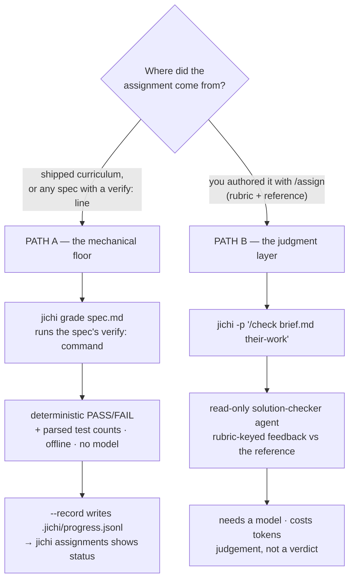
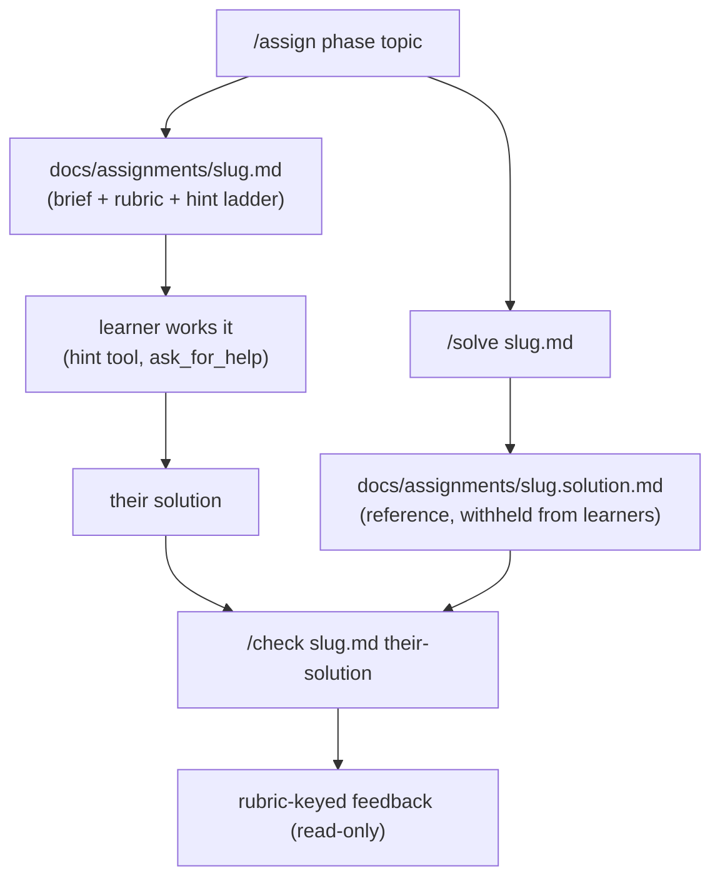
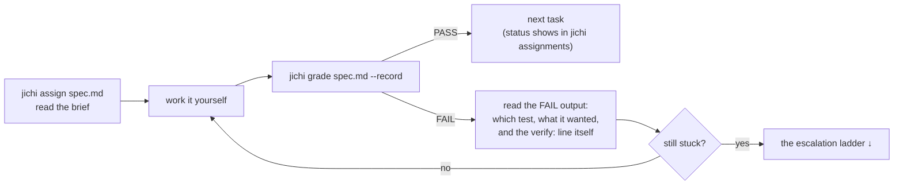
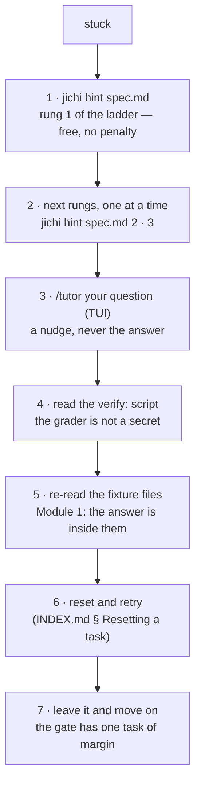
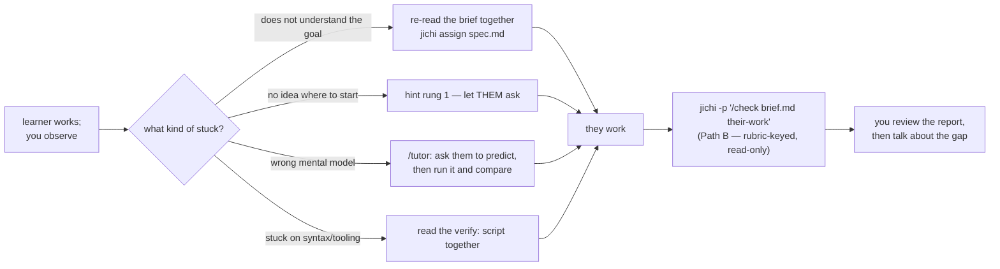
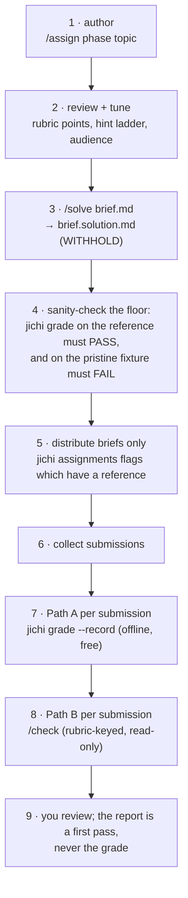

# Teaching with jichi assignments

jichi's **assignments** feature (M17 + the learner-support band) is built for
**human students and junior developers** — an instructor authors an assignment
with a graded rubric and a hint ladder; a learner works it, asks for scaffolded
help when stuck, and gets rubric-keyed feedback against a withheld reference
solution. This guide is the *pedagogy* companion to the mechanics in
[ASSIGNMENTS.md](ASSIGNMENTS.md): four concrete teaching contexts, each a
walkthrough with the real commands. **Running a whole course on the shipped
curriculum?** The classroom layer — per-module lab plans, pacing for the
three formats, the verify cookbook, grading ops — is
[curriculum/INSTRUCTOR.md](curriculum/INSTRUCTOR.md).

> It is off by default. Turn it on with `"assignments": true` in config **and**
> scaffold the pack: `jichi init assignments`. That ships the
> `assignment-writer` / `solution-writer` / read-only `solution-checker` agents,
> the tiered `learner-junior|student|senior` profiles, the `assignment-template`
> and `grading-rubric` skills, and the `/assign` `/solve` `/check` commands.

> **A worked, real campaign to study first:** [`case-studies/`](case-studies/README.md)
> holds complete artifact bundles from driving this machinery against a real
> codebase with real models — assignments as authored (including the defects),
> gates proven red, reference solutions beside the junior agent's solutions, and
> the verdicts including a **TAINTED** one. If you are a tutor deciding what to
> trust, read case 1 (the moved goalpost) before anything else on this page.

> **New here, and teaching rather than looking something up?** Start with
> [TEACHING.md](TEACHING.md) — the teacher's progression, whose one rule is *walk
> every step you ask a student to walk, in the same environment, before you ask
> them*. This page is the feature reference it leans on.

## First: there are TWO grading paths, and you must pick one per assignment

This is the thing to understand before any command below. jichi grades in two
completely different ways, and confusing them is the commonest source of "why is
nothing happening".



| | **Path A — mechanical floor** | **Path B — judgment layer** |
|---|---|---|
| Grades | any spec with a `verify:` line — all 77 shipped curriculum tasks | an assignment you authored with `/assign`, which carries a rubric |
| Command | `jichi grade <spec>` | `jichi -p "/check <brief> <work>"` |
| Needs a model? | **No.** Offline, deterministic, free | **Yes.** Costs tokens per submission |
| Answers | "does it pass?" | "how good is it, against the rubric?" |
| Records | `--record` → `.jichi/progress.jsonl` → `jichi assignments` | nothing; capture the transcript yourself |
| Cannot | judge whether the work is *good*, or whether a test was seen failing first | be trusted as a verdict — it is a first pass you review |

**Use both when you can.** The floor is what a learner checks themselves twenty
times an hour; the judgment layer is what you or a TA runs once per submission.
The three-layer doctrine in [CURRICULUM.md](CURRICULUM.md) is the same idea:
a script can prove work *exists* and is *shaped right*; only a human (or a
carefully-bounded agent) can say it is *good*.

## The pieces, once



- **`/assign <phase> <topic>`** — `<phase>` is the SDLC phase (`requirements`,
  `use-case`, `design`, `implementation`, `testing`, `documentation`); writes
  `docs/assignments/<slug>.md`, which carries the brief, a **graded rubric**
  (`points`), an `audience`, and a `hints:` ladder.
- **`/solve <file>`** — writes the sibling `docs/assignments/<slug>.solution.md`
  (the reference + reasoning). Keep it out of the learner's copy.
- **`/check <file> <solution>`** — read-only, rubric-keyed feedback comparing a
  learner's work to the rubric and (if present) the reference.
- **`assignments` subcommand** — lists assignments, flagging which have a
  `.solution.md` sibling.
- **Learner scaffolding** — inside a solve session the learner (human or a
  `learner-*` profile) can pull graded hints one at a time with the `hint` tool
  and ask a focused question with `ask_for_help`, so being stuck is a *tunable*
  amount of help, not a dead end.

---

## The three loops, step by step

Three roles, three different loops over the same artifacts. Every command below is
offline unless marked otherwise.

### The self-learner's loop (Path A, no model needed)



1. **Read the brief.** `jichi assign docs/assignments/06-make-the-test-pass.md`
   prints it — offline, no model, no tokens. (Note the collision: the
   *subcommand* `assign <spec>` **renders** an existing assignment, while the
   *slash command* `/assign <phase> <topic>` **authors** a new one. Same word,
   opposite directions.)
2. **Work it yourself.** This is the part no tool can do for you, and the part
   the whole thing is for.
3. **Grade with `--record`.**
   `jichi grade docs/assignments/06-make-the-test-pass.md --record`
   Without `--record` you get the verdict but `jichi assignments` keeps showing
   `-`, which looks like a broken bench and is not one.
4. **Read the failure, not just the verdict.** `grade` prints three things worth
   reading in order: the test that failed and what it expected, the counts
   (`tests: 4 run, 1 failed`), and **the `verify:` command itself** — so you can
   run it directly, or read the script to see exactly what is being asked of you.
5. **Check your progress.** `jichi assignments` (add `--output json` if you want
   to build something on it) shows every task with phase, points and status.

### The escalation ladder — what to do when stuck alone



Six rungs and a seventh that is permission rather than help. **Hints are free and
unpenalised by design** — a penalised hint teaches hint-avoidance, which is
learning-avoidance. Rung 7 is the one most likely to be missing from a lone
learner's mental model: the Stage-1 gate is 14 of 17, i.e. exactly one 3-point
task of margin, so being permanently stuck on one exercise is not what the course
asks of you.

### The tutor's loop (1:1, a human beside the learner)



The tutor's job is **diagnosis, not answers**: which of the four kinds of stuck is
this? The tool supports each differently, and the `hint` ladder exists so that
"I'm stuck" becomes a dial rather than a binary. Two specifics:

- **Let the learner pull the hint.** If you pull it, you have taken the decision
  about how much help they get. The `hint` tool and `/hint` are theirs — and since
  M502 each pull is recorded in `.jichi/hints.jsonl`, so afterwards you can see
  which rung they needed. It is diagnosis, never a score: the log is a separate
  file that nothing in grading reads.
- **Match the tier to model the level.** Running the session as a `learner-junior`
  / `learner-student` / `learner-senior` profile shows how that level *would*
  approach the task — good material for a conversation about strategy, and a way
  to show a learner what "one step up" looks like without doing their work.

### The teacher's loop (authoring, distributing, grading a cohort)



Step 4 is the one teachers skip and should not: **prove your grader two-sided
before anyone sits the assignment.** Run it against your reference solution (must
pass) and against the untouched starting state (must fail). A grader that cannot
fail certifies nothing, and a grader that cannot pass fails correct work — both
have happened in this project's own suites
([TEST_INTEGRITY.md](TEST_INTEGRITY.md)), which is why the shipped curriculum
enforces two-sidedness mechanically for all 77 tasks.

Steps 7 and 8 are cheap to batch: both are headless runs, so a shell loop over
`submissions/*` grades a cohort, and `jichi assignments --output json` plus each
run's `--output json` gives you a gradebook without a spreadsheet.

---

## Context 1 — Classroom (an instructor with a cohort)

**Goal:** author a set of assignments once, distribute them, and grade
consistently.

1. **Author.** In the course repo, for each topic:
   ```
   jichi -p "/assign implementation a bounded ring buffer in C"
   jichi -p "/solve docs/assignments/ring-buffer.md"
   ```
   Review both drafts — you are the author of record; the agent drafts, you
   approve. Tune the rubric `points` and the `hints:` ladder to your level.
2. **Distribute.** Commit `docs/assignments/*.md` **without** the `.solution.md`
   siblings (add `docs/assignments/*.solution.md` to a `.gitignore` for the
   student branch, or distribute only the briefs). Students clone the brief.
3. **Grade.** For each submission:
   ```
   jichi -p "/check docs/assignments/ring-buffer.md submissions/alice/ring.c"
   ```
   `solution-checker` is **read-only**, so grading never edits student code. It
   returns a rubric-keyed pass/fail with evidence — a consistent first pass you
   review, not a black-box grade.
4. **Batch it.** Grading is just headless runs, so a shell loop or a
   [workflow](SCRIPTING.md) grades a whole cohort; collect the transcripts with
   `--output json` for a gradebook.

**Pedagogical note:** the rubric is visible to the student in the brief — the
assessment criteria are not a secret. That's deliberate: they learn to
self-assess against it before submitting.

---

## Context 2 — Tutoring / 1:1

**Goal:** meet a single learner where they are, with adjustable scaffolding.

1. Open the brief in a TUI session and let the learner drive. When they stall,
   they don't get the answer — they get the **next hint**:
   > "I'm stuck on the wrap-around." → the learner (or you) invokes the `hint`
   > tool, which reveals *one* graded rung of the ladder, then
   > `ask_for_help` for a targeted clarification.
2. Match the **tier** to the learner. Run the session as a `learner-*` profile to
   model the level you're coaching: `learner-junior` (leans on hints/help/
   delegation), `learner-student` (uses references, moderate help), `learner-senior`
   (minimal help). Watching how a tier *would* approach it seeds a good
   conversation about strategy.
3. Close with `/check` so the learner sees the rubric-keyed gap between their work
   and the reference — the feedback is about *their* code, phrased as next steps.

**Why this works:** the hint ladder converts "I'm stuck" from a binary into a dial.
The learner spends their struggle budget productively instead of either flailing or
being handed the solution.

---

## Context 3 — Auto-didactic / self-study

**Goal:** a solo learner with no instructor.

1. Generate your own assignment on a topic you want to practice:
   ```
   jichi -p "/assign testing property-based tests for a JSON parser"
   ```
2. **Solve it yourself first.** Only pull hints when genuinely stuck (the ladder
   is graded, so start at the gentlest rung). Resist generating the reference
   until you've committed to an approach.
3. Generate the reference and self-check:
   ```
   jichi -p "/solve docs/assignments/json-proptests.md"
   jichi -p "/check docs/assignments/json-proptests.md my-tests/"
   ```
4. Keep a portfolio: `docs/assignments/INDEX.md` becomes a log of what you've
   practiced; `git log` is your progress record.

**Discipline tip:** the value is in the gap between your attempt and the reference.
Writing the solution *before* reading the reference is the whole point — the tool
makes it cheap to do that honestly.

---

## Context 4 — Cohort / TA workflow (shared, consistent grading)

**Goal:** several TAs grade a large cohort the same way.

1. **One source of truth.** The instructor commits briefs + references +
   `grading-rubric` to the course repo. TAs pull it; everyone grades against the
   *same* rubric and reference.
2. **Consistent first pass.** Each TA runs `/check` per submission — the
   read-only `solution-checker` produces a uniform rubric-keyed report, so
   inter-grader variance drops. TAs adjust and add human judgment on top rather
   than starting from scratch.
3. **Reproducible.** Because grading is headless (`jichi -p "/check ..."`),
   a CI job or a [remote SSH](REMOTE_SSH.md) batch can pre-grade every push and
   post the report, leaving TAs to review edge cases.
4. **Guardrails for shared machines.** Grade with `--readonly` (the checker is
   already read-only) and the path fence on, so a grading run can never modify a
   student's or the course's files. On a shared box, run under
   [tmux](TMUX.md) so a long batch survives disconnects.

---

## Guardrails that matter in teaching settings

- **Plan mode / read-only** for anything a student runs against course material
  they shouldn't change; the **path fence** keeps writes inside the workspace.
- **Propose-only** authoring: the agent *drafts* assignments and solutions; the
  instructor is the author of record and reviews before distributing.
- **Withhold the reference:** keep `*.solution.md` out of the student copy; the
  `assignments` subcommand shows you which briefs have a reference so none leaks.
- **The hint ladder is the pedagogy:** tune it per audience — it is the difference
  between a tool that hands out answers and one that teaches.

## What this feature does not yet support well

Stated so you can plan around it rather than discover it mid-course. Each is
recorded in [DEFERRED.md](DEFERRED.md) or the review that found it
([analysis/2026-08-12-docs-review.md](analysis/2026-08-12-docs-review.md)).

- **There is no cohort view.** `jichi assignments` reads *one* workspace's
  `.jichi/progress.jsonl`, so a teacher with thirty students has thirty benches
  and no aggregate. Today's answer is a shell loop over submission directories
  collecting `--output json`; a real gradebook is out of scope for the binary.
- **`jichi assignments` is a flat list, not an orientation.** It prints every task
  in the directory, name-sorted, with no stage or module column and no totals — so
  a learner on day one sees 77 rows including tracks they cannot run. Read it with
  [`assignments/INDEX.md`](assignments/INDEX.md) beside you, which groups them.
- **Points are not summed for you.** The stage gates are arithmetic you do by hand
  against INDEX.md's tables. `--output json` has the numbers if you want to add
  them mechanically.
- **`jichi attempt` is not a learner command.** It has *the agent* attempt a task
  in an isolated worktree — a measurement instrument for calibrating tasks and
  models, and the exact inversion of the course's premise if a learner runs it on
  their own homework. Useful to a teacher checking whether a brief is solvable;
  never assign it.
- **Path B costs tokens per submission, and its report is not a grade.** The
  `solution-checker` is read-only and rubric-keyed, which makes it consistent, not
  correct. Budget for it, and review it.

See [ASSIGNMENTS.md](ASSIGNMENTS.md) for the full mechanics, [SCAFFOLDING.md](SCAFFOLDING.md)
for the pack, [SCRIPTING.md](SCRIPTING.md) for batch grading, and
[curriculum/INSTRUCTOR.md](curriculum/INSTRUCTOR.md) for per-module lab plans,
pacing, the verify cookbook and grading ops.
