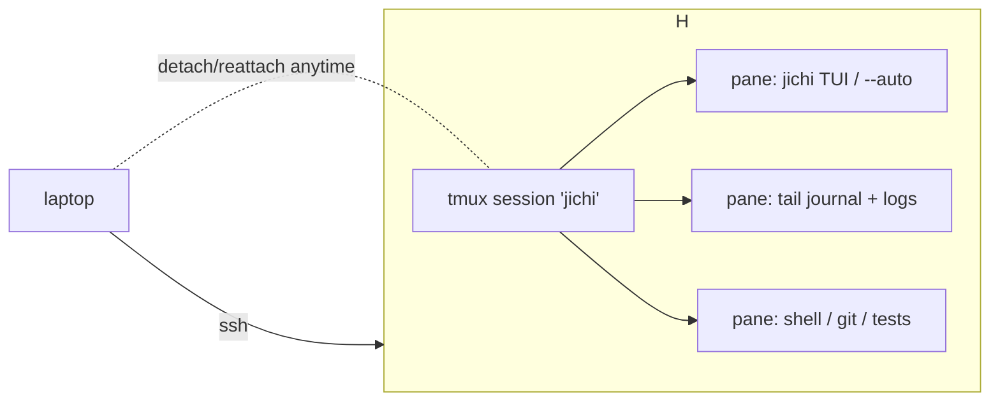

# Running jichi under tmux (on remote servers)

`tmux` is the right tool for driving jichi on a **remote box** — a GPU host, a CI
runner, a lab node — because it keeps your sessions (and long `--auto` runs)
alive across SSH disconnects, and lets you watch the agent, its logs, and a shell
side by side. This guide is practical; pair it with [REMOTE_SSH.md](REMOTE_SSH.md)
(driving jichi headless over SSH) and [DEPLOYMENT.md](DEPLOYMENT.md) (the lean
server config).

## Why tmux + jichi

- **Survive disconnects.** A dropped SSH connection kills your shell but *not* a
  tmux session — the agent keeps working; you reattach and it's still there.
- **Watch without blocking.** One pane for the jichi TUI, one tailing the journal,
  one free shell — you supervise an autonomous run without interleaving output.
- **Long runs are the norm.** An overnight `--auto` refactor or a batch grade
  belongs in a detached session, not a foreground SSH pipe.



## Quick start

```sh
ssh user@host
tmux new -s jichi                 # start a named session
# ... run jichi here ...
# detach: Ctrl-b d   (the session keeps running)
# later, from a fresh ssh:
tmux attach -t jichi              # reattach exactly where you left off
tmux ls                         # list live sessions
```

If tmux isn't installed: `apt install tmux` / `dnf install tmux` / `pkg install
tmux` (Termux). It's tiny and dependency-light — a good fit next to jichi.

## A supervision layout (three panes)

```sh
tmux new -s jichi \; \
  send-keys 'cd ~/project && jichi' C-m \; \
  split-window -v -p 30 \; \
  send-keys 'touch run.jsonl; tail -f run.jsonl' C-m \; \
  split-window -h \; \
  send-keys 'git status' C-m \; \
  select-pane -t 0
```

- **Pane 0 (top):** the jichi TUI (or an `--auto` run).
- **Pane 1 (bottom-left):** `tail -f` the autonomy **journal** (`--journal
  run.jsonl`) or the telemetry log.
- **Pane 2 (bottom-right):** a shell for `git`, tests, and ad-hoc commands.

Move between panes with `Ctrl-b` + arrow keys; zoom one full-screen with
`Ctrl-b z`.

## Long autonomous runs, detached

Start the run inside tmux, detach, and let it go:

```sh
tmux new -d -s task 'cd ~/project && \
  jichi --auto \
    --verify "make test" \
    --budget-tokens 800k --deadline 2h \
    --journal ~/logs/task-$(date +%s).jsonl \
    --bell --notify "printf %s done | mail -s jichi me@host" \
    -p "implement feature X and make the tests pass" \
    > ~/logs/task.out 2>&1'
```

- `-d` starts it **detached** — no terminal attached, so a disconnect can't touch
  it.
- Watch progress: `tmux attach -t task`, or `tail -f ~/logs/task.out`.
- `--bell` / `--notify` ping you on completion (see [NOTIFY.md](NOTIFY.md)); the
  bell reaches your terminal when you're attached.
- Because output is redirected to a file, the transcript survives even if the
  pane scrolls past it.

## The daemon in tmux

For a box that serves many quick requests, run the warm [daemon](DAEMON.md) in a
detached session and connect to it from anywhere:

```sh
tmux new -d -s jlud 'jichi --config ~/project/local/config.json \
  daemon --socket ~/.jichi.sock'
# from any shell on the host (or over an SSH tunnel):
jichi --connect ~/.jichi.sock -p "summarize today's changes"
```

The daemon keeps config/MCP/LSP/index hot and now serves requests from a
**bounded worker pool**, so several `--connect` clients can run concurrently.
tmux keeps the daemon alive across your logins.

## If you have never used tmux

Skip this if you have. Four ideas and you can use everything below.

1. **A session is a workspace that outlives your terminal.** Close the terminal — even lose
   the SSH connection — and the programs inside keep running. You reattach later.
2. **`Ctrl-b` is the prefix.** tmux commands are `Ctrl-b` *then* a key. Press and release
   `Ctrl-b`, then press the key. `Ctrl-b d` is "detach". Everything you type *without* the
   prefix goes to the program inside, so jichi still sees your Ctrl-C.
3. **Detach vs. kill.** `Ctrl-b d` leaves it running. `exit` inside the shell ends it. This is
   the distinction that matters for a long `--auto` run.
4. **A window holds panes.** A window is a screenful; panes are splits within it. You can watch
   jichi in one pane and `git diff` in another.

The five commands that cover most of it:

```sh
tmux new -s jichi      # create a session named "jichi" and attach to it
#   Ctrl-b d           # detach (it keeps running)
tmux ls                # list sessions -- your job list
tmux attach -t jichi   # go back to it
tmux kill-session -t jichi   # end it deliberately
```

**Try it once before you need it.** Start a session, run `sleep 300`, detach, run `tmux ls`,
reattach, see the sleep still going. Two minutes now saves an interrupted run later.

## Scrollback: reading back what the agent did

This is the tmux skill that matters most with jichi, because an agent turn can print far more
than a screen and the interesting part has usually just scrolled past.

**The problem to understand first.** Inside tmux, your terminal's own scrollbar and mouse wheel
no longer see the history — tmux keeps its own buffer per pane, and your terminal only ever sees
the current screen. So scrolling "feels broken" until you know where the history went.

### Copy-mode: the way in

```
Ctrl-b [        enter copy-mode (you are now looking at the pane's history)
  Up/Down       one line          PgUp/PgDn      one screen
  g / G         top / bottom      q              leave copy-mode
  /text         search FORWARD    ?text          search BACKWARD
  n / N         next / previous match
```

`?` searching **backward** is the one to remember: you are almost always looking for something
that already happened. `Ctrl-b [` then `?error` then Enter jumps to the last "error" in the
pane.

**You must leave copy-mode to type again.** Press `q`. A pane that "stopped accepting input" is
usually a pane still in copy-mode.

### Make the history big enough

The default is **2000 lines per pane**, which one `--auto` turn can exceed. In `~/.tmux.conf`:

```tmux
set -g history-limit 200000
```

Then `tmux kill-server` (or restart the session) — **it applies to panes created afterwards**,
not to existing ones. That single setting is the difference between reviewing a run and losing
it.

Memory cost: roughly the bytes actually printed, per pane. 200,000 lines of agent output is a
few tens of MB — cheap on a laptop, worth checking on a 512 MB board (see
[LOW_MEMORY.md](LOW_MEMORY.md)).

### Save a run to a file, which is better than scrolling

Scrollback is for looking; a file is for keeping.

```sh
# the whole scrollback of the current pane, to a file
tmux capture-pane -p -S - > run.log

# a specific pane of a specific session/window
tmux capture-pane -p -t jichi:0.1 -S - > pane1.log

# -S -   start at the beginning of the history ("-" = as far back as it goes)
# -p     print to stdout instead of an internal buffer
# -e     keep colour escape sequences (usually you do NOT want this in a file)
```

**Better still, do not rely on the terminal at all.** For anything you might want later, have
jichi write the record itself — it is structured, complete, and unaffected by scrollback:

```sh
jichi -p "$task" --auto --output jsonl | tee run.jsonl   # machine-readable events
jichi --log-level metrics -p "$task"                     # telemetry (docs/TELEMETRY.md)
jichi export --output json > transcript.json             # the conversation afterwards
```

A tmux pane is a *view*. Treat it as one, and keep the evidence elsewhere.

### Mouse mode, and the copy/paste trap

```tmux
set -g mouse on
```

Now the wheel scrolls (it enters copy-mode for you) and you can click panes. But **mouse
selection changes**: with `mouse on`, dragging selects into *tmux's* buffer, not your terminal's
clipboard, so `Ctrl-Shift-V` in another app pastes nothing.

To select with your terminal's own clipboard instead, hold the override key while dragging:
**Shift** on most terminals (xterm, GNOME Terminal, Konsole, Alacritty). If your terminal
supports OSC 52, tmux can put a copy-mode selection into the system clipboard:

```tmux
set -g set-clipboard on
```

Pasting *into* jichi is unaffected and safe: jichi enables bracketed paste, so a multi-line
paste arrives as one logical line rather than being executed line by line (M156).

## Practical tmux tips for agent work

- **Name your sessions** (`-s jichi`, `-s task`, `-s daemon`) so `tmux ls` reads like a job
  list. Future-you reading `tmux ls` after a weekend will thank present-you.
- **Don't nest a TUI in a tiny pane.** The jichi TUI is wrap-aware but happiest with a
  reasonably wide pane; `Ctrl-b z` zooms one pane to the whole window and back — the fastest way
  to read a diff without rearranging anything.
- **`Ctrl-b ?`** lists every binding. It is a searchable list (it opens in copy-mode), so `?zoom`
  finds the zoom key when you have forgotten it.
- **Rename a window** with `Ctrl-b ,` so the status bar says `agent` / `tests` / `daemon`
  instead of the last command that ran.
- **`Ctrl-b w`** shows an interactive list of every window in every session — the fastest way
  back to a run you have lost.
- **One project per session.** jichi's path fence, repo map and snapshots are all scoped to the
  directory it started in; a session per project root keeps that honest.

## Gotchas

- **Colour:** if colours look off, `tmux new -s jichi` then `export TERM=tmux-256color`
  (or `screen-256color`); jichi honours `NO_COLOR` and `--color` too.
- **A detached `--auto` run still needs its budget/verify guards** — tmux keeps it
  alive, so an unbounded run keeps *spending*. Always set `--budget-*` and
  `--verify` for detached autonomy.
- **The path fence is per-workspace** — start jichi (and the daemon) from the
  project root so fences and the repo map are scoped correctly.
- **`Ctrl-b` collides with things.** Emacs users lose `backward-char` inside the pane; if that
  bites, rebind the prefix in `~/.tmux.conf` (`set -g prefix C-a` plus
  `bind C-a send-prefix` so you can still send a literal one). Do it early or not at all —
  every guide you read will assume `Ctrl-b`.
- **Nested tmux** (a session inside a session, e.g. over SSH into a box that also uses tmux):
  the inner one needs the prefix **twice** — `Ctrl-b Ctrl-b d` detaches the inner session. If
  you routinely SSH into a tmux host, give the two servers different prefixes.
- **A pane that ignores your keys is usually in copy-mode.** Press `q`.
- **`Ctrl-b [` also affects what jichi sees: nothing.** Copy-mode is a tmux-side view; the
  program keeps running and keeps printing. You are not pausing the agent by scrolling back —
  which is good, and also means scrolling back is not a way to stop it. Use Ctrl-C, `/exit`, or
  the [control channel](CONTROL.md) `abort` for that.
- **Resizing mid-run is safe.** jichi handles `SIGWINCH` and redraws wrap-aware, so
  `Ctrl-b z` (zoom) and pane resizes during a streaming reply do not corrupt the display.

For a **looped/scheduled** run that works a *queue* of tasks (not one detached
run), see [AUTONOMOUS_LOOPS.md](AUTONOMOUS_LOOPS.md).

See also: [REMOTE_SSH.md](REMOTE_SSH.md), [DEPLOYMENT.md](DEPLOYMENT.md),
[AUTONOMY.md](AUTONOMY.md), [DAEMON.md](DAEMON.md),
[AUTONOMOUS_LOOPS.md](AUTONOMOUS_LOOPS.md).
