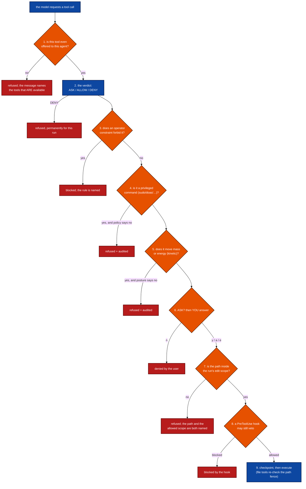

# What can it do to my machine, and who decides

This is the page to read before you let an agent touch anything you care about.

Six mechanisms decide whether one tool call runs. Each is documented somewhere;
until now **no page put them in order**, so a reader could know every part and
still not know what actually happens when the model says *"I'll edit this file"*.
Here is the order, taken from the code that runs it, not from a summary.

> **The short answer.** In the default mode, a tool that only *reads* runs
> immediately; a tool that *changes something* stops and asks you. Everything
> below is how that default is widened, narrowed, and overridden — and three
> places where the answer is not what most readers expect.

## The chain, in order



| # | Mechanism | Who sets it | Where it is documented |
| --- | --- | --- | --- |
| 1 | **The agent's own tool fence** — a subagent (or the `core` tool profile) is offered a subset; a tool it remembers from elsewhere is refused | `--tool-profile`, an agent definition | [SUBAGENTS.md](SUBAGENTS.md), [COMPACTION.md](COMPACTION.md) (tool profiles) |
| 2 | **The verdict** — mode baseline ⊕ `permissions.allow` / `permissions.deny` ⊕ per-server MCP policy | `mode`, `--auto`, `--plan`, `--readonly`, `permissions`, MCP `autoApprove`/`deny` | [AGENT_MODES.md](AGENT_MODES.md), [MCP.md](MCP.md) |
| 3 | **Constraints** — a hard limit you stated in words ("do not touch the database") | `/constrain`, `--design`, inferred from your prompt | [CONSTRAINTS.md](CONSTRAINTS.md) |
| 4 | **The privileged-command gate** — `sudo`, `doas`, `pkexec`, `su`, `run0` | `privilegedCommands: ask\|deny\|allow` (default `ask`) | [AGENT_MODES.md](AGENT_MODES.md) |
| 5 | **The kinetic gate** — a tool marked `kinetic: true`, and shell commands shadow-matched against it | `kinetic`, `kineticCommands`, `kineticShellPrefixes` | [ROBOTICS.md](ROBOTICS.md) |
| 6 | **You**, at the approval prompt | your keypress: `y` / `n` / `a`lways / `e`dit / `v`iew | [AGENT_MODES.md](AGENT_MODES.md) |
| 7 | **The envelope's edit scope** — which directories this run may write to | `--edit-scope`, `--strict-scope` | [AUTONOMY.md](AUTONOMY.md) |
| 8 | **A `PreToolUse` hook** — your own program, given the call, may veto it | `hooks` | [HOOKS.md](HOOKS.md) |
| 9 | **The path fence**, re-checked inside every file tool at execution | `--path-fence`, `--reference-root` | [SECURITY.md](../SECURITY.md) |

## The verdict, exactly

Step 2 is one pure function, and this is its whole logic in the order it runs:

1. **Deny dominates.** A name in `permissions.deny`, or an MCP server policy of
   `deny`, and nothing later can rescue it.
2. **Plan mode forbids mutation**, even for an allow-listed tool.
3. **`permissions.allow` beats the mode baseline** — this is how you pre-approve
   `run_terminal_command` in chat mode.
4. **An MCP `autoApprove`** allows it.
5. **Otherwise the mode baseline:** in `auto`, allow; in `chat`, allow if the tool
   is read-only, ask if it mutates.

## Three things readers get wrong

**An ALLOW verdict does not mean "it runs".** Steps 3–5 and 7–8 come *after* the
verdict. This is deliberate and it is the whole design of the privileged gate: a
blanket `--auto`, an allow-list entry, or a prior "always" is **command-blind**,
and a command-blind grant is exactly what once let an agent escalate privilege
unbidden. So `sudo` is re-asked every time in an interactive session and refused
outright in an unattended one, whatever the verdict said.

**Your "yes" is not the last word either.** The edit-scope fence (7) and the hook
(8) run *after* the prompt. If you approve a write to a path outside the run's
scope, it is still refused — and the refusal names both the path and the scope, so
you can re-launch with the scope you meant. If you pressed `e` and edited the
arguments, the checks re-run against the **edited** call, not the original.

**Headless is not "auto".** With `-p` and no `--auto`, an ASK verdict has nobody
to ask, so it is **refused** with a message telling the model to re-run under
`--auto`. It does not silently proceed, and it does not hang. (One exception,
stated because it surprises people: a *subagent* running under an auto posture
executes ASK verdicts without prompting — its fence is the tool list it was given
at step 1, plus everything from step 3 onward.)

## `ask_user` is the other direction

Do not confuse the approval prompt with the `ask_user` **tool**. The prompt is
*you* authorising the model's action. `ask_user` is the *model* asking you a
question it cannot answer alone — a missing decision, an ambiguous requirement. In
an unattended run it cannot be answered, so it is recorded in the run journal as
an unanswered question rather than blocking forever. See
[AGENT_MODES.md](AGENT_MODES.md) and [AUTONOMY.md](AUTONOMY.md).

## What this chain is not

It is **not a sandbox.** Steps 4 and 5 are heuristics over the visible command
text: quote-aware, interpreter-aware, wrapper-aware — and still a heuristic. They
catch a drifting honest model, not an adversary. A determined program can copy a
script, pipe text into a shell, or write and run its own code, and none of that is
visible to a matcher.

The honest containment answer is **deployment**, not C: run jichi as a non-root
user, in a container or VM, on a machine whose devices it may touch. That is
stated with its reasoning in [DEPLOYMENT.md](DEPLOYMENT.md) §5 and tracked as this
project's oldest open safety item in [DEFERRED.md](DEFERRED.md) ("fence hardening
and isolation"). The file tools *are* fenced to the workspace (step 9); the shell
is not, and no page here will pretend otherwise.

## Reading it live

Two commands answer "what would happen" without running anything:

```sh
jichi doctor
jichi context
```

What each one actually answers — checked against the binary, because the first
draft of this paragraph claimed more than `doctor` delivers:

| Question | Ask |
| --- | --- |
| which mode am I in? | **`jichi status`** — model, mode, snapshots, repo-map, cwd |
| what can the model even see? | **`jichi context`** — a tool the model is not shown is a tool it will not call |
| what will the *machinery* refuse? | **`jichi doctor`** — reachability, keys, the path fence's posture, whether a privileged-audit sink is disabled |
| what were my permission lists? | the config itself (`jichi config path`), and `jichi sysmsg` for what the model was told about them |
| what happened while I was away? | **`jichi runs`** and the run journal — every decision, each refusal and its reason |

`doctor` does **not** print the mode or the permission lists; it is a health
check on the environment, not a description of the posture. That distinction is
worth keeping straight, because the two questions fail in different ways.
