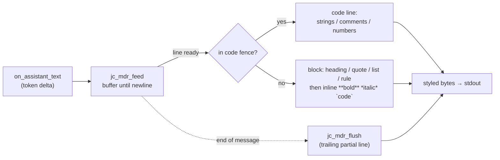

# TUI rendering: markdown, syntax, and the reply header

In the interactive TUI, the assistant's reply is rendered with **markdown
styling** and **light syntax highlighting** as it streams, and each reply is
prefixed with a colour-emphasised **`<model> · <mode>`** header so you can see
which model actually answered (after any routing/fallback) and the current mode.

```
gemma-4-31b-it · chat
Here's a fix:

  fixed.c
  @@ -1,3 +1,3 @@   (edit previews still render as before)

1. read the file
2. apply the patch

    int add(int a, int b) { return a + b; }   ← code block, lightly colored
[tokens in=3292 out=41]
```

This applies only to the interactive TUI when color is on. Headless (`-p`,
`--output json`) output is always raw text, so pipes and JSON stay clean.

## Pipeline

The model streams text in token-sized deltas, so a `**bold**` span or a ```` ``` ````
fence can be split across deltas. The renderer is a **line-buffered state
machine**: bytes accumulate until a newline, then the completed line is
classified and styled.



## What's styled

| Element | Rendering |
| --- | --- |
| `# … ######` headings | bold cyan |
| `**bold**`, `*italic*`, `` `code` `` | bold / italic / cyan (inline) |
| `- ` / `* ` / `+ ` / `N.` lists | marker kept, remainder inline-styled |
| `>` blockquote, `---`/`***` rule | dim |
| ```` ```lang ```` fenced blocks | dim fence; body highlighted **per language** (from the `lang` tag): keywords (blue), strings, numbers, and the language's comment syntax (`//`+`/* */`, `#`, `;`, `--`, `%`). Languages: C/C++, Python, JS/TS, Go, Rust, shell, Lisp family (Racket/Scheme/Clojure), Java, Ruby, Haskell, Erlang, Elixir, Zig. Unknown/untagged blocks fall back to a generic strings/`//`+`#`/numbers highlight |

`_underscore_` emphasis is intentionally **not** styled (too common in
identifiers and paths). Per-language highlighting is driven by the fence tag
(e.g. ```` ```python ````) via a small static keyword/comment table — a
heuristic, not a real per-language parser; it favors not mangling code over
completeness.

**Cross-line state.** C-style block comments (`/* … */`) are tracked across
lines: the renderer carries an `in_block` flag so a comment opened on one line
keeps dimming until its `*/`, then highlighting resumes on the same line. A fence
boundary cancels any open block comment. Plain single-/double-quoted **strings
stay line-local on purpose** — a stray unmatched quote (an apostrophe in a
comment, a contraction in prose) is far more common than a real multi-line
string, so continuing strings across lines would mis-highlight more than it
helps. Triple-quoted strings and heredocs are likewise line-local.

## Controlling it

- Config `"markdown": true|false` (default true — but **false under `--lite`**,
  which jichi auto-enables on a machine with less than ~1 GB of RAM, so a small
  box shows raw text until you set it explicitly).
- `--no-markdown` on the command line.
- `/markdown [on|off]` in the TUI (shows the state with no argument).
- Disabled automatically when color is off (`--no-color`, `NO_COLOR`, or a
  non-TTY), since it relies on ANSI styling.

## The reply header & token line

`on_message_begin` prints the `<model> · <mode>` header and resets the renderer
for the new message. The pieces are **colour-emphasised** (when colour is on):
the **model** in bold cyan, the separator dim, and the **mode** in a mode-keyed
colour — `chat` green, `plan` blue, `auto` **yellow** (so the unattended posture
stands out) — via the pure `jc_mode_color` (`src/util/jc_cli.c`). The same mode
colour is used in the `[mode·model]` input prompt, so the mode reads consistently
in both places.

**The model half names the model, not just the tier** (M296). A config `name` is an
intent label — `fast`, `strong` — so an agent profile can pin a tier without writing
a vendor id. That tells you which tier is active and nothing about which model is
answering, so the header renders both via the pure `jc_model_display`:

```
fast (jlu/qwen3-coder-next) · chat · 21:55:32
```

The id is the **full** wire id (shortening it would make `jlu/coder` and
`other/coder` identical), and the parenthetical is dropped when it would repeat the
name or when the config declares no `name` at all.

**Why the header and not the prompt.** This header is emitted **per model call** —
`cb_message_begin` runs before each `stream_once` — so it tracks a mid-turn routing
escalation as it happens. The prompt is rebuilt once per turn *before* the turn
runs, while routing switches the active model *during* one: after an escalating
turn, the prompt drawn next reads `strong` and the loop immediately re-routes to
`fast` for that very turn. Its model segment therefore cannot be authoritative once
routing is live, so it deliberately keeps the short tier name — a full id there
would make a sometimes-stale value look precise, at ~22 columns on every line.

Token usage arrives mid-stream (`on_usage`), but to keep the **reply first**, the
per-message token line is printed at `on_message_end` — after the (line-buffered)
reply is flushed. Its label and brackets stay dim while the counts are coloured —
`in=` cyan, `out=` green — so the input/output split reads at a glance:
`[tokens in=3292 out=41]`. All of this is TUI-and-colour-only; headless (`-p`,
`--output json`) stays raw text.

## Typing while the agent works

The working indicator's line doubles as the live echo for the **type-ahead
queue** (M254): keystrokes typed during a turn are collected by jichi rather than
echoed by the tty, shown beside the spinner as `» your text`, and applied at the
agent's next step. See [TYPE_AHEAD.md](TYPE_AHEAD.md) — including why the echo
lives in that line specifically (it owns the last row and redraws it with CR +
erase, so the scrolling transcript can never be overwritten).

## Pasting multi-line text and special characters (M156/M363)

A paste arrives one of two ways. With **bracketed paste** (enabled for every
`readline`, `ESC[200~ … ESC[201~`) the body is read verbatim, spliced at the
cursor, and each line but the last is committed to the multi-line accumulator
— the paste never submits; a real Enter does. Terminals without it hit the
**burst fallback**: a newline with input already pending is part of a paste,
not a typed Enter.

What happens to the bytes (M363, all pinned by
`tests/smoke/paste_special.sh` end-to-end against captured request bodies):

- **CRLF and lone CR normalize to LF**, and in the burst fallback the LF half
  of a CRLF pair is swallowed — a Windows-lineage paste used to gain a blank
  row per line there.
- **C0 control characters (except newline and tab) and DEL are stripped** by
  the pure `jc_paste_splice`. The editor re-emits the buffer on every redraw,
  so a pasted ESC would replay pasted escape sequences into the terminal per
  keystroke — output-side paste injection, the twin of the attack bracketed
  paste exists to stop. UTF-8 bytes pass untouched.
- **Tabs survive as content** (they are real in Makefiles), and the column
  math accounts for them: `jc_term_str_cols_from` advances a tab to the next
  8-column stop of its *absolute* position, prompt included. Before M363 a
  tab counted as one column while the terminal jumped up to eight, and every
  keystroke after a pasted tab repositioned the cursor from wrong geometry.
  (Approximate on lines that wrap — tab stops reset per screen row.)
- **A paste larger than 1 MB is capped, and the remainder is drained** to the
  terminator. It used to be left in the input queue and replayed as
  keystrokes — pasted escape sequences ran as key escapes past the cap.
- **Multi-line submissions never enter line history**: the editor is a
  one-row editor, and recalling an entry with embedded newlines stair-stepped
  the input region under raw mode. Arrow-up recalls the previous single-line
  entry instead.

Known limit, stated rather than fixed: in the burst fallback (no bracketed
paste), pasted bytes are indistinguishable from typed keys, so a pasted ESC
sequence there is interpreted as a key — that is the terminal's limitation,
and the reason bracketed paste is enabled whenever the terminal offers it.

## Internals

- **Pure renderer** — `src/util/jc_mdrender.c` (`include/jc_mdrender.h`):
  `jc_mdr_init`/`_reset`/`_feed`/`_flush`/`_free`; the line classifier, the inline
  scanner, and the generic code highlighter are all pure and append to a
  caller's `jc_sb`. Unit-tested in `tests/test_mdrender.c` (including deltas split
  mid-span and the color-off passthrough).
- **TUI wiring** — `src/tui/jc_tui.c`: `struct tui_ctx` holds the renderer and a
  `markdown` flag (`color && config.markdown`); `cb_text` feeds it, `cb_message_begin`
  prints the header + resets, `cb_message_end` flushes + prints the token line.
- See also [`docs/EDITING.md`](EDITING.md) for the edit diff preview, which is a
  separate render path (tool activity, not assistant prose).
