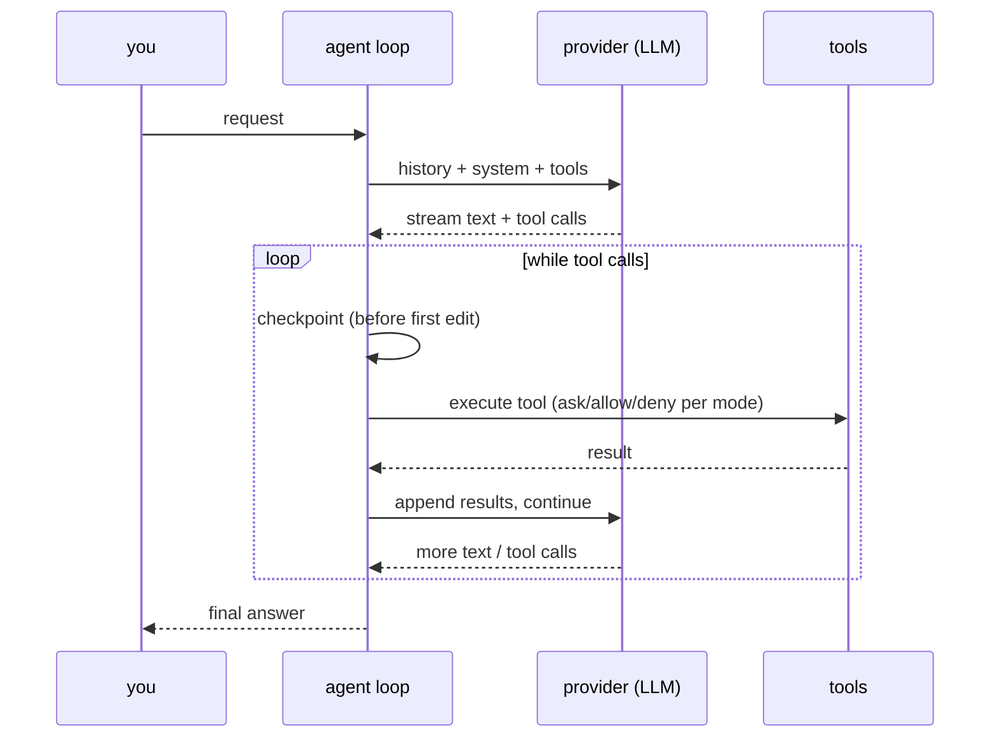
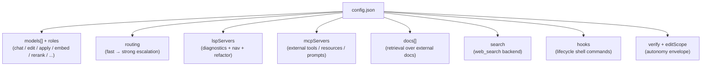

# Advanced tutorial: power use

Companion: [TUTORIAL_ORCHESTRATION.md](TUTORIAL_ORCHESTRATION.md) covers
sub-agents and parallel fan-out step by step.

Assumes you've done [TUTORIAL_BEGINNER.md](TUTORIAL_BEGINNER.md) and have a
working `local/config.json`. This covers the subsystems that make jichi more than
a chat box: routing, MCP/LSP, subagents, autonomy, hooks, and authoring your own
role preset. Each section links to its full reference.

## What happens in one turn



The agent keeps looping — model, tools, model — until the model stops asking for
tools. Permissions are resolved per call by your **mode** (see
[AGENT_MODES.md](AGENT_MODES.md)).

## Comprehensive setup

The wizard's "accept defaults?" prompt → **no** opens the full optional chain.
Or pass nothing and answer every toggle. The subsystems:



You can always edit `local/config.json` by hand afterward; the wizard's
single-entry prompts cover the common case, and multi-server setups (several
MCP/LSP/docs entries) are a quick edit away.

## Multi-model routing

Run a cheap, fast model first and **escalate** to a strong one only when needed
(a verify failure, a tool error, or a stall):

```jsonc
"routing": {
  "enabled": true,
  "fast": "gpt-4o-mini",
  "strong": "gpt-4o",
  "escalateOnError": true,
  "escalateOnStall": true
}
```

Toggle live with `/route`, `/timeouts`. Full reference:
[ROUTING.md](ROUTING.md), [MODELS.md](MODELS.md).

## LSP: navigation + safe refactors

Point jichi at a language server and it gains `find_definition`,
`find_references`, `list_symbols`, plus the mutating `rename_symbol` and
`format_file`, and surfaces diagnostics after edits:

```jsonc
"lspServers": [
  { "name": "clangd", "command": "clangd", "extensions": ["c", "h"] }
]
```

See [LSP.md](LSP.md).

## MCP: external tools, resources, prompts

Connect [Model Context Protocol](https://modelcontextprotocol.io) servers to expose their tools as jichi
tools, their resources via `@mcp:` / `read_mcp_resource`, and their prompts as
slash commands:

```jsonc
"mcpServers": [
  { "name": "fs", "command": "mcp-server-filesystem", "args": ["/data"] }
]
```

`/mcp` lists connected servers; per-server `autoApprove`/`deny` set the approval
policy, and an HTTP-transport server (`"url": …`) may carry a `headers` array
of extra request headers (e.g. an Authorization line).

Full reference, including the config shape (an **array**, not an object — the
commonest mistake), the approval policy, resources, prompts-as-slash-commands and
the security posture: **[MCP.md](MCP.md)**.

## Subagents and parallel agents

Delegate a scoped subtask to a nested agent, or fan out across CPU cores:

- `spawn_subagent` — one synchronous nested agent (own history, optional
  different model, optional read-only sandbox, optional named profile).
- `spawn_parallel` — N subtasks concurrently in a fork pool; read-only tasks run
  in the live tree, `write` tasks each in an isolated git worktree (merged
  file-level, first-wins).

Depth is bounded by `maxSubagentDepth`. See
[SUBAGENTS.md](SUBAGENTS.md), [PARALLEL.md](PARALLEL.md).

## Autonomy envelope

For unattended runs, bound them: a verification gate that fixes-forward then
rolls back to the last green checkpoint on failure, plus budgets and an
edit-scope fence.

```sh
jichi -p "fix the failing tests" --auto \
  --verify "make test" --max-tool-calls 40 --edit-scope 'src/**'
```

See [AUTONOMY.md](AUTONOMY.md).

## Hooks

Fire shell commands at lifecycle points (`SessionStart`, `PreToolUse`,
`PostToolUse`, `Stop`, ...). A hook can only *narrow* an action (exit 2 blocks).
Useful for linters, formatters, and audit logging. See [HOOKS.md](HOOKS.md).

## Custom commands, skills, output styles

- `.jichi/commands/*.md` — your own slash commands (template expansion:
  `$ARGUMENTS`, `$1`, `` !`cmd` ``, `@file`); frontmatter can set `agent:`,
  `model:`, `subtask:`. See [COMMANDS.md](COMMANDS.md).
- `.jichi/skills/<name>/SKILL.md` — model-invoked instruction sets, loaded on
  demand. See [SKILLS.md](SKILLS.md).
- `.jichi/output-styles/*.md` — persona augmentation for a whole session. See
  [OUTPUT_STYLES.md](OUTPUT_STYLES.md).

The setup wizard scaffolds a role-appropriate starter set of all three.

## Authoring a role preset

Presets are compiled-in (`src/setup/jc_setup.c`), so adding one is a small,
testable change rather than config:

1. Pick or add a **scaffold pack** in `src/scaffold/jc_scaffold.c` (a domain
   `AGENTS.md` + a couple of agents + a skill — reuse the shared content
   tables). The `devops` and `data` packs are recent examples.
2. Add a `struct jc_setup_preset` row to the `PRESETS` table: name, description,
   the pack, a default mode/output-style, a `JC_SF_*` feature bitmask, a
   start-script profile, and whether it `asks_language`.
3. `jc_setup_apply_preset` turns the bitmask into concrete answers; extend it if
   you add a new feature flag.
4. Add assertions to `tests/test_setup.c` (the preset references a real pack;
   the built config has the roles/toggles you expect; no secret is emitted).

Because the preset table is pure data, `setup --list` and the wizard pick it up
automatically. The "every shipped asset parses" guard in `tests/test_scaffold.c`
covers any new pack.

See [SETUP_WIZARD.md](SETUP_WIZARD.md) for the preset → pack mapping and the
full flag list.
