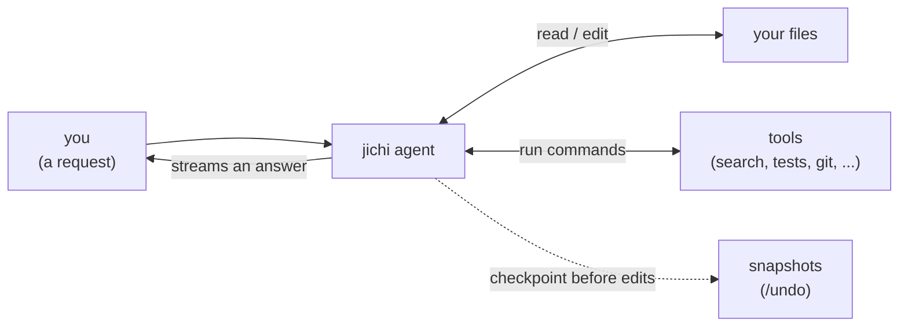

# Beginner tutorial: your first jichi project

This walks you from a fresh build to a working AI coding session in a few
minutes. No prior jichi knowledge assumed. If a step doesn't work, jump to
[If it doesn't work](#if-it-doesnt-work) at the bottom.

> **You are the developer, not a spectator.** jichi does the typing; *you* do
> the thinking — deciding what to ask for, reading every change before you
> approve it, and checking that what it did is actually right. It is often
> confidently wrong. Treating it as a fast, tireless junior whose work you
> always review is the whole skill this tutorial (and the
> [curriculum](CURRICULUM.md)) is teaching.

## The mental model

jichi is an **agent**: you ask in plain language, and it reads files, runs tools,
and edits code on your behalf — checking with you before doing anything risky.



The key safety net: before jichi's first file edit in a turn it takes a
**checkpoint**, so `/undo` always gets you back. Your own git history is never
touched (checkpoints live in a separate shadow repo).

## 0. Install — and make `jichi` a command

Never compiled from source? Follow
[PREPARE_AND_BUILD.md](PREPARE_AND_BUILD.md) first — it takes you from an empty
terminal to a built `jichi` — then come back here. (`INSTALL.md` is the
system-requirements *reference*, not a walkthrough.)

After building, the program sits as **`./jichi` inside the build folder**. So
every command below works from *any* project directory, turn it into a real
command — pick one:

```sh
sudo make install            # run in the build folder; installs it system-wide
# — or, if you have no admin rights —
export PATH="$PWD:$PATH"      # run in the build folder; lasts for this terminal only
```

If you skip this, just write the full path to your build (`~/jichi/jichi`)
wherever this guide writes `jichi`. You also need a model to talk to — the setup
wizard in §1 asks for it; with no API key, see
[LOCAL_MODELS.md](LOCAL_MODELS.md).

## 1. Run the setup wizard

In your project directory:

```sh
jichi setup
```

Answer the prompts:

1. **Role preset** — pick `developer` for writing/editing code. (Writers pick
   `technical-writer`, reviewers `reviewer`, and so on — see
   [SETUP_WIZARD.md](SETUP_WIZARD.md).)
2. **Language pack** — e.g. `c-cli` or `python-cli` (developers/testers only).
   Pick the one matching the language you mostly write; it adds a reviewer and a
   test command tuned for it. **If you are unsure, accept the default** — jichi
   detects it from the files already in the folder, and nothing here is
   permanent.
3. **Provider / model / key env-var** — e.g. `openai`, `gpt-4o`, and the key
   env-var (default `JICHI_API_KEY`). The wizard stores only the *name* of the
   env-var, never your key.
4. **Where to write the config** — accept the default (`./local/config.json`).
5. **Accept the role's defaults?** — say **yes** for now.

It scaffolds `.jichi/` assets, writes `local/config.json`, and creates an
executable `run.sh`. (Prefer one command? `setup --preset developer --provider
openai --model gpt-4o --key-env OPENAI_API_KEY` does the same without prompts.)

## 2. Set your API key

The config references an env-var; export the real key into your shell:

```sh
export JICHI_API_KEY=sk-...       # the name you gave the wizard
```

> **This lasts only for the current terminal.** Open a new one tomorrow and
> you'll get `401` errors until you `export` again — so add that line to your
> `~/.bashrc` (or `~/.zshrc`) to make it permanent. The key lives in your shell,
> **never** in the config file (the config stores only the env-var *name*).

## 3. Check your setup

Run this **from your project directory** (jichi auto-loads `./local/config.json`
there, so you don't pass `--config`):

```sh
jichi doctor
```

Read every line — understanding your own setup is the first real developer
habit. You want mostly ✓. A ✓ on the API key means it's exported correctly; a
`!` there just means you haven't exported it in *this* terminal yet.

## 4. Start chatting

> **Where am I supposed to be?** Two directories, never the same one: you *build
> and install* jichi from its own source checkout, and you *run* it from
> whichever project you want help with. jichi reads config and files relative to
> the directory you are standing in — so `cd` into your project first. If a
> feature the docs describe seems to be missing entirely, check you are running
> the binary you installed: `command -v jichi` and `ls -l $(command -v jichi)`.
> More than one copy on `PATH` is the most common cause, and
> [`INSTALL.md`](INSTALL.md) has the one-command fix.

> **Checkpoint before you go further — and a tutor should make this mandatory.**
> Run `jichi doctor` and confirm the **API key line shows a tick**. If the key is
> missing, the TUI still opens and then fails on your first message, which looks
> like a jichi bug and is not one. In a class, a whole room hits this together.

```sh
jichi doctor        # the key line must be a tick before continuing
./run.sh            # setup wrote run.sh into the directory you ran it in --
                    # so it is here, beside your project. It starts jichi with
                    # this project's config and key already loaded; `cat run.sh`
                    # to see exactly what it does.
```

This opens the interactive TUI. The prompt shows `[mode·model]`. Try it **inside
a real code project** (an empty folder has nothing to read — `cd` into any repo
you have first):

- *"What does this project do? Summarize the layout."* — jichi reads and
  explains. Spot-check the answer against the actual files; a confident summary
  can still be wrong.
- *"Add a `--version` flag that prints the build date."* — jichi proposes an edit
  and shows you a **diff preview** before writing. **Then check it yourself:**
  rebuild and run the flag. "The diff looked right" is not the same as "it works",
  and noticing that difference is most of what this tutorial is teaching.

When jichi wants to edit a file or run a command, you get a one-key prompt:
`y` (once) · `n` (no) · `a` (always, this session) · `v` (view full args).
**Read the diff before you press `y`.** Approving without reading is how bad
changes slip in — judging the change *is* the developer's job here, and the one
skill this whole tutorial exists to build.

## 4b. Getting the prompt right before you send it

A vague request wastes a turn: the model guesses, you correct it, and you have
paid for both. Three keys help you spend less time on that, and none of them
sends anything until you press Enter.

**Tab — complete what you are typing.** Offline, instant, no model call. Works
on slash-commands (`/mo` → `/model`), model names, session ids, modes, and
`@path` file references. Press it twice on an ambiguous prefix and jichi lists
the options.

**Ctrl-Q — "is this clear enough?"** Type your request, press Ctrl-Q, and one
line appears *below* your prompt telling you the most useful thing you have not
decided. Your typing is untouched — the advice is printed, never inserted.

```
[chat·gemma-4·2%] › add caching to the loader
  advice: which loader, and cache what — parsed results or raw bytes?
[chat·gemma-4·2%] › add caching to the loader
```

Now you know what to add. If your request is already specific, it answers
`looks clear` and you can send it with confidence. **This is the single most
useful key in this tutorial for building the habit of asking answerable
questions** — the same habit that makes you better at briefing a colleague.

**Ctrl-G — finish my sentence.** A greyed-out continuation appears after your
cursor; **Tab** keeps it, any other key throws it away. Be aware of an honest
caveat: whether you get a *continuation* depends on the model you have in the
`autocomplete` role. A chat model may answer your half-question instead of
finishing it, which looks like garbled text in your line. It costs one keystroke
to dismiss, and `docs/AUTOCOMPLETE.md` explains how to point that role at a
model better suited to the job.

Two more, worth knowing early: **Ctrl-R** searches your history (useful when you
want yesterday's phrasing), and ending a line with **`\`** continues it on the
next, so you can write a multi-line request. Pasting several lines works too —
jichi keeps a pasted block as one message rather than sending each line.

Press **`/help`** any time: the last section lists every key.

## 5. Undo if needed

Made a change you don't like?

```
/undo
```

This restores the files to the checkpoint taken before the last turn's edits.
`/diff` shows what changed since that checkpoint; `/checkpoints` lists them.

## 6. Handy commands

| Command | What it does |
|---|---|
| `/help` | List all slash commands. |
| `/model` | Switch the active model. |
| `/mode` | Switch chat / plan / auto mode. |
| `/diff` | Show changes since the last checkpoint. |
| `/undo` | Roll back the last turn's edits. |
| `/cost` | Show token usage and estimated cost. |
| `/exit` | Quit. |

Keys, while typing (the full readline-style set — arrows, Home/End and
Alt-B/Alt-F word moves work as usual):

| Key | Does |
|---|---|
| **Tab** | complete the command / path / name under the cursor |
| **Ctrl-Q** | ask the model whether your prompt is clear before you send it |
| **Ctrl-G** | suggest an ending (ghost text; Tab accepts, any key dismisses) |
| **Ctrl-R** | reverse-search your input history |
| **Ctrl-P** / **Ctrl-N** | older / newer history entry (also Up / Down) |
| **Ctrl-A** / **Ctrl-E** | start / end of line |
| **Ctrl-B** / **Ctrl-F** | one character left / right (also the arrows) |
| **Ctrl-W** | delete the word left of the cursor |
| **Ctrl-K** / **Ctrl-U** | delete to end / to start of line |
| **Ctrl-Y** | paste back the last deletion (the kill ring) |
| **Ctrl-T** | transpose the two characters at the cursor |
| **Ctrl-_** | undo the last edit to the line |
| **Ctrl-L** | clear the screen and redraw the input line |
| **Ctrl-D** | delete the character under the cursor; on an empty line, exit |
| **Ctrl-C** | clear the line; on an empty line, cancel / interrupt |

Outside the chat you can also run one-shot prompts:

```sh
jichi -p "explain src/main.c"     # from your project dir; auto-loads local/config.json
```

## 6b. Measure your runs

jichi can keep a metrics log of its own work — per call: latency, tokens in
and out, cost, which tools ran and whether they succeeded. Several presets
turn it on for you (`tester`, `learner`, `instructor`, and the project
journeys) — and since M599 the `metrics` tier is **on by default for every
config**, so there is nothing to switch on: the numbers (never your words or
your code) accumulate in one file per project from your first turn. To turn it
off, or to raise it to the content-bearing `full` tier, it is one key:

```json
"logging": "metrics"
```

The log lands in `~/.jichi.d/telemetry/` — **outside** your project, so
checkpoints and `/undo` never touch it, and nothing about your prompts or
code is recorded at this tier (that is the separate, opt-in `full` tier).

Two commands read it back:

```sh
jichi telemetry     # totals, cost, tool success rates -- and a per-session
                    # timeline: where the tokens and money actually went
jichi runs          # one row per bounded --auto run: verify, budget, outcome
```

Two things make the numbers meaningful:

- **Prices.** Costs read $0 until you set what your models cost, per model
  in the config: `"inputCostPer1M": 5.0, "outputCostPer1M": 25.0` (USD per
  million tokens; local models are genuinely 0). Without them, `/cost`, the
  `$` in the prompt, and the telemetry summary show zeros that look like data.
- **A budget.** Give an unattended run a ceiling — `--auto --budget-tokens
  400k` (the `tester` preset's `test.sh` ships this) — and jichi briefs the
  model on its limits at the start, warns it at ~80%, and journals the run
  for `jichi runs`.

Once a few sessions have accumulated, `jichi learn analyze` mines the log for
recurring problems (a tool that keeps failing, redo loops) and drafts lessons —
that loop is [LEARNING.md](LEARNING.md).

## 7. When a turn stops before it is finished

Sometimes a turn ends with the agent mid-task and a line like:

```
[jichi warn] hit max tool iterations (25)
```

**Nothing broke and nothing was lost.** Every change it made is still there. jichi limits how
many tool steps *one* turn may take, so a model that gets stuck in a loop cannot run forever.

To carry on, just say so:

```
continue
```

The agent still has the whole conversation, so it picks up where it stopped with a fresh step
budget. Being specific is better than `continue` — *"finish the tests, then stop"* gives it a
target.

If it happens on every turn, the task is bigger than the limit. Either split it up, or raise
the limit (`"maxToolIters": 50` in your config). Splitting is usually the better answer: a task
that needs 50 tool steps is hard to review in one go.

## 8. Keeping a long run alive: tmux

If you want a long run to survive closing your terminal — or an SSH connection dropping — run
jichi inside **tmux**. It is also how you scroll back through output that has left the screen,
which sounds minor until the first time you need it.

The short version:

```sh
tmux new -s jichi     # start a named workspace, and attach to it
jichi                 # run jichi inside it as usual
#  Ctrl-b then d      # detach -- jichi keeps running without you
tmux attach -t jichi  # come back to it later
#  Ctrl-b then [      # scroll back through the output ( q to leave )
```

That is enough to be useful today. [`TMUX.md`](TMUX.md) walks through it properly for a first
time — including making the scrollback big enough (the default of 2000 lines is smaller than
one long run), saving a run to a file, and the mouse/clipboard trap that catches everyone once.

## If it doesn't work

- **"command not found: jichi"** — it's not on your `PATH`. Use the full
  path, or set `JICHI=/path/to/jichi ./run.sh` (the script honors `$JICHI`).
- **Auth / 401 errors** — your key env-var isn't exported in *this* shell. Re-run
  `export ...` and check `doctor`. Confirm the env-var name matches the config's
  `apiKeyEnv`.
- **"connection refused" / unreachable** — for a local model server, make sure
  it's running and the `apiBase` in `local/config.json` matches its URL.
- **It won't edit a file** — you may be in **plan mode** (read-only). Type
  `/mode` and pick `chat`.
- **Want a clean slate?** — delete `local/config.json` and `.jichi/` and re-run
  `setup`.

Next: [TUTORIAL_ADVANCED.md](TUTORIAL_ADVANCED.md) for routing, MCP/LSP,
subagents, autonomy, and authoring your own presets.

Want to get genuinely *good* — not just at driving jichi, but at the craft of
software, with the agent as your practice partner? That is what the
[curriculum](CURRICULUM.md) is for: a guided path from safe first edits to
reading, testing, and reviewing real code, and to the habit that matters most —
keeping an honest record of your own mistakes and what each taught you.
