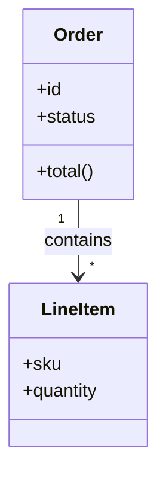
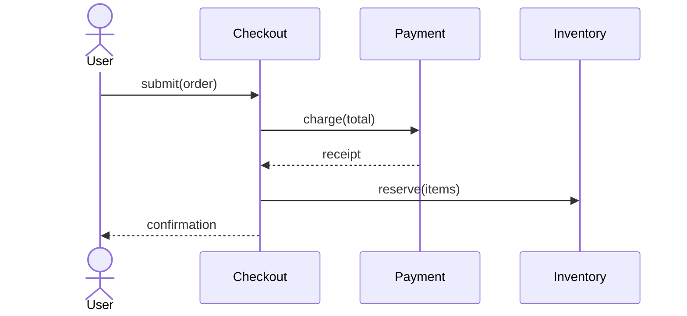
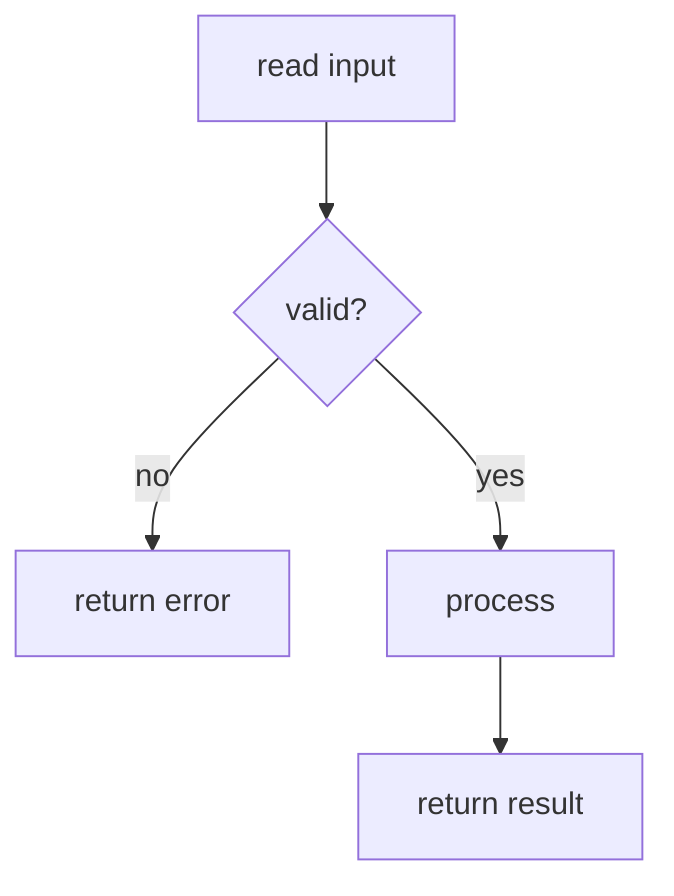
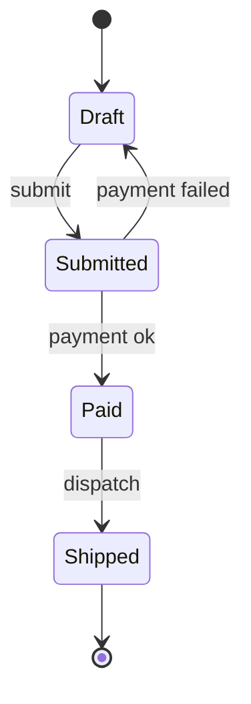

# UML as mermaid — which diagram answers which question — a tutorial

A learner's guide to UML the way jichi uses it: not the full 14-diagram
specification, but the four diagrams that earn their place in a real project,
written as **mermaid in markdown** so they live in the repository, review in a
diff, and never drift into a binary nobody can edit. The thesis: **a diagram is
an answer to one question; pick the diagram by the question, keep it to that one
question, and date it — because a diagram nobody can redraw from the code is a
lie with a timestamp.**

## 1. Why mermaid, why only four

Classical UML tools produce images: a `.png` or a proprietary file that a diff
renders as "binary changed", that no reviewer can check, and that rots silently
the moment the code moves. Mermaid is *text* — you write the diagram in a fenced
block, it renders where markdown renders, and a reviewer sees exactly what
changed. jichi's docs use mermaid for 70-plus diagrams for this reason.

> **How to actually see one rendered** — do this before you read on, or every
> example below is just text to you. Nothing in jichi renders mermaid for you.
> Any one of these works: paste the fenced block into <https://mermaid.live>
> (also the fastest way to locate a syntax error, which it points at); view the
> file on GitHub/GitLab, which render mermaid natively; or install a mermaid
> preview extension in your editor. Until you can see a diagram, you cannot tell
> a correct one from a broken one — which is the whole reason text-first beats a
> drawing tool.

And you need far fewer diagram types than UML defines. Four answer almost every
question worth drawing:

| Question | Diagram |
|---|---|
| What are the types and how do they relate? (data structures, ownership) | `classDiagram` |
| Who calls whom, in what order? (program flow across modules) | `sequenceDiagram` |
| What are the branches of *this* algorithm? (flow within a function; data flow) | `flowchart` |
| What states can this thing be in, and what moves it between them? | `stateDiagram-v2` |

This is the `uml-mermaid` skill jichi ships (in the `sdlc` scaffold pack); this
tutorial is its learner-facing half.

## 2. classDiagram — types and relations

Use it to show the shape of your data and who owns what.



The relation labels and multiplicities (`"1" --> "*"`) are the content — they say
an Order contains many LineItems and each LineItem belongs to one Order. That
ownership fact is exactly what a reader needs and what prose states clumsily.
This is the diagram to reach for when you are
[domain modelling](DOMAIN_MODELLING_TUTORIAL.md) — entities and their relations
are a class diagram.

## 3. sequenceDiagram — who calls whom, in what order

Use it for program flow *across modules* — one diagram per use-case main flow is
a good rule.



It answers "what talks to what, and when" — the question that code, spread across
files, makes hard to see. Pair it with a [use case](USE_CASE_TUTORIAL.md): the
sequence diagram is the use case's main flow, drawn.

## 4. flowchart — the branches of one algorithm

Use it for control flow *within* a function, or for data flow with labelled
edges. This is the diagram type jichi's own docs use most.



The branch labels (`yes`/`no`) carry the logic. A flowchart with unlabelled
branches is just boxes; the decision is the point. For data flow, label the edges
with what travels along them (`A -->|records| B`).

## 5. stateDiagram-v2 — states and transitions

Use it when a thing has a lifecycle — an order, a connection, a session — and the
bugs live in the transitions.



It answers "what states are legal, and what event moves between them" — and, just
as usefully, makes the *illegal* transitions visible by their absence (there is no
edge from Draft to Shipped, so that bug is now a question a reviewer can ask).

## 6. The three rules that keep a diagram honest

From the `uml-mermaid` skill, and they matter more than the syntax:

1. **One diagram, one question.** A diagram trying to show types *and* flow *and*
   state shows none of them. Split it.
2. **Every box appears in the prose too.** The diagram is a companion to the
   writing, not a substitute; a reader who cannot render mermaid must still follow
   you. (It is also how you notice a box that means nothing — if you cannot write
   the sentence, delete the box.)
3. **Date them, and treat an unredrawable diagram as stale.** A diagram nobody
   could reconstruct from the current code is worse than none — it asserts a
   structure that no longer exists. Put the date on it; when it no longer matches,
   fix it or delete it.

## 7. Doing it with jichi

```sh
jichi init sdlc     # ships the uml-mermaid + design-doc skills and /design command
jichi -p "Draw a stateDiagram-v2 for the order lifecycle: Draft, Submitted, Paid,
Shipped. One question only — the legal transitions. Then list every box in prose."
```

The `/design` command (from the `sdlc` pack) runs as the **read-only** `architect`
persona and *asks* the model to work in the shape the `design-doc` skill describes.
Two honest qualifications, because the difference matters when it does not behave
as you expect: skills are **model-invoked** — nothing pre-loads them, so name the
skill in your prompt if you want it certainly used — and because the profile is
read-only, `/design` **prints** the design rather than writing `docs/DESIGN.md`.
It also reads `docs/REQUIREMENTS.md` and `docs/USE_CASES.md`, so run
`/requirements` and `/usecases` first, and save the output yourself.

## 8. Extra curriculum — the reading track

In reading order:

1. The `uml-mermaid` skill (run `jichi init sdlc`, read
   `.jichi/skills/uml-mermaid/SKILL.md`) — the four-diagram convention in its
   original, terse form.
2. [SDLC.md](SDLC.md) — where design diagrams sit between requirements and
   implementation, and which agent/command produces them.
3. [ARCHITECTURE_TUTORIAL.md](ARCHITECTURE_TUTORIAL.md) — diagrams at the *system*
   scale (which of these four to reach for when the subject is a whole system, not
   one algorithm), and when a diagram earns its place at all.
4. mermaid as used across jichi's own docs — [HARDENING.md](HARDENING.md) (ten
   diagrams) and [TUTORIAL_ADVANCED.md](TUTORIAL_ADVANCED.md) are worked examples
   of diagrams that pull their weight in real documentation.

External concepts worth reading up on (search these; prefer primary sources): the
*UML* specification itself (so you know the 10 diagram types you are choosing
*not* to use, and why); *C4 model* (Context/Container/Component/Code — a lighter
alternative to UML for system architecture, and the subject of the architecture
tutorial); *the mermaid documentation* (the full syntax for each diagram type);
*"diagrams as code"* as a movement (why text-first beats a drawing tool for
anything that must stay true to a codebase).
