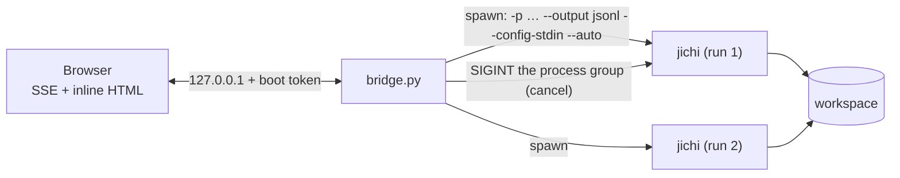

# Web front-end

jichi has three human surfaces (TUI, headless, editors via ACP) and strong
machine surfaces, but no built-in way to *watch several runs from a browser*.
By design there never will be one **inside** jichi: a web front-end is a
**sidecar supervisor** — a separate process that owns jichi instances as children
and drives them over jichi's stable machine contracts. No HTTP server, no
dependency, and no new C ever enters jichi (the full rationale — including why an
HTTP parser in a C89 process that already holds shell access is the wrong place
for it — is in [`proposals/2026-07-web-frontend.md`](proposals/2026-07-web-frontend.md)).

There are two tracks:

- **The minimal bridge** (shipped) — `examples/web-bridge/bridge.py`, ~1 file of
  Python stdlib. Watch an autonomous run, see its cost, cancel it. This page is
  its operator manual.
- **The Phoenix sidecar** (design) — an Elixir/Phoenix service for interactive
  approvals, session resume, multi-instance governance, dashboards, and auth.
  It stays a documented design (a separate codebase, out of this repo's CI); the
  proposal is its build spec.

> **The rule this design keeps returning to:** a web front-end for jichi is
> justified by **fan-out and observation, never by chat**. For one local
> session the TUI is strictly richer with zero added attack surface.

## The shipped bridge



The bridge spawns each run as `jichi -p <prompt> --output jsonl --auto
--no-session --config-stdin` (plus the envelope flags), pumps each jsonl line
out to the browser as a Server-Sent Event, and cancels by sending `SIGINT` to
the child's process group.

### Run it

```sh
cd examples/web-bridge
cp config.example.json config.json     # edit apiBase/model; key stays an env name
export LLM_API_KEY=sk-...   # whatever env var your config's apiKeyEnv names
JICHI_BIN=../../jichi python3 bridge.py --config config.json --root "$PWD"
#   -> BRIDGE READY http://127.0.0.1:8765/?token=XXXXXXXX
```

Open the printed URL. `--root` (repeatable) lists the workspace directories a
run may target; a `POST /run` whose `workspace` is outside every root is
refused (`403`).

### HTTP surface

| Method | Path | Purpose |
|---|---|---|
| `GET`  | `/?token=…` | inline single-page UI |
| `POST` | `/run` | `{prompt, workspace?, budget_tokens?, deadline?, max_tool_calls?, heartbeat?}` → `{id, workspace}` |
| `GET`  | `/runs` | in-memory list of runs |
| `GET`  | `/runs/<id>/events` | SSE stream of jsonl events |
| `POST` | `/runs/<id>/cancel` | SIGINT the run's process group (graceful; exit 130) |

The SSE `data:` payloads are jichi's own `--output jsonl` events — `message_start`,
`text`, `tool_call`, `tool_result`, `usage`, `heartbeat` (when requested), and a
terminal `done` carrying `stop_reason`/`cost`/`work_kept`. The authoritative
schema is `jichi describe --output json` (the `jsonl` block) and
[`SCRIPTING.md`](SCRIPTING.md); the message-contract appendix in the proposal
tabulates every field.

### Liveness: `--heartbeat`

Pass `heartbeat` (seconds) in the `POST /run` body and jichi is launched with
`--heartbeat <secs>`: while a model call is in flight it emits a throttled
`{"v":1,"type":"heartbeat","elapsed":N,"rss_kb":N}` event (the resident-set
field added at M180), so the UI can distinguish a long
model call from a wedged process without reading telemetry. Off by default;
jsonl-only; a new event type, so existing consumers are unaffected. `--heartbeat`
is a first-class jichi flag — usable by any supervisor, not just this bridge.

## Security

This service is **remote code execution by design**: a browser click drives an
agent that runs shell commands as the bridge's Unix user. The bridge enforces:

- **`127.0.0.1` bind.** A non-local bind is refused unless you pass
  `--allow-remote` *and* `--token`. The sanctioned remote path is an SSH tunnel
  (`ssh -L 8765:127.0.0.1:8765 host`) or a mesh VPN — never a public listener.
- **A boot token** printed once and required on every request (`403` otherwise).
  Treat the token URL like a password.
- **Secrets off argv.** The config is fed to each child on stdin
  (`--config-stdin`, the M129 transport); keep API keys as `apiKeyEnv` *names* so
  they live only in the bridge's environment, never in `/proc/*/cmdline`.
- **Envelope-bounded runs** (`--auto` with `--budget-tokens`/`--deadline`/
  `--max-tool-calls`).
- **One mutex per workspace** — the entire governance model for this track.
- **Least privilege** — run the bridge as a dedicated low-privilege user; jichi's
  path fence and edit scope bound the agent, but an approved run still executes
  shell, so the Unix user is the real boundary.

## When to graduate to Phoenix

| Capability | Bridge | Phoenix |
|---|---|---|
| Watch autonomous runs, cancel, see cost | ✅ | ✅ |
| Interactive chat with tool approvals | ❌ (autonomous runs only) | ✅ (ACP `session/request_permission`) |
| Session resume / attach | ❌ | ✅ |
| Multi-instance governance (leases, queues) | one mutex | ✅ |
| Auth beyond localhost | ❌ | ✅ |
| Telemetry dashboards | ❌ | ✅ |

The moment you want approvals in the browser you are re-implementing the ACP
SessionServer state machine in Python — that is the sign to graduate. See the
[proposal](proposals/2026-07-web-frontend.md) for the full Phoenix architecture,
the multi-instance governance invariants, and the security model.

## See also

- [`SCRIPTING.md`](SCRIPTING.md) — the headless `--output jsonl` contract
- [`ACP.md`](ACP.md) — the interactive surface the Phoenix track uses
- [`DAEMON.md`](DAEMON.md) — the warm-process socket (and why the daemon is
  skipped for web v1)
- [`SUPERVISOR_OF_MANY.md`](SUPERVISOR_OF_MANY.md) — the fan-out pattern a web UI
  gives eyes
