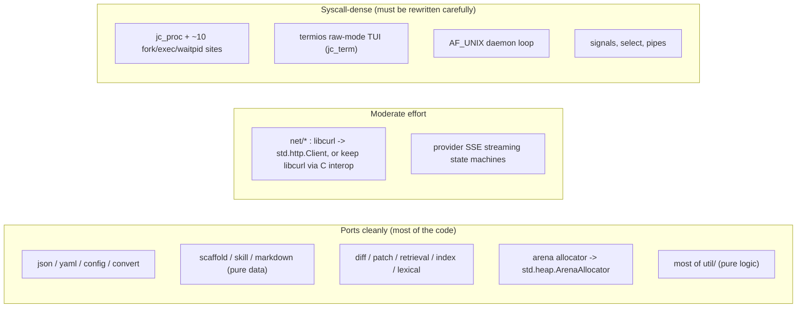

# Would rewriting jichi in Zig pay off?

A decision memo (analysis only — no code change). **Short answer: no, not a full
rewrite.** The payoff (memory safety, potential native Windows) does not beat the
cost and risk of re-deriving a working, hardened ~50k-line C89 codebase. If a
specific goal like native Windows becomes a priority, a *targeted* platform-layer
extraction in C is far cheaper. This document lays out the facts and trade-offs so
the call can be revisited.

## What jichi was when this memo was written (2026-07-09)

> **These figures are the memo's INPUTS, deliberately left as they were** — the
> reasoning below was done against them, and rewriting them silently would make a
> two-week-old decision look like a fresh one. For a revisit, the same measures
> today (M259, 2026-08-02) are **~80.0k lines** of C/H and **9,659 unit checks**:
> the codebase has grown ~60% and its test wall has more than doubled, so every
> "cost and risk of re-deriving it" term below has gone **up**. The conclusion
> (no full rewrite) therefore strengthens rather than weakening — which is the
> useful thing to know before reopening the question.

- **~49.8k lines** of C/H under `src/` (largest: `tools/` ~6.4k, `util/` ~6.1k,
  `chat/` ~5.7k, `tui/` ~2.7k, `index/` ~2.7k, `convert/` ~2.6k, plus
  `scaffold/jc_scaffold.c` ~2.3k that is mostly compiled-in string data).
- **Dependencies:** libcurl (optional, `JC_HAVE_CURL`) + a vendored
  cJSON-compatible library (single file) + libm. Nothing else.
- **Portability model:** strict C89 with POSIX localized to ~15 translation
  units; one platform TU (`jc_platform_posix.c`) and one process chokepoint
  (`jc_proc.c`) concentrate most syscalls.
- **Quality gate:** `make ci` = gcc + clang, `-Werror`, ASan/UBSan, valgrind, and
  an e2e/PTY suite; ~4400 unit checks. Years of hardening (the M-series
  milestones, the ANECDOTES war stories) are encoded in that behavior + tests.

## Portability of the code to Zig

The bulk (JSON, config, convert, scaffold, retrieval, diff/patch, most utilities)
is pure logic that maps almost 1:1 to Zig idioms — the arena becomes
`std.heap.ArenaAllocator`, cJSON becomes `std.json`, and the hand-rolled
`jc_snprintf` C89 fallback disappears. The syscall-dense areas
(process spawning duplicated across ~10 TUs, the termios TUI, the AF_UNIX daemon)
are where a port must be done with care and re-verified.

## Advantages of a Zig rewrite

- **Memory safety by default:** bounds/overflow/use-after-free caught (in debug/
  safe builds) — a class of bug the C code guards against manually and via
  ASan/valgrind in CI.
- **Batteries in `std`:** `std.json`, `ArenaAllocator`, `std.process`,
  `std.http` replace hand-rolled or C89-workaround code (no `jc_snprintf`
  fallback, no vendored cJSON, cleaner error unions vs `jc_status` out-params).
- **`comptime`** for the compiled-in tables (scaffold packs, tool registries)
  that are currently NUL-terminated string arrays under the C89 509-char limit.
- **Cross-compilation** is a first-class Zig feature (`-target`), simpler than the
  current musl/cross recipes.
- **A path to native Windows:** Zig's `std.os`/`std.process`/`std.fs` abstract the
  platform, so the process/fs layers could target Windows — something C89+POSIX
  structurally blocks today (see [`BUILD.md`](BUILD.md)).

## Disadvantages / costs

- **~50k lines to rewrite and re-verify.** The value isn't the line count — it's
  the behavior: every M-series feature, the `make ci` matrix, the e2e/PTY tests,
  and the debugging lessons in `docs/ANECDOTES.md` would have to be re-earned. A
  rewrite trades a *hardened* system for a *new* one.
- **Loss of the "C89 anywhere, tiny deps" story.** The current build runs on
  ancient toolchains, musl, embedded targets, with two dependencies. That
  portability is a feature (see `LOW_MEMORY.md`, `DEPLOYMENT.md`).
- **Zig is pre-1.0.** Its `std` and build system still shift between releases —
  this project has already absorbed 0.16 API churn while *driving* a Zig codebase
  (zigodot). Betting the agent's own implementation on that churn adds ongoing
  maintenance.
- **Dogfooding disruption.** jichi is used to build software (including a Zig
  project); rewriting the tool mid-stream stalls that loop for a long time.
- **libcurl decision.** Either take a dependency on `std.http` (younger, fewer
  TLS/proxy corner cases than libcurl) or keep libcurl via C interop (which keeps
  a C dependency and FFI surface).

## Recommendation

**Do not rewrite.** The C89 base is working, hardened, tiny-dependency, and
broadly portable; the rewrite's headline wins (safety, Windows) are real but do
not justify re-deriving ~50k lines and the accumulated test/behavior corpus,
especially against a pre-1.0 language while the tool is in active use.

**If a concrete driver appears**, prefer the cheaper, targeted move:

- **Native Windows wanted →** extract a `jc_platform` vtable and add a
  `jc_platform_win32.c` (+ a `CreateProcess`-based `jc_proc` and a Console-API
  terminal) **in C**. This is bounded to the ~2 chokepoint TUs + the spawners,
  reuses all the pure logic, and keeps the existing tests.
- **Memory-safety wanted →** the existing ASan/UBSan/valgrind CI already catches
  most of this; tighten it (fuzz the parsers, expand the sanitizer matrix) rather
  than switching languages.
- **A greenfield component (not a rewrite) →** a genuinely new, isolated
  subsystem could be prototyped in Zig and linked via C ABI, gaining Zig's
  ergonomics without touching the core.

Revisit this memo if the portability priorities change; the facts above are the
inputs to that decision.
