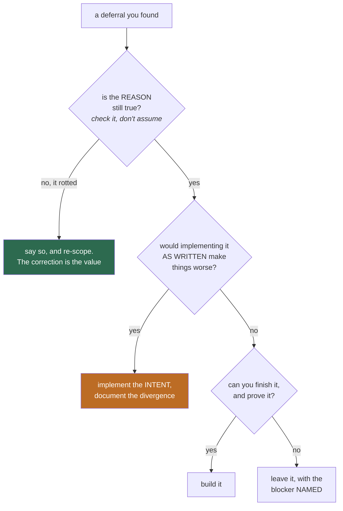
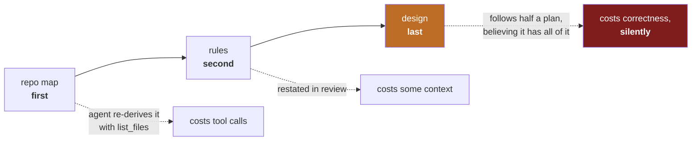

# How to read a deferral — and when to disobey one

*2026-08-17. Written for someone learning to work on an existing codebase.
Every claim here was measured on this bench today; the numbers are real and the
mistakes are mine.*

## The situation

A mature project accumulates sentences like *"not yet: a config key and a
repeatable flag"*. Somebody wrote them while shipping v1 of something, and they
are the closest thing you get to a to-do list written by someone who understood
the problem.

They are also **eighteen months of stale**, and the single most useful skill
this note tries to teach is telling the difference between a deferral that is
still right, one that has quietly rotted, and one that was **never right and
should not be implemented as written**.

Today's batch produced one of each.



## Case 1 — the deferral that was right: multiple design documents

`--design <file>` injects a design doc into the system prompt as the
authoritative plan for a task. v1 accepted **one** document from **one** place.
The deferral asked for a config key and a repeatable flag.

That reason had not rotted. A project genuinely has two kinds of design text —
a standing architecture document and a spec for the task in hand — and v1 made
you choose. Built as asked.

The only interesting decision was precedence, and the conventional answer is
wrong here:

| | If the CLI *replaces* config | If the CLI *adds to* config |
|---|---|---|
| You pass a task spec | the pinned architecture doc **vanishes** | both are present |
| How you find out | you don't | — |
| What the prompt says meanwhile | *"authoritative for this task"* | the same, and true |

The failure mode of replacement is not that it is wrong — it is that it is
**silent**, and it is silent while a section of the prompt is still claiming
completeness. Additive precedence cannot fail that way.

**A test-writing lesson hides here.** The obvious check —
*"is the CLI document in the prompt?"* — **passes under both designs**. It
proves nothing. `tests/smoke/design_multi.sh` check 5 requires *both* markers,
because only a check that can tell the two designs apart is a check at all. If
you cannot describe the wrong behaviour your test would catch, you have not
written a test yet.

## Case 2 — the deferral that would have been a regression

> *Dynamic M73 fitting — v1 uses the static `JC_DESIGN_MAX` cap rather than
> competing in the three-way `jc_sysmsg_fit_caps` budget.*

Read literally: *replace the static cap with a dynamic one*. Implemented
literally, it makes things **worse**, and the reason is one line of the existing
function:

```c
if (limit_tokens <= 0) {
    return;                 /* unknown budget: never shrink */
}
```

A model with no declared `contextLength` and no `--context-limit` has an
unknown budget, so the dynamic path declines to cap anything. Swap the static
ceiling for the dynamic share and a 500 KB design document flows into **every
request of the run** — on exactly the configuration least able to afford it,
and with no diagnostic.

So the intent was implemented and the letter was not:

```
design_cap = min(JC_DESIGN_MAX, dynamic_share)
```

The fit can only ever **tighten**. That asymmetry is the whole safety argument,
and it is why this shipped rather than being parked again.

The sacrifice order is a separate decision, and it is an argument about what
the model can recover unaided:



Rank by **how loudly the truncation fails**, and sacrifice the loud ones first.

## Case 3 — the deferral whose reason had rotted

`ACCESSIBILITY.md` carried:

> *Run the manual protocol above with fenrir and Orca; record the note.*

read for months as *we have no screen reader*. One command:

```sh
for c in orca fenrir speech-dispatcher spd-say brltty; do command -v $c; done
```

**`orca`, `speech-dispatcher`, `spd-say` and `brltty` are all installed here.**
Only `fenrir` is missing. The blocker was never tooling — it is that the
protocol needs a human to *listen* for twenty minutes. "We lack a screen
reader" and "we need someone's attention for twenty minutes" are completely
different states, and only one of them is anybody's to fix today.

This is the project's own **M326b rule** — *check the checkable part of a reason
before parking the item* — catching a reason that had gone stale in the
register. Assume every parked reason has rotted until you have re-run it.

### And the fix that fell out of it

The same section deferred *a spoken form of the Ctrl-G ghost suggestion*. Ghost
text is **dim grey overlay text** — the single rendering a screen reader is
least likely to convey. So for precisely the users voice mode exists for, Ctrl-G
produced **no observable output at all**.

The general lesson is bigger than the four-line fix: *shipping a voice mode does
not make the visual-only surfaces accessible.* Each one has to be found and
closed on purpose, and nothing in a test suite fails while they are open.

## Verification: four compilers, three languages

The tree stays C89. Compiling it with front-ends that disagree is free static
analysis, and today it was run deliberately:

| Toolchain | Mode | Result |
|---|---|---|
| gcc 13.3 | `-std=c89 -pedantic -Wall -Wextra -Werror` | clean, **0 warnings** |
| clang 18.1 | same | clean, **0 warnings** |
| `zig cc` (clang 21.1) | same | clean, **0 warnings** |
| g++ 13.3 | `-std=c++17 -fsyntax-only` | whole tree parses |
| clang++ 18.1 | `-std=c++17 -fsyntax-only` | whole tree parses |

`make cpp-check` grew a `CXX` variable so a second C++ front-end costs one word
(`make cpp-check CXX=clang++`).

It also had `2>/dev/null` on the compile, **discarding the diagnostics of the
very failure it exists to report** — the same defect this codebase has now hit
in a QEMU invocation, a `pkg install`, and a grep. The fix is not simply to
delete the redirect (that makes a *passing* run noisy): capture to a file, print
it only on failure.

Proven two-sided, because a failure path nobody has watched fail is a failure
path nobody knows works — a deliberate error was added, the diagnostic appeared
in full, and the file was restored.

## What this note does not claim

- That the sacrifice order is optimal. It is *reasoned*, and it is the first
  ordering anyone has written down. A workload that contradicts it should
  change it.
- That multiple design docs are wise in general. Two is an architecture plus a
  spec. Five is a smell; the byte cap bounds the *cost*, not the judgement.
- That the accessibility work is done. One visual-only surface was closed. The
  ACP/editor audit and the listening protocol are still open, now with an
  accurate reason attached.
