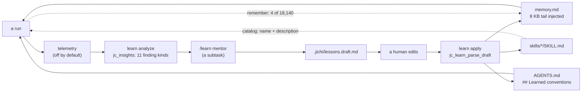

# The language of lessons: the seams in jichi's long-running, pair-programming, review and learning work — and the one that needs mending

*2026-08-27. Written for the operator's question and for a learner who was not there.
No milestone number: this page changes no code. It reads the record, measures the
tree as it stands at `b74756d`, reproduces one defect with the project's own mock
server, and proposes a design with the alternatives it rejected. Every number names
the command that produced it; every claim about code names the function, never a
line number; every claim about behaviour either names the driver that pins it or
says that nothing does.*

---

## 0. Read this first: how this page was made, and how far to trust it

**The question, as asked.** *Find the seams in the project that support long-running
autonomous agentic work, with agentic pair-programming, code review, and
documentation review — and maybe the seam that needs mending to guide the
self-learner to self-mastery. It may be about language.*

**A bias, declared.** The last sentence was in the question before I read a line.
Anchoring on a hint is exactly the failure this repository's record describes most
often ("attributing an anomaly to the most interesting available cause",
`analysis/2026-08-24-twenty-milestones-by-ear.md` §6). So the language finding in §6
is argued from things that were **measured or observed**, not from the hint, and the
seams that have nothing to do with language (§2–§4) are given first and at full size.
Where I could not measure, I say so.

**A second bias, structural.** I am a language model reading a corpus written almost
entirely by language models, about a tool whose learner is a language model. The
record shows what that author does: fluent, confident, false prose — seven instances
in one session (`ANECDOTES.md` #73), caught by lints and measurements and a user,
never by re-reading. This page is the same kind of prose by the same kind of author.
Read the citations, run the commands, and trust the sentences exactly as far as those
carry them.

**What was done.**

| Step | What | How to check it |
|---|---|---|
| Read | `PHILOSOPHY.md`, `APPROACH.md`, `JOURNEY.md`, `CURRICULUM.md`, `LEARNING.md`, `LANGUAGE.md`, `SELF_IMPROVEMENT.md`, `AGENT_COLLABORATION.md`, `DOC_REVIEW.md`, `AUTONOMY.md`, `AUTONOMOUS_LOOPS.md`, `SUPERVISOR_OF_MANY.md`, `reading/KIROKU.md`, both dialogues, 12 analysis notes, `DECISIONS.md`/`DEFERRED.md` structure, the last 16 ROADMAP entries, `ANECDOTES.md` #37 #63 #66 #70 #73 #75 | the files are in the tree |
| Surveyed | `src/chat`, `src/tools`, `src/util`, `src/scaffold`, `src/session`, `src/command`, `tests/smoke/*lint*.sh` — by three read-only sweeps whose claims I then re-verified where this page relies on them | §2–§5 name the functions |
| Measured | the assembled system prompt, the context budget, the run journals, the telemetry, the sibling projects' `.jichi/` state, the operator's config keys — all offline, no model call | each figure carries its command |
| Observed | one reproduction against the smoke tier's mock model server (§5.3) | the driver is quoted in full |
| **Not done at the time of writing** | **no model-driven run** — a review or a `--auto` run against a free `jlu/*` model was permitted and would have cost only wall-clock; I chose not to because one run is an anecdote (`analysis/2026-08-21-self-hosting-first-review.md` §2 says so of its own result) and because a measurement run needs the caps-off discipline in `CLAUDE.md`. **Done later the same day**, after the wave the page argued for: eight mentor runs, two pairs per project, blinded for the operator — §13, harness `tests/bench/mentor_ab/`. | §13 |

**Vocabulary this page uses** (the project's own; fuller in `VOCABULARY.md`):

- **seam** — a deliberate place to observe or substitute behaviour. This page also
  uses it in its plainer sense: the joint between two parts, where they either hold
  or leak.
- **envelope / fence / verifier / green / hollow green / journal** — the bounded-run
  words, defined in `VOCABULARY.md` §"Unattended runs".
- **lesson** — anything the learning loop writes down for a later run: a memory
  bullet, a skill, a project rule, a correction.
- **the self-learner** — two people in this repository. The *human* alone with a
  laptop (the curriculum's design case). And the *agent*, which "is a student here"
  (`PHILOSOPHY.md` §改善 and 守破離). §5–§6 are about the second; §7 about both.
- **the four tiers** — the project's own ranking of what prevents a mistake from
  recurring (`analysis/2026-08-22-learning-from-errors.md` §3): 1 a lint or gate that
  fires whether anyone remembers; 2 a ritual with a mechanical output; 3 a rule in a
  file delivered every turn; 4 a narrative record; 5 an intention.

---

## 1. What the record already knows, compressed for a learner

Nothing below is new; it is the frame the rest of the page stands in.

1. **No feature carries a person to mastery.** The one indispensable companion is an
   honest record of one's own mistakes (`dialogues/2026-07-14-the-one-feature.md`).
   `JOURNEY.md` sequences the road as 守破離 — keep the form, break it, leave it.
2. **The agent is asked to work the way the humans do.** The `craft` section of the
   system prompt — seven bullets, each "phrased as behaviour an observer could check"
   — is on by default (`APPROACH.md`; source `src/chat/jc_sysmsg.c:jc_sysmsg_build_parts`).
   Measured for this checkout: `./jichi context` reports it at ~385 tokens.
3. **Measured, the craft prose moved nothing a grader could see.** M318: 18 graded
   runs, identical pass rate with the section on and off, and zero unprompted design
   notes in either condition on an under-specified probe. The honest conclusion
   recorded was *the instrument cannot see it*, and the frontier arm is still unrun.
4. **A rule you can quote and still break is not a control; it is a description.**
   Four violations of *"audit the universe, not the result"* in one session, by an
   author who had the rule delivered every turn (`analysis/2026-08-22-learning-from-errors.md` §2).
   The mechanisms that held were tier 1: `make ci`, `posix_utils_lint`, `teeth.sh`.
5. **Capability is not licence; a default is not a policy** (`ANECDOTES.md` #63, #68).
6. **A version number is not actionable knowledge** — "0.16" in the rules did not
   stop a model writing 0.13; a six-row *old form → new form* table did
   (`ANECDOTES.md` #37, `MODEL_TOOLCHAIN_DIALECT.md`). A label is not a mapping.
7. **The documentation is spell-checked, not fact-checked.** Nine planted false
   claims, four caught — all mechanical, none of the five about behaviour
   (`analysis/2026-08-24-trusting-generated-documentation.md`). The mitigation that
   shipped is a *convention*: a documented claim about behaviour names the driver and
   check that pins it, and `tests/smoke/doc_claims_lint.sh` makes the citation itself
   mechanical.
8. **Prose is the failure mode, not the safeguard**, and the author is the
   worst-placed reader of their own prose (`ANECDOTES.md` #73).

Hold on to 4, 6, 7 and 8. §6 is those four sentences pointed at the learning loop.

---

## 2. Long-running autonomous work: the seams that exist, and where they leak

### 2.1 What is built

The autonomy envelope is the one boundary around an unattended run. Its pure core is
`src/chat/jc_envelope.c` (unit-tested in `tests/test_envelope.c`); the effectful loop is
`src/chat/jc_agent.c:run_agent_loop`; arming and exit codes live in `src/main.c`.

| Seam | Where | What it lets you observe or substitute |
|---|---|---|
| Budgets (tokens, deadline, tool calls, reads) | `src/chat/jc_envelope.c:jc_env_over_budget`, `jc_env_budget_notice_due` | one notice to the model at 80%; the `budget` journal event names which cap fired (`jc_env_budget_name`) |
| Edit-scope fence | `src/chat/jc_agent.c:env_scope_fence`, `src/chat/jc_envelope.c:jc_env_path_in_scope` | refuses a file-tool write outside the globs, before it runs |
| Verifier + rollback | `src/chat/jc_envelope.c:jc_env_run_verify`, `src/chat/jc_agent.c:env_rollback_and_finish` | success is a command's exit status; red rolls back to the last *observed* green (`green_verified`) |
| Gate integrity | `jc_env_verify_sanity` (hollow green), `jc_env_verify_consistency` (hollow red), `jc_env_test_assertion_edit` (moved goalpost), `jc_env_baseline_check` (a goal gate that forces nothing) | detects — and, for goalposts, tells the model at the moment of the act (M435) |
| Journal | `jc_env_journal_begin` / `_end` → `~/.jichi.d/runs/<run>.jsonl`; reader `src/util/jc_runsview.c` | 27 event names; `jichi runs` renders one triage row per run |
| Control socket | `src/chat/jc_control.c:jc_control_boundary`, `jc_control_poll` | inject / pause / resume / abort / *narrow* the mode mid-run; nothing on it can widen |
| Lease | `src/util/jc_lease.c:jc_lease_acquire` | one live run per workspace |
| Delegate report | `src/util/jc_delegreport.c:jc_delegreport_render` | a subagent returns prose **plus** `[delegate] stop=… · N tool calls · X tokens` and its last failing call |
| Driving contract | `src/util/jc_agentjson.c:jc_agentjson_result` | the terminal `done` object: `stop_reason`, `budget_kind`, `starved`, cache and tool mix — written *so that a driving agent can decide* |
| Warm process | `src/main.c:run_daemon` (fork-per-request, COW copy of the warm app) | amortised startup for worker fleets |
| The loop itself | **not in the binary** — `examples/autonomous-loop/loop.sh`, `jichi-supervisor.c`, `scripts/fleet-run.sh` | `AUTONOMOUS_LOOPS.md` §1 decides this: looping is `cron`/`tmux`/`systemd`'s job |

### 2.2 What a run leaves for the next run

Precisely three channels carry anything from one run into the next without a human,
and I verified each by reading the writer and the reader:

1. `.jichi/memory.md` — written by the `remember` tool
   (`src/tools/jc_tool_remember.c` → `src/chat/jc_memory.c:jc_memory_add`), injected
   under `# Remembered notes` at the next start. **Model-elected**: the harness never
   writes it.
2. `.jichi/board.json` — the kanban, written by the `board` tool, injected as the
   active phase. Also model-elected.
3. `~/.jichi.d/calibration.json` — the measured token-per-byte ratio
   (`src/util/jc_calib.c`), fed back into the context fit. Fully automatic, and purely
   about accounting.

Everything else a run produces — its journal, its `done` object, its telemetry, its
lessons draft, its dream — is read by a human, or by nothing. `jc_runsview_parse` has
two callers: its unit test and the `runs` subcommand. No `src/` path reads a prior
journal, a prior outcome or a prior `done` object at run start. The reference loop
re-queues the **byte-identical** task file on retry and runs with `--no-session`, so
not even the conversation carries over.

### 2.3 What this machine's runs actually did

Measured from the operator's journals, read-only:

```sh
# in the jichi checkout
ls ~/.jichi.d/runs | wc -l                                   # 76 journal files
for f in ~/.jichi.d/runs/*.jsonl; do grep -c '"event":"end"' "$f"; done | grep -c '^1$'
                                                              # 42 hold exactly one run
```

Of the 42 single-run journals: **25 ended `ok`, 3 `budget_exhausted`, 14 with an `end`
event whose outcome still reads `running` and whose `tokens_used` and `tool_calls` are
both 0** — runs that stopped before doing anything. I did not diagnose those 14; the
record's rule is to name an open question rather than fill it with a guess. Nine more
files have no `end` event at all (the process died or was killed). The remaining
journals hold 38–75 runs each — shared journals from fleets and benches, which
`jichi runs` shows as one row per file.

Across all journals: 68 `out_of_scope` events, 370 `verify` events, and the budget
events split 2 `tokens` / 1 `tool_calls` — consistent with M595's finding that which
cap binds is arithmetic (`B / t < C`), and that `t` belongs to the backend.

### 2.4 The leaks, as seams that need mending

Each is verified in the code named; none is a matter of taste.

- **L1 — outcome never becomes input.** No adaptive retry exists: nothing rewrites a
  brief from a `stop_reason`, narrows a scope after `out_of_scope`, or raises a call
  cap after `budget_kind: tool_calls`. The `done` object was designed for an external
  driver to do this; the driver is not shipped. Three runs on 2026-08-20 all ended on
  the tool-call cap while the token and deadline caps sat idle
  (`analysis/2026-08-20-three-runs-two-projects.md` §2) — information the next run
  never received.
- **L2 — the detectors are advisory and their teeth are off by default.**
  `jc_env_verify_sanity`, `jc_env_verify_consistency`, `jc_env_out_of_scope_paths`,
  `jc_env_analysis_starved` and `jc_env_test_assertion_edit` all detect, warn and
  journal; none fails a run. Only `--strict-green` converts a detection into a
  verdict, and it, `--revert-out-of-scope`, `--preserve-discarded` and
  `--budget-panel` all default off. The default unattended posture therefore accepts
  a scope-tainted green, leaves shell-made out-of-scope changes in place, discards a
  rolled-back tree, and shows the model no gauge. Each default has a recorded reason
  (`AUTONOMY.md`); together they are a posture nobody chose.
- **L3 — spending after the verdict is counted, not stopped.** `post_outcome` is
  journaled once (M330), because a mentor turn once spent 625k tokens past a 1m
  budget; the envelope still does not block a call after the outcome is decided.
- **L4 — long-term stores are tail-kept silent truncations.** Rules cap at 32 KB
  (`src/chat/jc_rules.c:add_file`), memory injects the last 8 KB
  (`src/chat/jc_memory.c:jc_memory_load`). The rules cap is now linted
  (`tests/smoke/rules_budget_lint.sh`, after M516 measured 77% of `CLAUDE.md`
  unreachable). The memory cap is warned about and never linted; §5 measures a
  project sitting 100 bytes under it, and one already over.
- **L5 — the delegate hears, the supervisor does not.** A subagent's report reaches
  its parent (M437); a fan-out child's tool calls are charged to the run but its
  journal stays depth-0 (`DEFERRED.md` §"what the model asked for"). A supervisor
  joining journals on `run` will undercount.

---

## 3. Pair-programming: where a human and the agent meet mid-run

### 3.1 What is built

The consent surface is the approval prompt, `src/tui/jc_tui.c:cb_confirm`: `y/1`
once, `a/8` always this session, `v/5` view, `e/3` edit the arguments, `n/0` deny;
a stray key re-asks up to three times then denies (`tests/smoke/approval_keys.sh`).
The digits are the accessibility arc's gift — "digits have no language", and the
German prompt came out shorter than the English one
(`analysis/2026-08-24-twenty-milestones-by-ear.md` §4). Three rules around it are
load-bearing:

- **A preview must read every argument exactly as the executor will** (M530): the
  diff preview and `edit_file` share `jc_json_get_bool_lenient` so the user cannot
  approve a narrower change than the one that runs.
- **A human's denial reaches the loop-breaker** (M570): three consecutive denials of
  the same call end the turn (`tests/smoke/deny_stops.sh` check 3).
- **Privilege and physical actuation are asked fresh every time** — no `a` on
  `cb_confirm_privileged` / `cb_confirm_kinetic`.

Around it: `ask_user` (`src/tools/jc_tool_ask.c`, which in AUTO also offers a
slash-prefixed *narrowing* of the posture), `/plan` `/chat` `/auto`, `/undo` with the
`[undo]` note that tells the model its earlier reads are stale (M349), `/rewind`, the
board, type-ahead applied only at tool boundaries and never to a prompt (M254), the
`[operator]` inject over the control socket, the hint ladder and the tutor stance,
`brief-check` (a no-model pre-flight of what a brief would make jichi infer), and ACP
for editors.

### 3.2 What the record shows, and what the telemetry shows

Twelve of the twenty accessibility milestones were found by **a person using the
software**, none by the 12,888-check suite (`twenty-milestones-by-ear.md` §1–§2).
That is pair-programming's real contribution here: the human is the instrument no
test replaces.

But the *agent's* side of the pair barely uses its channels. Over every telemetry log
on this machine:

```sh
# in the jichi checkout
cat ~/.jichi.d/telemetry/*.jsonl | grep -c '"event":"tool_call"'                       # 18140
for t in ask_user remember hint ask_for_help load_skill spawn_subagent; do
  printf '%-14s %s\n' "$t" "$(cat ~/.jichi.d/telemetry/*.jsonl | grep '"event":"tool_call"' | grep -c "\"name\":\"$t\"")"
done
```

| tool | calls | of 18,140 |
|---|---|---|
| `ask_user` | **3** | 0.02% |
| `remember` | **4** | 0.02% |
| `hint` | 0 | — |
| `ask_for_help` | 0 | — |
| `load_skill` | 0 | — |
| `spawn_subagent` | 29 | 0.16% |

(The telemetry covers two sibling projects driven headless, mostly `--auto`, where
`ask_user` has no one to ask and returns "proceed on your judgment", and where no
assignment was active — `hint` and `ask_for_help` are only offered while solving one
(`src/tools/jc_tool_hint.c`). So three of the four zeros are expected. The
`remember` and `load_skill` figures are not: both tools work headless and were
advertised on every call — zigodot's `.jichi/skills/` holds 26 skills, each listed in
the catalog — and the models reached for them 4 and 0 times.)

### 3.3 The leaks

- **P1 — the human can consent, narrow and deny, but cannot *teach* mid-run except in
  prose.** An inject is a user message; an inferred constraint is session-scoped by
  design (M169, a guess must not outlive the turn); the only durable channel is the
  same `memory.md` the model almost never writes. What the pair learns together in a
  session evaporates unless someone types it into a file afterwards.
- **P2 — the `e`dit-args path — the one place a human rewrites a tool call before it
  runs — has no test.** No smoke driver or unit test references `cb_confirm`'s edit
  branch or `JC_MSG_ALLOWED_EDITED`. The interactive diff preview is likewise untested
  end to end (`jc_diff_unified` and `jc_patch_apply` are unit-tested; nothing asserts
  the preview is *printed* before the prompt).
- **P3 — an editor user sees less than a terminal user.** `src/acp/jc_acp.c:cb_confirm`
  discards `edited` ("ACP has no inline-edit affordance; allow/deny only") and emits
  no diff content block; `apply_patch` falls through `jc_acp_tool_kind` to `"other"`,
  so an editor cannot even render it as an edit.
- **P4 — no end-to-end driver for the three postures.** `/plan` refusing an edit is
  pinned only by the pure resolver test (`tests/test_perm.c`).

---

## 4. Code review and documentation review

### 4.1 What is built

**Code review is a pack, not a command.** There is no `jichi review` subcommand
(none of the subcommands `./jichi --help` lists is a review), and the TUI's `/review` toggles the
*self-review* pass rather than reviewing anything. The review surface is:

- **The self-hosting pack** (`examples/self-hosting/`): two read-only reviewers
  (`c89-reviewer`, `arena-auditor`), `/review-diff` spawning both over the working
  diff, and `docs/rules/reviewing.md` loaded per-task via `instructions`. Its one
  scored run (M515) found both planted defects with correct `file:line` and reported
  N/A where nothing was wrong — on a 42-line diff, one model, once
  (`analysis/2026-08-21-self-hosting-first-review.md` §2). The pack's own promotion
  criterion asks for *several* diffs; that is still open.
- **Scaffolded reviewers** in 16 language packs plus `ci-reviewer`, `port-auditor`,
  `accessibility-reviewer` (29 of 31 packs) with the only scaffolded review
  *command*, `/a11y-review`.
- **The self-review pass** (`src/chat/jc_agent.c:self_review_on`): in AUTO, the turn's
  own diff is handed back to the model once with "review the changes you just made".
  **No test asserts it fires**; the two drivers that mention `selfReview` set it to
  `false` to get it out of the way.
- **A deterministic pipeline**, `examples/workflow.review.json` (map → synthesize).
  The engine supports a `verify` stage (`src/util/jc_workflow.c`); the shipped review
  workflow does not use it.
- **Gate integrity as the reviewer of last resort** (§2.1): the verifier, the
  goalpost detector, hollow-green and hollow-red, `--strict-green`.

**Documentation review is an instrument, not a command.** `DOC_REVIEW.md` is the
rubric (what / where / when / how / by whom / decision; the audience is one
self-learner with nobody to ask). Two reviewer personas are tracked in this repo's
`.jichi/agents/` — `docs-reviewer-junior` ("you skim") and `docs-reviewer-tutor`
("you will be standing in the room when it goes wrong") — reachable only by naming
them to `spawn_subagent`. The `docs` pack scaffolds a beginner/expert/master
proofreader trio. And 49 lint drivers (`ls tests/smoke/*lint*.sh | wc -l`) hold the
mechanical half; 25 of them compare documentation to source or binary.

### 4.2 The leaks

- **R1 — a review finding has no shape.** `file:line`, MUST-FIX and N/A are prompt
  conventions; grep finds them only inside `src/scaffold/jc_scaffold.c` string
  literals. Nothing parses a review. Compare the two agent outputs that *do* have a
  parsed schema — the lessons draft (`src/util/jc_learn.c:jc_learn_parse_draft`) and
  the assignment spec (`src/util/jc_assign.c:jc_assign_parse`). A finding that cannot
  be parsed cannot be counted, verified, deduplicated or fed to `learn analyze`.
- **R2 — nothing verifies a finding.** `/review-diff` runs two *different* reviewers
  over one diff — redundancy, not adversarial checking. The one verified review in
  the repository was verified by a human planting two known defects. `DOC_REVIEW.md`
  §3 step 5 assigns verification to a person, and records that three of four
  reviewer claims in M392 needed correction.
- **R3 — the reviewer never learns whether it was right.** No outcome flows back:
  not to telemetry, not to `jichi runs`, not to the mentor. A reviewer that invents
  nitpicks and one that finds real defects leave identical traces.
- **R4 — the rubric is not mechanised, and it says why.** "Prose is not lintable"
  (`DOC_REVIEW.md` §4). The measurement agrees (§1 item 7). What shipped instead is
  the citation convention and `doc_claims_lint`; what did not ship is any command
  that runs the two tracked personas over a page.
- **R5 — 1,149,083 words of English, reviewed by one non-native reader and 25
  lints.** (`find docs -name '*.md' -exec cat {} + | wc -w`, 490 files.) The
  Japanese has a written review protocol with native speakers; the English pipeline
  had never been named until #73. This is a review seam and a language seam at once.

---

## 5. The self-learner: the loop as built, and as measured

### 5.1 The loop



Every box exists and is unit- or smoke-tested (`tests/test_insights.c`,
`tests/test_learn.c`, `tests/test_memory.c`, `tests/smoke/learn.sh`,
`tests/smoke/learn_on_stop.sh`). The design is deliberately propose-only, and the
record's reasons for that are good (`LEARNING.md` §"Why propose-only"; M423 for what
a careless writer does to a curated draft). The findings below are not about the
design's intent. They are about how much of the loop is *connected*.

### 5.2 Measured: what the loop has eaten, and what it has produced

All figures from this machine, read-only, 2026-08-27.

| Fact | Measurement | Command |
|---|---|---|
| Telemetry is off by default | `out->log_level = 0; /* event logging off by default */` | `grep -n 'log_level = 0' src/config/jc_config.c` |
| Telemetry logs on this machine | **3**, all from *other* projects (chrtext ×2, zigodot) | `ls ~/.jichi.d/telemetry` |
| Telemetry for jichi itself | **none** — `doctor`: *"tool use: no telemetry for this project"*; `./jichi learn analyze --workspace .` → *"No recurring problems found"* | run both, `< /dev/null` |
| `remember` calls in 18,140 tool calls | **4** | §3.2 |
| `load_skill` calls, with 26 skills in zigodot's catalog and 6 in chrtext's | **0** | §3.2 |
| `hint`, `ask_for_help` calls | 0, 0 — expected: offered only during an assignment, and none was active | §3.2 |
| zigodot's `memory.md` | **8,092 bytes** against an 8,192-byte injection cap — 100 bytes of headroom, one note from silently losing its oldest lesson | `wc -c ../zigodot/.jichi/memory.md` |
| the older chrtext `memory.md` | **10,233 bytes** — already over the cap; its first ~2 KB never reach a prompt, and the file is a phase-status board ("Phase 57 … COMPLETE"), not lessons | `wc -c` |
| zigodot's `lessons.draft.md` | headings `## Tokenizer fix/break/fix loops` and `## Corrections`; **0** lines of the form `- remove:` / `- replace:`; no `## Memory notes` at all — `learn apply` would commit **nothing** from it | `grep -n '^## ' …/lessons.draft.md; grep -c '^- remove:\|^- replace:' …` |
| line-number citations in memory notes | 1 (zigodot: "line 78 … line 95") — the shape `jc_insights_stale_review` flags as most prone to drift | `grep -c 'line [0-9]'` |
| `jichi dream` output on this machine | **one** file, whose source log sits in an assistant's scratch directory — the reflection band has been exercised by the tool's own developer testing it, not by the operator's practice | `ls ~/.jichi.d/dreams` |
| `jichi improve` | **never run** (`~/.jichi.d/improve` does not exist) | `ls ~/.jichi.d` |
| a learner's record (`progress.jsonl`, `hints.jsonl`) | **none, in any project on this machine** — nobody has walked the graded curriculum here | `ls */*/.jichi/progress.jsonl` |
| the operator's config | no `language`, no `logging`, no `learnOnStop`, no `craft` key — every learning default is in force and telemetry is off | `grep -o '"[a-zA-Z_]*"\s*:' ~/.jichi \| sort -u` |

Two things this table says, before any defect:

**The agent does not reach for its own learning tools.** Four `remember` calls and
zero skill loads across ~18k tool calls on real projects, with 26 skills on offer in
one of them. The lessons that do exist in the sibling projects' `memory.md` were
written by `learn apply` from human-edited drafts, or by a person. The channel the design calls "model-elected"
is, measured, almost never elected.

**The loop has never been pointed at jichi.** The project that has the most to teach
its own agent — 595 milestones, 75 anecdotes, 49 lints born from failures — has no
telemetry, no memory file, no draft, no glossary in its `.jichi/`. jichi's own
development is done by a different agent (the operator's assistant), whose lessons
go into `CLAUDE.md`, `ANECDOTES.md` and lints. jichi's learner is fed only by the
dogfooding runs on zigodot and chrtext. That is a choice the record could make
explicit; today it is an accident of where telemetry was switched on.

### 5.3 Observed: the mentor never receives its own instructions

This is the finding I would not publish from reading alone, so it was reproduced.

**The claim.** The scaffolded `/learn` command is `agent: mentor` + `subtask: true`
(`src/scaffold/jc_scaffold.c`, `FILE_CMD_LEARN`). `src/chat/jc_app.c:jc_app_command_agent_apply`
sets `app->persona_override = def->system_prompt` — the mentor's whole prompt,
including its `FORMAT IS STRICT` block naming the five headings the parser needs.
But `src/chat/jc_agent.c:jc_agent_run_command_subtask` builds its system message with
`src/chat/jc_sysmsg.c:jc_sysmsg_build_sub`, and `persona_override` is read by exactly one
function in the tree: `jc_sysmsg_build_parts`, the **top-level** builder.
`jc_sysmsg_build_sub` never looks at it.

```sh
# in the jichi checkout
grep -n 'persona_override' src/chat/jc_sysmsg.c        # one consumer, inside jc_sysmsg_build_parts
grep -n 'jc_sysmsg_build_sub' src/chat/jc_agent.c       # what the command subtask uses
```

**The observation.** The smoke tier's `mockmodel` captures every raw request body.
I ran the exact flow of `tests/smoke/learn_on_stop.sh` from a scratch directory
(symlinks to `_smoke.sh`, `tests/tools/` and the binary), adding one check: does the
mentor's request contain its own instructions?

```sh
# in a scratch mirror of tests/smoke (never the repo): same mock script as
# tests/smoke/learn_on_stop.sh, then read the captured requests
mm_start "$tmp/replies.mm" "$tmp/cap"
write_config "$tmp/config.json" "$MM_PORT" '"learnOnStop":true'
(cd "$ws" && "$BIN" --config "$tmp/config.json" init < /dev/null > /dev/null 2>&1)
(cd "$ws" && "$BIN" --config "$tmp/config.json" -q --no-session --auto -p "do the task" < /dev/null)
mreq=$(grep -l 'lessons.draft.md' "$tmp"/cap/req.* | head -1)     # the mentor's request
grep -c 'FORMAT IS STRICT' "$mreq"                                # 0
grep -c "You are this project.s mentor" "$mreq"                   # 0
grep -o '"role":"system","content":"[^"]\{0,120\}' "$mreq"
# "role":"system","content":"You are a focused sub-agent inside jichi, working on a
#  single task delegated by the main agent. ...
```

Result: 3 requests captured; the mentor's request carries the generic sub-agent
prompt (`PROMPT_SUB`) and **zero** bytes of `mentor.md`. The probe's TAP line:
`not ok 4 - mentor.md's instructions are ABSENT from the mentor's request`.

**Since when.** `git log -S'jc_sysmsg_build_sub(app)' -- src/chat/jc_agent.c` and
`git log -S'persona_override' -- src/chat/jc_sysmsg.c` both date to 2026-06-24 (M28,
the day command `agent:`/`subtask:` frontmatter was honoured); `jc_agent.c` has never
read `persona_override`. The mentor (M70) arrived after. So on every `/learn` and
every `learn-on-stop` since the mentor shipped, the model was asked, in one sentence
of the command body, to "write durable lessons to .jichi/lessons.draft.md" — and was
told nothing about the format, the corrections syntax, or "propose ONLY genuinely
NEW lessons". The same path serves `/onboard` (`agent: project-analyst`,
`subtask: true`); those are the only two scaffolded commands combining the two keys.

**Why every test is green.** `learn_on_stop.sh`'s mock routes on the *user* message
("lessons.draft.md"), so the draft appears whatever the system prompt says.
`tests/smoke/sub_prompt_lint.sh` pins that every gate enforced at depth is *named*
in the sub prompt — and states in its header that it deliberately does not check
context. The persona is neither a gate nor context; nobody drew a line around it.
And `include/jc_agent.h`'s comment on `jc_agent_run_command_subtask` says *"The
active model / persona (from `model:` / `agent:`) apply because the caller sets them
before calling"* — true for the model, false for the persona: a documented claim
about behaviour with no test to cite, the exact species §1 item 7 describes.

**Fixed at M596, the same day.** `jc_sysmsg_build_sub_as(app, persona)` makes the
persona the identity paragraph of a command subtask's prompt and still appends
the enforced sections; the same builder now serves profiled delegates, which had
been receiving the bare profile text. `tests/smoke/subtask_persona.sh` is the
probe below promoted to a driver — red against the unfixed binary, green after.

**What it explains, and what it does not.** It is *consistent with* the zigodot draft
in §5.2 — wrong headings, prose where directives were required, a "Corrections"
section that corrects nothing — and with `LEARNING.md`'s observation that "smaller
local models often write a richer, prose-y analysis under their own headings". It
does not prove the models would have complied if told; that is the run §8 asks for.

### 5.4 The second language defect: the mentor is not told what language to speak

`LANGUAGE.md` says two things eleven lines apart. Bullet one: *"Top-level only.
Subagents keep their focused-task prompt."* Bullet two: *"Learning surfaces inherit
it for free: `/assign`, `/solve`, `/check`, the hint ladder, and the mentor loop."*
The code agrees with the first: `jc_sysmsg_append_language` has one call site, in
`jc_sysmsg_build_parts`. `/assign`, `/solve` and `/check` run top-level and do
inherit it. The mentor is a subtask and does not. Its draft is then `write_file`d
straight to disk — there is no "main agent" downstream to translate, which was the
comment's justification for top-level-only.

**Fixed at M597.** A `subtask: true` command now receives the session's
directive (spawned delegates still do not, for the original reason), and a
command may pin its own with `language:` frontmatter -- the operator chose
lessons in the user's language by default, English-canonical as the option.
`tests/smoke/subtask_language.sh` pins both on the wire.

Downstream of that, the loop is English by construction: `jc_learn_parse_draft`
classifies headings by the English substrings `correction`, `rule`, `suggested`,
`skill`, `memory`; `src/util/jc_learn.c:learn_slug` keeps only `[a-z0-9]`, so a skill whose
name is entirely non-ASCII slugs to the empty string and is **silently skipped**
(`if (slug[0] == '\0') continue;`). A German self-learner with `"language":"Deutsch"`
gets German tutoring and English lessons — and if a model does write
`## Erinnerungsnotizen`, the draft applies nothing and says so only as a count.

### 5.5 The memory's shape

- A note is `- <text>` and nothing else: no date, no evidence, no source run, no
  confidence, no expiry. The mentor may write `[evidence: …]`; the parser **strips
  it** before committing (`jc_learn_parse_draft`, the memory-bullet branch).
- Nothing checks a note is still true. `jc_insights_stale_review` counts bullets and
  flags those containing the substring `line`; it opens no file.
- The 8 KB injection keeps the tail and resyncs on a **UTF-8 boundary, not a line**
  (`jc_memory_load`, `jc_utf8_resync`), so the first injected note can be a headless
  fragment.
- Dedup is an exact byte match (`jc_memory_has_line`); a reworded lesson is a new
  lesson. The mentor prompt begs the model not to restate — the prompt that §5.3
  shows is not delivered.
- `## Project rules` are appended to `AGENTS.md` under `## Learned conventions`
  (`src/util/jc_learn.c:learn_apply_rules`) and **cannot be retracted**: corrections exist for
  memory only. M533 records the day this writer created an `AGENTS.md` in a
  `CLAUDE.md` project and thereby shadowed the entire rules file — the loop's output
  silencing the rules it was meant to supplement.
- Subagents see none of it: `jc_sysmsg_build_sub` carries no memory, no skills, no
  rules (by design, `sub_prompt_lint.sh`). A delegate never benefits from a lesson
  unless the parent restates it in the task.

---

## 6. The seam: lessons are written in the tier that does not hold

Here is the argument, built only from what the record measured and what §5 observed.

**Everything the self-learner can produce is natural language.** A memory bullet, a
skill body, a project rule, a draft — prose, injected into a prompt, read by a model.
In the project's own ranking that is **tier 3**: "necessary, demonstrably
insufficient … it converts *I did not know* into *I knew and did not apply*"
(`learning-from-errors.md` §3). The record proves the tier's weakness on its
strongest author: rules delivered every turn, violated four times in a session. It
proves it on the models jichi drives: a Zig version in the rules, ignored until it
became a mapping (#37); a mentor format "STRICT" in a file, never delivered (§5.3);
a drafted correction that was a paragraph about how the old note "remains valid"
(§5.2). And it proves it on the docs: fluent, false, uncaught (#73).

**Where a lesson did hold, it had stopped being prose.** `priced_model_lint` after the
spending rule was quoted and broken by the line it cited; `rules_budget_lint` after
77% of the rules were unreachable; `posix_utils_lint` catching the same GNU-ism in
four consecutive milestones "because the lint does not depend on my internalising
it"; `group_sep_lint`, `prompt_keys_lint`, `doc_claims_lint`. Every one is a lesson
that was first written as a sentence and only worked once it became a check. The
project's phrase for this is *prefer a lint to an audit*; the project's account of
its own errors says the same in a second voice: **a lesson that cannot fail is not a
lesson** — the mirror of *a test never seen failing has never been seen working*.

**jichi already owns exactly one bridge from language to mechanism, and it is
tiny.** `src/chat/jc_constraint.c:jc_constraint_blocks` turns a phrase — "do not run
the build", "read-only" — into a refusal at the tool gate, re-injected every turn,
compaction-proof. Its vocabulary is six command keys and two kinds. It is the only
place in the tree where a sentence *becomes* a fence. The hooks system
(`src/chat/jc_hooks.c:jc_hooks_fire`, exit 2 blocks) is a second bridge, but nothing
in the loop writes a hook: the mentor's `## Suggested (manual)` — the designated
channel for "config / agent changes" — is parsed as `SEC_OTHER` and dropped.

**So the learning loop can only emit into the tier its own authors distrust, and
has no path into the tier they trust.** Telemetry → insight → *prose* → human →
*prose*. The human is the only converter from lesson to check, and the human is one
person, and the loop tells them nothing about which lessons are load-bearing.

**Language, in three narrower senses, is the same seam seen closer:**

1. *Reach.* The one sentence that would make the mentor obey a format never reaches
   it; the one sentence that would make it write German never reaches it (§5.3,
   §5.4). Prose that is not delivered is worse than no prose, because its author
   believes it applies — `jc_agent.h` says so in writing.
2. *Register.* The project's private vocabulary (envelope, fence, hollow green,
   teeth, born red, floor) is a tax `VOCABULARY.md` was written to pay for humans.
   The mentor pays it blind: the starter glossary of jichi's own terms ships only
   with the assignments pack, and no learn command inlines it.
3. *Retraction.* 守破離 asks the student to break and leave the form; the agent can
   only accumulate it. Corrections exist for memory bullets, not for rules; the
   `Learned conventions` grow monotonically. A teaching that cannot be taken back is
   dogma — the project wrote that sentence about M78, and M78 covers half the store.

**The honest counter-argument, stated rather than buried.** Not every lesson can be
a check. "Name the invariant, not the line" (`three-runs-two-projects.md` §3) is
judgement; so is most of the craft section. Tier 3 is *necessary* — the record says
so and I agree. The mend is therefore not "stop writing prose lessons". It is: make
the checkable half checkable by default, and make the unchecked half **visibly**
unchecked — which is precisely the move `doc_claims_lint` made for documentation
three days ago. A memory note without a pin is a claim with no test to cite, and
today the file hides that.

---

## 7. Design: mending the seam, with the alternatives rejected

Each item names its cost, how it is proven red first, and what it does not fix. None
changes the propose-only invariant; every write to `.jichi/` still passes a human.

### D1 — Deliver a command's `agent:` persona to its subtask (a fix, not a feature)

**Do:** in `jc_agent_run_command_subtask`, build the system message from the
persona when one is set — either by having `jc_sysmsg_build_sub` accept an optional
persona that replaces `PROMPT_SUB` (the enforced sections stay), or by prepending
`app->persona_override` ahead of `PROMPT_SUB`. Then make `jc_agent.h`'s comment true.

**Prove red:** the probe in §5.3, as a smoke driver: capture the mentor's request and
assert `FORMAT IS STRICT` is present. It fails today.

**Rejected — leave it and document "the persona does not apply to subtasks".** It
would make `agent: mentor` a lie in every scaffold pack, and the mentor's format
discipline — the thing `learn apply` depends on — would remain undeliverable.
**Rejected — give subtasks the full top-level prompt.** It defeats the isolation that
is the reason to delegate (`sub_prompt_lint.sh` header) and would put rules, memory
and repo map into a turn that is supposed to be cheap.

**Does not fix:** whether a given model *obeys* the format once told. That is §8's
first run.

### D2 — Pass the answer language to artifact-producing subtasks

**Do:** append `jc_sysmsg_append_language` in the command-subtask path (or in
`jc_sysmsg_build_sub` when `output:` is declared), and reconcile `LANGUAGE.md`'s two
bullets with whichever truth ships. Keep spawned delegates as they are — their prose
is consumed by the parent, which follows the directive.

**Prove red:** a driver with `"language":"Deutsch"` asserting `Respond in Deutsch`
appears in the mentor's captured request.

**Rejected — keep top-level-only and fix only the doc.** Cheaper, but it leaves the
German self-learner with English lessons and no way to change it short of editing
`mentor.md` by hand — and `LEARNING.md` promised otherwise.

**Does not fix:** the English-keyed parser (D3 does).

### D3 — A lesson carries its pin, or says it has none — *shipped as M600 (the mechanical half: trailers kept, pinned share and unresolved paths reported, prose corrections counted; heading-by-position parsing not built — the headings stay English by contract, M597)*

**Do:** keep the mentor's `[evidence: …]` instead of stripping it, and add one more
optional trailer the parser preserves: `[pins: tests/smoke/<driver>.sh]` or
`[pins: constraint]` or `[pins: none]`. `learn analyze` reports the unpinned share
("14 notes, 3 pinned"), resolves every `path` a note names (a mechanical staleness
check — the one `jc_insights_stale_review` cannot do today), and prints the memory
budget as a fraction (`8,092 of 8,192`). `learn apply` refuses a `## Corrections`
section with zero directives *and* prose, naming the syntax — today it counts zero
and moves on. Accept heading keywords in the configured language as well as English,
or — simpler and more robust — have `learn apply` match headings by **position and
shape** (five level-2 headings in order) rather than by English words.

**Prove red:** `tests/test_learn.c`: a note with a pin round-trips; a draft whose
corrections are prose is refused with the directive syntax in the message; a note
naming a path that does not exist is flagged by `analyze`.

**Rejected — have a model judge whether a note is still true.** That is the
author-reviews-author loop #75 measured, and it would report confidence, not truth.
**Rejected — free-form notes as today.** They are what the 8 KB tail is full of.

**Does not fix:** the *content* of a lesson. A pinned falsehood is still false; but it
is now a falsehood with a named test to run.

### D4 — A `## Checks` section: lessons that are refusals — *shipped as M602 for constraints; hooks deferred with the reason*

**Do:** add a sixth section the mentor may write and `learn apply` may commit,
propose-only like the rest: a constraint line (into `.jichi/constraints.md`, the
*authored* store — the existing bridge) or a `PreToolUse` hook script (into
`.jichi/hooks/`, listed in the draft, enabled only by the human turning `hooksEnabled`
on). The mentor is asked: *for each lesson, can it be stated as something jichi would
refuse? If so, write the refusal; if not, say why.* The zigodot memory holds three
notes about hollow gates; the project fixed the same class with `tests/gate_lint.py`.
The mentor should be allowed to propose the second kind.

**Prove red:** a driver in which the draft's `## Checks` names `deny-cmd push`, apply
commits it, and the next run's `git_push`-shaped command is refused
(`tests/smoke/constraints_scan.sh` is the shape to copy).

**Rejected — auto-generate tests from lessons.** There is no oracle; a generated test
that has never been seen failing is the hollow gate in a new costume.
**Rejected — write rules only.** A rule is tier 3. The whole point is a path to
tier 1.

**Does not fix:** lessons that are judgement (most of them). It gives the mentor a
second language to use *where it applies*, and makes the choice visible.

### D5 — Retractable rules — *shipped as M601*

**Do:** let `## Corrections` address `## Learned conventions` in `AGENTS.md` the way
it addresses memory (`remove:` / `replace:` by substring within that heading only).

**Prove red:** `tests/test_learn.c`: a correction retracts a learned convention and
touches nothing above the heading.

**Rejected — leave rules append-only.** It is the one store in the loop that can only
grow, and M533 shows what its writer already did once.

### D6 — Feed the loop on jichi itself — *shipped as M599, wider than proposed: metrics on by default for everyone, per the operator's answer to Q1*

**Do:** set `"logging": {"level": "metrics"}` in the three `examples/self-hosting`
configs and the `learner` preset's generated config, so `learn analyze` has something
to read on the project with the most to teach. Metrics carry no prompt or code
content (`TELEMETRY.md`). Decide, and write down, whether jichi's learner is meant
to learn from jichi's development or only from dogfooding — today the answer is an
accident of a default.

**Rejected — telemetry on by default for everyone.** Privacy posture; the project
chose opt-in deliberately and the reasons stand.

### D7 — Make an unappliable draft visible where the run is reported — *shipped as M598*

**Do:** after `learn_on_stop` writes the draft, run `jc_learn_parse_draft` on it and
put the counts (`memory=N skills=N corrections=N rules=N parsed_nothing=0/1`) into
the `learn_on_stop` journal event and the stderr line. A draft that will apply
nothing is then a red row in `jichi runs`, not a discovery three weeks later.

**Prove red:** `tests/smoke/learn_on_stop.sh` gains a check that a prose-only draft
yields `parsed_nothing=1` in the journal.

### D8 — Give the mentor the project's words, and a shape for each lesson — *the words shipped as M603; the shape tags are not built (a tag is a hint, and KIROKU's nine shapes are one reader's sort)*

**Do:** inline the glossary in `learn.md` (`@.jichi/glossary.md`, the same mechanism
that inlines memory) and ship the starter glossary of jichi's own terms with every
pack that ships the mentor, not only `assignments`. Ask the mentor to tag each lesson
with one of `KIROKU.md`'s nine shapes where one fits (*shape 3: a check's universe is
smaller than its header claims → floor the extraction*), so a lesson names its
mechanical defence, not only its story.

**Rejected — a taxonomy enforced by the parser.** The nine shapes are one reader's
sort of 65 anecdotes (`KIROKU.md` §7 says so); a tag is a hint, not a schema.

---

## 8. Recommendations, cheapest first

| # | Do | Cost | What it settles | How it can mislead |
|---|---|---|---|---|
| 1 | **D1** — deliver the persona; promote the §5.3 probe to a smoke driver | one function, one driver | whether `agent:` means anything on subtasks | a green driver proves delivery, not obedience |
| 2 | **D7** — parse counts in the `learn_on_stop` event | ~30 lines | whether drafts have been unappliable all along | counts, not quality |
| 3 | **D2** — language to artifact subtasks; fix `LANGUAGE.md` | ~10 lines + a doc | the German self-learner's lessons | none, if the doc says what ships |
| 4 | **Run the experiment D1 makes possible**: `/learn` on the zigodot and chrtext logs, before and after D1, same model, `jlu/*` only, caps off, and count parseable items per draft | wall-clock only | whether the format failure was delivery or the model | n is small; report a direction, not a magnitude |
| 5 | **D6** — metrics on for the self-hosting configs | config | a corpus for `learn analyze` on jichi | metrics say what failed, never why |
| 6 | **D3** — pins, path resolution, budget fraction, refuse prose corrections | a parser change + tests | visible unpinned share; mechanical staleness | a pin can rot too — `doc_claims_lint` is the model for holding it |
| 7 | **D5** — retractable rules | small | the append-only store | none obvious |
| 8 | **D4** — `## Checks` into constraints/hooks | a section + apply path + driver | a path from lesson to refusal | over-constraining a run; hence propose-only and human-enabled |
| 9 | **D8** — glossary to the mentor; shape tags | scaffold text | the register the mentor writes in | a tag is not evidence |
| 10 | Turn on `--strict-green` and `--revert-out-of-scope` in the **self-hosting write config** (L2) | config | the default posture of the loop that edits jichi | a stricter gate rejects more true greens; measure the rate |
| 11 | Give a review finding a shape (R1): the `file:line` + claim + MUST-FIX/nice-to-have that every profile already asks for, as a parsed section, so `learn analyze` and `runs` can count it | a parser like `jc_learn_parse_draft` | precision over time, per reviewer | a schema invites padding; N/A must stay a valid row |
| 12 | Ask the second seat to adversarially refute the first (R2) — the `verify` stage the review workflow already supports | a workflow file | invented nitpicks vs real findings | two models sharing a base share blind spots (`japanese-review-protocol.md` §0) |

Items 1–3 are an afternoon and prove themselves red first. Item 4 is the measurement
this page could not make and should be made before anything below it.

---

## 9. What this page does not claim

- **That the models would have complied.** §5.3 shows the instructions were not
  delivered; it does not show what a 9B or 27B model does when they are. Item 4 is
  that run.
- **That prose lessons are useless.** The zigodot memory holds several that a
  maintainer would be glad of; the point is that nothing tells them which.
- **Anything about frontier models.** The craft A/B's frontier arm is unrun and this
  page adds no data to it.
- **That the counts are stable.** Every figure was measured on this machine on
  2026-08-27 and will drift; the commands are beside them.
- **That "language" was the operator's meaning.** It was a hint; §6 is my reading of
  it, argued from the record. Another reader could sort the same evidence under
  *delivery* or *provenance* and be right.
- **Completeness.** Three read-only sweeps and one probe are not an audit of 90k
  lines. Where a sweep's claim carries weight here, I re-read the function; where I
  did not, the claim is attributed to the survey and phrased as such.

---

## 10. Questions for the operator

Asked because each changes what should be built next, not to defer the work above.

1. **Is jichi's learner meant to learn from jichi's own development?** Today
   telemetry is on for zigodot and chrtext and off for this repository; `learn
   analyze --workspace .` has nothing to read. If yes, D6 is the first move and the
   loop's evidence should start accumulating now. If no, that is a decision worth a
   `DECISIONS.md` row, because `AGENT_COLLABORATION.md` implies otherwise.
2. **Which language should lessons be stored in** for a self-learner who set
   `language`? Their own (D2, and a parser that stops keying on English) — or English
   as the project's canonical register, with the tutoring translated at read time?
   Both are defensible; today it is neither by choice.
3. **May the mentor propose refusals** (D4: constraints and hooks, still propose-only
   and human-enabled), or should the loop stay prose-only on principle? The
   propose-only invariant is untouched either way; what changes is the *kind* of
   thing a human is asked to approve.
4. **Should the self-hosting write slice run strict** (`--strict-green`,
   `--revert-out-of-scope` on), given the loop edits jichi's own source? The default
   posture was set for other people's projects.
5. **Is a human-graded run of item 4 something you would grade?** The craft A/B was
   built for blind pairwise grading by you; the same harness could grade drafts
   before/after D1. It is the one measurement here that needs a person, and the
   person is you.

## 11. The operator's answers, and what shipped the same day

Recorded here because the page above was written as a question, and a question
whose answer is elsewhere is half a record. All five answers arrived on 2026-08-27,
and the wave M596–M602 followed them.

| Q | Answer (the operator, verbatim in substance) | What shipped |
|---|---|---|
| 1 — learn from jichi's own development? | *"jichi's learner must learn from jichi's own development, and dogfooding. Telemetry should be on by default, otherwise a learner forgets."* | **M599**: `metrics` on by default, one appended log per workspace, every reader prefers it. The privacy line holds because `metrics` carries no content; `full` stays opt-in. |
| 2 — which language for lessons? | *"Store lessons in the user's language, English-canonical with translated tutoring as an option."* | **M597**: the language directive reaches command subtasks (the mentor); `language: English` on `learn.md` is the option; the five headings stay English as a machine format. |
| 3 — may the mentor propose refusals? | *"Yes."* | **M602**: `## Checks` → authored constraints through the existing scanner; hooks deferred with the reason. |
| 4 — strict-green / revert-out-of-scope on the write slice? | *"I'm not sure about the implications. Explain, please."* | The explanation is §12 below. Not changed: it is a config edit to one example file, and the decision is the operator's once the implications are on the table. |
| 5 — would you blind-grade drafts before/after D1? | *"Yes, I would blind-grade."* | The harness is the next step after this wave's `make ci`; the arms are the M595 binary and the current one, on the zigodot and chrtext logs, `jlu/*` models only, caps off. |

Also shipped in the wave, from the page's own list: **M596** (D1, the observed
defect — the mentor's persona is delivered), **M598** (D7, an unappliable draft is
named where the run is reported), **M600** (D3's mechanical half: evidence and pins
kept, budget fraction, unresolved paths, prose corrections counted), **M601** (D5,
retractable learned conventions). Not shipped, and said why in each milestone's
entry: a model judging a note's truth; heading-by-position parsing; `hook:` bullets
from lessons; D8's shape tags (M603 shipped the glossary half).

## 12. Answer to Q4 — strict-green and revert-out-of-scope on the self-hosting write slice

Both are fences on the **write-enabled** self-hosting config (`examples/self-hosting/config.jichi-dev-write.json`), where jichi edits jichi's own tree under `--edit-scope tests/** docs/**` with `make check-target` as the verifier. Neither changes what the agent may *do*; both change what jichi *concludes* afterwards.

**`--strict-green`** (M332, `GATE_INTEGRITY.md`). Today a run that passes its verifier ends `ok` even if it also changed a file *outside* the edit scope — through the shell, which the file-tool fence cannot see. Three incidents (ANECDOTES #43–#45) had that shape: a run edited the gate to pass the gate, and the outcome printed `ok`. With `--strict-green`, a passing verify on a run that touched anything out of scope is **downgraded to `scope_tainted`, exit 1, work kept** — jichi refuses to call it green, not because the work is bad, but because a green obtained beside an out-of-scope change cannot be told apart from a green obtained by editing the gate.
- Cost: a **false positive** happens when an out-of-scope change is harmless — a generated file, a `.jichi/memory.md` write, a formatter touching a neighbour. Measured on 2026-08-09: **0 downgrades in 21 scoped green runs** on one project. That is why it is still off: the exit code is in the Stable tier (`EMBEDDING.md`), and the flip wanted a false-positive rate on more than one project. The write slice *is* a second project.
- For the self-hosting slice specifically: its scope is `tests/**` + `docs/**`; `make check-target` compiles `src/`; a run that "fixed" a lint by editing `src/` through `sed -i` would today end `ok`. Strict-green makes that `scope_tainted`. I would turn it on there and record the false-positive rate for the flip decision.

**`--revert-out-of-scope`** (M142, narrowed at M501). At the end of each turn, restore out-of-scope files the run changed. Since M501 it reverts only what the run can be shown to have made: a path written through the file tools, or **any** out-of-scope path when the run ran a shell command (the shell is the one writer the fence cannot attribute). A path the run never wrote, in a run that ran **no** shell, is reported `not_ours` and left alone — that rule exists because the earlier version nearly reverted an operator's own uncommitted edits made while a run was live.
- Cost: with a shell involved, an operator's concurrent edit in the same tree *would* be reverted (`AUTONOMY.md` §"What `revertOutOfScope` will and will not undo" says: do not edit a working tree while a run with it is live). The 2026-08-20 runs also showed the guard firing on the agent's own `.jichi/memory.md` write — with revert on, a lesson the agent remembered mid-run would be undone unless `.jichi/**` is in scope. That is a real interaction with the loop we are building: either add `.jichi/**` to the write slice's scope, or accept that a run's own notes are outside it.
- `--preserve-discarded` (M336/M337b) is the safety net for both: every destructive restore is first committed under `refs/jichi/discarded/…` and recoverable with `jichi recover`. It is off by default because it writes while a run is already failing.

**My recommendation, and what it does not decide.** Turn on `strictGreen: true` and `revertOutOfScope: true` **in the self-hosting write config only**, with `preserveDiscarded: true` beside them and `.jichi/**` added to its edit scope. That is a config edit to one example file, not a product default: the default posture for other people's projects is a separate decision that wants the false-positive count this slice will produce. The wave's closing `make ci` does not exercise the write slice against a model, so the first measurement would come from the next dogfooding run on jichi itself.

## 13. Q5, run: eight mentor drafts, blinded, waiting for a grader

The arms ran on 2026-08-27, after the wave, on the free `jlu/qwen3.8-27b` (the
operator's `strong`), **no caps but connect**, sequentially, from a scratch `HOME`
holding a copy of the operator's config and one telemetry log per project. Both
arms used the workspace's own `mentor.md` / `learn.md` where it had them (zigodot)
and the same freshly scaffolded pair where it did not (chrtext; removed
afterwards). The operator's own draft was moved *outside* the workspace for the
duration — the first attempt kept it beside `.jichi/` and the old-binary mentor
found and read it within three tool calls, so that attempt was discarded.

**Pair 2 was added after seeing pair 1**, and this sentence is why the addition is
visible: pair 1's zigodot old arm produced no draft at all, which left that
project with nothing to grade against. Pair 1 is kept unchanged.

What this section may say before the grading is what cannot be hidden: an empty
draft is an empty draft. What it must not say is anything that lets a reader map
`A`/`B` to an arm for the pairs where both drafts exist — so per-arm sizes and
shapes for chrtext live in `.sealed/attribution.md` beside the mapping, to be read
after the form is filled.

| pair | arm | binary | wall | tool calls | draft |
|---|---|---|---|---|---|
| zigodot 1 | old | M595 (`b74756d`), the mentor never receives its persona | 157 s | 33, then **hit the 25-iteration cap** | **none** — eight `write_file`s of Python scripts to `/tmp`, shell commands `cd`-ing into jichi's own checkout to grep its source, no draft, no final answer |
| zigodot 1 | new | M603 (`c067ae2`) | 259 s | 25 | yes |
| zigodot 2 | old | M595 | 112 s | 32, then **hit the cap again** — this time *after* reading `agents/mentor.md` itself | **none** |
| zigodot 2 | new | M603 | 345 s | 27 | yes |
| chrtext 1 | old | M595 | 273 s | 32 — one of them `read_file agents/mentor.md`: it found its instructions on disk | yes |
| chrtext 1 | new | M603 | 169 s | 19 | yes |
| chrtext 2 | old | M595 | 42 s | 9 | yes |
| chrtext 2 | new | M603 | 128 s | 19 | yes |

So the zigodot pairs are not blind and cannot be: one arm is empty twice. The
chrtext pairs are the blind test — four drafts, two per pair, `A`/`B` drawn
independently per pair. The pack is
`tests/bench/craft_ab/results/mentor-ab-01/grading/` — `FORM.md`, `counts.txt`
(mechanical shape per draft, by `A`/`B`), and the eight drafts; the condition is
written only in `.sealed/mapping.json`, the per-arm shapes in
`.sealed/attribution.md`. The results directory is git-ignored, as the craft A/B's
is. The grader is the operator (Q5: *"Yes, I would blind-grade"*).

**One confound, stated before the grading.** The "old" arm is not "no
instructions"; it is "instructions not delivered, but on disk". A curious model
can `list_files .jichi` and `read_file agents/mentor.md` itself — measured: two of
the four old arms did (one `read_file` of `agents/mentor.md` in each journal), and
one of those still exhausted its iterations without writing. So the before/after
contrast is a contrast in *delivery*, and its size depends on whether the model
goes looking. That is exactly the kind of variance two pairs per project cannot
average out; it is a direction, not a magnitude, which is what the craft A/B's own
registration says of n = 9.

**What this run cannot say.** Nothing about quality until graded; nothing about a
second model; nothing about the mentor under `language: Deutsch` (the operator's
config sets no `language`, so all eight drafted in English — the harness did not
vary it). And the old arm's behaviour — a mentor with undelivered instructions
writing scripts to `/tmp` and reading a different repository's source — is two
runs of one model on one project: an anecdote with a journal, not a finding.

*Companions: `analysis/2026-08-22-learning-from-errors.md` (the tiers),
`analysis/2026-08-24-trusting-generated-documentation.md` (the convention this page
extends to lessons), `LEARNING.md` (the loop as documented), `LANGUAGE.md` (the two
bullets that disagree), `reading/KIROKU.md` (the nine shapes).*
