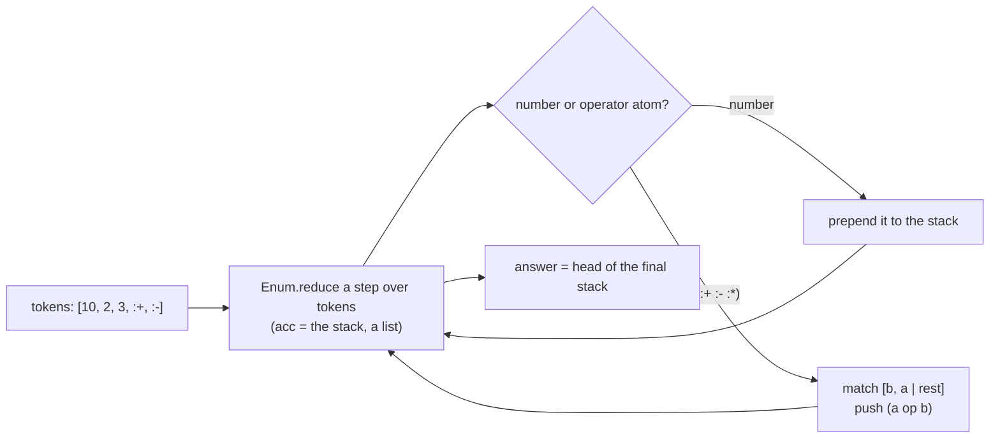

> **Prerequisite: Elixir (`elixir`).** The grader fails loudly, naming the tool, so a missing toolchain never looks like a wrong answer. To get it: install Elixir/OTP (elixir-lang.org).

The capstone pulls the course together into one small, complete **pure module**.
`docs/assignments/42-elixir-capstone/rpn.exs` is a stub; implement `rpn_eval`,
which evaluates a reverse-Polish (postfix) expression — a list of numbers and the
operator atoms `:+`, `:-`, `:*`:

```elixir
rpn_eval([2, 3, :+])        # => 5
rpn_eval([4, 2, :-])        # => 2     (order matters)
rpn_eval([2, 3, 4, :*, :+]) # => 14    (3*4, then +2)
rpn_eval([10, 2, 3, :+, :-])# => 5     (10 - (2+3))
```

`test_rpn.exs` is the spec — an ExUnit suite. **Do not edit it**; make your
implementation pass it. This is a functional problem with a functional shape: a
postfix expression is a stack machine, and a stack machine is a **fold** — carry
the stack (a list) as the accumulator, push numbers, pop-two-and-push on an
operator, and the answer is the head of the final stack:



The operand order is the one gotcha: with a stack, the *second* pop is the left
operand, so `[4, 2, :-]` is `4 - 2 = 2`. Then leave a one-line `DESIGN.md` naming
that shape (the artifact floor: say what you built before you call it done).

```sh
# in the jichi checkout (repository root)
jichi grade docs/assignments/42-elixir-capstone.md
```

---

**Running this task.** Work from the **project root** (the directory that holds `docs/`). Grade with `jichi grade docs/assignments/42-elixir-capstone.md` (or `/grade` in a `/assignment`-loaded session). Stuck? `jichi hint docs/assignments/42-elixir-capstone.md` (or `/hint`) gives one rung at a time — free, and recorded. Any toolchain prerequisite is noted above and in [INDEX.md](INDEX.md).
