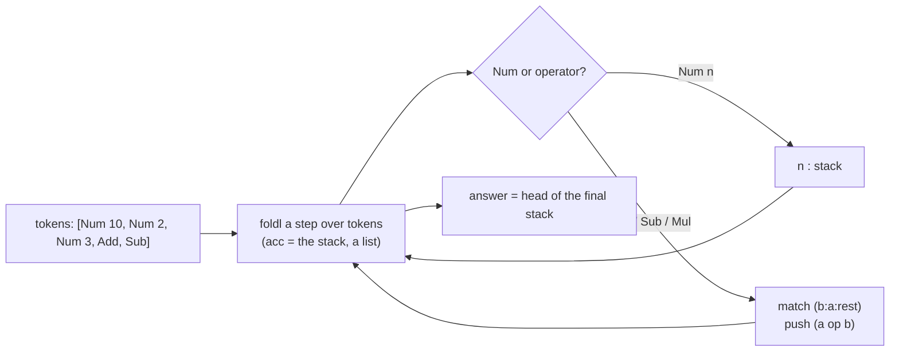

> **Prerequisite: GHC (`runghc`).** The grader fails loudly, naming the tool, so a missing toolchain never looks like a wrong answer. To get it: install GHC (Debian/Ubuntu: `sudo apt install ghc`, or ghcup.haskell.org).

The capstone pulls the course together into one small, complete **pure module**.
`docs/assignments/46-haskell-capstone/Rpn.hs` is a stub; implement `rpnEval`,
which evaluates a reverse-Polish (postfix) expression.

> **Haskell's distinctive move: a sum type for the tokens.** The other courses
> pass operators as symbols/atoms in a mixed list. Haskell is statically typed,
> so a token *is* a value of a `Token` type — `Num Int | Add | Sub | Mul` — and a
> `case`/pattern match on it is **total**: leave a constructor out and the
> compiler warns. That is the reading track's *make illegal states
> unrepresentable* made concrete. The `Token` type and its export are given (the
> suite constructs `Num 2`, `Add`, …); your job is `rpnEval`.

```haskell
rpnEval [Num 2, Num 3, Add]              -- => 5
rpnEval [Num 4, Num 2, Sub]              -- => 2   (order matters)
rpnEval [Num 2, Num 3, Num 4, Mul, Add]  -- => 14  (3*4, then +2)
```

`TestRpn.hs` is the spec — **do not edit it**; make your implementation pass it.
A postfix expression is a stack machine, and a stack machine is a **fold** —
carry the stack (a list) as the accumulator, push numbers, pop-two-and-push on an
operator, and the answer is the head of the final stack:



The operand order is the one gotcha: with a stack, the *second* pop is the left
operand, so `[Num 4, Num 2, Sub]` is `4 - 2 = 2`. Then leave a one-line
`DESIGN.md` naming that shape (the artifact floor: say what you built before you
call it done).

```sh
# in the jichi checkout (repository root)
jichi grade docs/assignments/46-haskell-capstone.md
```

---

**Running this task.** Work from the **project root** (the directory that holds `docs/`). Grade with `jichi grade docs/assignments/46-haskell-capstone.md` (or `/grade` in a `/assignment`-loaded session). Stuck? `jichi hint docs/assignments/46-haskell-capstone.md` (or `/hint`) gives one rung at a time — free, and recorded. Any toolchain prerequisite is noted above and in [INDEX.md](INDEX.md).
